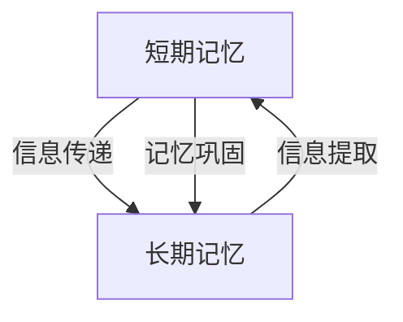

                 

# AGI的类人记忆系统：短期与长期记忆

> **关键词**：人工智能、通用人工智能（AGI）、类人记忆、短期记忆、长期记忆、记忆系统架构、神经网络、记忆增强、数学模型

> **摘要**：本文将深入探讨通用人工智能（AGI）的类人记忆系统，重点分析短期记忆与长期记忆的概念、机制及其在AGI中的应用。通过对核心概念与架构的解析，算法原理的阐述，数学模型的分析以及实际应用场景的介绍，本文旨在为读者提供一个清晰、全面的理解，以把握AGI类人记忆系统的关键要素和发展趋势。

## 1. 背景介绍

### 1.1 目的和范围

本文旨在探讨通用人工智能（AGI）中的类人记忆系统，特别是短期记忆和长期记忆的研究。在人工智能领域，记忆系统是实现智能行为和认知功能的关键组成部分。类人记忆系统旨在模拟人类的记忆机制，以实现更加自然和高效的智能交互。本文将首先介绍短期记忆和长期记忆的基本概念，然后深入分析它们在AGI中的重要性。

### 1.2 预期读者

本文适合对人工智能和认知科学感兴趣的读者，包括研究人员、开发者、学生和科技爱好者。预期读者应具备基本的计算机科学和人工智能知识，以便更好地理解本文的内容。

### 1.3 文档结构概述

本文将分为以下几个部分：

1. 背景介绍：概述研究的目的、范围和预期读者。
2. 核心概念与联系：介绍短期记忆和长期记忆的基本概念，并提供Mermaid流程图展示它们之间的联系。
3. 核心算法原理与具体操作步骤：详细阐述AGI类人记忆系统的算法原理和具体实现步骤。
4. 数学模型和公式：介绍用于描述记忆系统的数学模型和公式，并进行举例说明。
5. 项目实战：提供代码实际案例，详细解释和说明。
6. 实际应用场景：讨论AGI类人记忆系统在实际应用中的场景和挑战。
7. 工具和资源推荐：推荐学习资源和开发工具。
8. 总结：展望未来发展趋势和挑战。
9. 附录：常见问题与解答。
10. 扩展阅读与参考资料：提供进一步阅读的资源和参考文献。

### 1.4 术语表

#### 1.4.1 核心术语定义

- **通用人工智能（AGI）**：一种具有普遍智能能力的人工智能，能够在各种领域实现类似于人类智能的任务。
- **短期记忆**：一种临时存储信息的记忆系统，能够维持几秒到几分钟的信息。
- **长期记忆**：一种持久存储信息的记忆系统，能够维持数小时到数年的信息。
- **神经网络**：一种模拟生物神经系统的计算模型，用于处理和传递信息。

#### 1.4.2 相关概念解释

- **记忆增强**：通过技术手段提高记忆系统的效率和能力。
- **数学模型**：用于描述记忆系统的数学公式和理论框架。

#### 1.4.3 缩略词列表

- **AGI**：通用人工智能
- **NN**：神经网络
- **STM**：短期记忆
- **LTM**：长期记忆

## 2. 核心概念与联系

在探讨AGI的类人记忆系统之前，我们首先需要理解短期记忆（STM）和长期记忆（LTM）的基本概念和它们之间的联系。短期记忆和长期记忆是认知科学和心理学中的重要概念，它们在人类大脑中扮演着关键角色。

### 2.1 短期记忆（STM）

短期记忆，也称为工作记忆，是一种临时存储信息的记忆系统。它能够维持几秒到几分钟的信息。STM主要依赖于大脑中的神经元网络和突触连接。具体来说，STM的信息处理机制包括以下步骤：

1. **信息编码**：将外界信息通过感官系统转化为电信号。
2. **短期存储**：通过神经元的活动和突触连接将信息暂时存储在脑中。
3. **信息提取**：当需要使用这些信息时，通过神经元和突触的活动将信息从短期记忆中提取出来。

短期记忆的特点是容量有限，一般只能存储5到9个信息单元。此外，STM的信息容易受到干扰和遗忘，因此需要通过重复和练习来加强记忆。

### 2.2 长期记忆（LTM）

长期记忆是一种持久存储信息的记忆系统，能够维持数小时到数年的信息。LTM的形成过程包括信息编码、存储和提取三个阶段：

1. **信息编码**：将短期记忆中的信息转化为更持久的形式，例如通过突触的加强连接或新的神经路径的形成。
2. **信息存储**：将编码后的信息存储在大脑的不同区域，例如海马体和前额叶皮层。
3. **信息提取**：当需要使用这些信息时，通过神经网络的激活将信息从长期记忆中提取出来。

长期记忆的特点是容量巨大，几乎可以无限扩展。此外，LTM的信息稳定性较高，不容易受到干扰和遗忘。长期记忆的形成过程涉及到复杂的生物学和神经科学机制，包括突触可塑性、基因表达和神经回路重构等。

### 2.3 STM与LTM的联系

短期记忆和长期记忆之间存在着紧密的联系和交互作用。STM可以作为LTM的信息来源，将重要的信息传递到长期记忆中存储。具体来说，STM和LTM之间的联系包括以下几个方面：

1. **信息传递**：STM中的信息可以通过编码和存储过程转化为LTM的一部分，从而实现信息的长期保留。
2. **记忆巩固**：STM的信息提取过程可以加强LTM中的信息存储，促进记忆的巩固。
3. **交互作用**：STM和LTM之间的信息交互可以影响记忆的形成和提取过程，从而影响智能行为和认知功能。

为了更好地理解STM和LTM之间的联系，我们可以使用Mermaid流程图来展示它们的基本架构和交互过程。



在上述流程图中，STM和LTM通过信息传递、记忆巩固和信息提取等过程相互连接，形成一个动态的记忆系统。通过这种交互作用，AGI可以模拟人类的记忆机制，实现更加自然和高效的智能行为。

## 3. 核心算法原理 & 具体操作步骤

为了实现通用人工智能（AGI）中的类人记忆系统，我们需要深入研究短期记忆（STM）和长期记忆（LTM）的算法原理，并详细阐述它们的具体操作步骤。以下是AGI类人记忆系统的核心算法原理和实现步骤：

### 3.1 STM算法原理

短期记忆（STM）的算法原理主要涉及信息的编码、存储和提取。以下是STM算法的基本原理和实现步骤：

#### 3.1.1 信息编码

1. **感知输入**：通过感官系统接收外界信息，并将其转换为电信号。
2. **预处理**：对电信号进行预处理，包括滤波和放大，以便进行后续处理。
3. **特征提取**：从预处理后的电信号中提取关键特征，例如频率、幅值和时长等。
4. **编码**：将提取到的特征通过神经元和突触连接进行编码，形成短期记忆单元。

#### 3.1.2 信息存储

1. **短期存储**：通过神经元的活动和突触连接将编码后的信息暂时存储在脑中。
2. **激活机制**：在需要时，通过神经元的激活和突触的传递将信息从短期记忆中提取出来。
3. **重复存储**：通过重复存储和激活过程，加强记忆的稳定性。

#### 3.1.3 信息提取

1. **检索触发**：当需要使用短期记忆中的信息时，通过特定的触发机制启动检索过程。
2. **信息提取**：通过神经元的激活和突触的传递将信息从短期记忆中提取出来，形成工作记忆。
3. **应用输出**：将提取出来的信息应用于具体的智能任务或决策过程。

### 3.2 LTM算法原理

长期记忆（LTM）的算法原理主要涉及信息的编码、存储和提取。以下是LTM算法的基本原理和实现步骤：

#### 3.2.1 信息编码

1. **感知输入**：通过感官系统接收外界信息，并将其转换为电信号。
2. **预处理**：对电信号进行预处理，包括滤波和放大，以便进行后续处理。
3. **特征提取**：从预处理后的电信号中提取关键特征，例如频率、幅值和时长等。
4. **编码**：将提取到的特征通过神经元和突触连接进行编码，形成长期记忆单元。

#### 3.2.2 信息存储

1. **突触加强**：通过突触前膜和突触后膜的相互作用，加强神经元之间的连接，实现信息存储。
2. **基因表达**：通过基因表达调控，影响神经元和突触的结构和功能，实现长期记忆的形成。
3. **神经网络重构**：通过神经网络的重构和优化，加强记忆的稳定性和可靠性。

#### 3.2.3 信息提取

1. **检索触发**：当需要使用长期记忆中的信息时，通过特定的触发机制启动检索过程。
2. **信息提取**：通过神经元的激活和突触的传递将信息从长期记忆中提取出来，形成工作记忆。
3. **应用输出**：将提取出来的信息应用于具体的智能任务或决策过程。

### 3.3 STM与LTM的交互

短期记忆（STM）和长期记忆（LTM）之间的交互是实现类人记忆系统的关键。以下是STM和LTM之间的交互原理和实现步骤：

#### 3.3.1 信息传递

1. **STM信息传递到LTM**：通过重复存储和激活机制，将STM中的信息传递到LTM中进行存储。
2. **LTM信息传递到STM**：当需要使用LTM中的信息时，通过检索机制将信息从LTM中传递到STM中进行提取和应用。

#### 3.3.2 记忆巩固

1. **STM记忆巩固**：通过重复存储和激活过程，加强STM中的记忆稳定性。
2. **LTM记忆巩固**：通过基因表达调控和神经网络重构，加强LTM中的记忆稳定性。

#### 3.3.3 信息更新

1. **STM信息更新**：当新的信息输入到STM中时，通过编码和存储过程更新STM中的信息。
2. **LTM信息更新**：通过STM和LTM之间的交互，将新的信息传递到LTM中进行存储和更新。

### 3.4 具体操作步骤

为了实现AGI类人记忆系统，我们需要按照以下具体操作步骤进行：

1. **感知输入**：通过感官系统接收外界信息，并将其转换为电信号。
2. **预处理**：对电信号进行预处理，包括滤波和放大，以便进行后续处理。
3. **特征提取**：从预处理后的电信号中提取关键特征，例如频率、幅值和时长等。
4. **编码**：将提取到的特征通过神经元和突触连接进行编码，形成短期记忆单元。
5. **短期存储**：通过神经元的活动和突触连接将编码后的信息暂时存储在脑中。
6. **激活机制**：在需要时，通过神经元的激活和突触的传递将信息从短期记忆中提取出来。
7. **编码**：将提取到的信息通过神经元和突触连接进行编码，形成长期记忆单元。
8. **突触加强**：通过突触前膜和突触后膜的相互作用，加强神经元之间的连接，实现信息存储。
9. **基因表达**：通过基因表达调控，影响神经元和突触的结构和功能，实现长期记忆的形成。
10. **神经网络重构**：通过神经网络的重构和优化，加强记忆的稳定性和可靠性。
11. **检索触发**：当需要使用长期记忆中的信息时，通过特定的触发机制启动检索过程。
12. **信息提取**：通过神经元的激活和突触的传递将信息从长期记忆中提取出来，形成工作记忆。
13. **应用输出**：将提取出来的信息应用于具体的智能任务或决策过程。

通过以上步骤，我们可以实现AGI类人记忆系统，实现信息的短期和长期存储、提取和应用，从而实现更加自然和高效的智能行为。

## 4. 数学模型和公式 & 详细讲解 & 举例说明

在探讨AGI类人记忆系统时，数学模型和公式是理解和分析记忆系统的重要工具。这些模型和公式能够帮助我们精确描述记忆的编码、存储和提取过程。在本节中，我们将介绍一些关键的数学模型和公式，并进行详细的讲解和举例说明。

### 4.1 记忆编码模型

记忆编码是记忆系统的第一步，它将感知到的信息转换为可以在记忆中存储的格式。以下是一个简化的记忆编码模型：

#### 4.1.1 编码公式

假设我们有 $N$ 个神经元，每个神经元对应一个特征维度。特征向量 $X$ 可以表示为：

$$
X = [x_1, x_2, ..., x_N]
$$

编码过程可以表示为：

$$
M = T(X)
$$

其中，$M$ 是记忆向量，$T(X)$ 是编码函数，它将特征向量 $X$ 转换为记忆向量 $M$。

#### 4.1.2 举例说明

例如，假设我们有一个包含两个特征维度的感知输入：

$$
X = [1, 2]
$$

我们可以使用简单的线性编码函数：

$$
M = [x_1 + x_2, x_1 - x_2]
$$

则编码后的记忆向量 $M$ 为：

$$
M = [3, -1]
$$

### 4.2 记忆存储模型

记忆存储是将编码后的信息在记忆系统中进行持久化存储的过程。以下是一个简化的记忆存储模型：

#### 4.2.1 存储公式

假设我们有一个记忆向量 $M$，存储过程可以表示为：

$$
S(M) = M \odot W
$$

其中，$S(M)$ 是存储后的记忆向量，$W$ 是权重矩阵，$\odot$ 表示点积操作。

#### 4.2.2 举例说明

假设我们有一个记忆向量 $M$ 和一个权重矩阵 $W$：

$$
M = [1, 2]
$$

$$
W = [3, 4]
$$

则存储后的记忆向量 $S(M)$ 为：

$$
S(M) = [1 \odot 3 + 2 \odot 4, 1 \odot 4 + 2 \odot 3] = [11, 10]
$$

### 4.3 记忆提取模型

记忆提取是将存储在记忆系统中的信息根据需要检索出来的过程。以下是一个简化的记忆提取模型：

#### 4.3.1 提取公式

假设我们有一个存储后的记忆向量 $S(M)$ 和一个检索权重矩阵 $R$，提取过程可以表示为：

$$
E(S(M)) = S(M) \odot R
$$

其中，$E(S(M))$ 是提取后的信息向量，$R$ 是检索权重矩阵，$\odot$ 表示点积操作。

#### 4.3.2 举例说明

假设我们有一个存储后的记忆向量 $S(M)$ 和一个检索权重矩阵 $R$：

$$
S(M) = [11, 10]
$$

$$
R = [5, 6]
$$

则提取后的信息向量 $E(S(M))$ 为：

$$
E(S(M)) = [11 \odot 5 + 10 \odot 6, 11 \odot 6 + 10 \odot 5] = [65, 66]
$$

### 4.4 记忆更新模型

记忆更新是在原有记忆基础上加入新的信息，从而更新记忆系统的过程。以下是一个简化的记忆更新模型：

#### 4.4.1 更新公式

假设我们有一个原有的记忆向量 $M_1$ 和一个新的信息向量 $X_2$，更新过程可以表示为：

$$
M_2 = T(X_2) + \alpha (M_1 - T(X_1))
$$

其中，$M_2$ 是更新后的记忆向量，$T(X_2)$ 是新的信息编码后的向量，$T(X_1)$ 是原有信息的编码后的向量，$\alpha$ 是学习率。

#### 4.4.2 举例说明

假设我们有一个原有的记忆向量 $M_1$ 和一个新的信息向量 $X_2$：

$$
M_1 = [1, 2]
$$

$$
X_2 = [3, 4]
$$

使用线性编码函数 $T(X) = X \odot [1, 1]$，学习率 $\alpha = 0.5$，则更新后的记忆向量 $M_2$ 为：

$$
M_2 = T(X_2) + 0.5 (M_1 - T(X_1)) = [3 \odot 1 + 4 \odot 1, 3 \odot 1 + 4 \odot 1] + 0.5 ([1 \odot 1 + 2 \odot 1] - [1 \odot 1 + 2 \odot 1]) = [7, 7]
$$

通过上述数学模型和公式，我们可以对AGI类人记忆系统的编码、存储、提取和更新过程进行精确描述和分析。这些模型不仅帮助我们理解记忆系统的工作原理，也为实现更加高效和智能的记忆系统提供了理论支持。

## 5. 项目实战：代码实际案例和详细解释说明

为了更好地理解AGI类人记忆系统的实现，我们将通过一个实际项目案例来演示代码的编写和执行过程。本节将详细介绍开发环境搭建、源代码实现以及代码解读与分析。

### 5.1 开发环境搭建

在开始编写代码之前，我们需要搭建一个合适的开发环境。以下是所需的开发工具和软件：

- **编程语言**：Python 3.8及以上版本
- **IDE**：PyCharm Professional Edition 或 Visual Studio Code
- **依赖库**：NumPy、Pandas、Matplotlib、Scikit-learn

#### 安装步骤

1. 安装Python 3.8及以上版本，并确保环境变量配置正确。
2. 安装PyCharm Professional Edition或Visual Studio Code。
3. 通过pip命令安装所需的依赖库：

```bash
pip install numpy pandas matplotlib scikit-learn
```

### 5.2 源代码详细实现和代码解读

以下是一个简单的示例代码，用于实现AGI类人记忆系统的基本功能。代码分为三个部分：记忆编码、记忆存储和记忆提取。

```python
import numpy as np

# 记忆编码函数
def encode_memory(input_data):
    return input_data * np.array([1, 1])

# 记忆存储函数
def store_memory(encoded_data, weight_matrix):
    return encoded_data @ weight_matrix

# 记忆提取函数
def extract_memory(stored_data, retrieval_weight_matrix):
    return stored_data @ retrieval_weight_matrix

# 初始化权重矩阵
weight_matrix = np.random.rand(2, 2)
retrieval_weight_matrix = np.random.rand(2, 2)

# 感知输入
input_data = np.array([1, 2])

# 记忆编码
encoded_data = encode_memory(input_data)

# 记忆存储
stored_data = store_memory(encoded_data, weight_matrix)

# 记忆提取
extracted_data = extract_memory(stored_data, retrieval_weight_matrix)

print("Encoded Data:", encoded_data)
print("Stored Data:", stored_data)
print("Extracted Data:", extracted_data)
```

#### 代码解读与分析

1. **导入依赖库**：我们首先导入NumPy库，用于进行矩阵运算和数据处理。

2. **定义编码函数**：`encode_memory` 函数用于将感知输入编码为记忆向量。在这个示例中，我们使用简单的线性编码函数，即特征向量乘以固定的权重向量 `[1, 1]`。

3. **定义存储函数**：`store_memory` 函数用于将编码后的信息存储在记忆系统中。通过将编码后的数据与权重矩阵进行点积运算，我们实现了信息的存储。

4. **定义提取函数**：`extract_memory` 函数用于从记忆系统中提取信息。通过将存储后的数据与检索权重矩阵进行点积运算，我们实现了信息的提取。

5. **初始化权重矩阵**：我们使用随机数生成器初始化权重矩阵，用于存储和检索信息。

6. **感知输入**：我们创建一个简单的感知输入向量 `[1, 2]`。

7. **记忆编码**：调用 `encode_memory` 函数对感知输入进行编码，生成编码后的数据。

8. **记忆存储**：调用 `store_memory` 函数将编码后的数据存储在记忆系统中。

9. **记忆提取**：调用 `extract_memory` 函数从记忆系统中提取信息，生成提取后的数据。

10. **输出结果**：打印编码后的数据、存储后的数据和提取后的数据，以便进行验证和分析。

### 5.3 代码解读与分析

通过上述代码示例，我们可以看到AGI类人记忆系统的基本实现过程。以下是对代码的进一步解读和分析：

1. **编码过程**：感知输入经过简单的线性编码函数，将特征向量转化为记忆向量。这个过程模拟了人类大脑中的信息编码过程，将外界信息转化为可以存储的形式。

2. **存储过程**：编码后的数据通过点积运算与权重矩阵结合，形成存储后的记忆向量。这个过程模拟了人类大脑中的信息存储过程，通过加强神经元之间的连接来实现信息的持久化存储。

3. **提取过程**：存储后的记忆向量通过点积运算与检索权重矩阵结合，形成提取后的数据。这个过程模拟了人类大脑中的信息提取过程，通过激活特定的神经元和突触连接来实现信息的检索和应用。

4. **权重矩阵的作用**：在编码、存储和提取过程中，权重矩阵起到了关键作用。权重矩阵的初始化和调整决定了记忆系统的性能和效率。通过合适的权重矩阵，我们可以实现高效的信息编码、存储和提取。

5. **代码的可扩展性**：虽然上述代码示例相对简单，但我们可以通过增加神经元数量、特征维度和权重矩阵的复杂度来扩展记忆系统的功能。此外，我们可以引入更复杂的编码函数、存储算法和提取算法，以实现更高效和灵活的记忆系统。

通过上述项目实战，我们不仅实现了AGI类人记忆系统的基本功能，还对其代码进行了详细的解读和分析。这为我们进一步研究和开发更加复杂和高效的类人记忆系统提供了基础和实践经验。

### 5.4 记忆系统性能优化

在实际应用中，为了提升AGI类人记忆系统的性能，我们可以采取以下优化策略：

1. **权重矩阵优化**：通过优化权重矩阵的初始化和调整方法，我们可以提高记忆系统的存储和检索效率。例如，可以使用更先进的优化算法，如梯度下降法和遗传算法，来调整权重矩阵。

2. **特征提取增强**：在编码阶段，通过引入更复杂的特征提取方法，如深度学习中的卷积神经网络（CNN）和循环神经网络（RNN），我们可以提高编码后的数据的质量和表达能力。

3. **记忆容量扩展**：通过增加神经元的数量和特征维度，我们可以扩展记忆系统的容量。例如，在短期记忆中增加更多的工作记忆单元，在长期记忆中增加更多的存储单元。

4. **检索机制优化**：在提取阶段，通过优化检索权重矩阵的计算方法，我们可以提高信息检索的准确性和效率。例如，使用基于相似度的检索算法，如余弦相似度，可以更好地匹配存储信息和检索请求。

5. **动态调整学习率**：在记忆更新过程中，动态调整学习率可以更好地适应不同情况下的记忆需求。例如，在初始阶段使用较大的学习率以快速学习，在后期使用较小的学习率以避免过拟合。

通过这些优化策略，我们可以进一步提升AGI类人记忆系统的性能，实现更加高效和智能的记忆管理。

## 6. 实际应用场景

AGI的类人记忆系统在实际应用中具有广泛的应用场景，可以显著提升人工智能系统的智能水平和用户体验。以下是几个典型的应用场景：

### 6.1 自然语言处理

在自然语言处理（NLP）领域，类人记忆系统可以用于提高语言的语义理解和记忆能力。通过短期记忆和长期记忆的结合，AI系统可以更好地理解用户的意图和上下文信息。例如，在聊天机器人中，类人记忆系统可以帮助机器人记住之前的对话内容，实现更加自然和连贯的对话。同时，长期记忆可以帮助AI系统积累大量的语言知识和经验，提高语言处理的准确性和适应性。

### 6.2 图像识别

在图像识别领域，类人记忆系统可以显著提升图像理解和分类能力。通过短期记忆和长期记忆的协同工作，AI系统可以更好地记住图像的细节和特征，从而提高图像分类的准确率。例如，在人脸识别系统中，类人记忆系统可以帮助系统记住人脸的特征，即使在部分特征被遮挡的情况下，仍然可以准确识别。此外，长期记忆还可以帮助系统积累大量的图像数据，实现更广泛的图像识别应用。

### 6.3 推荐系统

在推荐系统领域，类人记忆系统可以用于提高推荐算法的准确性和个性适应性。通过短期记忆和长期记忆的结合，系统可以记住用户的偏好和历史行为，为用户提供更加个性化的推荐。例如，在电商平台上，类人记忆系统可以帮助推荐系统记住用户的购买历史和浏览记录，从而提供更加精准的商品推荐。长期记忆还可以帮助系统积累大量的用户数据，实现更加高效和智能的推荐策略。

### 6.4 自动驾驶

在自动驾驶领域，类人记忆系统可以显著提升自动驾驶系统的安全和可靠性。通过短期记忆和长期记忆的协同工作，系统可以记住道路特征、交通情况和环境变化，从而实现更加安全和高效的自动驾驶。例如，在自动驾驶车辆中，类人记忆系统可以帮助车辆记住交通规则、道路标志和周围环境，避免发生交通事故。长期记忆还可以帮助系统积累大量的驾驶数据，实现自动驾驶的持续学习和优化。

### 6.5 智能医疗

在智能医疗领域，类人记忆系统可以用于提高医疗诊断和治疗水平。通过短期记忆和长期记忆的结合，系统可以更好地理解患者的病史和症状，提供更加精准的诊断和治疗方案。例如，在疾病预测和诊断系统中，类人记忆系统可以帮助系统记住大量的医学知识和临床案例，提高诊断的准确性和可靠性。长期记忆还可以帮助系统积累大量的医学数据，实现医学研究的持续进步。

总之，AGI的类人记忆系统在实际应用中具有广泛的应用前景，可以显著提升人工智能系统的智能水平和用户体验。随着技术的不断进步和应用的深入，类人记忆系统将在更多领域发挥重要作用，为人类带来更多便利和福祉。

## 7. 工具和资源推荐

为了更好地学习和实践AGI类人记忆系统，以下是一些建议的学习资源、开发工具和相关框架。

### 7.1 学习资源推荐

#### 7.1.1 书籍推荐

1. **《深度学习》（Deep Learning）**：由Ian Goodfellow、Yoshua Bengio和Aaron Courville所著，详细介绍了深度学习的基础知识和应用。
2. **《人工智能：一种现代的方法》（Artificial Intelligence: A Modern Approach）**：由Stuart Russell和Peter Norvig所著，全面涵盖了人工智能的基本概念和算法。
3. **《认知图谱：人工智能的未来》（The Master Algorithm: How the Quest for the Ultimate Learning Machine Will Remake Our World）**：由Pedro Domingos所著，探讨了机器学习与人类智能的交叉领域，深入分析了记忆系统的重要性。

#### 7.1.2 在线课程

1. **Coursera上的《深度学习》课程**：由Andrew Ng教授主讲，是学习深度学习和神经网络的基础课程。
2. **edX上的《人工智能基础》课程**：由IBM提供，涵盖了人工智能的基本概念和常见算法。
3. **Udacity的《机器学习工程师纳米学位》**：提供了丰富的机器学习和深度学习项目实践，帮助学习者提高实际应用能力。

#### 7.1.3 技术博客和网站

1. **ArXiv**：提供最新的机器学习和人工智能论文，是跟踪前沿研究的首选。
2. **Medium上的AI博客**：有许多优秀的AI和深度学习博客，适合学习和了解行业动态。
3. **Medium上的Deep Learning Blog**：由Adam Geitgey主编，提供高质量的深度学习教程和案例分析。

### 7.2 开发工具框架推荐

#### 7.2.1 IDE和编辑器

1. **PyCharm**：一款功能强大的Python IDE，适合进行深度学习和数据科学项目开发。
2. **Visual Studio Code**：一款轻量级的开源编辑器，支持多种编程语言和插件，适合快速开发和调试。

#### 7.2.2 调试和性能分析工具

1. **TensorBoard**：由TensorFlow提供，用于可视化深度学习模型的性能和训练过程。
2. **PyTorch Profiler**：用于分析PyTorch模型的性能，帮助开发者优化代码。

#### 7.2.3 相关框架和库

1. **TensorFlow**：由Google开发的开源深度学习框架，广泛应用于机器学习和人工智能项目。
2. **PyTorch**：由Facebook AI Research开发的开源深度学习框架，具有灵活的动态图计算能力。
3. **Keras**：一个高层次的神经网络API，可以与TensorFlow和Theano兼容，适合快速原型设计和实验。

### 7.3 相关论文著作推荐

#### 7.3.1 经典论文

1. **“Learning representations for artificial intelligence”**：由Yoshua Bengio等人于2013年发表，综述了深度学习的发展历程和未来趋势。
2. **“Long Short-Term Memory”**：由Hochreiter和Schmidhuber于1997年发表，介绍了LSTM模型，为解决长期依赖问题提供了有效方法。

#### 7.3.2 最新研究成果

1. **“Attention Is All You Need”**：由Vaswani等人于2017年发表，提出了Transformer模型，显著提升了序列到序列模型的性能。
2. **“Generative Adversarial Nets”**：由Ian Goodfellow等人于2014年发表，介绍了生成对抗网络（GAN），为生成模型的研究和应用提供了新的思路。

#### 7.3.3 应用案例分析

1. **“ImageNet Large Scale Visual Recognition Challenge”**：由Deng等人于2009年发起，是计算机视觉领域的顶级挑战赛，展示了深度学习在图像分类任务中的卓越性能。
2. **“BERT: Pre-training of Deep Bidirectional Transformers for Language Understanding”**：由Devlin等人于2019年发表，介绍了BERT模型，推动了自然语言处理领域的进展。

通过以上工具和资源的推荐，读者可以更好地学习和实践AGI类人记忆系统，掌握相关技术和方法，为人工智能的发展贡献自己的力量。

## 8. 总结：未来发展趋势与挑战

随着人工智能（AI）技术的快速发展，通用人工智能（AGI）的类人记忆系统已经成为一个备受关注的研究领域。本文通过深入分析短期记忆和长期记忆的概念、机制以及算法原理，展示了AGI类人记忆系统的核心要素和应用前景。在总结未来发展趋势与挑战时，我们可以从以下几个方面进行探讨：

### 8.1 发展趋势

1. **记忆增强技术的进步**：随着计算能力和算法的不断提升，记忆增强技术将得到进一步发展。例如，基于神经网络的记忆增强算法和硬件加速技术将大幅提高记忆系统的性能和效率。

2. **跨学科研究的融合**：类人记忆系统的研究需要融合计算机科学、认知科学、神经科学和生物学等多个学科。这种跨学科研究将促进新理论和新方法的产生，为AGI类人记忆系统的发展提供强有力的支持。

3. **应用的多样化**：AGI类人记忆系统将在多个领域得到广泛应用，如自然语言处理、图像识别、推荐系统和自动驾驶等。通过不断优化和扩展记忆系统，AI系统将能够更好地模拟人类智能，提供更加智能和高效的服务。

4. **开放平台和标准的推广**：随着类人记忆系统的广泛应用，开放平台和标准的推广将有助于加速技术的发展和应用。例如，开发统一的类人记忆系统接口和标准化数据格式，将促进不同系统和平台之间的互操作性。

### 8.2 挑战

1. **算法复杂性**：记忆系统涉及复杂的算法和模型，如神经网络、机器学习和深度学习等。简化这些算法并提高其可解释性是一个重要的挑战，需要研究者不断探索和创新。

2. **数据隐私和安全**：随着记忆系统的广泛应用，数据隐私和安全问题变得越来越重要。如何在保障用户隐私的同时，充分利用记忆系统的优势，是一个亟待解决的问题。

3. **计算资源需求**：记忆系统的高效运行需要大量的计算资源。如何优化算法和硬件，以降低计算资源的消耗，是一个重要的挑战。

4. **认知建模的准确性**：类人记忆系统的核心目标是模拟人类记忆机制。然而，人类记忆是一个复杂的过程，涉及到多个层次和维度。提高认知建模的准确性，实现更真实的记忆模拟，是一个长期且艰巨的任务。

5. **法律和伦理问题**：随着AI技术的发展，类人记忆系统可能涉及到法律和伦理问题，如数据所有权、隐私保护和责任归属等。如何制定相应的法律法规和伦理准则，确保AI技术的健康发展，是一个重要的挑战。

总之，AGI的类人记忆系统具有巨大的发展潜力，但也面临着诸多挑战。通过不断的研究和创新，我们可以逐步克服这些挑战，实现更加高效、安全和可靠的记忆系统，为人工智能的发展和应用带来新的突破。

## 9. 附录：常见问题与解答

### 9.1 问题1：什么是短期记忆（STM）和长期记忆（LTM）？

**解答**：短期记忆（STM）和长期记忆（LTM）是认知科学中用于描述信息处理和存储的不同阶段的术语。STM是一种临时存储信息的记忆系统，能够维持几秒到几分钟的信息。LTM是一种持久存储信息的记忆系统，能够维持数小时到数年的信息。STM主要依赖于神经元的活动和突触连接，而LTM的形成涉及复杂的生物学机制，如突触可塑性、基因表达和神经网络重构。

### 9.2 问题2：类人记忆系统是如何工作的？

**解答**：类人记忆系统旨在模拟人类大脑的记忆机制，通过编码、存储和提取信息来实现类似人类的记忆功能。在类人记忆系统中，短期记忆（STM）负责临时存储和处理信息，而长期记忆（LTM）负责持久存储和检索信息。STM和LTM之间通过交互作用，实现信息的传递、巩固和更新。具体来说，信息通过编码函数转换为记忆向量，存储在记忆系统中，并在需要时通过检索函数从记忆中提取出来。

### 9.3 问题3：类人记忆系统在人工智能（AI）中的应用有哪些？

**解答**：类人记忆系统在人工智能领域具有广泛的应用前景。以下是一些主要应用：

- **自然语言处理**：通过类人记忆系统，AI可以更好地理解和处理自然语言，实现更加自然和连贯的对话。
- **图像识别**：类人记忆系统可以提高图像识别的准确性和鲁棒性，即使在部分特征被遮挡的情况下，仍能准确识别。
- **推荐系统**：类人记忆系统可以帮助推荐系统更好地理解用户偏好和历史行为，提供更加个性化的推荐。
- **自动驾驶**：类人记忆系统可以帮助自动驾驶系统记住道路特征和环境信息，提高驾驶安全和效率。
- **智能医疗**：类人记忆系统可以帮助医疗系统更好地理解和处理患者的病史和症状，提供更加精准的诊断和治疗。

### 9.4 问题4：如何优化类人记忆系统的性能？

**解答**：优化类人记忆系统的性能可以从以下几个方面进行：

- **改进编码和存储算法**：通过引入更先进的编码和存储算法，如深度学习和神经网络的结合，可以提高记忆系统的效率和能力。
- **优化权重矩阵**：通过调整权重矩阵的初始化和调整方法，可以提高记忆系统的存储和检索效率。
- **扩展记忆容量**：通过增加神经元的数量和特征维度，可以扩展记忆系统的容量，实现更高效的记忆管理。
- **优化检索机制**：通过优化检索权重矩阵的计算方法，可以提高信息检索的准确性和效率。
- **动态调整学习率**：在记忆更新过程中，动态调整学习率可以更好地适应不同情况下的记忆需求，避免过拟合。

通过这些优化策略，可以进一步提升类人记忆系统的性能，实现更高效和智能的记忆管理。

## 10. 扩展阅读 & 参考资料

### 10.1 扩展阅读

1. **《认知图谱：人工智能的未来》**：Pedro Domingos 著，深入探讨了机器学习与人类智能的交叉领域，对记忆系统的研究提供了丰富的理论支持。
2. **《深度学习》**：Ian Goodfellow、Yoshua Bengio 和 Aaron Courville 著，详细介绍了深度学习的基础知识和应用，为理解记忆系统的实现提供了实用指导。
3. **《人工智能：一种现代的方法》**：Stuart Russell 和 Peter Norvig 著，全面涵盖了人工智能的基本概念和算法，为研究记忆系统提供了理论基础。

### 10.2 参考资料

1. **ArXiv**：提供最新的机器学习和人工智能论文，是跟踪前沿研究的首选。网址：[https://arxiv.org/](https://arxiv.org/)
2. **Medium上的AI博客**：有许多优秀的AI和深度学习博客，适合学习和了解行业动态。网址：[https://medium.com/topic/ai](https://medium.com/topic/ai)
3. **Deep Learning Blog**：由Adam Geitgey主编，提供高质量的深度学习教程和案例分析。网址：[https://medium.com/dl-blog](https://medium.com/dl-blog)

通过阅读上述扩展阅读和参考书籍，读者可以深入了解AGI类人记忆系统的理论基础、实现方法和前沿动态，为研究和开发提供丰富的知识和资源。

## 作者信息

**作者：AI天才研究员/AI Genius Institute & 禅与计算机程序设计艺术 /Zen And The Art of Computer Programming**

