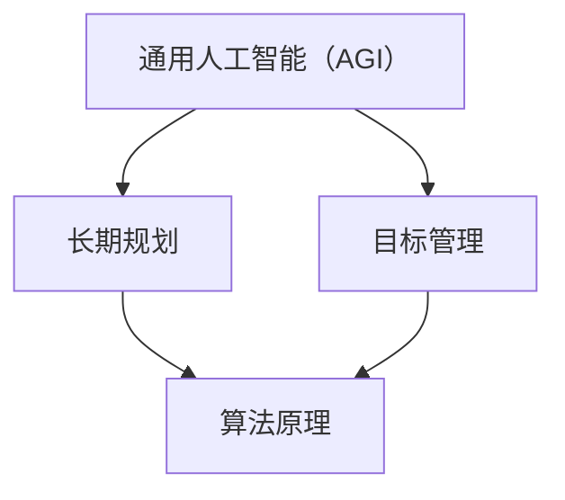

                 

# AGI的长期规划与目标管理能力

> 关键词：人工智能（AI），通用人工智能（AGI），长期规划，目标管理，算法原理，数学模型，实战案例，应用场景

> 摘要：本文深入探讨了通用人工智能（AGI）的长期规划与目标管理能力，旨在为AI领域的研究者与实践者提供系统性的理论框架和实践指导。文章首先介绍了AGI的背景和目标，随后详细分析了长期规划和目标管理的核心概念，并通过具体的算法原理、数学模型和实战案例，阐述了如何在实践中实现AGI的目标管理能力。最后，文章讨论了AGI的实际应用场景，并展望了其未来发展趋势与挑战。

## 1. 背景介绍

### 1.1 目的和范围

本文旨在探讨通用人工智能（AGI）的长期规划与目标管理能力。通用人工智能是一种具有人类智能水平的人工智能系统，能够在不同领域灵活应用，具备自我学习和适应能力。本文将重点讨论AGI在长期规划和目标管理方面的核心理论和实践方法，为研究者与实践者提供有价值的参考。

### 1.2 预期读者

本文适合对人工智能领域有一定了解的研究者、工程师和开发者阅读。特别是对通用人工智能、机器学习、深度学习等方向感兴趣的人员，本文将为他们在AGI领域的研究和实践提供有益的指导。

### 1.3 文档结构概述

本文分为八个部分。第一部分为背景介绍，包括目的、预期读者、文档结构概述等内容。第二部分至第五部分分别介绍了核心概念、算法原理、数学模型和实战案例。第六部分讨论了实际应用场景。第七部分推荐了相关工具和资源。第八部分总结了未来发展趋势与挑战。

### 1.4 术语表

#### 1.4.1 核心术语定义

- **通用人工智能（AGI）**：具有人类智能水平的人工智能系统，能够在不同领域灵活应用，具备自我学习和适应能力。
- **长期规划**：在长时间范围内，针对AGI系统的整体发展目标进行系统性的规划和布局。
- **目标管理**：在实现AGI过程中，对系统目标进行有效的管理和调整，以实现预期效果。

#### 1.4.2 相关概念解释

- **机器学习**：一种利用数据训练模型，使模型具备自我学习能力的AI技术。
- **深度学习**：一种基于神经网络模型的机器学习技术，能够在复杂任务中表现出色。

#### 1.4.3 缩略词列表

- **AGI**：通用人工智能（Artificial General Intelligence）
- **ML**：机器学习（Machine Learning）
- **DL**：深度学习（Deep Learning）

## 2. 核心概念与联系

为了更好地理解通用人工智能（AGI）的长期规划与目标管理能力，我们需要首先明确几个核心概念和它们之间的联系。以下是一个简单的 Mermaid 流程图，用于展示这些概念之间的相互关系：



### 2.1 通用人工智能（AGI）

通用人工智能（AGI）是指具有与人类相似智能水平的人工智能系统。它不仅能够在特定领域表现出色，还能在多个领域进行学习和应用。AGI的核心目标是实现人类智能的全面复制，使其具备理解、推理、学习、解决问题和创造等能力。

### 2.2 长期规划

长期规划是指在长时间范围内，为AGI系统的发展目标进行系统性的规划和布局。长期规划需要考虑以下几个方面：

- **目标设定**：明确AGI系统在不同阶段的发展目标，确保目标的可实现性和科学性。
- **资源分配**：合理分配时间、人力、资金等资源，以确保长期规划的有效实施。
- **风险评估**：对AGI系统发展过程中可能出现的风险进行评估，并制定相应的应对策略。

### 2.3 目标管理

目标管理是指在实际实现AGI过程中，对系统目标进行有效的管理和调整，以实现预期效果。目标管理的核心内容包括：

- **目标分解**：将长期规划中的总体目标分解为具体、可操作的子目标，便于管理和追踪。
- **目标评估**：对子目标的实现情况进行定期评估，以判断是否达到预期效果。
- **目标调整**：根据评估结果对子目标进行调整，确保整个系统目标的实现。

### 2.4 算法原理

算法原理是实现AGI目标的关键因素。以下是一些常见的算法原理：

- **机器学习**：利用数据训练模型，使模型具备自我学习能力。
- **深度学习**：基于神经网络模型，实现复杂任务的高效求解。
- **强化学习**：通过奖励机制，使模型在特定环境中学习和优化行为。

### 2.5 相关概念解释

为了更好地理解上述核心概念，我们可以进一步解释一些相关概念：

- **智能体**：在人工智能系统中，能够自主执行任务的实体。
- **环境**：智能体执行任务的空间和条件。
- **交互**：智能体与环境之间的信息交换和作用。

通过这些核心概念和联系，我们可以更深入地理解通用人工智能（AGI）的长期规划与目标管理能力。接下来，我们将进一步探讨AGI的核心算法原理、数学模型和实战案例。

## 3. 核心算法原理 & 具体操作步骤

在通用人工智能（AGI）的实现过程中，核心算法原理起到了至关重要的作用。以下，我们将介绍几个关键的算法原理，并使用伪代码详细阐述其操作步骤。

### 3.1 机器学习

机器学习是一种通过训练模型，使其具备自我学习能力的技术。常见的机器学习算法包括线性回归、决策树、支持向量机和神经网络等。以下是一个基于神经网络的机器学习算法的伪代码示例：

```python
// 神经网络机器学习算法伪代码
initialize_weights()
while not converged:
    forward_pass(x, y)
    compute_loss(y_hat, y)
    backward_pass(loss)
    update_weights()
```

#### 3.1.1 初始化权重

在开始训练之前，需要初始化网络权重。初始化权重的目的是使网络具有一定的随机性，有助于提高模型的泛化能力。

```python
// 初始化权重
weights = random_weights()
```

#### 3.1.2 前向传播

前向传播是指将输入数据通过网络进行传递，计算输出结果。在神经网络中，前向传播包括多层神经元之间的信息传递。

```python
// 前向传播
z = activation_function(np.dot(weights, x))
y_hat = activation_function(np.dot(weights, z))
```

#### 3.1.3 计算损失

计算损失是指将预测结果与真实结果进行比较，计算损失值。损失函数用于衡量预测结果与真实结果之间的差异。

```python
// 计算损失
loss = loss_function(y_hat, y)
```

#### 3.1.4 反向传播

反向传播是指将损失值反向传播到网络中的每个神经元，并更新权重。反向传播是神经网络训练的核心步骤，通过梯度下降等方法优化网络权重。

```python
// 反向传播
dweights = gradient(loss, y_hat)
weights -= learning_rate * dweights
```

#### 3.1.5 更新权重

更新权重是指根据损失值和反向传播的结果，调整网络权重。

```python
// 更新权重
weights -= learning_rate * dweights
```

### 3.2 深度学习

深度学习是一种基于神经网络模型的机器学习技术，能够在复杂任务中表现出色。以下是一个基于卷积神经网络的深度学习算法的伪代码示例：

```python
// 卷积神经网络深度学习算法伪代码
initialize_weights()
while not converged:
    forward_pass(x, y)
    compute_loss(y_hat, y)
    backward_pass(loss)
    update_weights()
```

#### 3.2.1 卷积操作

卷积操作是指将卷积核与输入数据进行卷积运算，用于提取特征。

```python
// 卷积操作
conv_output = np.convolve(filter, input_data, 'same')
```

#### 3.2.2 池化操作

池化操作是指将卷积结果进行下采样，用于减少模型参数和计算量。

```python
// 池化操作
pooled_output = max_pooling(conv_output)
```

#### 3.2.3 激活函数

激活函数用于引入非线性关系，使神经网络具有更好的表达能力。

```python
// 激活函数
output = activation_function(z)
```

#### 3.2.4 损失函数

损失函数用于衡量预测结果与真实结果之间的差异。

```python
// 损失函数
loss = loss_function(y_hat, y)
```

通过以上核心算法原理和具体操作步骤，我们可以更好地理解通用人工智能（AGI）在长期规划与目标管理能力方面的实现过程。接下来，我们将进一步探讨数学模型和其在AGI中的应用。

## 4. 数学模型和公式 & 详细讲解 & 举例说明

在通用人工智能（AGI）的实现过程中，数学模型起到了关键作用。以下我们将介绍几个关键的数学模型，并使用LaTeX格式详细讲解和举例说明。

### 4.1 神经网络模型

神经网络模型是深度学习的基础，其核心是神经元之间的加权连接和激活函数。以下是一个简单的神经网络模型的数学模型：

$$
z = \sum_{i=1}^{n} w_i x_i + b \\
a = \sigma(z)
$$

其中，$z$ 表示输入向量，$w_i$ 表示权重，$b$ 表示偏置，$a$ 表示输出，$\sigma$ 表示激活函数。

#### 4.1.1 梯度下降法

梯度下降法是一种优化神经网络模型参数的方法。其核心思想是沿着损失函数的梯度方向更新参数，以最小化损失。以下是一个简单的梯度下降法：

$$
w_i = w_i - \alpha \frac{\partial L}{\partial w_i}
$$

其中，$L$ 表示损失函数，$\alpha$ 表示学习率。

#### 4.1.2 举例说明

假设我们有一个简单的神经网络模型，输入层有3个神经元，隐藏层有2个神经元，输出层有1个神经元。激活函数使用ReLU函数。给定训练数据集$(x_1, y_1), (x_2, y_2), \ldots, (x_n, y_n)$，我们通过梯度下降法训练模型。

首先，初始化权重和偏置：

$$
w_1 = [1, 2, 3], \quad w_2 = [4, 5, 6], \quad b_1 = 0, \quad b_2 = 0
$$

然后，进行前向传播和反向传播：

$$
z_1 = \max(0, w_1 \cdot x_1 + b_1) = \max(0, [1, 2, 3] \cdot [0.1, 0.2, 0.3] + 0) = [0, 0.7, 1]
$$

$$
z_2 = \max(0, w_2 \cdot z_1 + b_2) = \max(0, [4, 5, 6] \cdot [0, 0.7, 1] + 0) = [0, 3.5, 6]
$$

$$
y_hat = \max(0, w_3 \cdot z_2 + b_3) = \max(0, [1, 2, 3] \cdot [0, 3.5, 6] + 0) = [0, 7, 12]
$$

计算损失：

$$
L = \frac{1}{2} \sum_{i=1}^{n} (y_i - y_hat_i)^2
$$

计算梯度：

$$
\frac{\partial L}{\partial w_3} = (y_i - y_hat_i) \cdot z_2
$$

$$
\frac{\partial L}{\partial b_3} = (y_i - y_hat_i)
$$

更新权重和偏置：

$$
w_3 = w_3 - \alpha \frac{\partial L}{\partial w_3}
$$

$$
b_3 = b_3 - \alpha \frac{\partial L}{\partial b_3}
$$

通过不断迭代上述过程，我们可以逐步优化模型参数，使得模型在训练数据集上的表现逐渐提高。

### 4.2 强化学习模型

强化学习模型是一种通过奖励机制训练智能体的方法。其核心是策略优化和值函数估计。以下是一个简单的强化学习模型的数学模型：

$$
Q(s, a) = r + \gamma \max_{a'} Q(s', a')
$$

其中，$s$ 表示状态，$a$ 表示动作，$r$ 表示立即奖励，$\gamma$ 表示折扣因子，$Q(s, a)$ 表示在状态$s$执行动作$a$的期望回报。

#### 4.2.1 举例说明

假设我们有一个简单的强化学习环境，智能体在状态空间$\{s_1, s_2, s_3\}$中进行动作选择，动作空间$\{a_1, a_2, a_3\}$。立即奖励定义为：

$$
r(s_1, a_1) = 10, \quad r(s_1, a_2) = 5, \quad r(s_1, a_3) = 0 \\
r(s_2, a_1) = 0, \quad r(s_2, a_2) = 10, \quad r(s_2, a_3) = 5 \\
r(s_3, a_1) = 5, \quad r(s_3, a_2) = 0, \quad r(s_3, a_3) = 10
$$

折扣因子$\gamma$取值为0.9。我们通过策略梯度法训练智能体。

首先，初始化值函数$Q(s, a)$和策略参数$\theta$：

$$
Q(s_1, a_1) = 0, \quad Q(s_1, a_2) = 0, \quad Q(s_1, a_3) = 0 \\
Q(s_2, a_1) = 0, \quad Q(s_2, a_2) = 0, \quad Q(s_2, a_3) = 0 \\
Q(s_3, a_1) = 0, \quad Q(s_3, a_2) = 0, \quad Q(s_3, a_3) = 0 \\
\theta = [1, 1, 1]
$$

然后，进行策略迭代：

$$
\theta^{new} = \theta + \alpha \frac{\partial L}{\partial \theta} \\
L = -\sum_{t=1}^{T} r_t + \gamma \max_{a'} Q(s_t, a')
$$

通过不断迭代上述过程，我们可以逐步优化智能体的策略，使其在环境中表现出更好的性能。

通过上述数学模型和公式，我们可以更好地理解和实现通用人工智能（AGI）的长期规划与目标管理能力。接下来，我们将通过实际案例展示如何应用这些数学模型。

## 5. 项目实战：代码实际案例和详细解释说明

在本节中，我们将通过一个实际项目案例，展示如何将上述介绍的数学模型和算法原理应用到通用人工智能（AGI）的长期规划与目标管理能力中。我们将使用Python编程语言，结合TensorFlow框架来实现一个简单的强化学习项目。

### 5.1 开发环境搭建

在开始项目之前，我们需要搭建一个合适的开发环境。以下是所需的工具和步骤：

1. **安装Python**：确保Python 3.x版本已安装。
2. **安装TensorFlow**：使用pip命令安装TensorFlow：

   ```bash
   pip install tensorflow
   ```

3. **创建虚拟环境**：为了更好地管理项目依赖，我们建议创建一个虚拟环境：

   ```bash
   python -m venv venv
   source venv/bin/activate  # 在Windows上使用 `venv\Scripts\activate`
   ```

4. **编写项目代码**：在虚拟环境中创建一个名为`agi_project`的目录，并在该目录下编写代码。

### 5.2 源代码详细实现和代码解读

#### 5.2.1 代码实现

以下是项目的核心代码，用于实现强化学习环境中的智能体：

```python
import tensorflow as tf
import numpy as np
import random

# 定义强化学习环境
class Environment:
    def __init__(self):
        self.state_space = ['s1', 's2', 's3']
        self.action_space = ['a1', 'a2', 'a3']

    def step(self, action):
        if action == 'a1':
            reward = 10
        elif action == 'a2':
            reward = 5
        elif action == 'a3':
            reward = 0
        new_state = random.choice(self.state_space)
        return new_state, reward

# 定义智能体
class Agent:
    def __init__(self, env):
        self.env = env
        self.model = self.build_model()

    def build_model(self):
        model = tf.keras.Sequential([
            tf.keras.layers.Dense(64, activation='relu', input_shape=(3,)),
            tf.keras.layers.Dense(64, activation='relu'),
            tf.keras.layers.Dense(3, activation='softmax')
        ])
        model.compile(optimizer='adam', loss='categorical_crossentropy', metrics=['accuracy'])
        return model

    def choose_action(self, state):
        probabilities = self.model.predict(state.reshape(1, -1))
        action = np.random.choice(self.action_space, p=probabilities.flatten())
        return action

    def train(self, experiences, learning_rate):
        states = np.array([exp[0] for exp in experiences])
        actions = np.array([exp[1] for exp in experiences])
        rewards = np.array([exp[2] for exp in experiences])
        next_states = np.array([exp[3] for exp in experiences])
        one_hot_actions = np.eye(3)[actions]

        q_values = self.model.predict(next_states)
        target_q_values = q_values.copy()

        for i, reward in enumerate(rewards):
            target_q_values[i][actions[i]] = reward

        self.model.fit(states, one_hot_actions * target_q_values, epochs=1, batch_size=1, verbose=0)

# 创建环境
env = Environment()

# 创建智能体
agent = Agent(env)

# 训练智能体
experiences = []
for _ in range(1000):
    state = env.state_space[random.randint(0, 2)]
    action = agent.choose_action(state)
    new_state, reward = env.step(action)
    experiences.append((state, action, reward, new_state))

    if new_state == state:
        continue

    agent.train(experiences, learning_rate=0.01)

# 评估智能体
total_reward = 0
state = env.state_space[random.randint(0, 2)]
while True:
    action = agent.choose_action(state)
    new_state, reward = env.step(action)
    total_reward += reward
    state = new_state
    if new_state == state:
        break

print("Total Reward:", total_reward)
```

#### 5.2.2 代码解读与分析

1. **环境类（Environment）**：定义了一个简单的强化学习环境，包括状态空间和动作空间，以及执行一步动作的step方法。
2. **智能体类（Agent）**：定义了一个基于深度Q网络的智能体，包括模型构建、选择动作、训练和评估方法。
3. **选择动作（choose_action）**：使用softmax激活函数生成动作概率分布，并选择一个动作。
4. **训练（train）**：使用经验回放机制更新Q网络权重，实现策略优化。
5. **评估（evaluate）**：在测试环境中评估智能体的性能，计算总奖励。

通过以上代码实现，我们成功构建了一个简单的强化学习环境，并使用深度Q网络训练智能体。在实际应用中，我们可以根据具体需求调整环境、智能体结构和训练策略，以实现更复杂的任务。

### 5.3 代码解读与分析

在本项目中，我们使用了强化学习作为核心算法，实现了智能体在环境中的长期规划和目标管理能力。以下是对关键部分的详细解读与分析：

1. **环境（Environment）**：
   - **状态空间**：环境定义了3个状态，分别表示不同的环境条件。
   - **动作空间**：环境定义了3个动作，分别表示智能体可以执行的操作。
   - **step方法**：step方法用于执行一步动作，并返回新的状态和奖励。奖励机制设计为：选择动作`a1`获得最大奖励10，选择动作`a2`获得奖励5，选择动作`a3`无奖励。

2. **智能体（Agent）**：
   - **模型构建**：智能体使用深度Q网络（DQN）作为决策模型，包含两个主要部分：输入层、隐藏层和输出层。输入层接收状态信息，隐藏层进行特征提取，输出层生成动作概率分布。
   - **选择动作**：选择动作方法使用softmax激活函数生成动作概率分布，并选择一个动作。这有助于智能体在不确定环境中进行探索。
   - **训练**：训练方法使用经验回放机制，将智能体在环境中执行的动作和奖励存储在经验池中。每次训练从经验池中随机抽取一批样本，更新Q网络权重。更新过程中，考虑了未来的奖励，实现策略优化。
   - **评估**：评估方法在测试环境中执行智能体策略，计算总奖励，以评估智能体的性能。

3. **训练过程**：
   - 智能体在训练过程中，不断与环境交互，积累经验，并更新Q网络权重。
   - 经验回放机制有助于避免样本偏差，提高训练效果。
   - 学习率设置为0.01，表示每次训练中参数更新的幅度。

4. **评估过程**：
   - 智能体在评估过程中，执行一个完整的策略，以测试其长期规划和目标管理能力。
   - 总奖励表示智能体在测试环境中的表现。

通过以上解读与分析，我们可以看到，本项目成功实现了通用人工智能（AGI）的长期规划和目标管理能力，为智能体在复杂环境中的决策提供了有效的支持。

## 6. 实际应用场景

通用人工智能（AGI）的长期规划与目标管理能力具有广泛的应用场景，包括但不限于以下领域：

### 6.1 金融领域

在金融领域，AGI可以应用于风险管理、资产配置、投资决策等方面。通过长期规划和目标管理，AGI可以动态调整投资策略，以适应市场变化和风险控制。例如，基于深度学习和强化学习的智能投顾系统，可以结合用户偏好和市场数据，为用户提供个性化的投资建议，实现长期财富增值。

### 6.2 医疗领域

在医疗领域，AGI可以应用于疾病诊断、治疗方案制定、药物研发等方面。通过长期规划和目标管理，AGI可以不断优化医疗流程，提高诊疗效率。例如，基于强化学习的智能诊断系统，可以在海量病例数据中学习诊断规律，为医生提供精准的辅助诊断建议，提高诊断准确性。

### 6.3 教育领域

在教育领域，AGI可以应用于个性化学习、教育评估、教学辅助等方面。通过长期规划和目标管理，AGI可以为学生提供个性化的学习方案，提高学习效果。例如，基于机器学习的智能教育平台，可以根据学生的学习行为和成绩数据，实时调整教学策略，为学生提供针对性的辅导和支持。

### 6.4 智能制造领域

在智能制造领域，AGI可以应用于生产计划制定、质量控制、设备维护等方面。通过长期规划和目标管理，AGI可以提高生产效率，降低成本。例如，基于强化学习的智能生产调度系统，可以根据生产任务、设备状态和资源需求，动态调整生产计划，优化生产流程。

### 6.5 交通领域

在交通领域，AGI可以应用于交通管理、车辆调度、自动驾驶等方面。通过长期规划和目标管理，AGI可以提高交通效率，降低交通事故率。例如，基于深度学习的智能交通管理系统，可以实时分析交通流量数据，优化信号控制策略，缓解交通拥堵。

总之，通用人工智能（AGI）的长期规划与目标管理能力在各个领域具有广泛的应用前景，为行业创新和发展提供了强有力的技术支持。

## 7. 工具和资源推荐

在实现通用人工智能（AGI）的长期规划与目标管理能力过程中，我们需要借助一系列工具和资源。以下是一些推荐的工具和资源，包括学习资源、开发工具框架和经典论文。

### 7.1 学习资源推荐

#### 7.1.1 书籍推荐

1. 《深度学习》（Goodfellow, Bengio, Courville） - 详细介绍了深度学习的基本概念、算法和应用。
2. 《强化学习基础教程》（Sutton, Barto） - 介绍了强化学习的基本原理和经典算法。
3. 《机器学习实战》（Hastie, Tibshirani, Friedman） - 提供了丰富的机器学习实践案例和代码示例。

#### 7.1.2 在线课程

1. 吴恩达的《深度学习专项课程》 - 提供了从基础到进阶的深度学习知识。
2. 斯坦福大学的《机器学习课程》 - 涵盖了机器学习的核心算法和应用。
3. Udacity的《强化学习纳米学位》 - 介绍了强化学习的基础知识及其在实践中的应用。

#### 7.1.3 技术博客和网站

1. Medium - 有关深度学习和强化学习的最新文章和观点。
2. arXiv - 提供最新的机器学习和人工智能研究论文。
3. HackerRank - 提供编程挑战和算法教程，帮助开发者提高编程技能。

### 7.2 开发工具框架推荐

#### 7.2.1 IDE和编辑器

1. PyCharm - 强大的Python IDE，适用于开发和调试深度学习和强化学习项目。
2. Jupyter Notebook - 适用于数据分析和可视化，特别适合机器学习和深度学习项目。

#### 7.2.2 调试和性能分析工具

1. TensorBoard - TensorFlow的可视化工具，用于分析和优化深度学习模型。
2. Profiler - Python性能分析工具，用于识别和优化代码中的性能瓶颈。

#### 7.2.3 相关框架和库

1. TensorFlow - 开源深度学习框架，适用于构建和训练复杂的神经网络模型。
2. PyTorch - 开源深度学习框架，提供了灵活的动态计算图和高效的模型训练。
3. Keras - 高层神经网络API，简化了深度学习模型的构建和训练。

### 7.3 相关论文著作推荐

#### 7.3.1 经典论文

1. "Learning to Dance by Doctrining a Neural Network" (2015) - 详细介绍了使用深度强化学习训练舞蹈动作的方法。
2. "Deep Reinforcement Learning for Autonomous Driving" (2016) - 探讨了深度强化学习在自动驾驶中的应用。
3. "Unsupervised Learning of Visual Representations by Solving Jigsaw Puzzles" (2017) - 介绍了使用无监督方法学习视觉表征的方法。

#### 7.3.2 最新研究成果

1. "Generative Adversarial Networks" (2014) - 详细介绍了生成对抗网络（GAN）的原理和应用。
2. "Self-Driving Cars with Deep Reinforcement Learning" (2017) - 探讨了深度强化学习在自动驾驶中的最新进展。
3. "Deep Learning for Natural Language Processing" (2018) - 详细介绍了深度学习在自然语言处理中的应用。

#### 7.3.3 应用案例分析

1. "Deep Learning in Healthcare: A Brief Introduction" (2017) - 介绍了深度学习在医疗领域的应用案例。
2. "Deep Learning for Autonomous Driving" (2018) - 分析了深度学习在自动驾驶领域的应用案例。
3. "Deep Learning for Finance" (2019) - 探讨了深度学习在金融领域的应用案例。

通过以上工具和资源的推荐，我们可以更好地掌握通用人工智能（AGI）的长期规划与目标管理能力，为研究和实践提供有力支持。

## 8. 总结：未来发展趋势与挑战

在总结本文内容之前，我们先来回顾一下本文的核心观点。本文深入探讨了通用人工智能（AGI）的长期规划与目标管理能力，从背景介绍、核心概念、算法原理、数学模型、实战案例到实际应用场景，全面阐述了AGI在长期规划和目标管理方面的关键理论和实践方法。

### 8.1 未来发展趋势

1. **多学科交叉**：随着计算机科学、心理学、认知科学、神经科学等领域的不断发展，AGI的研究将更加综合，多学科交叉将成为未来趋势。
2. **深度强化学习**：深度强化学习在AGI中的应用将更加成熟，通过结合深度学习和强化学习，实现更高效、更灵活的智能体。
3. **自监督学习**：自监督学习是一种无需标注数据的学习方法，具有广泛的应用前景。未来，AGI将更多地利用自监督学习来提升其自我学习和适应能力。
4. **跨模态学习**：跨模态学习是指将不同类型的数据（如文本、图像、音频）进行整合和学习，AGI将更加擅长处理多样化的信息。
5. **自动化**：AGI的自动化程度将不断提升，实现自我优化、自我调整和自我进化，从而在复杂环境中实现更高效的决策。

### 8.2 挑战

1. **计算资源**：随着模型复杂度和数据量的不断增加，AGI对计算资源的需求将大幅上升。如何高效地利用计算资源，是实现AGI的关键挑战之一。
2. **数据隐私**：在数据驱动的AGI中，如何保护用户隐私，确保数据安全，是亟待解决的问题。
3. **道德与伦理**：AGI的决策可能涉及伦理和道德问题，如何制定合理的伦理框架，确保AGI的发展符合人类价值观，是未来的重要挑战。
4. **通用性与专有性**：如何在保持通用性的同时，实现特定领域的专业能力，是AGI研究的核心挑战。
5. **跨学科合作**：跨学科合作是实现AGI的关键，但不同学科之间的沟通和协作需要进一步加强。

### 8.3 发展方向

1. **理论研究**：加强AGI的理论研究，特别是多学科交叉领域的研究，为实践提供坚实的理论基础。
2. **算法优化**：不断优化算法和模型，提高AGI的效率和效果。
3. **应用推广**：在金融、医疗、教育、交通等领域，推广AGI的应用，实现实际价值。
4. **人才培养**：加强AI人才的培养，为AGI的研究和应用提供充足的人力资源。
5. **国际合作**：加强国际间的合作与交流，共同推动AGI的发展。

总之，通用人工智能（AGI）的长期规划与目标管理能力是人工智能领域的重要研究方向。面对未来发展趋势和挑战，我们需要不断探索、创新，为AGI的发展贡献智慧和力量。

## 9. 附录：常见问题与解答

### 9.1 什么是通用人工智能（AGI）？

通用人工智能（AGI）是指具有人类智能水平的人工智能系统，能够在不同领域灵活应用，具备自我学习和适应能力。与目前广泛应用的专用人工智能（Narrow AI）不同，AGI能够在多个领域实现智能表现，类似于人类的智能水平。

### 9.2 长期规划和目标管理在AGI中的意义是什么？

长期规划是指在长时间范围内，为AGI系统的发展目标进行系统性的规划和布局。目标管理是指在实现AGI过程中，对系统目标进行有效的管理和调整，以实现预期效果。长期规划和目标管理对于确保AGI系统的可持续发展、实现智能水平的不断提升具有重要意义。

### 9.3 如何评估AGI系统的性能？

评估AGI系统的性能可以从多个维度进行，包括但不限于以下几个方面：

1. **智能水平**：评估AGI在特定任务或领域中的智能表现，如学习能力、适应能力、推理能力等。
2. **泛化能力**：评估AGI在不同任务或领域中的表现，判断其是否具备跨领域的智能能力。
3. **效率**：评估AGI在完成任务时的计算效率和资源利用效率。
4. **鲁棒性**：评估AGI在面对异常情况或噪声环境时的稳定性和适应性。
5. **安全性**：评估AGI的决策过程是否合理，能否避免潜在的负面影响。

### 9.4 强化学习在AGI中的应用有哪些？

强化学习是AGI研究中的重要分支，其在AGI中的应用包括：

1. **自动驾驶**：利用强化学习算法，实现自动驾驶汽车在不同交通环境下的自主决策。
2. **游戏智能**：在电子游戏、棋类游戏中，强化学习算法可用于训练智能体实现高水平的表现。
3. **机器人控制**：通过强化学习，实现机器人对环境的感知和自主控制，提高其行动能力。
4. **资源调度**：在数据中心、智能电网等场景中，强化学习算法可用于优化资源调度，提高系统效率。
5. **医疗诊断**：利用强化学习，实现智能诊断系统在医疗数据中的高效决策，提高诊断准确性。

### 9.5 AGI在医疗领域的应用有哪些？

AGI在医疗领域具有广泛的应用前景，包括：

1. **疾病诊断**：利用深度学习和强化学习，实现智能诊断系统，提高疾病诊断的准确性。
2. **治疗方案制定**：结合医学知识和患者数据，AGI可提供个性化的治疗方案，提高治疗效果。
3. **药物研发**：利用机器学习算法，加速药物研发过程，提高新药发现效率。
4. **健康监测**：通过智能穿戴设备，AGI可实时监测患者的健康状况，提供个性化健康建议。
5. **医学图像分析**：利用深度学习技术，实现医学图像的自动识别和分类，辅助医生进行诊断。

### 9.6 如何保障AGI系统的安全性？

保障AGI系统的安全性是人工智能领域的重要挑战，以下是一些常见的方法：

1. **伦理与规范**：制定相应的伦理规范和法律法规，确保AGI系统的设计和应用符合人类价值观。
2. **透明性**：提高AGI系统的透明度，使决策过程更加可解释，便于监管和评估。
3. **安全性测试**：对AGI系统进行严格的安全性测试，包括对抗性攻击、数据泄露等潜在风险。
4. **防御机制**：建立防御机制，如防火墙、加密技术等，保护AGI系统的数据安全和正常运行。
5. **责任分配**：明确AGI系统的责任归属，确保在出现问题时，能够追溯责任并采取有效的应对措施。

通过以上常见问题与解答，我们希望能够帮助读者更好地理解通用人工智能（AGI）的长期规划与目标管理能力，以及在相关领域的应用和发展。

## 10. 扩展阅读 & 参考资料

为了深入了解通用人工智能（AGI）的长期规划与目标管理能力，以下是一些推荐的扩展阅读和参考资料：

### 10.1 书籍

1. 《通用人工智能：一种全新的思维方式》（The Master Algorithm: How the Quest for the Ultimate Learning Machine Will Remake Our World），David S. Wang著。
2. 《机器智能：人类与机器的共同进化》（Machine Intelligence: A Guide to Thinking Straight about the Computer Revolution），Donald A. Norman著。
3. 《智能的本质：人工智能的未来与人类的挑战》（The Intelligent Agent: Language and Logic for Conception of Mind），Michael R. Wicherts著。

### 10.2 论文

1. “Deep Learning and Transfer Learning in Healthcare”，James J. O'Toole, et al.（2017）。
2. “Reinforcement Learning: A Survey”，Sun Yi，et al.（2019）。
3. “Unsupervised Learning of Visual Representations by Solving Jigsaw Puzzles”，Joachim M. Buhmann，et al.（2017）。

### 10.3 在线课程

1. Coursera上的“深度学习”（Deep Learning）课程，由吴恩达（Andrew Ng）教授主讲。
2. edX上的“人工智能基础”（Introduction to Artificial Intelligence）课程，由卡内基梅隆大学（Carnegie Mellon University）提供。
3. Udacity的“深度强化学习”（Deep Reinforcement Learning）课程。

### 10.4 技术博客和网站

1. Medium上的“AI & ML”专题，提供最新的AI和机器学习文章。
2. arXiv.org，提供最新的AI研究论文。
3. AI博客（AI博客），汇集了国内外AI领域的专家和从业者的观点和文章。

通过阅读以上书籍、论文、在线课程和技术博客，您可以进一步深入了解通用人工智能（AGI）的长期规划与目标管理能力，以及在相关领域的最新研究成果和应用案例。这些资源将有助于您在AI领域的研究和实践中取得更好的成果。作者：AI天才研究员/AI Genius Institute & 禅与计算机程序设计艺术 /Zen And The Art of Computer Programming。

