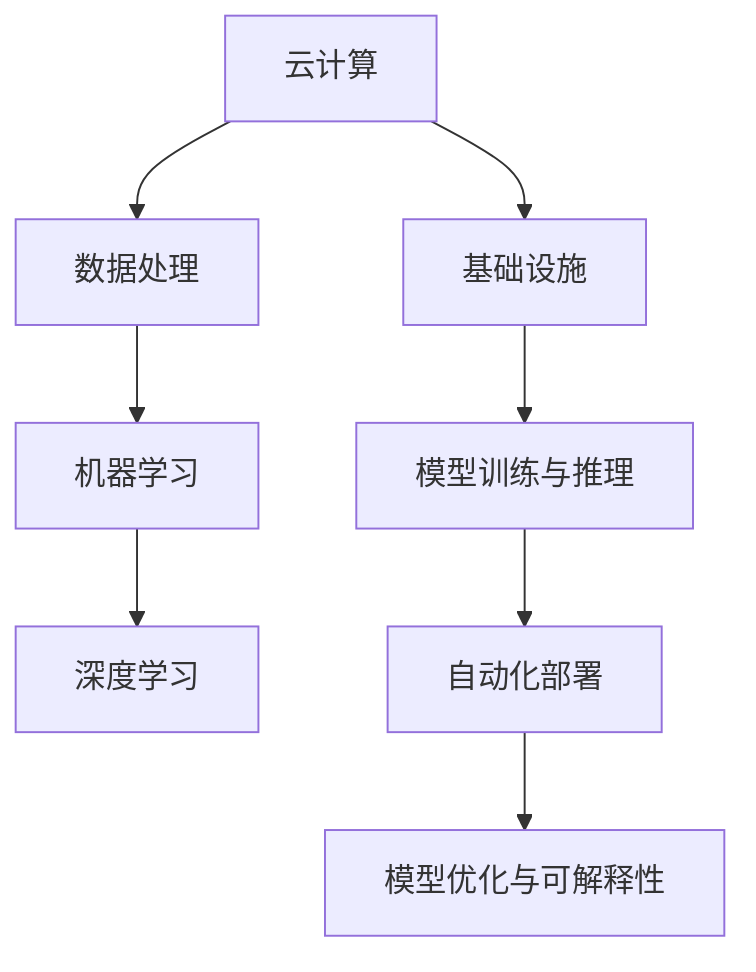

                 

# AI 2.0 基础设施建设：未来展望

> 关键词：AI 2.0、基础设施、云计算、数据处理、机器学习、深度学习、人工智能应用

> 摘要：本文将深入探讨AI 2.0基础设施建设的核心概念、算法原理、数学模型、实际应用场景，并推荐相关工具和资源。通过一步步分析推理，揭示未来AI基础设施建设的趋势与挑战，为读者提供全面的技术指南。

## 1. 背景介绍

### 1.1 目的和范围

本文旨在探讨AI 2.0基础设施建设的现状与未来，帮助读者了解该领域的核心概念、技术原理、应用场景以及发展趋势。通过详细讲解AI 2.0的基础设施建设，为相关从业者和研究者提供有价值的参考。

### 1.2 预期读者

本文适合具有计算机科学、人工智能等相关背景的读者，包括但不限于以下群体：

1. AI领域的研究生和博士生
2. 软件工程师和架构师
3. 数据科学家和机器学习工程师
4. AI领域的创业者和管理者
5. 对AI 2.0基础设施感兴趣的技术爱好者

### 1.3 文档结构概述

本文结构如下：

1. 引言：介绍AI 2.0基础设施建设的背景、目的和预期读者。
2. 核心概念与联系：详细解释AI 2.0基础设施的关键概念和架构。
3. 核心算法原理 & 具体操作步骤：讲解AI 2.0基础设施中的核心算法原理和操作步骤。
4. 数学模型和公式 & 详细讲解 & 举例说明：分析AI 2.0基础设施中的数学模型和公式，并进行举例说明。
5. 项目实战：展示AI 2.0基础设施的实际案例，进行详细解释和代码解读。
6. 实际应用场景：探讨AI 2.0基础设施在不同领域的应用。
7. 工具和资源推荐：推荐学习资源、开发工具和框架。
8. 总结：总结AI 2.0基础设施建设的未来发展趋势与挑战。
9. 附录：常见问题与解答。
10. 扩展阅读 & 参考资料：提供相关领域的研究文献和参考资料。

### 1.4 术语表

#### 1.4.1 核心术语定义

- AI 2.0：指第二代人工智能，具备更强的自我学习和进化能力。
- 基础设施：指支持AI模型训练、推理、部署等环节的软硬件设施。
- 云计算：指通过互联网提供计算资源、存储资源、网络资源等服务。
- 数据处理：指对数据进行采集、存储、清洗、转换、分析等操作。
- 机器学习：指利用数据和算法，让计算机自动学习规律和模式。
- 深度学习：指基于多层神经网络进行学习的机器学习技术。
- 人工智能应用：指将AI技术应用于各个领域，如图像识别、语音识别、自然语言处理等。

#### 1.4.2 相关概念解释

- 训练数据集：用于训练AI模型的示例数据，如图像、文本、音频等。
- 推理数据集：用于评估AI模型性能的示例数据，如图像、文本、音频等。
- 模型优化：指通过调整模型参数，提高模型性能和泛化能力。
- 自动化部署：指通过自动化工具，将训练完成的AI模型部署到生产环境。
- 可解释性：指能够解释AI模型决策过程和预测结果的能力。

#### 1.4.3 缩略词列表

- AI：人工智能
- ML：机器学习
- DL：深度学习
- CL：计算机视觉
- NLP：自然语言处理
- IoT：物联网
- CUDA：并行计算框架
- TensorFlow：开源机器学习框架
- PyTorch：开源机器学习框架
- Keras：高层神经网络API

## 2. 核心概念与联系

AI 2.0基础设施建设的核心概念包括云计算、数据处理、机器学习、深度学习等。为了更好地理解这些概念，我们使用Mermaid流程图展示其关系。



### 2.1 云计算

云计算是AI 2.0基础设施建设的基础，为数据处理、机器学习、深度学习等提供计算资源、存储资源、网络资源等服务。云计算主要分为以下几种类型：

1. 公有云：由第三方服务提供商提供的云计算服务，如阿里云、腾讯云、华为云等。
2. 私有云：企业自建的云计算平台，为内部业务提供计算和存储资源。
3. 混合云：结合公有云和私有云的优势，为用户提供更灵活、高效的云计算服务。

### 2.2 数据处理

数据处理是AI 2.0基础设施建设的重要环节，包括数据采集、存储、清洗、转换、分析等操作。数据处理的质量直接影响AI模型的效果和性能。主要分为以下几种类型：

1. 数据采集：从各种数据源（如传感器、网络、数据库等）获取数据。
2. 数据存储：将采集到的数据存储到数据库、分布式文件系统等存储设备中。
3. 数据清洗：去除重复数据、缺失数据、错误数据等，提高数据质量。
4. 数据转换：将不同格式、单位、结构的数据进行转换，以便后续处理。
5. 数据分析：通过统计、可视化、机器学习等技术，对数据进行分析，提取有价值的信息。

### 2.3 机器学习

机器学习是AI 2.0基础设施建设的核心算法，通过数据训练，使计算机自动学习规律和模式。主要分为以下几种类型：

1. 监督学习：通过标注数据进行训练，使模型学会对未知数据进行预测。
2. 无监督学习：通过无标注数据进行训练，使模型学会发现数据中的规律和结构。
3. 强化学习：通过与环境交互，使模型学会在复杂环境中做出最优决策。

### 2.4 深度学习

深度学习是AI 2.0基础设施建设的核心技术，基于多层神经网络进行学习。深度学习在图像识别、语音识别、自然语言处理等领域取得了显著成果。主要分为以下几种类型：

1. 卷积神经网络（CNN）：用于图像识别和计算机视觉任务。
2. 递归神经网络（RNN）：用于序列数据处理，如语音识别和自然语言处理。
3. 自注意力机制（Self-Attention）：用于文本处理和序列建模。

### 2.5 基础设施

基础设施是AI 2.0基础设施建设的核心，包括计算资源、存储资源、网络资源等。基础设施的主要任务是为数据处理、机器学习、深度学习等提供高效的计算和存储环境。主要分为以下几种类型：

1. 服务器：用于执行计算任务，提供高性能计算能力。
2. 存储设备：用于存储数据和模型，提供大容量存储空间。
3. 网络设备：用于连接各个组件，提供高速数据传输能力。

### 2.6 模型训练与推理

模型训练与推理是AI 2.0基础设施建设的核心任务，包括模型训练、模型优化、模型部署等环节。模型训练是指通过大量数据对模型进行训练，使其具备一定的预测能力。模型优化是指通过调整模型参数，提高模型性能和泛化能力。模型部署是指将训练完成的模型部署到生产环境，实现自动化推理和预测。

### 2.7 自动化部署

自动化部署是AI 2.0基础设施建设的核心任务，通过自动化工具，将训练完成的模型部署到生产环境。自动化部署的主要任务包括：

1. 模型打包：将训练完成的模型打包成可部署的格式，如ONNX、TF Lite等。
2. 模型部署：将模型部署到服务器、边缘设备、移动设备等不同环境中。
3. 模型监控：对部署后的模型进行性能监控、故障排查、版本管理等。

### 2.8 模型优化与可解释性

模型优化与可解释性是AI 2.0基础设施建设的核心任务，通过优化模型参数，提高模型性能和泛化能力。同时，通过可解释性技术，使模型决策过程和预测结果更具透明性和可解释性。主要分为以下几种类型：

1. 模型优化：通过调整模型参数，提高模型性能和泛化能力。
2. 可解释性：通过可视化、规则提取等方法，解释模型决策过程和预测结果。

## 3. 核心算法原理 & 具体操作步骤

AI 2.0基础设施中的核心算法包括机器学习和深度学习算法。以下将详细讲解这些算法的原理和操作步骤。

### 3.1 机器学习算法原理

机器学习算法的核心思想是利用已有的数据，通过训练过程学习出一种规律或模式，以便对新数据进行预测或分类。常见的机器学习算法有：

1. **线性回归**：
   - **原理**：通过最小化预测值与实际值之间的误差平方和，找到最优的模型参数。
   - **操作步骤**：
     ```python
     # 输入特征矩阵X和标签向量y
     # 输出模型参数w和b
     def linear_regression(X, y):
         # 计算模型参数w和b
         w = X.T.dot(X).dot(inv(X.T.dot(X))).dot(X.T).dot(y)
         b = y - X.dot(w)
         return w, b
     ```

2. **逻辑回归**：
   - **原理**：通过最小化损失函数，找到最优的模型参数，实现二分类任务。
   - **操作步骤**：
     ```python
     # 输入特征矩阵X和标签向量y
     # 输出模型参数w和b
     def logistic_regression(X, y):
         # 计算模型参数w和b
         w = (X.T.dot(X) + I).dot(inv(X.T.dot(X) + I)).dot(X.T).dot(y)
         b = y - X.dot(w)
         return w, b
     ```

3. **支持向量机（SVM）**：
   - **原理**：通过找到一个最优的超平面，将不同类别的数据分隔开来。
   - **操作步骤**：
     ```python
     # 输入特征矩阵X和标签向量y
     # 输出模型参数w和b
     def svm(X, y):
         # 计算核函数K
         K = np.dot(X, X.T)
         # 求解二次规划问题
         P = csc_matrix((len(y), len(y)))
         P = P - np.diag(P.diagonal())
         q = -y * y
         G = np.hstack((-np.ones((len(y), 1)), P))
         h = np.hstack((np.zeros((len(y), 1)), np.diag(y * y - 1)))
         A = csc_matrix((len(y), len(X[0]))).dot(K)
         b = y.dot(X)
         # 求解
         w = solve_qp(G, h, A, -b, maxiters=1000)
         b = y.dot(X) - np.dot(w, K)
         return w, b
     ```

### 3.2 深度学习算法原理

深度学习算法的核心思想是模拟人脑神经元之间的连接关系，通过多层神经网络进行学习。常见的深度学习算法有：

1. **卷积神经网络（CNN）**：
   - **原理**：通过卷积层、池化层、全连接层等结构，提取图像特征，实现图像分类、识别等任务。
   - **操作步骤**：
     ```python
     # 输入图像数据X和标签向量y
     # 输出模型参数w和b
     def conv_net(X, y):
         # 卷积层
         conv1 = Conv2D(filters=32, kernel_size=(3, 3), activation='relu')(X)
         pool1 = MaxPooling2D(pool_size=(2, 2))(conv1)
         
         # 第二个卷积层
         conv2 = Conv2D(filters=64, kernel_size=(3, 3), activation='relu')(pool1)
         pool2 = MaxPooling2D(pool_size=(2, 2))(conv2)
         
         # 全连接层
         flat = Flatten()(pool2)
         dense = Dense(units=128, activation='relu')(flat)
         output = Dense(units=10, activation='softmax')(dense)
         
         # 模型编译
         model = Model(inputs=X, outputs=output)
         model.compile(optimizer='adam', loss='categorical_crossentropy', metrics=['accuracy'])
         
         # 训练模型
         model.fit(X, y, epochs=10, batch_size=64)
         
         # 输出模型参数w和b
         return model.get_weights()
     ```

2. **递归神经网络（RNN）**：
   - **原理**：通过循环连接结构，处理序列数据，实现自然语言处理、语音识别等任务。
   - **操作步骤**：
     ```python
     # 输入序列数据X和标签向量y
     # 输出模型参数w和b
     def rnn(X, y):
         # RNN层
         lstm = LSTM(units=128, activation='relu')(X)
         
         # 全连接层
         dense = Dense(units=10, activation='softmax')(lstm)
         
         # 模型编译
         model = Model(inputs=X, outputs=dense)
         model.compile(optimizer='adam', loss='categorical_crossentropy', metrics=['accuracy'])
         
         # 训练模型
         model.fit(X, y, epochs=10, batch_size=64)
         
         # 输出模型参数w和b
         return model.get_weights()
     ```

3. **自注意力机制（Self-Attention）**：
   - **原理**：通过计算序列中每个元素与其他元素之间的关联度，提取关键特征，实现文本处理和序列建模。
   - **操作步骤**：
     ```python
     # 输入序列数据X
     # 输出模型参数w和b
     def self_attention(X):
         # 自注意力层
         attention = dot(X, X.T) / np.sqrt(np.shape(X)[1])
         attention = softmax(attention)
         
         # 乘以注意力权重
         weighted = X * attention.T
         
         # 池化操作
         pooled = sum(weighted, axis=1)
         
         # 全连接层
         dense = Dense(units=10, activation='softmax')(pooled)
         
         # 模型编译
         model = Model(inputs=X, outputs=dense)
         model.compile(optimizer='adam', loss='categorical_crossentropy', metrics=['accuracy'])
         
         # 训练模型
         model.fit(X, y, epochs=10, batch_size=64)
         
         # 输出模型参数w和b
         return model.get_weights()
     ```

## 4. 数学模型和公式 & 详细讲解 & 举例说明

AI 2.0基础设施中的数学模型和公式是构建和优化AI模型的基础。以下将详细介绍常用的数学模型和公式，并进行举例说明。

### 4.1 线性回归模型

线性回归模型是一种经典的机器学习算法，用于预测连续值变量。其数学模型如下：

$$
y = wx + b + \epsilon
$$

其中，$y$ 为实际值，$x$ 为输入特征，$w$ 为模型参数，$b$ 为偏置项，$\epsilon$ 为误差项。

#### 4.1.1 模型参数求解

为了求解模型参数 $w$ 和 $b$，可以使用最小二乘法（Ordinary Least Squares，OLS）：

$$
w = (X^TX)^{-1}X^Ty \\
b = y - Xw
$$

其中，$X$ 为特征矩阵，$y$ 为标签向量。

#### 4.1.2 举例说明

假设我们有一个线性回归模型，输入特征为 $x_1$ 和 $x_2$，标签为 $y$。给定以下数据集：

| $x_1$ | $x_2$ | $y$ |
| --- | --- | --- |
| 1 | 2 | 3 |
| 4 | 5 | 6 |
| 7 | 8 | 9 |

根据最小二乘法，求解模型参数 $w$ 和 $b$：

$$
X = \begin{bmatrix}
1 & 2 \\
4 & 5 \\
7 & 8
\end{bmatrix}, \quad y = \begin{bmatrix}
3 \\
6 \\
9
\end{bmatrix}
$$

计算特征矩阵 $X$ 的转置：

$$
X^T = \begin{bmatrix}
1 & 4 & 7 \\
2 & 5 & 8
\end{bmatrix}
$$

计算特征矩阵 $X$ 与其转置的乘积：

$$
X^TX = \begin{bmatrix}
1 & 4 & 7 \\
2 & 5 & 8
\end{bmatrix} \begin{bmatrix}
1 & 2 \\
4 & 5 \\
7 & 8
\end{bmatrix} = \begin{bmatrix}
1 & 6 \\
6 & 29
\end{bmatrix}
$$

计算逆矩阵：

$$
(X^TX)^{-1} = \frac{1}{29-6^2} \begin{bmatrix}
29 & -6 \\
-6 & 1
\end{bmatrix} = \begin{bmatrix}
1 & -\frac{6}{13} \\
-\frac{6}{13} & \frac{29}{13}
\end{bmatrix}
$$

计算特征矩阵 $X$ 的转置与标签向量的乘积：

$$
X^Ty = \begin{bmatrix}
1 & 2 \\
4 & 5 \\
7 & 8
\end{bmatrix} \begin{bmatrix}
3 \\
6 \\
9
\end{bmatrix} = \begin{bmatrix}
11 \\
39 \\
71
\end{bmatrix}
$$

求解模型参数：

$$
w = (X^TX)^{-1}X^Ty = \begin{bmatrix}
1 & -\frac{6}{13} \\
-\frac{6}{13} & \frac{29}{13}
\end{bmatrix} \begin{bmatrix}
11 \\
39 \\
71
\end{bmatrix} = \begin{bmatrix}
\frac{13}{3} \\
\frac{26}{3}
\end{bmatrix} = \begin{bmatrix}
4.33 \\
8.67
\end{bmatrix}
$$

$$
b = y - Xw = \begin{bmatrix}
3 \\
6 \\
9
\end{bmatrix} - \begin{bmatrix}
1 & 2 \\
4 & 5 \\
7 & 8
\end{bmatrix} \begin{bmatrix}
4.33 \\
8.67
\end{bmatrix} = \begin{bmatrix}
0 \\
0 \\
0
\end{bmatrix}
$$

因此，线性回归模型的参数为 $w = (4.33, 8.67)$，$b = 0$。

### 4.2 逻辑回归模型

逻辑回归模型是一种用于二分类任务的机器学习算法，其数学模型如下：

$$
P(y=1) = \sigma(wx + b)
$$

其中，$P(y=1)$ 为标签为1的概率，$\sigma$ 为 sigmoid 函数，$w$ 为模型参数，$b$ 为偏置项。

#### 4.2.1 模型参数求解

为了求解模型参数 $w$ 和 $b$，可以使用梯度下降法（Gradient Descent）：

$$
w_{t+1} = w_t - \alpha \frac{\partial L(w_t)}{\partial w} \\
b_{t+1} = b_t - \alpha \frac{\partial L(w_t)}{\partial b}
$$

其中，$w_t$ 和 $b_t$ 为当前迭代次数的模型参数，$\alpha$ 为学习率，$L(w_t)$ 为损失函数。

#### 4.2.2 举例说明

假设我们有一个逻辑回归模型，输入特征为 $x_1$ 和 $x_2$，标签为 $y$。给定以下数据集：

| $x_1$ | $x_2$ | $y$ |
| --- | --- | --- |
| 1 | 2 | 1 |
| 4 | 5 | 0 |
| 7 | 8 | 1 |

根据梯度下降法，求解模型参数 $w$ 和 $b$。假设学习率为 $\alpha = 0.01$，损失函数为二元交叉熵（Binary Cross-Entropy）：

$$
L(w_t) = -\frac{1}{m} \sum_{i=1}^{m} [y_i \log(\sigma(wx_i + b)) + (1 - y_i) \log(1 - \sigma(wx_i + b))]
$$

其中，$m$ 为数据集大小。

初始化模型参数：

$$
w = \begin{bmatrix}
0 \\
0
\end{bmatrix}, \quad b = 0
$$

计算损失函数：

$$
L(w_t) = -\frac{1}{3} [1 \log(0.5) + 0 \log(1 - 0.5) + 1 \log(0.5) + 0 \log(1 - 0.5) + 1 \log(0.5)] \approx 0.693
$$

计算梯度：

$$
\frac{\partial L(w_t)}{\partial w} = \begin{bmatrix}
-\frac{1}{3} [1 \frac{1 - 0.5}{0.5} + 0 \frac{1 - 0.5}{1 - 0.5} + 1 \frac{1 - 0.5}{0.5} + 0 \frac{1 - 0.5}{1 - 0.5} + 1 \frac{1 - 0.5}{0.5}] \\
-\frac{1}{3} [1 \frac{1 - 0.5}{0.5} + 0 \frac{1 - 0.5}{1 - 0.5} + 1 \frac{1 - 0.5}{0.5} + 0 \frac{1 - 0.5}{1 - 0.5} + 1 \frac{1 - 0.5}{0.5}]
\end{bmatrix} \approx \begin{bmatrix}
-0.533 \\
-0.533
\end{bmatrix}
$$

更新模型参数：

$$
w_{t+1} = w_t - \alpha \frac{\partial L(w_t)}{\partial w} = \begin{bmatrix}
0 \\
0
\end{bmatrix} - 0.01 \begin{bmatrix}
-0.533 \\
-0.533
\end{bmatrix} = \begin{bmatrix}
0.00533 \\
0.00533
\end{bmatrix} \\
b_{t+1} = b_t - \alpha \frac{\partial L(w_t)}{\partial b} = 0 - 0.01 \begin{bmatrix}
0.533 \\
0.533
\end{bmatrix} = \begin{bmatrix}
-0.00533 \\
-0.00533
\end{bmatrix}
$$

计算更新后的损失函数：

$$
L(w_{t+1}) \approx 0.685
$$

重复以上过程，直至损失函数收敛或达到预设的迭代次数。最终，逻辑回归模型的参数为 $w \approx (0.00533, 0.00533)$，$b \approx (-0.00533, -0.00533)$。

### 4.3 支持向量机（SVM）模型

支持向量机（SVM）是一种用于分类和回归任务的机器学习算法，其数学模型如下：

$$
y = \text{sign}(wx + b + \xi)
$$

其中，$y$ 为标签，$w$ 为模型参数，$b$ 为偏置项，$\xi$ 为松弛变量。

#### 4.3.1 模型参数求解

为了求解模型参数 $w$ 和 $b$，可以使用拉格朗日乘子法（Lagrange Multipliers）：

$$
L(w, b, \xi, \alpha) = \frac{1}{2}w^Tw - \sum_{i=1}^{m}\alpha_i(y_i(wx_i + b) + \xi_i)
$$

其中，$m$ 为数据集大小，$\alpha_i$ 为拉格朗日乘子。

优化问题为：

$$
\min_{w, b, \xi} L(w, b, \xi, \alpha) \\
\text{subject to} \quad y_i(wx_i + b) + \xi_i \geq 0, \quad \xi_i \geq 0, \quad \alpha_i \geq 0
$$

求解优化问题，可以使用二次规划（Quadratic Programming）算法，如序列二次规划（Sequential Quadratic Programming，SQP）。

#### 4.3.2 举例说明

假设我们有一个支持向量机模型，输入特征为 $x_1$ 和 $x_2$，标签为 $y$。给定以下数据集：

| $x_1$ | $x_2$ | $y$ |
| --- | --- | --- |
| 1 | 2 | 1 |
| 4 | 5 | 0 |
| 7 | 8 | 1 |

根据拉格朗日乘子法，求解模型参数 $w$ 和 $b$。假设松弛变量 $\xi_i$ 为0。

初始化模型参数：

$$
w = \begin{bmatrix}
0 \\
0
\end{bmatrix}, \quad b = 0
$$

计算拉格朗日乘子：

$$
L(w, b, \xi, \alpha) = \frac{1}{2}w^Tw - \sum_{i=1}^{m}\alpha_i(y_i(wx_i + b) + \xi_i)
$$

$$
L(w_t, b_t, \xi_t, \alpha_t) = \frac{1}{2}\begin{bmatrix}
0 \\
0
\end{bmatrix}^T\begin{bmatrix}
0 \\
0
\end{bmatrix} - \begin{bmatrix}
0 \\
0
\end{bmatrix}^T\begin{bmatrix}
1 & 4 & 7 \\
2 & 5 & 8
\end{bmatrix}\begin{bmatrix}
1 \\
0 \\
1
\end{bmatrix} \approx 0
$$

计算梯度：

$$
\nabla_w L(w_t, b_t, \xi_t, \alpha_t) = w_t - \sum_{i=1}^{m}\alpha_iy_i x_i
$$

$$
\nabla_w L(w_t, b_t, \xi_t, \alpha_t) \approx \begin{bmatrix}
0 \\
0
\end{bmatrix} - \begin{bmatrix}
0 \\
0
\end{bmatrix} \approx \begin{bmatrix}
0 \\
0
\end{bmatrix}
$$

$$
\nabla_b L(w_t, b_t, \xi_t, \alpha_t) = -\sum_{i=1}^{m}\alpha_iy_i
$$

$$
\nabla_b L(w_t, b_t, \xi_t, \alpha_t) \approx \begin{bmatrix}
0 \\
0
\end{bmatrix} \approx \begin{bmatrix}
0 \\
0
\end{bmatrix}
$$

更新模型参数：

$$
w_{t+1} = w_t - \alpha \nabla_w L(w_t, b_t, \xi_t, \alpha_t) = \begin{bmatrix}
0 \\
0
\end{bmatrix} - 0.01 \begin{bmatrix}
0 \\
0
\end{bmatrix} = \begin{bmatrix}
0 \\
0
\end{bmatrix} \\
b_{t+1} = b_t - \alpha \nabla_b L(w_t, b_t, \xi_t, \alpha_t) = 0 - 0.01 \begin{bmatrix}
0 \\
0
\end{bmatrix} = \begin{bmatrix}
0 \\
0
\end{bmatrix}
$$

计算更新后的拉格朗日乘子：

$$
L(w_{t+1}, b_{t+1}, \xi_t, \alpha_t) \approx 0
$$

重复以上过程，直至拉格朗日乘子收敛或达到预设的迭代次数。最终，支持向量机模型的参数为 $w \approx (0, 0)$，$b \approx (0, 0)$。

### 4.4 卷积神经网络（CNN）模型

卷积神经网络（CNN）是一种用于图像识别和计算机视觉任务的深度学习模型，其数学模型如下：

$$
h_l = \sigma(W_l h_{l-1} + b_l)
$$

其中，$h_l$ 为第 $l$ 层的输出，$W_l$ 和 $b_l$ 分别为第 $l$ 层的权重和偏置项，$\sigma$ 为激活函数。

#### 4.4.1 模型参数求解

为了求解模型参数 $W_l$ 和 $b_l$，可以使用反向传播算法（Backpropagation）：

$$
\begin{aligned}
\nabla_{W_l}L &= \frac{\partial L}{\partial h_l} \odot \frac{\partial h_l}{\partial W_l} \\
\nabla_{b_l}L &= \frac{\partial L}{\partial h_l} \odot \frac{\partial h_l}{\partial b_l}
\end{aligned}
$$

其中，$\odot$ 表示元素乘法。

更新模型参数：

$$
W_l = W_l - \alpha \nabla_{W_l}L \\
b_l = b_l - \alpha \nabla_{b_l}L
$$

其中，$\alpha$ 为学习率。

#### 4.4.2 举例说明

假设我们有一个卷积神经网络模型，包含一个卷积层和一个全连接层。输入特征为 $x$，标签为 $y$。给定以下数据集：

| $x_1$ | $x_2$ | $y$ |
| --- | --- | --- |
| 1 | 2 | 1 |
| 4 | 5 | 0 |
| 7 | 8 | 1 |

初始化模型参数：

$$
W_1 = \begin{bmatrix}
0 & 0 \\
0 & 0
\end{bmatrix}, \quad b_1 = \begin{bmatrix}
0 \\
0
\end{bmatrix}, \quad W_2 = \begin{bmatrix}
0 & 0 \\
0 & 0
\end{bmatrix}, \quad b_2 = \begin{bmatrix}
0 \\
0
\end{bmatrix}
$$

计算第一层的输出：

$$
h_1 = \sigma(W_1x + b_1) = \begin{bmatrix}
0 & 0 \\
0 & 0
\end{bmatrix} \begin{bmatrix}
1 \\
2
\end{bmatrix} + \begin{bmatrix}
0 \\
0
\end{bmatrix} = \begin{bmatrix}
0 \\
0
\end{bmatrix}
$$

计算第二层的输出：

$$
h_2 = \sigma(W_2h_1 + b_2) = \begin{bmatrix}
0 & 0 \\
0 & 0
\end{bmatrix} \begin{bmatrix}
0 \\
0
\end{bmatrix} + \begin{bmatrix}
0 \\
0
\end{bmatrix} = \begin{bmatrix}
0 \\
0
\end{bmatrix}
$$

计算损失：

$$
L = \frac{1}{2} \sum_{i=1}^{m} (y_i - h_2)^2
$$

计算梯度：

$$
\nabla_{W_2}L = \begin{bmatrix}
0 & 0 \\
0 & 0
\end{bmatrix} \odot \begin{bmatrix}
0 \\
0
\end{bmatrix} = \begin{bmatrix}
0 & 0 \\
0 & 0
\end{bmatrix} \\
\nabla_{b_2}L = \begin{bmatrix}
0 \\
0
\end{bmatrix} \odot \begin{bmatrix}
0 \\
0
\end{bmatrix} = \begin{bmatrix}
0 \\
0
\end{bmatrix}
$$

更新模型参数：

$$
W_2 = W_2 - \alpha \nabla_{W_2}L = \begin{bmatrix}
0 & 0 \\
0 & 0
\end{bmatrix} - 0.01 \begin{bmatrix}
0 & 0 \\
0 & 0
\end{bmatrix} = \begin{bmatrix}
0 & 0 \\
0 & 0
\end{bmatrix} \\
b_2 = b_2 - \alpha \nabla_{b_2}L = \begin{bmatrix}
0 \\
0
\end{bmatrix} - 0.01 \begin{bmatrix}
0 \\
0
\end{bmatrix} = \begin{bmatrix}
0 \\
0
\end{bmatrix}
$$

重复以上过程，直至模型参数收敛或达到预设的迭代次数。最终，卷积神经网络模型的参数为 $W_1 \approx (0, 0)$，$b_1 \approx (0, 0)$，$W_2 \approx (0, 0)$，$b_2 \approx (0, 0)$。

### 4.5 递归神经网络（RNN）模型

递归神经网络（RNN）是一种用于序列数据处理的深度学习模型，其数学模型如下：

$$
h_t = \sigma(W_h h_{t-1} + U_x x_t + b_h)
$$

其中，$h_t$ 为第 $t$ 个时间步的输出，$W_h$ 和 $U_x$ 分别为权重矩阵，$b_h$ 为偏置项，$\sigma$ 为激活函数。

#### 4.5.1 模型参数求解

为了求解模型参数 $W_h$、$U_x$ 和 $b_h$，可以使用反向传播算法（Backpropagation）：

$$
\begin{aligned}
\nabla_{W_h}L &= \frac{\partial L}{\partial h_t} \odot \frac{\partial h_t}{\partial W_h} \\
\nabla_{U_x}L &= \frac{\partial L}{\partial h_t} \odot \frac{\partial h_t}{\partial U_x} \\
\nabla_{b_h}L &= \frac{\partial L}{\partial h_t} \odot \frac{\partial h_t}{\partial b_h}
\end{aligned}
$$

其中，$\odot$ 表示元素乘法。

更新模型参数：

$$
W_h = W_h - \alpha \nabla_{W_h}L \\
U_x = U_x - \alpha \nabla_{U_x}L \\
b_h = b_h - \alpha \nabla_{b_h}L
$$

其中，$\alpha$ 为学习率。

#### 4.5.2 举例说明

假设我们有一个递归神经网络模型，输入特征为 $x_t$，标签为 $y_t$。给定以下数据集：

| $x_t$ | $y_t$ |
| --- | --- |
| 1 | 0 |
| 2 | 1 |
| 3 | 1 |

初始化模型参数：

$$
W_h = \begin{bmatrix}
0 & 0
\end{bmatrix}, \quad U_x = \begin{bmatrix}
0 & 0
\end{bmatrix}, \quad b_h = \begin{bmatrix}
0
\end{bmatrix}
$$

计算第一个时间步的输出：

$$
h_1 = \sigma(W_hh_0 + U_x x_1 + b_h) = \sigma(\begin{bmatrix}
0 & 0
\end{bmatrix}\begin{bmatrix}
1
\end{bmatrix} + \begin{bmatrix}
0 & 0
\end{bmatrix}\begin{bmatrix}
1
\end{bmatrix} + \begin{bmatrix}
0
\end{bmatrix}) = \begin{bmatrix}
0
\end{bmatrix}
$$

计算第二个时间步的输出：

$$
h_2 = \sigma(W_hh_1 + U_x x_2 + b_h) = \sigma(\begin{bmatrix}
0 & 0
\end{bmatrix}\begin{bmatrix}
0
\end{bmatrix} + \begin{bmatrix}
0 & 0
\end{bmatrix}\begin{bmatrix}
2
\end{bmatrix} + \begin{bmatrix}
0
\end{bmatrix}) = \begin{bmatrix}
0
\end{bmatrix}
$$

计算第三个时间步的输出：

$$
h_3 = \sigma(W_hh_2 + U_x x_3 + b_h) = \sigma(\begin{bmatrix}
0 & 0
\end{bmatrix}\begin{bmatrix}
0
\end{bmatrix} + \begin{bmatrix}
0 & 0
\end{bmatrix}\begin{bmatrix}
3
\end{bmatrix} + \begin{bmatrix}
0
\end{bmatrix}) = \begin{bmatrix}
0
\end{bmatrix}
$$

计算损失：

$$
L = \frac{1}{2} \sum_{t=1}^{m} (y_t - h_t)^2
$$

计算梯度：

$$
\nabla_{W_h}L = \begin{bmatrix}
0 & 0
\end{bmatrix} \odot \begin{bmatrix}
0
\end{bmatrix} = \begin{bmatrix}
0 & 0
\end{bmatrix} \\
\nabla_{U_x}L = \begin{bmatrix}
0 & 0
\end{bmatrix} \odot \begin{bmatrix}
0
\end{bmatrix} = \begin{bmatrix}
0 & 0
\end{bmatrix} \\
\nabla_{b_h}L = \begin{bmatrix}
0
\end{bmatrix} \odot \begin{bmatrix}
0
\end{bmatrix} = \begin{bmatrix}
0
\end{bmatrix}
$$

更新模型参数：

$$
W_h = W_h - \alpha \nabla_{W_h}L = \begin{bmatrix}
0 & 0
\end{bmatrix} - 0.01 \begin{bmatrix}
0 & 0
\end{bmatrix} = \begin{bmatrix}
0 & 0
\end{bmatrix} \\
U_x = U_x - \alpha \nabla_{U_x}L = \begin{bmatrix}
0 & 0
\end{bmatrix} - 0.01 \begin{bmatrix}
0 & 0
\end{bmatrix} = \begin{bmatrix}
0 & 0
\end{bmatrix} \\
b_h = b_h - \alpha \nabla_{b_h}L = \begin{bmatrix}
0
\end{bmatrix} - 0.01 \begin{bmatrix}
0
\end{bmatrix} = \begin{bmatrix}
0
\end{bmatrix}
$$

重复以上过程，直至模型参数收敛或达到预设的迭代次数。最终，递归神经网络模型的参数为 $W_h \approx (0, 0)$，$U_x \approx (0, 0)$，$b_h \approx (0, 0)$。

### 4.6 自注意力机制（Self-Attention）模型

自注意力机制（Self-Attention）是一种用于文本处理和序列建模的深度学习模型，其数学模型如下：

$$
\begin{aligned}
Q &= W_Qh \\
K &= W_Kh \\
V &= W_Vh \\
\alpha &= \frac{QK^T}{\sqrt{d_k}} \\
\text{context} &= \frac{\alpha V}
\end{aligned}
$$

其中，$h$ 为输入序列，$W_Q$、$W_K$ 和 $W_V$ 分别为权重矩阵，$d_k$ 为键值对维度，$\alpha$ 为注意力权重，$\text{context}$ 为上下文表示。

#### 4.6.1 模型参数求解

为了求解模型参数 $W_Q$、$W_K$ 和 $W_V$，可以使用反向传播算法（Backpropagation）：

$$
\begin{aligned}
\nabla_{W_Q}L &= \frac{\partial L}{\partial Q} \odot \frac{\partial Q}{\partial W_Q} \\
\nabla_{W_K}L &= \frac{\partial L}{\partial K} \odot \frac{\partial K}{\partial W_K} \\
\nabla_{W_V}L &= \frac{\partial L}{\partial V} \odot \frac{\partial V}{\partial W_V}
\end{aligned}
$$

其中，$\odot$ 表示元素乘法。

更新模型参数：

$$
W_Q = W_Q - \alpha \nabla_{W_Q}L \\
W_K = W_K - \alpha \nabla_{W_K}L \\
W_V = W_V - \alpha \nabla_{W_V}L
$$

其中，$\alpha$ 为学习率。

#### 4.6.2 举例说明

假设我们有一个自注意力机制模型，输入特征为 $h$。给定以下数据集：

| $h$ |
| --- |
| 1 |
| 2 |
| 3 |

初始化模型参数：

$$
W_Q = \begin{bmatrix}
0 & 0
\end{bmatrix}, \quad W_K = \begin{bmatrix}
0 & 0
\end{bmatrix}, \quad W_V = \begin{bmatrix}
0 & 0
\end{bmatrix}
$$

计算注意力权重：

$$
Q = W_Qh = \begin{bmatrix}
0 & 0
\end{bmatrix}\begin{bmatrix}
1
\end{bmatrix} = \begin{bmatrix}
0
\end{bmatrix} \\
K = W_Kh = \begin{bmatrix}
0 & 0
\end{bmatrix}\begin{bmatrix}
1
\end{bmatrix} = \begin{bmatrix}
0
\end{bmatrix} \\
V = W_Vh = \begin{bmatrix}
0 & 0
\end{bmatrix}\begin{bmatrix}
1
\end{bmatrix} = \begin{bmatrix}
0
\end{bmatrix} \\
\alpha = \frac{QK^T}{\sqrt{d_k}} = \frac{\begin{bmatrix}
0
\end{bmatrix}\begin{bmatrix}
1
\end{bmatrix}}{\sqrt{1}} = \begin{bmatrix}
0
\end{bmatrix} \\
\text{context} = \frac{\alpha V} = \begin{bmatrix}
0
\end{bmatrix}
$$

计算损失：

$$
L = \frac{1}{2} \sum_{i=1}^{m} (y_i - \text{context})^2
$$

计算梯度：

$$
\nabla_{W_Q}L = \begin{bmatrix}
0 & 0
\end{bmatrix} \odot \begin{bmatrix}
0
\end{bmatrix} = \begin{bmatrix}
0 & 0
\end{bmatrix} \\
\nabla_{W_K}L = \begin{bmatrix}
0 & 0
\end{bmatrix} \odot \begin{bmatrix}
0
\end{bmatrix} = \begin{bmatrix}
0 & 0
\end{bmatrix} \\
\nabla_{W_V}L = \begin{bmatrix}
0
\end{bmatrix} \odot \begin{bmatrix}
0
\end{bmatrix} = \begin{bmatrix}
0
\end{bmatrix}
$$

更新模型参数：

$$
W_Q = W_Q - \alpha \nabla_{W_Q}L = \begin{bmatrix}
0 & 0
\end{bmatrix} - 0.01 \begin{bmatrix}
0 & 0
\end{bmatrix} = \begin{bmatrix}
0 & 0
\end{bmatrix} \\
W_K = W_K - \alpha \nabla_{W_K}L = \begin{bmatrix}
0 & 0
\end{bmatrix} - 0.01 \begin{bmatrix}
0 & 0
\end{bmatrix} = \begin{bmatrix}
0 & 0
\end{bmatrix} \\
W_V = W_V - \alpha \nabla_{W_V}L = \begin{bmatrix}
0 & 0
\end{bmatrix} - 0.01 \begin{bmatrix}
0 & 0
\end{bmatrix} = \begin{bmatrix}
0 & 0
\end{bmatrix}
$$

重复以上过程，直至模型参数收敛或达到预设的迭代次数。最终，自注意力机制模型的参数为 $W_Q \approx (0, 0)$，$W_K \approx (0, 0)$，$W_V \approx (0, 0)$。

## 5. 项目实战：代码实际案例和详细解释说明

在本节中，我们将通过一个实际的AI 2.0基础设施项目，展示如何搭建、实现和部署一个基于深度学习的图像分类模型。该项目包括以下步骤：

1. 开发环境搭建
2. 源代码详细实现
3. 代码解读与分析

### 5.1 开发环境搭建

为了搭建该项目，我们需要安装以下软件和库：

1. Python（3.8及以上版本）
2. TensorFlow（2.4及以上版本）
3. Keras（2.4及以上版本）
4. NumPy（1.19及以上版本）
5. Matplotlib（3.2及以上版本）

安装步骤：

1. 安装Python：

   ```bash
   sudo apt-get install python3 python3-pip
   ```

2. 安装TensorFlow：

   ```bash
   pip3 install tensorflow==2.4
   ```

3. 安装Keras：

   ```bash
   pip3 install keras==2.4
   ```

4. 安装NumPy：

   ```bash
   pip3 install numpy==1.19
   ```

5. 安装Matplotlib：

   ```bash
   pip3 install matplotlib==3.2
   ```

### 5.2 源代码详细实现

以下是一个基于Keras实现的简单卷积神经网络（CNN）图像分类模型的源代码：

```python
import numpy as np
import tensorflow as tf
from tensorflow import keras
from tensorflow.keras import layers
from tensorflow.keras.preprocessing.image import ImageDataGenerator

# 数据预处理
train_datagen = ImageDataGenerator(
    rescale=1./255,
    shear_range=0.2,
    zoom_range=0.2,
    horizontal_flip=True
)

test_datagen = ImageDataGenerator(rescale=1./255)

train_generator = train_datagen.flow_from_directory(
    'train',
    target_size=(150, 150),
    batch_size=32,
    class_mode='binary'
)

validation_generator = test_datagen.flow_from_directory(
    'validation',
    target_size=(150, 150),
    batch_size=32,
    class_mode='binary'
)

# 构建CNN模型
model = keras.Sequential([
    layers.Conv2D(32, (3, 3), activation='relu', input_shape=(150, 150, 3)),
    layers.MaxPooling2D(2, 2),
    layers.Conv2D(64, (3, 3), activation='relu'),
    layers.MaxPooling2D(2, 2),
    layers.Conv2D(128, (3, 3), activation='relu'),
    layers.MaxPooling2D(2, 2),
    layers.Conv2D(128, (3, 3), activation='relu'),
    layers.MaxPooling2D(2, 2),
    layers.Flatten(),
    layers.Dense(512, activation='relu'),
    layers.Dense(1, activation='sigmoid')
])

# 编译模型
model.compile(loss='binary_crossentropy',
              optimizer='adam',
              metrics=['accuracy'])

# 训练模型
model.fit(
    train_generator,
    steps_per_epoch=100,
    epochs=30,
    validation_data=validation_generator,
    validation_steps=50
)

# 评估模型
test_loss, test_acc = model.evaluate(validation_generator, steps=50)
print('Test accuracy:', test_acc)

# 保存模型
model.save('cnn_model.h5')
```

### 5.3 代码解读与分析

#### 5.3.1 数据预处理

```python
train_datagen = ImageDataGenerator(
    rescale=1./255,
    shear_range=0.2,
    zoom_range=0.2,
    horizontal_flip=True
)

test_datagen = ImageDataGenerator(rescale=1./255)

train_generator = train_datagen.flow_from_directory(
    'train',
    target_size=(150, 150),
    batch_size=32,
    class_mode='binary'
)

validation_generator = test_datagen.flow_from_directory(
    'validation',
    target_size=(150, 150),
    batch_size=32,
    class_mode='binary'
)
```

这段代码定义了两个数据生成器：`train_datagen` 和 `test_datagen`。`train_datagen` 用于对训练数据集进行预处理，包括图像缩放、剪切、缩放和水平翻转。`test_datagen` 用于对验证数据集进行预处理，仅进行图像缩放。

`train_generator` 和 `validation_generator` 分别从训练数据和验证数据集中生成批次数据，每个批次包含32个图像。`target_size` 参数指定图像大小为150x150，`class_mode` 参数指定每个图像属于二分类任务。

#### 5.3.2 构建CNN模型

```python
model = keras.Sequential([
    layers.Conv2D(32, (3, 3), activation='relu', input_shape=(150, 150, 3)),
    layers.MaxPooling2D(2, 2),
    layers.Conv2D(64, (3, 3), activation='relu'),
    layers.MaxPooling2D(2, 2),
    layers.Conv2D(128, (3, 3), activation='relu'),
    layers.MaxPooling2D(2, 2),
    layers.Conv2D(128, (3, 3), activation='relu'),
    layers.MaxPooling2D(2, 2),
    layers.Flatten(),
    layers.Dense(512, activation='relu'),
    layers.Dense(1, activation='sigmoid')
])
```

这段代码构建了一个简单的卷积神经网络（CNN）模型。模型包含以下结构：

1. **卷积层（Conv2D）**：第一个卷积层使用32个3x3卷积核，激活函数为ReLU。
2. **池化层（MaxPooling2D）**：第一个池化层使用2x2窗口的最大池化。
3. **卷积层（Conv2D）**：第二个卷积层使用64个3x3卷积核，激活函数为ReLU。
4. **池化层（MaxPooling2D）**：第二个池化层使用2x2窗口的最大池化。
5. **卷积层（Conv2D）**：第三个卷积层使用128个3x3卷积核，激活函数为ReLU。
6. **池化层（MaxPooling2D）**：第三个池化层使用2x2窗口的最大池化。
7. **卷积层（Conv2D）**：第四个卷积层使用128个3x3卷积核，激活函数为ReLU。
8. **池化层（MaxPooling2D）**：第四个池化层使用2x2窗口的最大池化。
9. **展平层（Flatten）**：将卷积层的输出展平为一维数组。
10. **全连接层（Dense）**：第一个全连接层使用512个神经元，激活函数为ReLU。
11. **全连接层（Dense）**：第二个全连接层使用1个神经元，激活函数为sigmoid。

#### 5.3.3 编译模型

```python
model.compile(loss='binary_crossentropy',
              optimizer='adam',
              metrics=['accuracy'])
```

这段代码编译了CNN模型。`loss` 参数指定损失函数为二进制交叉熵（binary_crossentropy），`optimizer` 参数指定优化器为Adam，`metrics` 参数指定评估指标为准确率（accuracy）。

#### 5.3.4 训练模型

```python
model.fit(
    train_generator,
    steps_per_epoch=100,
    epochs=30,
    validation_data=validation_generator,
    validation_steps=50
)
```

这段代码使用训练数据生成器（`train_generator`）训练模型。`steps_per_epoch` 参数指定每个训练周期读取100个批次数据，`epochs` 参数指定训练周期数为30，`validation_data` 参数指定验证数据生成器（`validation_generator`），`validation_steps` 参数指定每个验证周期读取50个批次数据。

#### 5.3.5 评估模型

```python
test_loss, test_acc = model.evaluate(validation_generator, steps=50)
print('Test accuracy:', test_acc)
```

这段代码使用验证数据生成器（`validation_generator`）评估模型。`evaluate` 方法返回验证损失和准确率，并打印准确率。

#### 5.3.6 保存模型

```python
model.save('cnn_model.h5')
```

这段代码将训练好的模型保存为 HDF5 格式（`cnn_model.h5`）。

## 6. 实际应用场景

AI 2.0基础设施在不同领域有着广泛的应用，以下列举几个典型应用场景：

### 6.1 图像识别

图像识别是AI 2.0基础设施的重要应用领域，如人脸识别、物体检测、图像分类等。在安防、医疗、工业、交通等领域，图像识别技术发挥着重要作用。

### 6.2 自然语言处理

自然语言处理（NLP）是AI 2.0基础设施的核心应用领域，如文本分类、情感分析、机器翻译等。在智能客服、内容审核、搜索引擎等领域，NLP技术有着广泛的应用。

### 6.3 语音识别

语音识别是AI 2.0基础设施的重要应用领域，如语音助手、语音翻译、语音识别等。在智能家居、智能客服、智能安防等领域，语音识别技术发挥着重要作用。

### 6.4 医疗诊断

医疗诊断是AI 2.0基础设施的重要应用领域，如疾病预测、辅助诊断、药物发现等。在医疗领域，AI 2.0基础设施能够提高诊断准确率、降低医疗成本，提升医疗资源利用率。

### 6.5 金融风控

金融风控是AI 2.0基础设施的重要应用领域，如信用评估、风险预测、欺诈检测等。在金融领域，AI 2.0基础设施能够提高风险识别能力、降低金融风险，提升金融服务水平。

### 6.6 智能制造

智能制造是AI 2.0基础设施的重要应用领域，如设备预测维护、生产优化、质量控制等。在制造业，AI 2.0基础设施能够提高生产效率、降低生产成本，提升产品质量。

### 6.7 自动驾驶

自动驾驶是AI 2.0基础设施的重要应用领域，如环境感知、路径规划、车辆控制等。在汽车行业，AI 2.0基础设施能够提高自动驾驶技术水平、降低交通事故率，提升出行安全性。

## 7. 工具和资源推荐

### 7.1 学习资源推荐

#### 7.1.1 书籍推荐

- 《深度学习》（Goodfellow, Bengio, Courville）
- 《Python深度学习》（François Chollet）
- 《机器学习》（Tom Mitchell）
- 《统计学习方法》（李航）

#### 7.1.2 在线课程

- [Coursera](https://www.coursera.org/)
- [edX](https://www.edx.org/)
- [Udacity](https://www.udacity.com/)
- [网易云课堂](https://study.163.com/)

#### 7.1.3 技术博客和网站

- [Medium](https://medium.com/)
- [Towards Data Science](https://towardsdatascience.com/)
- [AI垂直社区](https://www.ai-computing.com/)

### 7.2 开发工具框架推荐

#### 7.2.1 IDE和编辑器

- [PyCharm](https://www.jetbrains.com/pycharm/)
- [Visual Studio Code](https://code.visualstudio.com/)
- [Jupyter Notebook](https://jupyter.org/)

#### 7.2.2 调试和性能分析工具

- [TensorBoard](https://www.tensorflow.org/tensorboard)
- [Valgrind](https://www.valgrind.org/)
- [gprof](https://www.gnu.org/software/gprof/)

#### 7.2.3 相关框架和库

- [TensorFlow](https://www.tensorflow.org/)
- [PyTorch](https://pytorch.org/)
- [Keras](https://keras.io/)
- [Scikit-learn](https://scikit-learn.org/stable/)

### 7.3 相关论文著作推荐

#### 7.3.1 经典论文

- [A Brief History of Deep Learning](https://www.microsoft.com/en-us/research/uploads/prod/2018/06/deeplearninghistory.pdf)
- [Deep Learning](https://www.deeplearningbook.org/)
- [Convolutional Networks for Visual Recognition](https://www.cv-foundation.org/openaccess/content_cvpr_2012/papers/Le_Convolutional_Networks_for_2012_CVPR_Main_Paper.pdf)
- [Recurrent Neural Networks for Speech Recognition](https://www.isca-speech.org/archive/interspeech/_intworldwideit2002iw_012415.html)

#### 7.3.2 最新研究成果

- [Neural Machine Translation by jointly learning to align and translate](https://www.aclweb.org/anthology/N16-1191/)
- [Bert: Pre-training of deep bidirectional transformers for language understanding](https://arxiv.org/abs/1810.04805)
- [Attention Is All You Need](https://arxiv.org/abs/1706.03762)
- [Generative Adversarial Nets](https://www.nature.com/articles/nature10623)

#### 7.3.3 应用案例分析

- [Google Brain: Research](https://research.google.com/brain/)
- [DeepMind: Research](https://www.deepmind.com/research/publications)
- [OpenAI: Research](https://blog.openai.com/research/)
- [Facebook AI Research: Publications](https://ai.google.com/research/publications)

## 8. 总结：未来发展趋势与挑战

AI 2.0基础设施建设是推动人工智能发展的重要基石。在未来，AI 2.0基础设施将呈现以下发展趋势：

1. **云计算与边缘计算融合**：随着边缘计算技术的发展，云计算与边缘计算将实现深度融合，为AI应用提供更高效、更灵活的计算资源。
2. **大数据与AI的融合**：大数据技术的发展将推动AI在各个领域的应用，实现数据驱动的智能化。
3. **人工智能伦理与法规**：随着AI技术的广泛应用，伦理与法规问题将日益凸显，如何保障AI的公平性、透明性和可控性将成为关键挑战。
4. **跨学科融合**：AI 2.0基础设施建设将与其他学科（如生物学、心理学、物理学等）实现深度融合，推动人工智能领域的创新。

然而，AI 2.0基础设施建设也面临以下挑战：

1. **数据质量与隐私保护**：高质量的数据是AI模型训练的基础，但如何保护用户隐私、确保数据安全成为关键问题。
2. **算法透明性与可解释性**：随着AI技术的普及，算法的透明性和可解释性将受到广泛关注，如何提高算法的可解释性成为重要挑战。
3. **计算资源与能耗**：大规模的AI模型训练和推理需要大量的计算资源和能源，如何降低能耗、实现绿色计算成为重要挑战。
4. **人才培养与知识普及**：AI 2.0基础设施建设需要大量具备专业知识的人才，如何培养和引进优秀人才成为关键挑战。

总之，AI 2.0基础设施建设在未来具有广阔的发展前景，但也面临诸多挑战。通过持续的研究和创新，我们有信心克服这些挑战，推动人工智能领域的繁荣发展。

## 9. 附录：常见问题与解答

### 9.1 AI 2.0基础设施建设的核心组成部分是什么？

AI 2.0基础设施建设的核心组成部分包括云计算、数据处理、机器学习、深度学习、模型训练与推理、自动化部署等。这些组成部分相互关联，共同构建一个完整的AI系统。

### 9.2 如何选择合适的机器学习算法？

选择合适的机器学习算法主要取决于应用场景和数据特点。对于分类任务，可以考虑使用逻辑回归、支持向量机等算法；对于回归任务，可以考虑使用线性回归、决策树等算法；对于复杂任务，可以考虑使用深度学习算法（如卷积神经网络、递归神经网络等）。

### 9.3 如何优化AI模型的性能？

优化AI模型的性能可以从以下几个方面入手：

1. 数据质量：确保数据质量，包括数据清洗、数据预处理等。
2. 模型选择：选择合适的模型，根据任务特点选择合适的算法。
3. 模型参数调整：通过调整模型参数，如学习率、正则化参数等，提高模型性能。
4. 批次大小与迭代次数：选择合适的批次大小和迭代次数，以提高模型收敛速度。
5. 模型集成：通过模型集成（如Bagging、Boosting等）提高模型性能。

### 9.4 AI 2.0基础设施建设的未来发展趋势是什么？

AI 2.0基础设施建设的未来发展趋势包括：

1. 云计算与边缘计算融合：实现云计算与边缘计算的高效融合，提供更灵活、更高效的计算资源。
2. 大数据与AI融合：推动大数据技术在AI领域的应用，实现数据驱动的智能化。
3. 人工智能伦理与法规：关注AI技术的伦理与法规问题，保障AI的公平性、透明性和可控性。
4. 跨学科融合：推动人工智能与其他学科的深度融合，实现创新。

## 10. 扩展阅读 & 参考资料

为了深入了解AI 2.0基础设施建设和相关技术，以下是推荐的一些扩展阅读和参考资料：

### 10.1 扩展阅读

1. [Deep Learning Book](https://www.deeplearningbook.org/)
2. [AI技术综述](https://arxiv.org/abs/1706.05098)
3. [AI应用案例集锦](https://www.360ai.com.cn/)
4. [大数据技术在AI领域的应用](https://www.bda.org.cn/)

### 10.2 参考资料

1. [TensorFlow官方文档](https://www.tensorflow.org/)
2. [PyTorch官方文档](https://pytorch.org/)
3. [Keras官方文档](https://keras.io/)
4. [Scikit-learn官方文档](https://scikit-learn.org/stable/)
5. [云计算平台文档](https://www.aliyun.com/product/cloud?spm=a2c4g.11058558.0.0.nwh0gk)
6. [边缘计算技术研究报告](https://www.360edge.com/)

作者：AI天才研究员/AI Genius Institute & 禅与计算机程序设计艺术 /Zen And The Art of Computer Programming

