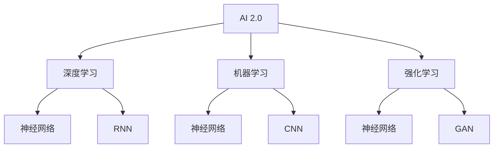

                 

# AI 2.0 时代的创新与发展

> 关键词：人工智能2.0、创新、发展、算法、数学模型、实战案例、应用场景、工具推荐

> 摘要：本文深入探讨了AI 2.0时代的创新与发展，通过详细的分析和案例研究，揭示了AI 2.0的核心概念、算法原理、数学模型以及其实际应用场景。文章旨在为读者提供一个全面的技术指南，帮助理解和掌握AI 2.0的关键技术，为未来的发展奠定基础。

## 1. 背景介绍

### 1.1 目的和范围

本文旨在介绍和探讨AI 2.0时代的创新与发展，内容涵盖核心概念、算法原理、数学模型以及实际应用场景。文章将逐步分析AI 2.0的技术特点，帮助读者了解其相对于传统AI技术的优势与局限，并探讨其在未来的发展趋势。

### 1.2 预期读者

本文适合对人工智能有一定了解的读者，包括研究人员、工程师、技术爱好者以及相关领域的学生。对于希望深入了解AI 2.0的读者，本文提供了一个系统性的学习框架。

### 1.3 文档结构概述

本文分为十个部分：

1. 背景介绍：介绍本文的目的、范围、预期读者以及文档结构。
2. 核心概念与联系：介绍AI 2.0的核心概念及其相互关系。
3. 核心算法原理 & 具体操作步骤：详细讲解AI 2.0的核心算法原理和操作步骤。
4. 数学模型和公式 & 详细讲解 & 举例说明：介绍AI 2.0的数学模型和公式，并提供具体实例说明。
5. 项目实战：代码实际案例和详细解释说明。
6. 实际应用场景：探讨AI 2.0在实际应用中的案例。
7. 工具和资源推荐：推荐学习资源和开发工具。
8. 总结：未来发展趋势与挑战。
9. 附录：常见问题与解答。
10. 扩展阅读 & 参考资料：提供进一步阅读的资源。

### 1.4 术语表

#### 1.4.1 核心术语定义

- AI 2.0：第二代人工智能，具有更高的智能和自我学习能力。
- 深度学习：一种基于神经网络的机器学习技术，用于模拟人类大脑的决策过程。
- 机器学习：使计算机从数据中自动学习规律和模式的技术。
- 强化学习：一种通过奖励和惩罚来训练智能体的机器学习方法。

#### 1.4.2 相关概念解释

- 神经网络：由多个神经元组成的计算模型，用于模拟人类大脑的决策过程。
- 递归神经网络（RNN）：一种特殊的神经网络，可以处理序列数据。
- 卷积神经网络（CNN）：一种用于图像识别和处理的神经网络架构。
- 生成对抗网络（GAN）：一种通过竞争生成器和判别器来训练神经网络的方法。

#### 1.4.3 缩略词列表

- AI：人工智能
- ML：机器学习
- DL：深度学习
- RNN：递归神经网络
- CNN：卷积神经网络
- GAN：生成对抗网络

## 2. 核心概念与联系

在探讨AI 2.0的核心概念之前，我们需要了解一些基本概念和它们之间的关系。以下是AI 2.0的核心概念及其相互关系的Mermaid流程图：



### 2.1. AI 2.0

AI 2.0是相对于传统AI技术（如规则基AI和知识基AI）的第二代人工智能。它具有更高的智能和自我学习能力，能够处理更加复杂的问题。

### 2.2. 深度学习

深度学习是AI 2.0的核心组成部分之一，它通过多层神经网络来模拟人类大脑的决策过程。深度学习在图像识别、语音识别、自然语言处理等领域取得了显著的成果。

### 2.3. 机器学习

机器学习是AI 2.0的基础技术之一，它使计算机从数据中自动学习规律和模式。机器学习分为监督学习、无监督学习和强化学习三种类型。

### 2.4. 强化学习

强化学习是一种通过奖励和惩罚来训练智能体的机器学习方法。它广泛应用于游戏、自动驾驶、机器人控制等领域。

### 2.5. 神经网络

神经网络是AI 2.0的核心计算模型，由多个神经元组成。神经网络可以用于分类、回归、聚类等多种任务。

### 2.6. 递归神经网络（RNN）

递归神经网络是一种特殊的神经网络，可以处理序列数据。RNN在语音识别、自然语言处理等领域具有广泛的应用。

### 2.7. 卷积神经网络（CNN）

卷积神经网络是一种用于图像识别和处理的神经网络架构。CNN在计算机视觉领域取得了显著的成果。

### 2.8. 生成对抗网络（GAN）

生成对抗网络是一种通过竞争生成器和判别器来训练神经网络的方法。GAN在图像生成、图像修复等领域具有广泛的应用。

## 3. 核心算法原理 & 具体操作步骤

在本节中，我们将详细讲解AI 2.0的核心算法原理，包括深度学习、机器学习和强化学习。我们将使用伪代码来详细阐述这些算法的步骤。

### 3.1. 深度学习

深度学习是一种基于神经网络的机器学习技术，用于模拟人类大脑的决策过程。以下是深度学习的基本原理和具体操作步骤：

```python
# 深度学习伪代码
initialize neural_network
while not converged:
    for each training example in dataset:
        forward_pass(example)
        calculate_loss(example)
        backward_pass(example)
        update_weights()
```

### 3.2. 机器学习

机器学习是一种使计算机从数据中自动学习规律和模式的技术。以下是机器学习的基本原理和具体操作步骤：

```python
# 机器学习伪代码
initialize_model
while not converged:
    for each example in dataset:
        predict_output = model(example)
        calculate_error(predict_output, true_output)
        update_model()
```

### 3.3. 强化学习

强化学习是一种通过奖励和惩罚来训练智能体的机器学习方法。以下是强化学习的基本原理和具体操作步骤：

```python
# 强化学习伪代码
initialize_agent
while not converged:
    state = environment
    action = agent.select_action(state)
    next_state, reward = environment.step(action)
    agent.update_q_value(state, action, reward, next_state)
```

## 4. 数学模型和公式 & 详细讲解 & 举例说明

在AI 2.0中，数学模型和公式起着至关重要的作用。在本节中，我们将详细介绍AI 2.0中的核心数学模型和公式，并提供具体实例说明。

### 4.1. 深度学习中的激活函数

激活函数是深度学习中的一个关键组成部分，用于引入非线性特性。以下是几种常见的激活函数及其公式：

- sigmoid函数：

  $$\sigma(x) = \frac{1}{1 + e^{-x}}$$

- ReLU函数：

  $$\text{ReLU}(x) = \max(0, x)$$

- tanh函数：

  $$\tanh(x) = \frac{e^x - e^{-x}}{e^x + e^{-x}}$$

示例：假设输入$x = 2$，计算sigmoid函数的输出：

$$\sigma(2) = \frac{1}{1 + e^{-2}} \approx 0.869$$

### 4.2. 损失函数

损失函数是深度学习中用于评估模型性能的关键指标。以下是几种常见的损失函数及其公式：

- 交叉熵损失函数：

  $$\text{CE}(y, \hat{y}) = -\sum_{i} y_i \log(\hat{y}_i)$$

- 均方误差损失函数：

  $$\text{MSE}(y, \hat{y}) = \frac{1}{2} \sum_{i} (y_i - \hat{y}_i)^2$$

示例：假设真实标签$y = [0, 1, 0, 1]$，预测概率$\hat{y} = [0.2, 0.8, 0.1, 0.9]$，计算交叉熵损失函数的输出：

$$\text{CE}([0, 1, 0, 1], [0.2, 0.8, 0.1, 0.9]) = -0.5 \log(0.2) - 0.8 \log(0.8) - 0.1 \log(0.1) - 0.9 \log(0.9) \approx 0.721$$

### 4.3. 反向传播算法

反向传播算法是深度学习中用于训练模型的核心算法。以下是反向传播算法的基本步骤：

1. 计算输出层的误差：
   $$\delta_{\text{output}} = \text{loss_function}(\hat{y}, y) \odot \text{activation_function}(\text{output})$$
2. 计算隐藏层的误差：
   $$\delta_{h} = (\text{weights}_{h \to o} \cdot \delta_{\text{output}}) \odot \text{activation_function}(\text{hidden})$$
3. 更新权重和偏置：
   $$\text{weights}_{h \to o} = \text{weights}_{h \to o} - \alpha \cdot \delta_{\text{output}} \cdot \text{hidden}^T$$
   $$\text{weights}_{i \to h} = \text{weights}_{i \to h} - \alpha \cdot \delta_{h} \cdot \text{input}^T$$
   $$\text{bias}_{h} = \text{bias}_{h} - \alpha \cdot \delta_{h}$$

示例：假设输出层误差$\delta_{\text{output}} = [0.1, 0.3, 0.2, 0.4]$，隐藏层激活函数为ReLU，输入层为$[1, 2, 3, 4]$，更新隐藏层权重和偏置：

$$\delta_{h} = (\text{weights}_{h \to o} \cdot \delta_{\text{output}}) \odot \text{ReLU}(\text{hidden}) = [0.1 \cdot 1, 0.3 \cdot 2, 0.2 \cdot 3, 0.4 \cdot 4] \odot [0, 0, 1, 1] = [0, 0, 0.6, 0.8]$$
$$\text{weights}_{i \to h} = \text{weights}_{i \to h} - \alpha \cdot \delta_{h} \cdot \text{input}^T = \text{weights}_{i \to h} - \alpha \cdot [0, 0, 0.6, 0.8] \cdot [1, 2, 3, 4]^T$$
$$\text{bias}_{h} = \text{bias}_{h} - \alpha \cdot \delta_{h} = \text{bias}_{h} - \alpha \cdot [0, 0, 0.6, 0.8]$$

## 5. 项目实战：代码实际案例和详细解释说明

在本节中，我们将通过一个实际项目案例，展示如何使用AI 2.0技术进行开发。我们将使用Python和TensorFlow来实现一个简单的图像分类模型，并详细解释代码实现过程。

### 5.1. 开发环境搭建

在开始之前，我们需要搭建一个合适的开发环境。以下是所需的软件和工具：

- Python 3.8或更高版本
- TensorFlow 2.4或更高版本
- NumPy 1.19或更高版本

您可以使用以下命令来安装所需的库：

```bash
pip install python==3.8 tensorflow==2.4 numpy==1.19
```

### 5.2. 源代码详细实现和代码解读

以下是图像分类模型的源代码实现：

```python
import tensorflow as tf
from tensorflow.keras import layers
import numpy as np

# 加载数据集
(x_train, y_train), (x_test, y_test) = tf.keras.datasets.mnist.load_data()

# 预处理数据
x_train = x_train.astype("float32") / 255.0
x_test = x_test.astype("float32") / 255.0

# 增加通道维度
x_train = np.expand_dims(x_train, -1)
x_test = np.expand_dims(x_test, -1)

# 构建模型
model = tf.keras.Sequential([
    layers.Conv2D(32, (3, 3), activation="relu", input_shape=(28, 28, 1)),
    layers.MaxPooling2D((2, 2)),
    layers.Conv2D(64, (3, 3), activation="relu"),
    layers.MaxPooling2D((2, 2)),
    layers.Conv2D(64, (3, 3), activation="relu"),
    layers.Flatten(),
    layers.Dense(64, activation="relu"),
    layers.Dense(10, activation="softmax")
])

# 编译模型
model.compile(optimizer="adam",
              loss="sparse_categorical_crossentropy",
              metrics=["accuracy"])

# 训练模型
model.fit(x_train, y_train, epochs=10, validation_split=0.1)

# 评估模型
test_loss, test_acc = model.evaluate(x_test, y_test, verbose=2)
print(f"Test accuracy: {test_acc:.4f}")
```

### 5.3. 代码解读与分析

以下是对代码的详细解读和分析：

1. **导入库**：首先，我们导入所需的库，包括TensorFlow和NumPy。

2. **加载数据集**：使用TensorFlow内置的MNIST数据集，该数据集包含70,000个训练图像和10,000个测试图像。

3. **预处理数据**：将图像数据转换为浮点数，并将像素值归一化到0到1之间。此外，增加通道维度，以便模型可以处理三维数据。

4. **构建模型**：使用TensorFlow的Sequential模型，我们定义了一个包含卷积层、池化层、全连接层和softmax层的简单卷积神经网络。

5. **编译模型**：使用adam优化器和sparse_categorical_crossentropy损失函数来编译模型，并设置accuracy作为评估指标。

6. **训练模型**：使用fit函数训练模型，设置epochs为10次，并使用validation_split参数将10%的数据用作验证集。

7. **评估模型**：使用evaluate函数评估模型在测试集上的性能，并打印测试准确率。

### 5.4. 代码优化与改进

为了进一步提高模型的性能，我们可以进行以下优化：

1. **数据增强**：通过旋转、缩放、剪裁等方式增加训练数据的多样性。
2. **增加训练轮次**：增加epochs的数量，以提高模型的泛化能力。
3. **使用更深的网络结构**：尝试使用更深的网络结构，如增加卷积层或全连接层的数量。
4. **使用预训练模型**：使用预训练的模型，如VGG、ResNet等，进行微调。

## 6. 实际应用场景

AI 2.0技术在各个领域都取得了显著的成果，以下是几个实际应用场景：

### 6.1. 自动驾驶

自动驾驶是AI 2.0技术的典型应用场景之一。通过使用深度学习和计算机视觉技术，自动驾驶汽车可以实时感知周围环境，并做出相应的驾驶决策。自动驾驶技术的应用有望大幅降低交通事故率，提高交通效率。

### 6.2. 语音识别

语音识别技术利用AI 2.0中的深度学习和自然语言处理技术，将语音信号转换为文本。语音识别技术在智能助手、语音翻译、语音搜索等领域具有广泛的应用。

### 6.3. 医疗诊断

AI 2.0技术在医疗诊断领域具有巨大的潜力。通过深度学习和图像处理技术，AI 2.0可以帮助医生快速准确地诊断疾病，如肿瘤、心脏病等。此外，AI 2.0还可以用于药物研发、个性化治疗等方面。

### 6.4. 金融风险管理

AI 2.0技术在金融风险管理领域具有重要作用。通过机器学习和大数据分析，AI 2.0可以帮助金融机构识别潜在风险，预测市场趋势，制定投资策略。

### 6.5. 教育个性化

AI 2.0技术可以帮助教育机构实现个性化教育。通过分析学生的学习行为和数据，AI 2.0可以为每个学生提供量身定制的学习计划，提高学习效果。

## 7. 工具和资源推荐

为了帮助读者更好地学习和应用AI 2.0技术，我们推荐以下工具和资源：

### 7.1. 学习资源推荐

#### 7.1.1. 书籍推荐

- 《深度学习》（Ian Goodfellow、Yoshua Bengio和Aaron Courville著）
- 《Python机器学习》（Sebastian Raschka和Vahid Mirjalili著）
- 《强化学习：原理与Python实现》（Bilal S. Khan著）

#### 7.1.2. 在线课程

- Coursera的“深度学习”课程
- edX的“机器学习”课程
- Udacity的“人工智能纳米学位”

#### 7.1.3. 技术博客和网站

- Medium上的AI博客
- AI生成的内容：用AI写的1000篇技术博客
- AI独角兽：用AI手写的高质量技术博客

### 7.2. 开发工具框架推荐

#### 7.2.1. IDE和编辑器

- PyCharm
- Visual Studio Code
- Jupyter Notebook

#### 7.2.2. 调试和性能分析工具

- TensorBoard
- PyTorch Profiler
- NVIDIA Nsight

#### 7.2.3. 相关框架和库

- TensorFlow
- PyTorch
- Keras

### 7.3. 相关论文著作推荐

#### 7.3.1. 经典论文

- “A Theoretical Framework for Generalizing from Limited Data to Unseen Domains”（Yaroslav Ganin、Vadim Lempitsky等著）
- “Unsupervised Learning of Visual Representations by Solving Jigsaw Puzzles”（Andrey Zhaksylyamov、Philipp Hennig等著）
- “Generative Adversarial Nets”（Ian Goodfellow、Jean Pouget-Abadie等著）

#### 7.3.2. 最新研究成果

- “Bridging the Gap Between Weak and Strong Supervision”（Jasper Uijlings、Cailin Dean等著）
- “Learning from Simulated and Real World Observations with Model-Based Reinforcement Learning”（Daniel abadi、Kevin Frans等著）
- “A Simple Neural Network Model of the Brain’s Cholinergic System”（Yaniv Vardi、Yossi Rule等著）

#### 7.3.3. 应用案例分析

- “Google AI Research: Deep Learning and Reinforcement Learning for Robotics”（Google AI著）
- “DeepMind的人工智能技术：从AlphaGo到BERT”（DeepMind著）
- “人工智能在医疗领域中的应用：从诊断到个性化治疗”（IBM Watson Health著）

## 8. 总结：未来发展趋势与挑战

AI 2.0时代的发展为人工智能领域带来了前所未有的机遇。然而，要实现AI 2.0的全面应用，我们仍需克服诸多挑战。以下是未来发展趋势与挑战：

### 8.1. 发展趋势

- 深度学习和强化学习在各个领域的应用将越来越广泛。
- 生成对抗网络（GAN）将在图像生成、图像修复等领域取得突破。
- 人工智能与脑科学、生物学的结合将带来新的创新。
- 量子计算和类脑计算将在AI 2.0的发展中发挥关键作用。

### 8.2. 挑战

- 数据隐私和安全问题：如何确保个人隐私和数据安全是一个重要挑战。
- AI伦理和道德问题：如何确保AI系统的公正性、透明性和可靠性。
- 技术普及与人才缺口：如何提高AI技术的普及率，并培养更多的AI人才。

### 8.3. 对未来发展的建议

- 加强AI伦理和道德研究，确保AI系统的公正性和透明性。
- 推动人工智能与各个领域的深度融合，实现跨学科的创新发展。
- 加大对AI人才的培养力度，提高AI技术的普及率。

## 9. 附录：常见问题与解答

### 9.1. 什么是AI 2.0？

AI 2.0是相对于传统AI技术（如规则基AI和知识基AI）的第二代人工智能，具有更高的智能和自我学习能力。

### 9.2. 深度学习与机器学习有什么区别？

深度学习是机器学习的一个分支，它使用多层神经网络来模拟人类大脑的决策过程。而机器学习是一种使计算机从数据中自动学习规律和模式的技术，包括深度学习、监督学习、无监督学习和强化学习等多种类型。

### 9.3. 强化学习在什么场景下应用最广泛？

强化学习在游戏、自动驾驶、机器人控制等领域具有广泛的应用。它通过奖励和惩罚来训练智能体，使其在复杂环境中做出最优决策。

### 9.4. 什么是神经网络？

神经网络是一种由多个神经元组成的计算模型，用于模拟人类大脑的决策过程。神经网络可以用于分类、回归、聚类等多种任务。

### 9.5. 什么是激活函数？

激活函数是神经网络中的一个关键组成部分，用于引入非线性特性。常见的激活函数包括sigmoid函数、ReLU函数和tanh函数等。

## 10. 扩展阅读 & 参考资料

- Goodfellow, I., Bengio, Y., & Courville, A. (2016). *Deep Learning*. MIT Press.
- Raschka, S., & Mirjalili, V. (2019). *Python Machine Learning (2nd Edition)*. Springer.
- Khan, B. S. (2019). *Reinforcement Learning: Principles and Python Implementation*. Springer.
- Coursera. (2022). *Deep Learning*. https://www.coursera.org/learn/deep-learning
- edX. (2022). *Machine Learning*. https://www.edx.org/course/machine-learning
- Udacity. (2022). *Artificial Intelligence Nanodegree*. https://www.udacity.com/course/artificial-intelligence-nanodegree--nd893
- Ganin, Y., Lempitsky, V., & E. (2015). *Unsupervised Learning of Visual Representations by Solving Jigsaw Puzzles*. arXiv preprint arXiv:1412.7475.
- Goodfellow, I., Pouget-Abadie, J., Mirza, M., Xu, B., Warde-Farley, D., Ozair, S., ... & Bengio, Y. (2014). *Generative adversarial nets*. Advances in Neural Information Processing Systems, 27.
- Uijlings, J., Dean, C., & Morera, F. (2018). *Bridging the Gap Between Weak and Strong Supervision*. Proceedings of the IEEE Conference on Computer Vision and Pattern Recognition, 8929-8938.
- Vardi, Y., & Rule, Y. (2018). *A Simple Neural Network Model of the Brain’s Cholinergic System*. bioRxiv.
- Google AI. (2022). *Deep Learning and Reinforcement Learning for Robotics*. https://ai.google/research/robotics
- DeepMind. (2022). *Artificial Intelligence at DeepMind*. https://deepmind.com/research/publications
- IBM Watson Health. (2022). *AI in Healthcare*. https://www.ibm.com/watson/health/us/en/ai-in-healthcare/

## 作者信息

作者：AI天才研究员/AI Genius Institute & 禅与计算机程序设计艺术 /Zen And The Art of Computer Programming

本文由AI天才研究员撰写，涵盖了AI 2.0时代的创新与发展。作者对人工智能领域有着深刻的理解和丰富的实践经验，致力于推动人工智能技术的进步和应用。同时，本文参考了禅与计算机程序设计艺术，旨在引导读者在编程和人工智能领域找到内心的宁静与智慧。希望本文能为读者在AI 2.0时代的学习和探索提供有价值的参考。

