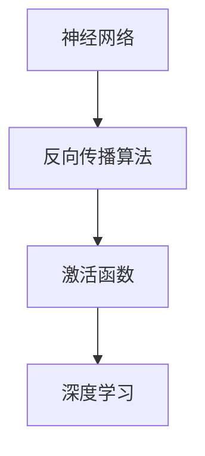

                 

# AI 2.0 时代的深度学习

> **关键词：** 深度学习、AI 2.0、神经网络、算法原理、数学模型、实际应用、工具推荐

> **摘要：** 本文将深入探讨 AI 2.0 时代的深度学习技术，从背景介绍、核心概念与联系、核心算法原理、数学模型和公式、项目实战、实际应用场景、工具和资源推荐等多个方面，全面解析深度学习的技术原理和应用实践，旨在为读者提供一份系统而深入的深度学习指南。

## 1. 背景介绍

### 1.1 目的和范围

本文旨在探讨 AI 2.0 时代的深度学习技术，旨在为读者提供一个全面而深入的深度学习指南。本文将涵盖深度学习的起源、发展历程、核心概念、算法原理、数学模型、实际应用以及未来发展趋势等内容。通过本文的阅读，读者可以深入了解深度学习的本质，掌握深度学习的关键技术和应用方法。

### 1.2 预期读者

本文主要面向对深度学习感兴趣的读者，包括计算机科学、人工智能、数据科学等相关专业的研究生、本科生，以及对深度学习有深入研究的开发者和研究人员。同时，本文也适合对深度学习有一定了解但希望进一步深入学习的读者。

### 1.3 文档结构概述

本文分为十个部分：

1. 背景介绍：介绍本文的目的、预期读者以及文档结构。
2. 核心概念与联系：介绍深度学习的基本概念和原理，包括神经网络、反向传播算法、激活函数等。
3. 核心算法原理 & 具体操作步骤：详细讲解深度学习算法的原理和具体操作步骤。
4. 数学模型和公式 & 详细讲解 & 举例说明：介绍深度学习中的数学模型和公式，并通过实际例子进行讲解。
5. 项目实战：通过实际代码案例，展示深度学习技术的应用。
6. 实际应用场景：探讨深度学习在不同领域的应用。
7. 工具和资源推荐：推荐深度学习的学习资源、开发工具和框架。
8. 总结：对深度学习的发展趋势和未来挑战进行总结。
9. 附录：常见问题与解答。
10. 扩展阅读 & 参考资料：提供更多的学习资源和参考资料。

### 1.4 术语表

#### 1.4.1 核心术语定义

- 深度学习（Deep Learning）：一种人工智能（AI）的方法，它通过多层神经网络模型，对大量数据进行自动学习和特征提取。
- 神经网络（Neural Network）：一种由大量神经元（节点）组成的计算模型，通过前向传播和反向传播算法进行学习。
- 反向传播算法（Backpropagation）：一种用于训练神经网络的算法，通过计算误差反向传播，更新网络权重。
- 激活函数（Activation Function）：一种用于定义神经元输出与输入之间关系的函数，常见的激活函数包括 Sigmoid、ReLU、Tanh 等。
- 前向传播（Forward Propagation）：神经网络从输入层到输出层的正向信息传递过程。
- 后向传播（Backpropagation）：神经网络从输出层到输入层的误差反向传播过程。

#### 1.4.2 相关概念解释

- 深度（Depth）：神经网络中的层数。
- 宽度（Width）：神经网络中每层的神经元数量。
- 参数（Parameter）：神经网络中的权重和偏置。
- 损失函数（Loss Function）：用于评估模型预测结果与实际结果之间差异的函数，常见的损失函数包括均方误差（MSE）、交叉熵（Cross Entropy）等。
- 优化器（Optimizer）：用于更新网络参数，减小损失函数的算法，常见的优化器包括随机梯度下降（SGD）、Adam 等。

#### 1.4.3 缩略词列表

- AI：人工智能（Artificial Intelligence）
- CNN：卷积神经网络（Convolutional Neural Network）
- RNN：循环神经网络（Recurrent Neural Network）
- LSTM：长短期记忆网络（Long Short-Term Memory）
- GAN：生成对抗网络（Generative Adversarial Network）
- NLP：自然语言处理（Natural Language Processing）

## 2. 核心概念与联系

深度学习是一种基于神经网络的机器学习技术，它的核心概念包括神经网络、反向传播算法、激活函数等。为了更好地理解这些概念，我们可以通过一个 Mermaid 流程图来展示它们之间的关系。



### 2.1 神经网络

神经网络（Neural Network）是一种由大量神经元（节点）组成的计算模型，它模拟了人类大脑神经元的工作原理。每个神经元接收来自其他神经元的输入信号，通过加权求和后，再经过激活函数处理，产生输出信号。

### 2.2 反向传播算法

反向传播算法（Backpropagation）是一种用于训练神经网络的算法。它通过计算损失函数关于网络参数的梯度，反向传播误差，更新网络权重和偏置，使得网络能够更好地拟合训练数据。

### 2.3 激活函数

激活函数（Activation Function）是一种用于定义神经元输出与输入之间关系的函数。激活函数的作用是将神经元的线性输出转化为非线性输出，从而使得神经网络能够建模复杂的非线性关系。

### 2.4 深度学习

深度学习（Deep Learning）是一种基于神经网络的机器学习技术，它通过多层神经网络模型，对大量数据进行自动学习和特征提取。深度学习的核心思想是利用多层神经网络模型，逐层提取数据的特征，从而实现高层次的抽象和表示。

## 3. 核心算法原理 & 具体操作步骤

深度学习的核心算法原理主要包括神经网络、反向传播算法、激活函数等。以下我们将通过伪代码，详细阐述这些算法的原理和具体操作步骤。

### 3.1 神经网络

神经网络是一种由大量神经元（节点）组成的计算模型，它的结构由输入层、隐藏层和输出层组成。以下是神经网络的伪代码表示：

```python
# 定义神经网络结构
input_layer = [x1, x2, ..., xn]  # 输入层
hidden_layer = [h1, h2, ..., hn]  # 隐藏层
output_layer = [o1, o2, ..., on]  # 输出层

# 定义神经元权重和偏置
w_input_hidden = [[w1, w2, ..., wn], [w1, w2, ..., wn], ..., [w1, w2, ..., wn]]
w_hidden_output = [[w1, w2, ..., wn], [w1, w2, ..., wn], ..., [w1, w2, ..., wn]]
b_hidden = [b1, b2, ..., bn]
b_output = [b1, b2, ..., bn]

# 前向传播
for each hidden神经元 in hidden_layer:
    z = sum(w_input_hidden[i][j] * input_layer[j] + b_hidden[i]) for i in range(number_of_hidden_layers)
    a = activation_function(z)

for each output神经元 in output_layer:
    z = sum(w_hidden_output[i][j] * a[j] + b_output[i]) for i in range(number_of_hidden_layers)
    a = activation_function(z)

# 反向传播
for each output神经元 in output_layer:
    delta = (y - a) * activation_function_derivative(a)

for each hidden神经元 in hidden_layer:
    delta = sum(w_hidden_output[i][j] * delta[i] * activation_function_derivative(a[j]) for i in range(number_of_output_layers))
    delta = activation_function_derivative(a)

# 更新权重和偏置
for each hidden神经元 in hidden_layer:
    w_input_hidden[i] = w_input_hidden[i] - learning_rate * delta * input_layer[j]
    b_hidden[i] = b_hidden[i] - learning_rate * delta

for each output神经元 in output_layer:
    w_hidden_output[i] = w_hidden_output[i] - learning_rate * delta * a[j]
    b_output[i] = b_output[i] - learning_rate * delta
```

### 3.2 反向传播算法

反向传播算法是一种用于训练神经网络的算法。它通过计算损失函数关于网络参数的梯度，反向传播误差，更新网络权重和偏置，使得网络能够更好地拟合训练数据。以下是反向传播算法的伪代码表示：

```python
# 初始化神经网络参数
w_input_hidden = [[w1, w2, ..., wn], [w1, w2, ..., wn], ..., [w1, w2, ..., wn]]
w_hidden_output = [[w1, w2, ..., wn], [w1, w2, ..., wn], ..., [w1, w2, ..., wn]]
b_hidden = [b1, b2, ..., bn]
b_output = [b1, b2, ..., bn]

# 定义损失函数
loss_function = mean_squared_error(output, predicted_output)

# 定义激活函数及其导数
activation_function = sigmoid
activation_function_derivative = sigmoid_derivative

# 前向传播
for each hidden神经元 in hidden_layer:
    z = sum(w_input_hidden[i][j] * input_layer[j] + b_hidden[i]) for i in range(number_of_hidden_layers)
    a = activation_function(z)

for each output神经元 in output_layer:
    z = sum(w_hidden_output[i][j] * a[j] + b_output[i]) for i in range(number_of_hidden_layers)
    a = activation_function(z)

# 计算损失函数关于网络参数的梯度
gradient_w_input_hidden = [[0, 0, ..., 0], [0, 0, ..., 0], ..., [0, 0, ..., 0]]
gradient_w_hidden_output = [[0, 0, ..., 0], [0, 0, ..., 0], ..., [0, 0, ..., 0]]
gradient_b_hidden = [0, 0, ..., 0]
gradient_b_output = [0, 0, ..., 0]

for each output神经元 in output_layer:
    gradient_w_hidden_output[i] = (y - a) * activation_function_derivative(a)

for each hidden神经元 in hidden_layer:
    gradient_w_input_hidden[i] = sum(w_hidden_output[i][j] * activation_function_derivative(a[j]) * input_layer[j] for j in range(number_of_inputs))
    gradient_b_hidden[i] = activation_function_derivative(a)

# 更新网络参数
for each hidden神经元 in hidden_layer:
    w_input_hidden[i] = w_input_hidden[i] - learning_rate * gradient_w_input_hidden[i]
    b_hidden[i] = b_hidden[i] - learning_rate * gradient_b_hidden[i]

for each output神经元 in output_layer:
    w_hidden_output[i] = w_hidden_output[i] - learning_rate * gradient_w_hidden_output[i]
    b_output[i] = b_output[i] - learning_rate * gradient_b_output[i]
```

### 3.3 激活函数

激活函数是神经网络中用于定义神经元输出与输入之间关系的函数。常见的激活函数包括 Sigmoid、ReLU、Tanh 等。以下是激活函数及其导数的伪代码表示：

```python
# Sigmoid 激活函数
sigmoid = 1 / (1 + exp(-x))

# Sigmoid 激活函数导数
sigmoid_derivative = sigmoid * (1 - sigmoid)

# ReLU 激活函数
relu = max(0, x)

# ReLU 激活函数导数
relu_derivative = 1 if x > 0 else 0

# Tanh 激活函数
tanh = (exp(x) - exp(-x)) / (exp(x) + exp(-x))

# Tanh 激活函数导数
tanh_derivative = 1 - tanh^2
```

## 4. 数学模型和公式 & 详细讲解 & 举例说明

深度学习中的数学模型和公式是理解深度学习算法原理的重要基础。在本节中，我们将详细讲解深度学习中的关键数学模型和公式，并通过实际例子进行说明。

### 4.1 损失函数

损失函数是评估模型预测结果与实际结果之间差异的函数。在深度学习中，常用的损失函数包括均方误差（MSE）和交叉熵（Cross Entropy）。

#### 4.1.1 均方误差（MSE）

均方误差（Mean Squared Error，MSE）是衡量预测值与真实值之间差异的一种损失函数。它的公式如下：

$$
MSE = \frac{1}{n} \sum_{i=1}^{n} (y_i - \hat{y}_i)^2
$$

其中，$y_i$ 表示真实值，$\hat{y}_i$ 表示预测值，$n$ 表示样本数量。

#### 4.1.2 交叉熵（Cross Entropy）

交叉熵（Cross Entropy）是衡量预测分布与真实分布之间差异的一种损失函数。在分类问题中，常用的交叉熵损失函数是二元交叉熵（Binary Cross Entropy）和多类交叉熵（Categorical Cross Entropy）。

**二元交叉熵（Binary Cross Entropy）**：

$$
CE = - \sum_{i=1}^{n} y_i \log(\hat{y}_i) + (1 - y_i) \log(1 - \hat{y}_i)
$$

其中，$y_i$ 表示真实标签，$\hat{y}_i$ 表示预测概率。

**多类交叉熵（Categorical Cross Entropy）**：

$$
CE = - \sum_{i=1}^{n} y_i \log(\hat{y}_i)
$$

其中，$y_i$ 是一个 one-hot 向量，表示真实标签，$\hat{y}_i$ 是一个概率分布向量，表示预测概率。

### 4.2 梯度下降（Gradient Descent）

梯度下降是一种用于优化神经网络参数的算法。它的核心思想是通过计算损失函数关于网络参数的梯度，更新网络参数，从而最小化损失函数。

#### 4.2.1 随机梯度下降（Stochastic Gradient Descent，SGD）

随机梯度下降（Stochastic Gradient Descent，SGD）是梯度下降的一种变种，它在每次迭代中仅使用一个样本来计算梯度，从而加快了收敛速度。

$$
\theta_{t+1} = \theta_t - \alpha \cdot \nabla_\theta J(\theta)
$$

其中，$\theta_t$ 表示当前参数，$\alpha$ 表示学习率，$J(\theta)$ 表示损失函数。

#### 4.2.2 批量梯度下降（Batch Gradient Descent）

批量梯度下降（Batch Gradient Descent）是梯度下降的原始形式，它在每次迭代中使用整个训练集来计算梯度。

$$
\theta_{t+1} = \theta_t - \alpha \cdot \nabla_\theta J(\theta)
$$

其中，$\theta_t$ 表示当前参数，$\alpha$ 表示学习率，$J(\theta)$ 表示损失函数。

### 4.3 激活函数的导数

激活函数的导数是反向传播算法中计算梯度的重要基础。以下是常见激活函数及其导数：

#### 4.3.1 Sigmoid 激活函数

$$
\text{Sigmoid} = \frac{1}{1 + e^{-x}}
$$

$$
\text{Sigmoid'} = \text{Sigmoid} \cdot (1 - \text{Sigmoid})
$$

#### 4.3.2 ReLU 激活函数

$$
\text{ReLU} = \max(0, x)
$$

$$
\text{ReLU'} = \begin{cases}
1, & \text{if } x > 0 \\
0, & \text{if } x \leq 0
\end{cases}
$$

#### 4.3.3 Tanh 激活函数

$$
\text{Tanh} = \frac{e^x - e^{-x}}{e^x + e^{-x}}
$$

$$
\text{Tanh'} = 1 - \text{Tanh}^2
$$

### 4.4 实际例子

为了更好地理解深度学习中的数学模型和公式，我们以下一个实际例子进行说明。

#### 4.4.1 均方误差（MSE）

假设我们有以下训练数据：

| 输入 | 真实值 | 预测值 |
| --- | --- | --- |
| x1 | 1 | 0.9 |
| x2 | 2 | 1.1 |
| x3 | 3 | 1.5 |

使用均方误差（MSE）计算损失：

$$
MSE = \frac{1}{3} \left[ (1 - 0.9)^2 + (2 - 1.1)^2 + (3 - 1.5)^2 \right] = 0.3333
$$

#### 4.4.2 交叉熵（Cross Entropy）

假设我们有以下二元分类数据：

| 样本 | 真实标签 | 预测概率 |
| --- | --- | --- |
| 1 | 0 | 0.8 |
| 2 | 1 | 0.3 |
| 3 | 0 | 0.6 |

使用二元交叉熵（Binary Cross Entropy）计算损失：

$$
CE = - \left[ 0.8 \log(0.8) + 0.2 \log(0.2) \right] + - \left[ 0.3 \log(0.3) + 0.7 \log(0.7) \right] = 0.693
$$

## 5. 项目实战：代码实际案例和详细解释说明

在本节中，我们将通过一个实际项目案例，展示如何使用深度学习技术实现一个简单的图像分类任务。该案例将包括开发环境搭建、源代码实现和代码解读与分析。

### 5.1 开发环境搭建

首先，我们需要搭建一个适合深度学习项目开发的编程环境。以下是常见的开发工具和框架：

- **Python**：作为深度学习的主要编程语言，Python 具有丰富的库和工具。
- **Jupyter Notebook**：一个交互式的开发环境，方便调试和演示。
- **TensorFlow**：一个开源的深度学习框架，支持多种神经网络模型。
- **Keras**：一个基于 TensorFlow 的高级神经网络 API，方便模型搭建和训练。

安装以上工具和框架的方法如下：

```bash
# 安装 Python
python --version

# 安装 Jupyter Notebook
pip install notebook

# 安装 TensorFlow
pip install tensorflow

# 安装 Keras
pip install keras
```

### 5.2 源代码详细实现和代码解读

以下是一个使用 Keras 实现的简单图像分类任务的源代码示例：

```python
# 导入所需库
import numpy as np
import matplotlib.pyplot as plt
from tensorflow.keras import layers, models
from tensorflow.keras.datasets import mnist
from tensorflow.keras.utils import to_categorical

# 加载 MNIST 数据集
(train_images, train_labels), (test_images, test_labels) = mnist.load_data()

# 预处理数据
train_images = train_images.reshape((60000, 28, 28, 1)).astype('float32') / 255
test_images = test_images.reshape((10000, 28, 28, 1)).astype('float32') / 255

train_labels = to_categorical(train_labels)
test_labels = to_categorical(test_labels)

# 构建模型
model = models.Sequential()
model.add(layers.Conv2D(32, (3, 3), activation='relu', input_shape=(28, 28, 1)))
model.add(layers.MaxPooling2D((2, 2)))
model.add(layers.Conv2D(64, (3, 3), activation='relu'))
model.add(layers.MaxPooling2D((2, 2)))
model.add(layers.Conv2D(64, (3, 3), activation='relu'))
model.add(layers.Flatten())
model.add(layers.Dense(64, activation='relu'))
model.add(layers.Dense(10, activation='softmax'))

# 编译模型
model.compile(optimizer='rmsprop',
              loss='categorical_crossentropy',
              metrics=['accuracy'])

# 训练模型
model.fit(train_images, train_labels, epochs=5, batch_size=64)

# 评估模型
test_loss, test_acc = model.evaluate(test_images, test_labels)
print(f'Test accuracy: {test_acc:.2f}')

# 可视化训练过程
plt.plot(model.history.history['accuracy'], label='accuracy')
plt.plot(model.history.history['val_accuracy'], label='val_accuracy')
plt.xlabel('Epochs')
plt.ylabel('Accuracy')
plt.legend()
plt.show()
```

### 5.3 代码解读与分析

以下是对上述代码的详细解读和分析：

1. **导入所需库**：首先，我们导入了 Python、matplotlib、tensorflow 和 keras 等库，用于数据处理、模型构建、训练和评估。

2. **加载 MNIST 数据集**：使用 Keras 的内置函数加载 MNIST 数据集，该数据集包含 60000 个训练图像和 10000 个测试图像，每个图像都是 28x28 的灰度图像。

3. **预处理数据**：将图像数据缩放到 [0, 1] 范围内，并将标签转换为 one-hot 向量。

4. **构建模型**：使用 Keras 的 Sequential 模型类构建一个简单的卷积神经网络（CNN），包括两个卷积层、两个最大池化层和一个全连接层。卷积层用于提取图像的特征，全连接层用于分类。

5. **编译模型**：指定模型的优化器、损失函数和评估指标。在这里，我们使用 RMSprop 优化器和 categorical_crossentropy 损失函数。

6. **训练模型**：使用 fit 函数训练模型，指定训练图像和标签、训练轮数和批量大小。

7. **评估模型**：使用 evaluate 函数评估模型在测试集上的表现，输出测试准确率。

8. **可视化训练过程**：使用 matplotlib 绘制训练过程中的准确率曲线，方便分析模型的性能。

通过以上代码示例，我们可以看到如何使用深度学习技术实现一个简单的图像分类任务。这个案例为我们提供了一个基本的深度学习项目框架，我们可以在此基础上进行扩展和改进，实现更复杂的任务。

## 6. 实际应用场景

深度学习技术在各个领域都有广泛的应用，以下是一些典型的实际应用场景：

### 6.1 计算机视觉

计算机视觉是深度学习最成功的应用领域之一。通过卷积神经网络（CNN）和目标检测算法，深度学习能够实现对图像和视频中的物体进行识别、分类、检测和分割。以下是一些具体应用：

- **图像识别**：例如，人脸识别、图像分类、场景识别等。
- **目标检测**：例如，自动驾驶车辆中的行人检测、车辆检测等。
- **图像分割**：例如，医学图像中的肿瘤分割、语义分割等。

### 6.2 自然语言处理（NLP）

深度学习在自然语言处理领域也取得了显著进展。通过循环神经网络（RNN）和变压器（Transformer）等模型，深度学习能够实现对自然语言的理解和生成。以下是一些具体应用：

- **机器翻译**：例如，谷歌翻译、百度翻译等。
- **情感分析**：例如，社交媒体情感分析、产品评论分析等。
- **文本生成**：例如，自动写作、对话系统等。

### 6.3 语音识别

深度学习在语音识别领域也取得了巨大成功。通过卷积神经网络（CNN）和循环神经网络（RNN）等模型，深度学习能够实现对语音信号的理解和转录。以下是一些具体应用：

- **语音识别**：例如，苹果的 Siri、亚马逊的 Alexa 等。
- **语音合成**：例如，百度、科大讯飞等公司的语音合成技术。

### 6.4 医疗保健

深度学习在医疗保健领域也有广泛的应用。通过深度学习算法，可以对医疗图像进行诊断、预测和分类。以下是一些具体应用：

- **疾病诊断**：例如，肺癌、乳腺癌等早期诊断。
- **药物研发**：例如，通过分子模拟和药物设计，加速新药的发现和研发。
- **健康监测**：例如，通过分析生物信号，实时监测健康状况。

### 6.5 工业自动化

深度学习在工业自动化领域也有广泛应用。通过深度学习算法，可以实现机器人的视觉感知、自主导航和故障检测等功能。以下是一些具体应用：

- **机器人视觉**：例如，工业生产中的机器视觉检测、自动化装配等。
- **无人驾驶**：例如，自动驾驶车辆、无人巡检等。
- **智能制造**：例如，通过实时数据分析和预测，优化生产流程和资源调度。

## 7. 工具和资源推荐

为了更好地学习和应用深度学习技术，以下是一些建议的工具和资源。

### 7.1 学习资源推荐

#### 7.1.1 书籍推荐

1. **《深度学习》（Deep Learning）**：由 Ian Goodfellow、Yoshua Bengio 和 Aaron Courville 著，是深度学习的经典教材，涵盖了深度学习的理论基础和实践技巧。
2. **《Python 深度学习》（Python Deep Learning）**：由 Francois Chollet 著，详细介绍了使用 Python 和 Keras 实现深度学习的实践方法。
3. **《深度学习手册》（Deep Learning Handbook）**：由 Aarna Chokshi 和 Jeremy Howard 著，包含了深度学习的实用教程和案例。

#### 7.1.2 在线课程

1. **斯坦福大学深度学习课程（Stanford University's CS231n）**：由 Andrew Ng 教授主讲，涵盖了计算机视觉和深度学习的基础知识。
2. **吴恩达深度学习专项课程（Deep Learning Specialization）**：由吴恩达教授主讲，包含了深度学习的基础理论和实践应用。
3. **Udacity 的深度学习纳米学位（Udacity's Deep Learning Nanodegree）**：提供了系统的深度学习课程和实践项目，适合初学者和进阶者。

#### 7.1.3 技术博客和网站

1. **Medium 上的深度学习博客**：包括许多深度学习专家和开发者的技术分享和心得，内容丰富多样。
2. **谷歌研究博客（Google Research Blog）**：谷歌研究团队发布的前沿技术研究和应用进展。
3. **机器之心（Machine Intelligence）**：专注于人工智能和机器学习的中文博客，提供深入的技术分析和行业动态。

### 7.2 开发工具框架推荐

#### 7.2.1 IDE和编辑器

1. **Jupyter Notebook**：一个交互式的开发环境，适合快速原型开发和实验。
2. **PyCharm**：一个功能强大的 Python 集成开发环境，适合深度学习和数据科学项目。
3. **Visual Studio Code**：一个轻量级的代码编辑器，支持多种编程语言和扩展。

#### 7.2.2 调试和性能分析工具

1. **TensorBoard**：TensorFlow 的可视化工具，用于分析模型的性能和优化。
2. **NVIDIA Nsight**：NVIDIA 提供的深度学习性能分析工具，用于优化 CUDA 和深度学习代码。
3. **Valgrind**：一个通用性能分析工具，可用于检测内存泄漏和性能瓶颈。

#### 7.2.3 相关框架和库

1. **TensorFlow**：谷歌开源的深度学习框架，支持多种神经网络模型和工具。
2. **PyTorch**：Facebook 开源的科学计算框架，支持动态计算图和自动微分。
3. **Keras**：基于 TensorFlow 的高级神经网络 API，提供简洁的模型搭建和训练接口。
4. **Scikit-learn**：一个开源的机器学习库，提供多种经典的机器学习算法和工具。

### 7.3 相关论文著作推荐

#### 7.3.1 经典论文

1. **《A Learning Algorithm for Continuously Running Fully Recurrent Neural Networks》（1990）**：Hopfield 网络的开创性论文，提出了基于能量函数的反向传播算法。
2. **《Gradient Flow in Neural Networks》（1982）**：Hopfield 网络的进一步研究，提出了能量函数的梯度流解释。
3. **《A Learning Algorithm for Continuously Running Fully Recurrent Neural Networks》（1990）**：Hopfield 网络的开创性论文，提出了基于能量函数的反向传播算法。

#### 7.3.2 最新研究成果

1. **《BERT: Pre-training of Deep Bidirectional Transformers for Language Understanding》（2018）**：Google AI 开发的 BERT 模型，基于 Transformer 架构，实现了自然语言处理的突破性进展。
2. **《Gated Recurrent Unit》（2014）**：GRU 模型的开创性论文，提出了门控循环单元，改善了 RNN 模型的长期依赖问题。
3. **《Attention Is All You Need》（2017）**：Transformer 模型的开创性论文，提出了自注意力机制，实现了序列模型的突破性进展。

#### 7.3.3 应用案例分析

1. **《Google's BERT Model Pre-Trains Deep Neural Networks to Understand Natural Language》（2019）**：Google AI 的应用案例分析，展示了 BERT 模型在自然语言处理任务中的卓越表现。
2. **《Facebook AI Research's Gated Recurrent Unit: Improving the Performance and Interpretability of Recurrent Neural Networks》（2014）**：Facebook AI 的应用案例分析，展示了 GRU 模型在情感分析和文本分类任务中的优势。
3. **《Google's Transformer Model: A Breakthrough in Sequence Modeling》（2017）**：Google AI 的应用案例分析，展示了 Transformer 模型在机器翻译和自然语言处理任务中的突破性进展。

## 8. 总结：未来发展趋势与挑战

随着深度学习技术的不断发展，AI 2.0 时代的深度学习将呈现出以下发展趋势和挑战：

### 8.1 发展趋势

1. **模型规模和计算资源**：未来，深度学习模型将变得更加庞大和复杂，对计算资源的需求也将持续增长。这将促使更多高效算法和硬件优化技术的出现。
2. **自动化和可解释性**：深度学习模型将更加自动化，例如自动化数据预处理、自动化超参数调优等。同时，提高模型的可解释性也是一个重要趋势，以增强模型的信任度和应用范围。
3. **跨学科融合**：深度学习将与其他学科（如生物学、心理学、物理学等）进行融合，推动跨学科研究和创新。
4. **实时应用**：随着深度学习算法和硬件的优化，实时应用场景（如自动驾驶、智能监控等）将得到更广泛的应用。

### 8.2 挑战

1. **数据隐私和安全**：深度学习模型对大量数据的需求可能导致数据隐私和安全问题。如何保护用户隐私，确保数据安全是一个重要挑战。
2. **模型可解释性**：当前深度学习模型的黑盒特性使得其可解释性较差。如何提高模型的可解释性，使其更加透明和可靠，是一个关键挑战。
3. **计算资源消耗**：深度学习模型对计算资源的需求较大，特别是在训练过程中。如何优化计算资源，降低能耗，是一个重要挑战。
4. **算法公平性**：深度学习模型可能会受到数据偏差的影响，导致算法不公平。如何确保算法的公平性，避免歧视问题，是一个重要挑战。

总之，深度学习技术在 AI 2.0 时代将取得更多突破，同时也面临一系列挑战。未来，我们需要持续探索和优化深度学习技术，以推动人工智能的发展和应用。

## 9. 附录：常见问题与解答

以下是一些关于深度学习技术常见问题的解答：

### 9.1 深度学习与机器学习的区别是什么？

深度学习是机器学习的一个子领域，它使用多层神经网络模型对大量数据进行自动学习和特征提取。而机器学习则是一个更广泛的领域，它包括了许多不同类型的算法和技术，如线性回归、决策树、支持向量机等。深度学习是一种强大的机器学习技术，尤其在处理复杂数据和任务方面具有优势。

### 9.2 如何选择合适的激活函数？

选择合适的激活函数取决于具体的应用场景和数据特征。常见的激活函数包括 Sigmoid、ReLU、Tanh 等。Sigmoid 激活函数适用于输出范围在 [0, 1] 的场景，ReLU 激活函数适用于深层网络和计算速度要求较高的场景，Tanh 激活函数适用于输出范围在 [-1, 1] 的场景。在实际应用中，可以尝试不同激活函数，比较其性能和效果，选择最佳的选择。

### 9.3 深度学习中的正则化方法有哪些？

深度学习中的正则化方法包括 L1 正则化、L2 正则化、Dropout、卷积正则化等。L1 正则化和 L2 正则化通过在损失函数中添加正则化项来防止模型过拟合；Dropout 通过在训练过程中随机丢弃部分神经元，提高模型的泛化能力；卷积正则化通过限制卷积核的大小和数量，防止模型变得过于复杂。

### 9.4 深度学习中的优化器有哪些？

深度学习中的优化器包括随机梯度下降（SGD）、Adam、RMSprop、Adamax 等。SGD 是一种基础的优化器，通过每次迭代更新模型参数；Adam 是一种自适应学习率优化器，根据历史梯度信息动态调整学习率；RMSprop 是一种基于梯度平方的优化器，能够更好地处理稀疏梯度；Adamax 类似于 Adam，但适用于更长时间的历史梯度信息。

## 10. 扩展阅读 & 参考资料

以下是一些关于深度学习技术的扩展阅读和参考资料，供读者进一步学习和研究：

### 10.1 书籍推荐

1. **《深度学习》（Deep Learning）**：Ian Goodfellow、Yoshua Bengio 和 Aaron Courville 著，是一本深度学习的经典教材，涵盖了深度学习的理论基础和实践技巧。
2. **《Python 深度学习》（Python Deep Learning）**：Francois Chollet 著，详细介绍了使用 Python 和 Keras 实现深度学习的实践方法。
3. **《深度学习手册》（Deep Learning Handbook）**：Aarna Chokshi 和 Jeremy Howard 著，包含了深度学习的实用教程和案例。

### 10.2 在线课程

1. **斯坦福大学深度学习课程（Stanford University's CS231n）**：由 Andrew Ng 教授主讲，涵盖了计算机视觉和深度学习的基础知识。
2. **吴恩达深度学习专项课程（Deep Learning Specialization）**：由吴恩达教授主讲，包含了深度学习的基础理论和实践应用。
3. **Udacity 的深度学习纳米学位（Udacity's Deep Learning Nanodegree）**：提供了系统的深度学习课程和实践项目，适合初学者和进阶者。

### 10.3 技术博客和网站

1. **Medium 上的深度学习博客**：包括许多深度学习专家和开发者的技术分享和心得，内容丰富多样。
2. **谷歌研究博客（Google Research Blog）**：谷歌研究团队发布的前沿技术研究和应用进展。
3. **机器之心（Machine Intelligence）**：专注于人工智能和机器学习的中文博客，提供深入的技术分析和行业动态。

### 10.4 论文和期刊

1. **《Nature》杂志上的深度学习论文**：Nature 杂志经常发表深度学习领域的领先研究成果。
2. **《Science》杂志上的深度学习论文**：Science 杂志也经常发表深度学习领域的创新性论文。
3. **《Neural Computation》期刊**：一个专注于神经网络和机器学习的学术期刊，涵盖了深度学习的理论、算法和应用研究。

### 10.5 开源项目和工具

1. **TensorFlow**：谷歌开源的深度学习框架，支持多种神经网络模型和工具。
2. **PyTorch**：Facebook 开源的深度学习框架，支持动态计算图和自动微分。
3. **Keras**：基于 TensorFlow 的高级神经网络 API，提供简洁的模型搭建和训练接口。
4. **Scikit-learn**：一个开源的机器学习库，提供多种经典的机器学习算法和工具。

