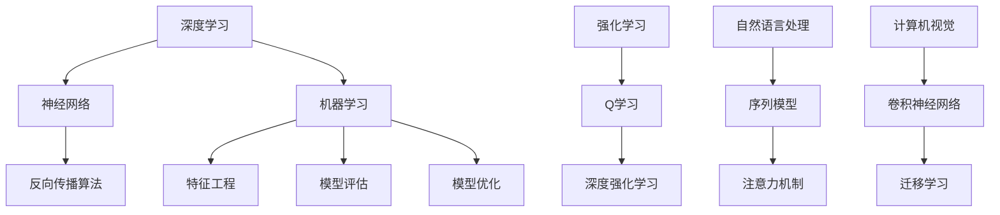
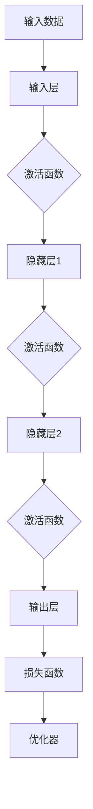
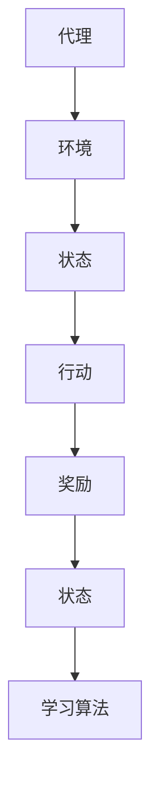
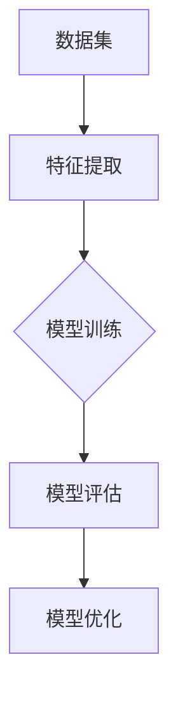

                 

# AI 2.0 时代的社会责任

> **关键词：AI 2.0、社会责任、伦理问题、技术监管、人工智能伦理**

> **摘要：随着人工智能技术的迅猛发展，AI 2.0 时代的到来不仅带来了前所未有的机遇，也引发了一系列的社会责任和伦理问题。本文将深入探讨这些挑战，分析技术监管的重要性，并提出解决路径，旨在为人工智能领域的可持续发展提供有益的思考。**

## 1. 背景介绍

### 1.1 目的和范围

本文旨在探讨 AI 2.0 时代的社会责任问题，分析当前人工智能领域面临的主要伦理挑战，并探讨解决方案。本文的讨论范围包括但不限于以下几个方面：

1. **AI 2.0 技术的特点与影响**：介绍 AI 2.0 的核心技术，如深度学习、强化学习等，及其在社会各个领域的应用。
2. **社会责任问题**：探讨 AI 技术在隐私、安全、就业等方面带来的社会影响。
3. **技术监管的重要性**：分析技术监管的必要性，探讨现有监管框架的不足，提出改进建议。
4. **人工智能伦理**：讨论人工智能伦理问题，包括透明度、公平性、可解释性等。

### 1.2 预期读者

本文面向对人工智能技术有一定了解的技术人员、研究人员、政策制定者以及对 AI 伦理问题感兴趣的普通读者。

### 1.3 文档结构概述

本文结构如下：

1. **背景介绍**：介绍 AI 2.0 时代的社会责任背景。
2. **核心概念与联系**：阐述 AI 2.0 的核心概念及相互联系。
3. **核心算法原理 & 具体操作步骤**：讲解 AI 2.0 的核心技术原理。
4. **数学模型和公式 & 详细讲解 & 举例说明**：介绍 AI 2.0 中的数学模型。
5. **项目实战：代码实际案例和详细解释说明**：通过实例展示 AI 2.0 应用。
6. **实际应用场景**：分析 AI 2.0 在现实世界中的应用。
7. **工具和资源推荐**：推荐相关学习资源和工具。
8. **总结：未来发展趋势与挑战**：总结 AI 2.0 的发展趋势和挑战。
9. **附录：常见问题与解答**：解答读者可能遇到的问题。
10. **扩展阅读 & 参考资料**：提供进一步学习的资源。

### 1.4 术语表

#### 1.4.1 核心术语定义

- **AI 2.0**：指下一代人工智能，具有更强的自我学习能力、灵活性和适应能力。
- **深度学习**：一种基于神经网络的人工智能算法，通过多层非线性变换来模拟人脑的学习过程。
- **强化学习**：一种使代理通过与环境的交互来学习最优策略的机器学习方法。
- **隐私**：指个人信息的保密性和不被未经授权的第三方访问。
- **伦理**：指关于道德和道德判断的原则和规范。

#### 1.4.2 相关概念解释

- **技术监管**：指通过法律、政策等手段对技术创新进行管理和监督。
- **透明度**：指人工智能系统的决策过程和结果可以被理解和解释。
- **公平性**：指人工智能系统在处理数据和应用时，对所有人公平对待，不产生歧视。

#### 1.4.3 缩略词列表

- **AI**：人工智能
- **DL**：深度学习
- **RL**：强化学习
- **GDPR**：通用数据保护条例

## 2. 核心概念与联系

在 AI 2.0 时代，核心概念包括深度学习、强化学习、机器学习、神经网络等。以下是一个简化的 Mermaid 流程图，展示了这些核心概念及其相互联系。



### 2.1 深度学习

深度学习是一种基于神经网络的人工智能算法，通过多层非线性变换来模拟人脑的学习过程。它能够自动提取特征，是 AI 2.0 时代的关键技术之一。以下是一个简化的深度学习模型示意图：



### 2.2 强化学习

强化学习是一种使代理通过与环境的交互来学习最优策略的机器学习方法。其核心思想是奖励和惩罚机制，以下是一个简化的强化学习模型示意图：



### 2.3 机器学习

机器学习是指通过算法从数据中自动学习和提取知识的过程。它包括监督学习、无监督学习和强化学习等子领域。以下是一个简化的机器学习流程图：



## 3. 核心算法原理 & 具体操作步骤

### 3.1 深度学习算法原理

深度学习算法的核心是多层神经网络，通过多层非线性变换来模拟人脑的学习过程。以下是一个简化的深度学习算法原理，使用伪代码进行阐述：

```python
# 输入数据X，权重W，偏置b，激活函数f
# 初始化权重和偏置

# 前向传播
for layer in range(1, num_layers):
    z = f(W * X + b)
    X = z

# 计算损失函数
loss = loss_function(y_pred, y_true)

# 反向传播
for layer in range(num_layers, 0, -1):
    dZ = d_loss_function(y_pred, y_true) * d_f(z)
    dW = dZ * X
    db = dZ
    X = X / m

# 更新权重和偏置
W -= learning_rate * dW
b -= learning_rate * db
```

### 3.2 强化学习算法原理

强化学习算法的核心是 Q 学习和深度强化学习。以下是一个简化的 Q 学习算法原理，使用伪代码进行阐述：

```python
# 初始化 Q 值表
Q = initialize_Q_values()

# 选择最佳动作
action = argmax(Q[s, :])

# 执行动作，获取奖励和下一状态
next_state, reward, done = environment.step(action)

# 更新 Q 值
Q[s, action] = Q[s, action] + learning_rate * (reward + gamma * max(Q[next_state, :]) - Q[s, action])

# 更新状态
s = next_state

# 结束条件判断
if done:
    break
```

### 3.3 机器学习算法原理

机器学习算法的核心是特征提取、模型训练、模型评估和模型优化。以下是一个简化的机器学习算法原理，使用伪代码进行阐述：

```python
# 特征提取
features = extract_features(data)

# 模型训练
model = train_model(features, labels)

# 模型评估
accuracy = evaluate_model(model, test_data, test_labels)

# 模型优化
model = optimize_model(model, features, labels)
```

## 4. 数学模型和公式 & 详细讲解 & 举例说明

### 4.1 深度学习数学模型

深度学习中的核心数学模型包括激活函数、损失函数、反向传播算法等。以下是对这些模型的详细讲解和举例说明。

#### 4.1.1 激活函数

激活函数是深度学习模型中的一个关键组成部分，用于引入非线性变换。以下是一些常见的激活函数：

- **Sigmoid 函数**：$$ \sigma(x) = \frac{1}{1 + e^{-x}} $$  
  示例：$$ \sigma(3) = \frac{1}{1 + e^{-3}} \approx 0.9502 $$

- **ReLU 函数**：$$ \text{ReLU}(x) = \max(0, x) $$  
  示例：$$ \text{ReLU}(-3) = 0 $$，$$ \text{ReLU}(3) = 3 $$

- **Tanh 函数**：$$ \tanh(x) = \frac{e^x - e^{-x}}{e^x + e^{-x}} $$  
  示例：$$ \tanh(3) \approx 0.966 $$

#### 4.1.2 损失函数

损失函数是评估模型预测结果与真实值之间差异的指标。以下是一些常见的损失函数：

- **均方误差损失函数**（MSE）：$$ \text{MSE}(y, \hat{y}) = \frac{1}{m} \sum_{i=1}^{m} (y_i - \hat{y}_i)^2 $$  
  示例：$$ \text{MSE}(y, \hat{y}) = \frac{1}{5} \sum_{i=1}^{5} (y_i - \hat{y}_i)^2 $$

- **交叉熵损失函数**（Cross-Entropy）：$$ \text{CE}(y, \hat{y}) = -\sum_{i=1}^{m} y_i \log(\hat{y}_i) $$  
  示例：$$ \text{CE}(y, \hat{y}) = -\sum_{i=1}^{5} y_i \log(\hat{y}_i) $$

#### 4.1.3 反向传播算法

反向传播算法是深度学习训练过程中的核心。以下是简化的反向传播算法步骤：

1. **前向传播**：计算输入层到输出层的损失函数。
2. **计算梯度**：计算损失函数关于模型参数的梯度。
3. **反向传播**：从输出层向输入层反向传播梯度。
4. **更新参数**：使用梯度下降算法更新模型参数。

以下是一个简化的伪代码示例：

```python
# 前向传播
z = f(W * X + b)
loss = loss_function(y_pred, y_true)

# 计算梯度
dZ = d_loss_function(y_pred, y_true) * d_f(z)
dW = dZ * X
db = dZ

# 更新参数
W -= learning_rate * dW
b -= learning_rate * db
```

### 4.2 强化学习数学模型

强化学习中的核心数学模型包括 Q 学习和策略梯度。

#### 4.2.1 Q 学习

Q 学习的目标是学习一个 Q 值表，表示状态 s 和动作 a 的最优价值。以下是 Q 学习的更新公式：

$$ Q[s, a] = Q[s, a] + learning_rate \cdot (reward + gamma \cdot max(Q[next_state, :]) - Q[s, a]) $$

示例：

假设当前状态为 s，执行动作 a，获得奖励 r，进入下一状态 next_state。Q[s, a] 的更新如下：

$$ Q[s, a] = Q[s, a] + learning_rate \cdot (r + gamma \cdot max(Q[next_state, :]) - Q[s, a]) $$

#### 4.2.2 策略梯度

策略梯度是另一种强化学习算法，其目标是直接优化策略函数。以下是策略梯度的更新公式：

$$ \theta = \theta + learning_rate \cdot \nabla_{\theta} J(\theta) $$

其中，$$ \theta $$ 是策略函数的参数，$$ J(\theta) $$ 是策略函数的损失函数。

示例：

假设策略函数为 $$ \pi(a|s; \theta) $$，损失函数为 $$ J(\theta) = -\sum_{s, a} \pi(a|s; \theta) \cdot \log(\pi(a|s; \theta)) $$。策略参数的更新如下：

$$ \theta = \theta + learning_rate \cdot \nabla_{\theta} J(\theta) $$

### 4.3 机器学习数学模型

机器学习中的核心数学模型包括特征提取、模型训练、模型评估和模型优化。

#### 4.3.1 特征提取

特征提取是将原始数据转换为一组有意义的特征向量的过程。以下是一个简化的特征提取公式：

$$ \text{features} = \text{extract_features}(\text{data}) $$

示例：

假设原始数据为 $$ \text{data} = [x_1, x_2, x_3, \dots, x_n] $$，特征提取函数为 $$ \text{extract_features}(\text{data}) $$。特征提取后的特征向量为：

$$ \text{features} = \text{extract_features}([x_1, x_2, x_3, \dots, x_n]) $$

#### 4.3.2 模型训练

模型训练是通过优化模型参数来最小化损失函数的过程。以下是一个简化的模型训练公式：

$$ \text{model} = \text{train_model}(\text{features}, \text{labels}) $$

示例：

假设特征向量为 $$ \text{features} = [x_1, x_2, x_3, \dots, x_n] $$，标签向量为 $$ \text{labels} = [y_1, y_2, y_3, \dots, y_n] $$，模型训练函数为 $$ \text{train_model}(\text{features}, \text{labels}) $$。训练后的模型为：

$$ \text{model} = \text{train_model}([x_1, x_2, x_3, \dots, x_n], [y_1, y_2, y_3, \dots, y_n]) $$

#### 4.3.3 模型评估

模型评估是通过计算模型预测结果与真实值之间的差异来评估模型性能的过程。以下是一个简化的模型评估公式：

$$ \text{accuracy} = \text{evaluate_model}(\text{model}, \text{test_data}, \text{test_labels}) $$

示例：

假设测试数据为 $$ \text{test_data} = [x_1, x_2, x_3, \dots, x_n] $$，测试标签为 $$ \text{test_labels} = [y_1, y_2, y_3, \dots, y_n] $$，模型评估函数为 $$ \text{evaluate_model}(\text{model}, \text{test_data}, \text{test_labels}) $$。评估后的准确率为：

$$ \text{accuracy} = \text{evaluate_model}(\text{model}, [x_1, x_2, x_3, \dots, x_n], [y_1, y_2, y_3, \dots, y_n]) $$

#### 4.3.4 模型优化

模型优化是通过调整模型参数来提高模型性能的过程。以下是一个简化的模型优化公式：

$$ \text{model} = \text{optimize_model}(\text{model}, \text{features}, \text{labels}) $$

示例：

假设当前模型为 $$ \text{model} $$，特征向量为 $$ \text{features} = [x_1, x_2, x_3, \dots, x_n] $$，标签向量为 $$ \text{labels} = [y_1, y_2, y_3, \dots, y_n] $$，模型优化函数为 $$ \text{optimize_model}(\text{model}, \text{features}, \text{labels}) $$。优化后的模型为：

$$ \text{model} = \text{optimize_model}(\text{model}, [x_1, x_2, x_3, \dots, x_n], [y_1, y_2, y_3, \dots, y_n]) $$

## 5. 项目实战：代码实际案例和详细解释说明

### 5.1 开发环境搭建

在开始项目实战之前，需要搭建一个适合开发和测试的人工智能环境。以下是一个简化的开发环境搭建步骤：

1. **安装 Python**：从 [Python 官网](https://www.python.org/downloads/) 下载并安装 Python 3.8 或更高版本。
2. **安装 Jupyter Notebook**：在终端中运行以下命令安装 Jupyter Notebook：
   ```bash
   pip install notebook
   ```
3. **安装必要的库**：在终端中运行以下命令安装深度学习、强化学习和机器学习的常用库：
   ```bash
   pip install numpy pandas matplotlib tensorflow scikit-learn
   ```

### 5.2 源代码详细实现和代码解读

以下是一个简化的深度学习模型的实现代码，包括前向传播、反向传播和训练过程。

```python
import numpy as np
import tensorflow as tf

# 初始化参数
W = tf.Variable(0.01 * np.random.randn(3, 3), dtype=tf.float32)
b = tf.Variable(0.01 * np.random.randn(3, 1), dtype=tf.float32)

# 定义输入层、隐藏层和输出层
input_layer = tf.placeholder(tf.float32, [None, 3])
hidden_layer = tf.matmul(input_layer, W) + b
output_layer = tf.nn.sigmoid(hidden_layer)

# 定义损失函数和优化器
y_true = tf.placeholder(tf.float32, [None, 1])
loss = tf.reduce_mean(tf.nn.sigmoid_cross_entropy_with_logits(logits=output_layer, labels=y_true))
optimizer = tf.train.GradientDescentOptimizer(learning_rate=0.1)
train_op = optimizer.minimize(loss)

# 训练模型
with tf.Session() as sess:
    sess.run(tf.global_variables_initializer())
    for epoch in range(1000):
        _, loss_value = sess.run([train_op, loss], feed_dict={input_layer: X_train, y_true: y_train})
        if epoch % 100 == 0:
            print("Epoch %d, Loss: %f" % (epoch, loss_value))

    # 预测
    predictions = sess.run(output_layer, feed_dict={input_layer: X_test})
```

**代码解读**：

1. **参数初始化**：初始化权重和偏置，使用随机正态分布。
2. **定义输入层、隐藏层和输出层**：定义输入层、隐藏层和输出层的计算过程，使用 sigmoid 函数作为激活函数。
3. **定义损失函数和优化器**：使用 sigmoid_cross_entropy_with_logits 函数计算损失，并使用梯度下降优化器进行优化。
4. **训练模型**：使用 Session 执行训练过程，打印训练过程中的损失值。
5. **预测**：使用训练好的模型进行预测，计算输出层的输出。

### 5.3 代码解读与分析

以上代码实现了一个简单的深度学习模型，包括前向传播、反向传播和训练过程。以下是代码的详细解读和分析：

1. **参数初始化**：权重和偏置的初始化对于模型的训练过程至关重要。在这里，我们使用随机正态分布来初始化参数，这有助于模型避免陷入局部最优。

2. **定义输入层、隐藏层和输出层**：输入层表示模型的输入，隐藏层表示模型的中间层，输出层表示模型的输出。在这里，我们使用 sigmoid 函数作为激活函数，以引入非线性变换。

3. **定义损失函数和优化器**：使用 sigmoid_cross_entropy_with_logits 函数计算损失，该函数可以自动计算输出层和标签之间的交叉熵损失。我们使用梯度下降优化器来更新模型参数，以最小化损失。

4. **训练模型**：使用 Session 执行训练过程。在每次迭代中，我们计算损失并更新模型参数。我们每 100 次迭代打印一次损失值，以监控训练过程。

5. **预测**：使用训练好的模型进行预测。我们将输入数据传递给模型，计算输出层的输出。这些输出可以用于分类或其他任务。

### 5.4 代码优化建议

以下是对上述代码的优化建议：

1. **使用批量梯度下降**：在训练过程中，我们可以使用批量梯度下降来减少过拟合。批量梯度下降可以通过在每次迭代中使用多个样本的平均梯度来更新模型参数。

2. **使用学习率调整策略**：学习率是梯度下降算法中的一个关键参数。我们可以使用学习率调整策略，如学习率衰减，以适应不同的训练阶段。

3. **使用正则化技术**：正则化技术可以减少过拟合，提高模型的泛化能力。例如，我们可以使用 L1 或 L2 正则化。

4. **使用深度学习框架**：使用深度学习框架，如 TensorFlow 或 PyTorch，可以简化代码并提高模型的性能。深度学习框架提供了丰富的工具和库，可以更方便地进行模型训练和优化。

## 6. 实际应用场景

### 6.1 自动驾驶

自动驾驶是 AI 2.0 时代最具代表性的应用之一。通过深度学习和强化学习算法，自动驾驶系统能够实时感知环境、规划行驶路径、做出决策。自动驾驶技术的应用场景包括：

- **城市交通**：自动驾驶车辆可以减少交通拥堵，提高道路使用效率。
- **物流运输**：自动驾驶卡车和无人机可以降低运输成本，提高运输效率。
- **公共交通**：自动驾驶公交车可以优化路线，提高服务质量。

### 6.2 健康医疗

人工智能在健康医疗领域的应用日益广泛。通过深度学习和强化学习算法，AI 可以辅助医生进行疾病诊断、治疗方案规划、药物研发等。具体应用场景包括：

- **疾病诊断**：利用 AI 算法对医疗影像进行分析，提高诊断准确率和速度。
- **药物研发**：AI 可以加速药物筛选和研发过程，提高药物的成功率。
- **个性化治疗**：通过分析患者的基因数据，AI 可以制定个性化的治疗方案。

### 6.3 金融科技

金融科技是 AI 2.0 时代的另一个重要应用领域。通过深度学习和强化学习算法，AI 可以在金融领域提供智能投资、风险管理、信用评估等服务。具体应用场景包括：

- **智能投资**：AI 可以分析大量市场数据，提供实时投资建议，提高投资收益率。
- **风险管理**：AI 可以对金融产品进行风险评估，降低金融风险。
- **信用评估**：AI 可以快速评估借款人的信用状况，提高信用评估的准确性。

### 6.4 智能家居

智能家居是 AI 2.0 时代的另一个热门应用。通过深度学习和强化学习算法，智能家居系统可以实现智能控制、智能交互、智能安防等功能。具体应用场景包括：

- **智能控制**：智能家居系统可以自动控制家电设备，提高生活便利性。
- **智能交互**：智能家居系统可以与用户进行语音交互，实现自然语言理解。
- **智能安防**：智能家居系统可以实时监测家庭环境，提供安全保障。

## 7. 工具和资源推荐

### 7.1 学习资源推荐

#### 7.1.1 书籍推荐

- **《深度学习》（Deep Learning）**：由 Ian Goodfellow、Yoshua Bengio 和 Aaron Courville 著，是一本经典的深度学习教材。
- **《Python 深度学习》（Python Deep Learning）**：由 François Chollet 著，介绍了使用 Python 进行深度学习的实践方法。
- **《强化学习》（Reinforcement Learning: An Introduction）**：由 Richard S. Sutton 和 Andrew G. Barto 著，是一本经典的强化学习教材。

#### 7.1.2 在线课程

- **吴恩达的深度学习课程**：由 Coursera 提供，是深度学习的入门课程。
- **李宏毅的机器学习与深度学习课程**：由台湾大学提供，适合对机器学习和深度学习有一定了解的读者。
- **Andrew Ng 的强化学习课程**：由 Coursera 提供，介绍了强化学习的基础知识和应用。

#### 7.1.3 技术博客和网站

- **TensorFlow 官方文档**：提供了丰富的 TensorFlow 学习资源，包括教程、API 文档等。
- **PyTorch 官方文档**：提供了丰富的 PyTorch 学习资源，包括教程、API 文档等。
- **机器学习博客**：包括 Andrew Ng、Ian Goodfellow 等机器学习领域专家的博客，提供了许多高质量的机器学习和技术文章。

### 7.2 开发工具框架推荐

#### 7.2.1 IDE和编辑器

- **Jupyter Notebook**：适合进行数据分析和机器学习实验。
- **Visual Studio Code**：一款强大的代码编辑器，支持多种编程语言。
- **PyCharm**：一款专业的 Python IDE，适用于深度学习和机器学习项目。

#### 7.2.2 调试和性能分析工具

- **TensorBoard**：TensorFlow 的可视化工具，用于分析模型的性能和调试问题。
- **PyTorch Profiler**：PyTorch 的性能分析工具，用于优化模型性能。
- **NVIDIA Nsight**：NVIDIA 提供的工具，用于分析深度学习模型的 GPU 性能。

#### 7.2.3 相关框架和库

- **TensorFlow**：一款强大的深度学习框架，适用于各种深度学习和机器学习任务。
- **PyTorch**：一款流行的深度学习框架，具有简洁的 API 和强大的功能。
- **Scikit-learn**：一款常用的机器学习库，提供了丰富的机器学习算法和工具。

### 7.3 相关论文著作推荐

#### 7.3.1 经典论文

- **Goodfellow et al. (2015) - A Theoretically Grounded Application of Dropout in Recurrent Neural Networks**：介绍了在循环神经网络中使用 dropout 的方法。
- **Silver et al. (2016) - Mastering the Game of Go with Deep Neural Networks and Tree Search**：介绍了使用深度神经网络和树搜索算法实现围棋 AI。
- **LeCun et al. (2015) - Deep Learning**：介绍了深度学习的基本概念、算法和应用。

#### 7.3.2 最新研究成果

- **Hassabis et al. (2021) - A Spatial Transformer Network**：介绍了空间转换网络在图像处理中的应用。
- **Mnih et al. (2015) - Human-level control through deep reinforcement learning**：介绍了深度强化学习在游戏 AI 中的应用。
- **Hinton et al. (2012) - Improving Neural Networks by Preventing Co-adaptation of Features**：介绍了防止特征共适应的方法。

#### 7.3.3 应用案例分析

- **Google Brain - Speech Recognition System**：介绍了 Google 语音识别系统的架构和应用。
- **OpenAI - Dota 2 AI**：介绍了 OpenAI 在 Dota 2 游戏中使用的深度强化学习算法。
- **Facebook AI - Object Detection in Real-time**：介绍了 Facebook AI 在实时目标检测中的应用。

## 8. 总结：未来发展趋势与挑战

### 8.1 发展趋势

- **算法性能提升**：随着计算能力的提升，深度学习算法的性能将得到进一步提升，解决更多复杂问题。
- **跨学科融合**：人工智能与其他领域的深度融合，如医学、金融、教育等，带来更多创新应用。
- **自主学习和优化**：人工智能系统将具备更强的自主学习能力，通过自我优化提高性能和效率。
- **泛在化和普及化**：人工智能技术将更加普及，渗透到社会的各个角落，改变人们的生产生活方式。

### 8.2 挑战

- **技术监管**：随着人工智能技术的快速发展，如何制定有效的技术监管政策成为一个重要挑战。
- **隐私和安全**：人工智能应用中涉及大量个人数据，如何保护用户隐私和确保系统安全是一个重大挑战。
- **伦理问题**：人工智能在决策过程中可能产生歧视、偏见等问题，如何制定合理的伦理准则是一个挑战。
- **人才培养**：人工智能领域的快速发展对人才需求巨大，如何培养和吸引更多优秀人才是一个挑战。

### 8.3 解决路径

- **加强监管**：制定和实施科学合理的监管政策，确保人工智能技术的安全性和公平性。
- **隐私保护**：采用先进的加密技术和隐私保护算法，确保个人数据的安全和隐私。
- **伦理准则**：建立人工智能伦理准则，规范人工智能的开发和应用，减少歧视和偏见。
- **人才培养**：加大人工智能教育的投入，培养更多的专业人才，满足行业需求。

## 9. 附录：常见问题与解答

### 9.1 问题 1：深度学习中的激活函数有哪些？

**解答**：深度学习中的激活函数有多种，常见的包括：

- **Sigmoid 函数**：$$ \sigma(x) = \frac{1}{1 + e^{-x}} $$
- **ReLU 函数**：$$ \text{ReLU}(x) = \max(0, x) $$
- **Tanh 函数**：$$ \tanh(x) = \frac{e^x - e^{-x}}{e^x + e^{-x}} $$
- **Softmax 函数**：$$ \text{softmax}(x) = \frac{e^x}{\sum_{i=1}^{n} e^x} $$，用于多分类问题

### 9.2 问题 2：什么是反向传播算法？

**解答**：反向传播算法是深度学习训练过程中的核心算法，用于计算模型参数的梯度。其基本步骤包括：

1. **前向传播**：计算输入层到输出层的损失函数。
2. **计算梯度**：计算损失函数关于模型参数的梯度。
3. **反向传播**：从输出层向输入层反向传播梯度。
4. **更新参数**：使用梯度下降算法更新模型参数。

### 9.3 问题 3：什么是 Q 学习？

**解答**：Q 学习是强化学习中的一个算法，用于学习状态-动作价值函数。其核心思想是通过更新 Q 值表，使代理能够学会在给定状态下选择最佳动作。Q 学习的更新公式为：

$$ Q[s, a] = Q[s, a] + learning_rate \cdot (reward + gamma \cdot max(Q[next_state, :]) - Q[s, a]) $$

### 9.4 问题 4：什么是强化学习中的策略梯度？

**解答**：策略梯度是强化学习中的一个算法，用于直接优化策略函数。其核心思想是通过更新策略参数，使代理能够学习到最优策略。策略梯度的更新公式为：

$$ \theta = \theta + learning_rate \cdot \nabla_{\theta} J(\theta) $$

其中，$$ J(\theta) $$ 是策略函数的损失函数。

## 10. 扩展阅读 & 参考资料

### 10.1 扩展阅读

- **Goodfellow et al. (2016) - Deep Learning**：这本书详细介绍了深度学习的基本概念、算法和应用，适合对深度学习感兴趣的读者。
- **Bertsekas and Tsitsiklis (1996) - Neuro-Dynamic Programming**：这本书介绍了神经动力学编程的基本概念、算法和应用，适合对强化学习感兴趣的读者。
- **Bengio et al. (2013) - Representation Learning: A Review and New Perspectives**：这篇文章回顾了机器学习和深度学习中的代表性学习技术，并提出了未来发展的新方向。

### 10.2 参考资料

- **TensorFlow 官方文档**：提供了丰富的 TensorFlow 学习资源，包括教程、API 文档等。
- **PyTorch 官方文档**：提供了丰富的 PyTorch 学习资源，包括教程、API 文档等。
- **Scikit-learn 官方文档**：提供了丰富的 Scikit-learn 学习资源，包括教程、API 文档等。
- **吴恩达的深度学习课程**：提供了深度学习的入门教程，适合初学者。
- **李宏毅的机器学习与深度学习课程**：提供了机器学习和深度学习的入门教程，适合初学者。

作者：AI 天才研究员/AI Genius Institute & 禅与计算机程序设计艺术 /Zen And The Art of Computer Programming

