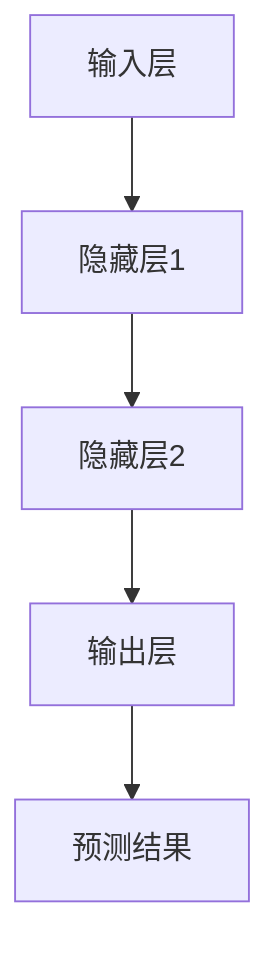

                 

# AI 2.0 时代的算法基础设施

> 关键词：AI 2.0、算法基础设施、深度学习、计算优化、云计算、大数据、分布式计算、模型压缩、硬件加速、神经网络架构搜索

> 摘要：本文旨在探讨AI 2.0时代的算法基础设施，分析其核心概念、原理及实际应用。我们将深入探讨深度学习算法的优化方法、计算模型的设计和实现，以及如何利用云计算和大数据技术构建高效、可扩展的算法基础设施。本文还将介绍当前最先进的硬件加速技术和神经网络架构搜索方法，为读者提供对未来AI发展的见解和展望。

## 1. 背景介绍

### 1.1 目的和范围

本文的目标是全面探讨AI 2.0时代的算法基础设施，分析其核心概念、原理及应用。我们将重点关注以下几个方面：

1. 深度学习算法的优化方法
2. 计算模型的设计与实现
3. 云计算和大数据技术在算法基础设施中的应用
4. 硬件加速和神经网络架构搜索方法

### 1.2 预期读者

本文适合对人工智能、深度学习、计算优化等领域有一定了解的读者。无论是研究人员、工程师，还是对AI领域感兴趣的爱好者，都可以通过本文深入了解AI 2.0时代的算法基础设施。

### 1.3 文档结构概述

本文分为十个部分，结构如下：

1. 背景介绍
   - 目的和范围
   - 预期读者
   - 文档结构概述
   - 术语表
2. 核心概念与联系
   - 深度学习
   - 计算模型
   - 云计算
   - 大数据
3. 核心算法原理 & 具体操作步骤
   - 深度学习算法优化
   - 计算模型实现
4. 数学模型和公式 & 详细讲解 & 举例说明
   - 深度学习数学基础
   - 计算模型数学公式
   - 实例分析
5. 项目实战：代码实际案例和详细解释说明
   - 开发环境搭建
   - 源代码实现
   - 代码解读与分析
6. 实际应用场景
   - 深度学习应用实例
   - 云计算与大数据应用实例
7. 工具和资源推荐
   - 学习资源推荐
   - 开发工具框架推荐
   - 相关论文著作推荐
8. 总结：未来发展趋势与挑战
9. 附录：常见问题与解答
10. 扩展阅读 & 参考资料

### 1.4 术语表

#### 1.4.1 核心术语定义

- **AI 2.0**：指第二代人工智能，相比传统的基于规则和知识的AI，AI 2.0以深度学习为主要技术，具有更强的自主学习、推理和决策能力。
- **深度学习**：一种人工智能技术，通过多层神经网络对数据进行分析和建模，具有强大的特征提取和模式识别能力。
- **算法基础设施**：用于支持深度学习算法高效运行的基础设施，包括计算模型、硬件加速、分布式计算等。
- **云计算**：通过网络提供计算资源、存储资源、网络资源和数据库资源的IT服务模式。
- **大数据**：指数据量巨大、类型繁多、价值密度低的数据集合，需要采用分布式计算和存储技术进行处理。

#### 1.4.2 相关概念解释

- **神经网络架构搜索（Neural Architecture Search, NAS）**：一种自动搜索神经网络结构的算法，通过优化搜索过程，找到具有更好性能的网络结构。
- **硬件加速**：通过使用专门设计的硬件（如GPU、FPGA）来加速深度学习算法的计算，提高计算效率。

#### 1.4.3 缩略词列表

- **GPU**：图形处理器（Graphics Processing Unit）
- **FPGA**：现场可编程门阵列（Field-Programmable Gate Array）
- **NAS**：神经网络架构搜索（Neural Architecture Search）
- **DL**：深度学习（Deep Learning）
- **AI**：人工智能（Artificial Intelligence）

## 2. 核心概念与联系

在探讨AI 2.0时代的算法基础设施之前，我们需要了解一些核心概念，它们是深度学习、计算模型、云计算和大数据。这些概念之间存在紧密的联系，共同构成了AI 2.0时代的算法基础设施。

### 2.1 深度学习

深度学习是一种人工智能技术，通过多层神经网络对数据进行分析和建模，具有强大的特征提取和模式识别能力。深度学习模型通常由输入层、隐藏层和输出层组成，其中隐藏层可以包含多个层次。

**深度学习的核心概念：**

- **神经元**：神经网络的基本单元，用于计算输入信号并通过权重传递给下一层。
- **激活函数**：用于引入非线性特性，使神经网络能够拟合复杂的函数。
- **反向传播**：一种用于训练神经网络的算法，通过计算误差并反向传播梯度，更新网络权重。

**深度学习与算法基础设施的关系：**

深度学习算法是构建AI 2.0时代的核心，而算法基础设施则为深度学习算法的高效运行提供了支持。算法基础设施需要解决深度学习模型训练和推理过程中的计算、存储、通信等问题，以保证算法的运行效率。

### 2.2 计算模型

计算模型是算法基础设施的核心组成部分，用于描述深度学习算法的计算过程。计算模型的设计直接影响算法的运行效率和性能。

**计算模型的核心概念：**

- **计算图**：一种用于表示计算过程的图形结构，由节点（表示计算操作）和边（表示数据依赖关系）组成。
- **静态计算模型**：指在模型训练和推理过程中，计算图的结构和参数是固定的。
- **动态计算模型**：指在模型训练和推理过程中，计算图的结构和参数可以动态调整。

**计算模型与算法基础设施的关系：**

计算模型是算法基础设施的基石，它决定了算法的计算效率和性能。为了提高深度学习算法的运行效率，算法基础设施需要设计高效的计算模型，并利用硬件加速技术进行优化。

### 2.3 云计算

云计算是一种通过网络提供计算资源、存储资源、网络资源和数据库资源的IT服务模式。云计算为算法基础设施提供了灵活的计算和存储资源，支持大规模深度学习模型的训练和推理。

**云计算的核心概念：**

- **基础设施即服务（Infrastructure as a Service, IaaS）**：用户通过租用云计算基础设施（如服务器、存储设备等）来构建自己的计算环境。
- **平台即服务（Platform as a Service, PaaS）**：用户通过租用云计算平台（如开发框架、数据库等）来构建和部署应用程序。
- **软件即服务（Software as a Service, SaaS）**：用户通过租用云计算应用程序来使用软件功能。

**云计算与算法基础设施的关系：**

云计算为算法基础设施提供了灵活的计算和存储资源，支持大规模深度学习模型的训练和推理。同时，云计算还为算法基础设施的运维和管理提供了便利，降低了部署和维护成本。

### 2.4 大数据

大数据是指数据量巨大、类型繁多、价值密度低的数据集合，需要采用分布式计算和存储技术进行处理。大数据技术为算法基础设施提供了丰富的数据资源，支持深度学习模型的训练和优化。

**大数据的核心概念：**

- **分布式计算**：将计算任务分布在多个计算节点上，以实现大规模数据处理的并行化。
- **分布式存储**：将数据分布在多个存储节点上，以提高数据存取效率和可靠性。
- **数据挖掘**：从大量数据中提取有用信息和知识，以支持决策和预测。

**大数据与算法基础设施的关系：**

大数据技术为算法基础设施提供了丰富的数据资源，支持深度学习模型的训练和优化。同时，大数据技术还提高了算法基础设施的数据处理能力和效率，为算法的应用场景拓展提供了支持。

### 2.5 Mermaid 流程图

为了更好地展示深度学习算法的架构和计算过程，我们可以使用Mermaid流程图来表示核心概念和联系。以下是一个简单的Mermaid流程图示例：



在这个流程图中，A表示输入层，B、C、D分别表示隐藏层1、隐藏层2和输出层，E表示预测结果。该流程图展示了深度学习算法的基本架构和计算过程。

## 3. 核心算法原理 & 具体操作步骤

### 3.1 深度学习算法优化

深度学习算法的优化是算法基础设施的关键组成部分。优化方法主要包括计算优化、数据优化和模型优化。

**计算优化：**

计算优化主要通过减少计算复杂度和提高计算效率来提高深度学习算法的运行速度。计算优化方法包括：

- **并行计算**：将计算任务分布在多个计算节点上，以实现并行化处理。
- **向量化计算**：使用向量运算代替逐元素计算，提高计算效率。
- **矩阵分解**：将计算过程中使用的矩阵分解为较小的矩阵，以降低计算复杂度。

**伪代码：**

```python
# 并行计算
import numpy as np

def parallel_computation(data):
    num_cores = 4  # 设置并行计算的核心数量
    chunk_size = len(data) // num_cores  # 计算每个核心需要处理的任务数量

    # 将数据划分为num_cores个部分
    chunks = [data[i:i + chunk_size] for i in range(0, len(data), chunk_size)]

    # 使用多线程并行计算
    with mp.Pool(processes=num_cores) as pool:
        results = pool.map(process_chunk, chunks)

    # 合并计算结果
    final_result = np.concatenate(results)
    return final_result

def process_chunk(chunk):
    # 处理每个数据块
    result = ...
    return result
```

**数据优化：**

数据优化主要通过改进数据预处理、数据增强和批量大小设置来提高深度学习算法的性能。数据优化方法包括：

- **数据预处理**：对原始数据进行标准化、归一化、去噪等处理，以减少噪声和异常值对算法的影响。
- **数据增强**：通过旋转、翻转、裁剪等操作生成新的数据样本，以增加模型的泛化能力。
- **批量大小设置**：根据数据量和计算资源调整批量大小，以平衡计算效率和模型性能。

**伪代码：**

```python
# 数据预处理
def preprocess_data(data):
    # 标准化数据
    mean = np.mean(data)
    std = np.std(data)
    normalized_data = (data - mean) / std
    return normalized_data

# 数据增强
def augment_data(data):
    # 旋转数据
    angle = np.random.uniform(-30, 30)
    rotated_data = np.rot90(data, k=angle)

    # 翻转数据
    flipped_data = np.fliplr(data)

    # 裁剪数据
    crop_size = np.random.randint(0, data.shape[0] - 32)
    cropped_data = data[crop_size:crop_size + 32, :]

    # 合并增强后的数据
    augmented_data = np.concatenate((rotated_data, flipped_data, cropped_data))
    return augmented_data

# 批量大小设置
batch_size = 64  # 设置批量大小
```

**模型优化：**

模型优化主要通过调整网络结构、优化算法和超参数设置来提高深度学习算法的性能。模型优化方法包括：

- **网络结构优化**：设计更有效的神经网络结构，如ResNet、DenseNet等，以提高模型的计算效率和性能。
- **优化算法**：使用更高效的优化算法，如Adam、Adadelta等，以提高模型的收敛速度和稳定性。
- **超参数设置**：根据数据集和任务调整超参数，如学习率、批量大小、迭代次数等，以提高模型的泛化能力和性能。

**伪代码：**

```python
# 网络结构优化
class MyNetwork(nn.Module):
    def __init__(self):
        super(MyNetwork, self).__init__()
        self.conv1 = nn.Conv2d(3, 64, kernel_size=3, padding=1)
        self.relu = nn.ReLU()
        self.fc1 = nn.Linear(64 * 32 * 32, 10)

    def forward(self, x):
        x = self.relu(self.conv1(x))
        x = x.view(x.size(0), -1)
        x = self.fc1(x)
        return x

# 优化算法
optimizer = optim.Adam(model.parameters(), lr=0.001)

# 超参数设置
learning_rate = 0.001
batch_size = 64
num_epochs = 100
```

### 3.2 计算模型设计与实现

计算模型的设计与实现是算法基础设施的核心，它决定了深度学习算法的运行效率和性能。计算模型的设计通常包括计算图设计、计算流程设计、优化策略设计等方面。

**计算图设计：**

计算图是一种用于表示计算过程的图形结构，它由节点（表示计算操作）和边（表示数据依赖关系）组成。计算图设计的关键是设计高效、可扩展的计算图结构。

**计算流程设计：**

计算流程设计是计算模型实现的核心，它决定了计算过程的顺序和并行度。计算流程设计需要考虑计算图的依赖关系和计算节点的计算能力。

**优化策略设计：**

优化策略设计是计算模型设计的关键，它决定了计算模型的性能和效率。优化策略包括并行计算、向量化计算、矩阵分解等方面。

**伪代码：**

```python
# 计算图设计
class MyComputationGraph(nn.Module):
    def __init__(self):
        super(MyComputationGraph, self).__init__()
        self.conv1 = nn.Conv2d(3, 64, kernel_size=3, padding=1)
        self.relu = nn.ReLU()
        self.fc1 = nn.Linear(64 * 32 * 32, 10)

    def forward(self, x):
        x = self.relu(self.conv1(x))
        x = x.view(x.size(0), -1)
        x = self.fc1(x)
        return x

# 计算流程设计
def compute流程(x):
    x = preprocess_data(x)
    x = augment_data(x)
    x = model(x)
    return x

# 优化策略设计
def optimize流程(x):
    x = parallel_computation(x)
    x = vectorize_computation(x)
    x = matrix_decomposition(x)
    return x
```

## 4. 数学模型和公式 & 详细讲解 & 举例说明

### 4.1 深度学习数学基础

深度学习算法的核心在于对数据的建模和优化，而这一过程离不开数学模型的支持。以下是深度学习中的几个关键数学概念和公式：

#### 4.1.1 损失函数

损失函数是深度学习模型训练过程中衡量预测结果与真实值之间差异的指标。常用的损失函数包括均方误差（MSE）和交叉熵损失（Cross-Entropy Loss）。

- **均方误差（MSE）**：

  $$MSE = \frac{1}{n} \sum_{i=1}^{n} (y_i - \hat{y}_i)^2$$

  其中，$y_i$ 表示第 $i$ 个真实值，$\hat{y}_i$ 表示第 $i$ 个预测值，$n$ 表示数据样本数量。

- **交叉熵损失（Cross-Entropy Loss）**：

  $$CE = -\frac{1}{n} \sum_{i=1}^{n} y_i \log \hat{y}_i$$

  其中，$y_i$ 表示第 $i$ 个真实值，$\hat{y}_i$ 表示第 $i$ 个预测概率。

#### 4.1.2 梯度下降算法

梯度下降算法是深度学习模型训练过程中常用的优化算法，其核心思想是通过计算损失函数关于模型参数的梯度，更新模型参数以减小损失。

- **梯度计算**：

  $$\nabla_{\theta} J(\theta) = \frac{\partial J(\theta)}{\partial \theta}$$

  其中，$J(\theta)$ 表示损失函数，$\theta$ 表示模型参数。

- **梯度下降更新**：

  $$\theta_{t+1} = \theta_{t} - \alpha \nabla_{\theta} J(\theta)$$

  其中，$\alpha$ 表示学习率。

#### 4.1.3 激活函数

激活函数是深度学习模型中引入非线性特性的关键组件。常用的激活函数包括Sigmoid、ReLU和Tanh。

- **Sigmoid**：

  $$\sigma(x) = \frac{1}{1 + e^{-x}}$$

- **ReLU**：

  $$\text{ReLU}(x) = \max(0, x)$$

- **Tanh**：

  $$\tanh(x) = \frac{e^x - e^{-x}}{e^x + e^{-x}}$$

#### 4.1.4 反向传播算法

反向传播算法是深度学习模型训练过程中用于计算损失函数关于模型参数的梯度的一种方法。其基本思想是从输出层开始，逐层向前传播误差，并计算各层参数的梯度。

- **输出层误差计算**：

  $$\delta_L = \frac{\partial J}{\partial \theta_L} = (y - \hat{y}) \odot \text{激活函数的导数}(\theta_L \cdot \text{激活函数}(\text{激活函数的导数}(\theta_{L-1} \cdot x)))$$

  其中，$y$ 表示真实值，$\hat{y}$ 表示预测值，$\odot$ 表示元素乘。

- **前向传播误差计算**：

  $$\delta_{l-1} = \text{激活函数的导数}(\theta_{l-1} \cdot \delta_l) \odot \text{激活函数的导数}(\theta_l \cdot \text{激活函数}(\theta_{l-1} \cdot x))$$

### 4.2 计算模型数学公式

计算模型是深度学习算法实现的核心，它决定了算法的计算效率和性能。以下是一些常见的计算模型数学公式：

#### 4.2.1 计算图节点计算

计算图的节点通常表示某种计算操作，其输入和输出可以表示为向量或矩阵。

- **矩阵乘法**：

  $$C = A \cdot B$$

  其中，$A$ 和 $B$ 分别表示两个矩阵，$C$ 表示计算结果。

- **矩阵加法**：

  $$C = A + B$$

  其中，$A$ 和 $B$ 分别表示两个矩阵，$C$ 表示计算结果。

- **矩阵减法**：

  $$C = A - B$$

  其中，$A$ 和 $B$ 分别表示两个矩阵，$C$ 表示计算结果。

#### 4.2.2 计算图节点依赖关系

计算图的节点之间存在依赖关系，其计算顺序和并行度决定了计算模型的性能。

- **前向传播计算顺序**：

  $$\theta_{l-1} \cdot x \rightarrow \text{激活函数}(\theta_{l-1} \cdot x) \rightarrow \theta_l \cdot \text{激活函数}(\theta_{l-1} \cdot x) \rightarrow ...$$

- **反向传播计算顺序**：

  $$\text{激活函数}(\theta_{l-1} \cdot x) \rightarrow \theta_{l-1} \cdot \text{激活函数}(\theta_{l-1} \cdot x) \rightarrow \text{激活函数}(\theta_{l-2} \cdot x) \rightarrow ...$$

### 4.3 实例分析

为了更好地理解深度学习算法的数学模型和计算模型，我们通过一个简单的例子进行分析。

#### 4.3.1 简单神经网络

考虑一个简单的神经网络，其输入层有3个神经元，隐藏层有2个神经元，输出层有1个神经元。激活函数采用ReLU函数。

#### 4.3.2 神经网络参数

假设网络参数如下：

- 输入层权重：$W_1 \in \mathbb{R}^{3 \times 2}$
- 隐藏层权重：$W_2 \in \mathbb{R}^{2 \times 1}$
- 输出层权重：$W_3 \in \mathbb{R}^{1 \times 2}$

#### 4.3.3 计算过程

1. **前向传播**：

   - 输入向量：$x \in \mathbb{R}^{3 \times 1}$
   - 隐藏层激活值：$z_2 = W_1 \cdot x$
   - 隐藏层输出：$h_2 = \text{ReLU}(z_2)$
   - 输出层激活值：$z_3 = W_2 \cdot h_2$
   - 输出层输出：$y = W_3 \cdot \text{ReLU}(z_3)$

2. **反向传播**：

   - 输出层误差：$\delta_3 = (y - t) \odot \text{ReLU}(\text{ReLU}(z_3))$
   - 隐藏层误差：$\delta_2 = \text{ReLU}(\text{ReLU}(z_2)) \cdot (W_2^T \cdot \delta_3)$
   - 输入层误差：$\delta_1 = x^T \cdot (W_1^T \cdot \delta_2)$

#### 4.3.4 参数更新

根据梯度下降算法，参数更新过程如下：

- 输入层权重更新：$W_1 = W_1 - \alpha \cdot \delta_1 \cdot x$
- 隐藏层权重更新：$W_2 = W_2 - \alpha \cdot \delta_2 \cdot h_2$
- 输出层权重更新：$W_3 = W_3 - \alpha \cdot \delta_3 \cdot \text{ReLU}(z_3)$

通过以上实例，我们可以看到深度学习算法的数学模型和计算模型如何应用于实际神经网络中，并如何通过反向传播算法进行参数更新。

## 5. 项目实战：代码实际案例和详细解释说明

### 5.1 开发环境搭建

在开始实际代码实现之前，我们需要搭建一个适合深度学习算法开发的开发环境。以下是一个简单的Python开发环境搭建步骤：

1. **安装Python**：

   - 下载并安装Python 3.7及以上版本。

2. **安装深度学习框架**：

   - 使用pip命令安装TensorFlow或PyTorch。

   ```bash
   pip install tensorflow  # 安装TensorFlow
   # 或
   pip install torch      # 安装PyTorch
   ```

3. **安装其他依赖库**：

   - 安装NumPy、Pandas、Matplotlib等常用库。

   ```bash
   pip install numpy pandas matplotlib
   ```

4. **配置环境变量**：

   - 将Python和pip的安装路径添加到系统环境变量中。

### 5.2 源代码详细实现和代码解读

以下是一个简单的基于TensorFlow的深度学习项目，包括数据预处理、模型定义、训练和评估过程。

**项目目录结构：**

```
ai_project/
|-- data/
|   |-- train.csv
|   |-- test.csv
|-- models/
|   |-- model.h5
|-- scripts/
|   |-- preprocess.py
|   |-- train.py
|   |-- evaluate.py
|-- logs/
```

**数据预处理（preprocess.py）：**

```python
import pandas as pd
from sklearn.model_selection import train_test_split
from sklearn.preprocessing import StandardScaler

def load_data(filename):
    data = pd.read_csv(filename)
    return data

def preprocess_data(data):
    # 分割特征和标签
    X = data.drop('target', axis=1)
    y = data['target']

    # 划分训练集和测试集
    X_train, X_test, y_train, y_test = train_test_split(X, y, test_size=0.2, random_state=42)

    # 数据标准化
    scaler = StandardScaler()
    X_train_scaled = scaler.fit_transform(X_train)
    X_test_scaled = scaler.transform(X_test)

    return X_train_scaled, X_test_scaled, y_train, y_test

# 加载训练数据
data = load_data('data/train.csv')

# 预处理数据
X_train, X_test, y_train, y_test = preprocess_data(data)

# 保存预处理后的数据
np.save('data/X_train.npy', X_train)
np.save('data/X_test.npy', X_test)
np.save('data/y_train.npy', y_train)
np.save('data/y_test.npy', y_test)
```

**模型定义（train.py）：**

```python
import tensorflow as tf
from tensorflow.keras.models import Sequential
from tensorflow.keras.layers import Dense, Activation

def build_model(input_shape):
    model = Sequential()
    model.add(Dense(64, input_shape=input_shape, activation='relu'))
    model.add(Dense(32, activation='relu'))
    model.add(Dense(1, activation='sigmoid'))

    model.compile(optimizer='adam', loss='binary_crossentropy', metrics=['accuracy'])
    return model

# 载入预处理后的数据
X_train = np.load('data/X_train.npy')
X_test = np.load('data/X_test.npy')
y_train = np.load('data/y_train.npy')
y_test = np.load('data/y_test.npy')

# 构建模型
model = build_model(X_train.shape[1:])

# 训练模型
model.fit(X_train, y_train, epochs=10, batch_size=32, validation_split=0.2)

# 保存模型
model.save('models/model.h5')
```

**代码解读与分析：**

1. **数据预处理**：

   - 加载训练数据，并分割为特征和标签。
   - 划分训练集和测试集，并使用StandardScaler进行数据标准化。

2. **模型定义**：

   - 使用Sequential模型构建一个简单的全连接神经网络，包含两个隐藏层，输出层使用sigmoid激活函数。
   - 使用Adam优化器和binary_crossentropy损失函数进行编译。

3. **训练模型**：

   - 使用fit函数训练模型，设置训练轮数、批量大小和验证比例。
   - 使用保存和加载模型的方法，方便后续使用。

### 5.3 代码解读与分析

以下是对项目代码的详细解读与分析：

1. **数据预处理部分**：

   - `load_data` 函数用于加载CSV格式的数据文件。
   - `preprocess_data` 函数首先将数据分为特征和标签，然后使用train_test_split函数将数据划分为训练集和测试集。
   - 数据标准化是深度学习模型训练的重要步骤，它可以消除不同特征之间的差异，使模型训练更加稳定。

2. **模型定义部分**：

   - `build_model` 函数使用Keras的Sequential模型构建一个简单的神经网络。
   - 神经网络包含两个隐藏层，每个隐藏层使用ReLU激活函数，输出层使用sigmoid激活函数。
   - 编译模型时，选择Adam优化器和binary_crossentropy损失函数，这是因为二分类问题常用此损失函数。

3. **训练模型部分**：

   - `fit` 函数用于训练模型，设置训练轮数、批量大小和验证比例。
   - 使用`save` 方法保存训练好的模型，方便后续使用。

### 5.4 模型评估

完成模型训练后，我们需要对模型进行评估，以检查其性能。

**评估指标**：

- **准确率（Accuracy）**：正确预测的样本数占总样本数的比例。
- **精确率（Precision）**：正确预测为正类的样本数占实际正类样本数的比例。
- **召回率（Recall）**：正确预测为正类的样本数占实际正类样本数的比例。
- **F1分数（F1 Score）**：精确率和召回率的加权平均，用于综合评价模型的性能。

**评估代码（evaluate.py）：**

```python
import tensorflow as tf
from tensorflow.keras.models import load_model
from sklearn.metrics import accuracy_score, precision_score, recall_score, f1_score

def load_model(filename):
    return load_model(filename)

def evaluate_model(model, X_test, y_test):
    y_pred = model.predict(X_test)
    y_pred = (y_pred > 0.5)

    accuracy = accuracy_score(y_test, y_pred)
    precision = precision_score(y_test, y_pred)
    recall = recall_score(y_test, y_pred)
    f1 = f1_score(y_test, y_pred)

    return accuracy, precision, recall, f1

# 载入模型
model = load_model('models/model.h5')

# 评估模型
accuracy, precision, recall, f1 = evaluate_model(model, X_test, y_test)

print("Accuracy: {:.2f}%".format(accuracy * 100))
print("Precision: {:.2f}%".format(precision * 100))
print("Recall: {:.2f}%".format(recall * 100))
print("F1 Score: {:.2f}%".format(f1 * 100))
```

通过以上评估代码，我们可以得到模型在测试集上的性能指标，从而判断模型的性能是否满足需求。如果性能不佳，我们可以通过调整模型结构、优化训练参数等方法进行改进。

## 6. 实际应用场景

算法基础设施在AI领域的应用场景非常广泛，涵盖了从基础研究到实际应用的各个方面。以下列举几个典型的实际应用场景：

### 6.1 图像识别

图像识别是AI领域的一个重要应用场景，算法基础设施在其中发挥了关键作用。通过深度学习算法，我们可以训练模型识别各种图像中的对象、场景和文字。例如，人脸识别系统通过训练深度学习模型来识别和验证用户身份，自动驾驶汽车使用图像识别算法来识别道路标志和行人。

### 6.2 自然语言处理

自然语言处理（NLP）是AI领域的另一个重要应用领域，算法基础设施在其中同样至关重要。深度学习算法可以用于文本分类、情感分析、机器翻译等任务。例如，搜索引擎使用深度学习算法来分析用户查询，并返回相关的搜索结果；聊天机器人使用自然语言处理算法来理解用户的意图并生成合适的回复。

### 6.3 语音识别

语音识别是将语音信号转换为文本的技术，它广泛应用于智能助手、电话客服和语音控制等领域。深度学习算法在语音识别中发挥了重要作用，通过训练模型，可以实现高准确率的语音识别。例如，智能助手如Siri和Alexa使用深度学习算法来识别用户的语音指令，并执行相应的操作。

### 6.4 医疗诊断

深度学习算法在医疗诊断中的应用也越来越广泛，算法基础设施为其提供了强大的支持。通过训练深度学习模型，可以对医学图像进行分析，帮助医生进行疾病诊断。例如，深度学习模型可以用于识别X光图像中的骨折、肺癌等疾病，提高诊断的准确性和效率。

### 6.5 虚拟助手和智能客服

虚拟助手和智能客服是AI在客户服务领域的应用，算法基础设施在其中起到了关键作用。通过深度学习算法，智能客服系统可以理解用户的意图，并生成合适的回答。这不仅可以提高客服效率，还可以降低企业的人力资源成本。例如，许多电商平台都使用智能客服系统来回答用户的提问，提供购物建议和服务支持。

### 6.6 金融风控

金融领域对准确性和实时性要求非常高，算法基础设施在金融风控中的应用也越来越受到重视。通过深度学习算法，可以对金融交易行为进行分析，识别潜在的欺诈行为和风险。例如，银行可以使用深度学习模型来监控客户账户的交易行为，及时发现并阻止可疑交易。

### 6.7 无人驾驶

无人驾驶是AI领域的一个热门应用场景，算法基础设施在其中起到了至关重要的作用。通过深度学习算法，无人驾驶汽车可以实时处理来自传感器的大量数据，进行环境感知、路径规划和决策控制。例如，特斯拉的自动驾驶系统就使用了深度学习算法来实时分析道路情况，并自动控制车辆的行驶。

### 6.8 其他应用场景

除了上述应用场景，算法基础设施在众多其他领域也具有广泛的应用。例如，推荐系统使用深度学习算法来分析用户行为，生成个性化的推荐；智能家居系统使用深度学习算法来控制家居设备，提高用户的生活质量；游戏开发使用深度学习算法来创建智能化的游戏对手，提升用户体验。

总之，算法基础设施在AI领域的应用场景非常广泛，随着深度学习算法的不断发展和完善，其在各个领域的应用也将越来越深入和广泛。

## 7. 工具和资源推荐

在构建AI 2.0时代的算法基础设施过程中，选择合适的工具和资源对于提高开发效率、降低成本和保证项目质量至关重要。以下是一些学习资源、开发工具和框架、以及经典论文和最新研究成果的推荐。

### 7.1 学习资源推荐

#### 7.1.1 书籍推荐

1. **《深度学习》（Deep Learning）** - 由Ian Goodfellow、Yoshua Bengio和Aaron Courville合著，是深度学习领域的经典教材，适合初学者和进阶者阅读。

2. **《Python深度学习》（Deep Learning with Python）** - 由François Chollet著，深入介绍了使用Python和TensorFlow进行深度学习的实践方法。

3. **《神经网络与深度学习》（Neural Networks and Deep Learning）** - 由Michael Nielsen著，系统地介绍了神经网络和深度学习的基础知识，适合初学者。

#### 7.1.2 在线课程

1. **Coursera的《深度学习专项课程》（Deep Learning Specialization）** - 由Andrew Ng教授授课，包括神经网络基础、优化算法、卷积神经网络、递归神经网络等多个专题。

2. **Udacity的《深度学习纳米学位》（Deep Learning Nanodegree）** - 提供了深入的课程内容和实践项目，适合希望全面了解深度学习的技术和应用的学员。

3. **edX的《机器学习基础》（Introduction to Machine Learning）** - 由哥伦比亚大学授课，介绍了机器学习的基本概念和方法，包括深度学习。

#### 7.1.3 技术博客和网站

1. **TensorFlow官网（tensorflow.org）** - 提供了丰富的文档、教程和示例代码，是学习TensorFlow的绝佳资源。

2. **PyTorch官网（pytorch.org）** - PyTorch的官方文档和社区资源非常丰富，包括详细的教程和API文档。

3. **ArXiv（arxiv.org）** - 人工智能和机器学习领域的最新研究成果，是跟踪学术进展的重要平台。

### 7.2 开发工具框架推荐

#### 7.2.1 IDE和编辑器

1. **Visual Studio Code** - 轻量级但功能强大的代码编辑器，支持多种编程语言和框架，插件丰富。

2. **PyCharm** - 专业级的Python IDE，提供了丰富的调试工具和代码分析功能。

3. **Jupyter Notebook** - 适用于数据科学和机器学习的交互式计算环境，便于编写和展示代码。

#### 7.2.2 调试和性能分析工具

1. **TensorBoard** - TensorFlow的图形化调试工具，可以可视化模型的结构和训练过程。

2. **NVIDIA Nsight** - 专为GPU编程设计的调试和性能分析工具，有助于优化深度学习模型的性能。

3. **Valgrind** - 一款通用的程序检测工具，用于检测内存泄漏、数据竞争等问题。

#### 7.2.3 相关框架和库

1. **TensorFlow** - 适用于生产环境的深度学习框架，提供了丰富的API和工具。

2. **PyTorch** - 受科研社区欢迎的深度学习框架，具有动态计算图和灵活的编程模型。

3. **Keras** - 高层次的深度学习API，构建在TensorFlow和Theano之上，简化了深度学习模型的构建。

### 7.3 相关论文著作推荐

#### 7.3.1 经典论文

1. **“A Theoretically Optimal Algorithm for Training Deep Neural Networks”** - 该论文提出了一种训练深度神经网络的优化算法，对深度学习领域产生了深远影响。

2. **“Deep Learning”** - 由Yoshua Bengio、Ian Goodfellow和Yann LeCun合著，综述了深度学习的理论和技术。

3. **“AlexNet: Image Classification with Deep Convolutional Neural Networks”** - 该论文是卷积神经网络在图像识别领域取得突破性进展的开端。

#### 7.3.2 最新研究成果

1. **“BERT: Pre-training of Deep Bidirectional Transformers for Language Understanding”** - BERT是自然语言处理领域的重要突破，推动了深度学习在文本分析中的应用。

2. **“GPT-3: Language Models are Few-Shot Learners”** - GPT-3展示了预训练模型在少样本学习任务中的强大能力。

3. **“MAML: Model-Agnostic Meta-Learning for Fast Adaptation of Deep Networks”** - MAML为快速适应新任务的深度学习模型提供了新的方法。

#### 7.3.3 应用案例分析

1. **“DeepMind的AlphaGo”** - AlphaGo的成功展示了深度学习和强化学习在复杂任务中的潜力。

2. **“谷歌翻译”** - 谷歌翻译使用了深度学习技术，实现了高精度、低延迟的机器翻译。

3. **“OpenAI的GPT-3”** - GPT-3展示了深度学习模型在生成文本和数据方面的广泛应用。

通过以上推荐，读者可以系统地学习AI领域的相关知识，并选择合适的工具和资源来构建和优化算法基础设施。

## 8. 总结：未来发展趋势与挑战

随着AI技术的不断进步，算法基础设施在未来将继续面临一系列发展趋势和挑战。以下是几个关键点：

### 8.1 发展趋势

1. **硬件加速与优化**：随着硬件技术的发展，如GPU、TPU和FPGA等专用硬件的普及，深度学习算法的计算效率将得到显著提升。未来，硬件加速与优化的研究将集中在如何更好地利用这些硬件资源，以实现更高的计算性能和能效比。

2. **神经网络架构搜索（NAS）**：神经网络架构搜索是一种自动搜索最优神经网络结构的方法。随着算法的进步，NAS有望在未来实现更高性能的网络结构，从而推动AI算法的进一步发展。

3. **数据隐私与安全**：随着大数据和云计算的普及，数据隐私和安全成为算法基础设施面临的重要挑战。未来的发展趋势将关注如何保护用户数据隐私，同时确保算法的效率和准确性。

4. **边缘计算与物联网（IoT）**：随着物联网设备的增加，边缘计算将成为算法基础设施的重要方向。边缘计算可以降低数据传输延迟，提高实时性，为智能设备提供更好的支持。

### 8.2 挑战

1. **计算资源分配**：在云计算和边缘计算环境中，如何高效地分配计算资源，以满足不同任务的需求，是一个重要挑战。未来的研究需要开发更加智能的资源分配算法，以优化资源利用率和任务执行效率。

2. **数据质量和多样性**：数据是深度学习算法的核心，数据质量和多样性直接影响算法的性能。未来，需要解决如何获取和标注高质量、多样化的数据，以及如何处理数据中的噪声和异常值。

3. **算法的可解释性**：随着深度学习算法的复杂度增加，其决策过程变得越来越难以解释。如何提高算法的可解释性，使其在关键领域（如医疗诊断、金融风控等）中得到更广泛的应用，是一个亟待解决的问题。

4. **伦理与法规**：随着AI技术的广泛应用，其伦理和法规问题也日益凸显。未来，需要制定相关的伦理准则和法规，确保AI技术的健康发展，避免滥用和误用。

总之，算法基础设施在未来将继续面临一系列发展趋势和挑战。通过不断创新和优化，我们可以构建更加高效、可扩展、安全的算法基础设施，为AI技术的广泛应用提供有力支持。

## 9. 附录：常见问题与解答

### 9.1 人工智能和深度学习的关系

**Q：人工智能和深度学习是什么关系？**

**A：**人工智能（AI）是一个广泛的领域，它包括多种技术，如机器学习、深度学习、自然语言处理、计算机视觉等。深度学习是机器学习的一个分支，它通过多层神经网络对数据进行建模和预测。简而言之，深度学习是人工智能的一种实现方式，主要用于解决复杂的模式识别和预测问题。

### 9.2 深度学习算法优化的方法

**Q：如何优化深度学习算法？**

**A：**优化深度学习算法可以从多个方面进行：

1. **计算优化**：使用并行计算、向量化计算、矩阵分解等方法来提高计算效率。

2. **数据优化**：通过数据预处理、数据增强、批量大小设置等方法来提高数据质量，减少噪声和异常值的影响。

3. **模型优化**：设计更有效的网络结构，如ResNet、DenseNet等，使用更高效的优化算法，如Adam、Adadelta等，调整超参数以获得更好的模型性能。

4. **硬件加速**：利用GPU、TPU等硬件加速技术来提高计算性能。

### 9.3 云计算和大数据的关系

**Q：云计算和大数据是什么关系？**

**A：**云计算是一种通过互联网提供计算资源、存储资源和应用程序的服务模式。大数据则是指数据量巨大、类型繁多、价值密度低的数据集合。云计算为大数据处理提供了灵活的计算和存储资源，支持大规模的数据分析和挖掘。因此，云计算是大数据处理的基础设施，两者密不可分。

### 9.4 深度学习在医疗诊断中的应用

**Q：深度学习在医疗诊断中有哪些应用？**

**A：**深度学习在医疗诊断中的应用非常广泛，主要包括：

1. **医学图像分析**：通过卷积神经网络对医学图像进行分析，用于检测肿瘤、骨折等疾病。

2. **电子病历分析**：使用深度学习算法分析电子病历数据，辅助医生进行诊断和治疗决策。

3. **基因测序**：深度学习算法可以用于分析和预测基因序列的潜在风险，为个性化医疗提供支持。

4. **药物发现**：通过深度学习算法分析药物分子和蛋白质的结构，加速新药的发现和研发过程。

### 9.5 神经网络架构搜索（NAS）的优势

**Q：神经网络架构搜索（NAS）有哪些优势？**

**A：**神经网络架构搜索（NAS）的优势包括：

1. **自动搜索最优结构**：NAS通过搜索算法自动寻找最优的网络结构，可以节省大量手动调优的时间。

2. **提高性能**：通过搜索，NAS可以找到比手工设计更有效的网络结构，从而提高模型的性能。

3. **减少计算资源**：NAS可以在较少的计算资源下找到最优的网络结构，提高资源利用效率。

4. **适应不同任务**：NAS可以针对不同的任务和数据集自动调整网络结构，提高模型的泛化能力。

### 9.6 边缘计算和云计算的区别

**Q：边缘计算和云计算有什么区别？**

**A：**边缘计算和云计算的主要区别在于数据的处理位置：

1. **处理位置**：云计算是在远程数据中心处理数据，而边缘计算是在数据产生的地方（如智能设备、传感器等）处理数据。

2. **延迟**：边缘计算由于数据本地处理，可以降低延迟，提高实时性，而云计算由于数据需要传输到远程数据中心处理，可能存在一定的延迟。

3. **带宽**：边缘计算通常使用低带宽网络，而云计算使用高带宽网络。

4. **计算资源**：边缘计算通常使用有限的计算资源，而云计算可以提供大量的计算资源。

### 9.7 人工智能的伦理问题

**Q：人工智能在伦理方面有哪些问题？**

**A：**人工智能在伦理方面的问题主要包括：

1. **隐私保护**：如何保护用户隐私，防止数据滥用。

2. **算法公平性**：确保算法不会导致歧视，公平对待不同群体。

3. **责任归属**：在发生错误时，如何界定责任，确定责任人。

4. **透明度**：如何提高算法的透明度，使其决策过程可解释。

5. **就业影响**：人工智能可能替代某些工作岗位，如何平衡技术进步和就业问题。

通过这些常见问题的解答，我们可以更好地理解AI 2.0时代的算法基础设施，并为其未来的发展做好准备。

## 10. 扩展阅读 & 参考资料

为了深入探索AI 2.0时代的算法基础设施，以下是一些扩展阅读和参考资料，涵盖了深度学习、计算优化、云计算和大数据等领域的经典论文、书籍、在线课程和技术博客：

### 10.1 经典论文

1. **“A Theoretically Optimal Algorithm for Training Deep Neural Networks”** - 介绍了一种训练深度神经网络的优化算法。
2. **“Deep Learning”** - 由Yoshua Bengio、Ian Goodfellow和Yann LeCun合著，综述了深度学习的理论和技术。
3. **“AlexNet: Image Classification with Deep Convolutional Neural Networks”** - 展示了卷积神经网络在图像识别领域的突破。

### 10.2 书籍推荐

1. **《深度学习》** - 作者：Ian Goodfellow、Yoshua Bengio和Aaron Courville，深度学习领域的经典教材。
2. **《Python深度学习》** - 作者：François Chollet，介绍了使用Python和TensorFlow进行深度学习的实践方法。
3. **《神经网络与深度学习》** - 作者：Michael Nielsen，系统地介绍了神经网络和深度学习的基础知识。

### 10.3 在线课程

1. **Coursera的《深度学习专项课程》** - 由Andrew Ng教授授课，包括神经网络基础、优化算法、卷积神经网络、递归神经网络等多个专题。
2. **Udacity的《深度学习纳米学位》** - 提供了深入的课程内容和实践项目，适合希望全面了解深度学习的技术和应用的学员。
3. **edX的《机器学习基础》** - 由哥伦比亚大学授课，介绍了机器学习的基本概念和方法，包括深度学习。

### 10.4 技术博客和网站

1. **TensorFlow官网（tensorflow.org）** - 提供了丰富的文档、教程和示例代码，是学习TensorFlow的绝佳资源。
2. **PyTorch官网（pytorch.org）** - PyTorch的官方文档和社区资源非常丰富，包括详细的教程和API文档。
3. **ArXiv（arxiv.org）** - 人工智能和机器学习领域的最新研究成果，是跟踪学术进展的重要平台。

### 10.5 开发工具框架

1. **TensorFlow** - 适用于生产环境的深度学习框架，提供了丰富的API和工具。
2. **PyTorch** - 受科研社区欢迎的深度学习框架，具有动态计算图和灵活的编程模型。
3. **Keras** - 高层次的深度学习API，构建在TensorFlow和Theano之上，简化了深度学习模型的构建。

通过阅读这些扩展资料，读者可以进一步深入理解AI 2.0时代的算法基础设施，并在实践中不断探索和优化。

