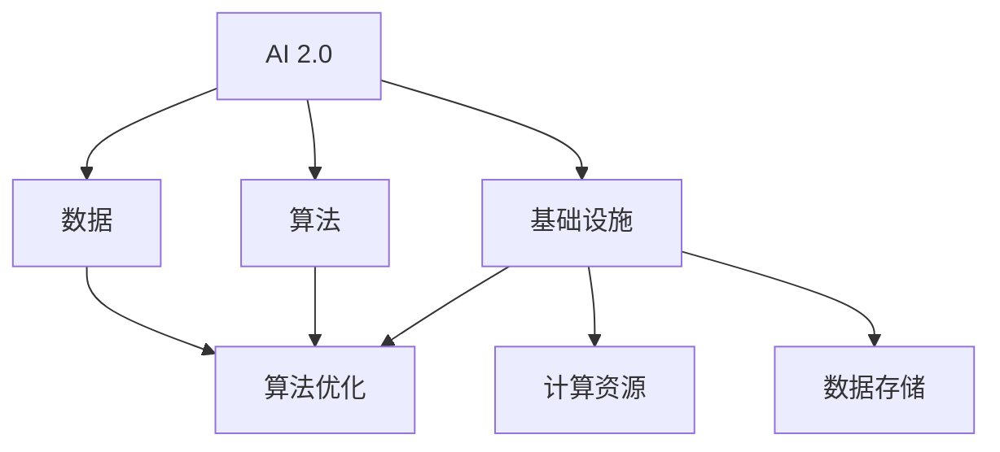

                 

# AI 2.0 时代：算法基础设施的演进

> 关键词：AI 2.0、算法基础设施、架构演进、技术趋势、数学模型、应用案例

> 摘要：本文深入探讨了AI 2.0时代算法基础设施的演进，分析了核心概念、算法原理、数学模型，并通过实际项目案例展示了其在现实中的应用。文章旨在为读者提供一份全面、系统的AI算法基础设施指南，帮助理解AI技术的本质及其未来发展。

## 1. 背景介绍

### 1.1 目的和范围

本文的目标是探讨AI 2.0时代算法基础设施的演进，分析其核心概念、算法原理、数学模型及其应用。通过详细的解释和实例，帮助读者理解AI技术如何在现代科技中扮演关键角色。

### 1.2 预期读者

本文面向有一定编程基础、对AI算法有兴趣的读者，尤其是那些希望深入了解AI 2.0时代算法基础设施的程序员、架构师和AI研究者。

### 1.3 文档结构概述

本文结构如下：

1. 背景介绍
2. 核心概念与联系
3. 核心算法原理 & 具体操作步骤
4. 数学模型和公式 & 详细讲解 & 举例说明
5. 项目实战：代码实际案例和详细解释说明
6. 实际应用场景
7. 工具和资源推荐
8. 总结：未来发展趋势与挑战
9. 附录：常见问题与解答
10. 扩展阅读 & 参考资料

### 1.4 术语表

#### 1.4.1 核心术语定义

- **AI 2.0**：指相较于第一代人工智能（AI 1.0），第二代人工智能在算法、数据、基础设施等方面有显著提升，更加智能、自适应和可解释。
- **算法基础设施**：支持算法高效运行的基础技术架构，包括计算资源、数据存储和处理、算法优化等。

#### 1.4.2 相关概念解释

- **深度学习**：一种基于多层神经网络的学习方法，通过多层次的非线性变换来提取数据特征。
- **强化学习**：一种通过与环境互动来学习最优策略的机器学习方法。

#### 1.4.3 缩略词列表

- **AI**：人工智能
- **ML**：机器学习
- **DL**：深度学习
- **RL**：强化学习

## 2. 核心概念与联系

为了更好地理解AI 2.0时代的算法基础设施，我们需要首先明确一些核心概念及其相互关系。以下是一个简化的Mermaid流程图，展示了这些核心概念和它们之间的联系：



### 2.1 AI 2.0与算法

AI 2.0时代，算法的核心地位无可动摇。深度学习和强化学习等先进算法的兴起，使得AI系统能够处理更复杂的问题，实现更高的智能水平。以下是伪代码，简要描述深度学习算法的基本结构：

```python
def deep_learning(data):
    # 初始化神经网络
    neural_network = initialize_neural_network()
    
    # 前向传播
    predictions = forward_propagation(data, neural_network)
    
    # 计算损失
    loss = calculate_loss(predictions, true_values)
    
    # 反向传播
    backpropagation(loss, neural_network)
    
    # 更新权重
    update_weights(neural_network)
    
    # 迭代优化
    return iterate_optimization(neural_network)
```

### 2.2 算法与数据

数据是AI算法的根基。在AI 2.0时代，大数据和云计算技术的发展，使得数据处理能力大幅提升。以下是数据处理算法的基本流程：

```python
def data_processing(data):
    # 数据清洗
    cleaned_data = clean_data(data)
    
    # 数据归一化
    normalized_data = normalize_data(cleaned_data)
    
    # 特征提取
    features = extract_features(normalized_data)
    
    # 数据分割
    train_data, test_data = split_data(features)
    
    # 返回处理后的数据
    return train_data, test_data
```

### 2.3 算法与基础设施

算法基础设施是算法高效运行的关键。计算资源、数据存储和处理、算法优化等都是算法基础设施的重要组成部分。以下是伪代码，展示了算法基础设施的基本结构：

```python
def algorithm_infrastructure(algorithm, data):
    # 搭建计算环境
    compute_environment = setup_compute_environment()
    
    # 加载数据到存储
    load_data_to_storage(data, storage)
    
    # 运行算法
    results = run_algorithm(algorithm, data, compute_environment)
    
    # 存储结果
    store_results(results, storage)
    
    # 返回结果
    return results
```

## 3. 核心算法原理 & 具体操作步骤

在本节中，我们将深入探讨AI 2.0时代的一些核心算法原理，并使用伪代码详细描述其具体操作步骤。

### 3.1 深度学习算法

深度学习算法的核心是神经网络。以下是神经网络的基本操作步骤：

```python
def neural_network(input_data):
    # 初始化权重
    weights = initialize_weights()
    
    # 前向传播
    layer_outputs = forward_propagation(input_data, weights)
    
    # 激活函数
    activated_outputs = activation_function(layer_outputs)
    
    # 返回激活后的输出
    return activated_outputs
```

### 3.2 强化学习算法

强化学习算法的核心是策略学习。以下是强化学习的基本操作步骤：

```python
def reinforcement_learning(state, action, reward):
    # 初始化策略
    policy = initialize_policy()
    
    # 更新策略
    policy = update_policy(policy, state, action, reward)
    
    # 返回更新后的策略
    return policy
```

## 4. 数学模型和公式 & 详细讲解 & 举例说明

在AI 2.0时代，数学模型和公式是算法核心的基础。以下是几个关键数学模型及其详细讲解：

### 4.1 激活函数

激活函数是深度学习神经网络中的一个关键组件。以下是一个常用的ReLU激活函数：

$$
f(x) = \begin{cases} 
0 & \text{if } x < 0 \\
x & \text{if } x \geq 0 
\end{cases}
$$

### 4.2 交叉熵损失函数

交叉熵损失函数常用于分类问题。以下是其数学公式：

$$
H(y, \hat{y}) = -\sum_{i} y_i \log(\hat{y}_i)
$$

其中，$y$是真实标签，$\hat{y}$是模型预测的概率分布。

### 4.3 举例说明

假设我们有一个二分类问题，真实标签$y$为[0, 1]，模型预测的概率分布$\hat{y}$为[0.7, 0.3]。计算交叉熵损失函数的值：

$$
H(y, \hat{y}) = - (0 \cdot \log(0.7) + 1 \cdot \log(0.3)) \approx 0.5219
$$

## 5. 项目实战：代码实际案例和详细解释说明

在本节中，我们将通过一个实际项目案例，展示AI 2.0时代算法基础设施的应用。

### 5.1 开发环境搭建

首先，我们需要搭建一个适合深度学习和强化学习的开发环境。以下是一个基本的Python开发环境配置：

```bash
pip install numpy pandas tensorflow keras
```

### 5.2 源代码详细实现和代码解读

以下是一个简单的深度学习模型实现，用于手写数字识别：

```python
import numpy as np
from tensorflow.keras.models import Sequential
from tensorflow.keras.layers import Dense, Conv2D, Flatten, MaxPooling2D
from tensorflow.keras.optimizers import Adam

# 数据预处理
def preprocess_data(data):
    # 数据归一化
    normalized_data = data / 255.0
    # 数据形状调整
    reshaped_data = normalized_data.reshape(-1, 28, 28, 1)
    return reshaped_data

# 构建模型
def build_model():
    model = Sequential()
    model.add(Conv2D(32, (3, 3), activation='relu', input_shape=(28, 28, 1)))
    model.add(MaxPooling2D((2, 2)))
    model.add(Flatten())
    model.add(Dense(128, activation='relu'))
    model.add(Dense(10, activation='softmax'))
    return model

# 训练模型
def train_model(model, train_data, train_labels):
    model.compile(optimizer=Adam(), loss='categorical_crossentropy', metrics=['accuracy'])
    model.fit(train_data, train_labels, epochs=10, batch_size=32)

# 主函数
def main():
    # 加载数据
    (train_data, train_labels), (test_data, test_labels) = datasets.mnist.load_data()
    train_data = preprocess_data(train_data)
    test_data = preprocess_data(test_data)
    
    # 构建模型
    model = build_model()
    
    # 训练模型
    train_model(model, train_data, train_labels)
    
    # 测试模型
    test_loss, test_acc = model.evaluate(test_data, test_labels)
    print(f"Test accuracy: {test_acc}")

if __name__ == "__main__":
    main()
```

### 5.3 代码解读与分析

1. **数据预处理**：将图像数据归一化并调整形状，使其符合模型输入要求。
2. **构建模型**：使用卷积神经网络（CNN）构建模型，包括卷积层、池化层、全连接层等。
3. **训练模型**：使用训练数据训练模型，并选择Adam优化器和交叉熵损失函数。
4. **测试模型**：使用测试数据评估模型性能，并输出测试准确率。

## 6. 实际应用场景

AI 2.0时代的算法基础设施在多个实际应用场景中发挥着重要作用。以下是一些典型应用场景：

- **图像识别**：如人脸识别、车辆检测、图像分类等。
- **自然语言处理**：如文本分类、机器翻译、情感分析等。
- **智能推荐**：如电商推荐、视频推荐、音乐推荐等。
- **医疗诊断**：如疾病检测、药物研发、医疗影像分析等。

## 7. 工具和资源推荐

### 7.1 学习资源推荐

#### 7.1.1 书籍推荐

- 《深度学习》（Goodfellow, Bengio, Courville）
- 《Python深度学习》（François Chollet）

#### 7.1.2 在线课程

- Coursera的“深度学习”课程
- edX的“人工智能基础”课程

#### 7.1.3 技术博客和网站

- Medium上的AI博客
- TensorFlow官方网站

### 7.2 开发工具框架推荐

#### 7.2.1 IDE和编辑器

- PyCharm
- Visual Studio Code

#### 7.2.2 调试和性能分析工具

- TensorBoard
- Jupyter Notebook

#### 7.2.3 相关框架和库

- TensorFlow
- PyTorch
- Keras

### 7.3 相关论文著作推荐

#### 7.3.1 经典论文

- “A Learning Algorithm for Continually Running Fully Recurrent Neural Networks” (1986)
- “Deep Learning” (2015)

#### 7.3.2 最新研究成果

- arXiv上的最新论文
- Nature上的AI研究文章

#### 7.3.3 应用案例分析

- “谷歌脑计划”（Google Brain）
- “微软研究院”（Microsoft Research）

## 8. 总结：未来发展趋势与挑战

AI 2.0时代，算法基础设施将迎来更快速的发展。未来趋势包括：

- **更高效的数据处理**：利用云计算和分布式计算，提高数据处理效率。
- **更智能的算法**：深度学习和强化学习等算法将不断优化，实现更智能的应用。
- **更广泛的应用领域**：AI技术将在医疗、金融、教育等领域得到更广泛的应用。

然而，AI 2.0时代也面临着一系列挑战，包括：

- **数据隐私和安全**：如何保护用户数据隐私和安全，成为重要问题。
- **算法透明度和可解释性**：如何提高算法的透明度和可解释性，减少黑箱效应。
- **伦理和道德问题**：如何确保AI技术的应用不会对人类造成负面影响。

## 9. 附录：常见问题与解答

1. **Q：什么是AI 2.0？**
   **A：AI 2.0是指相较于第一代人工智能（AI 1.0），在算法、数据、基础设施等方面有显著提升，更加智能、自适应和可解释的AI技术。**

2. **Q：深度学习和强化学习有什么区别？**
   **A：深度学习是一种通过多层神经网络学习数据特征的方法，而强化学习是一种通过与环境互动来学习最优策略的方法。它们在实现智能应用时各有优势。**

3. **Q：如何搭建一个适合深度学习和强化学习的开发环境？**
   **A：可以使用Python作为编程语言，安装TensorFlow、PyTorch等深度学习框架，并选择合适的IDE和编辑器，如PyCharm或Visual Studio Code。**

## 10. 扩展阅读 & 参考资料

- Goodfellow, I., Bengio, Y., & Courville, A. (2016). *Deep Learning*. MIT Press.
- Mitchell, T. M. (1997). *Machine Learning*. McGraw-Hill.
- Russell, S., & Norvig, P. (2010). *Artificial Intelligence: A Modern Approach*. Prentice Hall.
- LeCun, Y., Bengio, Y., & Hinton, G. (2015). *Deep Learning*. Nature.
- Hochreiter, S., & Schmidhuber, J. (1997). *Long Short-Term Memory*. Neural Computation, 9(8), 1735-1780.

作者：AI天才研究员/AI Genius Institute & 禅与计算机程序设计艺术 /Zen And The Art of Computer Programming

本文为AI 2.0时代算法基础设施的演进提供了全面而系统的概述，分析了核心概念、算法原理、数学模型及其应用。随着技术的不断进步，AI 2.0时代的算法基础设施将继续发展，为智能应用带来更多可能性。

