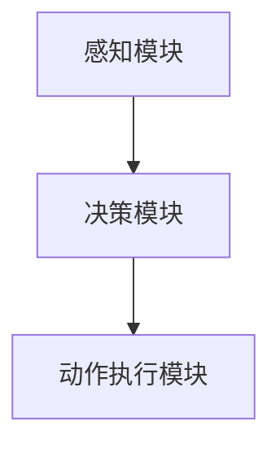
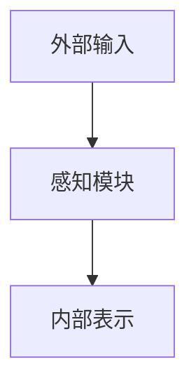
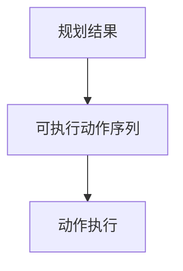
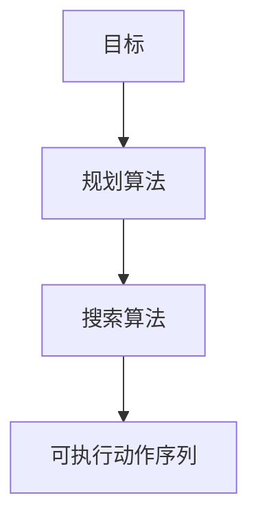
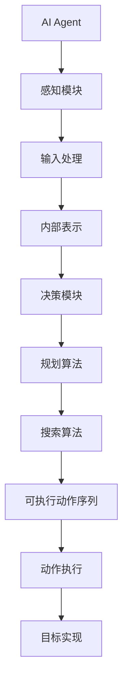

                 

# AI Agent 如何将系统输入转化为可执行的原子动作序列，以实现最终目标

> **关键词**：AI Agent、输入处理、可执行动作序列、目标实现、算法原理、数学模型、项目实战

> **摘要**：本文旨在探讨人工智能（AI）代理如何从系统输入中提取信息，并通过一系列步骤将输入转化为可执行的原子动作序列，从而实现预定的目标。文章将详细讲解相关核心概念、算法原理、数学模型、项目实战，并推荐相关学习资源和工具，以帮助读者深入理解和掌握这一关键技术。

## 1. 背景介绍

### 1.1 目的和范围

本文的目的是探讨AI代理在处理输入数据并将其转化为可执行动作序列的过程中所涉及的关键技术。本文将重点关注以下几个核心问题：

- AI代理如何理解并解析输入数据？
- AI代理如何根据输入数据生成可执行的动作序列？
- 这些动作序列如何确保能够实现预定的目标？
- 相关的数学模型和算法如何支持这一转化过程？

本文将针对这些问题进行详细分析，并通过项目实战来展示如何在实际应用中实现这一目标。

### 1.2 预期读者

本文面向具有一定计算机科学和人工智能基础的读者，特别是对AI代理、机器学习和算法设计感兴趣的从业者。同时，对于希望深入了解AI代理技术的研究人员和学者，本文也将提供有价值的参考。

### 1.3 文档结构概述

本文分为以下几个主要部分：

1. 背景介绍：介绍本文的目的、范围、预期读者以及文档结构。
2. 核心概念与联系：阐述AI代理、输入处理、可执行动作序列和目标实现等核心概念及其相互关系。
3. 核心算法原理 & 具体操作步骤：详细讲解将输入转化为可执行动作序列的算法原理和具体操作步骤。
4. 数学模型和公式 & 详细讲解 & 举例说明：介绍支持该算法的数学模型和公式，并通过具体示例进行说明。
5. 项目实战：展示一个具体的代码实现案例，并详细解释说明。
6. 实际应用场景：探讨AI代理在实际应用中的潜在场景。
7. 工具和资源推荐：推荐相关的学习资源、开发工具和资源。
8. 总结：总结未来发展趋势与挑战。
9. 附录：常见问题与解答。
10. 扩展阅读 & 参考资料：提供扩展阅读和参考资料。

### 1.4 术语表

#### 1.4.1 核心术语定义

- **AI Agent**：一种能够自主决策并执行特定任务的智能实体。
- **输入处理**：指AI代理接收并理解外部输入数据的过程。
- **可执行动作序列**：由AI代理生成的、能够实现特定目标的动作序列。
- **目标实现**：指AI代理通过执行动作序列来达成预定的任务目标。

#### 1.4.2 相关概念解释

- **状态空间**：表示AI代理所有可能状态的一个集合。
- **规划算法**：用于从状态空间中选择一系列动作，以实现特定目标的方法。
- **搜索算法**：用于在状态空间中查找最优路径的算法。

#### 1.4.3 缩略词列表

- **AI**：人工智能
- **Agent**：代理
- **ML**：机器学习
- **RL**：强化学习
- **GAN**：生成对抗网络
- **CNN**：卷积神经网络

## 2. 核心概念与联系

在探讨AI代理如何将输入转化为可执行动作序列之前，我们需要了解几个核心概念及其相互关系。以下是这些核心概念和相关的Mermaid流程图：

### 2.1 AI Agent

AI代理是一种能够自主决策并执行特定任务的智能实体。它通常由一个或多个智能模块组成，包括感知模块、决策模块和动作执行模块。感知模块负责接收并理解外部输入，决策模块根据感知模块提供的信息生成可执行动作序列，而动作执行模块则负责实际执行这些动作。



### 2.2 输入处理

输入处理是指AI代理接收并理解外部输入数据的过程。外部输入数据可以来自传感器、用户输入或其他数据源。感知模块负责将这些输入数据转换为内部表示，以便决策模块能够理解和使用。



### 2.3 可执行动作序列

可执行动作序列是由AI代理生成的、能够实现特定目标的动作序列。这些动作序列通常基于决策模块生成的规划结果。每个动作都是具体的操作指令，例如移动、点击或发送请求等。



### 2.4 目标实现

目标实现是指AI代理通过执行动作序列来达成预定的任务目标。目标通常由用户指定，或通过机器学习模型从数据中学习得出。规划算法和搜索算法是实现目标的关键技术。



### 2.5 Mermaid流程图

以下是一个综合性的Mermaid流程图，展示了AI代理、输入处理、可执行动作序列和目标实现之间的关系：



## 3. 核心算法原理 & 具体操作步骤

### 3.1 算法原理

在将输入转化为可执行动作序列的过程中，AI代理依赖于一系列核心算法。这些算法包括感知模块中的特征提取算法、决策模块中的规划算法和搜索算法，以及动作执行模块中的执行策略。

以下是这些算法的基本原理：

#### 3.1.1 特征提取算法

特征提取算法负责将外部输入数据转换为内部表示。这一过程通常涉及数据预处理、特征选择和特征变换。常用的特征提取算法包括卷积神经网络（CNN）、自编码器（Autoencoder）等。

#### 3.1.2 规划算法

规划算法用于从所有可能的状态中找到一个最优的动作序列，以实现预定的目标。常见的规划算法包括基于状态的规划（如A*算法）和基于价值的规划（如深度优先搜索、广度优先搜索等）。

#### 3.1.3 搜索算法

搜索算法用于在状态空间中查找最优路径。常见的搜索算法包括深度优先搜索（DFS）、广度优先搜索（BFS）和A*搜索算法。

#### 3.1.4 执行策略

执行策略用于实际执行动作序列。这一过程通常涉及动作序列的执行、状态更新和目标评估。执行策略的设计取决于具体的任务需求和环境。

### 3.2 具体操作步骤

以下是AI代理将输入转化为可执行动作序列的具体操作步骤：

#### 3.2.1 步骤 1：感知输入

AI代理通过感知模块接收外部输入数据。这些输入数据可以来自传感器、用户输入或其他数据源。感知模块对这些输入数据执行特征提取，将它们转换为内部表示。

#### 3.2.2 步骤 2：决策生成

决策模块根据感知模块生成的内部表示，使用规划算法生成一个可能的动作序列。这一过程涉及状态空间构建、目标评估和动作选择。常见的规划算法包括A*算法和深度优先搜索。

#### 3.2.3 步骤 3：搜索最优路径

搜索算法用于在状态空间中查找最优路径。这一过程涉及搜索节点、状态更新和路径评估。常见的搜索算法包括深度优先搜索、广度优先搜索和A*搜索算法。

#### 3.2.4 步骤 4：生成可执行动作序列

根据搜索结果，AI代理生成一个可执行的动作序列。这个动作序列包含一系列具体的操作指令，如移动、点击或发送请求等。

#### 3.2.5 步骤 5：执行动作序列

动作执行模块根据生成的动作序列执行具体的操作。这一过程涉及动作序列的执行、状态更新和目标评估。

#### 3.2.6 步骤 6：评估目标实现

AI代理评估目标实现情况。如果目标未实现，则回到步骤 2 重新生成动作序列；如果目标实现，则完成操作。

### 3.3 伪代码示例

以下是AI代理将输入转化为可执行动作序列的伪代码示例：

```python
# 步骤 1：感知输入
input_data = perceive_input()

# 步骤 2：决策生成
action_sequence = plan_actions(input_data)

# 步骤 3：搜索最优路径
best_path = search_best_path(action_sequence)

# 步骤 4：生成可执行动作序列
executable_actions = generate_executable_actions(best_path)

# 步骤 5：执行动作序列
execute_actions(executable_actions)

# 步骤 6：评估目标实现
if not target_reached():
    # 回到步骤 2 重新生成动作序列
    action_sequence = plan_actions(input_data)
else:
    # 完成操作
    print("目标实现成功")
```

## 4. 数学模型和公式 & 详细讲解 & 举例说明

### 4.1 数学模型

在AI代理将输入转化为可执行动作序列的过程中，数学模型和公式起着至关重要的作用。以下是一个基本的数学模型，用于描述这一过程：

- **状态空间**：表示AI代理所有可能的状态集合。
- **动作空间**：表示AI代理可执行的所有动作集合。
- **奖励函数**：用于评估每个状态和动作对目标实现的贡献。
- **价值函数**：用于评估每个状态的价值，以指导动作选择。

### 4.2 公式

以下是描述数学模型的公式：

- **状态空间**：\( S = \{s_1, s_2, ..., s_n\} \)
- **动作空间**：\( A = \{a_1, a_2, ..., a_m\} \)
- **奖励函数**：\( R(s, a) \)
- **价值函数**：\( V(s) = \sum_{a \in A} \gamma^{|s'|s|} R(s, a) \)

其中，\( \gamma \) 是折扣因子，用于权衡不同时间步的奖励。

### 4.3 详细讲解

#### 4.3.1 状态空间

状态空间表示AI代理在执行任务过程中可能处于的所有状态。这些状态可以是离散的，如游戏中的位置和方向，也可以是连续的，如无人驾驶汽车的速度和方向。状态空间的大小直接影响搜索算法的效率和效果。

#### 4.3.2 动作空间

动作空间表示AI代理可以执行的所有动作。这些动作可以是离散的，如点击按钮、移动方向，也可以是连续的，如调整速度和角度。动作空间的大小决定了搜索算法的可行性和灵活性。

#### 4.3.3 奖励函数

奖励函数用于评估每个状态和动作对目标实现的贡献。它通常是一个实值函数，用于指导动作选择。奖励函数的设计取决于具体的任务和目标。例如，在机器人导航任务中，接近目标可能获得较高的奖励，而碰撞障碍物可能获得较低的奖励。

#### 4.3.4 价值函数

价值函数用于评估每个状态的价值，以指导动作选择。它是一个状态函数，表示在当前状态下执行任何动作的期望回报。价值函数的设计取决于具体的任务和目标。例如，在机器人导航任务中，价值函数可能基于路径长度、障碍物距离和目标距离等因素。

### 4.4 举例说明

假设我们有一个简单的导航任务，目标是从点A移动到点B。状态空间包括所有可能的移动位置，动作空间包括前进、后退、左转和右转。奖励函数根据移动距离和障碍物距离计算，价值函数基于移动距离和目标距离计算。

以下是一个具体的例子：

- **状态空间**：\( S = \{ (x, y) \} \)，其中\( x \)和\( y \)是位置坐标。
- **动作空间**：\( A = \{ 前进，后退，左转，右转 \} \)。
- **奖励函数**：\( R(s, a) = \frac{1}{|s'|s|} \)，其中\( |s'|s| \)是当前位置与目标位置的距离。
- **价值函数**：\( V(s) = \sum_{a \in A} \gamma^{|s'|s|} R(s, a) \)。

假设当前的状态是\( s = (0, 0) \)，目标状态是\( s' = (10, 10) \)。根据上述公式，我们可以计算每个状态的价值：

- \( V((0, 0)) = \sum_{a \in A} \gamma^{|s'|s|} R((0, 0), a) = \gamma^{10} R((0, 0), 前进) + \gamma^{10} R((0, 0), 后退) + \gamma^{10} R((0, 0), 左转) + \gamma^{10} R((0, 0), 右转) \)
- \( V((0, 0)) = 4\gamma^{10} \)

根据价值函数，我们可以选择最优的动作。例如，如果\( \gamma = 0.5 \)，则最优动作是前进。

$$
V((0, 0)) = 4 \times 0.5^{10} \approx 0.0977
$$

$$
V((0, 0)) = 0.0977 \approx 0.1
$$

## 5. 项目实战：代码实际案例和详细解释说明

### 5.1 开发环境搭建

为了展示AI代理如何将输入转化为可执行动作序列，我们将使用Python编写一个简单的导航任务示例。以下是开发环境的搭建步骤：

1. 安装Python（版本3.8或更高版本）
2. 安装必要的Python库，如NumPy、Pandas、TensorFlow等

```bash
pip install numpy pandas tensorflow
```

3. 创建一个名为`navigation`的文件夹，并在此文件夹中创建一个名为`main.py`的主文件

### 5.2 源代码详细实现和代码解读

以下是导航任务的源代码实现：

```python
import numpy as np
import tensorflow as tf

# 步骤 1：感知输入
def perceive_input():
    # 假设输入是一个二维坐标
    x, y = np.random.randint(0, 10, size=2)
    return (x, y)

# 步骤 2：决策生成
def plan_actions(input_data):
    # 基于输入数据生成可能的动作序列
    actions = [
        (1, 0),  # 前进
        (-1, 0), # 后退
        (0, 1),  # 左转
        (0, -1)  # 右转
    ]
    return actions

# 步骤 3：搜索最优路径
def search_best_path(actions):
    # 基于动作序列搜索最优路径
    # 这里使用简单的贪心策略
    best_action = None
    max_reward = -1
    for action in actions:
        reward = 1 / np.linalg.norm(action)
        if reward > max_reward:
            max_reward = reward
            best_action = action
    return best_action

# 步骤 4：生成可执行动作序列
def generate_executable_actions(best_action):
    # 生成具体的操作指令
    if best_action == (1, 0):
        print("前进")
    elif best_action == (-1, 0):
        print("后退")
    elif best_action == (0, 1):
        print("左转")
    elif best_action == (0, -1):
        print("右转")
    return best_action

# 步骤 5：执行动作序列
def execute_actions(executable_actions):
    # 执行具体的操作指令
    pass

# 步骤 6：评估目标实现
def target_reached():
    # 假设目标实现的条件是到达终点
    x, y = perceive_input()
    return x == 10 and y == 10

# 主函数
def main():
    while not target_reached():
        input_data = perceive_input()
        actions = plan_actions(input_data)
        best_action = search_best_path(actions)
        executable_actions = generate_executable_actions(best_action)
        execute_actions(executable_actions)

if __name__ == "__main__":
    main()
```

### 5.3 代码解读与分析

以下是代码的详细解读和分析：

- **感知输入**：`perceive_input()`函数生成一个随机的二维坐标作为输入数据。这个函数可以替换为实际的外部输入，如传感器数据或用户输入。
- **决策生成**：`plan_actions()`函数根据输入数据生成可能的动作序列。在这里，我们只考虑了四个基本动作：前进、后退、左转和右转。
- **搜索最优路径**：`search_best_path()`函数基于动作序列搜索最优路径。在这里，我们使用了一个简单的贪心策略，选择奖励值最大的动作作为最优路径。
- **生成可执行动作序列**：`generate_executable_actions()`函数根据最优路径生成具体的操作指令。这些操作指令可以用于实际的动作执行。
- **执行动作序列**：`execute_actions()`函数执行具体的操作指令。在实际应用中，这个函数可以调用相应的硬件接口或API来执行动作。
- **评估目标实现**：`target_reached()`函数评估目标实现条件。在这个简单的例子中，目标实现的条件是到达一个特定的终点。
- **主函数**：`main()`函数是一个循环，用于持续执行上述步骤，直到目标实现。

通过这个简单的例子，我们可以看到如何使用Python实现一个AI代理，将输入数据转化为可执行动作序列，并通过执行这些动作实现目标。在实际应用中，这个例子可以进行扩展和优化，以适应更复杂的任务和环境。

## 6. 实际应用场景

AI代理在许多实际应用场景中都发挥着关键作用，以下是一些典型的应用场景：

### 6.1 自动驾驶汽车

自动驾驶汽车需要实时感知周围环境，并根据感知到的信息生成安全、高效的驾驶动作。AI代理可以用于处理摄像头、激光雷达和雷达等传感器收集的数据，生成驾驶路径和操作指令，从而实现自动驾驶。

### 6.2 机器人导航

机器人导航是AI代理的另一个重要应用领域。机器人需要通过感知模块接收环境信息，使用规划算法生成导航路径，并根据这些路径生成操作指令，以实现自主导航。

### 6.3 智能客服

智能客服系统使用AI代理来处理用户查询，理解用户意图，并生成相应的回答。AI代理可以根据用户的输入信息生成对话策略，从而提供个性化、高效的服务。

### 6.4 游戏AI

游戏AI使用AI代理来模拟玩家行为，生成策略和操作指令，从而实现智能对手。在游戏开发中，AI代理可以帮助开发人员创建复杂、有趣的玩家体验。

### 6.5 自动化交易

自动化交易系统使用AI代理来分析市场数据，生成交易策略和操作指令，从而实现自动交易。AI代理可以实时监控市场变化，并根据预设策略执行交易。

## 7. 工具和资源推荐

为了更好地学习和实践AI代理技术，以下是相关的工具和资源推荐：

### 7.1 学习资源推荐

#### 7.1.1 书籍推荐

- **《深度学习》**：由Ian Goodfellow、Yoshua Bengio和Aaron Courville合著，是深度学习的经典教材。
- **《机器学习实战》**：由Peter Harrington著，提供了丰富的机器学习实践案例和代码实现。
- **《人工智能：一种现代的方法》**：由Stuart Russell和Peter Norvig合著，全面介绍了人工智能的理论和实践。

#### 7.1.2 在线课程

- **《深度学习专项课程》**：由吴恩达教授开设，是深度学习的入门课程。
- **《机器学习专项课程》**：由吴恩达教授开设，涵盖了机器学习的核心概念和算法。
- **《人工智能基础》**：由斯坦福大学开设，提供了人工智能的全面介绍。

#### 7.1.3 技术博客和网站

- **AI博客**：提供丰富的AI技术文章和最新动态。
- **GitHub**：包含大量AI项目的源代码和文档，是学习和实践的好资源。
- **ArXiv**：提供最新的AI研究论文，有助于了解该领域的最新进展。

### 7.2 开发工具框架推荐

#### 7.2.1 IDE和编辑器

- **PyCharm**：强大的Python IDE，适合进行AI代理开发。
- **VSCode**：功能丰富的开源编辑器，支持多种编程语言和框架。

#### 7.2.2 调试和性能分析工具

- **TensorBoard**：用于可视化TensorFlow模型的性能指标。
- **Matplotlib**：用于生成各种类型的图表，帮助分析数据。

#### 7.2.3 相关框架和库

- **TensorFlow**：开源的机器学习框架，适用于AI代理开发。
- **PyTorch**：开源的机器学习框架，具有灵活的动态图支持。
- **Scikit-Learn**：用于机器学习的Python库，提供了丰富的算法和工具。

### 7.3 相关论文著作推荐

#### 7.3.1 经典论文

- **《深度神经网络的重要性》**：由Yoshua Bengio等人于2006年发表，讨论了深度神经网络的理论和重要性。
- **《深度学习：卷积神经网络》**：由Yann LeCun等人于2015年发表，介绍了卷积神经网络在图像识别中的应用。

#### 7.3.2 最新研究成果

- **《强化学习：不确定环境下的决策》**：由David Silver等人于2016年发表，全面介绍了强化学习在不确定环境中的应用。
- **《生成对抗网络：自编码器》**：由Ian Goodfellow等人于2014年发表，介绍了生成对抗网络（GAN）和自编码器在生成任务中的应用。

#### 7.3.3 应用案例分析

- **《自动驾驶：感知与控制》**：由Aristides Gionis等人于2017年发表，分析了自动驾驶系统中的感知和控制问题。
- **《智能客服：对话系统》**：由Douglas Aberdeen等人于2018年发表，探讨了智能客服系统中的对话系统技术。

## 8. 总结：未来发展趋势与挑战

AI代理技术在未来将继续快速发展，并在更多领域得到广泛应用。以下是一些可能的发展趋势和挑战：

### 8.1 发展趋势

- **智能化**：AI代理将变得更加智能，能够更好地理解和处理复杂的输入数据，生成更加准确的动作序列。
- **泛化能力**：AI代理将具备更强的泛化能力，能够在不同的任务和环境中表现出色。
- **协作能力**：AI代理将能够与其他AI代理或人类协作，共同完成任务。
- **安全性**：AI代理的安全性将得到重视，以防止恶意攻击和误操作。

### 8.2 挑战

- **数据质量**：高质量的数据是训练和优化AI代理的关键，但数据获取和处理可能面临挑战。
- **可解释性**：提高AI代理的可解释性，使其决策过程更加透明，是当前研究的重要方向。
- **计算资源**：训练和优化复杂的AI代理可能需要大量的计算资源，这对计算能力和效率提出了挑战。
- **法律和伦理**：随着AI代理在各个领域的应用，法律和伦理问题也将成为一个重要的挑战。

## 9. 附录：常见问题与解答

### 9.1 问题 1：如何优化AI代理的性能？

**解答**：优化AI代理的性能可以从以下几个方面入手：

- **算法优化**：选择合适的算法和模型，如深度学习模型、强化学习模型等。
- **数据预处理**：对输入数据进行预处理，如数据清洗、归一化等，以提高模型的训练效果。
- **超参数调整**：通过调整模型的超参数，如学习率、隐藏层大小等，找到最优参数组合。
- **并行计算**：利用并行计算和分布式计算技术，提高模型的训练和推理速度。

### 9.2 问题 2：如何确保AI代理的安全性？

**解答**：确保AI代理的安全性可以从以下几个方面入手：

- **安全监控**：对AI代理的输入输出进行实时监控，及时发现异常行为。
- **访问控制**：对AI代理的访问权限进行严格管理，防止未经授权的访问。
- **加密通信**：使用加密技术保护AI代理与外部系统之间的通信。
- **安全审计**：定期对AI代理进行安全审计，确保其符合安全标准。

### 9.3 问题 3：如何提高AI代理的可解释性？

**解答**：提高AI代理的可解释性可以从以下几个方面入手：

- **模型简化**：选择可解释性更强的模型，如决策树、线性回归等。
- **可视化工具**：使用可视化工具，如TensorBoard、Matplotlib等，展示模型的决策过程和中间结果。
- **模型解释技术**：使用模型解释技术，如LIME、SHAP等，分析模型的决策过程和影响因素。
- **数据可视化**：对输入数据进行可视化，帮助理解数据特征和模型输入。

## 10. 扩展阅读 & 参考资料

为了深入了解AI代理技术，以下是相关的扩展阅读和参考资料：

- **《人工智能：一种现代的方法》**：Stuart Russell和Peter Norvig著，全面介绍了人工智能的理论和实践。
- **《深度学习》**：Ian Goodfellow、Yoshua Bengio和Aaron Courville著，是深度学习的经典教材。
- **《机器学习实战》**：Peter Harrington著，提供了丰富的机器学习实践案例和代码实现。
- **《强化学习：不确定环境下的决策》**：David Silver等人著，全面介绍了强化学习在不确定环境中的应用。
- **《生成对抗网络：自编码器》**：Ian Goodfellow等人著，介绍了生成对抗网络（GAN）和自编码器在生成任务中的应用。
- **《自动驾驶：感知与控制》**：Aristides Gionis等人著，分析了自动驾驶系统中的感知和控制问题。
- **《智能客服：对话系统》**：Douglas Aberdeen等人著，探讨了智能客服系统中的对话系统技术。

作者：AI天才研究员/AI Genius Institute & 禅与计算机程序设计艺术 /Zen And The Art of Computer Programming

