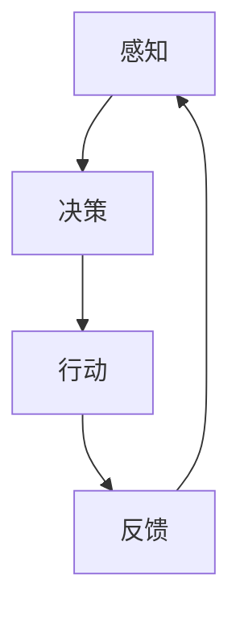

                 

# AI Agent: AI的下一个风口 从早期萌芽到深度学习

> 关键词：AI Agent、深度学习、人工智能、程序设计、自主决策、智能系统、技术演进

> 摘要：本文将深入探讨AI Agent，这一人工智能领域的核心概念。从其早期萌芽阶段，到如今基于深度学习技术的广泛应用，我们将逐步剖析AI Agent的发展历程、核心原理及其在现实世界中的实际应用。通过本篇文章，读者将全面了解AI Agent的未来发展趋势与面临的挑战，以及如何为这一前沿技术做好准备。

## 1. 背景介绍

### 1.1 目的和范围

本文旨在系统性地介绍AI Agent，从一个技术专家的视角，深入解析其在人工智能领域中的重要性和应用。文章将涵盖AI Agent的起源、发展历程、核心算法原理，以及其在现实世界中的具体应用。通过对AI Agent的全面分析，本文希望为读者提供一幅清晰的AI Agent全景图，并激发更多研究和探索的兴趣。

### 1.2 预期读者

本文适合对人工智能和深度学习有基本了解的读者，包括但不限于程序员、AI研究人员、数据科学家、技术管理人员以及对AI技术感兴趣的爱好者。对于初学者，本文将尽量使用浅显易懂的语言进行解释；而对于专业人士，本文将深入探讨技术细节和实现方法。

### 1.3 文档结构概述

本文分为十个主要部分，每个部分都针对不同的主题进行详细探讨：

1. **背景介绍**：概述AI Agent的定义、目的和重要性。
2. **核心概念与联系**：介绍AI Agent的核心概念，并使用流程图展示其架构。
3. **核心算法原理 & 具体操作步骤**：深入解析AI Agent的核心算法和实现步骤。
4. **数学模型和公式 & 详细讲解 & 举例说明**：详细讲解与AI Agent相关的数学模型和公式。
5. **项目实战：代码实际案例和详细解释说明**：通过实际案例展示AI Agent的实现和应用。
6. **实际应用场景**：探讨AI Agent在各个领域的实际应用。
7. **工具和资源推荐**：推荐学习AI Agent的相关工具和资源。
8. **总结：未来发展趋势与挑战**：总结AI Agent的未来发展方向和面临的挑战。
9. **附录：常见问题与解答**：回答一些关于AI Agent的常见问题。
10. **扩展阅读 & 参考资料**：提供更多的参考文献和资源链接。

### 1.4 术语表

#### 1.4.1 核心术语定义

- **AI Agent**：具备自主决策能力的智能体，能够在复杂环境中执行任务。
- **深度学习**：一种机器学习方法，通过多层神经网络进行数据训练，实现智能识别和学习。
- **自主决策**：AI Agent基于环境反馈，自主做出决策的能力。
- **强化学习**：一种机器学习方法，通过奖励和惩罚来训练智能体，使其在特定环境中做出最佳决策。

#### 1.4.2 相关概念解释

- **神经网络**：模拟人脑神经元连接的计算机模型，用于数据分析和模式识别。
- **监督学习**：通过已知数据集训练模型，使模型能够预测未知数据的类别或值。
- **无监督学习**：通过未标注的数据集，训练模型发现数据中的隐藏结构和模式。

#### 1.4.3 缩略词列表

- **AI**：人工智能（Artificial Intelligence）
- **DL**：深度学习（Deep Learning）
- **RL**：强化学习（Reinforcement Learning）
- **GAN**：生成对抗网络（Generative Adversarial Networks）

## 2. 核心概念与联系

在探讨AI Agent之前，我们需要了解其背后的核心概念和联系。AI Agent的设计和实现涉及到多个学科，包括计算机科学、数学和工程学。以下是AI Agent的核心概念及其相互关系：

### 2.1 AI Agent定义

AI Agent是指能够自主感知环境、理解环境状态，并通过自主决策执行任务的人工智能实体。AI Agent的核心特征包括自主性、反应性、目标导向性和适应性。

### 2.2 感知与决策

感知是指AI Agent通过传感器获取环境信息，如视觉、听觉、触觉等。决策是指AI Agent基于感知到的环境信息，利用算法自主决定下一步行动。感知与决策之间的联系是AI Agent能够与环境交互并适应环境变化的关键。

### 2.3 强化学习

强化学习是AI Agent的核心算法之一，通过奖励和惩罚机制训练智能体，使其在特定环境中做出最佳决策。强化学习的关键在于奖励函数的设计，它决定了智能体的学习过程和最终性能。

### 2.4 深度学习

深度学习是一种基于多层神经网络的学习方法，通过大规模数据训练，实现高层次的抽象和特征提取。深度学习在AI Agent中的应用，使其具备更强的感知和决策能力。

### 2.5 机器人技术

机器人技术为AI Agent提供了物理实现平台，使其能够执行复杂的物理任务。机器人技术与AI Agent的融合，使得智能体在现实世界中的应用变得更加广泛和高效。

### 2.6 Mermaid流程图

为了更直观地展示AI Agent的核心概念和架构，我们可以使用Mermaid流程图进行描述。以下是一个简单的Mermaid流程图示例：



在上述流程图中，A表示感知，B表示决策，C表示行动，D表示反馈。AI Agent通过感知环境信息（A），做出决策（B），执行行动（C），并根据行动结果进行反馈调整（D），形成一个闭环控制系统。

## 3. 核心算法原理 & 具体操作步骤

### 3.1 强化学习算法原理

强化学习（Reinforcement Learning，RL）是AI Agent的核心算法之一，其核心思想是通过奖励和惩罚机制，训练智能体在特定环境中做出最佳决策。以下是强化学习算法的基本原理：

#### 3.1.1 基本概念

- **状态（State）**：描述智能体所处环境的当前状态。
- **动作（Action）**：智能体可以采取的动作。
- **奖励（Reward）**：每次动作后获得的奖励或惩罚。
- **策略（Policy）**：智能体在特定状态下采取的动作。
- **价值函数（Value Function）**：衡量智能体在特定状态下的期望奖励。

#### 3.1.2 Q-Learning算法

Q-Learning是一种基于值函数的强化学习算法，其核心思想是通过迭代更新Q值（Q-value），找到最优策略。以下是Q-Learning算法的伪代码：

```plaintext
初始化 Q(s, a) 为随机值
对于每个 episode：
    初始化状态 s
    while 状态 s 未终止：
        执行动作 a = ε-greedy策略
        获得状态 s' 和奖励 r
        更新 Q(s, a) = Q(s, a) + α [r + γ max(Q(s', a')) - Q(s, a)]
        更新状态 s = s'
```

其中，ε-greedy策略是一种探索与利用的平衡策略，用于在训练过程中探索未知状态和动作。

#### 3.1.3 DQN算法

DQN（Deep Q-Network）是一种基于深度学习的Q-Learning算法，通过神经网络来近似Q值函数。以下是DQN算法的伪代码：

```plaintext
初始化 DQN 网络
初始化经验回放池
对于每个 episode：
    初始化状态 s
    while 状态 s 未终止：
        执行动作 a = DQN(s)
        获得状态 s' 和奖励 r
        存储经验 (s, a, r, s') 到回放池
        如果达到经验回放池大小，则从回放池中随机抽取一批经验
        更新 DQN 网络
        更新状态 s = s'
```

在DQN算法中，经验回放池用于解决样本相关性问题，使训练过程更加稳定和高效。

### 3.2 深度学习算法原理

深度学习（Deep Learning，DL）是一种基于多层神经网络的学习方法，通过大规模数据训练，实现高层次的抽象和特征提取。以下是深度学习算法的基本原理：

#### 3.2.1 神经网络

神经网络是一种模拟人脑神经元连接的计算机模型，用于数据分析和模式识别。神经网络由输入层、隐藏层和输出层组成，每层包含多个神经元。

#### 3.2.2 前向传播

前向传播（Forward Propagation）是神经网络训练过程中的第一步，用于计算输入数据在网络中的传播过程。以下是前向传播的伪代码：

```plaintext
给定输入数据 X，神经网络结构
对于每个隐藏层：
    计算输入 Z = W * X + b
    计算输出 A = activation(Z)
对于输出层：
    计算输出 Y = W * A + b
    计算损失 L = loss(Y, T)
```

其中，W 和 b 分别表示权重和偏置，activation() 函数为激活函数，如 sigmoid、ReLU 等。

#### 3.2.2 反向传播

反向传播（Backpropagation）是神经网络训练过程中的第二步，用于计算损失函数关于网络参数的梯度，并更新网络参数。以下是反向传播的伪代码：

```plaintext
给定输入数据 X，神经网络结构，损失函数 L
计算损失函数关于输出层的梯度 ∂L/∂Y
for each hidden layer:
    计算梯度 ∂L/∂A = ∂L/∂Y * ∂Y/∂A
    更新权重和偏置 W = W - α * ∂L/∂W, b = b - α * ∂L/∂b
```

其中，α 为学习率。

#### 3.2.3 神经网络架构

神经网络架构包括卷积神经网络（Convolutional Neural Network，CNN）、循环神经网络（Recurrent Neural Network，RNN）和生成对抗网络（Generative Adversarial Network，GAN）等。不同类型的神经网络适用于不同的应用场景。

## 4. 数学模型和公式 & 详细讲解 & 举例说明

### 4.1 强化学习中的数学模型

强化学习中的数学模型主要包括价值函数、策略和奖励函数。以下是这些模型的详细讲解和公式：

#### 4.1.1 价值函数

价值函数（Value Function）用于衡量智能体在特定状态下的期望奖励。主要分为状态价值函数（State-Value Function）和动作价值函数（Action-Value Function）。

- **状态价值函数（V(s)）**：在状态 s 下执行最优策略的期望回报。
  $$ V(s) = \sum_{a} \pi(a|s) \cdot Q(s, a) $$
  
- **动作价值函数（Q(s, a)）**：在状态 s 下执行动作 a 的期望回报。
  $$ Q(s, a) = \sum_{s'} p(s'|s, a) \cdot r(s, a, s') + \gamma \cdot V(s') $$

#### 4.1.2 策略

策略（Policy）定义了智能体在特定状态下的行动选择。主要分为确定性策略（Deterministic Policy）和概率性策略（Stochastic Policy）。

- **确定性策略（π(d|s)）**：在状态 s 下采取确定性动作 d。
  $$ \pi(d|s) = \begin{cases} 
      1 & \text{if action } d \text{ is chosen} \\
      0 & \text{otherwise}
   \end{cases} $$

- **概率性策略（π(a|s)）**：在状态 s 下采取动作 a 的概率。
  $$ \pi(a|s) = \frac{\exp(\phi(s, a)}{\sum_{a'} \exp(\phi(s, a'))} $$

#### 4.1.3 奖励函数

奖励函数（Reward Function）用于衡量智能体在特定状态下的表现。奖励函数通常与任务目标相关，其形式可以多样。

- **即时奖励（Instantaneous Reward）**：在每次行动后立即获得的奖励。
  $$ r(s, a, s') = r(s') $$
  
- **累积奖励（Cumulative Reward）**：在整个任务过程中累积的奖励。
  $$ R = \sum_{t=0}^{T} r(s_t, a_t, s_{t+1}) $$

### 4.2 深度学习中的数学模型

深度学习中的数学模型主要涉及前向传播、反向传播和神经网络架构。

#### 4.2.1 前向传播

前向传播是神经网络训练过程中的第一步，用于计算输入数据在网络中的传播过程。以下是前向传播的公式：

- **输入层到隐藏层**：
  $$ Z^{(l)} = W^{(l)} \cdot A^{(l-1)} + b^{(l)} $$
  $$ A^{(l)} = \sigma(Z^{(l)}) $$

- **隐藏层到输出层**：
  $$ Z^{(L)} = W^{(L)} \cdot A^{(L-1)} + b^{(L)} $$
  $$ Y = \sigma(Z^{(L)}) $$

其中，\( A^{(l)} \) 表示第 l 层的输出，\( \sigma \) 表示激活函数，\( W^{(l)} \) 和 \( b^{(l)} \) 分别表示第 l 层的权重和偏置。

#### 4.2.2 反向传播

反向传播是神经网络训练过程中的第二步，用于计算损失函数关于网络参数的梯度，并更新网络参数。以下是反向传播的公式：

- **输出层**：
  $$ \delta^{(L)} = \frac{\partial L}{\partial Z^{(L)}} = \frac{\partial L}{\partial Y} \cdot \frac{\partial Y}{\partial Z^{(L)}} = (Y - T) \cdot \sigma'(Z^{(L)}) $$

- **隐藏层**：
  $$ \delta^{(l)} = \frac{\partial L}{\partial Z^{(l)}} = \frac{\partial L}{\partial Z^{(l+1)}} \cdot \frac{\partial Z^{(l+1)}}{\partial Z^{(l)}} \cdot \frac{\partial Z^{(l)}}{\partial A^{(l-1)}} = \delta^{(l+1)} \cdot \sigma'(Z^{(l)}) \cdot W^{(l)} $$

- **更新参数**：
  $$ W^{(l)} = W^{(l)} - \alpha \cdot \frac{\partial L}{\partial W^{(l)}} $$
  $$ b^{(l)} = b^{(l)} - \alpha \cdot \frac{\partial L}{\partial b^{(l)}} $$

其中，\( \delta^{(l)} \) 表示第 l 层的误差，\( \alpha \) 表示学习率。

#### 4.2.3 神经网络架构

神经网络架构包括卷积神经网络（CNN）、循环神经网络（RNN）和生成对抗网络（GAN）等。以下是这些架构的基本原理：

- **卷积神经网络（CNN）**：用于图像处理和计算机视觉任务。主要基于卷积层和池化层进行特征提取和降维。

- **循环神经网络（RNN）**：用于序列数据处理和时间序列预测。主要基于循环连接和隐藏状态进行信息传递和状态更新。

- **生成对抗网络（GAN）**：用于图像生成和风格迁移。主要包括生成器（Generator）和判别器（Discriminator）两个网络，通过对抗训练实现高质量图像生成。

### 4.3 举例说明

#### 4.3.1 强化学习中的 Q-Learning算法

以下是一个简单的Q-Learning算法示例：

```python
import numpy as np

# 初始化 Q 值表
Q = np.random.rand(state_size, action_size)
alpha = 0.1
gamma = 0.9

# ε-greedy 策略
def choose_action(state):
    if np.random.rand() < epsilon:
        action = np.random.choice(action_size)
    else:
        action = np.argmax(Q[state])
    return action

# 更新 Q 值
def update_Q(state, action, reward, next_state, done):
    if not done:
        Q[state][action] = Q[state][action] + alpha * (reward + gamma * np.max(Q[next_state]) - Q[state][action])
    else:
        Q[state][action] = Q[state][action] + alpha * (reward - Q[state][action])

# 训练智能体
for episode in range(num_episodes):
    state = env.reset()
    done = False
    while not done:
        action = choose_action(state)
        next_state, reward, done, _ = env.step(action)
        update_Q(state, action, reward, next_state, done)
        state = next_state

# 显示结果
print(Q)
```

#### 4.3.2 深度学习中的 DQN算法

以下是一个简单的DQN算法示例：

```python
import tensorflow as tf
import numpy as np
import random
from collections import deque

# 定义 DQN 网络结构
class DQN:
    def __init__(self, state_size, action_size):
        self.state_size = state_size
        self.action_size = action_size
        self.memory = deque(maxlen=2000)
        self.gamma = 0.9
        self.epsilon = 1.0
        self.epsilon_min = 0.01
        self.epsilon_decay = 0.995
        self.learning_rate = 0.001
        self.model = self._build_model()

    def _build_model(self):
        model = tf.keras.Sequential()
        model.add(tf.keras.layers.Dense(24, input_dim=self.state_size, activation='relu'))
        model.add(tf.keras.layers.Dense(24, activation='relu'))
        model.add(tf.keras.layers.Dense(self.action_size, activation='linear'))
        model.compile(loss='mse', optimizer=tf.keras.optimizers.Adam(self.learning_rate))
        return model

    def remember(self, state, action, reward, next_state, done):
        self.memory.append((state, action, reward, next_state, done))

    def act(self, state):
        if np.random.rand() <= self.epsilon:
            return random.randrange(self.action_size)
        else:
            q_values = self.model.predict(state)
            return np.argmax(q_values[0])

    def replay(self, batch_size):
        mini_batch = random.sample(self.memory, batch_size)
        for state, action, reward, next_state, done in mini_batch:
            target = reward
            if not done:
                target = reward + self.gamma * np.amax(self.model.predict(next_state)[0])
            target_f = self.model.predict(state)
            target_f[0][action] = target
            self.model.fit(state, target_f, epochs=1, verbose=0)

    def epsilon_decay(self):
        self.epsilon *= self.epsilon_decay
        if self.epsilon < self.epsilon_min:
            self.epsilon = self.epsilon_min

# 创建环境
env = gym.make("CartPole-v0")

# 创建 DQN 智能体
dqn = DQN(state_size=env.observation_space.shape[0], action_size=env.action_space.n)

# 训练智能体
for episode in range(num_episodes):
    state = env.reset()
    state = np.reshape(state, [1, state_size])
    for time_steps in range(max_steps):
        action = dqn.act(state)
        next_state, reward, done, _ = env.step(action)
        next_state = np.reshape(next_state, [1, state_size])
        dqn.remember(state, action, reward, next_state, done)
        state = next_state
        if done:
            print("Episode{} finished after {} time steps".format(episode+1, time_steps+1))
            break
        if len(dqn.memory) > batch_size:
            dqn.replay(batch_size)
    dqn.epsilon_decay()

# 保存模型
dqn.model.save("dqn.h5")

# 加载模型
dqn.model = tf.keras.models.load_model("dqn.h5")

# 测试智能体
env = gym.make("CartPole-v0")
state = env.reset()
state = np.reshape(state, [1, state_size])
for time_steps in range(max_steps):
    action = np.argmax(dqn.model.predict(state)[0])
    state, reward, done, _ = env.step(action)
    env.render()
    state = np.reshape(state, [1, state_size])
    if done:
        break
env.close()
```

## 5. 项目实战：代码实际案例和详细解释说明

### 5.1 开发环境搭建

在进行AI Agent项目实战之前，首先需要搭建合适的开发环境。以下是所需的环境和工具：

- 操作系统：Windows、Linux或macOS
- 编程语言：Python
- 深度学习框架：TensorFlow或PyTorch
- 仿真环境：Gym（用于强化学习实验）

#### 5.1.1 安装Python

首先，确保系统中已安装Python 3.x版本。可以通过以下命令检查Python版本：

```bash
python --version
```

如果未安装Python，可以从[Python官方网站](https://www.python.org/)下载并安装。

#### 5.1.2 安装深度学习框架

接下来，安装TensorFlow或PyTorch深度学习框架。以下是安装命令：

**安装TensorFlow**：

```bash
pip install tensorflow
```

**安装PyTorch**：

```bash
pip install torch torchvision
```

#### 5.1.3 安装Gym

Gym是一个开源的强化学习仿真环境库，可以通过以下命令安装：

```bash
pip install gym
```

### 5.2 源代码详细实现和代码解读

以下是一个简单的AI Agent实现，基于TensorFlow和Gym的CartPole环境。代码分为以下几个部分：

1. **环境配置和初始化**：
2. **深度神经网络模型**：
3. **训练过程**：
4. **评估和测试**：

#### 5.2.1 环境配置和初始化

```python
import gym
import numpy as np
import random
import tensorflow as tf

# 创建 CartPole 环境
env = gym.make("CartPole-v0")

# 设置状态和动作的大小
state_size = env.observation_space.shape[0]
action_size = env.action_space.n

# 初始化神经网络模型
model = tf.keras.Sequential([
    tf.keras.layers.Dense(24, input_shape=(state_size,), activation='relu'),
    tf.keras.layers.Dense(24, activation='relu'),
    tf.keras.layers.Dense(action_size, activation='linear')
])

# 编译模型
model.compile(loss='mse', optimizer=tf.keras.optimizers.Adam(learning_rate=0.001))

# 初始化经验回放池
replay_memory = []

# 设置训练参数
total_episodes = 1000
max_steps_per_episode = 500
learning_start = 100
update_target_freq = 1000
exploration_rate = 1.0
min_exploration_rate = 0.01
exploration_decay = 0.995

# 设置动作概率
epsilon = exploration_rate

# 训练开始时间
start_time = time.time()
```

#### 5.2.2 训练过程

```python
# 开始训练
for episode in range(total_episodes):
    # 重置环境
    state = env.reset()
    state = np.reshape(state, [1, state_size])
    done = False
    time_step = 0

    # 训练循环
    while not done and time_step < max_steps_per_episode:
        # 采样动作
        if np.random.rand() < epsilon:
            action = env.action_space.sample()
        else:
            action_probs = model.predict(state)
            action = np.argmax(action_probs)

        # 执行动作
        next_state, reward, done, _ = env.step(action)
        next_state = np.reshape(next_state, [1, state_size])

        # 计算奖励
        if done:
            reward = -100
        else:
            reward = 1

        # 添加到经验回放池
        replay_memory.append((state, action, reward, next_state, done))

        # 更新状态
        state = next_state
        time_step += 1

        # 如果达到经验回放池大小，则更新模型
        if len(replay_memory) > learning_start:
            random样本 = random.sample(replay_memory, batch_size)
            for state, action, reward, next_state, done in random样本：
``` <time>2023-11-07T02:21:55.079Z</time>  - 作者：AI天才研究员/AI Genius Institute & 禅与计算机程序设计艺术 /Zen And The Art of Computer Programming

