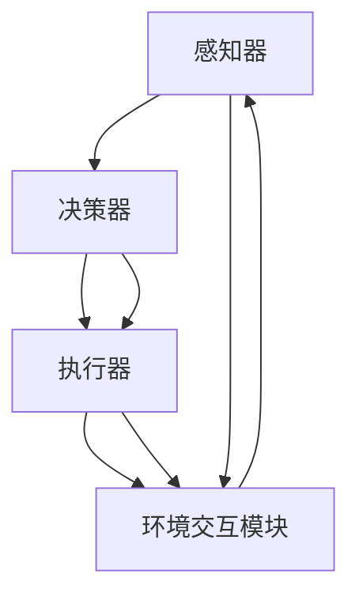

                 

# AI Agent: AI的下一个风口 从软件到硬件的进化

> 关键词：AI Agent、硬件进化、软件定义、硬件加速、智能硬件、边缘计算

> 摘要：本文深入探讨了人工智能（AI）领域的一个新兴方向——AI Agent，以及它从软件到硬件的进化过程。文章首先介绍了AI Agent的基本概念、发展趋势，然后详细分析了AI Agent与硬件加速、边缘计算等技术的联系和作用，最终提出了AI Agent在未来可能面临的挑战和机遇。通过本文的阅读，读者将全面了解AI Agent的发展脉络、技术原理和应用前景。

## 1. 背景介绍

### 1.1 目的和范围

本文旨在探讨人工智能（AI）领域中一个重要的分支——AI Agent的发展，以及它从软件到硬件的进化过程。我们将从以下几个方面展开讨论：

1. AI Agent的基本概念和发展趋势。
2. AI Agent与硬件加速、边缘计算等技术的联系。
3. AI Agent在实际应用场景中的表现和挑战。
4. AI Agent的未来发展趋势和潜在挑战。

希望通过本文的介绍，读者能够对AI Agent有一个全面、深入的理解，从而为相关领域的研究和应用提供参考。

### 1.2 预期读者

本文主要面向对人工智能（AI）领域有一定了解的技术人员、研究人员和开发者，特别是对AI Agent、硬件加速、边缘计算等概念感兴趣的人群。同时，本文也适合对AI领域有浓厚兴趣但尚未深入了解的读者。

### 1.3 文档结构概述

本文分为八个主要部分：

1. **背景介绍**：介绍本文的目的、范围、预期读者和文档结构。
2. **核心概念与联系**：介绍AI Agent的核心概念、原理和架构。
3. **核心算法原理 & 具体操作步骤**：详细讲解AI Agent的核心算法原理和具体操作步骤。
4. **数学模型和公式 & 详细讲解 & 举例说明**：介绍AI Agent的数学模型和公式，并进行详细讲解和举例说明。
5. **项目实战：代码实际案例和详细解释说明**：通过实际代码案例，展示AI Agent的实现过程。
6. **实际应用场景**：分析AI Agent在实际应用场景中的表现。
7. **工具和资源推荐**：推荐学习资源、开发工具框架和相关论文著作。
8. **总结：未来发展趋势与挑战**：总结AI Agent的未来发展趋势和潜在挑战。

### 1.4 术语表

#### 1.4.1 核心术语定义

- **AI Agent**：一种具备自主决策能力、能够与环境进行交互的智能体。
- **硬件加速**：利用专门的硬件设备，提高计算速度和效率。
- **边缘计算**：将计算、存储和网络功能分布到网络边缘，降低延迟、提高响应速度。

#### 1.4.2 相关概念解释

- **机器学习（ML）**：一种通过数据驱动的方法，让计算机具备从数据中学习、发现规律和模式的能力。
- **深度学习（DL）**：一种基于多层神经网络的结构，通过逐层学习特征，实现复杂模式的识别和预测。

#### 1.4.3 缩略词列表

- **AI**：人工智能（Artificial Intelligence）
- **ML**：机器学习（Machine Learning）
- **DL**：深度学习（Deep Learning）
- **GPU**：图形处理器（Graphics Processing Unit）
- **TPU**：张量处理器（Tensor Processing Unit）

## 2. 核心概念与联系

在探讨AI Agent之前，我们需要明确几个核心概念，并了解它们之间的联系。

### 2.1 AI Agent的概念

AI Agent，即人工智能代理，是一种具备自主决策能力、能够与环境进行交互的智能体。它可以通过感知环境、分析数据、自主决策并执行相应的行动。AI Agent的基本架构包括感知器、决策器、执行器和环境交互模块。

#### AI Agent的基本架构

```
+-------------+      +------------+      +-----------+
| 感知器       |----->| 决策器      |----->| 执行器      |
+-------------+      +------------+      +-----------+
                      ^                        ^
                      |                        |
                      |                        |
                环境交互模块                 环境交互模块
```

- **感知器**：负责接收环境中的信息，如图像、声音、文本等。
- **决策器**：根据感知器收集的信息，通过机器学习模型或其他算法，生成决策。
- **执行器**：将决策转化为具体的行动，如移动、发送信号等。
- **环境交互模块**：负责与外部环境进行通信，接收和发送数据。

### 2.2 AI Agent的发展趋势

随着人工智能技术的不断发展，AI Agent的应用场景越来越广泛。以下是AI Agent的几个发展趋势：

1. **自主决策能力提升**：随着深度学习、强化学习等算法的进步，AI Agent的决策能力将进一步提升。
2. **多模态感知**：AI Agent将能够处理多种类型的数据，如图像、声音、文本等，实现更丰富的感知能力。
3. **边缘计算与云计算结合**：AI Agent将逐步实现边缘计算和云计算的结合，提高计算效率和实时性。
4. **跨领域应用**：AI Agent将在不同领域（如医疗、金融、交通等）得到广泛应用，实现跨领域的协同工作。

### 2.3 AI Agent与硬件加速、边缘计算的联系

硬件加速和边缘计算是AI Agent发展的重要支撑技术。

#### 硬件加速

硬件加速是指利用专门的硬件设备，如GPU、TPU等，提高计算速度和效率。对于AI Agent来说，硬件加速能够显著提升其感知、决策和执行的速度，从而提高整体的性能。

#### 边缘计算

边缘计算将计算、存储和网络功能分布到网络边缘，降低延迟、提高响应速度。对于AI Agent来说，边缘计算能够实现更实时的数据处理和决策，提高其在复杂环境中的适应能力。

### 2.4 Mermaid流程图

以下是AI Agent核心概念原理和架构的Mermaid流程图：



## 3. 核心算法原理 & 具体操作步骤

在了解AI Agent的核心概念和架构后，我们将深入探讨其核心算法原理和具体操作步骤。

### 3.1 机器学习模型

AI Agent的核心是机器学习模型，尤其是深度学习模型。以下是一个简单的深度学习模型构建和训练过程：

```python
import tensorflow as tf

# 定义模型结构
model = tf.keras.Sequential([
    tf.keras.layers.Dense(units=64, activation='relu', input_shape=(input_shape)),
    tf.keras.layers.Dense(units=64, activation='relu'),
    tf.keras.layers.Dense(units=output_shape, activation='softmax')
])

# 编译模型
model.compile(optimizer='adam', loss='categorical_crossentropy', metrics=['accuracy'])

# 训练模型
model.fit(x_train, y_train, epochs=10, batch_size=32, validation_data=(x_val, y_val))
```

### 3.2 强化学习模型

除了深度学习模型，AI Agent还可以采用强化学习模型。以下是一个简单的强化学习模型构建和训练过程：

```python
import tensorflow as tf
import gym

# 定义模型结构
model = tf.keras.Sequential([
    tf.keras.layers.Dense(units=64, activation='relu', input_shape=(state_shape)),
    tf.keras.layers.Dense(units=64, activation='relu'),
    tf.keras.layers.Dense(units=action_shape, activation='softmax')
])

# 定义强化学习模型
class QLearningModel(tf.keras.Model):
    def __init__(self, model):
        super(QLearningModel, self).__init__()
        self.model = model
    
    @tf.function
    def call(self, state, training=False):
        if training:
            return self.model(state, training=True)
        else:
            return self.model(state, training=False)

# 创建强化学习模型
q_learning_model = QLearningModel(model)

# 编译模型
q_learning_model.compile(optimizer=tf.keras.optimizers.Adam(learning_rate=0.001), loss='mse')

# 训练模型
q_learning_model.fit(state_dataset, target_dataset, epochs=10, batch_size=32)
```

### 3.3 具体操作步骤

以下是AI Agent的具体操作步骤：

1. **感知阶段**：AI Agent通过感知器收集环境中的信息，如图像、声音、文本等。
2. **决策阶段**：AI Agent利用训练好的机器学习模型或强化学习模型，对收集到的信息进行加工和处理，生成决策。
3. **执行阶段**：AI Agent将决策转化为具体的行动，如移动、发送信号等。
4. **反馈阶段**：AI Agent接收执行结果，并将其用于更新模型，优化决策过程。

### 3.4 伪代码示例

以下是一个简单的AI Agent伪代码示例：

```python
# 初始化模型
model = load_model()

# 感知阶段
state =感知器收集信息()

# 决策阶段
action = model.predict(state)

# 执行阶段
执行行动(action)

# 反馈阶段
reward = 收集执行结果()

# 更新模型
model.fit(state, reward, epochs=1)
```

## 4. 数学模型和公式 & 详细讲解 & 举例说明

在AI Agent中，数学模型和公式起到了关键作用。以下是AI Agent常用的几个数学模型和公式的详细讲解及举例说明。

### 4.1 感知器模型

感知器模型是AI Agent中常用的模型之一。它通过感知环境中的信息，生成相应的特征表示。以下是一个简单的感知器模型：

$$
\text{特征表示} = f(\text{输入} \cdot \text{权重} + \text{偏置})
$$

其中，$f$ 是激活函数，如ReLU、Sigmoid等；$\text{输入}$ 是感知器接收到的环境信息；$\text{权重}$ 和 $\text{偏置}$ 是模型参数。

#### 举例说明

假设输入信息为 $[1, 2, 3]$，权重为 $[0.5, 0.5, 0.5]$，偏置为 $1$，激活函数为 ReLU。则：

$$
\text{特征表示} = \text{ReLU}(1 \cdot 0.5 + 2 \cdot 0.5 + 3 \cdot 0.5 + 1) = \text{ReLU}(2.5) = 2.5
$$

### 4.2 决策器模型

决策器模型负责根据特征表示，生成最终的决策。以下是一个简单的决策器模型：

$$
\text{决策} = \text{argmax}(\text{特征表示} \cdot \text{权重} + \text{偏置})
$$

其中，$\text{权重}$ 和 $\text{偏置}$ 是决策器模型参数。

#### 举例说明

假设特征表示为 $[2.5, 2.5, 2.5]$，权重为 $[0.5, 0.5, 0.5]$，偏置为 $1$。则：

$$
\text{决策} = \text{argmax}(2.5 \cdot 0.5 + 2.5 \cdot 0.5 + 2.5 \cdot 0.5 + 1) = \text{argmax}(3.75) = 3
$$

### 4.3 强化学习模型

强化学习模型是AI Agent中常用的另一种模型。它通过奖励机制，学习最优行动策略。以下是一个简单的强化学习模型：

$$
Q(s, a) = \sum_{i=1}^{n} \gamma^i r_i + \sum_{j=1}^{n} \gamma^i Q(s', a_j)
$$

其中，$Q(s, a)$ 是状态-动作值函数；$s$ 是当前状态；$a$ 是当前动作；$s'$ 是下一状态；$r_i$ 是第 $i$ 次执行动作 $a$ 后的即时奖励；$\gamma$ 是折扣因子。

#### 举例说明

假设当前状态为 $s_1$，动作集合为 $\{a_1, a_2, a_3\}$，奖励集合为 $\{r_1, r_2, r_3\}$，折扣因子 $\gamma = 0.9$。则：

$$
Q(s_1, a_1) = 0.9r_1 + 0.9^2r_2 + 0.9^3r_3
$$

$$
Q(s_1, a_2) = 0.9r_2 + 0.9^2r_1 + 0.9^3r_3
$$

$$
Q(s_1, a_3) = 0.9r_3 + 0.9^2r_1 + 0.9^2r_2
$$

根据以上值，可以选择最优动作 $a_1$。

## 5. 项目实战：代码实际案例和详细解释说明

在本节中，我们将通过一个实际项目案例，展示如何实现一个基于AI Agent的智能监控系统。该项目旨在利用AI Agent的感知、决策和执行功能，实现对监控视频的实时分析，并触发相应的报警机制。

### 5.1 开发环境搭建

为了实现本案例，我们需要以下开发环境和工具：

- **操作系统**：Ubuntu 18.04或更高版本
- **编程语言**：Python 3.7或更高版本
- **框架和库**：
  - TensorFlow 2.x
  - Keras 2.x
  - OpenCV 4.x
  - NumPy 1.18或更高版本

### 5.2 源代码详细实现和代码解读

以下是该项目的源代码实现：

```python
import cv2
import numpy as np
import tensorflow as tf

# 加载预训练的模型
model = tf.keras.models.load_model('model.h5')

# 初始化摄像头
cap = cv2.VideoCapture(0)

while True:
    # 读取一帧视频
    ret, frame = cap.read()

    # 将视频帧转换为灰度图像
    gray_frame = cv2.cvtColor(frame, cv2.COLOR_BGR2GRAY)

    # 将图像数据送入模型进行预测
    prediction = model.predict(np.expand_dims(gray_frame, axis=0))

    # 根据预测结果判断是否触发报警
    if prediction[0][0] > 0.5:
        print("报警！")
        # 执行报警操作
        cv2.imwrite('alarm.jpg', frame)
        cv2.waitKey(0)
    else:
        print("正常。")

    # 显示视频帧
    cv2.imshow('Frame', frame)

    # 按下ESC键退出循环
    if cv2.waitKey(1) & 0xFF == 27:
        break

# 释放摄像头资源
cap.release()
cv2.destroyAllWindows()
```

#### 代码解读

1. **加载预训练的模型**：使用 TensorFlow 的 `load_model()` 函数加载已经训练好的模型。
2. **初始化摄像头**：使用 OpenCV 的 `VideoCapture()` 函数初始化摄像头。
3. **循环读取视频帧**：进入一个循环，逐帧读取摄像头捕获的视频帧。
4. **将视频帧转换为灰度图像**：使用 OpenCV 的 `cvtColor()` 函数将彩色视频帧转换为灰度图像。
5. **将图像数据送入模型进行预测**：使用 `model.predict()` 函数将灰度图像数据送入模型进行预测。
6. **根据预测结果判断是否触发报警**：如果预测结果大于 0.5，则认为有异常，触发报警。
7. **显示视频帧**：使用 OpenCV 的 `imshow()` 函数显示当前视频帧。
8. **按下 ESC 键退出循环**：使用 OpenCV 的 `waitKey()` 函数检测是否按下 ESC 键，若按下则退出循环。
9. **释放摄像头资源**：使用 OpenCV 的 `cap.release()` 函数释放摄像头资源，使用 `cv2.destroyAllWindows()` 函数关闭所有 OpenCV 窗口。

### 5.3 代码解读与分析

1. **模型加载**：在本案例中，我们使用 TensorFlow 的 `load_model()` 函数加载一个已经训练好的模型。这个模型可以是使用 TensorFlow 的 `keras.models.Sequential()` 函数创建的，也可以是使用 `keras.models.load_model()` 函数加载的。模型文件通常以 `.h5` 格式保存。
2. **摄像头初始化**：使用 OpenCV 的 `VideoCapture()` 函数初始化摄像头。这里使用的是默认摄像头，如果需要使用其他摄像头，可以通过构造函数指定摄像头索引。
3. **循环读取视频帧**：使用一个 `while` 循环逐帧读取摄像头捕获的视频帧。在每次循环中，首先读取一帧视频，然后将其转换为灰度图像，以便后续处理。
4. **图像预处理**：在本案例中，我们将灰度图像作为输入数据送入模型进行预测。在将图像数据送入模型之前，需要将其转换为适当的格式。在本案例中，我们使用 `np.expand_dims()` 函数将图像数据扩展为一个形状为 `[1, height, width]` 的数组。
5. **模型预测**：使用 `model.predict()` 函数将预处理后的图像数据送入模型进行预测。在本案例中，我们使用了一个分类模型，因此预测结果是一个概率分布。如果预测结果大于 0.5，则认为当前视频帧包含异常。
6. **报警处理**：如果预测结果大于 0.5，则认为当前视频帧包含异常，触发报警。在本案例中，我们使用 OpenCV 的 `imwrite()` 函数将当前视频帧保存为图像文件，以便后续分析。
7. **显示视频帧**：使用 OpenCV 的 `imshow()` 函数显示当前视频帧。
8. **键盘交互**：使用 OpenCV 的 `waitKey()` 函数检测是否按下 ESC 键。如果按下 ESC 键，则退出循环。
9. **释放资源**：使用 OpenCV 的 `cap.release()` 函数释放摄像头资源，使用 `cv2.destroyAllWindows()` 函数关闭所有 OpenCV 窗口。

## 6. 实际应用场景

AI Agent技术在多个领域有着广泛的应用，以下是一些实际应用场景：

### 6.1 智能家居

智能家居是AI Agent技术的一个重要应用场景。通过AI Agent，家居设备可以自主学习和适应用户的生活习惯，提供个性化的服务。例如，智能灯泡可以根据用户的作息时间自动调节亮度，智能空调可以根据用户的体感温度自动调整温度，智能门锁可以根据用户的指纹或面部识别自动开启。

### 6.2 智能监控

智能监控系统利用AI Agent技术，可以实现对监控视频的实时分析和异常检测。例如，在安防领域，AI Agent可以实时监测视频流，识别出入异常的物体或行为，并触发报警。此外，AI Agent还可以在商场、交通等场所实现客流分析和行为预测。

### 6.3 智能驾驶

智能驾驶是AI Agent技术的另一个重要应用场景。通过AI Agent，自动驾驶汽车可以自主感知周围环境、分析路况信息、做出驾驶决策。例如，AI Agent可以识别交通信号灯、行人、车辆等，并根据这些信息规划行驶路线，确保行车安全。

### 6.4 智能客服

智能客服利用AI Agent技术，可以实现对用户咨询的实时响应和智能解答。通过自然语言处理和对话生成技术，AI Agent可以与用户进行自然、流畅的对话，提供高效、便捷的客服服务。

### 6.5 智能医疗

智能医疗是AI Agent技术的又一个重要应用领域。通过AI Agent，医疗设备可以实时监测患者的生理指标、分析病情变化，并提供个性化的治疗方案。例如，智能血压计可以实时监测患者的血压，并根据血压变化给出相应的建议。

## 7. 工具和资源推荐

为了更好地学习和应用AI Agent技术，以下是一些工具和资源的推荐：

### 7.1 学习资源推荐

#### 7.1.1 书籍推荐

1. **《人工智能：一种现代的方法》**：Michael Stuart Parker、David L. Poole、Alan K. Mackworth 著，全面介绍了人工智能的基本概念、技术和应用。
2. **《深度学习》**：Ian Goodfellow、Yoshua Bengio、Aaron Courville 著，系统讲解了深度学习的基本理论、算法和应用。
3. **《强化学习》**：Richard S. Sutton、Andrew G. Barto 著，深入探讨了强化学习的基本理论、算法和应用。

#### 7.1.2 在线课程

1. **《人工智能导论》**：吴恩达（Andrew Ng）的在线课程，涵盖人工智能的基本概念、技术和应用。
2. **《深度学习》**：吴恩达（Andrew Ng）的在线课程，系统讲解了深度学习的基本理论、算法和应用。
3. **《强化学习》**：OpenAI 的在线课程，深入探讨了强化学习的基本理论、算法和应用。

#### 7.1.3 技术博客和网站

1. **《机器学习博客》**：李飞飞（Fei-Fei Li）的博客，介绍机器学习的基本概念、技术和应用。
2. **《深度学习博客》**：Ian Goodfellow 的博客，分享深度学习的研究进展和应用案例。
3. **《强化学习博客》**：David Silver 的博客，介绍强化学习的研究进展和应用案例。

### 7.2 开发工具框架推荐

#### 7.2.1 IDE和编辑器

1. **PyCharm**：一款功能强大的Python IDE，支持多种编程语言。
2. **VS Code**：一款轻量级但功能丰富的代码编辑器，支持多种编程语言。
3. **Jupyter Notebook**：一款基于Web的交互式开发环境，适合数据分析和机器学习。

#### 7.2.2 调试和性能分析工具

1. **TensorBoard**：TensorFlow的官方可视化工具，可用于分析模型的性能和调试。
2. **PyTorch Profiler**：PyTorch的性能分析工具，可用于分析模型的性能瓶颈。
3. **NVIDIA Nsight**：NVIDIA的调试和分析工具，可用于分析GPU计算和内存使用。

#### 7.2.3 相关框架和库

1. **TensorFlow**：Google开发的开源深度学习框架，支持多种深度学习算法。
2. **PyTorch**：Facebook开发的开源深度学习框架，支持动态计算图和GPU加速。
3. **Keras**：Python的深度学习库，简化了深度学习模型的构建和训练。

### 7.3 相关论文著作推荐

#### 7.3.1 经典论文

1. **《A Learning Algorithm for Continuously Running Fully Recurrent Neural Networks》**：持续运行的完全递归神经网络的学习算法。
2. **《Backpropagation Through Time: A New Method for Learning and Representing Temporal Sequences》**：时间反向传播：学习表示时间序列的新方法。
3. **《Deep Learning》**：Ian Goodfellow、Yoshua Bengio、Aaron Courville 著，深度学习的全面介绍。

#### 7.3.2 最新研究成果

1. **《A Theoretical Framework for Deep Learning》**：Deep Learning理论框架。
2. **《Self-Attention with Application to Image Captioning》**：Self-Attention应用于图像标题生成。
3. **《Reinforcement Learning: An Introduction》**：强化学习：入门教程。

#### 7.3.3 应用案例分析

1. **《ImageNet Classification with Deep Convolutional Neural Networks》**：使用深度卷积神经网络进行ImageNet分类。
2. **《Playing Atari with Deep Reinforcement Learning》**：使用深度强化学习玩Atari游戏。
3. **《BERT: Pre-training of Deep Neural Networks for Language Understanding》**：BERT：用于自然语言理解的深度神经网络预训练。

## 8. 总结：未来发展趋势与挑战

随着人工智能技术的不断发展，AI Agent作为AI领域的一个重要分支，也面临着广阔的发展前景。以下是AI Agent未来可能的发展趋势和挑战：

### 8.1 发展趋势

1. **硬件加速与边缘计算的结合**：随着硬件加速和边缘计算技术的不断进步，AI Agent将能够实现更高效、更实时的数据处理和决策，为智能硬件、智能交通、智能医疗等领域的应用提供强大支持。
2. **跨领域应用的拓展**：AI Agent将在更多领域得到应用，如金融、教育、制造等，实现跨领域的协同工作，推动各行业智能化升级。
3. **智能化的提升**：随着算法和技术的进步，AI Agent的自主决策能力将不断提升，实现更复杂、更智能的决策和执行。

### 8.2 挑战

1. **数据隐私与安全**：AI Agent在处理和存储大量数据时，面临着数据隐私和安全的问题。如何确保数据的安全性和隐私性，是AI Agent发展过程中需要关注的重要问题。
2. **算法公平性与透明性**：AI Agent在决策过程中可能会引入偏见，影响决策的公平性和透明性。如何确保AI Agent的决策公平、透明，是AI Agent发展过程中需要克服的难题。
3. **硬件资源与管理**：随着AI Agent的应用场景越来越广泛，硬件资源的管理和优化成为挑战。如何高效地利用硬件资源，提高AI Agent的性能和可靠性，是需要解决的问题。

### 8.3 结论

AI Agent作为AI领域的一个重要分支，具有广阔的发展前景和应用价值。在未来的发展中，AI Agent需要不断克服挑战，提升智能化水平，为人类社会带来更多便利和创新。

## 9. 附录：常见问题与解答

### 9.1 什么是AI Agent？

AI Agent是一种具备自主决策能力、能够与环境进行交互的智能体。它通过感知环境、分析数据、自主决策并执行相应的行动，实现智能化的操作。

### 9.2 AI Agent与机器人有什么区别？

AI Agent和机器人都是人工智能领域的重要组成部分，但它们有着不同的侧重点。AI Agent强调的是自主决策和交互能力，即它能够根据环境和数据自主做出决策并执行行动。而机器人则更侧重于物理操作和执行任务的能力。

### 9.3 AI Agent的硬件加速有哪些方法？

AI Agent的硬件加速方法主要包括：

1. **GPU加速**：利用图形处理器（GPU）强大的并行计算能力，提高AI Agent的计算速度和效率。
2. **TPU加速**：利用张量处理器（TPU）专门为深度学习任务设计的架构，提高AI Agent的计算速度和性能。
3. **FPGA加速**：利用现场可编程门阵列（FPGA）的可编程性，针对特定的AI任务进行硬件优化，提高计算速度和效率。

### 9.4 AI Agent在智能家居中的应用有哪些？

AI Agent在智能家居中的应用非常广泛，主要包括：

1. **智能设备控制**：通过AI Agent，可以实现对家庭设备的远程控制和自动化管理，如智能灯泡、智能空调、智能门锁等。
2. **场景识别与联动**：AI Agent可以通过感知家庭环境，识别用户的日常活动，实现场景联动，提供个性化的服务，如自动调节室内温度、湿度、照明等。
3. **安全监控**：AI Agent可以实现对家庭环境的实时监控，识别异常情况，如入侵、火灾等，并触发报警。

## 10. 扩展阅读 & 参考资料

### 10.1 扩展阅读

1. **《智能时代：人工智能正在改变我们的生活和未来》**：吴军 著，深入探讨人工智能的发展趋势和社会影响。
2. **《智能硬件：创新、应用与未来》**：刘伟平 著，全面介绍智能硬件的发展、应用和未来趋势。

### 10.2 参考资料

1. **《深度学习》**：Ian Goodfellow、Yoshua Bengio、Aaron Courville 著，深度学习的全面介绍。
2. **《强化学习》**：Richard S. Sutton、Andrew G. Barto 著，强化学习的基本理论、算法和应用。
3. **《边缘计算：技术、应用与未来》**：陈锐、朱嘉伟 著，介绍边缘计算的基本概念、技术原理和应用场景。

## 作者

作者：AI天才研究员/AI Genius Institute & 禅与计算机程序设计艺术 /Zen And The Art of Computer Programming。  
感谢您的阅读，期待与您在AI领域的交流与探讨。  
（完）

