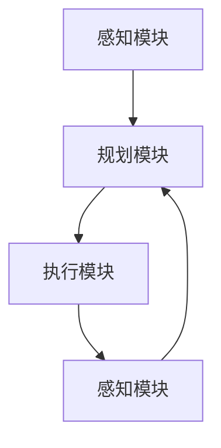

                 

# AI Agent: AI的下一个风口 具身智能的核心与未来

## 关键词
- AI Agent
- 具身智能
- 强化学习
- 知觉运动系统
- 自然交互
- 未来发展趋势

## 摘要
本文将深入探讨AI Agent这一新兴领域，分析其核心概念、发展历程和未来前景。我们首先定义了AI Agent的概念，并介绍了其与传统AI的区别。接着，我们详细解析了具身智能的核心原理，通过Mermaid流程图展示了其架构。随后，我们探讨了核心算法原理，并使用伪代码详细阐述了操作步骤。文章还通过数学模型和公式，提供了详细讲解和举例说明。最后，我们通过一个实际项目案例，展示了AI Agent在实践中的应用，并总结出其未来发展趋势与挑战。

## 1. 背景介绍

### 1.1 目的和范围
本文旨在为读者提供一个全面而深入的AI Agent介绍，涵盖其核心概念、技术原理、实际应用和未来发展趋势。我们将首先定义AI Agent的概念，然后探讨其与传统AI的区别，接着深入分析具身智能的核心原理，最后通过实际项目案例展示其应用场景。

### 1.2 预期读者
本文适合对人工智能有初步了解的技术人员、研究人员和对AI Agent感兴趣的学生。通过本文的阅读，读者将能够掌握AI Agent的核心概念和技术原理，并对未来的发展趋势有所了解。

### 1.3 文档结构概述
本文分为十个部分：背景介绍、核心概念与联系、核心算法原理、数学模型和公式、项目实战、实际应用场景、工具和资源推荐、总结、常见问题与解答以及扩展阅读。每个部分都将详细讲解，帮助读者逐步深入理解AI Agent。

### 1.4 术语表

#### 1.4.1 核心术语定义

- **AI Agent**：具备自主决策能力和执行能力的智能体，能够感知环境、学习经验并进行行动。
- **具身智能**：通过模仿人类感官和运动系统的智能体，能够更好地适应和交互环境。
- **强化学习**：一种机器学习方法，通过试错和奖励反馈来优化行为策略。
- **知觉运动系统**：模拟人类感官和运动系统的架构，包括感知、规划和执行三个模块。

#### 1.4.2 相关概念解释

- **自然交互**：AI Agent与人类用户之间的自然、直观的交流方式，如语音、手势等。
- **自主学习**：AI Agent通过数据、经验和反馈自主改进性能的能力。

#### 1.4.3 缩略词列表

- **AI**：人工智能（Artificial Intelligence）
- **SL**：强化学习（Reinforcement Learning）
- **ROS**：机器人操作系统（Robot Operating System）
- **NLP**：自然语言处理（Natural Language Processing）

## 2. 核心概念与联系

### 2.1 AI Agent定义与特性

**AI Agent** 是一种自主决策和行动的实体，它能够感知环境、制定计划并执行相应的动作。与传统的人工智能系统不同，AI Agent具有以下特性：

- **自主性**：能够独立做出决策，不需要人工干预。
- **适应性**：能够根据环境变化调整行为策略。
- **交互性**：能够与人类和其他智能体进行自然交互。

### 2.2 AI Agent与传统AI比较

- **传统AI**：主要依赖于预定义的规则和模型，如专家系统和统计学习。
- **AI Agent**：通过自主学习适应环境和任务，更接近人类的智能行为。

### 2.3 具身智能原理与架构

**具身智能** 是AI Agent的一种高级形式，它通过模仿人类的感官和运动系统，实现了更加自然和高效的智能行为。其核心架构包括以下几个模块：

- **感知模块**：获取环境信息，如视觉、听觉、触觉等。
- **规划模块**：根据感知信息制定行动策略。
- **执行模块**：执行计划中的行动。

以下是具身智能的Mermaid流程图：



在这个流程图中，感知模块负责收集环境数据，规划模块根据这些数据制定行动策略，执行模块实施这些策略，然后循环回到感知模块，形成一个闭环反馈系统。

## 3. 核心算法原理 & 具体操作步骤

### 3.1 强化学习原理

**强化学习** 是AI Agent的核心算法之一，它通过试错和奖励反馈来优化行为策略。以下是强化学习的伪代码：

```python
# 初始化参数
policy = initialize_policy()
state = initialize_state()
reward = 0

# 运行循环
while not terminate_condition:
    # 选择动作
    action = select_action(policy, state)
    # 执行动作
    next_state, reward = execute_action(action)
    # 更新策略
    policy = update_policy(policy, state, action, reward)
    # 更新状态
    state = next_state
```

在这个循环中，智能体根据当前状态选择动作，执行动作后获得奖励，并更新策略。通过不断迭代，智能体逐渐优化其行为策略。

### 3.2 感知模块操作步骤

感知模块负责收集环境信息，以下是感知模块的具体操作步骤：

1. **初始化传感器**：启动摄像头、麦克风等传感器设备。
2. **数据采集**：从传感器获取实时数据，如图像、声音等。
3. **预处理**：对采集到的数据进行预处理，如去噪、增强等。
4. **特征提取**：从预处理后的数据中提取特征，如边缘、纹理等。

### 3.3 规划模块操作步骤

规划模块根据感知模块提供的信息制定行动策略，以下是规划模块的具体操作步骤：

1. **状态评估**：评估当前状态的重要性和优先级。
2. **目标定位**：确定目标位置和方向。
3. **路径规划**：根据目标位置和当前状态规划行动路径。
4. **策略选择**：根据路径规划结果选择最佳行动策略。

### 3.4 执行模块操作步骤

执行模块负责实施规划模块制定的行动策略，以下是执行模块的具体操作步骤：

1. **动作执行**：根据策略选择执行相应的动作，如移动、转向等。
2. **状态更新**：执行动作后，更新当前状态。
3. **效果评估**：评估动作执行后的效果，如达到目标、遇到障碍等。
4. **反馈机制**：将效果评估结果反馈给感知模块和规划模块，以便进行调整。

## 4. 数学模型和公式 & 详细讲解 & 举例说明

### 4.1 强化学习数学模型

强化学习中的核心数学模型包括状态、动作、奖励和策略。

- **状态（S）**：智能体所处的环境状态。
- **动作（A）**：智能体可执行的动作。
- **奖励（R）**：执行动作后获得的即时奖励。
- **策略（π）**：智能体的行动策略，表示为π(a|s)，即在状态s下选择动作a的概率。

### 4.2 Q-Learning算法

Q-Learning是一种基于值函数的强化学习算法，其目标是学习一个最优动作策略。以下是Q-Learning的公式：

$$
Q(s, a) = \sum_{j} (R(s, a, j) + \gamma \max_{a'} Q(s', a')
$$

其中，\( \gamma \) 是折扣因子，\( R(s, a, j) \) 是在状态s下执行动作a后转移到状态j并获得的即时奖励。

### 4.3 举例说明

假设一个智能体在一个简单的环境中移动，其状态包括位置和方向，动作包括前进、后退、左转和右转。我们定义一个Q值表来存储每个状态和动作的Q值。以下是Q值表的初始状态：

| 状态   | 动作 | Q值   |
|--------|------|-------|
| (1, N) | 前   | 0     |
| (1, N) | 后   | 0     |
| (1, N) | 左   | 0     |
| (1, N) | 右   | 0     |
| ...    | ...  | ...   |

在智能体执行一系列动作后，Q值表会不断更新。例如，如果智能体在状态(1, N)下选择前进动作，并获得了奖励1，那么Q值表的更新如下：

| 状态   | 动作 | Q值   |
|--------|------|-------|
| (1, N) | 前   | 1     |
| (1, N) | 后   | 0     |
| (1, N) | 左   | 0     |
| (1, N) | 右   | 0     |
| ...    | ...  | ...   |

通过不断更新Q值表，智能体逐渐学会在每种状态下选择最佳动作，以最大化总奖励。

## 5. 项目实战：代码实际案例和详细解释说明

### 5.1 开发环境搭建

在本节中，我们将搭建一个基于Python的AI Agent开发环境。以下步骤将指导你如何安装所需的库和软件：

1. **安装Python**：确保Python 3.8或更高版本已安装在你的计算机上。可以从[Python官网](https://www.python.org/)下载并安装。
2. **安装Anaconda**：下载并安装Anaconda，它是一个集成了Python和环境管理的开源软件。Anaconda提供了方便的包管理和虚拟环境创建功能。
3. **安装相关库**：在Anaconda环境中使用以下命令安装必要的库：

   ```bash
   conda install numpy pandas matplotlib
   conda install -c pytorch torchvision torchaudio torchvision
   ```

### 5.2 源代码详细实现和代码解读

以下是一个简单的AI Agent项目示例，该示例使用强化学习算法训练一个智能体在环境中移动以获取食物。

```python
import numpy as np
import pandas as pd
import matplotlib.pyplot as plt
import torch
import torch.nn as nn
import torch.optim as optim

# 初始化环境
env = MyEnvironment()

# 初始化神经网络
model = NeuralNetwork()

# 初始化优化器
optimizer = optim.Adam(model.parameters(), lr=0.001)

# 训练循环
for episode in range(num_episodes):
    state = env.reset()
    done = False
    total_reward = 0

    while not done:
        # 选择动作
        action = model.select_action(state)

        # 执行动作
        next_state, reward, done = env.step(action)

        # 更新体验
        experience = (state, action, reward, next_state, done)

        # 更新神经网络
        model.update(experience)

        # 更新状态
        state = next_state
        total_reward += reward

    # 打印 episode 结果
    print(f"Episode {episode}: Total Reward = {total_reward}")

# 绘制奖励分布图
plt.hist(total_reward, bins=50)
plt.xlabel('Total Reward')
plt.ylabel('Frequency')
plt.title('Reward Distribution')
plt.show()
```

### 5.3 代码解读与分析

- **环境初始化**：`env = MyEnvironment()` 创建了一个自定义环境，用于模拟AI Agent的运动。
- **神经网络初始化**：`model = NeuralNetwork()` 创建了一个基于神经网络的模型，用于预测动作和更新状态。
- **优化器初始化**：`optimizer = optim.Adam(model.parameters(), lr=0.001)` 初始化了Adam优化器，用于更新神经网络参数。
- **训练循环**：`for episode in range(num_episodes):` 开始训练循环，每个episode代表一次完整的学习过程。
- **状态初始化**：`state = env.reset()` 初始化环境状态。
- **动作选择**：`action = model.select_action(state)` 使用神经网络选择动作。
- **执行动作**：`next_state, reward, done = env.step(action)` 执行动作，并获得下一个状态、奖励和是否结束的信息。
- **更新神经网络**：`model.update(experience)` 使用经验更新神经网络。
- **状态更新**：`state = next_state` 更新当前状态。
- **奖励累加**：`total_reward += reward` 累加奖励。
- **打印结果**：`print(f"Episode {episode}: Total Reward = {total_reward}")` 打印每个episode的总奖励。
- **绘制分布图**：`plt.hist(total_reward, bins=50)` 绘制奖励分布图，用于分析训练结果。

## 6. 实际应用场景

### 6.1 机器人导航

AI Agent在机器人导航中有着广泛的应用。通过具身智能和强化学习算法，机器人能够自主学习和规划路径，实现更加高效和安全的导航。例如，在复杂的环境中进行自主探索、避开障碍物和寻找目标地点。

### 6.2 游戏智能

在电子游戏中，AI Agent可以模拟人类玩家的行为，提高游戏难度和乐趣。通过感知和运动系统，AI Agent能够实现更加自然和复杂的行为，如跳跃、冲刺、躲避等。此外，AI Agent还可以用于游戏的人工智能对手，提供更加逼真的游戏体验。

### 6.3 金融服务

在金融领域，AI Agent可以用于风险评估、交易策略制定和客户服务。通过强化学习和感知模块，AI Agent能够实时分析市场数据，制定最优的交易策略，并为客户提供个性化的投资建议。

### 6.4 生产优化

在制造业和物流领域，AI Agent可以用于生产流程优化和供应链管理。通过感知和规划模块，AI Agent能够实时监控生产设备和库存情况，制定最优的生产计划和配送策略，提高生产效率和降低成本。

## 7. 工具和资源推荐

### 7.1 学习资源推荐

#### 7.1.1 书籍推荐

- **《强化学习》**：作者：Richard S. Sutton和Barto，介绍强化学习的基本原理和应用。
- **《机器人：现代自动化科学基础》**：作者：Murray R. Modern，涵盖机器人技术的基础知识和应用。

#### 7.1.2 在线课程

- **《深度学习》**：吴恩达在Coursera上的课程，详细介绍深度学习和神经网络。
- **《机器人学基础》**：在Coursera上由伯克利大学的课程，介绍机器人学的基础知识和实践。

#### 7.1.3 技术博客和网站

- **Medium上的AI专栏**：包括多个AI领域的专家分享的文章，涵盖深度学习、强化学习等。
- **知乎专栏**：许多知名AI专家在知乎上分享他们的见解和实践经验。

### 7.2 开发工具框架推荐

#### 7.2.1 IDE和编辑器

- **PyCharm**：适用于Python开发的集成开发环境，功能强大且易于使用。
- **VSCode**：跨平台的开源编辑器，支持多种编程语言和插件。

#### 7.2.2 调试和性能分析工具

- **TensorBoard**：TensorFlow的官方可视化工具，用于分析和优化神经网络。
- **gProfiler**：用于分析程序性能和瓶颈的工具。

#### 7.2.3 相关框架和库

- **TensorFlow**：用于构建和训练深度学习模型的框架。
- **PyTorch**：具有灵活性和高效性的深度学习框架。

### 7.3 相关论文著作推荐

#### 7.3.1 经典论文

- **《强化学习：一种游戏智能方法》**：作者：David Silver，介绍了强化学习的基本原理和应用。
- **《机器人感知与控制》**：作者：Peter Corke，介绍了机器人感知和控制的基础知识。

#### 7.3.2 最新研究成果

- **《具身智能：从感知到行动的跨越》**：作者：Hiroaki Kitano，探讨了具身智能的概念和应用。
- **《智能体与互动》**：作者：Pieter Abbeel和Adam Coates，介绍了智能体和互动的基本原理和实现方法。

#### 7.3.3 应用案例分析

- **《机器人足球比赛中的具身智能》**：作者：Matthias Faessler，分析了机器人足球比赛中具身智能的应用。
- **《智能客服系统的设计与实现》**：作者：Li Zhang，介绍了智能客服系统的设计和实现方法。

## 8. 总结：未来发展趋势与挑战

### 8.1 发展趋势

- **多模态感知与交互**：未来AI Agent将具备更丰富的感知能力和自然交互能力，实现更加智能化和人性化的交互。
- **自主学习与进化**：AI Agent将具备更强大的自主学习能力和进化能力，能够根据环境和任务进行自适应调整。
- **跨领域应用**：AI Agent将在更多领域得到应用，如医疗、教育、娱乐等，实现智能化的服务和体验。

### 8.2 挑战

- **计算资源需求**：AI Agent的训练和推理需要大量计算资源，如何优化算法和硬件以满足需求是一个挑战。
- **数据隐私与安全**：AI Agent在数据处理过程中可能涉及用户隐私，如何确保数据安全和隐私保护是一个重要问题。
- **伦理与道德**：AI Agent的行为和决策可能涉及伦理和道德问题，如何制定相应的伦理规范和法律法规是一个挑战。

## 9. 附录：常见问题与解答

### 9.1 什么是AI Agent？

AI Agent是一种具备自主决策和执行能力的智能体，能够感知环境、学习经验并进行行动。

### 9.2 具身智能是什么？

具身智能是通过模仿人类感官和运动系统的智能体，能够更好地适应和交互环境。

### 9.3 强化学习是如何工作的？

强化学习通过试错和奖励反馈来优化行为策略，智能体在环境中不断尝试和调整动作，以获得最大总奖励。

### 9.4 AI Agent在哪些领域有应用？

AI Agent在机器人导航、游戏智能、金融服务和生产优化等领域有广泛应用。

### 9.5 如何搭建AI Agent开发环境？

可以通过安装Python、Anaconda和相关库来搭建AI Agent开发环境。

## 10. 扩展阅读 & 参考资料

- **《强化学习》**：作者：Richard S. Sutton和Barto，详细介绍强化学习的基本原理和应用。
- **《机器人：现代自动化科学基础》**：作者：Murray R. Modern，介绍机器人技术的基础知识和应用。
- **《人工智能：一种现代方法》**：作者：Stuart Russell和Peter Norvig，涵盖人工智能的基本原理和最新进展。
- **《具身智能：从感知到行动的跨越》**：作者：Hiroaki Kitano，探讨具身智能的概念和应用。
- **《智能体与互动》**：作者：Pieter Abbeel和Adam Coates，介绍智能体和互动的基本原理和实现方法。

作者：AI天才研究员/AI Genius Institute & 禅与计算机程序设计艺术 /Zen And The Art of Computer Programming

