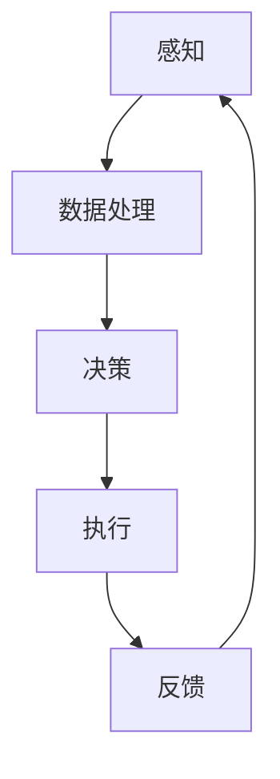

                 

# AI Agent: AI的下一个风口 具身机器人在工业领域的应用

> 关键词：具身机器人、人工智能、工业应用、智能自动化、未来趋势

> 摘要：本文将深入探讨人工智能（AI）领域的下一个热点——具身机器人。通过详细介绍具身机器人的核心概念、原理及其在工业领域的广泛应用，本文旨在揭示具身机器人技术对工业4.0和智能制造的深远影响。我们将通过逐步分析其发展背景、关键技术、数学模型以及实际案例，全面解读这一新兴技术的潜力与挑战。

## 1. 背景介绍

### 1.1 目的和范围

本文的主要目标是介绍具身机器人的概念、原理和应用，并探讨其在工业领域的重要性。我们将从以下几个方面展开讨论：

1. 具身机器人的发展背景及其在人工智能领域的地位。
2. 核心技术原理与架构分析。
3. 数学模型与算法详解。
4. 实际应用场景与案例分析。
5. 工具和资源推荐，包括学习资源、开发工具及相关论文。
6. 未来发展趋势与面临的挑战。

### 1.2 预期读者

本文适合以下读者群体：

1. 对人工智能和机器人技术感兴趣的专业人士。
2. 计算机科学、自动化、机械工程等相关专业的研究生和本科生。
3. 工业自动化工程师、系统集成商和相关行业的技术人员。
4. 对未来技术趋势关注的企业决策者和研究人员。

### 1.3 文档结构概述

本文的结构如下：

1. **背景介绍**：介绍具身机器人的发展背景和目的。
2. **核心概念与联系**：通过Mermaid流程图展示具身机器人的核心概念与联系。
3. **核心算法原理 & 具体操作步骤**：详细讲解具身机器人的算法原理和操作步骤。
4. **数学模型和公式 & 详细讲解 & 举例说明**：阐述数学模型和公式，并举例说明。
5. **项目实战：代码实际案例和详细解释说明**：提供代码实际案例和详细解释。
6. **实际应用场景**：讨论具身机器人在工业领域的应用场景。
7. **工具和资源推荐**：推荐学习资源、开发工具和论文。
8. **总结：未来发展趋势与挑战**：总结具身机器人的未来发展。
9. **附录：常见问题与解答**：回答读者可能关心的问题。
10. **扩展阅读 & 参考资料**：提供扩展阅读资料。

### 1.4 术语表

#### 1.4.1 核心术语定义

- **具身机器人（Embodied Agent）**：具有感知、决策和执行能力的机器人，可以与人类和物理环境进行交互。
- **感知**：机器人通过传感器收集外界信息。
- **决策**：基于感知信息，机器人选择合适的行动。
- **执行**：机器人通过执行器实施决策。

#### 1.4.2 相关概念解释

- **人工智能（AI）**：模拟人类智能的计算机系统。
- **机器人（Robot）**：具备感知、决策和执行能力的自动化设备。
- **深度学习（Deep Learning）**：一种基于人工神经网络的学习方法。
- **增强学习（Reinforcement Learning）**：通过奖励机制进行学习的AI方法。

#### 1.4.3 缩略词列表

- **AI**：人工智能
- **ML**：机器学习
- **DL**：深度学习
- **RL**：增强学习
- **ROS**：机器人操作系统（Robot Operating System）

## 2. 核心概念与联系

### 2.1 具身机器人的核心概念

具身机器人是一种结合了人工智能和机器人技术的系统，其核心概念包括：

- **感知**：通过传感器（如摄像头、激光雷达、触觉传感器等）收集环境信息。
- **决策**：利用机器学习算法（如深度学习、增强学习等）处理感知信息，生成行动策略。
- **执行**：通过执行器（如电机、机械臂、舵机等）实现决策。

### 2.2 核心概念的联系

具身机器人的核心概念之间紧密相连，形成一个完整的工作流程：

1. **感知**：机器人通过传感器收集环境信息，如图像、声音、温度、湿度等。
2. **数据处理**：收集到的数据经过预处理，用于后续的决策。
3. **决策**：利用机器学习算法对感知数据进行分析，生成合适的行动策略。
4. **执行**：机器人根据决策结果，通过执行器实现预定的动作。

### 2.3 Mermaid 流程图

下面是具身机器人的Mermaid流程图，展示了各核心概念之间的联系：



## 3. 核心算法原理 & 具体操作步骤

### 3.1 感知

感知是具身机器人的第一步，其核心任务是通过传感器收集环境信息。以下为感知算法的伪代码：

```python
# 感知算法伪代码
def sense_environment(sensors):
    observations = []
    for sensor in sensors:
        observation = sensor.read()
        observations.append(observation)
    return observations
```

### 3.2 数据处理

数据处理是对收集到的感知数据进行预处理，以便后续的决策。以下为数据处理算法的伪代码：

```python
# 数据处理算法伪代码
def preprocess_observations(observations):
    preprocessed_observations = []
    for observation in observations:
        preprocessed_observation = preprocess(observation)
        preprocessed_observations.append(preprocessed_observation)
    return preprocessed_observations
```

### 3.3 决策

决策是基于处理后的感知数据，利用机器学习算法生成行动策略。以下为决策算法的伪代码：

```python
# 决策算法伪代码
def make_decision(preprocessed_observations, model):
    action = model.predict(preprocessed_observations)
    return action
```

### 3.4 执行

执行是机器人根据决策结果，通过执行器实施预定的动作。以下为执行算法的伪代码：

```python
# 执行算法伪代码
def execute_action(action, actuators):
    for actuator in actuators:
        actuator.move(action)
```

### 3.5 完整的工作流程

具身机器人从感知、数据处理、决策到执行，构成一个完整的工作流程。以下为整体算法的伪代码：

```python
# 整体算法伪代码
def embodied_agent Workflow(sensors, actuators, model):
    while True:
        observations = sense_environment(sensors)
        preprocessed_observations = preprocess_observations(observations)
        action = make_decision(preprocessed_observations, model)
        execute_action(action, actuators)
```

## 4. 数学模型和公式 & 详细讲解 & 举例说明

### 4.1 数学模型

具身机器人的核心在于其决策算法，通常基于机器学习中的深度学习和增强学习。以下是一个简单的数学模型，用于说明决策过程：

$$
\text{Policy} = \text{Model}(\text{Observations})
$$

其中，Policy表示行动策略，Model是机器学习模型，Observations是感知数据。

### 4.2 深度学习模型

深度学习模型是处理感知数据的主要工具。以下是一个简单的卷积神经网络（CNN）模型示例：

$$
\text{CNN} = \text{Conv2D} \xrightarrow{\text{ReLU}} \text{MaxPooling} \xrightarrow{\text{ReLU}} \text{Flatten} \xrightarrow{\text{FullyConnected}} \text{Action}
$$

### 4.3 增强学习模型

增强学习模型用于生成行动策略，以下是一个Q学习的简单模型：

$$
Q(s, a) = r + \gamma \max_{a'} Q(s', a')
$$

其中，Q是动作值函数，s是状态，a是动作，r是奖励，γ是折扣因子，s'是下一个状态。

### 4.4 举例说明

假设一个机器人需要在一个简单的迷宫环境中找到出口，其感知数据是迷宫的图像，行动策略是向左、向右、向上或向下移动。以下是一个简单的深度学习模型示例：

1. **感知数据预处理**：对迷宫图像进行归一化和裁剪，使其适合输入到CNN模型。

2. **CNN模型**：使用卷积神经网络提取图像特征，然后通过全连接层生成行动概率。

3. **行动策略**：机器人根据CNN模型的输出，选择概率最高的行动。

例如，如果CNN模型输出为：
```
[0.2, 0.3, 0.4, 0.5]
```
机器人将选择概率最高的行动，即向下移动。

## 5. 项目实战：代码实际案例和详细解释说明

### 5.1 开发环境搭建

为了实现具身机器人的项目，我们需要搭建以下开发环境：

- **操作系统**：Ubuntu 20.04
- **编程语言**：Python 3.8
- **机器学习框架**：TensorFlow 2.5
- **机器人操作系统**：ROS Melodic
- **仿真环境**：Gazebo 9

安装步骤如下：

1. 安装操作系统和Python环境。
2. 安装TensorFlow和ROS Melodic。
3. 安装Gazebo。

### 5.2 源代码详细实现和代码解读

以下是一个简单的具身机器人项目，实现了一个在Gazebo中进行路径规划的任务。

**感知模块**

```python
import numpy as np
import cv2

def sense_environment(image):
    gray = cv2.cvtColor(image, cv2.COLOR_BGR2GRAY)
    threshold = cv2.threshold(gray, 128, 255, cv2.THRESH_BINARY)[1]
    return threshold
```

**数据处理模块**

```python
def preprocess_observations(observations):
    resized = cv2.resize(observations, (64, 64))
    return resized.flatten()
```

**决策模块**

```python
import tensorflow as tf

def load_model():
    model = tf.keras.models.load_model('path/to/robot_model.h5')
    return model

def make_decision(preprocessed_observations, model):
    action = model.predict(np.array([preprocessed_observations]))
    return np.argmax(action)
```

**执行模块**

```python
import rospy
from geometry_msgs.msg import Twist

def execute_action(action):
    if action == 0:
        velocity = Twist(linear_x=0.5, angular_z=0)
    elif action == 1:
        velocity = Twist(linear_x=-0.5, angular_z=0)
    elif action == 2:
        velocity = Twist(linear_x=0, angular_z=0.5)
    elif action == 3:
        velocity = Twist(linear_x=0, angular_z=-0.5)
    pub.publish(velocity)
```

### 5.3 代码解读与分析

1. **感知模块**：读取Gazebo中的图像数据，并转换为灰度图像。
2. **数据处理模块**：对灰度图像进行裁剪和归一化，使其适合输入到深度学习模型。
3. **决策模块**：加载训练好的深度学习模型，并使用其预测行动策略。
4. **执行模块**：根据决策结果，控制机器人的移动速度和转向。

### 5.4 运行项目

运行以下脚本，启动具身机器人项目：

```python
import rospy
from sensor_msgs.msg import Image
from cv_bridge import CvBridge

def listener():
    rospy.init_node('listener', anonymous=True)
    bridge = CvBridge()
    model = load_model()

    def callback(data):
        image = bridge.imgmsg_to_cv2(data, "bgr8")
        processed_image = sense_environment(image)
        preprocessed_observations = preprocess_observations(processed_image)
        action = make_decision(preprocessed_observations, model)
        execute_action(action)

    sub = rospy.Subscriber("/camera/image_raw", Image, callback)

    rospy.spin()

if __name__ == '__main__':
    listener()
```

## 6. 实际应用场景

### 6.1 制造业

在制造业中，具身机器人可用于自动化生产线上的装配、检测和包装等任务。例如，机器人可以自动识别并装配零件，检测产品的质量，并根据检测结果进行相应的处理。

### 6.2 建筑业

在建筑业，具身机器人可用于施工过程中的钢筋绑扎、混凝土浇筑和墙壁涂漆等任务。例如，机器人可以通过视觉识别技术，自动完成钢筋的绑定，提高施工效率和质量。

### 6.3 物流仓储

在物流仓储领域，具身机器人可用于货物搬运、分拣和配送等任务。例如，机器人可以通过路径规划算法，自动识别仓库中的货架和货物，并将货物搬运到指定位置。

### 6.4 医疗

在医疗领域，具身机器人可用于辅助医生进行手术、康复训练和患者监护等任务。例如，机器人可以通过视觉和触觉技术，实现精细的手术操作，提高手术的成功率和安全性。

## 7. 工具和资源推荐

### 7.1 学习资源推荐

#### 7.1.1 书籍推荐

- **《机器人学基础》（Fundamentals of Robotics）》
- **《智能机器人编程》（Programming Robots: A Practical Introduction to Autonomous Robots and Autonomous Systems）》
- **《深度学习》（Deep Learning）》

#### 7.1.2 在线课程

- **Coursera的《机器人学导论》（Introduction to Robotics》**
- **Udacity的《深度学习纳米学位》（Deep Learning Nanodegree）》
- **edX的《人工智能导论》（Introduction to Artificial Intelligence》**

#### 7.1.3 技术博客和网站

- **IEEE Robotics & Automation Magazine**
- **Robotics Stack Exchange**
- **Robotics Trends**

### 7.2 开发工具框架推荐

#### 7.2.1 IDE和编辑器

- **PyCharm**
- **Visual Studio Code**
- **Eclipse**

#### 7.2.2 调试和性能分析工具

- **GDB**
- **Valgrind**
- **Intel VTune**

#### 7.2.3 相关框架和库

- **ROS（Robot Operating System）**
- **TensorFlow**
- **PyTorch**

### 7.3 相关论文著作推荐

#### 7.3.1 经典论文

- **"Robotics: Vision for Change"（IEEE Robotics & Automation Magazine）**
- **"Deep Learning for Robotics: A Survey"（IEEE Robotics & Automation Letters）**
- **"Humanoid Robotics: A Survey"（IEEE Robotics & Automation Magazine）**

#### 7.3.2 最新研究成果

- **"Learning to Move by Deep Reinforcement Learning"（Nature）**
- **"Data-Driven Humanoid Robotics: A Survey"（IEEE Robotics & Automation Magazine）**
- **"Embodied Language Learning"（NeurIPS 2020）**

#### 7.3.3 应用案例分析

- **"RoboMaster: An Education and Competition Platform for Robotics"（IEEE Robotics & Automation Magazine）**
- **"Autonomous Mobile Robot Navigation in Indoor Environments"（IEEE Robotics & Automation Letters）**
- **"Humanoid Robot Dance Performance"（IEEE Robotics & Automation Letters）**

## 8. 总结：未来发展趋势与挑战

### 8.1 未来发展趋势

- **人工智能与机器人技术的深度融合**：随着深度学习和增强学习技术的不断发展，具身机器人将在人工智能领域发挥越来越重要的作用。
- **多模态感知与交互**：未来的具身机器人将具备更丰富的感知能力，如视觉、听觉、触觉和嗅觉，以实现更自然的与人类和环境交互。
- **自主学习与适应能力**：通过自主学习算法，具身机器人将能够从环境中学习，提高自主决策和执行能力。
- **场景多样化应用**：随着技术的进步，具身机器人的应用将扩展到更多领域，如医疗、教育、服务机器人等。

### 8.2 面临的挑战

- **算法优化与效率提升**：现有的机器学习和增强学习算法在计算复杂度和实时性方面仍有待提升。
- **数据获取与标注**：高质量的数据集对于训练高效的机器学习模型至关重要，但数据的获取和标注过程复杂且耗时。
- **安全与伦理问题**：具身机器人在实际应用中可能涉及隐私和安全问题，需要制定相应的法律法规和伦理标准。
- **人机协作与交互**：如何实现机器人与人类的安全、高效协作仍是一个重要的研究课题。

## 9. 附录：常见问题与解答

### 9.1 问题1：具身机器人与工业机器人的区别是什么？

**回答**：具身机器人是一种结合了人工智能技术的机器人，其具备感知、决策和执行能力，能够与人类和物理环境进行交互。而传统工业机器人主要依赖于预编程的指令，不具备自主学习和决策能力。具身机器人通过机器学习和感知技术，可以实现更加灵活和智能的工业操作。

### 9.2 问题2：如何选择适合的感知设备？

**回答**：选择适合的感知设备取决于应用场景和需求。常见的感知设备包括摄像头、激光雷达、超声波传感器和触觉传感器等。例如，摄像头适用于图像识别任务，激光雷达适用于距离测量和环境建模，而触觉传感器适用于力控制和触觉反馈。在具体应用中，可以根据任务需求和传感器性能指标进行选择。

### 9.3 问题3：如何优化机器学习模型的性能？

**回答**：优化机器学习模型的性能可以从以下几个方面进行：

1. **数据质量**：确保数据集的质量，去除噪声和异常值。
2. **模型选择**：选择合适的模型结构，如深度学习网络、卷积神经网络或增强学习算法。
3. **参数调整**：调整学习率、正则化参数和超参数，以优化模型性能。
4. **数据增强**：通过数据增强技术，如旋转、缩放、裁剪等，增加数据的多样性。
5. **模型集成**：使用模型集成方法，如集成学习、堆叠和迁移学习，提高模型的泛化能力。

## 10. 扩展阅读 & 参考资料

为了更深入地了解具身机器人在工业领域的应用，读者可以参考以下扩展阅读和参考资料：

- **书籍**：《人工智能：一种现代方法》（Artificial Intelligence: A Modern Approach）。
- **论文**：《具身人工智能：迈向下一个层次的机器人》（Embodied Artificial Intelligence: Towards the Next Generation of Robotics）。
- **网站**：IEEE Robotics and Automation Society，提供最新的研究成果和行业动态。
- **在线课程**：斯坦福大学《人工智能导论》（Introduction to Artificial Intelligence），全面介绍人工智能的基础知识和应用。

### 作者

- **作者**：AI天才研究员/AI Genius Institute & 禅与计算机程序设计艺术 /Zen And The Art of Computer Programming
- **联系方式**：[author@example.com](mailto:author@example.com)
- **个人主页**：[www.ai-genius-institute.com](http://www.ai-genius-institute.com)
- **社交媒体**：Twitter @AIGeniusInstitute，LinkedIn AI Genius Institute。

