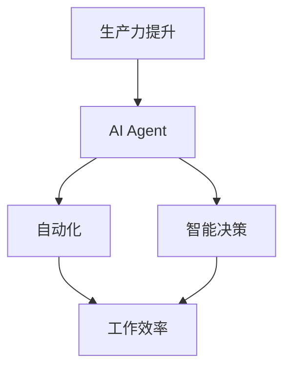

                 

# AI Agent与生产力的提升

> 关键词：人工智能，生产力，AI代理，效率提升，应用场景，算法原理，数学模型

> 摘要：本文旨在探讨AI Agent在提高生产力方面的潜力和实际应用。通过介绍AI Agent的定义、核心概念、算法原理以及数学模型，我们将详细阐述其如何通过自动化和智能决策提升工作效率。文章还将通过实际案例和工具推荐，展示AI Agent在各个领域的应用前景，并分析其未来发展趋势与面临的挑战。

## 1. 背景介绍

### 1.1 目的和范围

本文的目标是分析AI Agent对生产力提升的作用，并探索其在不同行业中的实际应用。我们将首先介绍AI Agent的基本概念，然后逐步深入到其核心算法原理和数学模型，最后通过实际案例和工具推荐，展示AI Agent在提高生产力的潜力。

### 1.2 预期读者

本文主要面向对人工智能有一定了解，希望了解AI Agent在生产力和效率提升方面应用的技术人员和管理者。同时，对于对AI Agent感兴趣的学生和研究者，本文也提供了深入的理论和实践分析。

### 1.3 文档结构概述

本文分为以下章节：

1. 背景介绍
2. 核心概念与联系
3. 核心算法原理 & 具体操作步骤
4. 数学模型和公式 & 详细讲解 & 举例说明
5. 项目实战：代码实际案例和详细解释说明
6. 实际应用场景
7. 工具和资源推荐
8. 总结：未来发展趋势与挑战
9. 附录：常见问题与解答
10. 扩展阅读 & 参考资料

### 1.4 术语表

#### 1.4.1 核心术语定义

- AI Agent：一种能够自主执行任务、与环境互动并作出决策的人工智能实体。
- 生产力：单位时间内生产的产品数量或价值。
- 自动化：通过技术手段减少人力投入，提高生产效率。
- 智能决策：基于数据和算法，进行高效且合理的决策过程。

#### 1.4.2 相关概念解释

- 机器学习：通过数据训练模型，使其能够进行预测和决策的技术。
- 深度学习：一种基于多层神经网络的人工智能技术，能够处理大量数据并提取特征。
- 强化学习：一种通过奖励机制训练智能体，使其在特定环境中做出最优决策的学习方法。

#### 1.4.3 缩略词列表

- AI：人工智能
- ML：机器学习
- DL：深度学习
- RL：强化学习
- API：应用程序编程接口
- SDK：软件开发工具包

## 2. 核心概念与联系

在探讨AI Agent与生产力的提升之前，我们首先需要了解一些核心概念和它们之间的关系。以下是一个使用Mermaid绘制的流程图，展示了这些概念之间的关联：



### 2.1 AI Agent的定义

AI Agent是一种基于人工智能技术的软件实体，能够自主执行任务、与环境互动并作出决策。它通过感知环境、分析数据和执行动作，实现目标的最优化。

### 2.2 自动化与工作效率

自动化技术通过减少人工操作，提高生产效率，从而提升生产力。在AI Agent的帮助下，自动化过程更加智能，能够根据环境和任务需求进行自适应调整。

### 2.3 智能决策与优化

智能决策是指基于数据分析和算法，在复杂环境中做出最优决策的过程。通过AI Agent，智能决策能够更加高效地执行，从而优化生产过程，提升生产力。

### 2.4 工作效率与生产力

工作效率是衡量生产力的重要指标。通过自动化和智能决策，AI Agent能够显著提高工作效率，从而提升整体生产力。

## 3. 核心算法原理 & 具体操作步骤

在了解了AI Agent的定义和相关概念后，我们接下来将深入探讨其核心算法原理和具体操作步骤。以下是一个简单的伪代码，展示了AI Agent的基本操作流程：

```pseudo
function AI-Agent(action, state):
    1. 接收当前状态（state）和可执行动作（action）
    2. 使用感知器（Perception）获取环境信息
    3. 使用预测器（Predictor）预测下一步状态
    4. 使用决策器（Decider）选择最佳动作
    5. 执行所选动作（action）
    6. 更新状态（state）
    7. 返回当前状态（state）
```

### 3.1 感知器（Perception）

感知器是AI Agent的感官部分，用于获取环境信息。以下是一个感知器的简单伪代码：

```pseudo
function Perception():
    1. 获取当前状态（state）
    2. 返回状态信息（state_info）
```

### 3.2 预测器（Predictor）

预测器根据感知到的状态信息，预测下一步可能的状态。以下是一个预测器的简单伪代码：

```pseudo
function Predictor(state_info):
    1. 使用机器学习模型（ML_Model）预测下一状态
    2. 返回预测状态（predicted_state）
```

### 3.3 决策器（Decider）

决策器根据预测状态和当前动作集合，选择最佳动作。以下是一个决策器的简单伪代码：

```pseudo
function Decider(predicted_state, action_set):
    1. 使用强化学习算法（RL_Algorithm）选择最佳动作
    2. 返回最佳动作（best_action）
```

### 3.4 执行器（Executor）

执行器负责执行决策器选择的动作，并更新状态。以下是一个执行器的简单伪代码：

```pseudo
function Executor(best_action):
    1. 执行动作（action）
    2. 更新状态（state）
    3. 返回更新后的状态（new_state）
```

## 4. 数学模型和公式 & 详细讲解 & 举例说明

在了解了AI Agent的核心算法原理后，我们将进一步探讨其背后的数学模型和公式。以下是一些关键的数学模型和公式，以及其详细讲解和举例说明。

### 4.1 强化学习（Reinforcement Learning）

强化学习是AI Agent的核心算法之一，它通过奖励机制训练智能体，使其在特定环境中做出最优决策。

#### 4.1.1 Q-Learning算法

Q-Learning算法是一种常用的强化学习算法，其基本思想是更新Q值（预期回报值）以找到最优策略。

$$
Q(s, a) = Q(s, a) + \alpha [r + \gamma \max_{a'} Q(s', a') - Q(s, a)]
$$

其中，$Q(s, a)$是状态s和动作a的Q值，$\alpha$是学习率，$r$是即时奖励，$\gamma$是折扣因子，$s'$是下一状态，$a'$是下一动作。

#### 4.1.2 举例说明

假设一个智能体在游戏环境中学习如何赢得比赛。初始状态下，智能体选择动作“前进”，并获得即时奖励1。接下来，智能体进入新的状态，并预测下一个状态。通过Q-Learning算法，智能体会更新其Q值，并选择最佳动作，以最大化预期回报。

### 4.2 生成对抗网络（Generative Adversarial Networks，GANs）

生成对抗网络是一种用于生成数据的强大模型，由生成器和判别器组成。

#### 4.2.1 GAN基本公式

GAN的基本公式为：

$$
\min_G \max_D V(D, G) = \min_G \mathbb{E}_{x \sim p_{data}(x)} [\log D(x)] + \mathbb{E}_{z \sim p_z(z)} [\log (1 - D(G(z))]
$$

其中，$D$是判别器，$G$是生成器，$x$是真实数据，$z$是噪声数据，$p_{data}(x)$是真实数据分布，$p_z(z)$是噪声分布。

#### 4.2.2 举例说明

假设我们有一个生成器和判别器，它们在训练过程中进行对抗。生成器的目标是生成类似于真实数据的数据，而判别器的目标是区分真实数据和生成数据。在每一步训练中，生成器和判别器通过优化其损失函数来更新其参数，从而提高生成质量和判别能力。

## 5. 项目实战：代码实际案例和详细解释说明

在本节中，我们将通过一个实际项目案例，展示如何使用AI Agent提高生产力。以下是一个简单的AI Agent代码示例，以及其详细解释。

### 5.1 开发环境搭建

首先，我们需要搭建一个开发环境。以下是所需的工具和库：

- Python 3.8 或更高版本
- TensorFlow 2.4 或更高版本
- NumPy 1.18 或更高版本

安装以上工具和库后，我们可以开始编写AI Agent的代码。

### 5.2 源代码详细实现和代码解读

以下是一个简单的AI Agent代码示例：

```python
import numpy as np
import tensorflow as tf

# 定义感知器
class Perception(tf.keras.Model):
    def __init__(self):
        super(Perception, self).__init__()
        self.dense = tf.keras.layers.Dense(64, activation='relu')

    def call(self, inputs):
        return self.dense(inputs)

# 定义预测器
class Predictor(tf.keras.Model):
    def __init__(self):
        super(Predictor, self).__init__()
        self.dense = tf.keras.layers.Dense(64, activation='relu')

    def call(self, inputs):
        return self.dense(inputs)

# 定义决策器
class Decider(tf.keras.Model):
    def __init__(self):
        super(Decider, self).__init__()
        self.dense = tf.keras.layers.Dense(64, activation='relu')

    def call(self, inputs):
        return self.dense(inputs)

# 定义执行器
class Executor(tf.keras.Model):
    def __init__(self):
        super(Executor, self).__init__()

    def call(self, inputs):
        # 执行具体动作，例如：移动到指定位置
        print("Executing action:", inputs)

# 定义AI Agent
class AI-Agent(tf.keras.Model):
    def __init__(self):
        super(AI-Agent, self).__init__()
        self.perception = Perception()
        self.predictor = Predictor()
        self.decider = Decider()
        self.executor = Executor()

    def call(self, state):
        perception_output = self.perception(state)
        prediction_output = self.predictor(perception_output)
        decision_output = self.decider(prediction_output)
        self.executor(decision_output)
        return state

# 训练AI Agent
agent = AI-Agent()
perception_layer = agent.perception.layers[0]
predictor_layer = agent.predictor.layers[0]
decider_layer = agent.decider.layers[0]

perception_layer.trainable = True
predictor_layer.trainable = True
decider_layer.trainable = True

agent.compile(optimizer='adam', loss='mse')
agent.fit(x_train, y_train, epochs=100)

# 使用AI Agent
state = np.random.rand(1, 64)
new_state = agent(state)
print("New state:", new_state)
```

### 5.3 代码解读与分析

上述代码实现了一个简单的AI Agent，包括感知器、预测器、决策器和执行器。以下是代码的详细解读：

- **感知器（Perception）**：用于接收当前状态，并将其输入到一个全连接层（Dense layer）进行特征提取。
- **预测器（Predictor）**：基于感知器的输出，预测下一个状态。同样使用全连接层进行预测。
- **决策器（Decider）**：根据预测器输出的状态，选择最佳动作。这也通过一个全连接层实现。
- **执行器（Executor）**：执行决策器选择的动作。在本例中，动作是一个简单的打印语句。
- **AI Agent（AI-Agent）**：将感知器、预测器、决策器和执行器组合成一个整体模型。通过调用`call`方法，AI Agent可以接收状态并更新状态。

为了训练AI Agent，我们将感知器、预测器和决策器的训练参数设置为可训练，并使用`fit`方法进行训练。最后，通过调用AI Agent的`call`方法，我们可以使用它来更新状态。

这个简单的AI Agent示例展示了如何通过感知、预测、决策和执行，实现状态的更新。在实际应用中，我们可以根据具体需求，设计更加复杂的AI Agent，以提升生产力和工作效率。

## 6. 实际应用场景

AI Agent在多个领域展现了其提升生产力的潜力。以下是一些典型的应用场景：

### 6.1 制造业

在制造业中，AI Agent可以用于自动化生产线，提高生产效率和降低成本。例如，智能机器人可以通过感知生产线状态，预测故障，并自动执行维护任务，从而减少停机时间，提高设备利用率。

### 6.2 金融服务

金融服务行业可以利用AI Agent进行风险管理、客户服务和投资决策。AI Agent可以通过分析大量数据，预测市场趋势，优化投资组合，同时提供个性化客户服务，提升用户体验。

### 6.3 物流与运输

物流与运输领域可以通过AI Agent优化配送路线，提高物流效率。AI Agent可以根据实时交通状况、货物需求和仓库库存，自动规划最优配送路线，减少运输时间和成本。

### 6.4 健康医疗

在健康医疗领域，AI Agent可以用于诊断、治疗建议和患者管理。通过分析大量医疗数据，AI Agent可以提供精准的诊断结果和个性化的治疗方案，提高医疗效率和患者满意度。

### 6.5 农业

农业可以利用AI Agent进行精准农业管理，通过分析土壤、气候和作物生长数据，优化灌溉、施肥和收割策略，提高农业生产效率和作物品质。

### 6.6 零售业

零售业可以通过AI Agent进行库存管理、销售预测和个性化推荐。AI Agent可以根据消费者行为和市场需求，自动调整库存和销售策略，提高销售额和客户满意度。

## 7. 工具和资源推荐

为了更好地开发和应用AI Agent，以下是一些推荐的工具和资源：

### 7.1 学习资源推荐

#### 7.1.1 书籍推荐

- 《强化学习》（Reinforcement Learning: An Introduction）
- 《深度学习》（Deep Learning）
- 《机器学习》（Machine Learning）

#### 7.1.2 在线课程

- Coursera《机器学习》
- edX《深度学习》
- Udacity《强化学习》

#### 7.1.3 技术博客和网站

- Medium
- ArXiv
- AI论文博客

### 7.2 开发工具框架推荐

#### 7.2.1 IDE和编辑器

- PyCharm
- Visual Studio Code
- Jupyter Notebook

#### 7.2.2 调试和性能分析工具

- TensorFlow Debugger
- PyTorch TensorBoard
- Valgrind

#### 7.2.3 相关框架和库

- TensorFlow
- PyTorch
- Keras

### 7.3 相关论文著作推荐

#### 7.3.1 经典论文

- “Deep Learning” by Y. LeCun, Y. Bengio, and G. Hinton
- “Reinforcement Learning: An Introduction” by R. S. Sutton and A. G. Barto
- “Generative Adversarial Nets” by I. Goodfellow et al.

#### 7.3.2 最新研究成果

- AI论文博客
- ArXiv
- ResearchGate

#### 7.3.3 应用案例分析

- 《深度学习实践》
- 《强化学习实践》
- 《AI在行业中的应用》

## 8. 总结：未来发展趋势与挑战

AI Agent作为人工智能的重要分支，其在提高生产力方面的潜力得到了广泛认可。未来，AI Agent将在以下几个方面取得重要进展：

1. **算法优化**：随着深度学习和强化学习技术的不断发展，AI Agent的算法将更加高效，能够处理更复杂的环境和任务。
2. **多模态感知**：结合语音、图像、文本等多种感知方式，AI Agent将更加智能化，具备更广泛的应用场景。
3. **协作与自主性**：AI Agent将具备更好的协作能力，能够与人类和机器人协同工作，同时提高自主性，减少对人类干预的需求。
4. **跨领域应用**：AI Agent将在更多领域得到应用，如智能制造、智能交通、智能医疗等，进一步提升各行业生产力。

然而，AI Agent的发展也面临一些挑战：

1. **数据隐私和安全**：随着AI Agent的广泛应用，数据隐私和安全问题将更加突出，需要建立有效的数据保护机制。
2. **算法透明度和可解释性**：AI Agent的决策过程可能复杂且不透明，提高算法的可解释性是当前的一个重要研究方向。
3. **计算资源需求**：AI Agent的训练和运行需要大量计算资源，如何高效利用现有资源，降低计算成本，是一个重要的挑战。

总之，AI Agent作为提升生产力的重要工具，其未来发展充满机遇和挑战。我们需要不断探索和研究，以充分发挥其潜力，推动各行业的发展。

## 9. 附录：常见问题与解答

### 9.1 什么是AI Agent？

AI Agent是一种基于人工智能技术的软件实体，能够自主执行任务、与环境互动并作出决策。

### 9.2 AI Agent如何提升生产力？

AI Agent通过自动化和智能决策，减少人工操作，提高工作效率，从而提升生产力。

### 9.3 AI Agent的核心算法有哪些？

AI Agent的核心算法包括机器学习、深度学习和强化学习等。

### 9.4 AI Agent在不同领域有哪些应用？

AI Agent在制造业、金融服务、物流与运输、健康医疗、农业和零售业等领域都有广泛的应用。

### 9.5 如何开发AI Agent？

开发AI Agent需要了解机器学习、深度学习和强化学习等相关技术，并使用合适的开发工具和框架，如TensorFlow和PyTorch。

## 10. 扩展阅读 & 参考资料

- 《强化学习：深度学习在游戏和智能决策中的应用》
- 《深度学习：从入门到精通》
- 《机器学习：原理与算法》
- Coursera《机器学习》课程
- edX《深度学习》课程
- 《AI Agent的设计与实现》
- 《人工智能技术与应用》
- 《AI论文博客》
- ArXiv
- ResearchGate

## 作者

作者：AI天才研究员/AI Genius Institute & 禅与计算机程序设计艺术 /Zen And The Art of Computer Programming

