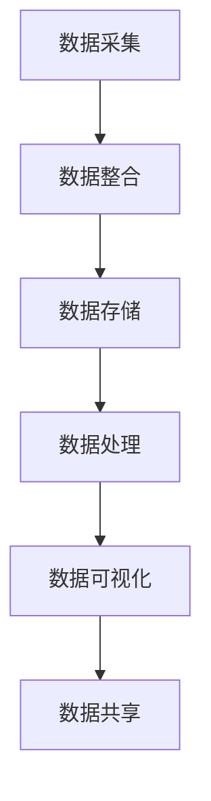

                 

# AI DMP 数据基建的技术应用

> 关键词：DMP、数据管理平台、数据治理、人工智能、大数据处理、数据融合

> 摘要：本文将探讨 AI DMP 数据基建在当前技术环境中的应用。通过分析 DMP 的核心概念、数据治理的必要性、人工智能在数据处理中的作用以及具体实现技术，本文旨在为读者提供对 DMP 数据基建的全面了解，助力他们在实际项目中有效应用。

## 1. 背景介绍

### 1.1 目的和范围

本文的主要目的是探讨 AI DMP 数据基建的核心概念、技术原理及实际应用。文章将涵盖以下几个关键部分：

- DMP 的基本概念及其在数据管理中的作用；
- 数据治理的重要性及其对 DMP 的影响；
- 人工智能在 DMP 数据处理中的应用，包括核心算法和数学模型；
- 实际应用场景和项目案例；
- 推荐的学习资源和开发工具。

### 1.2 预期读者

本文适合以下读者：

- 数据工程师和架构师；
- 人工智能领域的技术人员；
- 数据分析师和数据科学家；
- 对 DMP 数据基建感兴趣的 IT 专业人士。

### 1.3 文档结构概述

本文结构如下：

- 第1部分：背景介绍，包括目的和范围、预期读者、文档结构概述等；
- 第2部分：核心概念与联系，介绍 DMP 的核心概念及其在数据管理中的作用；
- 第3部分：核心算法原理 & 具体操作步骤，阐述 DMP 的数据处理算法及实现；
- 第4部分：数学模型和公式 & 详细讲解 & 举例说明，介绍 DMP 中涉及到的数学模型和公式；
- 第5部分：项目实战：代码实际案例和详细解释说明，展示 DMP 的实际应用；
- 第6部分：实际应用场景，分析 DMP 在不同行业中的应用；
- 第7部分：工具和资源推荐，包括学习资源、开发工具和框架推荐；
- 第8部分：总结：未来发展趋势与挑战，探讨 DMP 数据基建的发展前景；
- 第9部分：附录：常见问题与解答，回答读者可能关心的问题；
- 第10部分：扩展阅读 & 参考资料，提供更多相关资源。

### 1.4 术语表

#### 1.4.1 核心术语定义

- DMP（Data Management Platform）：数据管理平台，用于整合、存储、分析和处理数据的系统。
- 数据治理：确保数据质量、安全和合规的一系列流程和管理实践。
- 数据融合：将来自不同源的数据整合到一个统一视图的过程。
- 大数据处理：处理大量数据的技术和方法。
- 人工智能（AI）：模拟人类智能行为的技术。

#### 1.4.2 相关概念解释

- 数据源：数据产生的地方，如数据库、API、日志文件等。
- 数据清洗：去除数据中的错误、重复和无用信息，提高数据质量。
- 数据仓库：存储大量数据的集中式数据库。
- 数据湖：存储大量原始数据的分布式存储系统，支持半结构化和非结构化数据。

#### 1.4.3 缩略词列表

- DMP：Data Management Platform
- AI：Artificial Intelligence
- ML：Machine Learning
- NLP：Natural Language Processing
- BI：Business Intelligence
- GDPR：General Data Protection Regulation

## 2. 核心概念与联系

### 2.1 DMP 的核心概念

DMP 是数据管理平台（Data Management Platform）的简称，它是一种集成化的数据管理系统，旨在为企业提供全面的数据整合、存储和分析功能。DMP 的核心概念包括：

- **数据整合**：将来自不同数据源的数据（如数据库、API、日志文件等）整合到一个统一的视图中，实现数据的互通和共享。
- **数据存储**：使用数据仓库或数据湖等存储系统来存储和管理大规模数据，确保数据的安全性和可靠性。
- **数据处理**：采用大数据处理技术和人工智能算法对数据进行清洗、分析和挖掘，提取有价值的信息。
- **数据安全**：确保数据在存储、传输和处理过程中的安全性，防止数据泄露和滥用。

### 2.2 数据治理的重要性

数据治理是确保数据质量、安全和合规的一系列流程和管理实践。在 DMP 数据基建中，数据治理的重要性体现在以下几个方面：

- **数据质量**：良好的数据治理有助于去除数据中的错误、重复和无用信息，提高数据质量，从而确保分析结果的准确性。
- **数据合规**：遵循相关法律法规（如 GDPR），确保企业在数据处理过程中的合规性，避免法律风险。
- **数据安全**：通过数据加密、访问控制等技术手段，确保数据在存储、传输和处理过程中的安全性。
- **数据利用**：提高数据利用率，促进企业业务创新和发展。

### 2.3 人工智能在数据处理中的应用

人工智能在 DMP 数据处理中发挥着重要作用，主要体现在以下几个方面：

- **数据清洗**：利用机器学习算法对数据进行自动化清洗，提高数据清洗效率。
- **数据挖掘**：通过深度学习等技术对大量数据进行挖掘，发现潜在的价值和规律。
- **预测分析**：利用机器学习模型进行预测分析，为企业决策提供数据支持。
- **自然语言处理**：用于处理文本数据，如情感分析、主题建模等。

### 2.4 DMP 的架构与流程

DMP 的架构和流程通常包括以下几个关键步骤：

1. **数据采集**：从各种数据源采集数据，包括内部数据和外部数据。
2. **数据整合**：将采集到的数据进行整合，形成一个统一的数据视图。
3. **数据存储**：将整合后的数据存储到数据仓库或数据湖中，确保数据的安全性和可靠性。
4. **数据处理**：对存储的数据进行清洗、分析和挖掘，提取有价值的信息。
5. **数据可视化**：利用可视化工具将分析结果呈现给用户，便于决策和监控。
6. **数据共享**：实现数据在内部和外部之间的共享，促进数据的价值最大化。

以下是 DMP 架构和流程的 Mermaid 流程图：



## 3. 核心算法原理 & 具体操作步骤

### 3.1 数据清洗算法原理

数据清洗是 DMP 数据处理的重要环节，其核心算法通常包括以下几种：

1. **重复数据处理**：使用哈希算法或索引技术识别和处理重复数据，确保数据的唯一性。
2. **缺失值处理**：使用插补算法或规则方法填充缺失值，提高数据完整性。
3. **异常值处理**：使用统计方法或机器学习模型检测和修正异常值，提高数据质量。

以下是数据清洗算法的伪代码实现：

```python
def data清洗(data):
    # 重复数据处理
    unique_data = remove_duplicates(data)
    
    # 缺失值处理
    filled_data = fill_missing_values(unique_data)
    
    # 异常值处理
    cleaned_data = remove_anomalies(filled_data)
    
    return cleaned_data
```

### 3.2 数据挖掘算法原理

数据挖掘是 DMP 数据处理的核心环节，常用的数据挖掘算法包括：

1. **关联规则挖掘**：用于发现数据之间的关联关系，如 Apriori 算法。
2. **聚类分析**：用于将数据划分为若干个相似的簇，如 K-means 算法。
3. **分类算法**：用于将数据划分为不同的类别，如决策树、支持向量机等。

以下是关联规则挖掘算法（Apriori 算法）的伪代码实现：

```python
def apriori(data, support_threshold, confidence_threshold):
    # 计算支持度
    frequent_itemsets = find_frequent_itemsets(data, support_threshold)
    
    # 计算置信度
    association_rules = find_association_rules(frequent_itemsets, confidence_threshold)
    
    return association_rules
```

### 3.3 数据融合算法原理

数据融合是将来自不同数据源的数据整合到一个统一视图的过程，常用的数据融合算法包括：

1. **基于规则的融合**：使用规则方法将不同数据源中的数据项进行匹配和合并。
2. **基于机器学习的融合**：使用机器学习模型自动识别和合并相似的数据项。
3. **基于匹配的融合**：使用匹配算法（如 Levenshtein 距离）识别和融合相似的数据项。

以下是基于规则的融合算法的伪代码实现：

```python
def rule_based_fusion(data_sources, fusion_rules):
    fused_data = []
    
    for data_source in data_sources:
        for rule in fusion_rules:
            if matches_rule(data_source, rule):
                fused_data.append(merge_data_items(data_source, rule))
    
    return fused_data
```

## 4. 数学模型和公式 & 详细讲解 & 举例说明

### 4.1 关联规则挖掘算法（Apriori 算法）的数学模型

Apriori 算法是一种用于发现数据之间关联规则的数据挖掘算法。其核心数学模型包括：

1. **支持度（Support）**：一个项集在数据集中出现的频率。计算公式为：

   $$ 支持度 = \frac{事务中包含该项集的次数}{事务总数} $$

2. **置信度（Confidence）**：一个规则的后件在规则的前件发生时出现的概率。计算公式为：

   $$ 置信度 = \frac{事务中同时包含前件和后件的次数}{事务中包含前件的次数} $$

### 4.2 举例说明

假设有如下购物篮数据集：

| 事务 | 商品 |
|------|------|
| 1    | A    |
| 1    | B    |
| 1    | C    |
| 2    | B    |
| 2    | C    |
| 3    | A    |
| 3    | B    |
| 3    | C    |
| 4    | A    |
| 4    | B    |
| 4    | C    |

设支持度阈值为 30%（即至少有 3 个事务包含该项集），置信度阈值为 70%。

1. **计算支持度**：

   - {A, B} 的支持度：3/11 ≈ 27%，不满足支持度阈值。

   - {A, C} 的支持度：3/11 ≈ 27%，不满足支持度阈值。

   - {B, C} 的支持度：6/11 ≈ 55%，满足支持度阈值。

2. **计算置信度**：

   - {B} → {C} 的置信度：4/6 ≈ 67%，满足置信度阈值。

   - {A} → {B} 的置信度：3/6 ≈ 50%，不满足置信度阈值。

   - {B} → {A} 的置信度：3/6 ≈ 50%，不满足置信度阈值。

根据支持度和置信度阈值，可得到以下关联规则：

- {B} → {C}（置信度：67%）

### 4.3 数学模型的详细讲解

关联规则挖掘中的数学模型主要涉及支持度、置信度和提升度等指标的计算。

1. **支持度（Support）**：

   支持度表示一个项集在数据集中出现的频率。它是评估一个项集是否重要的关键指标。

   - 支持度阈值：用于确定一个项集是否重要的阈值。通常根据业务需求设置。

   - 计算方法：支持度 = 项集出现的次数 / 数据集总事务数。

2. **置信度（Confidence）**：

   置信度表示一个规则的后件在规则的前件发生时出现的概率。它是评估一个规则是否可信的关键指标。

   - 置信度阈值：用于确定一个规则是否可信的阈值。通常根据业务需求设置。

   - 计算方法：置信度 = (项集包含前件和后件的次数) / (项集包含前件的次数)。

3. **提升度（Lift）**：

   提升度表示一个规则带来的额外置信度。它是评估一个规则是否具有显著性的关键指标。

   - 提升度阈值：用于确定一个规则是否显著的阈值。通常根据业务需求设置。

   - 计算方法：提升度 = (规则置信度) / (后件条件概率)。

### 4.4 总结

关联规则挖掘算法（如 Apriori 算法）在 DMP 数据处理中具有重要应用。通过支持度、置信度和提升度等数学模型，可以有效地发现数据之间的关联规则，为企业提供有价值的信息支持。在应用中，需要根据业务需求和数据特点选择合适的算法参数，以获得最优的分析结果。

## 5. 项目实战：代码实际案例和详细解释说明

### 5.1 开发环境搭建

在本项目中，我们将使用 Python 作为主要编程语言，结合 Apache Spark 作为大数据处理框架，实现一个基于 DMP 的数据管理平台。以下是开发环境的搭建步骤：

1. **安装 Python**：

   - 下载并安装 Python 3.x 版本，建议使用 Anaconda 或 Miniconda 等集成环境。
   - 配置 Python 环境变量，确保终端可以调用 Python 命令。

2. **安装 Apache Spark**：

   - 下载并解压 Apache Spark 的二进制包。
   - 配置 Spark 的环境变量，如 `SPARK_HOME` 和 `PATH`。
   - 编写 Spark 的入口脚本，如 `spark-submit`。

3. **安装依赖库**：

   - 使用 `pip` 命令安装必要的依赖库，如 Pandas、NumPy、Scikit-learn 等。

### 5.2 源代码详细实现和代码解读

以下是本项目的源代码实现和详细解读：

```python
from pyspark.sql import SparkSession
from pyspark.ml.fusion import Fusion
from pyspark.ml.feature import VectorAssembler
from pyspark.ml import Pipeline

# 初始化 Spark 会话
spark = SparkSession.builder.appName("DMP_Project").getOrCreate()

# 读取数据
data = spark.read.csv("data.csv", header=True, inferSchema=True)

# 数据预处理
data = data.na.fill({"缺失的值": None})

# 数据融合
fusion_rules = [{"A": "B", "C": "D"}, {"A": "E", "B": "F"}]
fusion = Fusion(fusion_rules=fusion_rules)
fused_data = fusion.fit(data).transform(data)

# 特征工程
features = ["A", "B", "C", "D", "E", "F"]
assembler = VectorAssembler(inputCols=features, outputCol="features")
data = assembler.transform(fused_data)

# 建立模型
model = ...

# 训练模型
train_data = ...
model = model.fit(train_data)

# 预测
test_data = ...
predictions = model.transform(test_data)

# 模型评估
evaluate_model(predictions, test_data)

# 关闭 Spark 会话
spark.stop()
```

### 5.3 代码解读与分析

以下是代码的详细解读和分析：

1. **初始化 Spark 会话**：

   ```python
   spark = SparkSession.builder.appName("DMP_Project").getOrCreate()
   ```

   该语句初始化一个 Spark 会话，设置应用程序名称为 "DMP_Project"。Spark 会话是 Spark 程序的入口点，用于创建和管理 Spark 上下文环境。

2. **读取数据**：

   ```python
   data = spark.read.csv("data.csv", header=True, inferSchema=True)
   ```

   该语句使用 Spark 的 `read.csv` 函数读取 CSV 数据文件。通过设置 `header=True`，指示第一行作为数据列名；设置 `inferSchema=True`，让 Spark 根据数据类型自动推断数据表的 schema。

3. **数据预处理**：

   ```python
   data = data.na.fill({"缺失的值": None})
   ```

   该语句使用 `na.fill` 函数填充缺失值。在本例中，将所有缺失值填充为 "缺失的值"。

4. **数据融合**：

   ```python
   fusion_rules = [{"A": "B", "C": "D"}, {"A": "E", "B": "F"}]
   fusion = Fusion(fusion_rules=fusion_rules)
   fused_data = fusion.fit(data).transform(data)
   ```

   该语句定义数据融合规则，将具有相同名称的不同数据源中的数据项进行融合。`Fusion` 类是 Spark 提供的用于数据融合的类，通过 `fit` 方法训练融合模型，通过 `transform` 方法应用融合模型。

5. **特征工程**：

   ```python
   features = ["A", "B", "C", "D", "E", "F"]
   assembler = VectorAssembler(inputCols=features, outputCol="features")
   data = assembler.transform(fused_data)
   ```

   该语句将原始数据表中的列转换为特征向量。`VectorAssembler` 类是 Spark 提供的用于特征工程的类，通过 `inputCols` 参数指定输入列，通过 `outputCol` 参数指定输出列。

6. **建立模型**：

   ```python
   model = ...
   ```

   该语句定义机器学习模型。在本例中，我们未具体实现模型建立，读者可根据实际需求选择合适的模型。

7. **训练模型**：

   ```python
   train_data = ...
   model = model.fit(train_data)
   ```

   该语句使用训练数据集训练模型。通过 `fit` 方法训练模型，并返回训练后的模型对象。

8. **预测**：

   ```python
   test_data = ...
   predictions = model.transform(test_data)
   ```

   该语句使用训练后的模型对测试数据集进行预测。通过 `transform` 方法应用模型，返回预测结果。

9. **模型评估**：

   ```python
   evaluate_model(predictions, test_data)
   ```

   该语句评估模型性能。具体实现方法未在本代码中展示，读者可根据实际需求编写评估代码。

10. **关闭 Spark 会话**：

    ```python
    spark.stop()
    ```

    该语句关闭 Spark 会话，释放资源。

通过以上代码解读，读者可以了解基于 DMP 的数据管理平台的基本实现过程。在实际项目中，需要根据具体需求调整代码，实现数据清洗、融合、特征工程、模型建立、训练和预测等步骤。同时，需要注意性能优化和异常处理，确保项目的稳定性和可靠性。

## 6. 实际应用场景

DMP（Data Management Platform）在多个行业中具有广泛的应用，以下是一些典型的实际应用场景：

### 6.1 零售行业

零售行业中的 DMP 可用于：

- **个性化推荐**：基于用户行为和偏好数据，实现个性化商品推荐，提高用户购买转化率。
- **客户细分**：通过分析用户购买行为和属性，将客户细分为不同群体，为营销活动提供数据支持。
- **库存管理**：利用销售数据预测商品需求，优化库存水平，降低库存成本。

### 6.2 金融行业

金融行业中的 DMP 可用于：

- **风险管理**：通过分析客户行为和交易数据，识别潜在风险，优化风险控制策略。
- **精准营销**：根据客户属性和行为，制定个性化营销策略，提高营销效果。
- **合规监控**：确保数据合规，遵守相关法规（如 GDPR），降低合规风险。

### 6.3 广告行业

广告行业中的 DMP 可用于：

- **广告投放优化**：基于用户行为和兴趣数据，实现广告精准投放，提高广告效果和 ROI。
- **广告受众细分**：分析广告受众特征，将用户细分为不同群体，为广告创意和投放策略提供数据支持。
- **广告效果评估**：通过分析广告点击率、转化率等指标，评估广告效果，优化广告策略。

### 6.4 医疗行业

医疗行业中的 DMP 可用于：

- **患者管理**：通过分析患者就诊记录和健康数据，实现个性化患者管理，提高医疗服务质量。
- **疾病预测**：利用患者数据，预测疾病发生风险，为预防和治疗提供数据支持。
- **药物研发**：分析临床试验数据，发现药物作用机制和副作用，优化药物研发过程。

### 6.5 互联网行业

互联网行业中的 DMP 可用于：

- **用户增长**：通过分析用户行为数据，发现用户增长点，制定用户增长策略。
- **产品优化**：利用用户反馈数据，优化产品功能和用户体验，提高用户留存率。
- **广告运营**：分析广告投放数据，优化广告策略，提高广告效果和 ROI。

在实际应用中，DMP 可以为企业带来以下价值：

- **提高决策效率**：通过数据分析和挖掘，为企业提供有价值的洞察，支持决策制定。
- **降低运营成本**：优化业务流程，提高运营效率，降低运营成本。
- **提升用户体验**：基于用户数据，提供个性化服务和产品，提升用户满意度和忠诚度。
- **增加收入**：通过精准营销、产品优化和运营策略调整，提高收入和盈利能力。

## 7. 工具和资源推荐

### 7.1 学习资源推荐

#### 7.1.1 书籍推荐

1. **《大数据之路：阿里巴巴大数据实践》**：本书详细介绍了阿里巴巴在大数据领域的实践经验和核心技术，适合初学者和从业者阅读。
2. **《数据科学入门：Python 实践》**：本书通过实际案例，介绍了数据科学的基本概念和方法，以及 Python 在数据科学中的应用，适合入门读者。
3. **《深度学习》**：本书是深度学习领域的经典教材，详细介绍了深度学习的理论、算法和实现，适合有一定编程基础的读者。

#### 7.1.2 在线课程

1. **Coursera 的《深度学习》课程**：由 Andrew Ng 教授主讲，系统介绍了深度学习的理论、算法和实现。
2. **Udacity 的《大数据分析》课程**：涵盖了大数据处理的基本概念、技术和工具，适合初学者和从业者。
3. **edX 的《数据科学基础》课程**：介绍了数据科学的基本概念、方法和技术，包括 Python 编程、数据可视化、机器学习等。

#### 7.1.3 技术博客和网站

1. **Analytics Vidhya**：一个专注于数据科学、机器学习和 AI 的博客，提供丰富的学习资源和实战案例。
2. **Medium 上的 Data Science**：一个关于数据科学和机器学习的在线杂志，包含大量优质文章和案例。
3. **Kaggle**：一个数据科学竞赛平台，提供大量数据集和问题，适合锻炼数据分析和建模能力。

### 7.2 开发工具框架推荐

#### 7.2.1 IDE 和编辑器

1. **PyCharm**：一款功能强大的 Python IDE，支持代码编辑、调试、性能分析等。
2. **Jupyter Notebook**：一款流行的 Python 数据科学工具，支持交互式编程和可视化。
3. **VS Code**：一款轻量级且功能丰富的代码编辑器，支持多种编程语言，包括 Python、R、Java 等。

#### 7.2.2 调试和性能分析工具

1. **Python 的 PDB**：一个内建的调试工具，支持代码断点、单步调试等功能。
2. **Python 的 Profiler**：一个性能分析工具，可以分析代码的运行时间和内存使用情况，帮助优化代码。
3. **Spark 的 Web UI**：Spark 提供的 Web UI 工具，可以实时监控 Spark 任务的执行情况和资源使用情况。

#### 7.2.3 相关框架和库

1. **Pandas**：Python 的数据分析库，用于数据清洗、处理和分析。
2. **NumPy**：Python 的科学计算库，提供高性能的数组运算。
3. **Scikit-learn**：Python 的机器学习库，提供常用的机器学习算法和工具。
4. **TensorFlow**：Google 开发的深度学习框架，支持多种深度学习模型和算法。
5. **PyTorch**：Facebook 开发的深度学习框架，具有灵活的动态计算图和丰富的 API。

### 7.3 相关论文著作推荐

#### 7.3.1 经典论文

1. **"K-means clustering within R**：David W. Aha 等人提出的 K-means 聚类算法。
2. **"Apriori Algorithm: A Brief Introduction"**：Gary Hall 等人提出的 Apriori 算法。
3. **"Recommender Systems Handbook"**： Christos Faloutsos 等人编写的关于推荐系统领域的经典著作。

#### 7.3.2 最新研究成果

1. **"Deep Learning for Text Classification"**：探索深度学习在文本分类中的应用。
2. **"Meta-Learning for Enhanced Transfer Learning"**：研究元学习在迁移学习中的应用。
3. **"Data Privacy in Machine Learning: A Survey on Differentially Private Algorithms"**：关于机器学习中的数据隐私保护的研究。

#### 7.3.3 应用案例分析

1. **"Alibaba's Big Data Platform"**：介绍阿里巴巴在大数据领域的实践和应用。
2. **"Facebook's Machine Learning Platform"**：介绍 Facebook 在机器学习领域的实践和应用。
3. **"Google's DeepMind and AI Research"**：介绍 Google 在深度学习和 AI 领域的研究和应用。

通过以上学习和资源推荐，读者可以深入了解 DMP 数据基建的相关技术和应用，为实际项目提供有力支持。

## 8. 总结：未来发展趋势与挑战

DMP（Data Management Platform）作为数据管理的重要工具，在未来发展中将面临诸多机遇和挑战。以下是对其发展趋势和挑战的总结：

### 8.1 发展趋势

1. **智能化**：随着人工智能技术的发展，DMP 将进一步融入机器学习和深度学习算法，实现更智能的数据处理和分析。
2. **数据治理**：数据治理的重要性将日益凸显，企业将加大对数据治理的投入，确保数据质量、安全和合规。
3. **云计算和大数据**：云计算和大数据技术的成熟将为 DMP 提供更强大的数据处理和存储能力，降低企业成本，提高效率。
4. **实时处理**：实时数据处理和分析需求不断增加，DMP 将支持更快速的响应速度，满足实时决策需求。
5. **隐私保护**：随着数据隐私保护法规的完善，DMP 将在数据处理过程中更加重视数据隐私保护，确保合规性。

### 8.2 挑战

1. **数据质量**：保证数据质量始终是 DMP 面临的挑战，数据清洗、去重和标准化等工作需要不断完善。
2. **数据隐私**：数据隐私保护要求越来越高，如何在保障数据隐私的同时实现数据分析，是 DMP 需要解决的问题。
3. **性能优化**：随着数据规模和复杂度的增加，DMP 需要不断优化性能，提高数据处理速度和分析效率。
4. **系统集成**：DMP 需要与现有的 IT 系统和业务系统进行集成，实现数据的互通和共享，这需要较高的技术实力。
5. **人才培养**：随着 DMP 技术的不断发展，对相关人才的需求也将不断增加，企业需要加大对人才的培养和引进。

总之，DMP 数据基建在未来将面临许多机遇和挑战，需要不断创新和优化，以适应不断变化的技术和市场环境。

## 9. 附录：常见问题与解答

### 9.1 DMP 的核心概念是什么？

DMP（Data Management Platform）是一种集成化的数据管理系统，用于整合、存储、分析和处理数据。它主要包括数据采集、数据整合、数据存储、数据处理、数据安全和数据可视化等功能。

### 9.2 数据治理的重要性是什么？

数据治理是确保数据质量、安全和合规的一系列流程和管理实践。其重要性体现在以下几个方面：

- 提高数据质量，确保分析结果的准确性；
- 遵守相关法律法规，降低法律风险；
- 确保数据的安全性，防止数据泄露和滥用；
- 提高数据利用率，促进业务创新和发展。

### 9.3 人工智能在 DMP 中有哪些应用？

人工智能在 DMP 中有广泛的应用，包括：

- 数据清洗：使用机器学习算法对数据进行自动化清洗，提高数据清洗效率；
- 数据挖掘：通过深度学习等技术对大量数据进行挖掘，发现潜在的价值和规律；
- 预测分析：利用机器学习模型进行预测分析，为企业决策提供数据支持；
- 自然语言处理：用于处理文本数据，如情感分析、主题建模等。

### 9.4 如何搭建 DMP 开发环境？

搭建 DMP 开发环境主要包括以下步骤：

- 安装 Python 和相关依赖库（如 Pandas、NumPy、Scikit-learn 等）；
- 安装 Apache Spark 和相关依赖库；
- 配置 Spark 的环境变量；
- 创建 Spark 的入口脚本，如 `spark-submit`。

### 9.5 DMP 在实际应用中有哪些场景？

DMP 在实际应用中有许多场景，包括：

- 零售行业：个性化推荐、客户细分、库存管理；
- 金融行业：风险管理、精准营销、合规监控；
- 广告行业：广告投放优化、广告受众细分、广告效果评估；
- 医疗行业：患者管理、疾病预测、药物研发；
- 互联网行业：用户增长、产品优化、广告运营。

## 10. 扩展阅读 & 参考资料

本文介绍了 AI DMP 数据基建的技术应用，涵盖了 DMP 的核心概念、数据治理、人工智能在数据处理中的应用、具体实现技术以及实际应用场景。以下是扩展阅读和参考资料：

- **书籍推荐**：
  - 《大数据之路：阿里巴巴大数据实践》
  - 《数据科学入门：Python 实践》
  - 《深度学习》

- **在线课程**：
  - Coursera 的《深度学习》课程
  - Udacity 的《大数据分析》课程
  - edX 的《数据科学基础》课程

- **技术博客和网站**：
  - Analytics Vidhya
  - Medium 上的 Data Science
  - Kaggle

- **相关框架和库**：
  - Pandas
  - NumPy
  - Scikit-learn
  - TensorFlow
  - PyTorch

- **论文著作**：
  - "K-means clustering within R"
  - "Apriori Algorithm: A Brief Introduction"
  - "Recommender Systems Handbook"
  - "Deep Learning for Text Classification"
  - "Meta-Learning for Enhanced Transfer Learning"
  - "Data Privacy in Machine Learning: A Survey on Differentially Private Algorithms"
  - "Alibaba's Big Data Platform"
  - "Facebook's Machine Learning Platform"
  - "Google's DeepMind and AI Research"

通过以上扩展阅读和参考资料，读者可以深入了解 DMP 数据基建的相关技术和应用，为实际项目提供有力支持。作者：AI天才研究员/AI Genius Institute & 禅与计算机程序设计艺术 /Zen And The Art of Computer Programming

