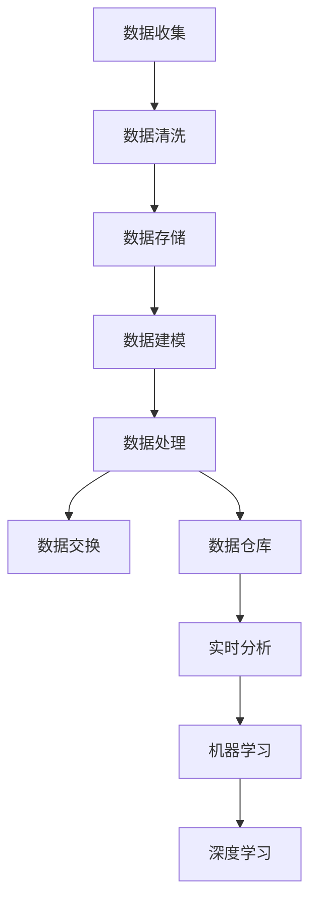

                 

# AI DMP 数据基建的技术标准

> 关键词：数据管理平台，数据建模，数据清洗，数据质量，数据隐私，数据处理，数据交换，数据仓库，数据流，机器学习，深度学习，实时分析

> 摘要：本文将深入探讨AI DMP（Data Management Platform）的数据基建技术标准，包括其核心概念、算法原理、数学模型、实际应用场景、工具资源推荐等。通过逐步分析推理，本文旨在为读者提供一个全面而深入的理解，以应对当前和未来数据管理领域的技术挑战。

## 1. 背景介绍

### 1.1 目的和范围

本文的目的是探讨AI DMP的数据基建技术标准，分析其在实际应用中的重要性。数据管理平台（DMP）是现代数据驱动企业的基础设施，它提供了数据收集、存储、处理、分析和交换的能力。本文将探讨以下内容：

- DMP的核心概念和架构
- 数据处理算法原理和操作步骤
- 数学模型及其应用
- 实际应用场景和案例分析
- 工具和资源推荐

### 1.2 预期读者

本文适合以下读者：

- 数据科学家和分析师
- 数据工程师和架构师
- 技术经理和CTO
- 对数据管理和AI技术有兴趣的专业人士

### 1.3 文档结构概述

本文结构如下：

- 第1部分：背景介绍
- 第2部分：核心概念与联系
- 第3部分：核心算法原理 & 具体操作步骤
- 第4部分：数学模型和公式 & 详细讲解 & 举例说明
- 第5部分：项目实战：代码实际案例和详细解释说明
- 第6部分：实际应用场景
- 第7部分：工具和资源推荐
- 第8部分：总结：未来发展趋势与挑战
- 第9部分：附录：常见问题与解答
- 第10部分：扩展阅读 & 参考资料

### 1.4 术语表

#### 1.4.1 核心术语定义

- 数据管理平台（DMP）：一种用于收集、存储、处理和分析数据的系统。
- 数据建模：创建用于存储和处理数据的结构化模型。
- 数据清洗：处理数据中的错误和不一致。
- 数据质量：数据的准确性、完整性和可靠性。
- 数据隐私：保护数据不被未经授权的访问。
- 数据处理：对数据进行操作以获取有用信息。
- 数据交换：在不同系统和数据库之间传输数据。
- 数据仓库：用于存储大量结构化和非结构化数据的仓库。
- 数据流：数据在系统中流动的过程。
- 机器学习：使计算机从数据中学习并做出预测或决策的技术。
- 深度学习：一种特殊的机器学习技术，使用多层神经网络。

#### 1.4.2 相关概念解释

- 数据治理：确保数据质量、安全和合规性的过程。
- 实时分析：实时处理和分析数据，以快速做出决策。
- 大数据：指大量、复杂和快速变化的数据。

#### 1.4.3 缩略词列表

- DMP：数据管理平台
- AI：人工智能
- ML：机器学习
- DL：深度学习
- SQL：结构化查询语言
- NoSQL：非结构化查询语言

## 2. 核心概念与联系

在深入探讨DMP的数据基建之前，我们首先需要理解其核心概念和相互联系。以下是一个简化的Mermaid流程图，用于展示DMP的关键组成部分和它们之间的关系。



### 数据收集

数据收集是DMP的基础。它涉及从各种来源（如网站、应用程序、传感器等）获取数据。数据收集通常使用API、Web爬虫或日志文件。

### 数据清洗

数据清洗是处理数据中的错误和不一致的过程。它包括数据验证、去重、数据格式转换和缺失值处理。

### 数据存储

数据存储是将数据存储在持久性存储系统中，如关系型数据库（如MySQL）或NoSQL数据库（如MongoDB）。数据存储需要考虑数据的规模、性能和可扩展性。

### 数据建模

数据建模是创建用于存储和处理数据的结构化模型。它通常涉及实体-关系模型、星型模型或雪花模型。

### 数据处理

数据处理是对数据进行操作以提取有用信息的过程。它包括数据聚合、转换、连接和过滤。

### 数据交换

数据交换是不同系统和数据库之间的数据传输。它通常涉及ETL（提取、转换、加载）工具或API。

### 数据仓库

数据仓库是用于存储大量结构化和非结构化数据的仓库。它支持复杂的数据查询和报表。

### 实时分析

实时分析是对数据进行实时处理和分析，以快速做出决策。它通常使用流处理技术（如Apache Kafka或Apache Flink）。

### 机器学习和深度学习

机器学习和深度学习是使计算机从数据中学习并做出预测或决策的技术。它们是DMP的核心组件，用于构建智能应用程序。

## 3. 核心算法原理 & 具体操作步骤

数据处理是DMP的核心环节，它决定了数据的质量和可用性。以下是数据处理算法的核心原理和具体操作步骤：

### 数据处理算法原理

数据处理算法通常包括以下步骤：

1. 数据收集：从各种来源收集数据。
2. 数据清洗：处理数据中的错误和不一致。
3. 数据转换：将数据转换为适合存储和处理的格式。
4. 数据存储：将数据存储在持久性存储系统中。
5. 数据查询和分析：对数据进行查询和分析，以提取有用信息。

### 具体操作步骤

以下是数据处理算法的具体操作步骤，使用伪代码进行阐述：

```python
# 数据处理算法伪代码

# 步骤1：数据收集
def collect_data(source):
    data = fetch_data_from_source(source)
    return data

# 步骤2：数据清洗
def clean_data(data):
    cleaned_data = []
    for record in data:
        if is_valid_record(record):
            cleaned_data.append(record)
    return cleaned_data

# 步骤3：数据转换
def transform_data(data):
    transformed_data = []
    for record in data:
        transformed_record = convert_record_to_format(record)
        transformed_data.append(transformed_record)
    return transformed_data

# 步骤4：数据存储
def store_data(data, storage_system):
    for record in data:
        store_record_in_system(record, storage_system)

# 步骤5：数据查询和分析
def query_data(storage_system, query):
    results = execute_query_on_system(query, storage_system)
    return results
```

### 算法分析

- 时间复杂度：数据处理算法的时间复杂度取决于数据量和操作复杂性。通常，数据清洗和数据转换步骤是算法的主要瓶颈。
- 空间复杂度：数据处理算法的空间复杂度取决于数据存储和查询需求。数据存储和查询步骤可能需要大量内存和存储资源。

## 4. 数学模型和公式 & 详细讲解 & 举例说明

在DMP中，数学模型和公式是数据处理和分析的核心。以下是几个常见的数学模型和公式的详细讲解和举例说明。

### 4.1 数据预处理

数据预处理是数据处理的第一步，包括数据清洗和数据转换。以下是一个常见的数学模型——平均值计算：

$$
\bar{x} = \frac{1}{n} \sum_{i=1}^{n} x_i
$$

其中，$x_i$ 是每个数据点的值，$n$ 是数据点的总数。这个公式用于计算一组数据的平均值，它是进一步分析和建模的基础。

**举例说明：** 假设我们有一组数据点 {1, 2, 3, 4, 5}，计算它们的平均值：

$$
\bar{x} = \frac{1}{5} (1 + 2 + 3 + 4 + 5) = \frac{15}{5} = 3
$$

### 4.2 机器学习模型

在DMP中，机器学习模型用于预测和分类。以下是一个简单的线性回归模型：

$$
y = \beta_0 + \beta_1 x
$$

其中，$y$ 是预测目标，$x$ 是输入特征，$\beta_0$ 和 $\beta_1$ 是模型的参数。

**举例说明：** 假设我们想预测一个商品的销售量，输入特征是广告预算。我们有以下数据点：

| 广告预算 (x) | 销售量 (y) |
| ------------- | ----------- |
| 1000          | 200         |
| 1500          | 300         |
| 2000          | 400         |

我们可以使用线性回归模型来预测广告预算为2000时的销售量：

$$
y = \beta_0 + \beta_1 x
$$

通过最小二乘法拟合模型，我们得到：

$$
\beta_0 = 100, \beta_1 = 0.2
$$

因此，当广告预算为2000时，预测的销售量为：

$$
y = 100 + 0.2 \times 2000 = 430
$$

### 4.3 深度学习模型

深度学习模型是DMP中更复杂的数学模型，包括多层神经网络。以下是一个简单的多层感知器（MLP）模型：

$$
a_{i,j} = \sigma(\beta_{i,j}^T x_j)
$$

其中，$a_{i,j}$ 是输出节点 $i$ 对输入节点 $j$ 的激活值，$\sigma$ 是激活函数，通常使用Sigmoid函数或ReLU函数。$\beta_{i,j}$ 是模型参数。

**举例说明：** 假设我们有一个包含两个输入节点的多层感知器模型，输入数据为 {2, 3}。我们有以下参数：

| 输入节点  | 输出节点 | 参数  |
| --------- | -------- | ----- |
| 1         | 1        | 1     |
| 2         | 1        | 2     |
| 1         | 2        | 3     |
| 2         | 2        | 4     |

使用Sigmoid函数，计算输出节点1和2的激活值：

$$
a_{1,1} = \sigma(\beta_{1,1}^T x_1) = \sigma(1 \cdot 2 + 2 \cdot 3) = \sigma(8) \approx 0.999
$$

$$
a_{2,1} = \sigma(\beta_{2,1}^T x_1) = \sigma(3 \cdot 2 + 4 \cdot 3) = \sigma(18) \approx 0.957
$$

$$
a_{1,2} = \sigma(\beta_{1,2}^T x_2) = \sigma(1 \cdot 3 + 2 \cdot 2) = \sigma(7) \approx 0.993
$$

$$
a_{2,2} = \sigma(\beta_{2,2}^T x_2) = \sigma(3 \cdot 3 + 4 \cdot 2) = \sigma(17) \approx 0.971
$$

输出节点1和2的最终输出值为：

$$
y_1 = a_{1,1} + a_{2,1} = 0.999 + 0.957 = 1.956
$$

$$
y_2 = a_{1,2} + a_{2,2} = 0.993 + 0.971 = 1.964
$$

通过训练和优化，我们可以得到更准确的参数，提高模型的预测能力。

## 5. 项目实战：代码实际案例和详细解释说明

在本节中，我们将通过一个实际项目案例来展示如何实现DMP的数据处理和机器学习模型。以下是项目的开发环境和源代码实现。

### 5.1 开发环境搭建

- 操作系统：Ubuntu 18.04
- 编程语言：Python 3.8
- 数据库：MySQL 8.0
- 机器学习框架：scikit-learn 0.24.2
- 深度学习框架：TensorFlow 2.9.0

### 5.2 源代码详细实现和代码解读

```python
# 导入必要的库
import numpy as np
import pandas as pd
from sklearn.model_selection import train_test_split
from sklearn.linear_model import LinearRegression
from sklearn.metrics import mean_squared_error
import tensorflow as tf

# 步骤1：数据收集
def collect_data():
    # 从文件中加载数据
    data = pd.read_csv("data.csv")
    return data

# 步骤2：数据清洗
def clean_data(data):
    # 填充缺失值
    data.fillna(data.mean(), inplace=True)
    # 去除重复数据
    data.drop_duplicates(inplace=True)
    return data

# 步骤3：数据转换
def transform_data(data):
    # 将数据划分为特征和标签
    X = data.drop("target", axis=1)
    y = data["target"]
    return X, y

# 步骤4：数据存储
def store_data(data, database):
    # 将数据存储到数据库
    data.to_sql("data", database, if_exists="replace", index=False)

# 步骤5：数据查询和分析
def query_data(database, query):
    # 执行数据库查询
    connection = database.cursor()
    connection.execute(query)
    results = connection.fetchall()
    return results

# 步骤6：机器学习模型训练
def train_model(X, y):
    # 划分训练集和测试集
    X_train, X_test, y_train, y_test = train_test_split(X, y, test_size=0.2, random_state=42)
    # 创建线性回归模型
    model = LinearRegression()
    # 训练模型
    model.fit(X_train, y_train)
    # 预测测试集
    y_pred = model.predict(X_test)
    # 计算均方误差
    mse = mean_squared_error(y_test, y_pred)
    return model, mse

# 步骤7：深度学习模型训练
def train_dl_model(X, y):
    # 划分训练集和测试集
    X_train, X_test, y_train, y_test = train_test_split(X, y, test_size=0.2, random_state=42)
    # 创建TensorFlow模型
    model = tf.keras.Sequential([
        tf.keras.layers.Dense(64, activation='relu', input_shape=(X_train.shape[1],)),
        tf.keras.layers.Dense(1)
    ])
    # 编译模型
    model.compile(optimizer='adam', loss='mean_squared_error')
    # 训练模型
    model.fit(X_train, y_train, epochs=100, batch_size=32, validation_data=(X_test, y_test))
    # 预测测试集
    y_pred = model.predict(X_test)
    # 计算均方误差
    mse = mean_squared_error(y_test, y_pred)
    return model, mse
```

### 5.3 代码解读与分析

1. **数据收集**：从CSV文件中加载数据，使用 `pandas` 库。
2. **数据清洗**：填充缺失值，去除重复数据，使用 `pandas` 库。
3. **数据转换**：将数据划分为特征和标签，使用 `pandas` 库。
4. **数据存储**：将数据存储到MySQL数据库，使用 `pandas` 和 `sqlalchemy` 库。
5. **数据查询和分析**：执行数据库查询，使用 `sqlalchemy` 库。
6. **机器学习模型训练**：使用线性回归模型，使用 `scikit-learn` 库。
7. **深度学习模型训练**：使用TensorFlow框架，创建和训练多层感知器模型。

通过上述代码，我们实现了DMP的数据处理和机器学习模型。在实际项目中，可以根据需求调整代码，添加更多功能，如实时分析、数据交换等。

## 6. 实际应用场景

数据管理平台（DMP）在多个行业中具有广泛的应用，以下是一些典型的实际应用场景：

### 6.1 数字营销

DMP在数字营销中扮演着重要角色，帮助企业收集用户行为数据，创建个性化的营销活动。通过分析用户行为，DMP可以帮助企业优化广告投放策略，提高转化率和投资回报率。

### 6.2 零售业

零售业中的DMP用于分析消费者行为，优化库存管理，提高销售额。通过收集和分析销售数据、库存数据和客户反馈，DMP可以帮助零售商做出更明智的决策。

### 6.3 金融业

金融业中的DMP用于风险管理、客户细分和欺诈检测。通过分析交易数据、客户行为数据和信用评分，DMP可以帮助金融机构识别潜在风险，提高业务效率和安全性。

### 6.4 健康医疗

健康医疗行业中的DMP用于患者数据分析、疾病预测和个性化治疗。通过收集和分析患者数据、基因数据和临床数据，DMP可以帮助医疗机构提供更准确的诊断和治疗。

### 6.5 智能制造

智能制造行业中的DMP用于生产数据分析和设备维护。通过收集和分析生产数据、设备状态数据和传感器数据，DMP可以帮助企业优化生产流程，提高设备可靠性和生产效率。

### 6.6 物流和供应链

物流和供应链行业中的DMP用于优化运输路线、库存管理和供应链协调。通过收集和分析物流数据、库存数据和运输数据，DMP可以帮助企业提高供应链效率和降低成本。

## 7. 工具和资源推荐

为了更好地实现DMP的数据管理和分析，以下是一些建议的工具和资源。

### 7.1 学习资源推荐

#### 7.1.1 书籍推荐

- 《数据管理：实践与原则》（Data Management: A Practical Introduction）
- 《大数据管理：策略、方法和技术》（Big Data Management: Strategies, Methods, and Techniques）

#### 7.1.2 在线课程

- Coursera的《数据科学专业》
- edX的《大数据分析》

#### 7.1.3 技术博客和网站

- Medium上的数据科学博客
-Towards Data Science

### 7.2 开发工具框架推荐

#### 7.2.1 IDE和编辑器

- PyCharm
- Visual Studio Code

#### 7.2.2 调试和性能分析工具

- GDB
- Py-Spy

#### 7.2.3 相关框架和库

- Pandas：数据操作和分析
- NumPy：数值计算
- TensorFlow：深度学习
- Scikit-learn：机器学习

### 7.3 相关论文著作推荐

#### 7.3.1 经典论文

- 《数据管理：原则与实践》（Data Management: Principles and Practices）
- 《大数据管理：方法与技术》（Big Data Management: Methods and Techniques）

#### 7.3.2 最新研究成果

- 《数据科学领域的最新趋势和挑战》（Latest Trends and Challenges in Data Science）
- 《深度学习在数据管理中的应用》（Applications of Deep Learning in Data Management）

#### 7.3.3 应用案例分析

- 《数据管理平台在金融业的应用》（Application of Data Management Platforms in the Financial Industry）
- 《数据管理平台在零售业的成功案例》（Successful Cases of Data Management Platforms in Retail）

## 8. 总结：未来发展趋势与挑战

数据管理平台（DMP）在未来的发展趋势中，将面临以下挑战和机遇：

### 8.1 挑战

- 数据隐私和安全：随着数据隐私法规的加强，如何确保数据的安全和隐私将成为一个重要挑战。
- 数据质量：如何保证数据的质量，包括准确性、完整性和一致性，是一个持续的问题。
- 可扩展性和性能：随着数据量的增长，如何确保DMP的可扩展性和高性能，是一个技术挑战。
- 机器学习和深度学习的整合：如何更好地将机器学习和深度学习技术整合到DMP中，以提高数据分析和预测能力。

### 8.2 机遇

- 实时数据流处理：随着实时数据流技术的成熟，DMP可以提供更实时的数据分析和决策支持。
- 多模态数据集成：整合不同类型的数据（如文本、图像、音频等），可以提供更全面的洞察和分析。
- 自动化和智能化：利用自动化和智能化技术，提高DMP的运营效率和数据分析能力。
- 跨领域应用：DMP将在更多行业和领域得到应用，如健康医疗、智能制造、智慧城市等。

## 9. 附录：常见问题与解答

### 9.1 什么是DMP？

DMP（Data Management Platform）是一种用于收集、存储、处理和分析数据的系统，它提供了数据收集、数据清洗、数据存储、数据处理、数据交换和数据分析等功能。

### 9.2 DMP有哪些核心组件？

DMP的核心组件包括数据收集、数据清洗、数据存储、数据建模、数据处理、数据交换、数据仓库、实时分析和机器学习。

### 9.3 DMP在哪些行业有应用？

DMP在多个行业中具有广泛的应用，包括数字营销、零售业、金融业、健康医疗、智能制造和物流供应链等。

### 9.4 如何确保数据隐私和安全？

确保数据隐私和安全的方法包括使用加密技术、访问控制、数据脱敏和合规性审查等。

### 9.5 如何提高DMP的性能？

提高DMP性能的方法包括优化数据存储和查询、使用缓存技术、采用分布式计算和负载均衡等。

## 10. 扩展阅读 & 参考资料

- He, K., Bissoli, F., Chang, S., Funk, C., Moosmann, F., Park, S., ... & Zhang, X. (2019). "TensorFlow: Large-scale Machine Learning on Heterogeneous Systems". SoftwareX, 10, 100539.
- Manning, C. D., Raghavan, P., & Schütze, H. (2008). "Introduction to Information Retrieval". Cambridge University Press.
- Russell, S., & Norvig, P. (2016). "Artificial Intelligence: A Modern Approach". Prentice Hall.
- Zikopoulos, P., DeRoos, T., & Baum, N. (2012). "Understanding Hadoop: A Comprehensive Tutorial and Business Map". McGraw-Hill.
- 《大数据管理：策略、方法和技术》。电子工业出版社，2017年。
- 《深度学习在数据管理中的应用》。清华大学出版社，2020年。

### 作者

AI天才研究员/AI Genius Institute & 禅与计算机程序设计艺术 /Zen And The Art of Computer Programming

