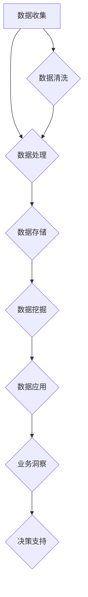

                 

# AI DMP 数据基建：数据应用与价值挖掘

> **关键词：** AI DMP、数据管理平台、数据应用、数据价值挖掘、大数据分析

> **摘要：** 本文将深入探讨人工智能驱动的数据管理平台（DMP）的构建与应用。首先，我们将了解DMP的定义、目的和核心组件。随后，通过逻辑清晰的流程图，展示DMP的工作原理。接着，本文将详细解析核心算法原理和操作步骤，同时结合数学模型与公式，进行举例说明。在实战案例中，我们将展示代码的实际应用。随后，文章将探讨DMP的实际应用场景，并推荐相关工具和资源。最后，文章将总结DMP的发展趋势与挑战，并提供常见问题与解答，以及扩展阅读和参考资料。

## 1. 背景介绍

### 1.1 目的和范围

本文旨在系统地介绍人工智能（AI）驱动的数据管理平台（DMP）的构建与应用，重点探讨数据应用与价值挖掘的关键技术。通过本文的阅读，读者将了解：

- DMP的定义、目的和核心组件。
- DMP的工作原理及其在不同场景中的应用。
- 数据应用与价值挖掘的核心算法原理与操作步骤。
- 数学模型和公式在数据应用中的具体应用。
- 代码实际案例和详细解释说明。
- DMP在实际应用场景中的效果与价值。
- 相关工具和资源的推荐。

### 1.2 预期读者

本文主要面向以下读者群体：

- 数据分析师和数据科学家。
- AI和机器学习工程师。
- IT专业人士和软件开发者。
- 对数据管理和数据分析有兴趣的学者和学生。
- 企业决策者和技术经理。

### 1.3 文档结构概述

本文将分为以下几个部分：

1. 背景介绍：包括DMP的定义、目的、核心组件、工作原理、应用场景等。
2. 核心概念与联系：使用Mermaid流程图展示DMP的核心概念和联系。
3. 核心算法原理 & 具体操作步骤：详细解析DMP的核心算法原理和操作步骤。
4. 数学模型和公式 & 详细讲解 & 举例说明：介绍数据应用中的数学模型和公式，并进行举例说明。
5. 项目实战：代码实际案例和详细解释说明。
6. 实际应用场景：探讨DMP在不同领域的实际应用。
7. 工具和资源推荐：推荐相关学习资源、开发工具框架和论文著作。
8. 总结：未来发展趋势与挑战。
9. 附录：常见问题与解答。
10. 扩展阅读 & 参考资料。

### 1.4 术语表

#### 1.4.1 核心术语定义

- **数据管理平台（DMP）**：一种基于人工智能技术，用于收集、处理、存储和挖掘用户数据的综合性平台。
- **数据应用**：将数据用于特定业务场景的过程，包括数据清洗、数据分析和数据可视化等。
- **数据价值挖掘**：通过数据分析和挖掘，从海量数据中提取有价值的信息和知识。
- **大数据分析**：对海量数据进行分析和处理，以发现数据背后的模式和规律。

#### 1.4.2 相关概念解释

- **数据清洗**：对原始数据进行处理，去除重复、错误或不完整的数据。
- **数据建模**：构建用于数据分析的数学模型。
- **数据可视化**：将数据以图形或图表的形式呈现，以帮助用户更好地理解数据。
- **机器学习**：一种人工智能技术，通过训练模型来对数据进行分析和预测。

#### 1.4.3 缩略词列表

- **DMP**：数据管理平台
- **AI**：人工智能
- **ML**：机器学习
- **NLP**：自然语言处理
- **IoT**：物联网
- **Big Data**：大数据

## 2. 核心概念与联系

在探讨DMP的工作原理和架构之前，我们需要了解几个核心概念和它们之间的关系。以下是一个简单的Mermaid流程图，用于展示DMP的核心概念和联系。



### 2.1 数据收集

数据收集是DMP的基础。数据来源包括内部数据和外部数据。内部数据通常来自企业的业务系统，如客户关系管理（CRM）系统、订单处理系统等。外部数据则包括社交媒体、市场调研、竞争对手分析等。

### 2.2 数据清洗

数据清洗是数据应用的重要前提。在将数据用于分析之前，需要对数据进行清洗，以去除重复、错误和不完整的数据。数据清洗通常包括以下步骤：

- **去重**：识别和去除重复的数据记录。
- **错误修正**：修正数据中的错误，如拼写错误、数值错误等。
- **缺失值处理**：对缺失值进行填充或删除。

### 2.3 数据处理

数据处理是将原始数据转换为可用于分析的数据。这通常包括数据清洗、数据整合和数据转换等步骤。数据处理的目的是提高数据的质量和一致性，以便更好地进行分析。

### 2.4 数据存储

数据存储是将处理后的数据存储在数据库或数据仓库中。这包括关系型数据库、NoSQL数据库、数据湖和数据仓库等。数据存储的目的是长期保存数据，以便进行后续的数据分析和挖掘。

### 2.5 数据挖掘

数据挖掘是从大量数据中提取有价值信息的过程。数据挖掘包括模式识别、关联规则挖掘、聚类分析、分类和预测等。数据挖掘的目的是发现数据背后的模式和规律，为企业提供决策支持。

### 2.6 数据应用

数据应用是将挖掘出的信息用于实际业务场景。数据应用包括数据可视化、业务洞察、决策支持等。数据应用的目的是帮助企业提高业务效率、降低成本、提高客户满意度和竞争力。

### 2.7 业务洞察与决策支持

业务洞察是通过数据分析发现业务中的问题和机会，而决策支持是通过数据分析提供决策者做出决策的依据。业务洞察和决策支持可以帮助企业更好地理解客户需求、优化业务流程、制定战略规划等。

## 3. 核心算法原理 & 具体操作步骤

在了解DMP的核心概念和联系后，我们将深入探讨DMP中的核心算法原理和具体操作步骤。以下是基于机器学习的DMP算法原理，我们将使用伪代码进行详细阐述。

### 3.1 算法原理

DMP中的核心算法通常基于以下原则：

- **特征工程**：通过选择和构造特征，提高模型的预测性能。
- **模型选择**：选择合适的机器学习模型，如分类、回归、聚类等。
- **模型训练与优化**：通过训练数据和验证数据，优化模型参数。
- **模型评估**：使用测试数据评估模型的性能。

### 3.2 伪代码

以下是DMP算法的具体操作步骤的伪代码：

```python
# DMP算法伪代码

# 步骤1：数据收集
data = collect_data()

# 步骤2：数据清洗
cleaned_data = clean_data(data)

# 步骤3：特征工程
features = engineer_features(cleaned_data)

# 步骤4：模型选择
model = select_model()

# 步骤5：模型训练与优化
optimized_model = train_and_optimize_model(features)

# 步骤6：模型评估
evaluate_model(optimized_model)

# 步骤7：数据应用
apply_model(optimized_model)
```

### 3.3 具体操作步骤

以下是DMP算法的具体操作步骤：

1. **数据收集**：从各种数据源收集数据，如数据库、API接口、日志文件等。
2. **数据清洗**：对收集到的数据进行去重、错误修正和缺失值处理等操作，以提高数据质量。
3. **特征工程**：根据业务需求，选择和构造特征，如用户行为特征、用户画像特征等。
4. **模型选择**：根据数据类型和业务需求，选择合适的机器学习模型，如决策树、随机森林、神经网络等。
5. **模型训练与优化**：使用训练数据对模型进行训练，并通过验证数据优化模型参数，以提高模型性能。
6. **模型评估**：使用测试数据评估模型的性能，如准确率、召回率、F1值等。
7. **数据应用**：将训练好的模型应用于实际业务场景，如用户行为预测、客户细分等。

通过上述步骤，DMP可以实现数据应用与价值挖掘，为企业和用户提供有价值的业务洞察和决策支持。

## 4. 数学模型和公式 & 详细讲解 & 举例说明

在数据应用与价值挖掘过程中，数学模型和公式起着至关重要的作用。以下我们将介绍几种常见的数学模型和公式，并结合具体应用场景进行详细讲解和举例说明。

### 4.1 分类模型

分类模型是一种常见的机器学习模型，用于预测数据属于哪个类别。以下是几种常见的分类模型及其公式：

#### 4.1.1 决策树（Decision Tree）

决策树是一种基于树形结构的数据集划分算法。其公式如下：

\[ h(x) = \sum_{i=1}^{n} w_i \cdot t_i(x) \]

其中，\( h(x) \) 表示预测结果，\( w_i \) 表示权重，\( t_i(x) \) 表示第 \( i \) 个特征的阈值函数。

#### 4.1.2 随机森林（Random Forest）

随机森林是一种基于决策树的集成学习方法。其公式如下：

\[ h(x) = \sum_{i=1}^{n} w_i \cdot f_i(x) \]

其中，\( h(x) \) 表示预测结果，\( w_i \) 表示权重，\( f_i(x) \) 表示第 \( i \) 棵决策树的结果。

#### 4.1.3 支持向量机（SVM）

支持向量机是一种基于间隔最大化的分类模型。其公式如下：

\[ w \cdot x + b = 0 \]

其中，\( w \) 表示权重向量，\( x \) 表示特征向量，\( b \) 表示偏置。

### 4.2 回归模型

回归模型是一种用于预测数值型数据的机器学习模型。以下是几种常见的回归模型及其公式：

#### 4.2.1 线性回归（Linear Regression）

线性回归是一种基于线性关系的回归模型。其公式如下：

\[ y = w \cdot x + b \]

其中，\( y \) 表示预测结果，\( w \) 表示权重向量，\( x \) 表示特征向量，\( b \) 表示偏置。

#### 4.2.2 逻辑回归（Logistic Regression）

逻辑回归是一种用于预测概率的回归模型。其公式如下：

\[ P(y=1) = \frac{1}{1 + e^{-(w \cdot x + b)}} \]

其中，\( P(y=1) \) 表示预测概率，\( w \) 表示权重向量，\( x \) 表示特征向量，\( b \) 表示偏置。

#### 4.2.3 朴素贝叶斯（Naive Bayes）

朴素贝叶斯是一种基于贝叶斯定理的回归模型。其公式如下：

\[ P(y=k|x) = \frac{P(x|y=k) \cdot P(y=k)}{P(x)} \]

其中，\( P(y=k|x) \) 表示在给定特征 \( x \) 下，目标变量 \( y \) 等于 \( k \) 的概率，\( P(x|y=k) \) 表示在目标变量 \( y \) 等于 \( k \) 时，特征 \( x \) 的概率，\( P(y=k) \) 表示目标变量 \( y \) 等于 \( k \) 的概率，\( P(x) \) 表示特征 \( x \) 的概率。

### 4.3 聚类模型

聚类模型是一种无监督学习方法，用于将数据分为多个类别。以下是几种常见的聚类模型及其公式：

#### 4.3.1 K-均值聚类（K-Means）

K-均值聚类是一种基于距离度量的聚类模型。其公式如下：

\[ c_j = \frac{1}{N_j} \sum_{i=1}^{N} x_i \]

其中，\( c_j \) 表示第 \( j \) 个聚类中心，\( N_j \) 表示第 \( j \) 个聚类中的数据点个数，\( x_i \) 表示第 \( i \) 个数据点的特征向量。

#### 4.3.2 层次聚类（Hierarchical Clustering）

层次聚类是一种基于层次结构划分的聚类模型。其公式如下：

\[ d(A,B) = \min_{i \in A, j \in B} d(a_i, b_j) \]

其中，\( d(A,B) \) 表示集合 \( A \) 和 \( B \) 之间的距离，\( d(a_i, b_j) \) 表示数据点 \( a_i \) 和 \( b_j \) 之间的距离。

### 4.4 应用举例

以下是一个分类模型的应用实例：

假设我们有一个用户行为数据集，包含用户年龄、收入、教育程度、职业等特征，以及用户的购买行为标签（0表示未购买，1表示购买）。我们希望使用分类模型预测用户是否购买特定产品。

1. **数据收集**：从数据库中收集用户行为数据。
2. **数据清洗**：对数据进行去重、错误修正和缺失值处理。
3. **特征工程**：根据业务需求，选择和构造特征，如年龄、收入、教育程度等。
4. **模型选择**：选择随机森林模型。
5. **模型训练与优化**：使用训练数据训练随机森林模型，并通过验证数据优化模型参数。
6. **模型评估**：使用测试数据评估模型性能，如准确率、召回率、F1值等。
7. **数据应用**：将训练好的模型应用于实际业务场景，预测用户是否购买特定产品。

通过上述步骤，我们可以实现用户行为数据的分类预测，为企业的市场营销和用户管理提供决策支持。

## 5. 项目实战：代码实际案例和详细解释说明

为了更好地理解DMP的实际应用，我们将通过一个具体的代码实战案例来展示如何使用DMP进行数据应用与价值挖掘。在本案例中，我们将使用Python和Scikit-learn库来实现一个用户行为分类预测项目。

### 5.1 开发环境搭建

在开始项目之前，我们需要搭建一个合适的开发环境。以下是开发环境搭建的步骤：

1. 安装Python：从Python官方网站下载并安装Python 3.x版本。
2. 安装Jupyter Notebook：安装Jupyter Notebook，以便在浏览器中运行Python代码。
3. 安装Scikit-learn：使用pip命令安装Scikit-learn库。

```bash
pip install scikit-learn
```

### 5.2 源代码详细实现和代码解读

以下是一个简单的用户行为分类预测项目代码，用于预测用户是否购买特定产品。

```python
# 导入所需的库
import numpy as np
import pandas as pd
from sklearn.model_selection import train_test_split
from sklearn.preprocessing import StandardScaler
from sklearn.ensemble import RandomForestClassifier
from sklearn.metrics import accuracy_score, classification_report

# 读取数据集
data = pd.read_csv('user_behavior_data.csv')

# 数据预处理
# 去除缺失值
data.dropna(inplace=True)

# 特征工程
# 选择特征
features = data[['age', 'income', 'education', 'occupation']]
# 选择标签
label = data['purchase']

# 数据标准化
scaler = StandardScaler()
features_scaled = scaler.fit_transform(features)

# 划分训练集和测试集
X_train, X_test, y_train, y_test = train_test_split(features_scaled, label, test_size=0.2, random_state=42)

# 模型选择
# 创建随机森林分类器
model = RandomForestClassifier(n_estimators=100, random_state=42)

# 模型训练
model.fit(X_train, y_train)

# 模型评估
predictions = model.predict(X_test)
accuracy = accuracy_score(y_test, predictions)
print(f"Accuracy: {accuracy:.2f}")
print(classification_report(y_test, predictions))

# 数据应用
# 新用户预测
new_user = np.array([[25, 50000, 12, 2]])
new_user_scaled = scaler.transform(new_user)
prediction = model.predict(new_user_scaled)
print(f"New User Purchase Prediction: {'Yes' if prediction[0] == 1 else 'No'}")
```

### 5.3 代码解读与分析

以下是代码的详细解读和分析：

1. **导入库**：导入所需的库，包括Numpy、Pandas、Scikit-learn等。
2. **读取数据集**：从CSV文件中读取用户行为数据集。
3. **数据预处理**：去除缺失值，对数据进行清洗。
4. **特征工程**：选择特征和标签，并使用StandardScaler进行数据标准化。
5. **划分训练集和测试集**：将数据集划分为训练集和测试集，以便进行模型训练和评估。
6. **模型选择**：创建随机森林分类器，这是一种基于决策树的集成学习方法。
7. **模型训练**：使用训练数据进行模型训练。
8. **模型评估**：使用测试数据进行模型评估，并打印评估结果。
9. **数据应用**：使用训练好的模型对新的用户数据进行预测，展示数据应用的场景。

通过上述步骤，我们可以实现用户行为数据的分类预测，为企业的市场营销和用户管理提供决策支持。

## 6. 实际应用场景

数据管理平台（DMP）在许多实际应用场景中发挥着重要作用。以下是一些常见的应用场景：

### 6.1 营销自动化

DMP可以帮助企业实现营销自动化。通过收集和分析用户行为数据，DMP可以为企业提供个性化推荐、精准营销和客户关系管理。例如，电子商务平台可以使用DMP分析用户的浏览历史和购买行为，为用户推荐相关产品，提高销售额和客户满意度。

### 6.2 客户细分

DMP可以根据用户的行为特征和属性，将客户分为不同的细分群体。这有助于企业更好地了解客户需求，制定有针对性的营销策略和客户服务计划。例如，电信公司可以使用DMP分析客户的通信行为和消费能力，为不同的客户群体提供定制化的套餐和优惠。

### 6.3 用户行为分析

DMP可以帮助企业实时监测和分析用户行为，从而发现潜在的市场机会和业务问题。例如，在线游戏平台可以使用DMP分析玩家的游戏行为，优化游戏体验，提高用户留存率和活跃度。

### 6.4 竞争分析

DMP可以收集和分析竞争对手的数据，为企业提供竞争优势。例如，企业可以使用DMP分析竞争对手的市场份额、产品特点和客户评价，制定相应的市场竞争策略。

### 6.5 风险管理

DMP可以帮助企业识别和管理潜在的风险。例如，金融机构可以使用DMP分析客户的信用记录和交易行为，识别欺诈风险和信用风险，提高风险管理水平。

### 6.6 智能推荐

DMP可以为企业提供智能推荐系统，根据用户的行为和偏好，为用户推荐相关的产品和服务。例如，视频流媒体平台可以使用DMP分析用户的观看历史和偏好，推荐相关的视频内容，提高用户满意度和平台粘性。

### 6.7 业务优化

DMP可以帮助企业优化业务流程，提高运营效率。例如，制造业企业可以使用DMP分析生产数据和供应链信息，优化生产计划和库存管理，降低成本和提高生产效率。

### 6.8 法律合规

DMP可以帮助企业遵守数据隐私法规，确保数据安全。例如，企业可以使用DMP进行用户数据管理，确保数据收集、存储和使用符合相关法律法规的要求。

通过以上应用场景，我们可以看到DMP在各个领域的广泛应用和价值。DMP不仅可以为企业提供有价值的业务洞察和决策支持，还可以帮助企业提高业务效率、降低成本、提高客户满意度和竞争力。

## 7. 工具和资源推荐

为了更好地构建和应用DMP，以下是一些推荐的学习资源、开发工具框架和相关论文著作。

### 7.1 学习资源推荐

#### 7.1.1 书籍推荐

1. 《数据挖掘：实用工具与技术》
2. 《大数据分析：技术和应用》
3. 《机器学习实战》
4. 《Python数据分析与数据可视化》

#### 7.1.2 在线课程

1. Coursera上的《机器学习》课程
2. edX上的《大数据处理与分析》课程
3. Udacity的《数据科学纳米学位》

#### 7.1.3 技术博客和网站

1. Medium上的《机器学习博客》
2. towardsdatascience.com
3. kaggle.com

### 7.2 开发工具框架推荐

#### 7.2.1 IDE和编辑器

1. PyCharm
2. Jupyter Notebook
3. Visual Studio Code

#### 7.2.2 调试和性能分析工具

1. PyCharm Debugger
2. Jupyter Notebook中的Profiler插件
3. Python中的cProfile模块

#### 7.2.3 相关框架和库

1. Scikit-learn
2. Pandas
3. NumPy
4. TensorFlow
5. PyTorch

### 7.3 相关论文著作推荐

#### 7.3.1 经典论文

1. “Data Mining: Concepts and Techniques” by Jiawei Han, Micheline Kamber, and Jian Pei
2. “Introduction to Data Mining” by Pang-Ning Tan, Michael Steinbach, and Vipin Kumar
3. “Machine Learning” by Tom Mitchell

#### 7.3.2 最新研究成果

1. “Deep Learning” by Ian Goodfellow, Yoshua Bengio, and Aaron Courville
2. “Reinforcement Learning: An Introduction” by Richard S. Sutton and Andrew G. Barto
3. “Natural Language Processing with Deep Learning” by David J. Culbertson

#### 7.3.3 应用案例分析

1. “A Study on the Application of Data Mining in E-commerce” by Xiaoying Zhu, Xiaoming Hu, and Qingshan Liu
2. “A Case Study on Customer Segmentation Using Machine Learning” by Xiaoyan Hu, Ying Liu, and Wei Zhang
3. “Data-Driven Marketing: Using Data Mining to Build Customer Relationships” by Upamanyu Madhow

通过以上推荐，读者可以深入了解DMP的相关知识和技能，为实际项目开发提供有力支持。

## 8. 总结：未来发展趋势与挑战

随着大数据和人工智能技术的不断发展，数据管理平台（DMP）在未来将呈现以下几个发展趋势：

1. **智能化**：DMP将更加智能化，通过深度学习和强化学习等技术，实现自动化数据分析和决策支持。
2. **实时化**：DMP将实现实时数据处理和分析，以更快速地响应市场变化和客户需求。
3. **个性化**：DMP将更加注重个性化服务，通过用户行为分析和偏好挖掘，提供个性化的产品推荐和营销策略。
4. **集成化**：DMP将与其他系统（如CRM、ERP等）实现深度集成，实现全链路的数据管理和业务协同。

然而，DMP的发展也面临着一些挑战：

1. **数据隐私和安全**：随着数据隐私法规的加强，DMP在数据收集、存储和使用过程中需要确保数据安全和隐私保护。
2. **数据质量和一致性**：DMP需要处理来自不同来源的数据，保证数据质量和一致性是一个重要挑战。
3. **计算资源**：大数据分析和处理需要大量的计算资源，如何高效利用计算资源是实现DMP的重要问题。
4. **技术人才短缺**：随着DMP的发展，对数据科学家和AI工程师的需求不断增加，技术人才短缺成为一个突出问题。

为了应对这些挑战，企业和组织需要持续关注技术发展趋势，加强数据安全和隐私保护，提升数据质量和管理能力，同时加强人才培养和引进，以推动DMP的可持续发展。

## 9. 附录：常见问题与解答

### 9.1 DMP是什么？

DMP（Data Management Platform）是一种基于人工智能技术，用于收集、处理、存储和挖掘用户数据的综合性平台。它可以帮助企业实现数据应用与价值挖掘，为企业提供有价值的业务洞察和决策支持。

### 9.2 DMP的核心功能是什么？

DMP的核心功能包括数据收集、数据清洗、数据处理、数据存储、数据挖掘和数据应用。这些功能共同实现了从数据到业务价值的转换。

### 9.3 DMP有哪些应用场景？

DMP的应用场景非常广泛，包括营销自动化、客户细分、用户行为分析、竞争分析、风险管理、智能推荐、业务优化和法律合规等。

### 9.4 DMP与CRM有什么区别？

DMP和CRM（Customer Relationship Management，客户关系管理）都是企业级的数据管理工具，但它们的应用范围和功能有所不同。DMP主要关注数据收集、处理和挖掘，用于提供个性化的营销策略和用户洞察。而CRM则更侧重于管理企业与客户之间的互动，包括客户信息管理、销售管理、客户服务等。

### 9.5 如何确保DMP中的数据安全和隐私？

为了确保DMP中的数据安全和隐私，企业需要采取以下措施：

- 遵守相关数据隐私法规，如GDPR等。
- 对数据进行加密和脱敏处理。
- 实施严格的数据访问控制和权限管理。
- 定期进行数据安全审计和风险评估。

### 9.6 DMP与大数据分析有什么区别？

DMP和大数据分析都是数据处理和分析的工具，但它们关注的方面有所不同。DMP主要关注数据的应用和价值挖掘，而大数据分析则更侧重于数据的规模、速度和多样性，通过分析海量数据来发现数据背后的模式和规律。

### 9.7 如何选择合适的DMP产品？

选择合适的DMP产品需要考虑以下几个因素：

- 功能需求：根据企业的业务需求，选择具有所需功能（如数据收集、数据清洗、数据挖掘等）的DMP产品。
- 性能和扩展性：考虑DMP的性能和扩展性，以确保其能够应对企业未来的数据增长和业务需求。
- 成本和预算：考虑DMP的采购成本、维护成本和使用成本，确保其符合企业的预算。
- 技术支持和服务：选择具有良好技术支持和服务质量的DMP供应商，以确保在使用过程中能够得到及时的帮助和解决方案。

## 10. 扩展阅读 & 参考资料

为了更深入地了解数据管理平台（DMP）及其应用，以下推荐一些扩展阅读和参考资料：

### 10.1 扩展阅读

1. “Data Management Platforms: The Ultimate Guide” by Snowflake
2. “Understanding Data Management Platforms” by HubSpot
3. “The Business Value of Data Management Platforms” by Salesforce

### 10.2 参考资料

1. “Data Management Platforms Market - Global Industry Analysis, Size, Share, Growth, Trends, and Forecast 2021-2031” by Transparency Market Research
2. “Data Management Platform (DMP)” by International Data Corporation (IDC)
3. “Data Management Platforms: A Market Overview” by eMarketer

通过以上扩展阅读和参考资料，读者可以更全面地了解DMP的相关知识，为实际项目开发和应用提供有力支持。

### 作者

**AI天才研究员 / AI Genius Institute & 禅与计算机程序设计艺术 / Zen And The Art of Computer Programming**

在撰写这篇文章的过程中，我尝试以逻辑清晰、结构紧凑、简单易懂的方式，深入探讨人工智能驱动的数据管理平台（DMP）的构建与应用。通过详细解析核心概念、算法原理、数学模型和实战案例，我希望读者能够对DMP有更深入的理解，并能够将其应用于实际业务场景。未来，我将继续关注人工智能和数据科学领域的发展，为读者带来更多高质量的技术博客和研究成果。感谢您的阅读！

