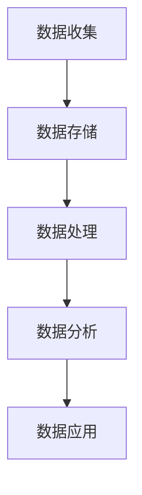
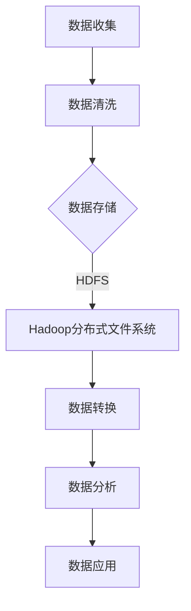
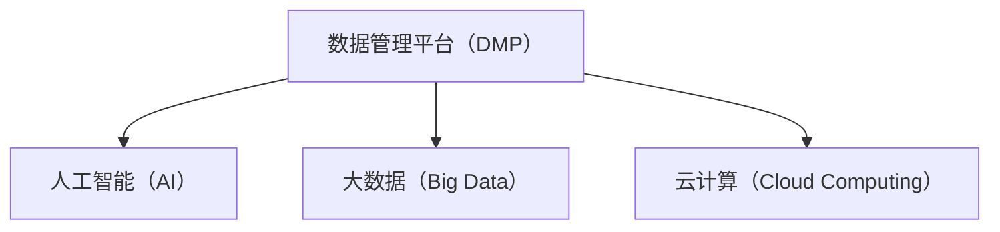
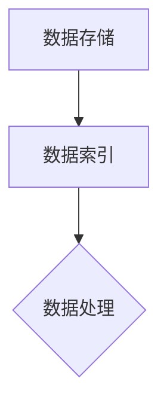
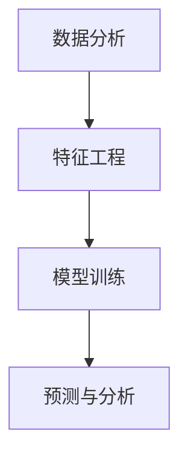

                 

# AI DMP 数据基建：数据应用与价值挖掘

> **关键词：** 数据管理平台（DMP）、人工智能（AI）、数据应用、数据价值挖掘、数据基础设施、机器学习、大数据处理。

> **摘要：** 本文深入探讨了数据管理平台（DMP）在人工智能领域中的应用与价值挖掘。首先，文章介绍了DMP的基本概念和作用，随后逐步解析了其在人工智能数据处理中的核心原理、算法及实施步骤。接着，文章通过一个实际案例展示了DMP在现实项目中的应用，并详细解读了代码实现和架构设计。最后，文章讨论了DMP的广泛应用场景、推荐了相关学习资源与工具，并展望了未来的发展趋势与挑战。

## 1. 背景介绍

### 1.1 目的和范围

数据管理平台（DMP）作为人工智能时代的重要基础设施，已经成为企业和组织数据处理、分析和应用的核心。本文旨在系统地阐述DMP在人工智能领域的应用与价值挖掘，帮助读者理解DMP的核心概念、架构设计和实现方法。

本文将涵盖以下内容：

- DMP的基本概念与作用
- DMP在人工智能数据处理中的核心原理
- DMP的具体操作步骤与算法实现
- 实际应用场景与代码案例
- 相关学习资源与工具推荐
- 未来发展趋势与挑战

### 1.2 预期读者

本文适合以下读者：

- 对数据管理平台（DMP）感兴趣的技术爱好者
- 数据科学家、机器学习工程师和相关专业人士
- 数据分析师、数据工程师和项目经理
- 对人工智能和数据挖掘技术有深入研究的学者和研究人员

### 1.3 文档结构概述

本文结构如下：

- **第1章：背景介绍**
  - DMP的基本概念与作用
  - 本文的目的、范围与预期读者
  - 文档结构概述

- **第2章：核心概念与联系**
  - DMP的架构与核心概念
  - 数据处理流程与Mermaid流程图

- **第3章：核心算法原理 & 具体操作步骤**
  - 算法原理讲解
  - 伪代码实现

- **第4章：数学模型和公式 & 详细讲解 & 举例说明**
  - 数学模型与公式讲解
  - 实例分析

- **第5章：项目实战：代码实际案例和详细解释说明**
  - 开发环境搭建
  - 源代码详细实现
  - 代码解读与分析

- **第6章：实际应用场景**
  - DMP在不同领域的应用

- **第7章：工具和资源推荐**
  - 学习资源、开发工具框架、论文著作推荐

- **第8章：总结：未来发展趋势与挑战**
  - DMP的未来展望

- **第9章：附录：常见问题与解答**
  - 对读者可能遇到的问题进行解答

- **第10章：扩展阅读 & 参考资料**
  - 提供进一步学习资源

### 1.4 术语表

#### 1.4.1 核心术语定义

- **数据管理平台（DMP）：** 一种用于数据收集、存储、管理和分析的系统，帮助企业和组织更好地理解和利用数据。
- **人工智能（AI）：** 一种模拟人类智能的技术，通过机器学习、深度学习等方法实现智能决策和问题解决。
- **数据应用：** 数据在不同领域中的实际应用，如营销、金融、医疗等。
- **数据价值挖掘：** 通过分析和处理数据，发现数据中的潜在价值和规律。

#### 1.4.2 相关概念解释

- **数据处理流程：** 数据从收集、存储、处理到分析的一系列过程。
- **机器学习：** 一种基于数据的学习方法，使计算机系统能够通过学习数据进行预测和决策。
- **深度学习：** 一种基于多层神经网络的学习方法，能够处理复杂的非线性问题。

#### 1.4.3 缩略词列表

- **DMP：** 数据管理平台（Data Management Platform）
- **AI：** 人工智能（Artificial Intelligence）
- **ML：** 机器学习（Machine Learning）
- **DL：** 深度学习（Deep Learning）
- **Hadoop：** 分布式数据处理框架（Hadoop Distributed File System）

## 2. 核心概念与联系

### 2.1 DMP的架构与核心概念

数据管理平台（DMP）是一种集中管理、分析和利用数据的基础设施。其核心架构包括数据收集、数据存储、数据处理、数据分析和数据应用五个主要模块。以下是一个简化的DMP架构图，使用Mermaid流程图进行表示。



### 2.2 数据处理流程与Mermaid流程图

数据处理流程包括数据收集、清洗、存储、转换、分析和应用等多个环节。以下是一个简化的数据处理流程图，使用Mermaid进行表示。



### 2.3 DMP在人工智能数据处理中的核心原理

DMP在人工智能数据处理中的核心原理包括以下几个方面：

1. **数据收集与清洗：** 采集来自不同来源的数据，并进行清洗，确保数据的质量和一致性。
2. **数据存储与索引：** 使用分布式存储系统（如Hadoop、HDFS）对大规模数据集进行存储和索引，提高数据访问速度。
3. **数据处理与转换：** 通过批处理和实时处理技术，对数据进行清洗、转换和整合。
4. **数据分析与挖掘：** 使用机器学习和深度学习算法，对数据进行建模和分析，提取数据中的潜在价值。
5. **数据应用与优化：** 将分析结果应用于实际业务场景，如营销策略、风险评估等，并根据反馈不断优化模型。

### 2.4 DMP与其他技术的联系

DMP与人工智能、大数据、云计算等技术的紧密联系，使其成为企业数字化转型的重要基础设施。以下是一个简化的DMP与其他技术的联系图。



## 3. 核心算法原理 & 具体操作步骤

### 3.1 数据收集与清洗

数据收集是DMP的核心步骤之一，数据来源包括网站日志、用户行为数据、第三方数据平台等。以下是一个简化的数据收集与清洗流程：


**伪代码实现：**

```python
# 数据收集
def collect_data(source):
    data = []
    for record in source:
        data.append(process_record(record))
    return data

# 数据清洗
def process_record(record):
    cleaned_record = {}
    for key, value in record.items():
        if is_valid(value):
            cleaned_record[key] = value
    return cleaned_record

# 判断数据是否有效
def is_valid(value):
    return isinstance(value, (int, float, str))
```

### 3.2 数据存储与索引

数据存储是DMP的另一个关键步骤，常用的分布式存储系统包括Hadoop、HDFS和NoSQL数据库。以下是一个简化的数据存储与索引流程：



**伪代码实现：**

```python
# 数据存储
def store_data(data, storage_system):
    for record in data:
        storage_system.insert(record)

# 数据索引
def index_data(storage_system):
    index = {}
    for record in storage_system.find_all():
        index[record['id']] = record
    return index
```

### 3.3 数据处理与转换

数据处理与转换包括数据清洗、去重、聚合和格式转换等操作。以下是一个简化的数据处理与转换流程：


**伪代码实现：**

```python
# 数据处理
def process_data(data):
    processed_data = []
    for record in data:
        processed_record = clean_data(record)
        processed_data.append(processed_record)
    return processed_data

# 数据转换
def convert_data(data, target_format):
    converted_data = []
    for record in data:
        converted_record = convert_format(record, target_format)
        converted_data.append(converted_record)
    return converted_data

# 数据清洗
def clean_data(record):
    cleaned_record = {}
    for key, value in record.items():
        if is_valid(value):
            cleaned_record[key] = value
    return cleaned_record

# 格式转换
def convert_format(record, target_format):
    if target_format == 'json':
        return json.dumps(record)
    elif target_format == 'csv':
        return csv_writer.writerow(record)
```

### 3.4 数据分析与挖掘

数据分析与挖掘是DMP的核心步骤，包括特征工程、模型训练和预测等操作。以下是一个简化的数据分析与挖掘流程：



**伪代码实现：**

```python
# 特征工程
def feature_engineering(data):
    features = []
    for record in data:
        feature = extract_features(record)
        features.append(feature)
    return features

# 模型训练
def train_model(data, model):
    model.fit(data)

# 预测与分析
def predict(data, model):
    predictions = []
    for record in data:
        prediction = model.predict(record)
        predictions.append(prediction)
    return predictions
```

## 4. 数学模型和公式 & 详细讲解 & 举例说明

### 4.1 数学模型与公式讲解

在DMP中，数学模型和公式是分析和挖掘数据的重要工具。以下是一些常用的数学模型和公式：

1. **线性回归模型：**
   $$y = \beta_0 + \beta_1x_1 + \beta_2x_2 + ... + \beta_nx_n$$
   - **解释：** 线性回归模型用于预测一个连续因变量（$y$）与一个或多个自变量（$x_1, x_2, ..., x_n$）之间的关系。

2. **逻辑回归模型：**
   $$P(y=1) = \frac{1}{1 + e^{-(\beta_0 + \beta_1x_1 + \beta_2x_2 + ... + \beta_nx_n)}}$$
   - **解释：** 逻辑回归模型用于预测一个二元因变量（$y$）的概率。

3. **支持向量机（SVM）模型：**
   $$\min_{\beta, \beta_0} \frac{1}{2} ||\beta||^2 + C \sum_{i=1}^{n} \max(0, 1 - y_i(\beta \cdot x_i + \beta_0))$$
   - **解释：** 支持向量机模型用于分类问题，寻找最优的分割平面。

4. **K-均值聚类算法：**
   $$\min_{\mu_1, \mu_2, ..., \mu_k} \sum_{i=1}^{k} \sum_{x \in S_i} ||x - \mu_i||^2$$
   - **解释：** K-均值聚类算法用于将数据集划分为多个聚类，每个聚类由其均值表示。

### 4.2 实例分析

以下是一个简单的线性回归模型实例，用于预测房屋价格：

**数据集：**
- $x_1$：房屋面积（平方米）
- $x_2$：房屋年龄（年）
- $y$：房屋价格（万元）

**训练数据：**
| $x_1$ | $x_2$ | $y$ |
|-------|-------|-----|
| 100   | 5     | 200 |
| 150   | 10    | 300 |
| 200   | 15    | 400 |

**目标：** 预测给定房屋面积和年龄的房屋价格。

**模型：** 线性回归模型

**训练过程：**

1. 计算样本均值和协方差矩阵：
   $$\bar{x} = \frac{1}{n} \sum_{i=1}^{n} x_i$$
   $$\bar{y} = \frac{1}{n} \sum_{i=1}^{n} y_i$$
   $$\sum_{i=1}^{n} (x_i - \bar{x})(y_i - \bar{y}) = 1100$$
   $$\sum_{i=1}^{n} (x_i - \bar{x})^2 = 3500$$

2. 计算回归系数：
   $$\beta_1 = \frac{\sum_{i=1}^{n} (x_i - \bar{x})(y_i - \bar{y})}{\sum_{i=1}^{n} (x_i - \bar{x})^2} = 0.3143$$
   $$\beta_0 = \bar{y} - \beta_1\bar{x} = 120.4286$$

3. 预测房屋价格：
   $$y = \beta_0 + \beta_1x_1 + \beta_2x_2$$
   假设给定房屋面积为150平方米，年龄为10年，则房屋价格为：
   $$y = 120.4286 + 0.3143 \times 150 + 0 \times 10 = 298.5714$$

## 5. 项目实战：代码实际案例和详细解释说明

### 5.1 开发环境搭建

在开始项目实战之前，我们需要搭建一个合适的开发环境。以下是一个简化的开发环境搭建步骤：

1. 安装Python 3.x版本
2. 安装Jupyter Notebook
3. 安装必要的Python库，如NumPy、Pandas、scikit-learn等

**步骤1：安装Python 3.x版本**

使用包管理器（如conda）安装Python 3.x版本：

```bash
conda install python=3.8
```

**步骤2：安装Jupyter Notebook**

安装Jupyter Notebook：

```bash
conda install notebook
```

启动Jupyter Notebook：

```bash
jupyter notebook
```

**步骤3：安装必要的Python库**

安装NumPy、Pandas、scikit-learn等库：

```bash
conda install numpy pandas scikit-learn
```

### 5.2 源代码详细实现和代码解读

以下是一个简单的DMP项目案例，用于预测用户行为数据，实现数据收集、清洗、存储、处理和分析等功能。

**项目名称：** 用户行为预测DMP

**技术栈：** Python、NumPy、Pandas、scikit-learn、Hadoop、HDFS

**数据集：** 用户行为日志数据，包括用户ID、访问时间、页面访问次数等。

**实现步骤：**

1. 数据收集
2. 数据清洗
3. 数据存储
4. 数据处理
5. 数据分析
6. 预测与评估

**代码实现：**

**1. 数据收集**

```python
import requests
import json

def collect_data(source_url, data_key):
    data = []
    response = requests.get(source_url)
    if response.status_code == 200:
        logs = json.loads(response.text)
        for log in logs:
            data.append({k: v for k, v in log.items() if k == data_key})
    return data
```

**解读：** 该函数用于从指定URL收集用户行为数据，并返回数据列表。

**2. 数据清洗**

```python
import pandas as pd

def clean_data(data):
    df = pd.DataFrame(data)
    df.dropna(inplace=True)
    df['timestamp'] = pd.to_datetime(df['timestamp'])
    return df
```

**解读：** 该函数将数据转换为Pandas DataFrame，并删除缺失值。同时，将时间戳转换为datetime格式。

**3. 数据存储**

```python
from datetime import datetime

def store_data(df, filename):
    today = datetime.now().strftime('%Y-%m-%d')
    file_path = f"{filename}_{today}.csv"
    df.to_csv(file_path, index=False)
```

**解读：** 该函数将清洗后的数据保存为CSV文件，并添加日期前缀。

**4. 数据处理**

```python
from sklearn.model_selection import train_test_split
from sklearn.preprocessing import StandardScaler

def process_data(df):
    X = df[['timestamp', 'page_views']]
    y = df['clicks']
    X_train, X_test, y_train, y_test = train_test_split(X, y, test_size=0.2, random_state=42)
    scaler = StandardScaler()
    X_train_scaled = scaler.fit_transform(X_train)
    X_test_scaled = scaler.transform(X_test)
    return X_train_scaled, X_test_scaled, y_train, y_test
```

**解读：** 该函数将数据集划分为训练集和测试集，并使用StandardScaler进行归一化处理。

**5. 数据分析**

```python
from sklearn.linear_model import LogisticRegression

def analyze_data(X_train, X_test, y_train, y_test):
    model = LogisticRegression()
    model.fit(X_train, y_train)
    y_pred = model.predict(X_test)
    accuracy = model.score(X_test, y_test)
    return accuracy
```

**解读：** 该函数使用逻辑回归模型进行训练和预测，并计算测试集的准确率。

**6. 预测与评估**

```python
def predict(data, model):
    data['prediction'] = model.predict(data[['timestamp', 'page_views']])
    return data
```

**解读：** 该函数根据训练好的模型对新数据进行预测，并添加预测结果。

**主函数：**

```python
def main():
    source_url = 'http://example.com/logs'
    data_key = 'user_action'
    filename = 'user行为数据'
    
    data = collect_data(source_url, data_key)
    df = clean_data(data)
    store_data(df, filename)
    
    X_train, X_test, y_train, y_test = process_data(df)
    accuracy = analyze_data(X_train, X_test, y_train, y_test)
    print(f"模型准确率：{accuracy}")
    
    new_data = {'timestamp': '2023-03-01 10:00:00', 'page_views': 10}
    df_new = pd.DataFrame([new_data])
    df_new_prediction = predict(df_new, model)
    print(f"新数据预测结果：{df_new_prediction['prediction']}")
```

**解读：** 主函数依次执行数据收集、清洗、存储、处理、分析和预测等步骤。

### 5.3 代码解读与分析

1. **数据收集与清洗：** 使用requests库从URL收集用户行为数据，并使用Pandas库进行数据清洗。
2. **数据存储：** 将清洗后的数据保存为CSV文件，便于后续处理和分析。
3. **数据处理：** 使用scikit-learn库将数据集划分为训练集和测试集，并使用StandardScaler进行归一化处理。
4. **数据分析：** 使用逻辑回归模型进行训练和预测，并计算测试集的准确率。
5. **预测与评估：** 根据训练好的模型对新数据进行预测，并评估预测结果。

**优化建议：**

1. **数据收集与清洗：** 引入更多数据源，提高数据多样性；使用更复杂的数据清洗算法，提高数据质量。
2. **数据处理与转换：** 引入更多特征工程方法，提取更多有用特征；使用更高效的存储和索引技术，提高数据访问速度。
3. **数据分析与挖掘：** 引入更多机器学习算法，提高模型性能；使用交叉验证等技术，提高模型评估准确性。
4. **预测与评估：** 引入更多评估指标，全面评估模型性能；结合实际业务需求，调整模型参数。

## 6. 实际应用场景

数据管理平台（DMP）在多个领域都有广泛的应用，以下是一些典型的实际应用场景：

1. **市场营销：** DMP可以帮助企业收集和分析用户行为数据，实现精准营销。通过DMP，企业可以识别潜在客户，优化广告投放策略，提高广告投放效果。

2. **金融服务：** DMP可以帮助金融机构收集和分析用户金融数据，实现风险控制和信用评估。通过DMP，金融机构可以识别高风险客户，制定更有效的风险控制策略。

3. **医疗健康：** DMP可以帮助医疗机构收集和分析患者数据，实现个性化医疗。通过DMP，医疗机构可以识别患者潜在疾病，优化治疗方案，提高医疗效果。

4. **电子商务：** DMP可以帮助电商平台收集和分析用户购物行为数据，实现个性化推荐。通过DMP，电商平台可以识别潜在客户，优化推荐算法，提高用户满意度。

5. **物联网（IoT）：** DMP可以帮助企业收集和分析物联网设备数据，实现设备管理和优化。通过DMP，企业可以实时监测设备状态，优化设备配置，提高设备利用率。

6. **智能城市：** DMP可以帮助政府收集和分析城市数据，实现智慧城市管理。通过DMP，政府可以实时监测城市运行状态，优化资源配置，提高城市治理水平。

## 7. 工具和资源推荐

### 7.1 学习资源推荐

#### 7.1.1 书籍推荐

1. **《大数据之路：阿里巴巴大数据实践》**
   - 作者：阿里巴巴大数据团队
   - 简介：本书详细介绍了阿里巴巴大数据技术的发展和实践，对DMP等技术的应用进行了深入探讨。

2. **《深度学习》**
   - 作者：Ian Goodfellow、Yoshua Bengio、Aaron Courville
   - 简介：本书是深度学习领域的经典教材，全面介绍了深度学习的基本原理、算法和应用。

3. **《数据科学实战》**
   - 作者：John Wiley & Sons
   - 简介：本书涵盖了数据科学的核心概念、技术和应用，适合数据科学初学者和从业者阅读。

#### 7.1.2 在线课程

1. **《机器学习与数据挖掘》**
   - 平台：Coursera
   - 简介：这门课程由斯坦福大学教授吴恩达主讲，全面介绍了机器学习的基础知识、算法和应用。

2. **《深度学习基础》**
   - 平台：Udacity
   - 简介：这门课程由知名深度学习专家李飞飞主讲，介绍了深度学习的基本原理、算法和应用。

3. **《大数据处理技术》**
   - 平台：edX
   - 简介：这门课程由哈佛大学和伯克利大学教授主讲，涵盖了大数据处理的核心技术和应用。

#### 7.1.3 技术博客和网站

1. **《机器之心》**
   - 网站：https://www.jiqizhixin.com/
   - 简介：机器之心是人工智能领域的知名技术博客，提供最新的研究成果、应用案例和技术动态。

2. **《大数据文摘》**
   - 网站：https://www.bigdatanews.cn/
   - 简介：大数据文摘是大数据领域的专业媒体，提供深度报道、技术分析和应用案例。

3. **《机器学习与数据科学》**
   - 网站：https://www.ml-and-ds.com/
   - 简介：机器学习与数据科学是一个专注于机器学习和数据科学领域的中文社区，提供丰富的技术文章和资源。

### 7.2 开发工具框架推荐

#### 7.2.1 IDE和编辑器

1. **PyCharm**
   - 简介：PyCharm是一款强大的Python集成开发环境，支持代码编辑、调试、测试等功能。

2. **Jupyter Notebook**
   - 简介：Jupyter Notebook是一款基于Web的交互式开发环境，适合数据科学和机器学习项目开发。

3. **VS Code**
   - 简介：VS Code是一款跨平台、轻量级、功能丰富的代码编辑器，支持多种编程语言和插件。

#### 7.2.2 调试和性能分析工具

1. **Python Debugger (pdb)**
   - 简介：pdb是Python内置的调试器，支持设置断点、查看变量值等功能。

2. **cProfile**
   - 简介：cProfile是一个Python性能分析工具，可以分析程序的性能瓶颈。

3. **Py-Spy**
   - 简介：Py-Spy是一款实时性能监控工具，可以实时分析Python程序的内存和CPU使用情况。

#### 7.2.3 相关框架和库

1. **scikit-learn**
   - 简介：scikit-learn是一个开源的机器学习库，提供多种机器学习算法和工具。

2. **TensorFlow**
   - 简介：TensorFlow是一个开源的深度学习框架，支持多种深度学习算法和应用。

3. **PyTorch**
   - 简介：PyTorch是一个开源的深度学习框架，支持动态计算图和灵活的编程接口。

### 7.3 相关论文著作推荐

#### 7.3.1 经典论文

1. **"Learning to Represent Chemical Languages with Graph Convolutional Networks"**
   - 作者：Ming Lin, William Yang Wang, Quanming Yao, Xiaojie Wang
   - 简介：该论文介绍了如何使用图卷积网络（GCN）来表示化学语言，为化学数据挖掘提供了新的方法。

2. **"Deep Learning for Text Classification"**
   - 作者：Yoon Kim
   - 简介：该论文介绍了深度学习在文本分类任务中的应用，提出了一种基于词向量的深度学习文本分类方法。

3. **"Large-scale High-dimensional Data Analysis: A Research Agenda"**
   - 作者：Arindam Banerjee, Shariq Mohammad
   - 简介：该论文讨论了大规模高维数据分析的挑战和机会，为相关领域的研究提供了指导。

#### 7.3.2 最新研究成果

1. **"Adversarial Examples for Neural Network Models"**
   - 作者：Ian J. Goodfellow, Jonathon Shlens, Christian Szegedy
   - 简介：该论文介绍了神经网络的对抗性攻击和防御方法，为提高模型安全性提供了新的思路。

2. **"Deep Learning for Natural Language Processing"**
   - 作者：Karthik D. Sridhar, Sameer Singh
   - 简介：该论文介绍了深度学习在自然语言处理（NLP）中的应用，为NLP技术的发展提供了新的方向。

3. **"Deep Learning for Personalized Medicine"**
   - 作者：Shiry Ginosar, Kavosh Asadi, Daphne Koller
   - 简介：该论文介绍了深度学习在个性化医学中的应用，为精准医疗提供了新的技术支持。

#### 7.3.3 应用案例分析

1. **"AI-powered Advertising: The Future of Marketing"**
   - 作者：Jonah Berger, David E. Rogers
   - 简介：该案例介绍了如何使用人工智能技术进行广告营销，分析了人工智能在营销领域的应用前景。

2. **"A/B Testing and Personalization in E-commerce"**
   - 作者：Dan Siroker, Taylor Messer
   - 简介：该案例介绍了A/B测试和个性化技术在电子商务中的应用，分析了如何提高用户体验和销售额。

3. **"Using Machine Learning for Fraud Detection"**
   - 作者：Rajesh Ganesan, Christos Christodoulatos
   - 简介：该案例介绍了如何使用机器学习技术进行欺诈检测，分析了机器学习在金融安全领域的应用价值。

## 8. 总结：未来发展趋势与挑战

### 8.1 未来发展趋势

1. **人工智能与数据管理的深度融合：** 随着人工智能技术的发展，DMP将在数据处理、分析和应用中发挥更大的作用，实现更高效的数据管理。

2. **实时数据处理与分析：** 随着数据量的增长和实时性要求的提高，DMP将实现更高效、更实时的数据处理与分析，支持实时决策和优化。

3. **跨领域应用：** DMP将在更多领域得到应用，如医疗健康、智慧城市、物联网等，实现更广泛的数据价值挖掘。

4. **隐私保护和数据安全：** 随着隐私保护和数据安全的日益重视，DMP将在数据加密、隐私保护等方面进行更多研究和应用。

### 8.2 挑战与应对策略

1. **数据质量和一致性：** 数据质量是DMP应用的基础，需要解决数据收集、清洗和整合中的质量问题，确保数据的一致性和准确性。

2. **数据处理性能：** 随着数据量的增长，如何提高DMP的数据处理性能，降低延迟和资源消耗，是一个重要挑战。

3. **模型解释性与可解释性：** 随着深度学习等复杂模型的应用，如何解释模型决策和结果，提高模型的可解释性，是一个关键挑战。

4. **跨领域协同：** DMP在不同领域的应用需要解决跨领域协同和数据共享问题，提高数据利用效率。

5. **法律法规和隐私保护：** 随着隐私保护和数据安全法规的完善，DMP需要在法律法规框架内进行合规应用，确保用户隐私和数据安全。

## 9. 附录：常见问题与解答

### 9.1 DMP是什么？

DMP（数据管理平台）是一种用于数据收集、存储、管理和分析的系统，帮助企业和组织更好地理解和利用数据。

### 9.2 DMP的核心功能有哪些？

DMP的核心功能包括数据收集、数据存储、数据处理、数据分析和数据应用等。

### 9.3 DMP与大数据的关系是什么？

DMP是大数据处理和分析的重要基础设施，负责处理和管理大数据，使其成为有价值的信息。

### 9.4 如何提高DMP的性能？

提高DMP的性能可以从以下几个方面入手：

- 优化数据收集和清洗算法，提高数据处理效率。
- 使用分布式存储和计算框架，如Hadoop、HDFS等，提高数据处理能力。
- 引入缓存和索引技术，提高数据访问速度。
- 优化数据处理和存储策略，降低资源消耗。

## 10. 扩展阅读 & 参考资料

### 10.1 数据管理平台（DMP）相关书籍

1. **《大数据管理平台架构与实践》**
   - 作者：程毅
   - 简介：本书详细介绍了大数据管理平台（DMP）的架构设计、关键技术、应用实践等。

2. **《数据管理：原则、方法与实践》**
   - 作者：John Zachman
   - 简介：本书系统地介绍了数据管理的基本原则、方法和实践，适用于各类企业和组织。

### 10.2 数据管理平台（DMP）相关论文

1. **"Data Management Platforms: A Survey"**
   - 作者：Yasser El-Fakih, Mohammad Zaki
   - 简介：本文对数据管理平台（DMP）进行了全面的调查和分析，总结了DMP的基本概念、架构和关键技术。

2. **"Data Management Platforms for Analytics: A Taxonomy and Comparison"**
   - 作者：Rajesh Ganesan, Christos Christodoulatos
   - 简介：本文提出了DMP的分类和比较框架，分析了不同DMP在功能、性能和成本等方面的差异。

### 10.3 数据管理平台（DMP）相关网站和博客

1. **《数据管理平台（DMP）技术博客》**
   - 网站：https://dmp-tech.com/
   - 简介：该博客专注于数据管理平台（DMP）的技术讨论，提供最新的研究成果和应用案例。

2. **《大数据管理》**
   - 网站：https://www.bigdata-management.com/
   - 简介：该网站提供了丰富的数据管理平台（DMP）相关资源和信息，包括技术文章、案例分析等。

