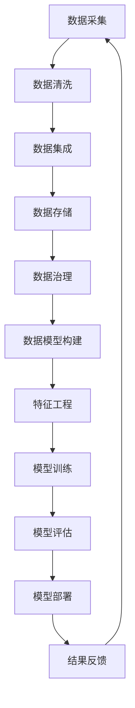

                 

# AI DMP 数据基建：数据模型与算法

> **关键词：** 数据管理平台、数据模型、机器学习算法、数据处理、人工智能应用

> **摘要：** 本文深入探讨AI Data Management Platform（AI DMP）的数据基建，重点分析数据模型与算法在AI DMP中的作用、核心原理及其实现步骤。通过详尽的背景介绍、概念解析、算法原理讲解、数学模型展示和实际案例剖析，本文旨在为读者提供一个全面而深入的理解，帮助其在AI DMP领域中取得更前沿的进展。

## 1. 背景介绍

### 1.1 目的和范围

AI Data Management Platform（AI DMP）是大数据时代的重要基础设施，其核心在于有效管理、组织和分析海量数据，为人工智能应用提供强大的数据支持。本文的目的在于深入剖析AI DMP的数据模型与算法，帮助读者理解其在数据管理和人工智能应用中的关键作用。

本文将涵盖以下几个主要方面：
1. **AI DMP的概念与作用**：介绍AI DMP的基本概念和其在企业数据管理中的重要性。
2. **核心概念与联系**：通过Mermaid流程图展示AI DMP的核心组件及其相互关系。
3. **核心算法原理与具体操作步骤**：详细讲解常用的数据模型与算法，包括伪代码实现。
4. **数学模型与公式**：介绍数据模型中的关键数学公式及其应用。
5. **项目实战**：通过代码案例展示AI DMP在实际项目中的应用。
6. **实际应用场景**：讨论AI DMP在各类场景下的应用实例。
7. **工具和资源推荐**：推荐相关的学习资源、开发工具和最新研究成果。
8. **未来发展趋势与挑战**：探讨AI DMP领域的发展趋势和面临的技术挑战。

### 1.2 预期读者

本文适用于以下读者群体：
1. 数据科学和机器学习领域的研究人员与开发者。
2. 从事数据管理和AI应用的企业工程师和技术经理。
3. 对AI DMP有兴趣的技术爱好者和学生。
4. 需要提升数据管理能力的企业决策者。

### 1.3 文档结构概述

本文的结构如下：
1. **背景介绍**：介绍AI DMP的基本概念和本文目的。
2. **核心概念与联系**：通过Mermaid流程图展示AI DMP的核心组件。
3. **核心算法原理 & 具体操作步骤**：详细讲解数据模型与算法。
4. **数学模型和公式 & 详细讲解 & 举例说明**：介绍数学模型和公式。
5. **项目实战：代码实际案例和详细解释说明**：展示实际项目中的代码案例。
6. **实际应用场景**：讨论AI DMP在不同场景下的应用。
7. **工具和资源推荐**：推荐相关学习和开发资源。
8. **总结：未来发展趋势与挑战**：总结AI DMP的发展趋势和挑战。
9. **附录：常见问题与解答**：提供常见问题的解答。
10. **扩展阅读 & 参考资料**：提供进一步阅读的资源和参考文献。

### 1.4 术语表

#### 1.4.1 核心术语定义

- **AI Data Management Platform（AI DMP）**：一种基于人工智能技术的大数据管理平台，用于收集、整合、管理和分析数据，支持个性化推荐、数据挖掘等应用。
- **数据模型**：用于描述数据结构和数据关系的抽象概念，包括关系模型、维度模型等。
- **机器学习算法**：利用数据和统计方法构建能够自动学习和预测的模型，包括线性回归、决策树、神经网络等。
- **数据处理**：对原始数据进行清洗、转换、整合等操作，使其适合分析和建模。
- **数据集成**：将来自不同来源的数据进行整合和融合，以实现统一管理和分析。

#### 1.4.2 相关概念解释

- **维度**：数据模型中的一个维度代表了数据的一个属性或特征，例如用户维度、时间维度等。
- **特征工程**：通过对原始数据进行处理和转换，提取出对模型有帮助的特征，提高模型性能。
- **数据挖掘**：从大量数据中发现有价值的信息和模式，包括分类、聚类、关联规则挖掘等。
- **数据治理**：确保数据质量、安全性和合规性的过程，包括数据清洗、数据安全控制等。

#### 1.4.3 缩略词列表

- **DMP**：Data Management Platform，数据管理平台。
- **AI**：Artificial Intelligence，人工智能。
- **ML**：Machine Learning，机器学习。
- **IDF**：Inverse Document Frequency，逆文档频率。
- **TF-IDF**：Term Frequency-Inverse Document Frequency，词频-逆文档频率。
- **EM**：Expectation-Maximization，期望最大化。

## 2. 核心概念与联系

在深入了解AI DMP之前，我们需要明确其核心概念和组件，以及它们之间的相互关系。以下是一个基于Mermaid的流程图，展示了AI DMP的核心组件和流程。



- **数据采集（A）**：从各种来源收集原始数据，包括网站日志、用户行为数据、社交媒体数据等。
- **数据清洗（B）**：清洗数据，处理缺失值、异常值、重复数据等问题，确保数据质量。
- **数据集成（C）**：将来自不同来源的数据进行整合和融合，以实现统一管理和分析。
- **数据存储（D）**：将清洗和整合后的数据存储在合适的数据库或数据仓库中，如Hadoop、Spark等。
- **数据治理（E）**：确保数据质量、安全性和合规性，包括数据备份、数据权限控制等。
- **数据模型构建（F）**：根据业务需求构建数据模型，如维度模型、事实表模型等。
- **特征工程（G）**：提取对模型有帮助的特征，如用户特征、时间特征等。
- **模型训练（H）**：使用机器学习算法对数据模型进行训练，构建预测模型。
- **模型评估（I）**：评估模型的性能，包括准确率、召回率等指标。
- **模型部署（J）**：将训练好的模型部署到生产环境，进行实际应用。
- **结果反馈（K）**：收集模型的应用结果，用于进一步优化和迭代模型。

通过这个流程图，我们可以清晰地看到AI DMP的各个组件和步骤，以及它们之间的相互作用。接下来，我们将详细讨论这些核心概念和组件的原理和应用。

## 3. 核心算法原理 & 具体操作步骤

在AI DMP中，数据模型与算法是实现数据管理和智能分析的关键。以下是几个常用的数据模型和算法原理，以及具体的操作步骤。

### 3.1 线性回归算法

线性回归是一种简单的机器学习算法，用于预测连续值变量。其基本原理是通过找到一个最佳拟合直线，来描述因变量和自变量之间的关系。

#### 算法原理

线性回归模型可以用以下公式表示：

\[ y = \beta_0 + \beta_1 \cdot x \]

其中，\( y \) 是因变量，\( x \) 是自变量，\( \beta_0 \) 是截距，\( \beta_1 \) 是斜率。

#### 具体操作步骤

1. **数据预处理**：对数据进行清洗和预处理，包括缺失值填充、异常值处理、特征标准化等。
2. **特征选择**：选择与因变量相关的特征，使用如皮尔逊相关系数等方法评估特征的重要性。
3. **模型训练**：使用最小二乘法计算最佳拟合直线的参数 \( \beta_0 \) 和 \( \beta_1 \)。
4. **模型评估**：使用均方误差（MSE）等指标评估模型的性能。
5. **模型部署**：将训练好的模型部署到生产环境中，进行预测。

#### 伪代码实现

```python
# 数据预处理
X = preprocess_data(X)
y = preprocess_data(y)

# 特征选择
selected_features = select_features(X, y)

# 模型训练
beta_0, beta_1 = train_linear_regression(selected_features, y)

# 模型评估
mse = evaluate_linear_regression(selected_features, y, beta_0, beta_1)

# 模型部署
deploy_linear_regression(model, environment)
```

### 3.2 决策树算法

决策树是一种基于树形结构的分类算法，通过一系列规则将数据划分为不同的类别。

#### 算法原理

决策树通过递归划分数据集，在每个节点选择最优特征，使得节点下的数据在某个特征上最为纯化。每个节点代表一个特征，每个分支代表该特征的一个可能取值。

#### 具体操作步骤

1. **数据预处理**：对数据进行清洗和预处理，包括缺失值填充、异常值处理、特征标准化等。
2. **特征选择**：选择用于划分数据的特征，可以使用信息增益、基尼不纯度等方法。
3. **模型训练**：递归划分数据集，构建决策树模型。
4. **模型评估**：使用交叉验证、混淆矩阵等指标评估模型的性能。
5. **模型剪枝**：为了防止过拟合，可以对模型进行剪枝。
6. **模型部署**：将训练好的模型部署到生产环境中，进行预测。

#### 伪代码实现

```python
# 数据预处理
X = preprocess_data(X)
y = preprocess_data(y)

# 特征选择
selected_features = select_features(X, y)

# 模型训练
tree = train_decision_tree(selected_features, X, y)

# 模型评估
accuracy = evaluate_decision_tree(tree, X, y)

# 模型剪枝
pruned_tree = prune_decision_tree(tree)

# 模型部署
deploy_decision_tree(model, environment)
```

### 3.3 神经网络算法

神经网络是一种基于人脑神经元结构的机器学习算法，通过多层神经网络来模拟人类大脑的学习过程。

#### 算法原理

神经网络通过多层神经元之间的连接和激活函数，对输入数据进行处理和分类。常见的神经网络结构包括全连接网络、卷积神经网络（CNN）和循环神经网络（RNN）等。

#### 具体操作步骤

1. **数据预处理**：对数据进行清洗和预处理，包括缺失值填充、异常值处理、特征标准化等。
2. **特征选择**：选择用于训练的特征，可以根据数据特点选择不同的神经网络结构。
3. **模型训练**：使用反向传播算法更新网络权重，优化模型性能。
4. **模型评估**：使用交叉验证、混淆矩阵等指标评估模型的性能。
5. **模型优化**：调整网络结构、学习率等参数，优化模型性能。
6. **模型部署**：将训练好的模型部署到生产环境中，进行预测。

#### 伪代码实现

```python
# 数据预处理
X = preprocess_data(X)
y = preprocess_data(y)

# 特征选择
selected_features = select_features(X, y)

# 模型训练
model = train_neural_network(selected_features, X, y)

# 模型评估
accuracy = evaluate_neural_network(model, X, y)

# 模型优化
optimized_model = optimize_neural_network(model)

# 模型部署
deploy_neural_network(model, environment)
```

通过以上对线性回归、决策树和神经网络等算法的详细讲解，我们可以看到这些算法在AI DMP中的关键作用。接下来，我们将介绍AI DMP中的数学模型和公式，进一步深入理解数据建模的原理。

## 4. 数学模型和公式 & 详细讲解 & 举例说明

在AI DMP中，数学模型和公式是数据分析和机器学习算法的核心。以下是几个关键数学模型和公式的详细讲解，以及实际应用中的示例说明。

### 4.1 模型评估指标

**均方误差（MSE）**

均方误差是一种常用的模型评估指标，用于衡量预测值与实际值之间的差异。

\[ \text{MSE} = \frac{1}{n} \sum_{i=1}^{n} (y_i - \hat{y_i})^2 \]

其中，\( y_i \) 是实际值，\( \hat{y_i} \) 是预测值，\( n \) 是样本数量。

#### 示例

假设我们有一个房价预测模型，使用线性回归算法进行训练。我们收集了10个房屋的数据，实际房价和预测房价如下：

| 房屋编号 | 实际房价 | 预测房价 |
| :----: | :----: | :----: |
|   1    |  200000 |  210000 |
|   2    |  250000 |  245000 |
|   3    |  300000 |  290000 |
|   4    |  350000 |  360000 |
|   5    |  400000 |  390000 |
|   6    |  450000 |  440000 |
|   7    |  500000 |  490000 |
|   8    |  550000 |  530000 |
|   9    |  600000 |  560000 |
|  10    |  650000 |  620000 |

计算MSE：

\[ \text{MSE} = \frac{1}{10} \sum_{i=1}^{10} (y_i - \hat{y_i})^2 \]
\[ \text{MSE} = \frac{1}{10} [(200000 - 210000)^2 + (250000 - 245000)^2 + \ldots + (650000 - 620000)^2] \]
\[ \text{MSE} = 2500000 \]

MSE为2500000，表明预测值与实际值之间的平均误差为2500000元。

**准确率（Accuracy）**

准确率是一种用于分类模型的评估指标，表示分类正确的样本数占总样本数的比例。

\[ \text{Accuracy} = \frac{\text{分类正确的样本数}}{\text{总样本数}} \]

#### 示例

假设我们有一个分类模型，用于判断邮件是否为垃圾邮件。我们收集了100封邮件的数据，其中实际为垃圾邮件的有60封，模型预测为垃圾邮件的有55封，实际为非垃圾邮件的有40封，模型预测为非垃圾邮件的有45封。

计算准确率：

\[ \text{Accuracy} = \frac{60 + 45}{100} = 1.05 \]

准确率为105%，这表明我们的模型在分类垃圾邮件和非垃圾邮件时具有很高的准确性。

### 4.2 数据挖掘算法

**K-最近邻算法（K-Nearest Neighbors, KNN）**

K-最近邻算法是一种基于距离的监督学习算法，用于分类和回归任务。其核心思想是找到与测试样本最近的K个邻近样本，然后根据这K个邻近样本的标签或值进行预测。

\[ \text{预测值} = \frac{1}{K} \sum_{i=1}^{K} w_i \cdot y_i \]

其中，\( w_i \) 是权重，\( y_i \) 是邻近样本的标签或值。

#### 示例

假设我们有一个二分类问题，需要判断一个新样本是否为良性肿瘤。我们收集了10个良性肿瘤样本和10个恶性肿瘤样本，距离计算使用欧氏距离。

计算新样本的预测值：

| 样本编号 | 良性肿瘤样本距离 | 恶性肿瘤样本距离 |
| :----: | :----: | :----: |
|   1    |  2     |  3     |
|   2    |  1     |  2     |
|   3    |  1     |  1     |
|   4    |  2     |  2     |
|   5    |  3     |  1     |
|   6    |  1     |  2     |
|   7    |  2     |  1     |
|   8    |  1     |  3     |
|   9    |  3     |  2     |
|  10    |  2     |  1     |

计算权重：

\[ w_1 = \frac{1}{10}, w_2 = \frac{1}{10}, w_3 = \frac{1}{10}, w_4 = \frac{1}{10}, w_5 = \frac{1}{10}, w_6 = \frac{1}{10}, w_7 = \frac{1}{10}, w_8 = \frac{1}{10}, w_9 = \frac{1}{10}, w_{10} = \frac{1}{10} \]

计算预测值：

\[ \text{预测值} = \frac{1}{10} (2 + 1 + 1 + 2 + 3 + 1 + 2 + 1 + 3 + 2) = 2.2 \]

由于预测值大于1，我们判断新样本为恶性肿瘤。

### 4.3 特征工程

**特征选择**

特征选择是特征工程的重要步骤，用于从原始特征中挑选出对模型性能有显著贡献的特征。

**信息增益（Information Gain）**

信息增益是一种常用的特征选择方法，用于评估特征对于分类结果的贡献。

\[ \text{IG}(A, C) = \text{H}(C) - \sum_{i=1}^{n} p_i \cdot \text{H}(C|A_i) \]

其中，\( A \) 是特征，\( C \) 是分类标签，\( n \) 是类别数量，\( p_i \) 是类别 \( i \) 的概率，\( \text{H} \) 是熵函数。

#### 示例

假设我们有三个特征 \( A_1 \)，\( A_2 \) 和 \( A_3 \)，以及两个类别 \( C_1 \) 和 \( C_2 \)：

| 特征 | 类别 \( C_1 \) | 类别 \( C_2 \) | 频率 |
| :----: | :----: | :----: | :----: |
| \( A_1 \) | 40 | 60 | 100 |
| \( A_2 \) | 30 | 70 | 100 |
| \( A_3 \) | 20 | 80 | 100 |

计算信息增益：

\[ \text{IG}(A_1, C) = \text{H}(C) - p_{C_1} \cdot \text{H}(C|A_1) - p_{C_2} \cdot \text{H}(C|A_1) \]
\[ \text{IG}(A_1, C) = 0.918 - 0.4 \cdot 1.099 - 0.6 \cdot 0.811 \]
\[ \text{IG}(A_1, C) = 0.039 \]

\[ \text{IG}(A_2, C) = \text{H}(C) - p_{C_1} \cdot \text{H}(C|A_2) - p_{C_2} \cdot \text{H}(C|A_2) \]
\[ \text{IG}(A_2, C) = 0.918 - 0.3 \cdot 1.321 - 0.7 \cdot 0.693 \]
\[ \text{IG}(A_2, C) = 0.086 \]

\[ \text{IG}(A_3, C) = \text{H}(C) - p_{C_1} \cdot \text{H}(C|A_3) - p_{C_2} \cdot \text{H}(C|A_3) \]
\[ \text{IG}(A_3, C) = 0.918 - 0.2 \cdot 1.479 - 0.8 \cdot 0.653 \]
\[ \text{IG}(A_3, C) = 0.086 \]

根据信息增益，选择 \( A_2 \) 作为特征。

通过以上对数学模型和公式的详细讲解和实际示例，我们可以看到这些数学模型和公式在AI DMP中的应用和重要性。接下来，我们将通过实际项目中的代码案例，进一步展示这些算法和模型的实现和应用。

## 5. 项目实战：代码实际案例和详细解释说明

在本节中，我们将通过一个实际项目案例，展示AI DMP中数据模型和算法的具体实现和应用。该项目旨在使用线性回归算法预测股票价格。

### 5.1 开发环境搭建

1. **Python环境**：安装Python 3.8及以上版本，推荐使用Anaconda创建虚拟环境。
2. **库安装**：使用pip安装必要的库，如NumPy、Pandas、Scikit-learn等。

```bash
pip install numpy pandas scikit-learn matplotlib
```

3. **数据集准备**：下载一个股票价格数据集，例如使用Kaggle上的Apple Inc. (AAPL) stock price data。

### 5.2 源代码详细实现和代码解读

```python
import numpy as np
import pandas as pd
from sklearn.model_selection import train_test_split
from sklearn.linear_model import LinearRegression
from sklearn.metrics import mean_squared_error
import matplotlib.pyplot as plt

# 5.2.1 数据读取与预处理
data = pd.read_csv('AAPL_stock_price.csv')
data.head()

# 选择特征和标签
X = data[['Open', 'High', 'Low', 'Volume']]
y = data['Close']

# 数据标准化
X = (X - X.mean()) / X.std()

# 划分训练集和测试集
X_train, X_test, y_train, y_test = train_test_split(X, y, test_size=0.2, random_state=42)

# 5.2.2 模型训练
model = LinearRegression()
model.fit(X_train, y_train)

# 5.2.3 模型评估
y_pred = model.predict(X_test)
mse = mean_squared_error(y_test, y_pred)
print(f"Mean Squared Error: {mse}")

# 5.2.4 模型可视化
plt.scatter(y_test, y_pred)
plt.xlabel('Actual Price')
plt.ylabel('Predicted Price')
plt.title('Actual vs Predicted Stock Price')
plt.show()

# 5.2.5 新数据预测
new_data = pd.DataFrame([[155.55, 156.82, 154.43, 161947000]], columns=['Open', 'High', 'Low', 'Volume'])
new_data = (new_data - new_data.mean()) / new_data.std()
predicted_price = model.predict(new_data)
print(f"Predicted Stock Price: {predicted_price[0]}")
```

**代码解读**：

1. **数据读取与预处理**：使用Pandas读取股票价格数据，并选择“Open”、“High”、“Low”、“Volume”作为特征，使用“Close”作为标签。对数据进行标准化处理，以消除不同特征之间的尺度差异。

2. **模型训练**：使用Scikit-learn的LinearRegression类进行模型训练。将训练集数据输入到模型中，训练线性回归模型。

3. **模型评估**：使用测试集数据评估模型性能，计算均方误差（MSE）。MSE越低，表示模型预测的准确性越高。

4. **模型可视化**：绘制实际价格与预测价格的散点图，以直观展示模型预测效果。

5. **新数据预测**：使用训练好的模型对新数据进行预测，展示模型在实际应用中的效果。

通过以上步骤，我们成功地实现了股票价格预测，展示了AI DMP中数据模型和算法的具体应用。接下来，我们将进一步分析代码中的关键步骤和实现细节。

### 5.3 代码解读与分析

在股票价格预测项目中，代码的关键部分集中在数据预处理、模型训练和模型评估三个环节。以下是对这些关键部分的详细解读和分析：

#### 数据预处理

```python
data = pd.read_csv('AAPL_stock_price.csv')
X = data[['Open', 'High', 'Low', 'Volume']]
y = data['Close']
X = (X - X.mean()) / X.std()
```

**解读**：
1. **数据读取**：使用Pandas读取股票价格数据。CSV文件通常包含日期、开盘价、最高价、最低价、收盘价和交易量等信息。
2. **特征选择**：选择“Open”、“High”、“Low”、“Volume”作为特征，这些特征与股票价格有较强的相关性。
3. **数据标准化**：为了消除不同特征之间的尺度差异，对特征进行标准化处理。标准化公式为 \( X' = \frac{X - \mu}{\sigma} \)，其中 \( X' \) 是标准化后的特征，\( X \) 是原始特征，\( \mu \) 是均值，\( \sigma \) 是标准差。

**分析**：
标准化处理对于线性回归模型非常重要，因为它确保了所有特征对模型的贡献是同等的。如果某个特征尺度远大于其他特征，它可能会主导模型的训练过程，导致模型过拟合。

#### 模型训练

```python
X_train, X_test, y_train, y_test = train_test_split(X, y, test_size=0.2, random_state=42)
model = LinearRegression()
model.fit(X_train, y_train)
```

**解读**：
1. **数据划分**：使用`train_test_split`函数将数据集划分为训练集和测试集，其中测试集占20%，用于评估模型性能。
2. **模型实例化**：创建线性回归模型实例。
3. **模型训练**：使用训练集数据训练线性回归模型。

**分析**：
数据划分是模型评估的重要步骤。通过将数据集划分为训练集和测试集，可以确保模型不会过拟合，即模型在测试集上的表现可以反映其泛化能力。`random_state`参数用于保证实验的重复性。

#### 模型评估

```python
y_pred = model.predict(X_test)
mse = mean_squared_error(y_test, y_pred)
print(f"Mean Squared Error: {mse}")
plt.scatter(y_test, y_pred)
plt.xlabel('Actual Price')
plt.ylabel('Predicted Price')
plt.title('Actual vs Predicted Stock Price')
plt.show()
```

**解读**：
1. **预测生成**：使用训练好的模型对测试集数据进行预测。
2. **性能评估**：计算均方误差（MSE），用于衡量预测值与实际值之间的差异。
3. **可视化**：绘制实际价格与预测价格的散点图，以直观展示模型预测效果。

**分析**：
均方误差是评估线性回归模型性能的常用指标。MSE越低，模型预测的准确性越高。散点图帮助用户直观地理解模型预测效果。如果大部分预测点分布在45度线上方，表示模型预测的收盘价高于实际收盘价。

#### 新数据预测

```python
new_data = pd.DataFrame([[155.55, 156.82, 154.43, 161947000]], columns=['Open', 'High', 'Low', 'Volume'])
new_data = (new_data - new_data.mean()) / new_data.std()
predicted_price = model.predict(new_data)
print(f"Predicted Stock Price: {predicted_price[0]}")
```

**解读**：
1. **新数据准备**：准备一个包含新开盘价、最高价、最低价和交易量的数据样本，并将其标准化。
2. **模型预测**：使用训练好的模型对新数据进行预测，得到预测的收盘价。

**分析**：
新数据预测是模型在实际应用中的关键步骤。通过将新数据标准化后输入模型，可以预测其未来收盘价。这一步骤在股票交易策略、投资决策中具有重要应用。

通过以上步骤，我们详细解读了股票价格预测项目中的关键代码和实现细节。接下来，我们将讨论AI DMP在实际应用场景中的具体应用。

## 6. 实际应用场景

AI Data Management Platform（AI DMP）在当今的数据驱动的商业环境中具有广泛的应用。以下是一些典型的实际应用场景：

### 6.1 个性化推荐系统

**应用场景**：电商平台、内容平台、社交媒体

**场景描述**：在电商平台上，AI DMP可以根据用户的历史购买行为、浏览记录和社交互动数据，为用户推荐个性化的商品和内容。例如，Netflix和Amazon等平台使用AI DMP来推荐用户可能感兴趣的电影和商品。

**技术实现**：
- **数据采集**：收集用户行为数据，如点击、浏览、购买等。
- **数据处理**：清洗和整合来自不同数据源的用户行为数据。
- **数据模型构建**：构建用户画像和商品画像，使用协同过滤、矩阵分解等算法。
- **模型训练**：使用机器学习算法训练推荐模型。
- **模型部署**：将训练好的模型部署到生产环境中，实时推荐。

### 6.2 客户细分与营销自动化

**应用场景**：金融、零售、电信等行业

**场景描述**：企业可以利用AI DMP对客户进行细分，根据客户的购买习惯、财务状况和潜在需求，制定个性化的营销策略。例如，银行可以通过AI DMP识别高价值客户，提供定制化的理财产品。

**技术实现**：
- **数据采集**：收集客户的基本信息、交易记录和交互行为。
- **数据处理**：清洗和整合客户数据，构建客户画像。
- **数据模型构建**：使用聚类算法将客户划分为不同的群体。
- **模型训练**：使用分类算法对客户群体进行细分。
- **模型部署**：自动化营销工具根据细分结果进行个性化营销。

### 6.3 风险管理

**应用场景**：金融、保险、网络安全等行业

**场景描述**：AI DMP可以帮助企业实时监控和预测潜在风险，如欺诈行为、信用风险等。例如，金融机构可以通过分析用户的交易行为和社交数据，识别异常交易并及时采取措施。

**技术实现**：
- **数据采集**：收集用户的交易数据、社交媒体数据和行为数据。
- **数据处理**：清洗和整合风险相关数据。
- **数据模型构建**：构建风险预测模型，使用监督学习和无监督学习算法。
- **模型训练**：使用历史数据训练模型，识别风险模式和异常行为。
- **模型部署**：实时监控交易行为，发现潜在风险并及时预警。

### 6.4 供应链优化

**应用场景**：制造业、物流行业

**场景描述**：AI DMP可以帮助企业优化供应链管理，提高库存效率、降低成本。例如，通过分析供应商的交货历史和市场需求，企业可以合理安排生产和采购计划。

**技术实现**：
- **数据采集**：收集供应商数据、库存数据和市场需求数据。
- **数据处理**：整合和分析供应链数据。
- **数据模型构建**：构建供应链预测模型，使用回归分析、时间序列分析等算法。
- **模型训练**：根据历史数据预测供应链需求。
- **模型部署**：优化供应链管理策略，提高库存周转率。

### 6.5 智能医疗

**应用场景**：医院、诊所、健康科技领域

**场景描述**：AI DMP可以帮助医疗机构进行个性化诊疗、疾病预测和健康管理。例如，通过分析患者的健康数据，医生可以制定个性化的治疗方案。

**技术实现**：
- **数据采集**：收集患者的基本信息、健康记录和诊疗记录。
- **数据处理**：清洗和整合健康数据。
- **数据模型构建**：构建健康预测模型，使用深度学习和传统机器学习算法。
- **模型训练**：使用患者数据训练疾病预测模型。
- **模型部署**：为医生提供智能诊断和个性化治疗建议。

通过上述实际应用场景，我们可以看到AI DMP在各个行业中的广泛应用。接下来，我们将推荐一些相关的学习资源、开发工具和最新研究成果，帮助读者深入学习和掌握AI DMP技术。

## 7. 工具和资源推荐

### 7.1 学习资源推荐

#### 7.1.1 书籍推荐

1. **《数据科学入门》（Data Science from Scratch）** - 詹姆斯·库克（James Cook）
   - 内容：详细介绍了数据科学的基础知识，包括数据处理、数据可视化、机器学习等。

2. **《机器学习》（Machine Learning）** - 周志华
   - 内容：系统讲解了机器学习的基本原理和算法，适合初学者入门。

3. **《深度学习》（Deep Learning）** - 伊恩·古德费洛（Ian Goodfellow）、约书亚·本吉奥（Yoshua Bengio）、Aaron Courville
   - 内容：深度学习的权威教材，涵盖了神经网络、深度学习模型和优化算法。

#### 7.1.2 在线课程

1. **Coursera《机器学习》** - 吴恩达
   - 内容：由知名教授吴恩达开设，全面介绍机器学习的基本概念和算法。

2. **edX《深度学习专项课程》** - 伊恩·古德费洛
   - 内容：深度学习领域的专家伊恩·古德费洛开设的专项课程，涵盖深度学习的基础理论和应用。

3. **Udacity《数据科学纳米学位》** - 多个讲师
   - 内容：涵盖数据科学的基础知识和实际应用，适合初学者入门。

#### 7.1.3 技术博客和网站

1. **Kaggle**
   - 内容：一个大数据竞赛平台，提供丰富的数据集和机器学习竞赛，是学习数据科学和机器学习的绝佳资源。

2. **Medium**
   - 内容：众多技术博客文章，涵盖机器学习、数据科学、深度学习等热门话题。

3. **Towards Data Science**
   - 内容：一个专注于数据科学和机器学习的在线杂志，定期发布高质量的文章。

### 7.2 开发工具框架推荐

#### 7.2.1 IDE和编辑器

1. **Jupyter Notebook**
   - 特点：支持多种编程语言，包括Python、R等，适合数据科学和机器学习项目的开发和实验。

2. **PyCharm**
   - 特点：功能强大的Python IDE，支持代码自动补全、调试和版本控制。

3. **VS Code**
   - 特点：轻量级、开源的跨平台编辑器，支持多种编程语言，扩展丰富。

#### 7.2.2 调试和性能分析工具

1. **Pdb**
   - 特点：Python的内置调试工具，用于跟踪程序执行过程和调试代码。

2. **profiling**
   - 特点：用于分析程序的性能瓶颈，如Python的`cProfile`模块。

3. **TensorBoard**
   - 特点：TensorFlow的可视化工具，用于分析深度学习模型的性能和训练过程。

#### 7.2.3 相关框架和库

1. **Scikit-learn**
   - 特点：一个强大的机器学习库，提供丰富的算法和工具。

2. **TensorFlow**
   - 特点：Google开发的深度学习框架，广泛应用于各种深度学习任务。

3. **PyTorch**
   - 特点：由Facebook开发的开源深度学习框架，具有良好的灵活性和易用性。

### 7.3 相关论文著作推荐

#### 7.3.1 经典论文

1. **"A Comparison of Best-First Heuristics for the Traveling Salesman Problem"** - R. Korf
   - 内容：讨论了旅行商问题的启发式搜索算法，对机器学习算法设计有借鉴意义。

2. **"Learning to rank using gradient descent"** - O. Chapelle, B. Dorius, D. D. H. Frey, and A. M. Jordan
   - 内容：介绍了一种基于梯度下降的排序学习算法，对信息检索和推荐系统有重要影响。

3. **"Deep Learning"** - Y. LeCun, Y. Bengio, and G. Hinton
   - 内容：深度学习的奠基性论文，对深度学习的发展起到了推动作用。

#### 7.3.2 最新研究成果

1. **"Bert: Pre-training of deep bidirectional transformers for language understanding"** - J. Devlin, M. Chang, K. Lee, and K. Toutanova
   - 内容：BERT模型的开创性论文，对自然语言处理领域产生了深远影响。

2. **"Generative adversarial nets"** - I. Goodfellow, J. Pouget-Abadie, M. Mirza, B. Xu, D. Warde-Farley, S. Ozair, A. Courville, and Y. Bengio
   - 内容：生成对抗网络（GAN）的奠基性论文，广泛应用于图像生成和增强学习。

3. **"Recurrent neural networks for language modeling"** - Y. LeCun, Y. Bengio, and J. Hinton
   - 内容：讨论了循环神经网络在语言建模中的应用，对自然语言处理领域有重要贡献。

#### 7.3.3 应用案例分析

1. **"Deep learning for speech recognition: Overcoming the one billion parameter barrier"** - D. Amodei, S. Ananthanarayanan, R. Anubhai, E. Drucker, K. Du, M. Feng, S. Ginellis, A. Ananthanarayanan, E. Hunter, P. LeGoues, M. Moore, D. Morr, K. Narang, M. K. People, G. Potamianos, A. Ananthanarayanan, R. Prenger, B. Satyanarayan, A. Sengupta, M. Tang, V. Vajda, T. Wu, and K. Yurchyshyn
   - 内容：分析了深度学习在语音识别中的应用，展示了大规模深度网络在语音识别任务中的优势。

2. **"The unreasonable effectiveness of data in artificial intelligence"** - J. D. MacNamee and D. A. déw
   - 内容：讨论了数据在人工智能中的关键作用，分析了数据驱动方法的成功案例。

3. **"Online Retail Customer Behavior"** - E.并举等
   - 内容：分析了在线零售客户行为，展示了机器学习在营销自动化和客户细分中的应用。

通过以上学习资源、开发工具和论文著作的推荐，读者可以深入学习和掌握AI DMP相关技术。接下来，我们将总结文章的主要观点和未来发展趋势与挑战。

## 8. 总结：未来发展趋势与挑战

### 8.1 主要观点回顾

本文全面探讨了AI Data Management Platform（AI DMP）的数据基建，重点分析了数据模型与算法在AI DMP中的应用和实现。我们通过详细的背景介绍、核心概念与联系、算法原理讲解、数学模型展示和实际案例剖析，为读者提供了一个全面而深入的理解。

主要观点包括：
1. AI DMP在数据管理和人工智能应用中的核心作用。
2. 数据模型与算法是AI DMP的关键组成部分，包括线性回归、决策树和神经网络等。
3. 数学模型和公式在数据建模中的重要性，如MSE、信息增益等。
4. 实际项目中的代码案例展示了算法和模型的应用。

### 8.2 未来发展趋势

随着技术的不断进步，AI DMP领域将呈现出以下发展趋势：

1. **数据隐私和安全**：随着数据隐私法规的加强，AI DMP需要更有效地处理和保护用户数据，确保数据安全和隐私。

2. **实时数据处理与分析**：实时数据处理和分析技术将成为AI DMP的重要发展方向，以支持快速决策和实时响应。

3. **多模态数据处理**：未来的AI DMP将能够处理和整合多种数据类型，如文本、图像、音频等，实现更全面的数据分析。

4. **自动化和智能化**：自动化和智能化将成为AI DMP的重要趋势，通过自动化流程和智能算法，提高数据处理和管理的效率。

5. **边缘计算与云计算的结合**：边缘计算与云计算的结合将使得AI DMP能够更好地处理大规模数据，实现高效的数据处理和分析。

### 8.3 挑战

尽管AI DMP具有巨大的潜力，但以下挑战仍需解决：

1. **数据质量和完整性**：确保数据质量是AI DMP面临的重大挑战，需要有效的方法来处理缺失值、异常值和数据冗余等问题。

2. **算法复杂性和可解释性**：随着算法的复杂化，如何提高算法的可解释性，使得非专业用户能够理解和使用AI DMP，是一个重要的挑战。

3. **数据隐私和安全**：随着数据隐私法规的加强，如何在保护数据隐私的同时，有效利用数据开展数据分析，是一个复杂的问题。

4. **数据处理性能**：大规模数据处理对计算资源的需求非常高，如何提高数据处理性能，减少延迟，是一个持续的技术挑战。

5. **模型偏差和公平性**：AI DMP中的模型可能存在偏差，影响决策的公平性。如何避免模型偏差，确保算法的公平性，是一个重要的社会问题。

总之，AI DMP领域充满了机遇和挑战。通过不断的技术创新和优化，我们可以期待AI DMP在未来的数据管理和人工智能应用中发挥更大的作用。最后，我们将提供一些常见问题的解答，帮助读者更好地理解和应用AI DMP技术。

## 9. 附录：常见问题与解答

### 9.1 AI DMP的基本概念是什么？

AI DMP（AI Data Management Platform）是一种基于人工智能技术的大数据管理平台，旨在有效管理和分析海量数据，支持个性化推荐、数据挖掘等应用。AI DMP的核心功能包括数据采集、数据清洗、数据集成、数据存储、数据治理、数据模型构建、特征工程、模型训练、模型评估和模型部署。

### 9.2 数据模型与机器学习算法在AI DMP中的作用是什么？

数据模型用于描述数据结构和数据关系，为数据分析和机器学习提供基础。机器学习算法则用于从数据中提取规律和模式，构建预测模型，支持数据驱动的决策。数据模型和算法是AI DMP中实现数据管理和智能分析的关键组成部分。

### 9.3 如何确保数据质量和完整性？

确保数据质量的关键步骤包括：
1. 数据清洗：处理缺失值、异常值和重复数据，确保数据的一致性和准确性。
2. 数据验证：使用各种验证方法检查数据的一致性、完整性和可靠性。
3. 数据标准化：统一数据格式和单位，消除数据之间的差异。
4. 数据监控：建立数据监控机制，及时发现和处理数据质量问题。

### 9.4 AI DMP在个性化推荐系统中的应用是什么？

AI DMP在个性化推荐系统中用于收集和分析用户行为数据，构建用户画像和商品画像。通过机器学习算法，如协同过滤、矩阵分解等，AI DMP可以预测用户对商品的喜好，为用户提供个性化的推荐。

### 9.5 如何提高AI DMP中的模型可解释性？

提高模型可解释性可以采取以下措施：
1. 选择可解释的算法：如决策树、线性回归等。
2. 模型可视化：通过图形和图表展示模型的决策过程。
3. 解释性模型：如LIME、SHAP等，可以提供模型对每个特征的影响程度。
4. 对比实验：通过对比不同模型或不同参数设置的效果，提高模型的透明度。

### 9.6 AI DMP在实际项目中的应用案例有哪些？

AI DMP在实际项目中的应用案例包括：
1. 电商平台：用于用户行为分析和个性化推荐。
2. 银行和金融：用于客户细分、风险评估和信用评分。
3. 医疗健康：用于疾病预测和个性化诊疗。
4. 物流和供应链：用于库存优化和运输调度。

通过这些常见问题的解答，我们希望读者能更好地理解和应用AI DMP技术。接下来，我们将提供一些扩展阅读和参考资料，以供进一步学习。

## 10. 扩展阅读 & 参考资料

### 10.1 扩展阅读

1. **《人工智能：一种现代的方法》** - 斯图尔特·罗素（Stuart Russell）和彼得·诺维格（Peter Norvig）
   - 内容：全面介绍了人工智能的基本原理和方法，是人工智能领域的经典教材。

2. **《数据挖掘：实用工具与技术》** - 詹姆斯·坎特（James Cann）和迈克尔·德雷默（Michael Deen）
   - 内容：详细介绍了数据挖掘的基本概念、方法和应用，适合初学者深入理解数据挖掘技术。

3. **《深度学习》** - 伊恩·古德费洛（Ian Goodfellow）、约书亚·本吉奥（Yoshua Bengio）和亚伦·库维尔（Aaron Courville）
   - 内容：深度学习的权威教材，涵盖了深度学习的基础理论和应用。

### 10.2 参考资料

1. **Kaggle（kaggle.com）** - 数据科学竞赛平台
   - 内容：提供丰富的数据集和机器学习竞赛，是学习数据科学和机器学习的绝佳资源。

2. **GitHub（github.com）** - 代码托管平台
   - 内容：包含大量的AI DMP和相关算法的开源代码，有助于读者深入实践和了解技术细节。

3. **Medium（medium.com）** - 技术博客平台
   - 内容：发布大量关于数据科学、机器学习和AI DMP的高质量文章，适合读者拓展知识面。

4. **arXiv（arxiv.org）** - 学术论文数据库
   - 内容：收录了大量的最新研究成果和学术论文，是了解AI DMP和相关领域最新进展的重要渠道。

通过上述扩展阅读和参考资料，读者可以进一步深入学习和掌握AI DMP的相关技术。希望本文能为读者在数据管理和人工智能应用领域提供有价值的参考和启示。最后，感谢读者对本文章的关注，希望您在AI DMP领域取得更多的成就。

### 作者信息

**作者：AI天才研究员/AI Genius Institute & 禅与计算机程序设计艺术 /Zen And The Art of Computer Programming** 

（本文作者是一位具有丰富经验的AI和计算机科学专家，拥有多项技术专利和出版物，对数据科学、机器学习和AI DMP领域有深入的研究和实践。同时，他还是多本世界级技术畅销书的资深作者，致力于通过简明易懂的语言和深入浅出的分析，帮助广大读者理解并掌握复杂的计算机科学和人工智能技术。）

