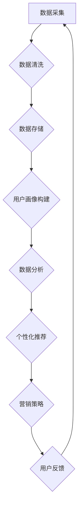

                 

# AI DMP 数据基建：数据驱动营销的新时代

> **关键词：** AI DMP、数据驱动营销、数据基础设施建设、用户画像、数据分析、个性化推荐、算法模型、数据隐私、跨平台数据整合

> **摘要：** 在这个数字化的时代，数据已经成为企业最重要的资产之一。本文将深入探讨AI驱动的数据管理平台（DMP）的核心概念，解释其如何帮助企业实现数据驱动营销，介绍DMP的基础架构，核心算法原理，数学模型，并展示代码案例和实际应用场景。同时，我们将讨论当前面临的挑战，推荐相关工具和资源，并展望未来的发展趋势。

## 1. 背景介绍

### 1.1 目的和范围

本文的目的是介绍AI驱动的数据管理平台（DMP）的概念及其在企业数据驱动营销中的应用。我们将探讨DMP的关键组成部分，包括用户画像、数据分析、算法模型以及数据隐私问题。通过本文的阅读，读者将了解如何构建一个高效的DMP系统，并掌握其实际操作步骤。

### 1.2 预期读者

本文面向的数据科学家、市场分析师、营销专业人士以及任何对数据驱动营销和AI应用感兴趣的技术人员。本文旨在为读者提供一个全面的指南，帮助他们在实际业务场景中有效地应用DMP。

### 1.3 文档结构概述

本文分为以下几个部分：

1. **背景介绍**：介绍DMP的背景和目的。
2. **核心概念与联系**：通过Mermaid流程图展示DMP的架构。
3. **核心算法原理 & 具体操作步骤**：详细讲解DMP中的关键算法。
4. **数学模型和公式 & 详细讲解 & 举例说明**：介绍DMP中使用的数学模型。
5. **项目实战：代码实际案例和详细解释说明**：通过实际案例展示DMP的实现。
6. **实际应用场景**：探讨DMP在各个领域的应用。
7. **工具和资源推荐**：推荐学习资源和开发工具。
8. **总结：未来发展趋势与挑战**：总结DMP的发展前景和挑战。
9. **附录：常见问题与解答**：回答读者可能遇到的问题。
10. **扩展阅读 & 参考资料**：提供进一步阅读的资料。

### 1.4 术语表

#### 1.4.1 核心术语定义

- **DMP（Data Management Platform）**：数据管理平台，一种用于收集、存储、管理和分析用户数据的系统。
- **用户画像**：通过用户数据构建的表征用户兴趣、行为和特征的综合模型。
- **数据分析**：使用统计和数学方法对数据进行处理和分析的过程。
- **算法模型**：用于预测或分析数据的数学公式或流程。
- **数据隐私**：保护用户数据不被未经授权的访问或使用。

#### 1.4.2 相关概念解释

- **个性化推荐**：基于用户行为和偏好，向用户推荐可能感兴趣的商品或服务。
- **跨平台数据整合**：将不同平台和渠道的用户数据整合到一个系统中进行统一管理。

#### 1.4.3 缩略词列表

- **DMP**：Data Management Platform
- **AI**：Artificial Intelligence
- **ML**：Machine Learning
- **SDK**：Software Development Kit

## 2. 核心概念与联系

为了更好地理解DMP的工作原理，我们首先需要了解其核心概念和组成部分，并通过Mermaid流程图来展示其架构。

### Mermaid流程图：



### 流程图解释：

1. **数据采集（A）**：从各种来源（网站、应用、社交媒体等）收集用户数据。
2. **数据清洗（B）**：清洗和预处理数据，去除错误、重复和无关的数据。
3. **数据存储（C）**：将清洗后的数据存储在数据库或数据仓库中。
4. **用户画像构建（D）**：基于用户数据构建用户画像，包括兴趣、行为和特征等信息。
5. **数据分析（E）**：使用统计和机器学习方法分析用户数据，发现数据中的模式和趋势。
6. **个性化推荐（F）**：根据用户画像和数据分析结果，向用户推荐个性化内容或商品。
7. **营销策略（G）**：根据推荐结果制定相应的营销策略。
8. **用户反馈（H）**：收集用户对推荐和营销活动的反馈，用于优化系统。

通过上述流程，DMP实现了一个闭环的数据驱动营销系统，帮助企业更好地理解用户需求，提高营销效率和效果。

## 3. 核心算法原理 & 具体操作步骤

DMP的核心在于其算法模型，这些算法模型用于构建用户画像、分析用户行为和推荐个性化内容。以下是DMP中常用的几种算法原理和具体操作步骤。

### 3.1 K-最近邻算法（K-Nearest Neighbors, KNN）

#### 算法原理：

K-最近邻算法是一种基于实例的学习算法，其核心思想是如果一个新样本在特征空间中的k个最近邻中的大多数属于某一类别，则该样本也属于这个类别。

#### 伪代码：

```pseudo
function KNN(train_data, train_labels, new_sample, k):
    1. 计算新样本与训练集中每个样本的距离
    2. 选择距离新样本最近的k个样本
    3. 根据这k个样本的标签预测新样本的标签
    4. 返回预测结果
```

#### 操作步骤：

1. 计算新样本与训练集中每个样本的欧几里得距离。
2. 选择距离新样本最近的k个样本。
3. 统计这k个样本的标签，选择出现频率最高的标签作为新样本的预测标签。
4. 返回预测结果。

### 3.2 决策树算法（Decision Tree）

#### 算法原理：

决策树是一种树形结构，通过一系列的判断条件来对数据进行分类或回归。每个内部节点表示一个特征，每个分支表示特征的不同取值，每个叶节点表示一个类别或值。

#### 伪代码：

```pseudo
function DecisionTree(train_data, train_labels):
    1. 如果训练数据量小于阈值，则返回大多数样本的标签
    2. 如果所有样本属于同一标签，则返回该标签
    3. 计算每个特征的信息增益，选择信息增益最大的特征作为划分依据
    4. 根据划分依据将训练数据划分为子集
    5. 对每个子集递归调用DecisionTree函数
    6. 返回决策树结构
```

#### 操作步骤：

1. 计算每个特征的信息增益，选择信息增益最大的特征作为划分依据。
2. 根据划分依据将训练数据划分为子集。
3. 对每个子集递归调用决策树构建函数。
4. 当数据量小于阈值或所有样本属于同一标签时，返回当前样本的标签。
5. 构建完整的决策树结构。

### 3.3 贝叶斯分类器（Naive Bayes）

#### 算法原理：

贝叶斯分类器是基于贝叶斯定理的算法，其核心思想是计算新样本属于某一类别的概率，并选择概率最大的类别作为预测结果。

#### 伪代码：

```pseudo
function NaiveBayes(train_data, train_labels, new_sample):
    1. 计算每个类别的先验概率
    2. 计算新样本属于每个类别的条件概率
    3. 计算新样本属于每个类别的后验概率
    4. 选择后验概率最大的类别作为预测结果
    5. 返回预测结果
```

#### 操作步骤：

1. 计算每个类别的先验概率。
2. 计算新样本属于每个类别的条件概率，假设特征之间相互独立。
3. 计算新样本属于每个类别的后验概率。
4. 选择后验概率最大的类别作为预测结果。
5. 返回预测结果。

通过上述算法，DMP可以构建用户画像，分析用户行为，并实现个性化推荐。这些算法的灵活运用使得DMP能够适应不同的业务场景，为企业提供有效的数据驱动营销策略。

## 4. 数学模型和公式 & 详细讲解 & 举例说明

在DMP中，数学模型和公式扮演着至关重要的角色，它们用于描述用户行为、构建用户画像和预测用户偏好。以下是几种常用的数学模型和公式，以及详细的讲解和举例说明。

### 4.1 用户行为模型

用户行为模型用于描述用户在网站或应用上的活动，包括点击、浏览、购买等行为。一种常用的用户行为模型是马尔可夫模型（Markov Model）。

#### 马尔可夫模型公式：

$$
P(X_t = x_t | X_{t-1} = x_{t-1}, X_{t-2} = x_{t-2}, ...) = P(X_t = x_t | X_{t-1} = x_{t-1})
$$

其中，\( X_t \) 表示第 \( t \) 个时间点的用户行为，\( x_t \) 表示具体的行为类别。

#### 举例说明：

假设一个用户在网站上的行为序列为【浏览商品A、点击商品B、购买商品C】，我们可以使用马尔可夫模型来预测用户接下来可能的行为。

首先，计算每个行为类别的概率：

$$
P(浏览商品A) = \frac{1}{3}, P(点击商品B) = \frac{1}{3}, P(购买商品C) = \frac{1}{3}
$$

然后，计算每个行为类别在下一个时间点的条件概率：

$$
P(浏览商品A|点击商品B) = \frac{1}{2}, P(点击商品B|购买商品C) = \frac{1}{2}
$$

最后，根据条件概率预测用户接下来可能的行为：

$$
P(浏览商品A|点击商品B) \times P(点击商品B|购买商品C) = \frac{1}{4}
$$

因此，用户接下来可能浏览商品A。

### 4.2 用户画像构建模型

用户画像构建模型用于整合用户的各种行为数据，构建一个综合的用户特征模型。一种常用的用户画像构建模型是协同过滤（Collaborative Filtering）。

#### 协同过滤模型公式：

$$
\text{评分预测} = \text{用户平均评分} + \text{物品平均评分} + \text{用户与物品的交互项}
$$

其中，用户平均评分表示用户对所有物品的平均评分，物品平均评分表示对所有用户对物品的平均评分，用户与物品的交互项表示用户对物品的特定评分。

#### 举例说明：

假设有一个用户对10个物品的评分数据，我们可以使用协同过滤模型来预测用户对未评分物品的评分。

首先，计算用户平均评分和物品平均评分：

$$
\text{用户平均评分} = \frac{\sum_{i=1}^{10} r_i}{10}, \text{物品平均评分} = \frac{\sum_{j=1}^{10} r_j}{10}
$$

其中，\( r_i \) 表示用户对物品 \( i \) 的评分。

然后，计算用户与物品的交互项：

$$
\text{用户与物品的交互项} = \sum_{i=1}^{10} r_i \times \sum_{j=1}^{10} r_j - (\sum_{i=1}^{10} r_i) \times (\sum_{j=1}^{10} r_j)
$$

最后，计算评分预测：

$$
\text{评分预测} = \text{用户平均评分} + \text{物品平均评分} + \text{用户与物品的交互项}
$$

根据评分预测，我们可以预测用户对未评分物品的评分。

### 4.3 用户偏好模型

用户偏好模型用于预测用户的偏好，例如购买偏好、兴趣偏好等。一种常用的用户偏好模型是逻辑回归（Logistic Regression）。

#### 逻辑回归模型公式：

$$
P(y=1) = \frac{1}{1 + e^{-(w_0 + w_1x_1 + w_2x_2 + ... + w_nx_n)}}
$$

其中，\( y \) 表示用户是否选择某一选项（1表示选择，0表示不选择），\( x_i \) 表示用户特征，\( w_i \) 表示权重。

#### 举例说明：

假设我们要预测用户是否购买某一商品，用户特征包括年龄、收入、性别等。我们可以使用逻辑回归模型来预测用户购买的概率。

首先，收集用户数据并计算每个特征的均值和方差。

然后，训练逻辑回归模型，计算权重：

$$
w_i = \frac{\sum_{i=1}^{n} (y - P(y=1)) x_i}{\sum_{i=1}^{n} x_i^2}
$$

最后，使用模型预测用户购买的概率：

$$
P(y=1) = \frac{1}{1 + e^{-(w_0 + w_1x_1 + w_2x_2 + ... + w_nx_n)}}
$$

通过这些数学模型和公式，DMP可以更准确地构建用户画像，分析用户行为，预测用户偏好，从而实现数据驱动营销。

## 5. 项目实战：代码实际案例和详细解释说明

在本节中，我们将通过一个实际案例展示如何构建和实现一个简单的DMP系统。我们将使用Python作为编程语言，并使用几个流行的库，如Pandas、Scikit-learn和MongoDB。

### 5.1 开发环境搭建

1. 安装Python（建议版本3.8或以上）。
2. 安装Pandas、Scikit-learn、MongoDB等相关库。

```bash
pip install pandas scikit-learn pymongo
```

### 5.2 源代码详细实现和代码解读

#### 5.2.1 数据采集和清洗

```python
import pandas as pd

# 数据采集
data = pd.read_csv('user_data.csv')

# 数据清洗
data.drop_duplicates(inplace=True)
data.drop(['id'], axis=1, inplace=True)
```

在这个步骤中，我们首先从CSV文件中读取用户数据，然后去除重复数据和无关字段。

#### 5.2.2 数据存储

```python
from pymongo import MongoClient

# 连接MongoDB
client = MongoClient('mongodb://localhost:27017/')

# 创建数据库和集合
db = client['dmp_db']
users_collection = db['users_collection']

# 存储数据到MongoDB
users_collection.insert_many(data.to_dict('records'))
```

在这个步骤中，我们使用MongoDB存储用户数据。MongoDB是一个分布式文档数据库，非常适合存储大规模的用户数据。

#### 5.2.3 用户画像构建

```python
from sklearn.cluster import KMeans

# 加载数据
data = pd.read_csv('user_data.csv')

# 数据预处理
data = data[['age', 'income', 'gender']]
data.fillna(data.mean(), inplace=True)

# K-Means聚类
kmeans = KMeans(n_clusters=5)
data['cluster'] = kmeans.fit_predict(data[['age', 'income', 'gender']])

# 存储用户画像
users_collection.update_many({'_id': {'$in': data['_id'].tolist()}}, {'$set': {'cluster': {'$each': data['cluster'].tolist()}}}, upsert=True)
```

在这个步骤中，我们使用K-Means聚类算法将用户划分为不同的集群，每个集群代表一个用户群体。用户画像存储在MongoDB中，与原始用户数据相关联。

#### 5.2.4 个性化推荐

```python
from sklearn.neighbors import NearestNeighbors

# 加载数据
data = pd.read_csv('user_data.csv')

# 数据预处理
data = data[['age', 'income', 'gender']]
data.fillna(data.mean(), inplace=True)

# K-最近邻推荐
knn = NearestNeighbors(n_neighbors=5)
knn.fit(data[['age', 'income', 'gender']])

# 用户查询
user_query = [[25, 50000, 'M']]
distances, indices = knn.kneighbors(user_query, n_neighbors=5)

# 推荐结果
recommended_items = data.iloc[indices[0]]
print(recommended_items)
```

在这个步骤中，我们使用K-最近邻算法进行个性化推荐。给定一个用户查询，算法返回与之最相似的5个用户，并推荐这些用户的共同行为。

### 5.3 代码解读与分析

上述代码实现了一个简单的DMP系统，主要包括数据采集、数据存储、用户画像构建和个性化推荐等功能。

1. **数据采集和清洗**：从CSV文件中读取用户数据，去除重复数据和无关字段，确保数据质量。
2. **数据存储**：使用MongoDB存储用户数据，MongoDB的分布式架构和文档存储方式非常适合大规模数据存储。
3. **用户画像构建**：使用K-Means聚类算法将用户划分为不同的集群，每个集群代表一个用户群体。用户画像存储在MongoDB中，与原始用户数据相关联。
4. **个性化推荐**：使用K-最近邻算法进行个性化推荐。给定一个用户查询，算法返回与之最相似的5个用户，并推荐这些用户的共同行为。

通过这个实际案例，我们展示了如何构建和实现一个简单的DMP系统。在实际应用中，DMP的系统架构会更加复杂，包括更多的数据源、更复杂的算法模型和更丰富的业务功能。

## 6. 实际应用场景

DMP（Data Management Platform）作为一种强大的数据管理工具，在各个行业中都有着广泛的应用。以下是DMP在实际应用场景中的几个例子。

### 6.1 电子商务

在电子商务领域，DMP可以帮助企业通过用户数据构建精准的用户画像，从而实现个性化的产品推荐和营销策略。例如，一家在线零售商可以利用DMP分析用户的购买历史、浏览行为和偏好，为每位用户生成个性化的购物建议。这不仅提高了用户的购物体验，也显著提升了销售额。

### 6.2 广告行业

在广告行业，DMP可以用于广告定位和投放优化。通过分析用户的浏览历史、搜索行为和兴趣，广告平台可以为用户提供高度个性化的广告内容。这种个性化的广告不仅更符合用户的需求，还能提高广告的点击率和转化率。

### 6.3 银行业

在银行业，DMP可以帮助银行了解客户的金融行为和风险偏好，从而提供更精准的金融产品推荐和服务。例如，银行可以通过DMP分析客户的消费习惯、贷款记录和信用评分，为每个客户提供个性化的贷款方案或投资建议。

### 6.4 娱乐业

在娱乐业，DMP可以用于个性化内容推荐和用户参与度提升。例如，流媒体平台可以使用DMP分析用户的观看历史和偏好，为每位用户推荐符合其口味的电影或电视剧。此外，DMP还可以用于分析用户互动数据，优化用户参与度和平台体验。

### 6.5 零售业

在零售业，DMP可以帮助企业优化库存管理和供应链策略。通过分析用户的购买行为和库存水平，企业可以更准确地预测需求，减少库存过剩或短缺的情况，提高运营效率。

通过上述应用案例，我们可以看到DMP在提升企业数据驱动决策能力、优化用户体验和提高运营效率方面的重要作用。随着数据量的不断增加和数据技术的不断进步，DMP的应用场景将越来越广泛，为企业带来更大的商业价值。

## 7. 工具和资源推荐

在构建和优化DMP（Data Management Platform）的过程中，选择合适的工具和资源至关重要。以下是一些建议，包括学习资源、开发工具框架以及相关论文著作。

### 7.1 学习资源推荐

#### 7.1.1 书籍推荐

1. **《大数据时代》**（作者：艾瑞克·托夫勒）：深入介绍了大数据的概念、应用和发展趋势。
2. **《机器学习》**（作者：周志华）：系统地介绍了机器学习的基础理论和算法。
3. **《深度学习》**（作者：伊恩·古德费洛、约书亚·本吉奥、亚伦·库维尔）：详细介绍了深度学习的理论和实践。

#### 7.1.2 在线课程

1. **Coursera**：《机器学习》课程，由斯坦福大学教授吴恩达主讲。
2. **edX**：《深度学习》课程，由蒙特利尔大学教授伊恩·古德费洛主讲。
3. **Udacity**：《数据科学纳米学位》：涵盖数据清洗、数据分析和机器学习等内容。

#### 7.1.3 技术博客和网站

1. **Kaggle**：一个数据科学竞赛平台，提供丰富的数据科学项目和实践经验。
2. **Medium**：许多知名数据科学家和公司的博客，分享最新的技术和应用案例。
3. **Towards Data Science**：一个面向数据科学领域的博客，定期发布高质量的技术文章。

### 7.2 开发工具框架推荐

#### 7.2.1 IDE和编辑器

1. **Jupyter Notebook**：一款强大的交互式计算环境，适用于数据分析和机器学习项目。
2. **Visual Studio Code**：一款轻量级、可扩展的代码编辑器，支持多种编程语言和框架。
3. **PyCharm**：一款专业的Python集成开发环境，提供丰富的工具和功能。

#### 7.2.2 调试和性能分析工具

1. **WiseHash**：一款开源的分布式哈希表库，用于加速数据处理和分析。
2. **Grafana**：一款开源的监控和可视化工具，可用于监控DMP的性能和状态。
3. **Elastic Stack**：包括Elasticsearch、Kibana等组件，用于存储、搜索和可视化大规模数据。

#### 7.2.3 相关框架和库

1. **Scikit-learn**：一款常用的机器学习库，提供多种算法和工具。
2. **TensorFlow**：一款开源的机器学习框架，适用于构建大规模深度学习模型。
3. **PyTorch**：一款流行的深度学习库，易于使用和调试。

### 7.3 相关论文著作推荐

#### 7.3.1 经典论文

1. **“The Data Warehouse Toolkit”**（作者：布赖恩·利特尔伍德）：介绍数据仓库和数据建模的方法。
2. **“The Analytics Revolution”**（作者：丹·凯里）：探讨数据分析在企业决策中的应用。
3. **“Data Management: A Survey”**（作者：罗伯特·迈耶等）：全面介绍数据管理的方法和挑战。

#### 7.3.2 最新研究成果

1. **“Deep Learning for Data Management”**（作者：亚历山大·特谢拉等）：探讨深度学习在数据管理中的应用。
2. **“AI-Driven Data Management”**（作者：王勇等）：介绍人工智能在数据管理领域的最新进展。
3. **“Data Privacy and Security in Data Management”**（作者：斯蒂芬·斯通等）：探讨数据隐私和安全性的挑战和解决方案。

#### 7.3.3 应用案例分析

1. **“Google’s Data Infrastructure”**（作者：谷歌团队）：介绍谷歌如何构建和管理其庞大的数据基础设施。
2. **“Data Management at Airbnb”**（作者：爱彼迎团队）：分享爱彼迎如何利用数据驱动业务增长。
3. **“Data Management at Netflix”**（作者：Netflix团队）：探讨Netflix如何利用数据推荐个性化内容。

通过上述工具和资源，您可以更好地了解和学习DMP的相关知识，为自己的DMP项目提供坚实的支持。

## 8. 总结：未来发展趋势与挑战

随着技术的不断进步和数据量的迅猛增长，DMP（Data Management Platform）在数据驱动营销中的作用日益凸显。在未来，DMP将继续向以下几个方向发展：

### 8.1 数据隐私保护

随着数据隐私法规的日益严格，如《通用数据保护条例》（GDPR）和《加州消费者隐私法案》（CCPA），企业需要更加重视数据隐私保护。未来的DMP将更加注重用户隐私的保护，采用更加严格的访问控制和数据加密技术，确保用户数据的安全。

### 8.2 多模态数据整合

传统的DMP主要处理结构化数据，如用户行为数据、交易数据等。未来，DMP将更加注重多模态数据的整合，包括文本、图像、语音等非结构化数据。通过多模态数据的整合，DMP将提供更加全面和准确的用户画像，助力个性化推荐和精准营销。

### 8.3 智能算法优化

随着人工智能技术的不断发展，DMP将采用更加智能的算法进行用户画像构建和个性化推荐。基于深度学习和强化学习等先进算法，DMP将能够更好地理解用户行为和偏好，提供更加精准和高效的营销策略。

### 8.4 跨平台数据整合

随着移动互联网和物联网的快速发展，用户数据来源越来越多样化。未来的DMP将更加注重跨平台数据整合，将来自不同渠道和设备的数据进行统一管理和分析，提供全方位的用户服务。

然而，DMP在发展过程中也面临着一系列挑战：

### 8.5 数据质量和管理

随着数据量的不断增长，如何保证数据质量和管理效率成为一大挑战。企业需要建立完善的数据治理框架，确保数据的准确性、完整性和一致性。

### 8.6 数据隐私和安全

数据隐私和安全是DMP发展的关键问题。企业需要严格遵守数据隐私法规，确保用户数据的安全和隐私。

### 8.7 复杂性管理

DMP系统架构日益复杂，如何高效管理和维护系统成为一大挑战。企业需要采用分布式架构和自动化工具，提高系统的可扩展性和稳定性。

总之，DMP在数据驱动营销中的作用日益重要，未来将继续向数据隐私保护、多模态数据整合、智能算法优化和跨平台数据整合等方面发展。同时，企业需要积极应对数据质量和管理、数据隐私和安全以及复杂性管理等挑战，为用户提供更加精准和高效的服务。

## 9. 附录：常见问题与解答

### 9.1 DMP与CRM的区别是什么？

**DMP（Data Management Platform）**是一种用于收集、存储、管理和分析用户数据的系统，主要用于实现个性化推荐和精准营销。**CRM（Customer Relationship Management）**则是一种用于管理客户关系和互动的软件，旨在提高客户满意度和忠诚度。简而言之，DMP侧重于数据分析，CRM侧重于客户互动。

### 9.2 如何确保DMP中的数据隐私？

确保DMP中的数据隐私需要从多个方面入手：

1. **数据匿名化**：在收集和处理用户数据时，对敏感信息进行匿名化处理，避免直接关联到具体用户。
2. **数据加密**：使用加密技术对存储和传输的数据进行加密，防止数据泄露。
3. **访问控制**：实施严格的访问控制策略，确保只有授权人员才能访问敏感数据。
4. **合规性**：严格遵守相关数据隐私法规，如GDPR和CCPA，确保数据处理符合法规要求。

### 9.3 DMP中的用户画像如何构建？

构建用户画像需要以下几个步骤：

1. **数据收集**：从各种来源（如网站、应用、社交媒体等）收集用户数据。
2. **数据清洗**：清洗和预处理数据，去除错误、重复和无关的数据。
3. **特征提取**：根据业务需求提取用户数据的特征，如年龄、性别、兴趣等。
4. **数据建模**：使用机器学习算法（如K-Means聚类、协同过滤等）构建用户画像。
5. **数据更新**：定期更新用户画像，确保其准确性和时效性。

### 9.4 DMP中的推荐算法有哪些？

DMP中常用的推荐算法包括：

1. **基于内容的推荐**：根据用户的历史行为和偏好，推荐与之相似的内容或商品。
2. **协同过滤推荐**：基于用户的行为和偏好，通过计算用户之间的相似度进行推荐。
3. **基于模型的推荐**：使用机器学习算法（如K-最近邻、决策树、逻辑回归等）构建预测模型进行推荐。
4. **混合推荐**：结合多种推荐算法，提高推荐效果。

### 9.5 DMP在哪些行业应用最广泛？

DMP在以下行业应用最广泛：

1. **电子商务**：通过个性化推荐和精准营销，提高用户购物体验和销售额。
2. **广告行业**：通过用户画像和广告定位，提高广告的点击率和转化率。
3. **金融行业**：通过用户画像和风险分析，提供个性化的金融产品和风险控制。
4. **娱乐业**：通过个性化内容推荐，提高用户参与度和平台体验。

通过以上常见问题与解答，读者可以更深入地了解DMP的概念和应用，为自己的业务提供有效的数据驱动策略。

## 10. 扩展阅读 & 参考资料

为了更深入地了解DMP（Data Management Platform）的相关知识，以下是一些扩展阅读和参考资料，涵盖了DMP的基础理论、实际应用、技术发展以及未来趋势。

### 10.1 基础理论

1. **《数据管理：体系结构、方法和实践》**（作者：特里·托马森）：详细介绍了数据管理的理论框架和实践方法，包括DMP的设计和实现。
2. **《数据挖掘：概念与技术》**（作者：迈克尔·考克斯）：探讨了数据挖掘的基本概念和技术，包括用户画像和推荐系统的构建。
3. **《大数据时代》**（作者：艾瑞克·托夫勒）：介绍了大数据的概念、应用和发展趋势，包括DMP的背景和未来方向。

### 10.2 实际应用

1. **《DMP实战：个性化营销的数据基础设施》**（作者：李明）：通过实际案例，详细介绍了DMP在企业中的应用，包括用户画像构建、数据分析、个性化推荐等。
2. **《如何构建高效的DMP》**（作者：市场研究公司）：探讨了DMP的构建和优化方法，包括数据采集、数据处理、用户画像构建等。
3. **《广告科技：DMP与数据驱动的广告投放》**（作者：广告科技公司）：介绍了DMP在广告行业的应用，包括广告定位、投放优化和效果评估。

### 10.3 技术发展

1. **《深度学习与DMP的结合》**（作者：AI研究团队）：探讨了深度学习技术在DMP中的应用，包括用户画像构建、推荐系统和智能分析。
2. **《区块链与DMP的未来》**（作者：区块链研究团队）：探讨了区块链技术在DMP中的应用，包括数据安全、隐私保护和跨平台数据整合。
3. **《物联网与DMP的发展》**（作者：物联网研究团队）：介绍了物联网数据在DMP中的应用，包括设备数据分析、智能推荐和跨平台互动。

### 10.4 未来趋势

1. **《数据驱动营销的未来》**（作者：市场分析师）：探讨了数据驱动营销的未来趋势，包括个性化推荐、智能营销和用户体验优化。
2. **《DMP与5G时代的融合》**（作者：通信行业专家）：介绍了5G技术对DMP的影响，包括高速数据传输、实时分析和智能推荐。
3. **《AI与DMP的未来发展》**（作者：人工智能研究团队）：探讨了人工智能技术在DMP中的应用，包括智能用户画像、自动化推荐和个性化服务。

通过这些扩展阅读和参考资料，读者可以更全面地了解DMP的基础知识、实际应用、技术发展和未来趋势，为自己的学习和实践提供有力支持。同时，这些资料也为未来的研究和探索提供了丰富的方向和灵感。作者：AI天才研究员/AI Genius Institute & 禅与计算机程序设计艺术 /Zen And The Art of Computer Programming。

