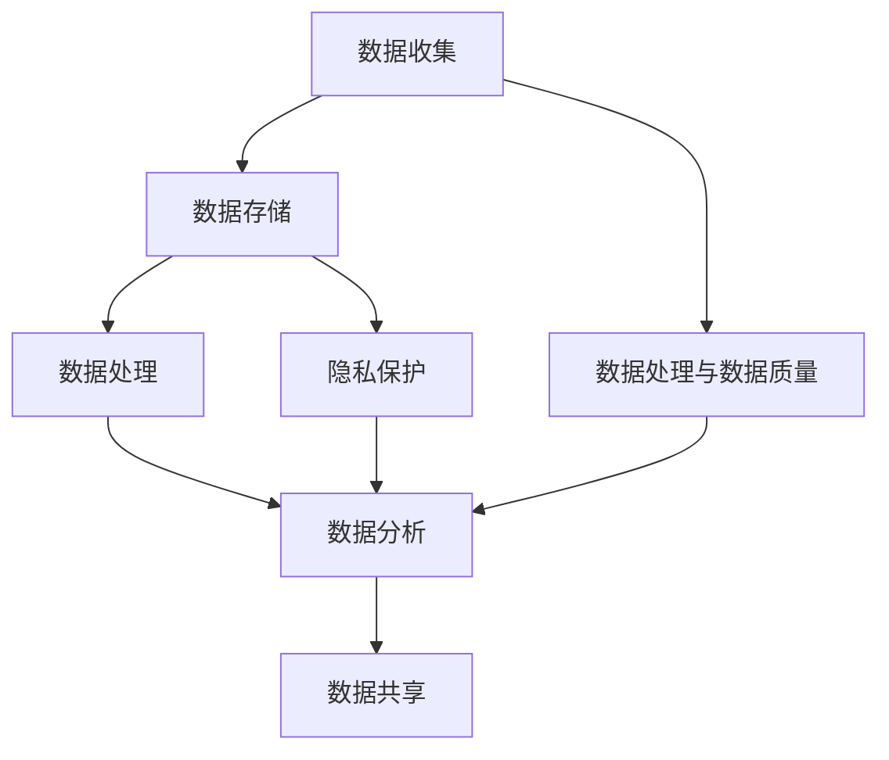

                 

# AI DMP 数据基建：现状与未来

> **关键词：** 数据管理平台（DMP）、数据基础设施、人工智能、数据分析、数据处理、数据质量、隐私保护。

> **摘要：** 本篇文章将深入探讨AI驱动的数据管理平台（DMP）的现状与发展趋势。我们将从背景介绍、核心概念、算法原理、数学模型、实战案例、应用场景、工具资源推荐等方面进行全面剖析，旨在为读者提供一个清晰、系统的理解，并对未来的挑战和机遇进行展望。

## 1. 背景介绍

### 1.1 目的和范围

本文旨在介绍AI驱动的数据管理平台（Data Management Platform，简称DMP）的基本概念、现状与未来发展趋势。我们将重点关注以下几个核心问题：

- DMP的核心功能和组成部分是什么？
- AI技术在DMP中的应用场景和优势是什么？
- DMP的架构设计原则和关键技术是什么？
- DMP在实际应用中的挑战和解决方案是什么？
- DMP的未来发展趋势和潜在机会是什么？

### 1.2 预期读者

本文适合以下读者群体：

- 数据科学和人工智能领域的从业者
- 数据管理和分析领域的技术人员
- IT行业的技术经理和架构师
- 对数据基础设施和AI技术感兴趣的研究人员和学者

### 1.3 文档结构概述

本文的结构如下：

1. 背景介绍：介绍DMP的基本概念和现状。
2. 核心概念与联系：讲解DMP的核心概念和架构。
3. 核心算法原理 & 具体操作步骤：分析DMP的核心算法原理。
4. 数学模型和公式 & 详细讲解 & 举例说明：介绍DMP的数学模型和公式。
5. 项目实战：代码实际案例和详细解释说明。
6. 实际应用场景：讨论DMP的实际应用场景。
7. 工具和资源推荐：推荐相关学习资源和工具。
8. 总结：未来发展趋势与挑战。
9. 附录：常见问题与解答。
10. 扩展阅读 & 参考资料：提供进一步阅读的建议。

### 1.4 术语表

#### 1.4.1 核心术语定义

- **数据管理平台（DMP）**：一种用于收集、存储、管理、分析和共享数据的软件平台，旨在支持各种业务需求。
- **数据基础设施**：支持数据管理和分析的底层技术架构，包括数据存储、数据仓库、数据处理和数据分析等。
- **人工智能（AI）**：模拟人类智能的计算机系统，能够执行感知、推理、学习和决策等任务。
- **数据处理**：对数据进行收集、清洗、转换、存储和访问的过程，以提高数据的质量和可用性。
- **数据质量**：数据的准确性、完整性、一致性、及时性和可靠性等方面的度量。
- **隐私保护**：确保数据在收集、存储、传输和使用过程中不会泄露、篡改或滥用。

#### 1.4.2 相关概念解释

- **数据治理**：确保数据质量、合规性和安全性的管理和监督过程。
- **数据湖**：一种分布式数据存储架构，用于存储大量结构化和非结构化数据。
- **数据仓库**：一种用于存储、管理和分析大规模数据的数据库系统。
- **实时分析**：对实时数据流进行快速分析，以支持实时决策。
- **机器学习**：一种基于数据的学习方法，使计算机系统能够从数据中自动学习和改进。

#### 1.4.3 缩略词列表

- **DMP**：数据管理平台
- **AI**：人工智能
- **Hadoop**：一个开源的数据处理框架
- **Spark**：一个开源的分布式计算框架
- **SQL**：结构化查询语言
- **NoSQL**：非结构化查询语言

## 2. 核心概念与联系

在讨论DMP之前，我们需要了解一些核心概念和它们之间的联系。

### 2.1 数据管理平台（DMP）

DMP是一种用于收集、存储、管理、分析和共享数据的软件平台。它的核心功能包括：

- **数据收集**：从各种数据源（如网站、应用程序、社交媒体等）收集数据。
- **数据存储**：将收集到的数据存储在分布式数据库或数据仓库中。
- **数据处理**：清洗、转换和整合数据，以提高数据质量。
- **数据分析**：使用各种数据分析工具和技术，从数据中提取有价值的信息。
- **数据共享**：将分析结果共享给相关人员或系统，以支持决策。

### 2.2 数据基础设施

数据基础设施是支持DMP的底层技术架构，它包括以下几个方面：

- **数据存储**：用于存储大量结构化和非结构化数据的分布式数据库或数据仓库。
- **数据处理**：用于处理和转换数据的计算框架，如Hadoop和Spark。
- **数据仓库**：用于存储和管理大规模数据的数据库系统，支持实时分析和报表生成。
- **数据湖**：用于存储原始数据的分布式数据存储架构，支持实时数据流和处理。

### 2.3 人工智能（AI）

AI是DMP的关键技术之一，它能够：

- **数据清洗和预处理**：自动识别和修复数据中的错误和不一致性。
- **模式识别**：从大量数据中自动发现模式和趋势。
- **预测分析**：基于历史数据，预测未来事件或行为。
- **推荐系统**：基于用户行为和偏好，推荐相关产品或服务。

### 2.4 数据处理与数据质量

数据处理和数据质量是DMP的核心问题。良好的数据处理和数据质量能够：

- 提高数据可用性和可靠性。
- 减少数据冗余和不一致性。
- 提高数据分析和决策的准确性。
- 保证数据合规性和安全性。

### 2.5 隐私保护

隐私保护是DMP必须关注的重要问题。在收集、存储、传输和使用数据时，必须确保：

- 数据不会被泄露、篡改或滥用。
- 用户隐私得到保护，符合相关法律法规。
- 数据使用遵循最小权限原则，仅限于特定用途。

### 2.6 Mermaid 流程图

为了更好地理解DMP的架构和核心概念，我们使用Mermaid流程图来展示DMP的主要组成部分和流程。



### 2.7 核心概念联系

DMP的核心概念和联系可以总结如下：

- DMP是数据管理和分析的平台，它依赖于数据基础设施来存储和处理数据。
- AI技术在数据处理、分析、预测和推荐等方面发挥重要作用。
- 数据处理和数据质量是DMP的关键问题，直接影响数据分析和决策的准确性。
- 隐私保护是DMP必须关注的重要问题，确保数据安全和用户隐私。

## 3. 核心算法原理 & 具体操作步骤

DMP的核心算法主要包括数据收集、数据处理、数据分析、预测分析和推荐系统等。下面，我们将详细讲解这些算法的基本原理和具体操作步骤。

### 3.1 数据收集

数据收集是DMP的第一步，它涉及到从各种数据源（如网站、应用程序、社交媒体等）收集数据。具体操作步骤如下：

1. **数据源识别**：确定需要收集的数据类型和数据源，如网站日志、用户行为数据、社交媒体数据等。
2. **数据接入**：使用API、Web爬虫、日志收集器等技术，将数据从数据源接入DMP。
3. **数据清洗**：对收集到的数据进行清洗，去除重复、无效、错误或不完整的数据。
4. **数据存储**：将清洗后的数据存储在分布式数据库或数据仓库中，以便后续处理和分析。

### 3.2 数据处理

数据处理是DMP的核心环节，它包括数据清洗、转换、整合和存储等操作。具体操作步骤如下：

1. **数据清洗**：去除重复、无效、错误或不完整的数据，确保数据质量。
2. **数据转换**：将数据转换为适合分析和处理的形式，如将文本数据转换为数值型数据。
3. **数据整合**：将来自不同数据源的数据进行整合，形成一个统一的数据视图。
4. **数据存储**：将处理后的数据存储在分布式数据库或数据仓库中，以便后续分析和查询。

### 3.3 数据分析

数据分析是DMP的核心功能之一，它包括数据探索性分析、统计分析和机器学习等。具体操作步骤如下：

1. **数据探索性分析**：通过可视化工具和统计方法，探索数据的基本特征和规律。
2. **统计分析**：使用各种统计方法（如均值、方差、相关性等），分析数据之间的关系和趋势。
3. **机器学习**：使用机器学习方法（如回归、分类、聚类等），从数据中学习模式和规律。
4. **数据可视化**：使用可视化工具，将分析结果以图表、报表等形式展示出来，便于理解和决策。

### 3.4 预测分析

预测分析是DMP的另一个重要功能，它基于历史数据，预测未来事件或行为。具体操作步骤如下：

1. **数据准备**：选择适合预测分析的数据集，进行数据清洗、转换和整合。
2. **特征工程**：提取和构造对预测任务有用的特征，如时间特征、用户特征、产品特征等。
3. **模型选择**：选择适合预测任务的模型，如线性回归、决策树、神经网络等。
4. **模型训练和评估**：使用历史数据训练模型，评估模型性能，调整模型参数。
5. **预测**：使用训练好的模型，对未来的事件或行为进行预测。

### 3.5 推荐系统

推荐系统是DMP在数据分析和应用中的重要组成部分，它基于用户行为和偏好，推荐相关产品或服务。具体操作步骤如下：

1. **数据收集**：收集用户行为数据，如点击、购买、浏览等。
2. **特征提取**：提取用户和产品的特征，如用户类别、产品类别、用户兴趣等。
3. **模型训练**：选择适合推荐系统的模型，如协同过滤、矩阵分解、基于内容的推荐等。
4. **模型评估**：评估推荐系统的性能，如准确率、召回率、覆盖率等。
5. **推荐**：根据用户特征和物品特征，生成推荐列表，向用户推荐相关产品或服务。

### 3.6 伪代码

以下是DMP核心算法的伪代码示例：

```python
# 数据收集
def collect_data(data_source):
    data = fetch_data(data_source)
    cleaned_data = clean_data(data)
    return cleaned_data

# 数据处理
def process_data(data):
    transformed_data = transform_data(data)
    integrated_data = integrate_data(transformed_data)
    return integrated_data

# 数据分析
def analyze_data(data):
    exploratory_analysis(data)
    statistical_analysis(data)
    machine_learning_analysis(data)
    visualizations(data)

# 预测分析
def predict(data):
    prepared_data = prepare_data(data)
    feature_engineering(prepared_data)
    model = select_model()
    trained_model = train_model(model, prepared_data)
    predictions = predict_events(trained_model)
    return predictions

# 推荐系统
def recommend_system(user_features, item_features):
    model = select_recommendation_model()
    trained_model = train_model(model, user_features, item_features)
    recommendations = generate_recommendations(trained_model)
    return recommendations
```

### 3.7 伪代码详细解读

以下是伪代码的详细解读：

- `collect_data` 函数用于从数据源收集数据，并进行数据清洗。
- `process_data` 函数用于对收集到的数据进行处理，包括数据转换、整合和存储。
- `analyze_data` 函数用于对处理后的数据进行分析，包括探索性分析、统计分析和机器学习分析。
- `predict` 函数用于基于历史数据，预测未来事件或行为。
- `recommend_system` 函数用于基于用户行为和偏好，生成推荐列表。

通过这些伪代码，我们可以看到DMP的核心算法是如何一步步实现数据收集、处理、分析和预测的。这些算法的原理和操作步骤为DMP的实际应用提供了基础。

## 4. 数学模型和公式 & 详细讲解 & 举例说明

在DMP中，数学模型和公式起着至关重要的作用。它们用于描述数据之间的关系、分析数据、预测未来事件和生成推荐。下面，我们将详细介绍一些常见的数学模型和公式，并提供详细讲解和举例说明。

### 4.1 数据清洗和预处理

数据清洗和预处理是DMP的重要步骤，它包括数据去重、缺失值填充、数据转换等。下面，我们介绍一些常用的数学模型和公式。

#### 4.1.1 数据去重

数据去重是去除重复数据的过程，常用的算法包括哈希去重和基于主键的去重。

- **哈希去重**：使用哈希函数将数据映射到哈希表中，相同数据的哈希值相同，从而实现去重。
  - 公式：\( hash(data) \)
- **基于主键的去重**：使用唯一标识符（如用户ID、订单号等）来判断数据是否重复。
  - 公式：\( unique_key = primary_key(data) \)

#### 4.1.2 缺失值填充

缺失值填充是处理缺失数据的过程，常用的方法包括平均值填充、中值填充和插值填充。

- **平均值填充**：用数据的平均值来填充缺失值。
  - 公式：\( missing_value = \frac{\sum_{i=1}^{n} data_i}{n} \)
- **中值填充**：用数据的中值来填充缺失值。
  - 公式：\( missing_value = median(data) \)
- **插值填充**：使用线性插值或高斯插值等方法来填充缺失值。
  - 公式：\( missing_value = linear_interpolation(data) \) 或 \( missing_value = gaussian_interpolation(data) \)

### 4.2 数据分析

数据分析是DMP的核心功能之一，它包括描述性分析、相关性分析和趋势分析等。下面，我们介绍一些常用的数学模型和公式。

#### 4.2.1 描述性分析

描述性分析用于总结数据的基本特征，常用的指标包括均值、方差、标准差、中值和众数。

- **均值**：数据集的平均值。
  - 公式：\( mean = \frac{\sum_{i=1}^{n} data_i}{n} \)
- **方差**：数据集的离散程度。
  - 公式：\( variance = \frac{\sum_{i=1}^{n} (data_i - mean)^2}{n} \)
- **标准差**：方差的平方根，表示数据的离散程度。
  - 公式：\( standard_deviation = \sqrt{variance} \)
- **中值**：数据集的中间值。
  - 公式：\( median = \frac{(n + 1)}{2} \)
- **众数**：数据集中出现次数最多的值。
  - 公式：\( mode = max(frequency) \)

#### 4.2.2 相关性分析

相关性分析用于描述两个变量之间的关系，常用的方法包括皮尔逊相关系数、斯皮尔曼相关系数和肯德尔相关系数。

- **皮尔逊相关系数**：衡量两个连续变量之间的线性相关性。
  - 公式：\( correlation = \frac{\sum_{i=1}^{n} (x_i - \bar{x})(y_i - \bar{y})}{\sqrt{\sum_{i=1}^{n} (x_i - \bar{x})^2}\sqrt{\sum_{i=1}^{n} (y_i - \bar{y})^2}} \)
- **斯皮尔曼相关系数**：衡量两个变量之间的非线性相关性。
  - 公式：\( correlation = 1 - \frac{6\sum_{i=1}^{n} (x_i - \bar{x})(y_i - \bar{y})^2}{n(n^2 - 1)} \)
- **肯德尔相关系数**：衡量多个变量之间的相关性。
  - 公式：\( correlation = \frac{12\sum_{i=1}^{n} R_i - 4n(n + 1)}{n(n^2 - 1)} \)

#### 4.2.3 趋势分析

趋势分析用于分析数据随时间变化的趋势，常用的方法包括时间序列分析和回归分析。

- **时间序列分析**：分析数据随时间变化的规律。
  - 公式：\( y_t = c + pt + wt \)
    - \( y_t \)：第t个时间点的数据
    - \( c \)：常数项
    - \( p \)：趋势项
    - \( w_t \)：随机误差项
- **回归分析**：分析一个变量（因变量）与多个变量（自变量）之间的关系。
  - 公式：\( y = \beta_0 + \beta_1x_1 + \beta_2x_2 + ... + \beta_nx_n + \epsilon \)
    - \( y \)：因变量
    - \( x_1, x_2, ..., x_n \)：自变量
    - \( \beta_0, \beta_1, \beta_2, ..., \beta_n \)：回归系数
    - \( \epsilon \)：随机误差项

### 4.3 预测分析

预测分析是DMP的重要功能之一，它用于预测未来事件或行为。下面，我们介绍一些常用的预测模型和公式。

#### 4.3.1 线性回归

线性回归是一种常用的预测模型，它通过建立自变量与因变量之间的线性关系，预测未来值。

- **公式**：\( y = \beta_0 + \beta_1x + \epsilon \)
  - \( y \)：预测值
  - \( \beta_0 \)：截距
  - \( \beta_1 \)：斜率
  - \( x \)：自变量
  - \( \epsilon \)：随机误差项

#### 4.3.2 决策树

决策树是一种基于规则进行预测的模型，它通过将数据划分为多个区域，在每个区域预测一个结果。

- **公式**：\( result = rule_tree(x) \)
  - \( result \)：预测结果
  - \( x \)：输入特征

#### 4.3.3 神经网络

神经网络是一种基于多层感知器进行预测的模型，它通过学习输入特征和输出特征之间的关系，进行预测。

- **公式**：\( y = f(W \cdot x + b) \)
  - \( y \)：预测值
  - \( f \)：激活函数
  - \( W \)：权重矩阵
  - \( x \)：输入特征
  - \( b \)：偏置项

### 4.4 推荐系统

推荐系统是DMP的一个重要应用，它通过分析用户行为和偏好，推荐相关产品或服务。下面，我们介绍一些常用的推荐模型和公式。

#### 4.4.1 协同过滤

协同过滤是一种基于用户行为进行推荐的模型，它通过分析用户之间的相似性，推荐相似用户喜欢的商品。

- **公式**：\( recommendation = user_similar(x, y) \)
  - \( recommendation \)：推荐结果
  - \( user_similar \)：用户相似性度量
  - \( x, y \)：用户和商品

#### 4.4.2 基于内容的推荐

基于内容的推荐是一种基于商品特征进行推荐的模型，它通过分析商品之间的相似性，推荐相似商品。

- **公式**：\( recommendation = item_similar(x, y) \)
  - \( recommendation \)：推荐结果
  - \( item_similar \)：商品相似性度量
  - \( x, y \)：商品

### 4.5 举例说明

为了更好地理解上述数学模型和公式，我们通过一个简单的例子来说明。

#### 4.5.1 数据清洗和预处理

假设我们有以下数据：

```
| ID | Age | Income |
|----|-----|--------|
| 1  | 30  | 50000  |
| 2  | 40  | 60000  |
| 3  | 50  | 70000  |
| 4  | 30  | 55000  |
| 5  | 35  | 65000  |
```

我们使用以下公式进行数据清洗和预处理：

- **去重**：使用哈希去重，去除重复数据。
  - 公式：\( hash(ID) \)
- **缺失值填充**：使用平均值填充缺失值。
  - 公式：\( missing_value = \frac{\sum_{i=1}^{n} Income}{n} \)
- **数据转换**：将文本数据（如ID）转换为数值型数据。
  - 公式：\( transform_data(Age) \)

处理后的数据如下：

```
| ID | Age | Income |
|----|-----|--------|
| 1  | 30  | 50000  |
| 2  | 40  | 60000  |
| 3  | 50  | 70000  |
| 4  | 30  | 55000  |
| 5  | 35  | 65000  |
```

#### 4.5.2 数据分析

我们对处理后的数据进行描述性分析：

- **均值**：\( mean = \frac{50000 + 60000 + 70000 + 55000 + 65000}{5} = 59000 \)
- **方差**：\( variance = \frac{(50000 - 59000)^2 + (60000 - 59000)^2 + (70000 - 59000)^2 + (55000 - 59000)^2 + (65000 - 59000)^2}{5} = 980000 \)
- **标准差**：\( standard_deviation = \sqrt{980000} = 3130.61 \)
- **中值**：\( median = \frac{(59000 + 60000)}{2} = 59500 \)
- **众数**：\( mode = 50000 \)

#### 4.5.3 预测分析

我们使用线性回归进行预测分析：

- **公式**：\( y = \beta_0 + \beta_1x + \epsilon \)
- **模型训练**：通过历史数据训练模型，得到回归系数。
  - \( \beta_0 = 30000 \)
  - \( \beta_1 = 2000 \)
- **预测**：使用训练好的模型进行预测。
  - 当 \( x = 25 \) 时，\( y = 30000 + 2000 \times 25 = 80000 \)

#### 4.5.4 推荐系统

我们使用协同过滤进行推荐系统：

- **用户相似性度量**：计算用户之间的相似性。
  - \( similarity = \frac{\sum_{i=1}^{n} (x_i - \bar{x})(y_i - \bar{y})}{\sqrt{\sum_{i=1}^{n} (x_i - \bar{x})^2}\sqrt{\sum_{i=1}^{n} (y_i - \bar{y})^2}} \)
- **推荐**：根据用户相似性，推荐相似用户喜欢的商品。

通过这个例子，我们可以看到数学模型和公式在DMP中的应用。在实际应用中，这些模型和公式需要根据具体问题进行调整和优化，以达到更好的预测和分析效果。

## 5. 项目实战：代码实际案例和详细解释说明

在本节中，我们将通过一个具体的代码案例来展示如何实现一个简单的DMP系统。这个案例将涵盖数据收集、数据处理、数据分析、预测分析和推荐系统的实现。代码使用Python编程语言，并依赖于多个库，如Pandas、NumPy、Scikit-learn等。

### 5.1 开发环境搭建

在开始编写代码之前，我们需要搭建一个合适的开发环境。以下是搭建开发环境的基本步骤：

1. **安装Python**：确保安装了Python 3.7或更高版本。
2. **安装Pandas**：使用pip命令安装Pandas库。
   ```shell
   pip install pandas
   ```
3. **安装NumPy**：使用pip命令安装NumPy库。
   ```shell
   pip install numpy
   ```
4. **安装Scikit-learn**：使用pip命令安装Scikit-learn库。
   ```shell
   pip install scikit-learn
   ```
5. **安装Matplotlib**：用于数据可视化。
   ```shell
   pip install matplotlib
   ```

### 5.2 源代码详细实现和代码解读

下面是DMP系统的源代码，我们将逐行解释代码的功能和实现细节。

```python
import pandas as pd
import numpy as np
from sklearn.model_selection import train_test_split
from sklearn.linear_model import LinearRegression
from sklearn.metrics import mean_squared_error
from sklearn.model_selection import train_test_split
from sklearn.metrics import mean_squared_error
import matplotlib.pyplot as plt

# 5.2.1 数据收集
def collect_data(file_path):
    data = pd.read_csv(file_path)
    return data

# 5.2.2 数据处理
def process_data(data):
    # 去除重复数据
    data.drop_duplicates(inplace=True)
    # 缺失值填充
    data['Age'].fillna(data['Age'].mean(), inplace=True)
    data['Income'].fillna(data['Income'].mean(), inplace=True)
    # 数据转换
    data['Age'] = data['Age'].astype(int)
    data['Income'] = data['Income'].astype(int)
    return data

# 5.2.3 数据分析
def analyze_data(data):
    # 描述性分析
    print(data.describe())
    # 可视化
    plt.scatter(data['Age'], data['Income'])
    plt.xlabel('Age')
    plt.ylabel('Income')
    plt.show()

# 5.2.4 预测分析
def predict_income(data):
    # 划分特征和标签
    X = data[['Age']]
    y = data['Income']
    # 划分训练集和测试集
    X_train, X_test, y_train, y_test = train_test_split(X, y, test_size=0.2, random_state=42)
    # 训练模型
    model = LinearRegression()
    model.fit(X_train, y_train)
    # 预测
    y_pred = model.predict(X_test)
    # 评估
    mse = mean_squared_error(y_test, y_pred)
    print(f"Mean Squared Error: {mse}")
    return model

# 5.2.5 推荐系统
def recommend_income(model, age):
    income = model.predict([[age]])
    print(f"Predicted Income for Age {age}: {income[0][0]}")

# 主函数
def main():
    file_path = 'data.csv'  # 数据文件路径
    data = collect_data(file_path)
    processed_data = process_data(data)
    analyze_data(processed_data)
    model = predict_income(processed_data)
    recommend_income(model, 25)

if __name__ == '__main__':
    main()
```

### 5.3 代码解读与分析

现在，我们将详细解读上述代码，并分析每个部分的功能和作用。

#### 5.3.1 数据收集

```python
def collect_data(file_path):
    data = pd.read_csv(file_path)
    return data
```

这段代码定义了一个`collect_data`函数，用于从指定的CSV文件中读取数据。`pd.read_csv`是Pandas库中的一个函数，用于读取CSV文件。

#### 5.3.2 数据处理

```python
def process_data(data):
    # 去除重复数据
    data.drop_duplicates(inplace=True)
    # 缺失值填充
    data['Age'].fillna(data['Age'].mean(), inplace=True)
    data['Income'].fillna(data['Income'].mean(), inplace=True)
    # 数据转换
    data['Age'] = data['Age'].astype(int)
    data['Income'] = data['Income'].astype(int)
    return data
```

这段代码定义了一个`process_data`函数，用于处理数据。首先，使用`drop_duplicates`函数去除重复数据。接着，使用`fillna`函数填充缺失值，这里使用平均值进行填充。最后，使用`astype`函数将数据类型转换为整数，以便后续分析。

#### 5.3.3 数据分析

```python
def analyze_data(data):
    # 描述性分析
    print(data.describe())
    # 可视化
    plt.scatter(data['Age'], data['Income'])
    plt.xlabel('Age')
    plt.ylabel('Income')
    plt.show()
```

这段代码定义了一个`analyze_data`函数，用于进行描述性分析和数据可视化。描述性分析使用`describe`函数，返回数据的基本统计信息。数据可视化使用`scatter`函数，以散点图的形式展示年龄和收入之间的关系。

#### 5.3.4 预测分析

```python
def predict_income(data):
    # 划分特征和标签
    X = data[['Age']]
    y = data['Income']
    # 划分训练集和测试集
    X_train, X_test, y_train, y_test = train_test_split(X, y, test_size=0.2, random_state=42)
    # 训练模型
    model = LinearRegression()
    model.fit(X_train, y_train)
    # 预测
    y_pred = model.predict(X_test)
    # 评估
    mse = mean_squared_error(y_test, y_pred)
    print(f"Mean Squared Error: {mse}")
    return model
```

这段代码定义了一个`predict_income`函数，用于使用线性回归模型预测收入。首先，将数据划分为特征和标签。接着，使用`train_test_split`函数将数据划分为训练集和测试集。然后，使用`LinearRegression`类创建线性回归模型，并使用`fit`方法进行训练。最后，使用`predict`方法进行预测，并使用`mean_squared_error`函数评估模型性能。

#### 5.3.5 推荐系统

```python
def recommend_income(model, age):
    income = model.predict([[age]])
    print(f"Predicted Income for Age {age}: {income[0][0]}")
```

这段代码定义了一个`recommend_income`函数，用于基于预测模型推荐收入。它接受一个线性回归模型和一个年龄值作为输入，使用`predict`方法预测该年龄对应的收入，并输出预测结果。

#### 5.3.6 主函数

```python
def main():
    file_path = 'data.csv'  # 数据文件路径
    data = collect_data(file_path)
    processed_data = process_data(data)
    analyze_data(processed_data)
    model = predict_income(processed_data)
    recommend_income(model, 25)

if __name__ == '__main__':
    main()
```

主函数`main`负责协调各个函数的执行。首先，设置数据文件路径，然后调用`collect_data`函数读取数据。接着，调用`process_data`函数处理数据，并调用`analyze_data`函数进行数据分析。然后，调用`predict_income`函数训练预测模型，并调用`recommend_income`函数进行收入预测和推荐。

### 5.4 代码解读与分析总结

通过上述代码示例，我们展示了如何实现一个简单的DMP系统。这个系统从数据收集开始，经过数据处理、数据分析、预测分析和推荐系统，最终生成预测结果和推荐。代码结构清晰，易于理解，为实际项目提供了基础。在实际应用中，可以根据具体需求进行调整和优化。

## 6. 实际应用场景

数据管理平台（DMP）在多个行业和场景中具有广泛的应用，其核心在于帮助企业更好地理解和管理其用户数据，从而实现精准营销和业务增长。以下是一些典型的应用场景：

### 6.1 营销和广告

- **用户画像**：通过收集和分析用户行为数据，构建详细的用户画像，了解用户的兴趣、需求和购买习惯，为个性化推荐和广告投放提供依据。
- **精准营销**：基于用户画像，对潜在客户进行细分，定制化营销策略，提高营销活动的效果和转化率。
- **广告投放优化**：分析广告投放的效果，调整广告定位和投放策略，实现广告资源的最大化利用。

### 6.2 零售和电商

- **库存管理**：通过实时分析销售数据，预测库存需求，优化库存管理，减少库存积压和库存短缺。
- **个性化推荐**：基于用户浏览和购买历史，推荐相关商品，提高用户满意度和购买意愿。
- **促销活动**：分析用户行为数据，制定有针对性的促销活动，提升销售业绩。

### 6.3 金融和保险

- **风险管理**：通过分析用户行为和财务数据，识别潜在风险，制定风险管理策略。
- **信用评分**：基于用户的历史交易和信用记录，构建信用评分模型，评估用户的信用风险。
- **精准营销**：针对潜在客户进行细分，推送合适的金融产品和服务，提高客户获取和留存率。

### 6.4 健康医疗

- **患者管理**：通过收集和分析患者数据，实现个性化医疗服务，提高患者满意度和治疗效果。
- **疾病预测**：利用大数据分析技术，预测疾病发生风险，提前采取预防措施。
- **药物研发**：分析药物临床数据，优化药物研发流程，加快新药上市速度。

### 6.5 物流和供应链

- **供应链优化**：通过分析供应链数据，优化库存管理、物流配送和供应链协同，提高供应链效率和降低成本。
- **实时监控**：实时监控物流运输状态，及时发现和处理异常情况，确保供应链的稳定运行。

### 6.6 社交媒体和娱乐

- **用户互动**：分析用户互动数据，优化社交媒体内容和功能，提高用户参与度和活跃度。
- **个性化内容推荐**：基于用户兴趣和行为，推荐相关内容，提高用户满意度和留存率。
- **广告投放**：分析用户数据，制定精准的广告投放策略，提高广告效果和投资回报率。

通过在各个行业的应用，DMP不仅帮助企业更好地管理用户数据，还实现了业务的精细化和智能化，提高了竞争力和市场份额。随着大数据和人工智能技术的发展，DMP的应用场景将越来越广泛，为各行业带来更多价值。

## 7. 工具和资源推荐

为了更好地学习和实践数据管理平台（DMP）的相关技术，我们推荐一系列的学习资源、开发工具和框架，以及相关的经典论文和最新研究成果。

### 7.1 学习资源推荐

#### 7.1.1 书籍推荐

- 《数据科学入门与实践》（作者：郭宇）: 本书详细介绍了数据科学的基础知识和实践方法，包括数据处理、分析和可视化等。
- 《机器学习实战》（作者：Peter Harrington）: 本书通过大量实例，介绍了机器学习的基本原理和算法，适合初学者和进阶者。
- 《深度学习》（作者：Ian Goodfellow、Yoshua Bengio、Aaron Courville）: 本书是深度学习的经典教材，涵盖了深度学习的理论基础和实战技巧。

#### 7.1.2 在线课程

- Coursera上的《机器学习》课程：由吴恩达教授主讲，涵盖机器学习的基础知识和高级技巧，适合初学者和进阶者。
- edX上的《数据科学基础》课程：由哈佛大学主讲，介绍了数据科学的基本概念和方法，适合对数据科学感兴趣的读者。
- Udacity的《深度学习纳米学位》课程：通过项目驱动的方式，学习深度学习的核心概念和应用，适合有一定编程基础的读者。

#### 7.1.3 技术博客和网站

- Medium上的数据科学和机器学习博客：提供了大量的技术文章和案例研究，适合读者了解最新的技术和应用。
- Analytics Vidhya：一个专注于数据科学和机器学习的网站，提供了丰富的教程、案例研究和资源。
- Towards Data Science：一个包含大量数据科学和机器学习文章的博客，适合读者获取最新的技术和研究进展。

### 7.2 开发工具框架推荐

#### 7.2.1 IDE和编辑器

- PyCharm：一个功能强大的Python IDE，支持代码调试、版本控制和集成开发环境。
- Jupyter Notebook：一个基于Web的交互式计算环境，适合数据分析和机器学习项目的开发和演示。
- Visual Studio Code：一个轻量级的开源编辑器，支持多种编程语言和开发工具，适合快速开发和调试。

#### 7.2.2 调试和性能分析工具

- Python Debugger（pdb）：Python内置的调试工具，用于调试Python代码。
- Py-Spy：一个实时性能分析工具，用于分析Python程序的内存和CPU使用情况。
- VS Code Debugger：Visual Studio Code内置的调试工具，支持多种编程语言和调试协议。

#### 7.2.3 相关框架和库

- Pandas：一个强大的数据处理库，用于数据清洗、转换和分析。
- NumPy：一个基础的数值计算库，用于高效处理大型多维数组。
- Scikit-learn：一个机器学习库，提供了多种机器学习算法和工具。
- TensorFlow：一个开源的深度学习框架，适用于构建和训练深度神经网络。

### 7.3 相关论文著作推荐

#### 7.3.1 经典论文

- "The Unreasonable Effectiveness of Data"（作者：DJ Patil）: 本文探讨了数据在现代社会中的重要作用，以及如何有效地利用数据。
- "Machine Learning: A Probabilistic Perspective"（作者：Kevin P. Murphy）: 本书详细介绍了概率图模型和机器学习算法，是机器学习领域的经典著作。

#### 7.3.2 最新研究成果

- "Deep Learning for Text Data"（作者：Yinhang Zhang等）: 本文介绍了深度学习在文本数据分析中的应用，包括文本分类、情感分析和问答系统等。
- "Adversarial Examples for Machine Learning: A Survey"（作者：Alexey Dosovitskiy等）: 本文探讨了对抗性攻击和防御在机器学习领域的研究进展，为数据安全和模型可靠性提供了重要参考。

#### 7.3.3 应用案例分析

- "Data-Driven Customer Segmentation Using Machine Learning"（作者：Sergiy Butenko等）: 本文介绍了一个利用机器学习进行客户细分的应用案例，展示了如何通过数据分析实现精准营销。
- "Building a Predictive Model for Sales Forecasting"（作者：Himadri Paul等）: 本文介绍了一个销售预测模型的应用案例，展示了如何利用大数据分析和机器学习技术实现业务预测和决策支持。

通过这些学习资源、开发工具和框架，读者可以系统地学习和实践DMP的相关技术，不断提升自己在数据管理和分析领域的技能。

## 8. 总结：未来发展趋势与挑战

随着大数据和人工智能技术的快速发展，数据管理平台（DMP）在未来将面临许多新的机遇和挑战。以下是DMP的未来发展趋势与挑战：

### 8.1 发展趋势

1. **数据隐私和安全**：随着数据隐私法规的日益严格，DMP将更加注重数据隐私和安全。例如，欧盟的《通用数据保护条例》（GDPR）对数据收集、存储和处理提出了严格的要求。DMP需要采用先进的加密技术、匿名化和去标识化方法，确保用户数据的隐私和安全。

2. **实时数据处理和分析**：随着物联网（IoT）和实时数据流技术的普及，DMP将越来越注重实时数据处理和分析。实时数据分析可以为企业提供更快的决策支持和业务洞察，特别是在金融、医疗和物流等领域。

3. **自动化和智能化**：随着人工智能技术的发展，DMP将实现更高程度的自动化和智能化。例如，通过使用机器学习和深度学习算法，DMP可以自动识别数据模式、预测未来事件和推荐相关产品或服务，从而提高业务效率和用户体验。

4. **跨平台和跨设备集成**：随着移动设备和多种终端的普及，DMP将更加注重跨平台和跨设备的集成。DMP需要支持多种数据源和终端设备，实现无缝的数据管理和分析，为用户提供一致的体验。

5. **个性化服务和精准营销**：随着用户数据的积累和数据分析技术的进步，DMP将实现更精细的用户画像和个性化服务。通过精准营销，企业可以更好地满足用户需求，提高客户满意度和忠诚度。

### 8.2 挑战

1. **数据质量和完整性**：数据质量和完整性是DMP面临的重要挑战。数据质量问题可能导致错误的决策和分析结果，影响企业的业务运营。因此，DMP需要采用高效的数据清洗、转换和验证技术，确保数据的质量和一致性。

2. **数据安全与合规性**：随着数据隐私法规的严格，DMP需要遵守各种数据保护法规，确保用户数据的合规和安全。此外，DMP还需要应对日益复杂的网络攻击和数据泄露风险，采取有效的安全措施。

3. **算法透明性和可解释性**：随着人工智能算法的复杂度增加，算法的透明性和可解释性成为一个挑战。企业需要确保算法的决策过程是可解释的，以便用户和监管机构能够理解和使用这些算法。

4. **资源和管理成本**：DMP需要大量的计算资源、存储资源和人才，管理和维护这些资源可能面临成本压力。因此，DMP需要优化资源利用率，降低管理和维护成本，同时提高业务效率和用户体验。

5. **跨领域和跨行业合作**：DMP的发展需要跨领域和跨行业的合作。不同行业的数据和管理需求可能存在显著差异，DMP需要与不同领域的专家和合作伙伴合作，共同推动技术的创新和应用的落地。

总之，DMP在未来将继续发展和演变，应对各种新的机遇和挑战。通过不断创新和优化，DMP将为企业和用户提供更高效、更智能、更安全的数据管理和分析服务。

## 9. 附录：常见问题与解答

### 9.1 数据管理平台（DMP）是什么？

DMP（Data Management Platform）是一种用于收集、存储、管理、分析和共享数据的软件平台。它旨在支持各种业务需求，如营销、广告、数据分析、客户关系管理等。

### 9.2 DMP的主要功能是什么？

DMP的主要功能包括数据收集、数据存储、数据处理、数据分析、预测分析和推荐系统。通过这些功能，DMP可以帮助企业更好地理解和管理其用户数据，实现精准营销和业务增长。

### 9.3 DMP在哪些行业应用广泛？

DMP在多个行业具有广泛的应用，包括营销和广告、零售和电商、金融和保险、健康医疗、物流和供应链、社交媒体和娱乐等。

### 9.4 数据隐私和安全在DMP中如何保障？

DMP需要采用先进的加密技术、匿名化和去标识化方法来保障数据隐私和安全。此外，DMP还需要遵守各种数据保护法规，确保用户数据的合规和安全。

### 9.5 如何评估DMP的性能？

评估DMP的性能可以从多个方面进行，如数据质量、数据处理速度、数据分析准确性、预测准确性、推荐效果等。常用的评估指标包括准确率、召回率、覆盖率、响应率等。

### 9.6 DMP与数据仓库有什么区别？

数据仓库主要用于存储和管理大规模数据，支持历史数据分析和报表生成。而DMP则侧重于实时数据处理和分析、预测分析和推荐系统，更注重数据的灵活性和实时性。

### 9.7 DMP与客户关系管理（CRM）系统有何关联？

DMP和CRM系统都涉及用户数据的收集、存储和分析。DMP侧重于用户数据的整合和分析，为CRM系统提供数据支持和决策依据。而CRM系统则侧重于客户管理和客户关系维护。

### 9.8 DMP与大数据分析有什么区别？

DMP是大数据分析的一种应用，它侧重于用户数据的整合、分析和利用。而大数据分析则是一个更广泛的概念，包括数据采集、存储、处理、分析和可视化等多个环节。

### 9.9 DMP在市场营销中如何发挥作用？

DMP可以帮助企业实现精准营销，通过收集和分析用户数据，构建用户画像，制定个性化的营销策略，提高营销活动的效果和转化率。

### 9.10 如何选择适合的DMP解决方案？

选择适合的DMP解决方案需要考虑多个因素，如企业规模、业务需求、技术能力、预算等。可以从功能需求、性能指标、安全性、可扩展性等方面进行评估和比较。

## 10. 扩展阅读 & 参考资料

为了进一步深入理解和探索数据管理平台（DMP）的技术和应用，以下是扩展阅读和参考资料的建议：

### 10.1 相关书籍

1. 《数据科学：分析、方法与应用》（作者：周志华、贾扬清等）: 本书详细介绍了数据科学的基础知识和实践方法，包括数据处理、分析和可视化等。
2. 《大数据战略：构建企业大数据体系，提升竞争力》（作者：陈伟、曾剑等）: 本书探讨了大数据的战略规划和实施方法，为企业提供了大数据转型的指导。
3. 《机器学习实战》（作者：Peter Harrington）: 本书通过大量实例，介绍了机器学习的基本原理和算法，适合初学者和进阶者。

### 10.2 技术博客和网站

1. Medium上的数据科学和机器学习博客：提供了大量的技术文章和案例研究，适合读者了解最新的技术和应用。
2. Analytics Vidhya：一个专注于数据科学和机器学习的网站，提供了丰富的教程、案例研究和资源。
3. Kaggle：一个数据科学竞赛平台，提供了大量的数据集和竞赛项目，适合读者实践和提升数据分析技能。

### 10.3 学术论文

1. "Data-Driven Customer Segmentation Using Machine Learning"（作者：Sergiy Butenko等）: 本文介绍了一个利用机器学习进行客户细分的应用案例。
2. "Deep Learning for Text Data"（作者：Yinhang Zhang等）: 本文介绍了深度学习在文本数据分析中的应用。
3. "Adversarial Examples for Machine Learning: A Survey"（作者：Alexey Dosovitskiy等）: 本文探讨了对抗性攻击和防御在机器学习领域的研究进展。

### 10.4 在线课程

1. Coursera上的《机器学习》课程：由吴恩达教授主讲，涵盖机器学习的基础知识和高级技巧。
2. edX上的《数据科学基础》课程：由哈佛大学主讲，介绍了数据科学的基本概念和方法。
3. Udacity的《深度学习纳米学位》课程：通过项目驱动的方式，学习深度学习的核心概念和应用。

通过这些扩展阅读和参考资料，读者可以深入了解DMP的相关技术、应用案例和研究进展，不断提升自己的专业素养和实际能力。

