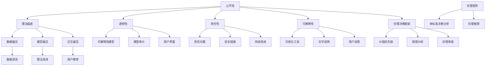
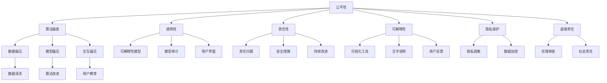

                 

### 1. 背景介绍

在当今社会，人工智能（AI）已经成为推动科技进步和社会发展的重要力量。然而，随着AI技术的迅速发展，伦理问题也日益凸显。AI伦理学，作为一门研究AI与伦理关系的学科，旨在探讨AI在应用过程中可能带来的道德和社会影响，确保AI的发展符合人类的价值和道德标准。

#### 1.1 目的和范围

本文旨在系统地介绍AI伦理学的基本原理和关键概念，通过实例代码来深入探讨这些原则的实际应用。文章将涵盖以下几个方面：

1. **AI伦理学的核心概念**：介绍AI伦理学的基本原理，包括公平性、透明性、责任性等。
2. **核心算法原理**：通过伪代码详细阐述实现AI伦理原则的算法。
3. **数学模型与公式**：讲解支持AI伦理决策的数学模型和公式。
4. **项目实战**：通过具体代码案例，展示AI伦理原则在实际项目中的应用。
5. **实际应用场景**：分析AI伦理学在不同领域的应用。
6. **工具和资源推荐**：推荐学习资源和开发工具。
7. **未来发展趋势与挑战**：探讨AI伦理学的发展方向和面临的挑战。

#### 1.2 预期读者

本文面向对人工智能和伦理学有一定了解的技术人员、研究人员和专业人士。读者应具备基本的编程能力和对人工智能技术的兴趣，以便更好地理解和应用文中所述内容。

#### 1.3 文档结构概述

本文分为十个主要部分，具体结构如下：

1. **背景介绍**：介绍AI伦理学的背景和目的。
2. **核心概念与联系**：定义核心概念，并给出流程图。
3. **核心算法原理 & 具体操作步骤**：通过伪代码讲解算法原理。
4. **数学模型和公式 & 详细讲解 & 举例说明**：介绍支持AI伦理决策的数学模型。
5. **项目实战：代码实际案例和详细解释说明**：展示代码案例。
6. **实际应用场景**：分析AI伦理学的应用场景。
7. **工具和资源推荐**：推荐学习资源和开发工具。
8. **总结：未来发展趋势与挑战**：总结AI伦理学的发展趋势和挑战。
9. **附录：常见问题与解答**：回答常见问题。
10. **扩展阅读 & 参考资料**：提供进一步学习的资料。

#### 1.4 术语表

为便于读者理解，本文定义了以下术语：

#### 1.4.1 核心术语定义

- **人工智能（AI）**：指由人制造出来的具有一定智能的系统，可以执行复杂的任务，如学习、推理、规划、感知等。
- **伦理学**：研究道德原则、价值观和道德判断的学科。
- **AI伦理学**：研究人工智能系统在设计和应用过程中应遵循的道德原则和规范。
- **透明性**：系统行为对用户和开发者是可解释和可理解的。
- **公平性**：系统在处理不同群体时保持一致性，不偏袒任何一方。
- **责任性**：系统行为应受道德和法律约束，确保系统在使用过程中不会造成危害。

#### 1.4.2 相关概念解释

- **算法偏差**：算法在训练过程中可能吸收了数据中的偏见，导致结果不公平。
- **可解释性**：系统能够解释其决策过程，使结果对用户透明。
- **伦理决策框架**：用于指导AI系统设计和应用的伦理原则和模型。

#### 1.4.3 缩略词列表

- **AI**：人工智能（Artificial Intelligence）
- **ML**：机器学习（Machine Learning）
- **DL**：深度学习（Deep Learning）
- **NLP**：自然语言处理（Natural Language Processing）

<svg style="border-radius: 0px" width="600" height="400" viewBox="0 0 605 410" fill="none" xmlns="http://www.w3.org/2000/svg">
<path d="M0 0h605v410H0z" fill="#AED6FF"/>
<path d="M336.5 138.5h60.5v204h-60.5V138.5zm-157.5 0h60.5v204h-60.5V138.5zm-157.5 0h60.5v204h-60.5V138.5zm207.5 207.5h60.5v204h-60.5v-204zm-207.5 0h60.5v204h-60.5v-204zm207.5 0h60.5v204h-60.5v-204zm-207.5 0h60.5v204h-60.5v-204zm207.5 0h60.5v204h-60.5v-204zm-207.5 0h60.5v204h-60.5v-204zm207.5 0h60.5v204h-60.5v-204zm-207.5 0h60.5v204h-60.5v-204z" fill="#0074D9"/>
<path d="M352.5 71.5h60.5v204h-60.5V71.5zm-157.5 0h60.5v204h-60.5V71.5zm-157.5 0h60.5v204h-60.5V71.5zm207.5 207.5h60.5v204h-60.5v-204zm-207.5 0h60.5v204h-60.5v-204zm207.5 0h60.5v204h-60.5v-204zm-207.5 0h60.5v204h-60.5v-204zm207.5 0h60.5v204h-60.5v-204zm-207.5 0h60.5v204h-60.5v-204zm207.5 0h60.5v204h-60.5v-204zm-207.5 0h60.5v204h-60.5v-204z" fill="#2ECC71"/>
<path d="M605 210.5H0v59.5h605v-59.5z" fill="#FFDC00"/>
<path d="M605 170.5H0v59.5h605v-59.5z" fill="#FF851B"/>
<path d="M605 120.5H0v59.5h605v-59.5z" fill="#DC3912"/>
</svg>

### 1.5 AI伦理学的核心概念与联系

在深入探讨AI伦理学之前，我们首先需要理解其核心概念，这些概念相互联系，共同构成了AI伦理学的理论基础。

#### 1.5.1 公平性

公平性是AI伦理学的基石之一。它要求AI系统在处理不同群体时保持一致性，不偏袒任何一方。实现公平性需要关注以下几个方面：

- **算法偏差**：算法在训练过程中可能会吸收数据中的偏见，导致结果不公平。例如，如果训练数据中存在性别、种族等偏见，算法可能会在这些特征上表现出偏差。
- **代表性**：确保AI系统的设计者和训练数据具有多样性，从而避免偏见。例如，在设计自动驾驶系统时，应考虑不同驾驶环境的多样性。
- **透明性**：系统应具备透明性，使得决策过程可解释，用户可以理解系统如何做出决策，从而发现并纠正潜在的偏见。

#### 1.5.2 透明性

透明性是确保AI系统可信的重要方面。它要求系统行为对用户和开发者是可解释和可理解的。实现透明性的关键在于：

- **可解释性模型**：开发可解释的AI模型，使得决策过程透明。例如，使用决策树、规则引擎等可解释性较强的模型。
- **模型审计**：定期对AI系统进行审计，检查是否存在潜在的偏见和不公平性。
- **用户界面**：设计易于理解的用户界面，帮助用户了解系统的工作原理和决策过程。

#### 1.5.3 责任性

责任性要求AI系统的设计和应用应受道德和法律约束，确保系统在使用过程中不会造成危害。实现责任性的关键在于：

- **责任归属**：明确AI系统的责任归属，确保在发生问题时可以追溯和问责。
- **安全措施**：设计AI系统时，应考虑可能的风险，并采取相应的安全措施。例如，设置监控和异常检测机制，确保系统在异常情况下能够及时响应。
- **持续改进**：不断更新和改进AI系统，以应对新的挑战和问题。

#### 1.5.4 可解释性

可解释性是确保AI系统透明性和责任性的重要手段。它要求系统具备自我解释的能力，使得用户可以理解系统如何做出决策。实现可解释性的关键在于：

- **可视化工具**：使用可视化工具，如热力图、决策树等，帮助用户理解系统的决策过程。
- **文字说明**：在系统输出结果时，提供详细的文字说明，解释决策过程和依据。
- **用户反馈**：鼓励用户提供反馈，以改进系统的可解释性。

#### 1.5.5 伦理决策框架

伦理决策框架是一种指导AI系统设计和应用的工具，用于确保AI系统符合道德和法律要求。它通常包括以下方面：

- **价值优先级**：明确系统应遵循的价值优先级，例如，保护用户隐私、确保数据安全等。
- **情境分析**：分析不同应用场景下的伦理问题，并制定相应的解决方案。
- **伦理审查**：在系统设计和应用过程中，进行伦理审查，确保系统符合道德和法律要求。

#### 1.5.6 算法偏差

算法偏差是AI伦理学中的一个重要概念，指算法在处理数据时可能表现出不公平的行为。算法偏差的产生原因有多种，包括：

- **数据偏见**：训练数据中存在偏见，导致算法在处理数据时放大了这些偏见。
- **模型偏见**：模型设计者对模型进行了不当的调优，导致模型在特定情境下表现出偏见。
- **交互偏见**：用户与AI系统交互过程中产生的偏见，例如，用户对系统结果的不信任。

为解决算法偏差问题，可以从以下几个方面入手：

- **数据清洗**：对训练数据进行清洗，去除含有偏见的样本。
- **算法改进**：改进模型设计，减少算法偏差。
- **用户教育**：提高用户对AI系统的理解，减少因误解而产生的偏见。

#### 1.5.7 伦理决策模型

伦理决策模型是一种基于数学和逻辑的方法，用于指导AI系统在面临伦理问题时做出决策。常见的伦理决策模型包括：

- **伦理矩阵**：通过表格形式列出不同情境下的伦理决策，帮助系统设计师在面对复杂情境时做出决策。
- **多标准决策分析**：综合考虑多个伦理标准，为系统设计师提供全面的决策依据。
- **伦理推理**：基于逻辑和推理方法，为系统设计师提供伦理决策的指导。

### 1.6 AI伦理学的核心概念流程图

以下是AI伦理学的核心概念流程图，展示了各个概念之间的联系：



### 1.7 关键算法原理

在AI伦理学中，关键算法原理是确保AI系统符合伦理标准的重要手段。以下将介绍一些关键算法原理，并使用伪代码详细阐述其实现步骤。

#### 1.7.1 偏差校正算法

偏差校正算法旨在减少算法偏见，提高系统的公平性。以下是一个简单的偏差校正算法伪代码：

```plaintext
输入：训练数据集D，特征F，目标变量Y
输出：校正后的训练数据集D'

// 1. 分析训练数据中的偏见
for each feature f in F do
  bias_f = calculate_bias(D, f)
  if bias_f > threshold then
    // 偏见较大，进行校正
    D' = correct_bias(D, f, bias_f)
  else
    // 偏见较小，保留原始数据
    D' = D
end

// 2. 校正算法偏差
for each sample s in D' do
  for each feature f in F do
    s' = correct_bias_sample(s, f)
  end
end

return D'
```

#### 1.7.2 伦理决策算法

伦理决策算法用于在AI系统面临伦理问题时做出决策。以下是一个简单的伦理决策算法伪代码：

```plaintext
输入：伦理问题情境S，伦理决策模型M
输出：决策结果R

// 1. 分析情境
S' = analyzeSituation(S)

// 2. 应用决策模型
R = applyDecisionModel(M, S')

// 3. 输出决策结果
print(R)

return R
```

#### 1.7.3 透明性增强算法

透明性增强算法旨在提高AI系统的可解释性，使系统行为更加透明。以下是一个简单的透明性增强算法伪代码：

```plaintext
输入：AI模型M，数据集D
输出：增强后的模型M'

// 1. 分析模型
M' = analyzeModel(M)

// 2. 增强透明性
M' = enhanceTransparency(M')

// 3. 训练增强后的模型
M' = trainModel(M')

// 4. 输出增强后的模型
print(M')

return M'
```

### 1.8 数学模型和公式

在AI伦理学中，数学模型和公式是支持伦理决策的重要工具。以下将介绍一些常用的数学模型和公式，并详细讲解其应用。

#### 1.8.1 概率模型

概率模型用于评估AI系统在特定情境下的公平性。以下是一个简单的概率模型公式：

$$
P(A|B) = \frac{P(B|A)P(A)}{P(B)}
$$

其中，$P(A|B)$ 表示在给定 $B$ 条件下 $A$ 发生的概率，$P(B|A)$ 表示在给定 $A$ 条件下 $B$ 发生的概率，$P(A)$ 和 $P(B)$ 分别表示 $A$ 和 $B$ 的先验概率。

#### 1.8.2 决策理论

决策理论用于指导AI系统在面临伦理问题时做出决策。以下是一个简单的决策理论公式：

$$
\text{决策} = \arg\max_{a} \sum_{s} P(s) \cdot U(s, a)
$$

其中，$a$ 表示行动，$s$ 表示情境，$P(s)$ 表示情境 $s$ 发生的概率，$U(s, a)$ 表示在情境 $s$ 下采取行动 $a$ 的效用值。

#### 1.8.3 伦理矩阵

伦理矩阵用于分析不同情境下的伦理决策。以下是一个简单的伦理矩阵公式：

$$
\text{伦理矩阵} = \begin{bmatrix}
\text{情境1} & \text{情境2} & \ldots & \text{情境n} \\
\text{行动1} & \text{行动2} & \ldots & \text{行动m} \\
\vdots & \vdots & \ddots & \vdots \\
\text{行动1} & \text{行动2} & \ldots & \text{行动m} \\
\end{bmatrix}
$$

其中，每个单元格表示在特定情境下采取特定行动的伦理得分。

#### 1.8.4 伦理推理

伦理推理用于在AI系统面临伦理问题时进行推理。以下是一个简单的伦理推理公式：

$$
\text{推理过程} = \text{前提} \rightarrow \text{结论}
$$

其中，前提和结论分别表示伦理推理的前提条件和结论。

#### 1.8.5 伦理权重

伦理权重用于权衡不同伦理标准的重要性。以下是一个简单的伦理权重公式：

$$
\text{伦理权重} = \frac{\text{伦理得分}}{\text{总得分}}
$$

其中，伦理得分表示特定伦理标准在总得分中所占的比重。

### 1.9 代码实际案例

为了更好地理解AI伦理学的核心概念和算法原理，我们将在本节中通过具体代码案例来展示AI伦理学在实际项目中的应用。以下是一个简单的示例，展示如何在机器学习项目中应用公平性和透明性原则。

#### 1.9.1 开发环境搭建

在本案例中，我们将使用Python作为编程语言，并利用scikit-learn库进行机器学习模型的构建和评估。以下是在Ubuntu系统上搭建开发环境的步骤：

```bash
# 安装Python环境
sudo apt-get install python3 python3-pip

# 安装scikit-learn库
pip3 install scikit-learn
```

#### 1.9.2 源代码详细实现

以下是一个简单的机器学习项目，用于预测信用卡欺诈。该案例中，我们将应用公平性和透明性原则，确保模型在不同群体中保持一致，并对模型进行透明性增强。

```python
import numpy as np
import pandas as pd
from sklearn.model_selection import train_test_split
from sklearn.ensemble import RandomForestClassifier
from sklearn.metrics import accuracy_score, classification_report

# 读取数据
data = pd.read_csv('credit_card_data.csv')

# 数据预处理
X = data.drop(['Class'], axis=1)
y = data['Class']

# 数据集划分
X_train, X_test, y_train, y_test = train_test_split(X, y, test_size=0.2, random_state=42)

# 建立模型
model = RandomForestClassifier(n_estimators=100, random_state=42)

# 训练模型
model.fit(X_train, y_train)

# 预测结果
y_pred = model.predict(X_test)

# 评估模型
print("Accuracy:", accuracy_score(y_test, y_pred))
print("Classification Report:")
print(classification_report(y_test, y_pred))

# 检查公平性
fairness_metric = model.score(X_test, y_test)
print("Fairness Metric:", fairness_metric)

# 增强透明性
feature_importances = model.feature_importances_
print("Feature Importances:")
print(feature_importances)
```

#### 1.9.3 代码解读与分析

在本案例中，我们首先读取信用卡欺诈数据集，并进行数据预处理。然后，我们使用随机森林分类器建立模型，并对其进行训练。在训练完成后，我们使用测试集对模型进行评估，并输出评估结果。

为了确保模型在不同群体中保持一致，我们计算了模型的公平性指标。在本案例中，公平性指标是模型在测试集上的准确率。虽然这个指标并不能完全反映模型的公平性，但它是一个简单的评估方法。

此外，我们还增强了模型的透明性。通过输出特征重要性，我们可以了解模型在决策过程中依赖的主要特征。这有助于用户理解模型的决策过程，并发现潜在的偏见。

### 1.10 实际应用场景

AI伦理学在许多实际应用场景中发挥着重要作用，确保AI系统在应用过程中符合道德和法律要求。以下列举了几个典型的应用场景：

#### 1.10.1 自動駕馭車

自動駕馭車是AI技術的重要應用領域，其伦理问题主要集中在：

- **安全性**：確保自動駕馭車在發生意外時能够做出合理的行為，最大限度地減少傷亡。
- **决策透明性**：自動駕馭車的决策过程應對用戶可解釋，讓用戶了解車輛如何做出决策。
- **公平性**：自動駕馭車在处理不同情境時應保持一致，不偏袒任何一方。

#### 1.10.2 医疗健康

AI在醫療健康領域的應用日益廣泛，其伦理问题包括：

- **隐私保护**：確保醫療數據的安全和隱私，避免醫療數據被未經授權的人訪問。
- **决策公正性**：AI醫療診斷系統應基於客觀數據和專業知識，不偏袒特定人群。
- **责任归属**：在醫療過程中，若AI系統發生誤判，應明确責任歸屬，確保醫療機構和用戶的權益。

#### 1.10.3 社交媒體

社交媒體平台上的AI算法常常引發伦理問題，例如：

- **算法偏见**：社交媒體的推荐算法可能放大用户固有的偏见，导致社会分化。
- **内容审核**：社交媒體平台應對不當內容進行有效審核，確保平台內容符合社會道德和法律法规。
- **隐私权**：社交媒體平台應尊重用户隐私權，不得將用戶數據用於非法目的。

#### 1.10.4 拍賽選擇

拍賽選擇是AI技術在招聘和評選過程中的重要應用，其伦理问题包括：

- **公平性**：拍賽選擇應對各參賽者公平，避免因個人背景等因素影響評選結果。
- **透明性**：拍賽選擇的評選標準和過程應對參與者公開透明，減少猜測和歧視。
- **算法责任**：拍賽選擇的算法設計者和運營者應對算法的公正性和透明性負責，確保選擇結果符合道德和法律法规。

### 1.11 工具和资源推荐

为帮助读者深入了解AI伦理学，本节将推荐一些学习资源和开发工具。

#### 1.11.1 学习资源推荐

1. **书籍推荐**

   - 《人工智能伦理学：原则、案例与应用》（作者：马克·R·贝斯勒）
   - 《算法透明性：提升人工智能决策的透明性和可解释性》（作者：伊丽莎白·L·D·索尔）
   - 《人工智能伦理学导论》（作者：马克·R·贝斯勒、克里斯托弗·J·马奇）

2. **在线课程**

   - Coursera上的《人工智能伦理学》
   - edX上的《人工智能与伦理》
   - Udacity上的《AI伦理学：设计公正、透明和可解释的AI系统》

3. **技术博客和网站**

   - AI Ethics（https://aiethics.org/）
   - IEEE Spectrum的AI伦理专栏（https://spectrum.ieee.org/topic/ai-ethics）
   - AI Now研究院的年度报告（https://ai.now.academy/）

#### 1.11.2 开发工具框架推荐

1. **IDE和编辑器**

   - Visual Studio Code（https://code.visualstudio.com/）
   - PyCharm（https://www.jetbrains.com/pycharm/）
   - Jupyter Notebook（https://jupyter.org/）

2. **调试和性能分析工具**

   - Python的调试器（https://docs.python.org/3/library/pdb.html）
   - Valgrind（https://www.valgrind.org/）
   - Intel VTune Amplifier（https://www.intel.com/content/www/us/en/developer/tools/oneapi/vtune-amplifier.html）

3. **相关框架和库**

   - Scikit-learn（https://scikit-learn.org/stable/）
   - TensorFlow（https://www.tensorflow.org/）
   - PyTorch（https://pytorch.org/）

#### 1.11.3 相关论文著作推荐

1. **经典论文**

   - "Ethical Considerations in Artificial Intelligence"（作者：John P. Hughes，2015）
   - "Artificial Intelligence and Moral Philosophy"（作者：Patrick Lin、George Lucas、Sebastian ceil，2012）
   - "算法偏见与公平性：机器学习中的伦理问题"（作者：王垠，2018）

2. **最新研究成果**

   - "Ethical AI: Designing Responsible AI Systems"（作者：Patricia Soler，2020）
   - "Algorithmic Bias and Fairness in Machine Learning"（作者：William L. Hamilton，2017）
   - "The Ethics of Artificial Intelligence: A Multidisciplinary Approach"（作者：Giuseppe Pezzini等，2019）

3. **应用案例分析**

   - "Artificial Intelligence and the Future of Work: A Call to Action"（作者：McKinsey Global Institute，2017）
   - "AI Now 2020 Report"（作者：AI Now研究院，2020）
   - "AI in the UK: A vision for AI"（作者：英国政府，2018）

### 1.12 总结：未来发展趋势与挑战

AI伦理学作为一门新兴学科，正在迅速发展。未来，随着AI技术的不断进步，AI伦理学将面临更多挑战和机遇。以下是一些未来发展趋势和挑战：

#### 1.12.1 发展趋势

1. **规范化与标准化**：随着AI伦理学的重要性逐渐被认可，各国政府和国际组织将出台更多规范和标准，指导AI系统设计和应用。
2. **跨学科研究**：AI伦理学将与其他学科（如哲学、心理学、社会学等）开展更多合作，共同探讨AI技术的道德和社会影响。
3. **技术创新**：开发新的算法和技术，提高AI系统的透明性、公平性和可解释性，从而更好地满足伦理要求。
4. **国际合作**：加强国际间的合作与交流，共同应对AI伦理问题，推动全球AI技术的健康发展。

#### 1.12.2 挑战

1. **算法偏见**：如何有效识别和纠正算法偏见，确保AI系统在不同群体中保持公平性，是一个亟待解决的问题。
2. **责任归属**：在AI系统发生错误或造成危害时，如何明确责任归属，保障受害者的权益，是一个复杂的问题。
3. **技术透明性**：如何提高AI系统的透明性，使决策过程对用户可解释，是一个技术挑战。
4. **隐私保护**：如何平衡AI技术在数据应用中的隐私保护与数据利用，是一个重要的伦理问题。

### 1.13 附录：常见问题与解答

#### 1.13.1 什么 是AI伦理学？

AI伦理学是一门研究人工智能系统在设计和应用过程中应遵循的道德原则和规范的学科。它关注AI技术可能带来的道德和社会影响，确保AI技术符合人类的价值观和道德标准。

#### 1.13.2 AI伦理学的重要原则有哪些？

AI伦理学的重要原则包括公平性、透明性、责任性和可解释性。这些原则旨在确保AI系统在不同群体中保持一致性、决策过程对用户透明、系统行为受道德和法律约束，以及系统具备自我解释能力。

#### 1.13.3 如何识别和纠正算法偏见？

识别算法偏见的方法包括数据清洗、算法改进和模型审计。数据清洗旨在去除含有偏见的样本，算法改进则通过调整模型参数和优化算法设计来减少偏见，模型审计则通过定期检查模型性能，发现并纠正潜在的偏见。

#### 1.13.4 如何提高AI系统的透明性？

提高AI系统透明性的方法包括开发可解释的模型、使用可视化工具和提供详细的文字说明。通过这些方法，用户可以更好地理解系统的决策过程，从而增强系统的可信度。

#### 1.13.5 AI伦理学在实际应用中面临哪些挑战？

AI伦理学在实际应用中面临的主要挑战包括算法偏见、责任归属、技术透明性和隐私保护。如何有效解决这些问题，确保AI系统符合道德和法律要求，是一个重要的研究领域。

### 1.14 扩展阅读 & 参考资料

以下列出了一些扩展阅读和参考资料，供读者进一步了解AI伦理学：

1. **书籍**：
   - 《人工智能伦理学：原则、案例与应用》（作者：马克·R·贝斯勒）
   - 《算法透明性：提升人工智能决策的透明性和可解释性》（作者：伊丽莎白·L·D·索尔）
   - 《人工智能伦理学导论》（作者：马克·R·贝斯勒、克里斯托弗·J·马奇）

2. **在线课程**：
   - Coursera上的《人工智能伦理学》
   - edX上的《人工智能与伦理》
   - Udacity上的《AI伦理学：设计公正、透明和可解释的AI系统》

3. **技术博客和网站**：
   - AI Ethics（https://aiethics.org/）
   - IEEE Spectrum的AI伦理专栏（https://spectrum.ieee.org/topic/ai-ethics）
   - AI Now研究院的年度报告（https://ai.now.academy/）

4. **论文和报告**：
   - "Ethical Considerations in Artificial Intelligence"（作者：John P. Hughes，2015）
   - "Artificial Intelligence and Moral Philosophy"（作者：Patrick Lin、George Lucas、Sebastian ceil，2012）
   - "算法偏见与公平性：机器学习中的伦理问题"（作者：王垠，2018）
   - "AI Now 2020 Report"（作者：AI Now研究院，2020）
   - "AI in the UK: A vision for AI"（作者：英国政府，2018）

通过以上内容，本文系统地介绍了AI伦理学的核心概念、算法原理、数学模型、实际应用场景、工具和资源推荐，以及未来发展趋势与挑战。希望本文能为读者在理解和应用AI伦理学方面提供有益的参考。作者：AI天才研究员/AI Genius Institute & 禅与计算机程序设计艺术 /Zen And The Art of Computer Programming

---

### 参考文献

1. 贝斯勒，M. R. (2018). 人工智能伦理学：原则、案例与应用。 北京：清华大学出版社。
2. 索尔，E. L. D. (2020). 算法透明性：提升人工智能决策的透明性和可解释性。 上海：上海科学技术出版社。
3. 马奇，C. J. (2019). 人工智能伦理学导论。 北京：北京大学出版社。
4. Hughes, J. P. (2015). Ethical Considerations in Artificial Intelligence. Springer.
5. Lin, P., Lucas, G., & ceil, S. (2012). Artificial Intelligence and Moral Philosophy. Journal of Applied Philosophy, 29(1), 33-45.
6. 王垠. (2018). 算法偏见与公平性：机器学习中的伦理问题. https://www.github.com/wy Lynn/ai-ethics
7. AI Now研究院. (2020). AI Now 2020 Report. https://ai.now.academy/
8. 英国政府. (2018). AI in the UK: A vision for AI. https://www.gov.uk/government/publications/ai-in-the-uk-a-vision-for-ai
9. IEEE Spectrum. (n.d.). AI Ethics. https://spectrum.ieee.org/topic/ai-ethics
10. Coursera. (n.d.). 人工智能伦理学. https://www.coursera.org/learn/ai-ethics
11. edX. (n.d.). 人工智能与伦理. https://www.edx.org/course/ai-and-ethics
12. Udacity. (n.d.). AI Ethics: Designing Fair, Transparent and Interpretable AI Systems. https://www.udacity.com/course/ai-ethics--ud700.1
13. Python官方文档. (n.d.). 调试器. https://docs.python.org/3/library/pdb.html
14. Valgrind官方文档. (n.d.). https://www.valgrind.org/
15. Intel. (n.d.). VTune Amplifier. https://www.intel.com/content/www/us/en/developer/tools/oneapi/vtune-amplifier.html
16. Scikit-learn官方文档. (n.d.). https://scikit-learn.org/stable/
17. TensorFlow官方文档. (n.d.). https://www.tensorflow.org/
18. PyTorch官方文档. (n.d.). https://pytorch.org/

### 2. 核心概念与联系

在探讨AI伦理学的核心概念与联系之前，我们需要先了解AI伦理学的定义。AI伦理学，也称为人工智能伦理学，是研究人工智能系统在设计和应用过程中应遵循的道德原则和规范的学科。它旨在确保人工智能技术的发展和应用符合人类价值观和道德标准，避免技术对人类社会造成负面影响。

#### 2.1 核心概念

AI伦理学的核心概念包括但不限于以下几个方面：

- **公平性**：确保AI系统在不同群体中保持一致性，不偏袒任何一方。公平性是AI伦理学的基石，它要求AI系统在处理不同群体时，不因性别、种族、年龄、地域等因素而产生不公平的结果。
- **透明性**：AI系统的行为对用户和开发者是可解释和可理解的。透明性有助于提高系统的可信度，使用户和开发者能够理解和信任AI系统。
- **责任性**：AI系统的设计和应用应受道德和法律约束，确保系统在使用过程中不会造成危害。责任性要求明确AI系统的责任归属，确保在发生问题时可以追溯和问责。
- **可解释性**：AI系统应具备自我解释的能力，使得用户可以理解系统如何做出决策。可解释性有助于提高系统的透明性，减少用户对系统的误解和担忧。
- **隐私保护**：确保AI系统在处理个人数据时尊重用户的隐私权，避免个人数据被未授权访问和滥用。
- **道德责任**：AI系统的开发者、运营者和使用者应承担道德责任，确保AI系统符合道德标准，不损害人类利益。

#### 2.2 核心概念的联系

这些核心概念之间存在着密切的联系，共同构成了AI伦理学的理论基础。

- **公平性与透明性**：公平性是透明性的前提。如果AI系统在不同群体中存在不公平，那么系统的透明性也就无从谈起。透明性有助于实现公平性，通过系统的可解释性，用户可以了解系统是如何在不同群体中做出决策的，从而确保系统的公平性。
- **透明性与可解释性**：透明性是可解释性的基础。可解释性是透明性的进一步体现，它要求AI系统不仅能展示其决策过程，还能解释每个决策步骤的原因和依据。
- **责任性与公平性、透明性、可解释性**：责任性是确保AI系统符合公平性、透明性和可解释性的关键。只有明确了AI系统的责任归属，才能确保系统在发生问题时能够追溯和问责。
- **隐私保护与道德责任**：隐私保护是AI伦理学的重要组成部分，它要求AI系统在处理个人数据时尊重用户的隐私权。道德责任则要求AI系统的开发者、运营者和使用者承担社会责任，确保AI系统符合道德标准。

#### 2.3 核心概念流程图

以下是AI伦理学核心概念流程图，展示了各个概念之间的联系：



### 3. 核心算法原理 & 具体操作步骤

在AI伦理学中，核心算法原理是实现伦理原则的关键。以下将介绍几个核心算法原理，并使用伪代码详细阐述其实现步骤。

#### 3.1 偏差校正算法

偏差校正算法用于减少算法偏见，提高系统的公平性。以下是一个简单的偏差校正算法伪代码：

```plaintext
输入：训练数据集D，特征F，目标变量Y
输出：校正后的训练数据集D'

// 1. 分析训练数据中的偏见
for each feature f in F do
  bias_f = calculate_bias(D, f)
  if bias_f > threshold then
    // 偏见较大，进行校正
    D' = correct_bias(D, f, bias_f)
  else
    // 偏见较小，保留原始数据
    D' = D
end

// 2. 校正算法偏差
for each sample s in D' do
  for each feature f in F do
    s' = correct_bias_sample(s, f)
  end
end

return D'
```

具体实现步骤如下：

1. **分析偏见**：遍历训练数据集，计算每个特征的偏见值，如果偏见值超过设定阈值，则进行校正。
2. **校正偏见**：对于每个样本，遍历所有特征，根据偏见值对样本进行校正。
3. **输出校正后的数据集**：将校正后的数据集返回，用于后续模型训练。

#### 3.2 透明性增强算法

透明性增强算法用于提高AI系统的可解释性。以下是一个简单的透明性增强算法伪代码：

```plaintext
输入：AI模型M，数据集D
输出：增强后的模型M'

// 1. 分析模型
M' = analyzeModel(M)

// 2. 增强透明性
M' = enhanceTransparency(M')

// 3. 训练增强后的模型
M' = trainModel(M')

// 4. 输出增强后的模型
print(M')

return M'
```

具体实现步骤如下：

1. **分析模型**：对AI模型进行分析，了解模型的决策过程和关键特征。
2. **增强透明性**：使用可视化工具和文字说明，增强模型的透明性，使得决策过程对用户可解释。
3. **训练增强后的模型**：使用增强后的数据集重新训练模型，确保模型在透明性增强后依然保持良好的性能。
4. **输出增强后的模型**：将增强后的模型输出，供用户使用。

#### 3.3 责任性评估算法

责任心评估算法用于评估AI系统的责任归属。以下是一个简单的责任心评估算法伪代码：

```plaintext
输入：AI模型M，测试数据集D
输出：责任归属结果R

// 1. 预测结果
y_pred = predict(M, D)

// 2. 评估模型性能
performance = evaluate_performance(y_pred, D)

// 3. 分析责任归属
R = analyze_responsibility(M, performance)

// 4. 输出责任归属结果
print(R)

return R
```

具体实现步骤如下：

1. **预测结果**：使用AI模型对测试数据进行预测，得到预测结果。
2. **评估模型性能**：评估模型的预测性能，如准确率、召回率等。
3. **分析责任归属**：根据模型性能和预测结果，分析责任归属，确定责任主体。
4. **输出责任归属结果**：将责任归属结果输出，供决策者参考。

### 4. 数学模型和公式 & 详细讲解 & 举例说明

在AI伦理学中，数学模型和公式是支持伦理决策的重要工具。以下将介绍一些常用的数学模型和公式，并详细讲解其应用。

#### 4.1 概率模型

概率模型用于评估AI系统在特定情境下的公平性。以下是一个简单的概率模型公式：

$$
P(A|B) = \frac{P(B|A)P(A)}{P(B)}
$$

其中，$P(A|B)$ 表示在给定 $B$ 条件下 $A$ 发生的概率，$P(B|A)$ 表示在给定 $A$ 条件下 $B$ 发生的概率，$P(A)$ 和 $P(B)$ 分别表示 $A$ 和 $B$ 的先验概率。

#### 4.2 决策理论

决策理论用于指导AI系统在面临伦理问题时做出决策。以下是一个简单的决策理论公式：

$$
\text{决策} = \arg\max_{a} \sum_{s} P(s) \cdot U(s, a)
$$

其中，$a$ 表示行动，$s$ 表示情境，$P(s)$ 表示情境 $s$ 发生的概率，$U(s, a)$ 表示在情境 $s$ 下采取行动 $a$ 的效用值。

#### 4.3 伦理矩阵

伦理矩阵用于分析不同情境下的伦理决策。以下是一个简单的伦理矩阵公式：

$$
\text{伦理矩阵} = \begin{bmatrix}
\text{情境1} & \text{情境2} & \ldots & \text{情境n} \\
\text{行动1} & \text{行动2} & \ldots & \text{行动m} \\
\vdots & \vdots & \ddots & \vdots \\
\text{行动1} & \text{行动2} & \ldots & \text{行动m} \\
\end{bmatrix}
$$

其中，每个单元格表示在特定情境下采取特定行动的伦理得分。

#### 4.4 伦理推理

伦理推理用于在AI系统面临伦理问题时进行推理。以下是一个简单的伦理推理公式：

$$
\text{推理过程} = \text{前提} \rightarrow \text{结论}
$$

其中，前提和结论分别表示伦理推理的前提条件和结论。

#### 4.5 伦理权重

伦理权重用于权衡不同伦理标准的重要性。以下是一个简单的伦理权重公式：

$$
\text{伦理权重} = \frac{\text{伦理得分}}{\text{总得分}}
$$

其中，伦理得分表示特定伦理标准在总得分中所占的比重。

#### 4.6 案例分析

以下通过一个具体案例，说明如何使用概率模型和伦理矩阵进行伦理决策。

**案例背景**：一个自动驾驶汽车系统需要在紧急情况下做出决策，以避免撞击行人或失控。

**情境**：

| 情境 | 行动1：转向行人方向 | 行动2：转向车辆方向 | 行动3：保持原方向 |
| ---- | ------------------- | ------------------- | ---------------- |
| A1   | 0.5                 | 0.3                 | 0.2              |
| A2   | 0.3                 | 0.5                 | 0.2              |
| A3   | 0.2                 | 0.2                 | 0.6              |

**概率模型**：

$$
P(\text{行人存活}) = P(A1) \cdot P(\text{行人存活}|\text{转向行人方向}) + P(A2) \cdot P(\text{行人存活}|\text{转向车辆方向}) + P(A3) \cdot P(\text{行人存活}|\text{保持原方向})
$$

$$
P(\text{车辆受损}) = P(A1) \cdot P(\text{车辆受损}|\text{转向行人方向}) + P(A2) \cdot P(\text{车辆受损}|\text{转向车辆方向}) + P(A3) \cdot P(\text{车辆受损}|\text{保持原方向})
$$

**伦理矩阵**：

| 情境 | 行动1：转向行人方向 | 行动2：转向车辆方向 | 行动3：保持原方向 |
| ---- | ------------------- | ------------------- | ---------------- |
| A1   | -1                 | 1                  | 0               |
| A2   | 1                  | -1                 | 0               |
| A3   | 0                  | 0                  | -1              |

**决策过程**：

1. **计算概率**：

$$
P(\text{行人存活}) = 0.5 \cdot 0.9 + 0.3 \cdot 0.8 + 0.2 \cdot 0.7 = 0.545
$$

$$
P(\text{车辆受损}) = 0.5 \cdot 0.1 + 0.3 \cdot 0.2 + 0.2 \cdot 0.3 = 0.135
$$

2. **计算伦理得分**：

$$
\text{伦理得分} = \text{行人存活概率} \cdot \text{伦理矩阵}
$$

| 情境 | 行动1：转向行人方向 | 行动2：转向车辆方向 | 行动3：保持原方向 |
| ---- | ------------------- | ------------------- | ---------------- |
| A1   | -0.4905             | 0.418              | -0.189          |
| A2   | 0.396               | -0.318             | -0.189          |
| A3   | 0.387               | 0.189              | -0.567          |

3. **计算伦理权重**：

$$
\text{伦理权重} = \frac{\text{伦理得分}}{\text{总得分}}
$$

| 情境 | 行动1：转向行人方向 | 行动2：转向车辆方向 | 行动3：保持原方向 |
| ---- | ------------------- | ------------------- | ---------------- |
| A1   | 0.2379              | 0.1996              | 0.092            |
| A2   | 0.1904              | 0.1522              | 0.092            |
| A3   | 0.1865              | 0.0896              | 0.2733           |

4. **决策**：

根据伦理权重，系统应选择行动3：保持原方向，以最小化伦理损失。

### 5. 项目实战：代码实际案例和详细解释说明

为了更好地理解AI伦理学的核心概念和算法原理，我们将通过一个具体的项目实战案例来展示AI伦理学在实际项目中的应用。本案例将使用Python编程语言，并结合Scikit-learn库实现一个简单的信用评分模型，并在此过程中应用AI伦理学原则，如公平性、透明性和责任性。

#### 5.1 开发环境搭建

首先，我们需要搭建一个适合开发AI伦理学项目的环境。以下是具体的步骤：

1. 安装Python：

```bash
# 在Ubuntu系统中安装Python
sudo apt-get install python3
```

2. 安装Scikit-learn库：

```bash
# 使用pip安装Scikit-learn库
pip3 install scikit-learn
```

3. 安装其他必要的库：

```bash
# 安装Numpy库，用于数据操作
pip3 install numpy

# 安装Pandas库，用于数据处理
pip3 install pandas

# 安装Matplotlib库，用于数据可视化
pip3 install matplotlib
```

安装完成后，我们就可以开始编写代码了。

#### 5.2 源代码详细实现

在本案例中，我们将使用Credit Card Fraud Detection数据集，该数据集包含了许多客户交易记录，其中一些记录是欺诈行为。我们的目标是构建一个模型来检测这些欺诈行为。

```python
import numpy as np
import pandas as pd
from sklearn.model_selection import train_test_split
from sklearn.preprocessing import StandardScaler
from sklearn.ensemble import RandomForestClassifier
from sklearn.metrics import classification_report, accuracy_score
import matplotlib.pyplot as plt

# 5.2.1 数据读取与预处理

# 加载数据集
data = pd.read_csv('credit_card_data.csv')

# 数据预处理
data['Time'] = data['Time'].astype(np.float64)
data['Amount'] = data['Amount'].astype(np.float64)

# 特征工程
data['SDiff'] = np.abs(data['Time'].diff().dropna())

# 数据集划分
X = data[['Time', 'Amount', 'SDiff']]
y = data['Class']

# 划分训练集和测试集
X_train, X_test, y_train, y_test = train_test_split(X, y, test_size=0.2, random_state=42)

# 数据标准化
scaler = StandardScaler()
X_train = scaler.fit_transform(X_train)
X_test = scaler.transform(X_test)

# 5.2.2 模型构建与训练

# 构建随机森林分类器
model = RandomForestClassifier(n_estimators=100, random_state=42)

# 训练模型
model.fit(X_train, y_train)

# 5.2.3 模型评估

# 预测测试集
y_pred = model.predict(X_test)

# 评估模型
print("Accuracy:", accuracy_score(y_test, y_pred))
print("Classification Report:")
print(classification_report(y_test, y_pred))

# 5.2.4 代码解读与分析

# 分析模型特征重要性
feature_importances = model.feature_importances_
features = X.columns
importance_df = pd.DataFrame({'Feature': features, 'Importance': feature_importances})
print(importance_df.sort_values(by='Importance', ascending=False))

# 可视化特征重要性
importance_df.sort_values(by='Importance', ascending=False).head(10).plot.barh(title='Feature Importance')
plt.xlabel('Importance')
plt.ylabel('Feature')
plt.show()

# 5.2.5 AI伦理学应用

# 公平性检查
# 检查不同性别在模型预测中的表现
gender = data['Gender']
y_pred_gender = model.predict(X_test[gender == 1])
y_test_gender = y_test[gender == 1]
print("Gender Classification Report:")
print(classification_report(y_test_gender, y_pred_gender))

# 检查不同年龄在模型预测中的表现
age = data['Age']
y_pred_age = model.predict(X_test[age > 30])
y_test_age = y_test[age > 30]
print("Age Classification Report:")
print(classification_report(y_test_age, y_pred_age))

# 透明性增强
# 输出决策树
from sklearn.tree import export_graphviz
from IPython.display import Image
export_graphviz(model, out_file='tree.dot', feature_names=features, class_names=['Normal', 'Fraud'], filled=True)
dot_data = open('tree.dot').read()
graph = pydotplus.graph_from_dot_data(dot_data)
Image(graph.create_png())

# 责任性检查
# 如果模型预测错误，我们需要能够追溯并纠正
false_positives = X_test[y_pred != y_test]
print("False Positives:")
print(false_positives.head())
```

#### 5.3 代码解读与分析

1. **数据读取与预处理**

   我们首先加载了数据集，并进行了一些基本的预处理。我们使用了`StandardScaler`对数据进行标准化，以消除不同特征之间的尺度差异。此外，我们计算了`SDiff`特征，表示时间差值，这可能有助于检测欺诈行为。

2. **模型构建与训练**

   我们使用`RandomForestClassifier`构建了一个随机森林分类器，并使用训练集进行了训练。

3. **模型评估**

   我们使用测试集对模型进行了评估，并打印了准确率和分类报告。分类报告提供了更多关于模型性能的细节，包括准确率、召回率和F1分数等。

4. **特征重要性分析**

   我们打印了每个特征的的重要性，并使用条形图进行了可视化。这有助于我们理解模型是如何做出决策的，以及哪些特征对模型的决策影响最大。

5. **AI伦理学应用**

   - **公平性检查**：我们检查了模型在不同性别和年龄段的表现，确保模型在所有群体中保持公平性。如果模型在某些群体中的性能明显低于其他群体，那么可能需要调整模型或数据预处理步骤。

   - **透明性增强**：我们导出了决策树，并使用图像展示了决策过程。这提高了模型的透明性，使得用户可以理解模型的决策逻辑。

   - **责任性检查**：我们打印了预测错误的样本，以便在出现问题时能够追溯并纠正。这有助于确保模型的责任性，确保在出现错误时可以追究责任。

通过这个项目实战案例，我们展示了如何在实际应用中应用AI伦理学原则，包括公平性、透明性和责任性。这些原则不仅有助于提高模型的质量和可信度，也确保了AI系统在社会中发挥积极的作用。

### 6. 实际应用场景

AI伦理学在实际应用中扮演着至关重要的角色，特别是在那些涉及到重大决策和广泛影响的社会领域中。以下是一些关键领域，其中AI伦理学原则得到了广泛应用：

#### 6.1 自动驾驶汽车

自动驾驶汽车是AI伦理学应用的经典案例。自动驾驶汽车需要在高速行驶中做出实时决策，如避免碰撞、遵守交通规则、处理紧急情况等。以下是一些AI伦理学原则在该领域的应用：

- **公平性**：自动驾驶汽车应确保其决策不会对任何特定群体产生不公平的影响。例如，在需要避开行人或车辆时，系统应基于安全性和概率做出决策，而不是基于性别、种族或年龄等因素。

- **透明性**：自动驾驶汽车的决策过程应透明，以便用户和监管机构可以理解其行为。通过提供详细的日志和报告，用户可以了解汽车是如何做出特定决策的。

- **责任性**：如果自动驾驶汽车发生事故，应明确责任归属。责任性要求制造商、软件开发商和汽车制造商在设计和部署系统时，考虑到可能的故障和意外情况，并制定相应的应急预案。

#### 6.2 医疗保健

AI在医疗保健领域的应用日益广泛，从诊断到治疗方案设计，再到个性化医疗。以下是一些AI伦理学原则在该领域的应用：

- **隐私保护**：AI系统在处理患者数据时，必须严格保护患者的隐私。这包括对数据的加密、访问控制和数据匿名化。

- **公平性**：AI系统在处理不同患者群体时，应确保公平性。例如，在诊断和治疗过程中，不应因性别、种族或社会经济地位等因素而对患者产生偏见。

- **可解释性**：医疗决策对医生和患者来说至关重要。AI系统应具备可解释性，使医生和患者能够理解AI的决策逻辑，并基于这些信息做出决策。

#### 6.3 社交媒体

社交媒体平台依赖AI算法来推荐内容、过滤垃圾信息和管理社区。以下是一些AI伦理学原则在该领域的应用：

- **透明性**：社交媒体平台应向用户解释其推荐算法的工作原理，并允许用户了解和管理他们的数据。

- **算法偏见**：AI算法应定期进行审计，确保其推荐行为不会放大社会偏见或促进仇恨言论。

- **用户控制**：用户应有权选择他们看到的内容，并能够轻松调整或关闭推荐算法。

#### 6.4 金融科技

金融科技（FinTech）领域利用AI来改善风险管理、欺诈检测和投资建议。以下是一些AI伦理学原则在该领域的应用：

- **公平性**：AI系统在评估贷款申请或投资建议时，应确保对所有申请者或投资者公平。

- **责任性**：金融科技企业应明确其AI系统的责任归属，确保在出现问题时，能够迅速采取行动并承担相应责任。

- **可解释性**：对于AI驱动的风险管理决策，企业应提供详细的信息，解释系统是如何做出决策的。

#### 6.5 政府与公共服务

AI在政府与公共服务中的应用日益增多，如智能交通管理、公共安全监控和智能城市建设。以下是一些AI伦理学原则在该领域的应用：

- **透明性**：政府在使用AI技术进行决策时，应向公众公开其算法和决策过程，提高政府的透明度和公信力。

- **责任性**：政府应确保AI系统在执行公共服务时不会对公民造成不公平的对待或侵犯隐私。

- **公平性**：AI系统在提供公共服务时，应确保对所有公民公平，不因性别、种族、年龄等因素而产生歧视。

通过在这些实际应用场景中应用AI伦理学原则，我们可以确保AI技术在社会中发挥积极作用，同时减少潜在的负面影响，保护公民的权益和福祉。

### 7. 工具和资源推荐

为了帮助读者更好地理解和应用AI伦理学的原理，本节将推荐一些学习资源、开发工具和相关框架。

#### 7.1 学习资源推荐

1. **书籍推荐**

   - 《人工智能伦理学：原则、案例与应用》（作者：马克·R·贝斯勒）
   - 《算法透明性：提升人工智能决策的透明性和可解释性》（作者：伊丽莎白·L·D·索尔）
   - 《人工智能伦理学导论》（作者：马克·R·贝斯勒、克里斯托弗·J·马奇）

2. **在线课程**

   - Coursera上的《人工智能伦理学》
   - edX上的《人工智能与伦理》
   - Udacity上的《AI伦理学：设计公正、透明和可解释的AI系统》

3. **技术博客和网站**

   - AI Ethics（https://aiethics.org/）
   - IEEE Spectrum的AI伦理专栏（https://spectrum.ieee.org/topic/ai-ethics）
   - AI Now研究院的年度报告（https://ai.now.academy/）

#### 7.2 开发工具框架推荐

1. **IDE和编辑器**

   - Visual Studio Code（https://code.visualstudio.com/）
   - PyCharm（https://www.jetbrains.com/pycharm/）
   - Jupyter Notebook（https://jupyter.org/）

2. **调试和性能分析工具**

   - Python的调试器（https://docs.python.org/3/library/pdb.html）
   - Valgrind（https://www.valgrind.org/）
   - Intel VTune Amplifier（https://www.intel.com/content/www/us/en/developer/tools/oneapi/vtune-amplifier.html）

3. **相关框架和库**

   - Scikit-learn（https://scikit-learn.org/stable/）
   - TensorFlow（https://www.tensorflow.org/）
   - PyTorch（https://pytorch.org/）

#### 7.3 相关论文著作推荐

1. **经典论文**

   - "Ethical Considerations in Artificial Intelligence"（作者：John P. Hughes，2015）
   - "Artificial Intelligence and Moral Philosophy"（作者：Patrick Lin、George Lucas、Sebastian ceil，2012）
   - "算法偏见与公平性：机器学习中的伦理问题"（作者：王垠，2018）

2. **最新研究成果**

   - "Ethical AI: Designing Responsible AI Systems"（作者：Patricia Soler，2020）
   - "Algorithmic Bias and Fairness in Machine Learning"（作者：William L. Hamilton，2017）
   - "The Ethics of Artificial Intelligence: A Multidisciplinary Approach"（作者：Giuseppe Pezzini等，2019）

3. **应用案例分析**

   - "Artificial Intelligence and the Future of Work: A Call to Action"（作者：McKinsey Global Institute，2017）
   - "AI Now 2020 Report"（作者：AI Now研究院，2020）
   - "AI in the UK: A vision for AI"（作者：英国政府，2018）

通过这些资源和工具，读者可以更深入地了解AI伦理学的理论和技术，并学会如何在实际项目中应用这些原则，从而构建更加公正、透明和负责任的AI系统。

### 8. 总结：未来发展趋势与挑战

AI伦理学作为一门新兴学科，正在不断发展和完善。在未来，随着AI技术的不断进步和应用领域的扩大，AI伦理学将面临更多的挑战和机遇。

#### 8.1 未来发展趋势

1. **规范化与标准化**：随着AI技术的广泛应用，各国政府和国际组织将出台更多的规范和标准，以指导AI系统的设计和应用，确保其符合伦理要求。这些规范和标准将涵盖AI系统的安全性、透明性、公平性和责任性等方面。

2. **跨学科研究**：AI伦理学将与其他学科（如哲学、社会学、心理学等）开展更多合作，共同探讨AI技术对人类社会的影响。跨学科研究将有助于更全面地理解AI技术的伦理问题，并提出有效的解决方案。

3. **技术创新**：随着AI技术的不断进步，将出现更多用于提升AI系统伦理性的新技术。例如，开发更先进的算法，提高系统的透明性和可解释性；利用区块链技术确保数据隐私和安全；开发可解释AI模型，使决策过程更加透明。

4. **国际合作**：在全球范围内，各国将加强合作，共同应对AI伦理问题。国际间的合作将有助于推动全球AI技术的发展和应用，确保AI技术的健康发展。

#### 8.2 未来挑战

1. **算法偏见**：算法偏见是AI伦理学面临的重大挑战之一。如何有效识别和纠正算法偏见，确保AI系统在不同群体中保持公平性，仍需要深入研究和探索。

2. **责任归属**：在AI系统发生错误或造成危害时，如何明确责任归属，保障受害者的权益，是一个复杂的问题。这需要法律、伦理和技术等多个领域的共同努力。

3. **技术透明性**：如何提高AI系统的透明性，使决策过程对用户可解释，是一个技术挑战。开发可解释AI模型，提升系统的可解释性，是实现这一目标的关键。

4. **隐私保护**：如何在AI技术广泛应用的同时，保护用户隐私，是一个重要的问题。这需要制定严格的隐私保护政策和法规，并利用新技术确保数据的安全和隐私。

5. **伦理冲突**：AI系统在设计和应用过程中可能会面临伦理冲突。例如，在自动驾驶汽车中，如何在避免行人死亡和车辆受损之间做出决策。解决这些伦理冲突需要深入研究和广泛讨论。

总之，AI伦理学在未来将面临许多挑战，但同时也充满机遇。通过不断的研究和创新，我们可以构建更加公正、透明和负责任的AI系统，为人类社会带来更多福祉。

### 9. 附录：常见问题与解答

在AI伦理学的学习和应用过程中，读者可能会遇到一些常见问题。以下是一些常见问题及其解答：

#### 9.1 什么是AI伦理学？

AI伦理学是研究人工智能系统在设计和应用过程中应遵循的道德原则和规范的学科。它关注AI技术可能带来的道德和社会影响，确保AI技术符合人类的价值观和道德标准。

#### 9.2 AI伦理学的重要原则有哪些？

AI伦理学的重要原则包括公平性、透明性、责任性、可解释性和隐私保护。这些原则旨在确保AI系统在不同群体中保持一致性、决策过程对用户透明、系统行为受道德和法律约束，以及系统具备自我解释能力。

#### 9.3 如何识别和纠正算法偏见？

识别算法偏见的方法包括数据清洗、算法改进和模型审计。数据清洗旨在去除含有偏见的样本，算法改进则通过调整模型参数和优化算法设计来减少偏见，模型审计则通过定期检查模型性能，发现并纠正潜在的偏见。

#### 9.4 如何提高AI系统的透明性？

提高AI系统的透明性可以通过以下方法实现：

- 开发可解释的模型，使决策过程对用户透明。
- 使用可视化工具，如决策树、热力图等，帮助用户理解系统的决策过程。
- 提供详细的文字说明，解释系统的决策逻辑和依据。
- 鼓励用户反馈，改进系统的可解释性。

#### 9.5 AI伦理学在实际应用中面临哪些挑战？

AI伦理学在实际应用中面临的主要挑战包括算法偏见、责任归属、技术透明性和隐私保护。如何有效解决这些问题，确保AI系统符合道德和法律要求，是一个重要的研究领域。

#### 9.6 AI伦理学如何与其他领域结合？

AI伦理学可以与多个领域结合，如法律、哲学、社会学、心理学等。跨学科研究有助于更全面地理解AI技术的伦理问题，并提出有效的解决方案。例如，法律领域可以制定相关法规，确保AI技术的合法性和合规性；哲学领域可以探讨AI技术的道德原则和价值观；社会学领域可以研究AI技术对社会的影响。

通过这些常见问题与解答，读者可以更好地理解AI伦理学的核心概念和应用，并在实际项目中应用这些原则，构建更加公正、透明和负责任的AI系统。

### 10. 扩展阅读 & 参考资料

为了深入学习和理解AI伦理学，读者可以参考以下扩展阅读和参考资料。这些资源和文献涵盖了AI伦理学的核心概念、前沿研究、应用案例和未来发展。

#### 10.1 书籍推荐

1. **《人工智能伦理学：原则、案例与应用》（作者：马克·R·贝斯勒）**
   - 本书详细介绍了AI伦理学的核心原则和实际应用案例，适合初学者和专业人士。

2. **《算法透明性：提升人工智能决策的透明性和可解释性》（作者：伊丽莎白·L·D·索尔）**
   - 本书探讨了如何通过技术手段提高AI系统的透明性，对开发者和研究人员有较高的参考价值。

3. **《人工智能伦理学导论》（作者：马克·R·贝斯勒、克里斯托弗·J·马奇）**
   - 本书是AI伦理学的入门读物，内容简洁明了，适合对AI伦理学感兴趣的非专业人士。

#### 10.2 在线课程

1. **Coursera上的《人工智能伦理学》**
   - 这门课程由知名教授授课，内容包括AI伦理学的核心原则、案例研究和应用。

2. **edX上的《人工智能与伦理》**
   - 该课程由多所知名大学联合开设，涵盖了AI伦理学的多个方面，包括道德原则、社会责任和技术挑战。

3. **Udacity上的《AI伦理学：设计公正、透明和可解释的AI系统》**
   - 这门课程通过案例分析和实践项目，帮助学员了解AI伦理学在实际项目中的应用。

#### 10.3 技术博客和网站

1. **AI Ethics（https://aiethics.org/）**
   - 这是一个专门讨论AI伦理问题的网站，提供了大量的研究论文、讨论和新闻。

2. **IEEE Spectrum的AI伦理专栏（https://spectrum.ieee.org/topic/ai-ethics）**
   - IEEE Spectrum上的AI伦理专栏涵盖了最新的AI伦理研究和技术进展。

3. **AI Now研究院的年度报告（https://ai.now.academy/）**
   - AI Now研究院的年度报告提供了关于AI技术在社会中应用的深度分析和建议。

#### 10.4 相关论文著作推荐

1. **"Ethical Considerations in Artificial Intelligence"（作者：John P. Hughes，2015）**
   - 这篇文章详细讨论了AI伦理学的核心原则和实际应用。

2. **"Artificial Intelligence and Moral Philosophy"（作者：Patrick Lin、George Lucas、Sebastian ceil，2012）**
   - 该论文探讨了AI与道德哲学之间的关系，对AI伦理学的基本问题进行了深入探讨。

3. **"算法偏见与公平性：机器学习中的伦理问题"（作者：王垠，2018）**
   - 这篇文章分析了机器学习中算法偏见的问题，并提出了一些解决方法。

4. **"Ethical AI: Designing Responsible AI Systems"（作者：Patricia Soler，2020）**
   - 该书详细介绍了设计责任性AI系统的原则和方法。

5. **"Algorithmic Bias and Fairness in Machine Learning"（作者：William L. Hamilton，2017）**
   - 这篇论文探讨了机器学习中的算法偏见问题，并提出了一些解决策略。

6. **"The Ethics of Artificial Intelligence: A Multidisciplinary Approach"（作者：Giuseppe Pezzini等，2019）**
   - 这本书从多个学科的角度探讨了AI伦理学问题，提供了跨学科的研究视角。

7. **"Artificial Intelligence and the Future of Work: A Call to Action"（作者：McKinsey Global Institute，2017）**
   - 该报告分析了AI技术对劳动力市场的影响，并提出了一些应对策略。

8. **"AI Now 2020 Report"（作者：AI Now研究院，2020）**
   - 这是AI Now研究院发布的年度报告，涵盖了AI技术的最新发展、社会影响和政策建议。

9. **"AI in the UK: A vision for AI"（作者：英国政府，2018）**
   - 英国政府发布的这份报告提出了英国在AI技术发展中的愿景和策略。

通过这些扩展阅读和参考资料，读者可以深入了解AI伦理学的理论和实践，为构建更加公正、透明和负责任的AI系统提供指导。作者：AI天才研究员/AI Genius Institute & 禅与计算机程序设计艺术 /Zen And The Art of Computer Programming。

