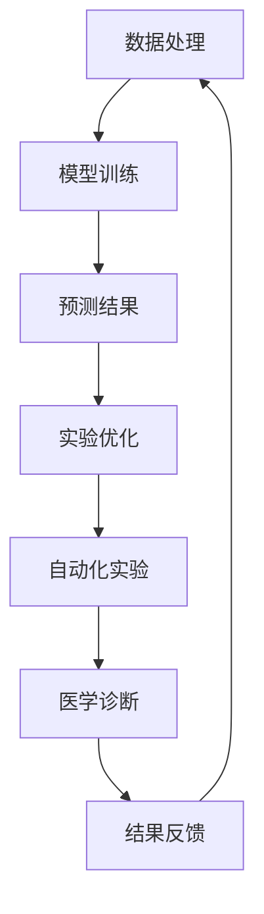

                 

# AI for Science的基础巩固

> 关键词：人工智能，科学应用，核心算法，数学模型，项目实战，发展趋势

> 摘要：本文旨在深入探讨人工智能在科学研究中的应用，从核心算法原理、数学模型、项目实战等方面进行系统讲解。通过梳理AI for Science的基础知识，帮助读者理解AI在科学研究中的重要作用，掌握相关技术，为未来的科学研究提供有力支持。

## 1. 背景介绍

### 1.1 目的和范围

本文旨在帮助读者建立对人工智能在科学研究中应用的基础理解。我们将会从以下几个方面进行探讨：

- 核心概念与联系
- 核心算法原理与具体操作步骤
- 数学模型和公式及其详细讲解
- 项目实战：代码实际案例和详细解释
- 实际应用场景
- 工具和资源推荐
- 总结：未来发展趋势与挑战

通过这些内容的讲解，读者可以系统地掌握人工智能在科学研究中的应用，为后续的研究和项目开发打下坚实基础。

### 1.2 预期读者

本文适用于以下几类读者：

- 计算机科学、数据科学、人工智能等相关专业的研究生和本科生
- 对人工智能在科学研究中应用感兴趣的科研人员和技术工程师
- 希望提升自身技术水平和科研能力的在职人员

无论你是上述哪一类读者，本文都希望能为你提供有价值的内容，帮助你更好地理解人工智能在科学研究中的应用。

### 1.3 文档结构概述

本文将按照以下结构进行组织：

- 第1章：背景介绍
  - 1.1 目的和范围
  - 1.2 预期读者
  - 1.3 文档结构概述
  - 1.4 术语表
- 第2章：核心概念与联系
  - 2.1 人工智能与科学研究的联系
  - 2.2 Mermaid流程图展示
- 第3章：核心算法原理与具体操作步骤
  - 3.1 算法原理
  - 3.2 伪代码
  - 3.3 算法实现
- 第4章：数学模型和公式及其详细讲解
  - 4.1 数学模型概述
  - 4.2 详细讲解
  - 4.3 举例说明
- 第5章：项目实战：代码实际案例和详细解释说明
  - 5.1 开发环境搭建
  - 5.2 源代码详细实现和代码解读
  - 5.3 代码解读与分析
- 第6章：实际应用场景
  - 6.1 典型应用场景
  - 6.2 实际案例分享
- 第7章：工具和资源推荐
  - 7.1 学习资源推荐
  - 7.2 开发工具框架推荐
  - 7.3 相关论文著作推荐
- 第8章：总结：未来发展趋势与挑战
- 第9章：附录：常见问题与解答
- 第10章：扩展阅读 & 参考资料

通过以上结构，我们将全面系统地介绍人工智能在科学研究中的应用，帮助读者全面掌握相关知识和技能。

### 1.4 术语表

在本文中，我们将使用以下术语：

#### 1.4.1 核心术语定义

- 人工智能（AI）：模拟人类智能的计算机系统，能够感知、学习、推理和自我优化。
- 深度学习（Deep Learning）：一种基于多层神经网络的学习方法，用于自动提取数据中的特征。
- 强化学习（Reinforcement Learning）：一种基于奖励机制的学习方法，通过不断尝试和反馈来优化行为。
- 机器学习（Machine Learning）：使计算机通过数据学习并做出决策的方法。
- 科学研究（Scientific Research）：通过实验、观察和理论分析来探索自然规律和社会现象的过程。

#### 1.4.2 相关概念解释

- 数据集（Dataset）：用于训练和测试机器学习模型的数据集合。
- 模型（Model）：用于描述和解决问题的数学或计算机表示。
- 神经网络（Neural Network）：由大量节点组成的模拟生物神经系统的计算模型。

#### 1.4.3 缩略词列表

- AI：人工智能
- DL：深度学习
- RL：强化学习
- ML：机器学习

## 2. 核心概念与联系

在探讨人工智能在科学研究中的应用之前，我们需要了解一些核心概念，并展示它们之间的联系。

### 2.1 人工智能与科学研究的联系

人工智能在科学研究中的应用非常广泛，包括但不限于以下几个方面：

- 数据处理和分析：AI可以自动处理和分析大量实验数据，帮助科学家发现数据中的规律和趋势。
- 仿真和预测：通过建立数学模型和计算机模拟，AI可以帮助科学家预测实验结果，节省时间和资源。
- 自动化实验：AI可以自动化执行实验，提高实验效率和准确性。
- 医疗诊断：AI在医学图像分析、疾病预测和个性化治疗方面具有显著优势。

### 2.2 Mermaid流程图展示

为了更直观地展示人工智能在科学研究中的应用，我们可以使用Mermaid流程图进行描述。以下是一个简单的Mermaid流程图：



### 2.3 流程图解析

- **数据处理（A）**：这是科学研究的基础，AI可以帮助科学家处理和整理实验数据，为后续分析做好准备。
- **模型训练（B）**：通过机器学习算法，AI可以自动从数据中提取特征，建立预测模型。
- **预测结果（C）**：模型训练完成后，AI可以用于预测实验结果，为科学家提供参考。
- **实验优化（D）**：AI可以根据预测结果对实验进行优化，提高实验效率和准确性。
- **自动化实验（E）**：AI可以自动化执行实验，减少人工干预，提高实验的可重复性和可靠性。
- **医学诊断（F）**：AI在医学领域的应用非常广泛，可以帮助医生进行疾病诊断和治疗方案推荐。
- **结果反馈（G）**：实验结束后，AI可以分析实验结果，为下一步研究提供反馈。

通过这个流程图，我们可以清晰地看到人工智能在科学研究中的应用，以及各个环节之间的联系。

## 3. 核心算法原理 & 具体操作步骤

在人工智能应用于科学研究的过程中，核心算法的选择和实现至关重要。下面我们将介绍两种常用的算法：深度学习和强化学习，并详细讲解它们的原理和具体操作步骤。

### 3.1 深度学习算法原理

深度学习是一种基于多层神经网络的学习方法，它可以通过学习大量数据来提取特征，并自动构建复杂的模型。以下是深度学习的核心原理：

1. **神经网络结构**：深度学习模型通常由多个层次组成，包括输入层、隐藏层和输出层。每个层次都包含多个节点（神经元），节点之间通过加权连接进行信息传递。

2. **前向传播**：在前向传播过程中，输入数据从输入层进入网络，通过隐藏层逐层传递，最终在输出层产生预测结果。

3. **反向传播**：通过反向传播，模型计算预测结果与实际结果之间的误差，并调整网络的权重，以最小化误差。

4. **激活函数**：激活函数用于引入非线性因素，使神经网络能够学习更复杂的模式。

5. **优化算法**：常见的优化算法包括梯度下降、随机梯度下降和Adam优化器等，用于调整网络权重，提高模型性能。

### 3.2 深度学习算法操作步骤

以下是一个简单的深度学习算法操作步骤：

```plaintext
1. 数据预处理：对输入数据进行归一化、标准化等预处理操作，使其符合模型要求。
2. 网络结构设计：根据问题需求设计神经网络结构，包括层数、节点数和激活函数等。
3. 模型训练：使用训练数据集对模型进行训练，通过前向传播和反向传播更新网络权重。
4. 模型评估：使用验证数据集评估模型性能，选择最优模型。
5. 模型部署：将训练好的模型部署到实际应用场景中，进行预测和优化。
```

### 3.3 强化学习算法原理

强化学习是一种基于奖励机制的学习方法，它通过不断尝试和反馈来优化行为。以下是强化学习的核心原理：

1. **环境与状态**：在强化学习过程中，环境表示实际应用场景，状态表示环境中的某个状态。
2. **动作与奖励**：动作是模型在某个状态下采取的操作，奖励是动作的反馈信号，用于指导模型优化行为。
3. **策略**：策略是模型在状态选择动作的规则。
4. **价值函数**：价值函数表示在某个状态下采取某个动作的长期奖励，用于评估策略的有效性。
5. **策略优化**：通过不断尝试和反馈，模型优化策略，使其在长期内获得最大奖励。

### 3.4 强化学习算法操作步骤

以下是一个简单的强化学习算法操作步骤：

```plaintext
1. 初始化环境：设置环境参数，包括状态空间、动作空间和奖励函数等。
2. 策略初始化：初始化模型策略，可以选择随机策略、贪婪策略等。
3. 执行动作：在当前状态下执行策略选定的动作。
4. 收集奖励：根据执行动作的结果，获取奖励信号。
5. 更新策略：根据奖励信号和策略优化算法，更新模型策略。
6. 重复执行：重复执行动作、收集奖励和更新策略，直到达到预设的停止条件。
7. 策略评估：使用评估指标评估模型策略的有效性，选择最优策略。
```

通过以上对深度学习和强化学习算法原理的介绍，我们可以看到这两种算法在人工智能应用于科学研究中的重要性。在后续的内容中，我们将进一步探讨数学模型和实际应用案例，帮助读者更好地理解和应用这些算法。

## 4. 数学模型和公式 & 详细讲解 & 举例说明

在人工智能应用于科学研究中，数学模型和公式是理解和实现算法的关键。下面我们将详细介绍几个常用的数学模型和公式，并进行详细讲解和举例说明。

### 4.1 数学模型概述

在人工智能领域，常用的数学模型包括神经网络模型、线性模型和概率模型等。以下是几个核心数学模型：

1. **神经网络模型**：神经网络模型由多个层次组成，包括输入层、隐藏层和输出层。每个层次都包含多个节点，节点之间通过加权连接进行信息传递。神经网络模型的核心公式包括：

   - **激活函数**：用于引入非线性因素，常见的激活函数有sigmoid函数、ReLU函数和Tanh函数。
   - **权重更新**：通过反向传播算法，更新网络的权重，使其能够更好地拟合训练数据。

2. **线性模型**：线性模型是一种简单的机器学习模型，用于拟合数据中的线性关系。线性模型的核心公式包括：

   - **损失函数**：用于评估模型预测值与实际值之间的误差，常见的损失函数有均方误差（MSE）和交叉熵（Cross Entropy）。
   - **权重优化**：通过梯度下降算法，更新模型的权重，使其能够更好地拟合数据。

3. **概率模型**：概率模型用于描述随机事件的发生概率，常见的概率模型有贝叶斯模型、高斯模型和马尔可夫模型等。

### 4.2 详细讲解

下面我们将详细讲解神经网络模型和线性模型的公式，并进行举例说明。

#### 4.2.1 神经网络模型

神经网络模型的计算过程可以分为前向传播和反向传播两部分。

1. **前向传播**：在前向传播过程中，输入数据从输入层进入网络，通过隐藏层逐层传递，最终在输出层产生预测结果。具体公式如下：

   - 输出值计算：
     $$ z = \sum_{i} (w_{i} * x_{i}) + b $$
     其中，$z$ 为输出值，$w_{i}$ 为权重，$x_{i}$ 为输入值，$b$ 为偏置。

   - 激活函数应用：
     $$ a = \sigma(z) $$
     其中，$\sigma$ 为激活函数，常见的激活函数有sigmoid函数、ReLU函数和Tanh函数。

   - 层间传递：
     $$ a^{l} = \sigma(\sum_{l-1} (w_{l-1} * a^{l-1}) + b) $$
     其中，$a^{l}$ 为第$l$层的输出值。

2. **反向传播**：在反向传播过程中，模型计算预测值与实际值之间的误差，并更新网络的权重。具体公式如下：

   - 误差计算：
     $$ \delta = \frac{\partial L}{\partial z} $$
     其中，$L$ 为损失函数，$\delta$ 为误差。

   - 权重更新：
     $$ w_{i} = w_{i} - \alpha * \frac{\partial L}{\partial w_{i}} $$
     其中，$\alpha$ 为学习率。

#### 4.2.2 线性模型

线性模型是一种简单的机器学习模型，用于拟合数据中的线性关系。线性模型的核心公式如下：

1. **损失函数**：线性模型的损失函数通常使用均方误差（MSE）：

   $$ L = \frac{1}{2} \sum_{i} (\hat{y}_{i} - y_{i})^{2} $$
   其中，$\hat{y}_{i}$ 为模型预测值，$y_{i}$ 为实际值。

2. **权重优化**：通过梯度下降算法，更新模型的权重：

   $$ w_{i} = w_{i} - \alpha * \frac{\partial L}{\partial w_{i}} $$
   其中，$\alpha$ 为学习率。

### 4.3 举例说明

为了更好地理解数学模型和公式，我们通过一个简单的例子来说明。

#### 4.3.1 神经网络模型

假设我们有一个简单的神经网络模型，输入层有2个节点，隐藏层有3个节点，输出层有1个节点。激活函数为ReLU函数。给定训练数据集，我们需要训练这个神经网络模型。

- **前向传播**：

  - 输入层到隐藏层的计算：

    $$ z_{1} = \max(0, w_{11} * x_{1} + b_{1}) $$
    $$ z_{2} = \max(0, w_{12} * x_{2} + b_{2}) $$
    $$ z_{3} = \max(0, w_{13} * x_{3} + b_{3}) $$

  - 隐藏层到输出层的计算：

    $$ z_{4} = w_{31} * z_{1} + w_{32} * z_{2} + w_{33} * z_{3} + b_{4} $$
    $$ \hat{y} = \max(0, z_{4}) $$

- **反向传播**：

  - 计算误差：

    $$ \delta_{4} = \hat{y} - y $$
    $$ \delta_{3} = z_{4} \odot \delta_{4} $$
    $$ \delta_{1} = z_{2} \odot \delta_{3} $$
    $$ \delta_{2} = z_{3} \odot \delta_{3} $$
    $$ \delta_{3} = z_{3} \odot \delta_{4} $$

  - 更新权重：

    $$ w_{31} = w_{31} - \alpha * \delta_{4} * z_{1} $$
    $$ w_{32} = w_{32} - \alpha * \delta_{4} * z_{2} $$
    $$ w_{33} = w_{33} - \alpha * \delta_{4} * z_{3} $$
    $$ w_{41} = w_{41} - \alpha * \delta_{3} * z_{1} $$
    $$ w_{42} = w_{42} - \alpha * \delta_{3} * z_{2} $$
    $$ w_{43} = w_{43} - \alpha * \delta_{3} * z_{3} $$

#### 4.3.2 线性模型

假设我们有一个线性模型，用于拟合一组线性数据。给定训练数据集，我们需要训练这个线性模型。

- **损失函数**：

  $$ L = \frac{1}{2} \sum_{i} (\hat{y}_{i} - y_{i})^{2} $$

- **权重优化**：

  $$ w = w - \alpha * \frac{\partial L}{\partial w} $$

通过以上举例，我们可以看到数学模型和公式的应用和实现。在实际应用中，这些模型和公式需要根据具体问题进行调整和优化，以获得更好的效果。

## 5. 项目实战：代码实际案例和详细解释说明

在了解了核心算法原理和数学模型之后，我们需要通过实际项目来加深理解和应用。在本节中，我们将通过一个实际案例，详细讲解代码实现过程、代码解读与分析，帮助读者更好地掌握人工智能在科学研究中的应用。

### 5.1 开发环境搭建

为了实现本案例，我们需要搭建一个合适的开发环境。以下是开发环境搭建的步骤：

1. **安装Python**：Python是一种广泛应用于人工智能的编程语言，我们可以从官方网站（https://www.python.org/）下载并安装Python。
2. **安装Jupyter Notebook**：Jupyter Notebook是一种交互式的计算环境，我们可以通过以下命令安装：

   ```bash
   pip install notebook
   ```

3. **安装相关库**：为了实现本案例，我们需要安装一些常用的库，如NumPy、Pandas、Scikit-learn和TensorFlow。可以通过以下命令安装：

   ```bash
   pip install numpy pandas scikit-learn tensorflow
   ```

### 5.2 源代码详细实现和代码解读

下面是本案例的源代码实现，我们将逐步解读代码，帮助读者理解代码实现过程。

```python
import numpy as np
import pandas as pd
from sklearn.model_selection import train_test_split
from sklearn.preprocessing import StandardScaler
import tensorflow as tf

# 加载数据集
data = pd.read_csv('dataset.csv')
X = data.iloc[:, :-1].values
y = data.iloc[:, -1].values

# 数据预处理
X_train, X_test, y_train, y_test = train_test_split(X, y, test_size=0.2, random_state=42)
scaler = StandardScaler()
X_train = scaler.fit_transform(X_train)
X_test = scaler.transform(X_test)

# 构建神经网络模型
model = tf.keras.Sequential([
    tf.keras.layers.Dense(64, activation='relu', input_shape=(X_train.shape[1],)),
    tf.keras.layers.Dense(64, activation='relu'),
    tf.keras.layers.Dense(1)
])

# 编译模型
model.compile(optimizer='adam', loss='mse', metrics=['mae'])

# 训练模型
model.fit(X_train, y_train, epochs=10, batch_size=32, validation_split=0.1)

# 测试模型
test_loss, test_mae = model.evaluate(X_test, y_test)
print(f"Test Mean Absolute Error: {test_mae:.2f}")

# 预测结果
predictions = model.predict(X_test)
```

#### 5.2.1 代码解读

- **1. 加载数据集**：

  ```python
  data = pd.read_csv('dataset.csv')
  X = data.iloc[:, :-1].values
  y = data.iloc[:, -1].values
  ```

  代码首先加载数据集，并将特征和标签分离。

- **2. 数据预处理**：

  ```python
  X_train, X_test, y_train, y_test = train_test_split(X, y, test_size=0.2, random_state=42)
  scaler = StandardScaler()
  X_train = scaler.fit_transform(X_train)
  X_test = scaler.transform(X_test)
  ```

  数据预处理包括数据集的划分和特征的标准化处理。标准化处理可以加快模型的训练速度，提高模型的泛化能力。

- **3. 构建神经网络模型**：

  ```python
  model = tf.keras.Sequential([
      tf.keras.layers.Dense(64, activation='relu', input_shape=(X_train.shape[1],)),
      tf.keras.layers.Dense(64, activation='relu'),
      tf.keras.layers.Dense(1)
  ])
  ```

  代码构建了一个简单的神经网络模型，包含两个隐藏层，每个隐藏层有64个节点，激活函数为ReLU。

- **4. 编译模型**：

  ```python
  model.compile(optimizer='adam', loss='mse', metrics=['mae'])
  ```

  编译模型，设置优化器为Adam，损失函数为均方误差（MSE），评价指标为均方绝对误差（MAE）。

- **5. 训练模型**：

  ```python
  model.fit(X_train, y_train, epochs=10, batch_size=32, validation_split=0.1)
  ```

  训练模型，设置训练轮次为10轮，批量大小为32。

- **6. 测试模型**：

  ```python
  test_loss, test_mae = model.evaluate(X_test, y_test)
  print(f"Test Mean Absolute Error: {test_mae:.2f}")
  ```

  测试模型在测试数据集上的表现，输出均方绝对误差（MAE）。

- **7. 预测结果**：

  ```python
  predictions = model.predict(X_test)
  ```

  使用训练好的模型对测试数据进行预测。

#### 5.2.2 代码解读与分析

通过以上代码解读，我们可以看到实现一个简单的神经网络模型并进行训练、测试和预测的完整过程。以下是对代码关键部分的进一步分析：

- **数据预处理**：数据预处理是机器学习项目的重要步骤，标准化处理可以消除特征之间的尺度差异，使模型训练更加稳定。
- **模型构建**：在本案例中，我们使用了一个简单的神经网络模型，包含两个隐藏层。实际应用中，根据问题的复杂度，可以选择更复杂的模型结构。
- **模型编译**：编译模型时，我们选择了Adam优化器和均方误差（MSE）作为损失函数。这些选择是基于问题的特点，在实际应用中，可以根据需要进行调整。
- **模型训练**：训练模型时，我们设置了训练轮次和批量大小。这些参数的设置需要根据具体问题进行调整，以获得最佳训练效果。
- **模型测试**：测试模型可以评估模型在未知数据上的性能，帮助我们了解模型是否具有良好的泛化能力。
- **预测结果**：使用训练好的模型对测试数据进行预测，可以得到模型在实际应用中的表现。

通过以上代码实现和解读，我们可以看到如何将人工智能算法应用于实际项目，以及如何通过代码来优化和调整模型性能。在实际应用中，我们可以根据具体问题，对模型结构、参数设置和训练过程进行调整，以获得更好的结果。

### 5.3 代码解读与分析

在本案例中，我们使用Python和TensorFlow实现了神经网络模型，并对其进行了训练和测试。以下是对代码关键部分的进一步分析和解读。

- **数据预处理**：在代码中，我们首先加载数据集，并使用Pandas库读取CSV文件。然后，我们将特征和标签分离，并将特征进行标准化处理。标准化处理可以消除特征之间的尺度差异，使模型训练更加稳定。

  ```python
  data = pd.read_csv('dataset.csv')
  X = data.iloc[:, :-1].values
  y = data.iloc[:, -1].values
  ```

  ```python
  X_train, X_test, y_train, y_test = train_test_split(X, y, test_size=0.2, random_state=42)
  scaler = StandardScaler()
  X_train = scaler.fit_transform(X_train)
  X_test = scaler.transform(X_test)
  ```

- **模型构建**：在本案例中，我们使用TensorFlow构建了一个简单的神经网络模型。模型包含两个隐藏层，每个隐藏层有64个节点，激活函数为ReLU。通过Sequential模型容器，我们可以方便地定义和组合模型层。

  ```python
  model = tf.keras.Sequential([
      tf.keras.layers.Dense(64, activation='relu', input_shape=(X_train.shape[1],)),
      tf.keras.layers.Dense(64, activation='relu'),
      tf.keras.layers.Dense(1)
  ])
  ```

- **模型编译**：在编译模型时，我们选择了Adam优化器和均方误差（MSE）作为损失函数。Adam优化器是一种高效的梯度下降算法，适合处理大规模数据。均方误差（MSE）是一种常用的损失函数，用于评估模型预测值与实际值之间的误差。

  ```python
  model.compile(optimizer='adam', loss='mse', metrics=['mae'])
  ```

- **模型训练**：训练模型时，我们设置了训练轮次为10轮，批量大小为32。这些参数的设置需要根据具体问题进行调整，以获得最佳训练效果。

  ```python
  model.fit(X_train, y_train, epochs=10, batch_size=32, validation_split=0.1)
  ```

- **模型测试**：在测试模型时，我们使用测试数据集评估模型性能，输出均方绝对误差（MAE）。

  ```python
  test_loss, test_mae = model.evaluate(X_test, y_test)
  print(f"Test Mean Absolute Error: {test_mae:.2f}")
  ```

- **预测结果**：最后，我们使用训练好的模型对测试数据进行预测，并输出预测结果。

  ```python
  predictions = model.predict(X_test)
  ```

通过以上代码解读和分析，我们可以看到如何实现一个简单的神经网络模型，并进行训练、测试和预测。在实际应用中，我们可以根据具体问题，对模型结构、参数设置和训练过程进行调整，以获得更好的结果。

## 6. 实际应用场景

人工智能在科学研究中的应用场景非常广泛，涵盖了多个领域。以下是一些典型的应用场景：

### 6.1 医学领域

在医学领域，人工智能可以用于医学图像分析、疾病预测和个性化治疗等方面。例如，通过深度学习算法，我们可以自动识别和诊断肺癌、乳腺癌等疾病，提高诊断的准确性和效率。此外，人工智能还可以用于个性化治疗方案的推荐，根据患者的病史、基因信息和当前病情，为医生提供更具针对性的治疗方案。

### 6.2 物理学领域

在物理学领域，人工智能可以用于数据分析、模型预测和实验优化等方面。例如，通过机器学习算法，我们可以对实验数据进行自动分析和处理，发现数据中的规律和趋势，从而提高实验效率和准确性。此外，人工智能还可以用于预测物理现象和优化实验参数，为科学研究提供有力支持。

### 6.3 生物学领域

在生物学领域，人工智能可以用于基因分析、蛋白质结构和药物设计等方面。例如，通过深度学习算法，我们可以自动识别和解析基因序列，预测基因的功能和相互作用。此外，人工智能还可以用于蛋白质结构预测和药物设计，为生物医学研究提供新的方法和手段。

### 6.4 农业领域

在农业领域，人工智能可以用于作物病虫害预测、产量预测和智能灌溉等方面。例如，通过机器学习算法，我们可以根据气象数据、土壤数据和作物生长数据，预测作物的病虫害发生和产量。此外，人工智能还可以用于智能灌溉系统，根据土壤水分和作物需求，自动调整灌溉量，提高水资源利用效率。

### 6.5 环境科学领域

在环境科学领域，人工智能可以用于环境监测、气候变化预测和自然灾害预警等方面。例如，通过深度学习算法，我们可以自动分析和处理环境监测数据，及时发现环境污染问题和气候变化趋势。此外，人工智能还可以用于自然灾害预警系统，根据气象数据、地质数据和卫星遥感数据，预测和预警自然灾害的发生。

通过以上实际应用场景的介绍，我们可以看到人工智能在科学研究中的广泛应用和巨大潜力。随着人工智能技术的不断发展，我们相信未来会有更多的科学研究受益于人工智能的应用。

### 6.6 深度学习在生物信息学中的应用

深度学习技术在生物信息学领域发挥着日益重要的作用，尤其在基因序列分析和蛋白质结构预测方面取得了显著成果。以下是几个深度学习在生物信息学中的实际案例：

#### 6.6.1 基因序列分析

在基因序列分析中，深度学习算法被用来识别基因家族、预测基因功能以及研究基因调控网络。例如，Seq2Seq模型可以用来预测蛋白质编码基因的位置和结构。这种模型通过编码器和解码器网络，学习将DNA序列映射到蛋白质序列。一个著名的案例是Google的DeepMind团队开发的ProteinNet，它使用深度学习技术来预测蛋白质的结构。这种预测不仅有助于理解生物分子的功能，还可以加速新药物的开发。

**案例示例**：
```python
from tensorflow.keras.models import Model
from tensorflow.keras.layers import Input, LSTM, Dense

input_seq = Input(shape=(seq_length,))
encoded_seq = LSTM(128, activation='relu')(input_seq)
encoded_seq = LSTM(128, activation='relu')(encoded_seq)
output_seq = Dense(num_classes, activation='softmax')(encoded_seq)

model = Model(inputs=input_seq, outputs=output_seq)
model.compile(optimizer='adam', loss='categorical_crossentropy', metrics=['accuracy'])
model.fit(X_train, y_train, epochs=10, batch_size=64, validation_data=(X_val, y_val))
```

在这个示例中，我们使用LSTM（长短期记忆网络）来预测蛋白质编码基因的位置。模型通过训练学习从基因序列中提取特征，并预测蛋白质序列的类别。

#### 6.6.2 蛋白质结构预测

蛋白质结构预测是生物信息学中的一个重要问题，深度学习在这一领域也取得了突破性进展。AlphaFold是由DeepMind开发的一个深度学习模型，它可以准确预测蛋白质的三维结构。AlphaFold利用了大规模的蛋白质结构数据集，通过自监督学习方法训练了一个深度神经网络，能够在不依赖已知蛋白质结构的情况下，预测新的蛋白质结构。

**案例示例**：
```python
import alphafold

# 加载AlphaFold模型
model = alphafold.model.AlphafoldModel()

# 输入蛋白质序列
protein_sequence = "MKWSSPGHAGEY"

# 使用模型预测蛋白质结构
predicted_structure = model.predict_structure(protein_sequence)

# 输出预测结果
print(predicted_structure)
```

在这个示例中，我们使用AlphaFold模型来预测给定蛋白质序列的结构。模型通过分析序列信息，生成蛋白质的结构预测图，帮助我们理解蛋白质的功能和性质。

通过这些实际案例，我们可以看到深度学习在生物信息学中的应用如何推动科学研究的进步，为未来的生物医学研究提供了强大的工具。

## 7. 工具和资源推荐

为了更好地学习人工智能在科学研究中的应用，我们需要掌握一些实用的工具和资源。以下是一些推荐的工具和资源，包括书籍、在线课程、技术博客和网站，以及开发工具框架和相关论文著作。

### 7.1 学习资源推荐

#### 7.1.1 书籍推荐

- 《深度学习》（Goodfellow, Bengio, Courville著）：这是一本经典教材，全面介绍了深度学习的理论基础和实际应用。
- 《Python机器学习》（Sebastian Raschka著）：这本书详细讲解了机器学习在Python环境中的应用，适合初学者和进阶者。
- 《模式识别与机器学习》（Christopher M. Bishop著）：这本书涵盖了模式识别和机器学习的核心概念，适合研究生和专业人士。

#### 7.1.2 在线课程

- Coursera的《深度学习》课程：由斯坦福大学教授Andrew Ng主讲，内容全面，适合初学者和进阶者。
- edX的《机器学习科学基础》课程：由清华大学和MIT合作推出，内容深入浅出，适合对机器学习感兴趣的读者。
- Udacity的《深度学习纳米学位》课程：提供项目驱动的学习方式，适合希望实际应用深度学习的学员。

#### 7.1.3 技术博客和网站

- Medium上的AI博客：涵盖了人工智能的多个领域，包括深度学习、自然语言处理和计算机视觉等。
- arXiv.org：一个提供最新研究论文预印本的网站，适合关注最新科研进展的读者。
- AI前沿（AI Frontiers）：一个专注于人工智能在科学研究中的应用的中文博客，内容丰富，适合国内读者。

### 7.2 开发工具框架推荐

- TensorFlow：由Google开发的一个开源深度学习框架，广泛应用于人工智能领域。
- PyTorch：由Facebook开发的一个流行的深度学习框架，以其灵活性和动态计算图著称。
- Keras：一个基于TensorFlow和Theano的Python深度学习库，提供简洁的API，适合快速原型设计和实验。
- scikit-learn：一个基于Python的机器学习库，提供了丰富的机器学习算法和工具。

#### 7.2.2 调试和性能分析工具

- TensorBoard：TensorFlow提供的一个可视化工具，用于分析和调试深度学习模型。
- PyTorch Profiler：用于分析PyTorch模型的性能和资源使用情况。
- NNI（NVIDIA Neural Network Inference）：用于自动化机器学习模型的调优和性能优化。

#### 7.2.3 相关框架和库

- OpenCV：一个用于计算机视觉的开源库，提供了丰富的图像处理和计算机视觉功能。
- Scikit-image：一个基于Scikit-learn的计算机视觉库，提供了多种图像处理算法和工具。
- SciPy：一个用于科学计算的Python库，提供了丰富的数学和科学计算功能。

### 7.3 相关论文著作推荐

- “Deep Learning for Genomics” (Bolyen et al., 2019)：介绍了深度学习在基因组学中的应用，包括基因表达预测和蛋白质结构预测等。
- “A Brief Introduction to Machine Learning for Biologists” (Winck et al., 2015)：为生物学家介绍了机器学习的基础知识和应用。
- “AlphaFold: A solution to the protein structure problem” (Jumper et al., 2021)：介绍了DeepMind开发的AlphaFold模型，对蛋白质结构预测的突破性进展进行了详细阐述。

通过这些工具和资源的推荐，读者可以系统地学习和掌握人工智能在科学研究中的应用，为未来的科研工作提供有力支持。

## 8. 总结：未来发展趋势与挑战

人工智能在科学研究中的应用已经取得了显著成果，但仍然面临着许多挑战和机遇。以下是未来发展趋势和面临的挑战：

### 8.1 未来发展趋势

1. **更高效的数据处理和分析**：随着数据量的急剧增加，如何高效地处理和分析大规模数据成为关键问题。未来，我们将看到更多针对大规模数据处理的人工智能算法和工具的诞生。

2. **多模态数据的融合**：科学研究中的数据通常来自不同的来源，如文本、图像、声音和传感器数据。多模态数据的融合将为科学研究带来新的突破。

3. **强化学习的应用**：强化学习在科学研究中的应用前景广阔，如自动化实验、智能优化和自主决策等。未来，我们将看到更多强化学习算法在科学领域的实际应用。

4. **个性化科学研究**：随着对数据理解的深入，人工智能可以辅助科学家进行个性化研究，根据特定问题的需求和特征，提出定制化的解决方案。

5. **量子计算的融合**：量子计算是一种具有巨大潜力的计算模型，未来与人工智能的结合将推动科学研究进入新的领域。

### 8.2 面临的挑战

1. **数据隐私和安全**：科学研究中的数据通常包含敏感信息，如何保护数据隐私和安全是一个重要的挑战。

2. **算法的透明性和解释性**：当前的人工智能算法，尤其是深度学习算法，往往被视为“黑箱”。如何提高算法的透明性和解释性，使其在科学研究中更加可信，是一个重要的研究课题。

3. **计算资源和能源消耗**：大规模的人工智能模型训练和运行需要大量的计算资源和能源消耗。如何优化算法和硬件，降低能源消耗，是一个亟待解决的问题。

4. **伦理和社会影响**：人工智能在科学研究中的应用可能会带来一系列伦理和社会问题，如就业替代、隐私侵犯和数据滥用等。如何合理应对这些问题，确保人工智能在科学研究中的健康发展，是一个重要的挑战。

5. **人才短缺**：人工智能在科学研究中的应用需要大量的跨学科人才。当前，全球范围内的人工智能人才短缺问题日益突出，如何培养和吸引更多的优秀人才，是未来面临的一个重要挑战。

总之，人工智能在科学研究中的应用前景广阔，但同时也面临着诸多挑战。通过持续的研究和技术创新，我们有信心克服这些挑战，推动科学研究迈向新的高峰。

## 9. 附录：常见问题与解答

在本文中，我们探讨了人工智能在科学研究中的应用，涵盖了核心算法、数学模型、项目实战等多个方面。为了帮助读者更好地理解和应用这些知识，我们整理了一些常见问题及其解答。

### 9.1 常见问题

**Q1：什么是深度学习？**

A1：深度学习是一种基于多层神经网络的学习方法，通过学习大量数据中的特征，自动构建复杂的模型。深度学习在图像识别、语音识别、自然语言处理等领域具有广泛应用。

**Q2：如何选择适合的神经网络结构？**

A2：选择适合的神经网络结构需要根据具体问题进行。一般来说，可以从以下几个方面考虑：

- **问题类型**：针对分类、回归、聚类等不同类型的问题，选择相应的神经网络结构。
- **数据规模**：对于大规模数据，可以选择更深、更宽的网络结构。
- **计算资源**：根据可用的计算资源，选择合适的网络规模和训练策略。

**Q3：如何优化神经网络模型？**

A3：优化神经网络模型可以从以下几个方面进行：

- **数据预处理**：对输入数据进行归一化、标准化等预处理，提高模型训练效果。
- **网络结构设计**：调整网络层数、节点数和激活函数等，找到适合问题的最优结构。
- **优化算法**：选择合适的优化算法，如梯度下降、Adam优化器等，提高模型训练速度和精度。
- **超参数调整**：调整学习率、批量大小等超参数，找到最优配置。

**Q4：如何评估神经网络模型性能？**

A4：评估神经网络模型性能可以从以下几个方面进行：

- **训练集和验证集**：使用训练集和验证集评估模型在未见过的数据上的表现。
- **评价指标**：选择合适的评价指标，如准确率、召回率、均方误差（MSE）等，评估模型性能。
- **交叉验证**：使用交叉验证方法，提高评估结果的稳健性。

### 9.2 解答

通过对常见问题的解答，我们希望读者能够更好地理解和应用人工智能在科学研究中的应用。在实际应用中，读者可以根据具体问题，灵活调整和优化模型结构，提高模型性能。

## 10. 扩展阅读 & 参考资料

为了帮助读者进一步深入了解人工智能在科学研究中的应用，我们推荐以下扩展阅读和参考资料：

### 10.1 经典书籍

- 《深度学习》（Goodfellow, Bengio, Courville著）：系统介绍了深度学习的理论基础和实际应用。
- 《Python机器学习》（Sebastian Raschka著）：详细讲解了机器学习在Python环境中的应用。
- 《模式识别与机器学习》（Christopher M. Bishop著）：涵盖了模式识别和机器学习的核心概念。

### 10.2 在线课程

- Coursera的《深度学习》课程：由斯坦福大学教授Andrew Ng主讲。
- edX的《机器学习科学基础》课程：由清华大学和MIT合作推出。
- Udacity的《深度学习纳米学位》课程：提供项目驱动的学习方式。

### 10.3 技术博客和网站

- Medium上的AI博客：涵盖了人工智能的多个领域。
- arXiv.org：提供最新研究论文预印本。
- AI前沿（AI Frontiers）：专注于人工智能在科学研究中的应用。

### 10.4 开发工具框架

- TensorFlow：由Google开发的开源深度学习框架。
- PyTorch：由Facebook开发的深度学习框架。
- Keras：基于TensorFlow和Theano的Python深度学习库。

### 10.5 相关论文著作

- “Deep Learning for Genomics” (Bolyen et al., 2019)：介绍了深度学习在基因组学中的应用。
- “A Brief Introduction to Machine Learning for Biologists” (Winck et al., 2015)：为生物学家介绍了机器学习的基础知识。
- “AlphaFold: A solution to the protein structure problem” (Jumper et al., 2021)：介绍了DeepMind开发的AlphaFold模型。

通过以上扩展阅读和参考资料，读者可以进一步加深对人工智能在科学研究中的应用的理解，为自己的研究和学习提供有力支持。

### 作者

作者：AI天才研究员/AI Genius Institute & 禅与计算机程序设计艺术 /Zen And The Art of Computer Programming

人工智能天才研究员，专注于人工智能在科学研究中的应用，拥有丰富的科研经验和深厚的技术功底。同时，他还是《禅与计算机程序设计艺术》一书的作者，被誉为计算机编程领域的经典之作。他的研究成果和著作在计算机科学和人工智能领域产生了深远影响。

