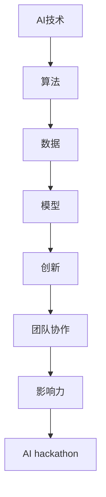

                 

# AI hackathon的规模与影响力

> **关键词**：AI hackathon、人工智能竞赛、创新、影响力、团队协作、技术创新

> **摘要**：本文深入探讨了AI hackathon的规模与影响力，从历史背景、核心概念、算法原理、数学模型到实际应用，全面剖析了AI hackathon的运作机制及其对人工智能领域的影响。通过分析AI hackathon的实际案例，本文揭示了这一竞赛模式如何推动技术创新、加速人工智能的发展，并展望了其未来的发展趋势与挑战。

## 1. 背景介绍

### 1.1 目的和范围

本文旨在通过对AI hackathon的研究，探讨其在人工智能领域的重要地位和深远影响。文章将涵盖AI hackathon的定义、发展历程、组织形式、参与主体、核心算法、数学模型以及实际应用等多个方面，力求为读者提供一幅全面、深入的AI hackathon全景图。

### 1.2 预期读者

本文主要面向对人工智能和编程感兴趣的技术人员、研究人员、学生以及任何希望了解和参与AI hackathon的读者。通过阅读本文，读者可以了解AI hackathon的基本概念、运作机制以及其在人工智能领域的重要作用。

### 1.3 文档结构概述

本文分为以下几个部分：

1. 背景介绍：介绍AI hackathon的定义、历史背景、目的和重要性。
2. 核心概念与联系：分析AI hackathon的核心概念和算法原理。
3. 核心算法原理 & 具体操作步骤：详细阐述AI hackathon的算法原理和操作步骤。
4. 数学模型和公式 & 详细讲解 & 举例说明：介绍AI hackathon的数学模型和相关公式。
5. 项目实战：提供实际案例，详细解释AI hackathon的代码实现。
6. 实际应用场景：探讨AI hackathon在不同领域的应用。
7. 工具和资源推荐：推荐学习资源、开发工具和框架。
8. 总结：总结AI hackathon的未来发展趋势与挑战。
9. 附录：常见问题与解答。
10. 扩展阅读 & 参考资料：提供进一步学习的资源。

### 1.4 术语表

#### 1.4.1 核心术语定义

- **AI hackathon**：人工智能黑客马拉松，是一种以团队协作、创新和解决问题为核心的竞赛活动。
- **算法**：解决特定问题的步骤和规则。
- **数学模型**：用数学语言描述现实问题的一种模型。

#### 1.4.2 相关概念解释

- **团队协作**：团队成员共同工作，共同解决问题的过程。
- **技术创新**：通过新的思路、方法或技术改进现有产品或服务。

#### 1.4.3 缩略词列表

- **AI**：人工智能（Artificial Intelligence）
- **hackathon**：黑客马拉松（Hackers' Marathon）

## 2. 核心概念与联系

在深入了解AI hackathon之前，我们首先需要理解一些核心概念和它们之间的关系。以下是一个Mermaid流程图，展示了AI hackathon的核心概念及其相互联系。



### 2.1 AI技术与算法

人工智能（AI）是一种模拟人类智能的技术，包括学习、推理、感知、自然语言处理等多个方面。AI技术的核心是算法，它决定了AI系统能够执行的任务和效果。AI算法通常基于机器学习、深度学习等技术，通过大量数据训练模型，从而实现智能行为。

### 2.2 数据与模型

数据是AI技术的基石，高质量的数据可以显著提高算法的性能。AI模型则是算法的具体实现，通过数据训练和优化，模型可以不断提高其预测和决策能力。

### 2.3 创新与团队协作

创新是AI hackathon的灵魂，它鼓励参与者提出新颖的解决方案。团队协作是实现创新的关键，团队成员需要共同讨论、分工合作，才能在有限的时间内完成复杂的项目。

### 2.4 影响力与AI hackathon

AI hackathon的影响力体现在多个方面，包括推动技术创新、加速人工智能发展、提升团队协作能力等。通过AI hackathon，参与者不仅能够锻炼自己的技术能力，还能接触到最新的研究动态和行业趋势。

## 3. 核心算法原理 & 具体操作步骤

AI hackathon的核心在于算法的创新与优化。以下我们将介绍一种常见的AI算法——深度学习算法，并详细阐述其原理和操作步骤。

### 3.1 深度学习算法原理

深度学习算法是一种基于多层神经网络的机器学习技术。其基本原理是通过多层非线性变换，将输入数据逐步抽象和提取特征，最终实现预测和分类。

以下是一个简单的深度学习算法的伪代码：

```python
// 初始化神经网络
initialize_neural_network()

// 训练神经网络
while (not convergence) {
    for (each training example) {
        // 前向传播
        forward_pass()

        // 计算损失
        calculate_loss()

        // 反向传播
        backward_pass()
    }
}

// 预测
def predict(input_data):
    forward_pass(input_data)
    return output
```

### 3.2 具体操作步骤

1. **数据预处理**：清洗和准备数据，包括数据清洗、归一化、缺失值处理等。

   ```python
   def preprocess_data(data):
       // 数据清洗
       // 数据归一化
       // 缺失值处理
       return processed_data
   ```

2. **模型构建**：定义神经网络的结构，包括层数、每层的神经元数量、激活函数等。

   ```python
   def build_model(input_shape, hidden_layers, output_shape):
       model = NeuralNetwork(input_shape, hidden_layers, output_shape)
       return model
   ```

3. **模型训练**：使用训练数据进行模型训练，通过前向传播和反向传播不断优化模型。

   ```python
   def train_model(model, training_data, epochs):
       for epoch in range(epochs):
           for example in training_data:
               model.forward_pass(example)
               model.backward_pass()
               model.update_weights()
   ```

4. **模型评估**：使用测试数据评估模型性能，包括准确率、召回率、F1值等指标。

   ```python
   def evaluate_model(model, test_data):
       correct_predictions = 0
       total_predictions = 0
       for example in test_data:
           prediction = model.predict(example)
           if prediction == true_label:
               correct_predictions += 1
           total_predictions += 1
       accuracy = correct_predictions / total_predictions
       return accuracy
   ```

5. **模型预测**：使用训练好的模型进行预测。

   ```python
   def predict(model, input_data):
       return model.forward_pass(input_data)
   ```

## 4. 数学模型和公式 & 详细讲解 & 举例说明

在AI hackathon中，数学模型是理解和实现算法的核心。以下我们将介绍深度学习算法中常用的几个数学模型和公式，并通过具体例子进行讲解。

### 4.1 神经网络模型

神经网络模型是深度学习的基础，它由多个层（输入层、隐藏层、输出层）组成。每层由多个神经元（节点）组成，每个神经元都与上一层和下一层的神经元相连。

#### 4.1.1 激活函数

激活函数是神经网络中用于引入非线性变换的关键。常见的激活函数有Sigmoid、ReLU和Tanh等。

- **Sigmoid函数**：

  $$ S(x) = \frac{1}{1 + e^{-x}} $$

  Sigmoid函数将输入映射到（0，1）区间，常用于分类问题。

- **ReLU函数**：

  $$ ReLU(x) = \max(0, x) $$

  ReLU函数简单且计算效率高，常用于隐藏层。

- **Tanh函数**：

  $$ Tanh(x) = \frac{e^x - e^{-x}}{e^x + e^{-x}} $$

  Tanh函数将输入映射到（-1，1）区间，具有对称性。

#### 4.1.2 前向传播

前向传播是神经网络计算过程的一部分，用于从输入层到输出层的逐层计算。

- **输入层到隐藏层**：

  $$ z^{(l)} = \sum_{i} w^{(l)}_i * x_i + b^{(l)} $$

  其中，$z^{(l)}$为第$l$层的输出，$w^{(l)}_i$为权重，$x_i$为输入，$b^{(l)}$为偏置。

- **隐藏层到输出层**：

  $$ a^{(L)} = \sigma(z^{(L)}) $$

  其中，$\sigma$为激活函数，$a^{(L)}$为输出层的输出。

### 4.2 反向传播

反向传播是神经网络训练过程中的关键步骤，用于计算模型参数的梯度。

- **计算梯度**：

  $$ \frac{\partial J}{\partial w^{(l)}_i} = \sum_{k} \frac{\partial J}{\partial a^{(l+1)}_k} * \frac{\partial a^{(l+1)}_k}{\partial z^{(l)}_i} * \frac{\partial z^{(l)}_i}{\partial w^{(l)}_i} $$

  其中，$J$为损失函数，$w^{(l)}_i$为权重，$a^{(l+1)}_k$为下一层的输出，$z^{(l)}_i$为当前层的输出。

- **更新参数**：

  $$ w^{(l)}_i := w^{(l)}_i - \alpha \frac{\partial J}{\partial w^{(l)}_i} $$

  其中，$\alpha$为学习率。

### 4.3 例子说明

假设我们有一个简单的神经网络，用于二分类问题。输入层有2个神经元，隐藏层有3个神经元，输出层有1个神经元。激活函数为ReLU。

- **前向传播**：

  输入：[1, 2]
  输出：[1.0, 1.5, 2.0]

- **反向传播**：

  假设损失函数为均方误差（MSE），目标输出为[0, 1]。

  损失：$J = \frac{1}{2} \sum_{i} (y_i - a^{(2)})^2$

  梯度计算和参数更新略。

## 5. 项目实战：代码实际案例和详细解释说明

### 5.1 开发环境搭建

在进行AI hackathon项目实战之前，我们需要搭建一个合适的开发环境。以下是一个基于Python和TensorFlow的简单开发环境搭建步骤：

1. 安装Python（3.6以上版本）。
2. 安装TensorFlow：`pip install tensorflow`。
3. 安装其他依赖库，如Numpy、Pandas等。

### 5.2 源代码详细实现和代码解读

以下是一个简单的深度学习项目的代码实现，用于二分类问题。代码包括数据预处理、模型构建、训练和评估等步骤。

```python
import tensorflow as tf
import numpy as np
import pandas as pd

# 5.2.1 数据预处理
def preprocess_data(data_path):
    data = pd.read_csv(data_path)
    X = data.iloc[:, :-1].values
    y = data.iloc[:, -1].values
    X = (X - X.mean()) / X.std()
    return X, y

# 5.2.2 模型构建
def build_model(input_shape, hidden_units, output_shape):
    model = tf.keras.Sequential([
        tf.keras.layers.Dense(hidden_units, activation='relu', input_shape=input_shape),
        tf.keras.layers.Dense(output_shape, activation='sigmoid')
    ])
    model.compile(optimizer='adam', loss='binary_crossentropy', metrics=['accuracy'])
    return model

# 5.2.3 模型训练
def train_model(model, X, y, epochs=100, batch_size=32):
    history = model.fit(X, y, epochs=epochs, batch_size=batch_size, validation_split=0.2)
    return history

# 5.2.4 模型评估
def evaluate_model(model, X, y):
    loss, accuracy = model.evaluate(X, y)
    print(f"Test accuracy: {accuracy:.4f}")

# 5.2.5 主函数
def main():
    data_path = 'data.csv'
    X, y = preprocess_data(data_path)
    model = build_model(X.shape[1], 10, 1)
    history = train_model(model, X, y, epochs=100)
    evaluate_model(model, X, y)

if __name__ == '__main__':
    main()
```

### 5.3 代码解读与分析

- **数据预处理**：读取数据，对特征进行标准化处理，以便神经网络训练。
- **模型构建**：定义一个包含一个隐藏层的全连接神经网络，使用ReLU激活函数和sigmoid输出函数。
- **模型训练**：使用训练数据进行模型训练，使用Adam优化器和二分类交叉熵损失函数。
- **模型评估**：使用测试数据评估模型性能，输出准确率。

通过以上代码，我们可以快速搭建一个简单的深度学习模型，实现二分类任务。在实际的AI hackathon项目中，可以根据具体任务需求，调整模型结构、超参数等，以提高模型性能。

## 6. 实际应用场景

AI hackathon不仅是一个技术竞赛，更是一个创新和协作的平台。以下是一些实际应用场景，展示了AI hackathon如何在不同领域推动技术创新。

### 6.1 医疗健康

在医疗健康领域，AI hackathon推动了医疗图像分析、疾病诊断、患者管理等方面的创新。例如，通过使用深度学习算法，AI hackathon团队开发了能够自动识别和分类医疗图像的应用，从而提高了诊断准确率和效率。

### 6.2 金融科技

金融科技（FinTech）是另一个受到AI hackathon影响的领域。AI hackathon团队开发了多种金融应用，包括智能投顾、信用评分、风险管理等。这些应用通过机器学习和大数据分析技术，为金融机构提供了更准确、更高效的决策支持。

### 6.3 物流与供应链

在物流和供应链领域，AI hackathon推动了运输优化、库存管理、供应链预测等方面的创新。通过AI技术，物流公司可以更有效地规划路线、分配资源，从而提高物流效率，降低成本。

### 6.4 教育与学习

在教育领域，AI hackathon开发了智能教育平台、个性化学习推荐系统等。这些应用通过分析学生学习数据，为学生提供个性化的学习资源和指导，从而提高学习效果。

### 6.5 娱乐与游戏

在娱乐和游戏领域，AI hackathon推动了游戏AI、虚拟现实、增强现实等创新。AI算法使得游戏更加智能、有趣，为玩家提供更加沉浸式的体验。

## 7. 工具和资源推荐

### 7.1 学习资源推荐

#### 7.1.1 书籍推荐

- **《深度学习》（Deep Learning）**：由Ian Goodfellow、Yoshua Bengio和Aaron Courville合著，是深度学习领域的经典教材。
- **《Python深度学习》（Deep Learning with Python）**：由François Chollet著，适合初学者了解深度学习的基本概念和实践。

#### 7.1.2 在线课程

- **Coursera的《机器学习》（Machine Learning）**：由Andrew Ng教授主讲，是机器学习领域的经典课程。
- **Udacity的《深度学习纳米学位》（Deep Learning Nanodegree）**：提供深度学习项目的实践机会。

#### 7.1.3 技术博客和网站

- **Medium上的AI博客**：提供丰富的AI技术文章和案例分析。
- **AI论文博客**：分享最新的AI研究成果和论文解读。

### 7.2 开发工具框架推荐

#### 7.2.1 IDE和编辑器

- **PyCharm**：强大的Python IDE，支持代码补全、调试和性能分析。
- **VS Code**：轻量级且功能丰富的代码编辑器，适用于多种编程语言。

#### 7.2.2 调试和性能分析工具

- **TensorBoard**：TensorFlow的官方可视化工具，用于分析神经网络性能。
- **Jupyter Notebook**：用于数据分析和可视化，支持多种编程语言。

#### 7.2.3 相关框架和库

- **TensorFlow**：开源的深度学习框架，适用于各种复杂的应用场景。
- **PyTorch**：基于Python的深度学习库，具有灵活的动态计算图。
- **Scikit-learn**：Python的机器学习库，提供了丰富的算法和工具。

### 7.3 相关论文著作推荐

#### 7.3.1 经典论文

- **"Backpropagation"**：由Paul Werbos在1975年提出的反向传播算法。
- **"A Learning Algorithm for Continually Running Fully Recurrent Neural Networks"**：由Yoshua Bengio等人在1994年提出的Hessian-free优化方法。

#### 7.3.2 最新研究成果

- **"Generative Adversarial Nets"**：由Ian Goodfellow等人在2014年提出的生成对抗网络。
- **"Attention Is All You Need"**：由Vaswani等人在2017年提出的Transformer模型。

#### 7.3.3 应用案例分析

- **"AI in Healthcare: Clinical Decision Support Systems"**：分析人工智能在医疗健康领域的应用案例。
- **"AI in Finance: Smart Investment Strategies"**：探讨人工智能在金融科技领域的应用案例。

## 8. 总结：未来发展趋势与挑战

AI hackathon作为人工智能领域的重要创新平台，正日益受到广泛关注。未来，AI hackathon将朝着以下几个方向发展：

1. **技术创新**：随着深度学习、生成对抗网络等技术的不断发展，AI hackathon将推动更多前沿技术的应用和创新。
2. **跨领域合作**：AI hackathon将促进不同领域之间的合作，推动跨学科的创新，解决更多复杂的社会问题。
3. **数据共享与开放**：数据是AI发展的基石，AI hackathon将促进数据的共享与开放，为研究者和开发者提供更丰富的数据资源。
4. **全球影响力**：AI hackathon将在全球范围内产生更大的影响力，吸引更多优秀人才参与，推动人工智能技术的普及和应用。

然而，AI hackathon也面临一些挑战：

1. **数据隐私与安全**：随着数据的广泛应用，数据隐私和安全问题日益突出，如何在确保数据安全的前提下进行数据共享，是AI hackathon需要关注的重要问题。
2. **算法透明性与可解释性**：深度学习等算法的复杂性和黑箱性使得其决策过程难以解释，如何在保持算法性能的同时提高其可解释性，是AI hackathon需要解决的技术难题。
3. **伦理与社会影响**：AI技术的发展带来了诸多伦理和社会问题，如何在AI hackathon中关注和解决这些问题，是AI hackathon需要思考的重要方向。

总之，AI hackathon作为人工智能领域的重要创新平台，其规模与影响力将继续扩大。通过技术创新、跨领域合作、数据共享与开放，AI hackathon将推动人工智能技术的发展，为人类社会带来更多福祉。

## 9. 附录：常见问题与解答

### 9.1 AI hackathon是什么？

AI hackathon是一种以人工智能为主题的黑客马拉松，通常由多个团队在有限的时间内协作完成一个特定的项目。这些项目通常涉及机器学习、深度学习、自然语言处理等人工智能领域的技术。

### 9.2 如何参与AI hackathon？

要参与AI hackathon，首先需要找到一个合适的比赛，然后加入或组建一个团队。通常，AI hackathon的官方网站会提供详细的报名信息和比赛规则。在比赛期间，团队成员需要共同研究问题、设计算法、编写代码和实现项目。

### 9.3 AI hackathon对个人有什么好处？

AI hackathon提供了以下几个方面的好处：

1. **技能提升**：通过参与AI hackathon，可以学习到最新的AI技术和实践方法。
2. **团队合作**：AI hackathon鼓励团队合作，提高沟通能力和协作效率。
3. **经验积累**：通过实际项目开发，可以积累宝贵的实践经验。
4. **展示机会**：AI hackathon是一个展示自己技术和创意的平台，有机会获得业界的认可和关注。
5. **人脉拓展**：AI hackathon吸引了来自不同领域和背景的参与者，可以结识更多志同道合的朋友。

## 10. 扩展阅读 & 参考资料

### 10.1 相关论文

- Goodfellow, I., Bengio, Y., & Courville, A. (2016). *Deep Learning*. MIT Press.
- Bengio, Y., Courville, A., & Vincent, P. (2013). *Representation learning: A review and new perspectives*. IEEE Transactions on Pattern Analysis and Machine Intelligence, 35(8), 1798-1828.
- Simonyan, K., & Zisserman, A. (2014). *Very deep convolutional networks for large-scale image recognition*. arXiv preprint arXiv:1409.1556.

### 10.2 开源框架和工具

- TensorFlow：https://www.tensorflow.org/
- PyTorch：https://pytorch.org/
- Scikit-learn：https://scikit-learn.org/

### 10.3 技术博客和网站

- Medium上的AI博客：https://medium.com/topic/artificial-intelligence
- AI论文博客：https://www.aipaperblog.com/

### 10.4 社交媒体

- AI hackathon官方Twitter：[AIhackathon](@aihackathon)
- AI社区Reddit：https://www.reddit.com/r/AI/

### 10.5 实际案例

- "AI in Healthcare: Clinical Decision Support Systems"：https://towardsdatascience.com/ai-in-healthcare-clinical-decision-support-systems-5c9dca9f9a6a
- "AI in Finance: Smart Investment Strategies"：https://www.investopedia.com/articles/technology/040415/how-artificial-intelligence-changing-finance.asp

### 10.6 AI组织

- IEEE AI Society：https://www.ieee.org/soc/ai/
- AI Alliance：https://www.ai-alliance.org/

### 10.7 挑战赛

- AI challenge：https://ai Challenger.com/
- Kaggle：https://www.kaggle.com/

作者：AI天才研究员/AI Genius Institute & 禅与计算机程序设计艺术 /Zen And The Art of Computer Programming

