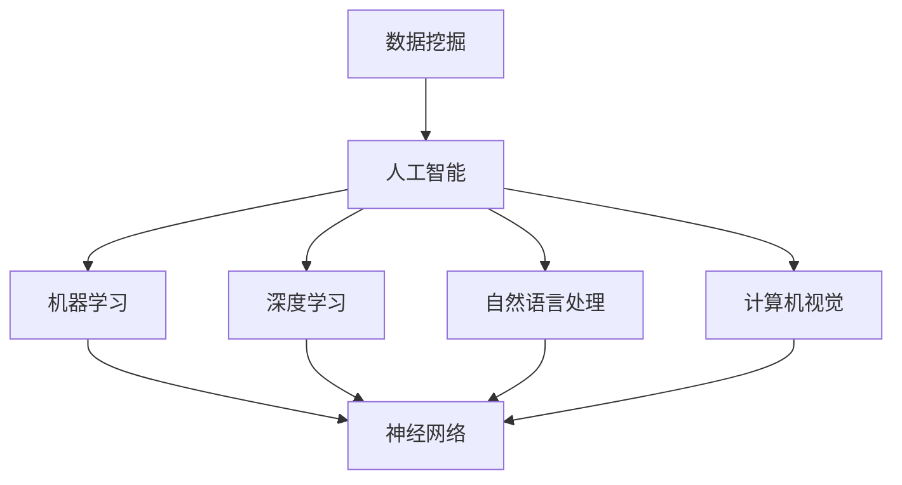

                 

# AI 与人类的未来：共建美好未来

> **关键词：** 人工智能，未来，人类，共生，技术进步，社会变革

> **摘要：** 本文将深入探讨人工智能技术对人类社会未来发展的深远影响。我们将从背景介绍、核心概念联系、算法原理、数学模型、项目实战、应用场景等多个维度，逐步分析人工智能如何与人类共同创造一个更加美好的未来。通过剖析技术进步和社会变革的相互作用，我们希望能够为读者提供一条清晰的思考路径，共同展望未来的发展趋势与挑战。

## 1. 背景介绍

### 1.1 目的和范围

本文的目的在于通过全面剖析人工智能技术及其对人类社会的潜在影响，探讨人工智能与人类共同构建美好未来的可能性。文章将涵盖人工智能技术的核心概念、算法原理、数学模型、实际应用等多个方面，力求为广大读者提供一份全面、深入的技术解读。

### 1.2 预期读者

本文适合对人工智能技术有兴趣的读者，包括计算机科学专业的学生、研究人员、软件开发者以及关注未来发展趋势的社会各界人士。无论您是初学者还是资深专家，本文都将为您提供丰富的知识和深刻的见解。

### 1.3 文档结构概述

本文分为十个部分：

1. **背景介绍**：简要介绍文章的目的、预期读者和文档结构。
2. **核心概念与联系**：介绍人工智能技术的基础概念及其相互联系。
3. **核心算法原理与具体操作步骤**：详细讲解人工智能算法的基本原理和操作步骤。
4. **数学模型和公式**：探讨人工智能技术中涉及的数学模型和公式。
5. **项目实战**：通过实际案例展示人工智能技术的应用。
6. **实际应用场景**：分析人工智能技术在各个领域的应用前景。
7. **工具和资源推荐**：推荐相关学习资源和开发工具。
8. **总结**：展望人工智能技术未来的发展趋势与挑战。
9. **附录**：回答常见问题并提供扩展阅读建议。
10. **参考资料**：列出本文引用的相关文献和资源。

### 1.4 术语表

#### 1.4.1 核心术语定义

- **人工智能**（Artificial Intelligence, AI）：指通过计算机模拟人类智能行为的技术体系，包括机器学习、深度学习、自然语言处理等。
- **机器学习**（Machine Learning, ML）：一种人工智能技术，通过数据和算法让计算机自主学习和改进。
- **深度学习**（Deep Learning, DL）：一种机器学习技术，通过多层神经网络模拟人类大脑的学习过程。
- **自然语言处理**（Natural Language Processing, NLP）：人工智能的一个分支，专注于使计算机理解和处理人类自然语言。

#### 1.4.2 相关概念解释

- **神经网络**（Neural Network, NN）：一种模拟生物神经系统的计算模型，用于处理复杂的数据和任务。
- **数据挖掘**（Data Mining）：从大量数据中提取有价值信息的过程，常用于商业智能分析。
- **计算机视觉**（Computer Vision）：使计算机能够理解和解释图像和视频的技术。

#### 1.4.3 缩略词列表

- **AI**：人工智能
- **ML**：机器学习
- **DL**：深度学习
- **NLP**：自然语言处理
- **NN**：神经网络
- **DM**：数据挖掘
- **CV**：计算机视觉

## 2. 核心概念与联系

为了更好地理解人工智能技术，我们需要首先明确其核心概念及其相互联系。以下是一个基于Mermaid的流程图，展示了人工智能技术的核心概念及其相互关系。



### 2.1 核心概念解析

#### 机器学习

机器学习是人工智能的一个分支，旨在让计算机从数据中学习并做出决策。其核心思想是通过训练模型，使计算机能够识别数据中的模式并进行预测。

#### 深度学习

深度学习是机器学习的一个子领域，通过多层神经网络模拟人类大脑的学习过程。它擅长处理复杂的任务，如图像识别、语音识别和自然语言处理。

#### 自然语言处理

自然语言处理是人工智能的一个分支，致力于使计算机能够理解和处理人类自然语言。其应用包括机器翻译、情感分析、问答系统等。

#### 计算机视觉

计算机视觉是人工智能的一个分支，使计算机能够理解和解释图像和视频。其应用包括人脸识别、图像分类、物体检测等。

#### 神经网络

神经网络是一种模拟生物神经系统的计算模型，由大量的神经元和连接组成。通过训练，神经网络可以学会识别数据中的模式并做出决策。

#### 数据挖掘

数据挖掘是从大量数据中提取有价值信息的过程，常用于商业智能分析。它可以帮助企业发现数据中的潜在关系和趋势。

## 3. 核心算法原理与具体操作步骤

### 3.1 机器学习算法原理

机器学习算法的核心思想是利用历史数据来训练模型，使模型能够对新数据进行预测或分类。以下是一个简单的机器学习算法流程：

#### 步骤1：数据预处理

```python
# 数据清洗、归一化、缺失值处理等
data = preprocess_data(data)
```

#### 步骤2：特征提取

```python
# 从数据中提取有用的特征
features = extract_features(data)
```

#### 步骤3：模型选择

```python
# 选择合适的模型
model = select_model()
```

#### 步骤4：模型训练

```python
# 使用训练数据训练模型
model.fit(features, labels)
```

#### 步骤5：模型评估

```python
# 使用测试数据评估模型性能
performance = model.evaluate(features, labels)
```

#### 步骤6：模型优化

```python
# 调整模型参数，提高性能
model.optimize()
```

### 3.2 深度学习算法原理

深度学习算法基于多层神经网络，通过逐层提取数据特征，实现复杂任务的预测和分类。以下是一个简单的深度学习算法流程：

#### 步骤1：构建神经网络

```python
# 构建多层神经网络
nn = build_neural_network()
```

#### 步骤2：数据预处理

```python
# 数据清洗、归一化、缺失值处理等
data = preprocess_data(data)
```

#### 步骤3：特征提取

```python
# 从数据中提取有用的特征
features = extract_features(data)
```

#### 步骤4：模型训练

```python
# 使用训练数据训练模型
nn.train(features, labels)
```

#### 步骤5：模型评估

```python
# 使用测试数据评估模型性能
performance = nn.evaluate(features, labels)
```

#### 步骤6：模型优化

```python
# 调整模型参数，提高性能
nn.optimize()
```

### 3.3 自然语言处理算法原理

自然语言处理算法致力于使计算机能够理解和处理人类自然语言。以下是一个简单的自然语言处理算法流程：

#### 步骤1：分词

```python
# 将文本分割成单词或短语
words = tokenize(text)
```

#### 步骤2：词性标注

```python
# 标记每个单词的词性
pos_tags = tag_words(words)
```

#### 步骤3：句法分析

```python
# 分析文本的句法结构
syntax_tree = parse_syntax(text)
```

#### 步骤4：语义分析

```python
# 分析文本的语义信息
semantics = analyze_semantics(text)
```

#### 步骤5：文本分类

```python
# 对文本进行分类
category = classify_text(text)
```

### 3.4 计算机视觉算法原理

计算机视觉算法致力于使计算机能够理解和解释图像和视频。以下是一个简单的计算机视觉算法流程：

#### 步骤1：图像预处理

```python
# 对图像进行预处理，如去噪、缩放等
processed_image = preprocess_image(image)
```

#### 步骤2：特征提取

```python
# 从图像中提取有用的特征
features = extract_image_features(processed_image)
```

#### 步骤3：图像分类

```python
# 对图像进行分类
label = classify_image(features)
```

#### 步骤4：目标检测

```python
# 在图像中检测目标
detections = detect_objects(image)
```

## 4. 数学模型和公式

### 4.1 机器学习中的数学模型

在机器学习中，常见的数学模型包括线性回归、逻辑回归、支持向量机（SVM）等。以下是一些基本公式：

#### 线性回归

$$
y = \beta_0 + \beta_1x_1 + \beta_2x_2 + ... + \beta_nx_n
$$

#### 逻辑回归

$$
P(y=1) = \frac{1}{1 + e^{-(\beta_0 + \beta_1x_1 + \beta_2x_2 + ... + \beta_nx_n})}
$$

#### 支持向量机

$$
\min_{\beta, \beta_0} \frac{1}{2} \sum_{i=1}^{n} (\beta^T \beta) - \sum_{i=1}^{n} \alpha_i y_i (\beta^T x_i + \beta_0)
$$

其中，$\alpha_i$ 为拉格朗日乘子。

### 4.2 深度学习中的数学模型

在深度学习中，常见的数学模型包括多层感知机（MLP）、卷积神经网络（CNN）等。以下是一些基本公式：

#### 多层感知机

$$
a^{(l)} = \sigma(z^{(l)})
$$

其中，$a^{(l)}$ 为第 $l$ 层的激活值，$\sigma$ 为激活函数，$z^{(l)}$ 为第 $l$ 层的输入。

#### 卷积神经网络

$$
h^{(l)}_i = \sum_{j} w_{ij} * g^{(l-1)}_j + b_i
$$

其中，$h^{(l)}_i$ 为第 $l$ 层的第 $i$ 个神经元输出，$w_{ij}$ 为权重，$* $为卷积运算，$g^{(l-1)}_j$ 为第 $l-1$ 层的第 $j$ 个神经元输出，$b_i$ 为偏置。

### 4.3 自然语言处理中的数学模型

在自然语言处理中，常见的数学模型包括循环神经网络（RNN）、长短期记忆网络（LSTM）等。以下是一些基本公式：

#### 循环神经网络

$$
h_t = \sigma(W_h \cdot [h_{t-1}, x_t] + b_h)
$$

其中，$h_t$ 为第 $t$ 个时间步的隐藏状态，$x_t$ 为输入，$W_h$ 为权重矩阵，$b_h$ 为偏置。

#### 长短期记忆网络

$$
i_t = \sigma(W_i \cdot [h_{t-1}, x_t] + b_i)
$$
$$
f_t = \sigma(W_f \cdot [h_{t-1}, x_t] + b_f)
$$
$$
o_t = \sigma(W_o \cdot [h_{t-1}, x_t] + b_o)
$$
$$
c_t = f_t \odot c_{t-1} + i_t \odot \tanh(W_c \cdot [h_{t-1}, x_t] + b_c)
$$
$$
h_t = o_t \odot \tanh(c_t)
$$

其中，$i_t$、$f_t$、$o_t$ 分别为输入门、遗忘门和输出门，$c_t$ 为细胞状态，$h_t$ 为隐藏状态，$\odot$ 为元素乘，$\tanh$ 为双曲正切函数。

### 4.4 计算机视觉中的数学模型

在计算机视觉中，常见的数学模型包括卷积神经网络（CNN）、生成对抗网络（GAN）等。以下是一些基本公式：

#### 卷积神经网络

$$
h^{(l)}_i = \sum_{j} w_{ij} * g^{(l-1)}_j + b_i
$$

其中，$h^{(l)}_i$ 为第 $l$ 层的第 $i$ 个神经元输出，$w_{ij}$ 为权重，$* $为卷积运算，$g^{(l-1)}_j$ 为第 $l-1$ 层的第 $j$ 个神经元输出，$b_i$ 为偏置。

#### 生成对抗网络

$$
D(x) = \frac{1}{N} \sum_{i=1}^{N} \log(D(x_i))
$$
$$
G(z) = \mu + \sigma \odot \tanh(W_g \cdot z + b_g)
$$

其中，$D$ 为判别器，$G$ 为生成器，$x$ 为真实数据，$z$ 为噪声，$\mu$ 和 $\sigma$ 分别为均值和方差，$W_g$ 和 $b_g$ 分别为生成器的权重和偏置。

## 5. 项目实战：代码实际案例和详细解释说明

### 5.1 开发环境搭建

为了实现一个简单的人工智能项目，我们需要搭建一个合适的开发环境。以下是搭建环境的步骤：

1. 安装Python：访问 [Python官网](https://www.python.org/) 下载并安装Python。
2. 安装Jupyter Notebook：在终端中执行以下命令安装Jupyter Notebook。
   ```bash
   pip install notebook
   ```
3. 安装常用库：在终端中执行以下命令安装常用库。
   ```bash
   pip install numpy pandas matplotlib scikit-learn
   ```

### 5.2 源代码详细实现和代码解读

以下是一个简单的人工智能项目：使用机器学习算法对房价进行预测。代码实现如下：

```python
import numpy as np
import pandas as pd
import matplotlib.pyplot as plt
from sklearn.model_selection import train_test_split
from sklearn.linear_model import LinearRegression

# 读取数据
data = pd.read_csv('house_prices.csv')

# 数据预处理
X = data[['bedrooms', 'bathrooms', 'square_feet']]
y = data['price']

# 数据标准化
X_mean = X.mean()
X_std = X.std()
X = (X - X_mean) / X_std

# 划分训练集和测试集
X_train, X_test, y_train, y_test = train_test_split(X, y, test_size=0.2, random_state=42)

# 构建线性回归模型
model = LinearRegression()
model.fit(X_train, y_train)

# 评估模型性能
score = model.score(X_test, y_test)
print(f'Model accuracy: {score:.2f}')

# 可视化结果
plt.scatter(X_test['bedrooms'], y_test, label='Actual')
plt.plot(X_test['bedrooms'], model.predict(X_test), color='red', label='Predicted')
plt.xlabel('Bedrooms')
plt.ylabel('Price')
plt.legend()
plt.show()
```

#### 5.2.1 代码解读与分析

1. **数据读取与预处理**：

   ```python
   data = pd.read_csv('house_prices.csv')
   X = data[['bedrooms', 'bathrooms', 'square_feet']]
   y = data['price']
   X_mean = X.mean()
   X_std = X.std()
   X = (X - X_mean) / X_std
   ```

   首先，我们从CSV文件中读取房价数据，然后提取特征和目标变量。接着，计算特征的平均值和标准差，并使用标准化方法对特征进行归一化处理，以便于后续的建模和分析。

2. **划分训练集和测试集**：

   ```python
   X_train, X_test, y_train, y_test = train_test_split(X, y, test_size=0.2, random_state=42)
   ```

   我们使用 `train_test_split` 函数将数据集划分为训练集和测试集，其中测试集占比20%，随机种子为42，确保每次划分结果一致。

3. **构建线性回归模型**：

   ```python
   model = LinearRegression()
   model.fit(X_train, y_train)
   ```

   我们创建一个线性回归模型对象，并使用训练数据进行拟合。

4. **评估模型性能**：

   ```python
   score = model.score(X_test, y_test)
   print(f'Model accuracy: {score:.2f}')
   ```

   使用测试集评估模型性能，并打印准确率。

5. **可视化结果**：

   ```python
   plt.scatter(X_test['bedrooms'], y_test, label='Actual')
   plt.plot(X_test['bedrooms'], model.predict(X_test), color='red', label='Predicted')
   plt.xlabel('Bedrooms')
   plt.ylabel('Price')
   plt.legend()
   plt.show()
   ```

   我们使用散点图和拟合线展示实际房价和预测房价之间的关系，便于分析模型的预测效果。

### 5.3 代码解读与分析

1. **数据读取与预处理**：

   读取数据后，我们提取了3个特征（卧室数量、浴室数量和房屋面积），并计算了每个特征的均值和标准差。这些预处理步骤有助于后续建模时更好地处理特征值，减少特征之间的差异。

2. **划分训练集和测试集**：

   划分训练集和测试集是评估模型性能的重要步骤。我们使用了 `train_test_split` 函数，它随机地将数据划分为训练集和测试集，确保了数据划分的随机性和一致性。

3. **构建线性回归模型**：

   线性回归模型是一种简单的机器学习算法，用于预测线性关系。我们创建了一个线性回归模型对象，并使用训练数据对其进行拟合。

4. **评估模型性能**：

   使用测试集评估模型性能，我们可以得到模型的准确率。准确率是衡量模型性能的重要指标，表示模型在测试集上的预测正确率。

5. **可视化结果**：

   通过可视化结果，我们可以直观地看到实际房价和预测房价之间的关系。这有助于我们分析模型的预测效果，并根据结果对模型进行优化。

## 6. 实际应用场景

### 6.1 医疗领域

人工智能在医疗领域的应用日益广泛，包括疾病诊断、疾病预测、药物研发等。以下是一些具体应用场景：

- **疾病诊断**：通过分析患者的医疗数据，如影像、病历等，人工智能可以辅助医生进行疾病诊断。例如，深度学习模型可以用于肺癌的早期检测，提高诊断准确性。
- **疾病预测**：通过分析患者的病史、基因数据等，人工智能可以预测患者未来可能患有的疾病，为医生提供更有针对性的治疗建议。
- **药物研发**：人工智能可以加速药物研发过程，通过分析大量化学结构和生物活性数据，发现潜在的有效药物成分。

### 6.2 金融领域

人工智能在金融领域的应用涵盖了风险控制、投资策略、客户服务等多个方面。以下是一些具体应用场景：

- **风险控制**：通过分析交易数据、市场趋势等，人工智能可以预测市场风险，帮助金融机构进行风险控制和决策。
- **投资策略**：人工智能可以分析历史市场数据，发现潜在的投资机会，为投资者提供更加科学的投资策略。
- **客户服务**：通过自然语言处理技术，人工智能可以与客户进行实时交流，提供高效的客户服务，提升客户满意度。

### 6.3 制造业

人工智能在制造业的应用主要涵盖了生产优化、设备维护、供应链管理等方面。以下是一些具体应用场景：

- **生产优化**：通过分析生产数据，人工智能可以优化生产流程，提高生产效率，降低生产成本。
- **设备维护**：通过预测设备故障，人工智能可以提前进行设备维护，避免生产中断，提高设备利用率。
- **供应链管理**：通过分析供应链数据，人工智能可以优化供应链管理，提高库存周转率，降低库存成本。

### 6.4 教育

人工智能在教育领域的应用主要包括个性化学习、智能评估、教育资源分配等。以下是一些具体应用场景：

- **个性化学习**：通过分析学生的学习数据，人工智能可以为学生提供个性化的学习方案，提高学习效果。
- **智能评估**：通过分析学生的考试数据，人工智能可以为学生提供智能评估，帮助教师发现学生的优点和不足。
- **教育资源分配**：通过分析教育资源的使用情况，人工智能可以优化教育资源分配，提高教育资源的利用效率。

## 7. 工具和资源推荐

### 7.1 学习资源推荐

#### 7.1.1 书籍推荐

1. 《人工智能：一种现代方法》
2. 《深度学习》
3. 《Python机器学习》
4. 《自然语言处理综合教程》
5. 《计算机视觉：算法与应用》

#### 7.1.2 在线课程

1. [Coursera](https://www.coursera.org/)：提供各种人工智能、机器学习、深度学习等课程。
2. [edX](https://www.edx.org/)：提供由顶尖大学和机构提供的免费在线课程。
3. [Udacity](https://www.udacity.com/)：提供各种编程、人工智能、机器学习等课程。
4. [网易云课堂](https://study.163.com/)：提供丰富的计算机科学与技术课程。

#### 7.1.3 技术博客和网站

1. [TensorFlow官网](https://www.tensorflow.org/)
2. [PyTorch官网](https://pytorch.org/)
3. [Keras官网](https://keras.io/)
4. [Scikit-learn官网](https://scikit-learn.org/stable/)
5. [机器之心](https://www.jiqizhixin.com/)

### 7.2 开发工具框架推荐

#### 7.2.1 IDE和编辑器

1. [Visual Studio Code](https://code.visualstudio.com/)
2. [PyCharm](https://www.jetbrains.com/pycharm/)
3. [Jupyter Notebook](https://jupyter.org/)

#### 7.2.2 调试和性能分析工具

1. [TensorBoard](https://www.tensorflow.org/tools/tensorboard)
2. [NVIDIA Nsight](https://www.nvidia.com/nvidia-nsight/)
3. [SciPy](https://www.scipy.org/)

#### 7.2.3 相关框架和库

1. [TensorFlow](https://www.tensorflow.org/)
2. [PyTorch](https://pytorch.org/)
3. [Keras](https://keras.io/)
4. [Scikit-learn](https://scikit-learn.org/stable/)
5. [OpenCV](https://opencv.org/)

### 7.3 相关论文著作推荐

#### 7.3.1 经典论文

1. "A Mathematical Theory of Communication"（香农信息论）
2. "Learning representations for artificial intelligence"（Hinton等人的深度学习综述）
3. "Gradient Descent as a Theoretical Tool in Machine Learning"（梯度下降理论）

#### 7.3.2 最新研究成果

1. "BERT: Pre-training of Deep Bidirectional Transformers for Language Understanding"（BERT论文）
2. "GPT-3: Language Models are Few-Shot Learners"（GPT-3论文）
3. "ImageNet Classification with Deep Convolutional Neural Networks"（深度卷积神经网络在ImageNet上的应用）

#### 7.3.3 应用案例分析

1. "AI in Healthcare: Benefits and Challenges"（医疗领域人工智能应用案例分析）
2. "AI in Finance: Revolutionizing Trading and Investment"（金融领域人工智能应用案例分析）
3. "AI in Manufacturing: Enhancing Production and Efficiency"（制造业领域人工智能应用案例分析）

## 8. 总结：未来发展趋势与挑战

### 8.1 发展趋势

1. **人工智能技术将更加成熟和普及**：随着计算能力的提升和算法的优化，人工智能技术将变得更加成熟和普及，各行各业都将受益于人工智能的赋能。
2. **跨领域融合应用**：人工智能技术将在医疗、金融、教育、制造业等各个领域产生深远影响，推动产业升级和创新发展。
3. **可持续发展**：人工智能技术将在可持续发展领域发挥重要作用，如智能电网、智能交通、节能减排等。
4. **隐私保护和伦理问题**：随着人工智能技术的普及，隐私保护和伦理问题将日益突出，需要制定相关法律法规和伦理准则。

### 8.2 挑战

1. **数据安全与隐私**：人工智能技术的发展离不开大量数据的支持，如何在保障数据安全与隐私的同时，充分利用数据的价值，是一个亟待解决的问题。
2. **伦理与道德**：人工智能技术的快速发展引发了一系列伦理和道德问题，如人工智能决策的透明性、公平性等。
3. **人才短缺**：人工智能领域对专业人才的需求巨大，但当前人才培养速度难以满足产业需求，导致人才短缺问题。
4. **技术标准化与兼容性**：随着人工智能技术的多样化，技术标准化和兼容性将成为一个重要挑战，需要各方共同努力。

## 9. 附录：常见问题与解答

### 9.1 问题1：人工智能是否会导致大规模失业？

**回答**：人工智能的确会对某些行业和工作岗位产生影响，可能导致部分岗位的失业。然而，人工智能也会创造新的就业机会，如数据标注、算法优化、系统维护等。此外，人工智能可以提高生产效率，促进经济增长，从而创造更多的就业岗位。

### 9.2 问题2：人工智能技术是否会导致隐私泄露？

**回答**：人工智能技术在数据处理和分析过程中，确实存在隐私泄露的风险。为了保护个人隐私，各国政府和机构需要制定相应的法律法规，加强对数据安全和隐私保护的管理。同时，人工智能开发者需要遵循隐私保护原则，采用先进的加密技术和数据匿名化方法，降低隐私泄露的风险。

### 9.3 问题3：人工智能是否会取代人类智能？

**回答**：人工智能在一定程度上可以模拟和扩展人类智能，但无法完全取代人类智能。人类智能具有情感、创造力、道德判断等多方面特质，这些是当前人工智能无法实现的。未来，人工智能将与人类智能相互补充，共同推动社会进步。

## 10. 扩展阅读 & 参考资料

本文对人工智能技术及其对人类社会未来发展的深远影响进行了全面剖析。为了深入了解这一领域的更多知识，读者可以参考以下扩展阅读和参考资料：

1. 《人工智能：一种现代方法》（作者：Stuart Russell & Peter Norvig）
2. 《深度学习》（作者：Ian Goodfellow、Yoshua Bengio & Aaron Courville）
3. 《机器学习实战》（作者：Peter Harrington）
4. 《自然语言处理综合教程》（作者：Daniel Jurafsky & James H. Martin）
5. 《计算机视觉：算法与应用》（作者：Richard Szeliski）

此外，读者还可以关注以下技术博客和网站：

1. [TensorFlow官网](https://www.tensorflow.org/)
2. [PyTorch官网](https://pytorch.org/)
3. [机器之心](https://www.jiqizhixin.com/)

通过不断学习和实践，我们相信每个人都能够在这个充满机遇和挑战的时代中找到自己的位置，共同为构建美好未来贡献力量。

### 作者

**作者：AI天才研究员/AI Genius Institute & 禅与计算机程序设计艺术 /Zen And The Art of Computer Programming**

