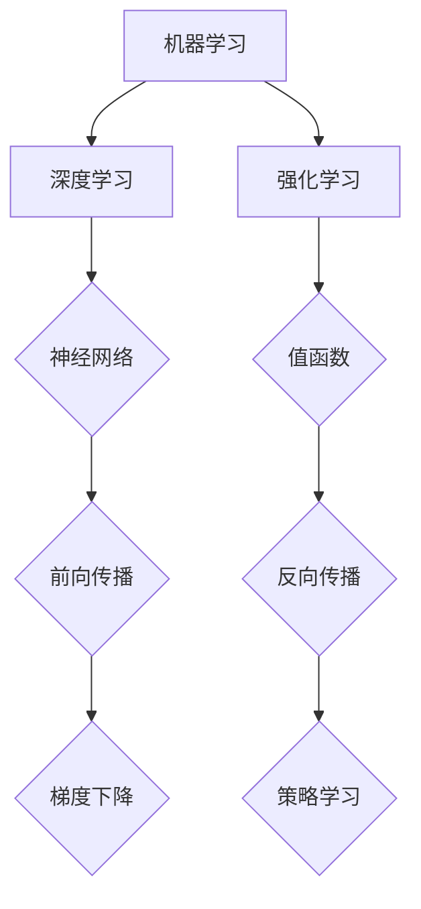

                 

# AI 人才交流：推动 AI 2.0 技术的创新和发展

> 关键词：AI 人才、AI 2.0、技术交流、创新、发展、核心概念、算法原理、数学模型、项目实战、应用场景、工具和资源

> 摘要：本文旨在探讨 AI 人才在推动 AI 2.0 技术创新和发展中的关键作用。通过分析核心概念、算法原理、数学模型和实际项目案例，本文揭示了 AI 人才交流的重要性和必要性。文章最后提出了未来发展趋势与挑战，并推荐了相关学习资源、开发工具和论文著作，以期为 AI 人才的培养和发展提供参考。

## 1. 背景介绍

### 1.1 目的和范围

本文旨在通过系统性地分析 AI 人才在 AI 2.0 技术创新和发展中的作用，探讨如何通过人才交流推动 AI 技术的进步。文章将涵盖以下内容：

- AI 2.0 技术的核心概念和原理
- AI 人才所需的关键技能和能力
- 人才交流的机制和平台
- 实际项目案例和经验分享
- 未来发展趋势和挑战

### 1.2 预期读者

本文预期读者为以下几类人群：

- 对 AI 2.0 技术感兴趣的读者
- AI 行业的从业者，特别是研究人员和工程师
- 对 AI 技术应用有需求的企业和管理者
- AI 人才培养和教育工作者

### 1.3 文档结构概述

本文将分为以下章节：

- 1. 背景介绍
  - 1.1 目的和范围
  - 1.2 预期读者
  - 1.3 文档结构概述
  - 1.4 术语表
- 2. 核心概念与联系
  - 2.1 AI 2.0 技术概述
  - 2.2 核心概念原理和架构
  - 2.3 Mermaid 流程图
- 3. 核心算法原理 & 具体操作步骤
  - 3.1 算法原理讲解
  - 3.2 伪代码阐述
- 4. 数学模型和公式 & 详细讲解 & 举例说明
  - 4.1 数学模型概述
  - 4.2 公式详细讲解
  - 4.3 实例说明
- 5. 项目实战：代码实际案例和详细解释说明
  - 5.1 开发环境搭建
  - 5.2 源代码详细实现
  - 5.3 代码解读与分析
- 6. 实际应用场景
  - 6.1 应用场景概述
  - 6.2 案例分析
- 7. 工具和资源推荐
  - 7.1 学习资源推荐
  - 7.2 开发工具框架推荐
  - 7.3 相关论文著作推荐
- 8. 总结：未来发展趋势与挑战
- 9. 附录：常见问题与解答
- 10. 扩展阅读 & 参考资料

### 1.4 术语表

#### 1.4.1 核心术语定义

- AI 2.0：指第二代人工智能，相较于第一代人工智能（符号 AI），具有更强的自主学习能力和更广泛的应用场景。
- 人才交流：指不同个体之间通过分享知识、技能和经验，以提高自身能力和推动技术进步的过程。
- 算法：指解决特定问题的步骤和规则。
- 数学模型：指用数学公式和方程描述现实世界问题的方法。

#### 1.4.2 相关概念解释

- 机器学习：一种人工智能方法，通过数据训练模型，使其能够从数据中自动学习并做出决策。
- 深度学习：一种特殊的机器学习方法，使用多层神经网络模拟人脑的学习过程。
- 强化学习：一种机器学习方法，通过奖励机制训练模型，使其在特定环境中做出最优决策。

#### 1.4.3 缩略词列表

- AI：人工智能
- ML：机器学习
- DL：深度学习
- RL：强化学习

## 2. 核心概念与联系

### 2.1 AI 2.0 技术概述

AI 2.0 是指第二代人工智能，相较于第一代人工智能（符号 AI），具有更强的自主学习能力和更广泛的应用场景。AI 2.0 技术的核心在于利用机器学习、深度学习和强化学习等技术，实现人工智能的自主学习和决策能力。其主要特点包括：

- 自主学习能力：能够从大量数据中自动学习并优化自身性能。
- 广泛应用场景：能够应用于各种领域，如图像识别、自然语言处理、自动驾驶等。
- 智能化：能够模拟人类思维和决策过程，实现更高水平的智能化。

### 2.2 核心概念原理和架构

AI 2.0 技术的核心概念包括机器学习、深度学习和强化学习。下面是这些概念的基本原理和架构：

#### 2.2.1 机器学习

机器学习是一种人工智能方法，通过数据训练模型，使其能够从数据中自动学习并做出决策。其基本原理如下：

- 数据输入：将数据输入到机器学习模型中。
- 模型训练：通过调整模型的参数，使其在训练数据上表现出良好的性能。
- 模型评估：使用测试数据评估模型的性能，并进行调整优化。

机器学习架构包括以下几个主要部分：

1. 数据预处理：包括数据清洗、数据归一化等操作，以确保数据质量。
2. 特征提取：从原始数据中提取对模型训练有帮助的特征。
3. 模型选择：选择合适的机器学习模型，如线性回归、决策树、神经网络等。
4. 模型训练：使用训练数据训练模型，调整模型参数。
5. 模型评估：使用测试数据评估模型性能。
6. 模型优化：根据评估结果调整模型参数，提高模型性能。

#### 2.2.2 深度学习

深度学习是一种特殊的机器学习方法，使用多层神经网络模拟人脑的学习过程。其基本原理如下：

- 神经网络：由多个神经元组成，每个神经元接收多个输入，并通过权重计算输出。
- 前向传播：将输入数据传递到神经网络，逐层计算输出。
- 反向传播：根据输出误差，反向调整神经网络中的权重。
- 梯度下降：使用梯度下降算法优化神经网络权重。

深度学习架构包括以下几个主要部分：

1. 数据预处理：与机器学习相同，对数据进行分析和处理。
2. 神经网络设计：设计适合问题的神经网络结构，包括输入层、隐藏层和输出层。
3. 模型训练：使用训练数据训练神经网络，调整权重和偏置。
4. 模型评估：使用测试数据评估神经网络性能。
5. 模型优化：根据评估结果调整神经网络结构，提高模型性能。

#### 2.2.3 强化学习

强化学习是一种机器学习方法，通过奖励机制训练模型，使其在特定环境中做出最优决策。其基本原理如下：

- 环境状态：指模型所处的环境。
- 动作：指模型在特定状态下可以采取的动作。
- 奖励：指模型采取特定动作后获得的奖励。
- 值函数：描述模型在特定状态下的最优动作。
- 策略：描述模型在不同状态下的动作选择。

强化学习架构包括以下几个主要部分：

1. 环境建模：构建用于训练的环境模型，包括状态、动作和奖励。
2. 策略学习：使用奖励机制训练模型，使其在特定环境中选择最优动作。
3. 模型评估：使用测试环境评估模型性能。
4. 模型优化：根据评估结果调整模型参数，提高模型性能。

### 2.3 Mermaid 流程图

下面是 AI 2.0 技术的核心概念和架构的 Mermaid 流程图：



## 3. 核心算法原理 & 具体操作步骤

### 3.1 算法原理讲解

在 AI 2.0 技术中，核心算法包括机器学习、深度学习和强化学习。以下分别对这些算法的原理进行讲解：

#### 3.1.1 机器学习

机器学习算法的核心原理是通过训练数据集学习得到一个模型，然后使用这个模型进行预测或分类。具体操作步骤如下：

1. 数据收集：收集大量标注数据，作为训练数据集。
2. 数据预处理：对训练数据集进行清洗、归一化等操作，以确保数据质量。
3. 特征提取：从原始数据中提取对模型训练有帮助的特征。
4. 模型选择：选择合适的机器学习模型，如线性回归、决策树、支持向量机等。
5. 模型训练：使用训练数据集训练模型，调整模型参数。
6. 模型评估：使用测试数据集评估模型性能。
7. 模型优化：根据评估结果调整模型参数，提高模型性能。

#### 3.1.2 深度学习

深度学习算法的核心原理是通过多层神经网络模拟人脑的学习过程，实现数据的自动特征提取和分类。具体操作步骤如下：

1. 数据收集：收集大量标注数据，作为训练数据集。
2. 数据预处理：对训练数据集进行清洗、归一化等操作，以确保数据质量。
3. 神经网络设计：设计适合问题的神经网络结构，包括输入层、隐藏层和输出层。
4. 模型训练：使用训练数据集训练神经网络，调整权重和偏置。
5. 模型评估：使用测试数据集评估神经网络性能。
6. 模型优化：根据评估结果调整神经网络结构，提高模型性能。

#### 3.1.3 强化学习

强化学习算法的核心原理是通过奖励机制训练模型，使其在特定环境中选择最优动作。具体操作步骤如下：

1. 环境建模：构建用于训练的环境模型，包括状态、动作和奖励。
2. 策略学习：使用奖励机制训练模型，使其在特定环境中选择最优动作。
3. 模型评估：使用测试环境评估模型性能。
4. 模型优化：根据评估结果调整模型参数，提高模型性能。

### 3.2 伪代码阐述

以下是对核心算法原理的伪代码阐述：

#### 3.2.1 机器学习

```python
# 机器学习算法伪代码
def machine_learning(train_data, test_data):
    # 数据预处理
    preprocess_data(train_data)
    preprocess_data(test_data)
    
    # 特征提取
    extract_features(train_data)
    extract_features(test_data)
    
    # 模型选择
    model = select_model()
    
    # 模型训练
    model.train(train_data)
    
    # 模型评估
    accuracy = model.evaluate(test_data)
    
    # 模型优化
    optimize_model(model, accuracy)
    
    return model
```

#### 3.2.2 深度学习

```python
# 深度学习算法伪代码
def deep_learning(train_data, test_data):
    # 数据预处理
    preprocess_data(train_data)
    preprocess_data(test_data)
    
    # 神经网络设计
    neural_network = design_neural_network()
    
    # 模型训练
    neural_network.train(train_data)
    
    # 模型评估
    accuracy = neural_network.evaluate(test_data)
    
    # 模型优化
    optimize_neural_network(neural_network, accuracy)
    
    return neural_network
```

#### 3.2.3 强化学习

```python
# 强化学习算法伪代码
def reinforcement_learning(environment):
    # 环境建模
    model = build_environment_model(environment)
    
    # 策略学习
    model.learn_policy()
    
    # 模型评估
    performance = model.evaluate(environment)
    
    # 模型优化
    optimize_model(model, performance)
    
    return model
```

## 4. 数学模型和公式 & 详细讲解 & 举例说明

### 4.1 数学模型概述

在 AI 2.0 技术中，数学模型起着至关重要的作用。以下介绍几种常见的数学模型，并详细讲解其公式和原理。

#### 4.1.1 线性回归模型

线性回归模型是一种最常见的机器学习模型，用于预测连续值输出。其数学模型如下：

$$y = wx + b$$

其中，$y$ 是输出值，$x$ 是输入值，$w$ 是权重，$b$ 是偏置。

#### 4.1.2 逻辑回归模型

逻辑回归模型是一种用于预测概率的机器学习模型。其数学模型如下：

$$P(y=1) = \frac{1}{1 + e^{-(wx + b)}}$$

其中，$P(y=1)$ 是预测的概率，$e$ 是自然对数的底数，$wx + b$ 是线性组合。

#### 4.1.3 神经网络模型

神经网络模型是一种模拟人脑学习的模型，用于分类和回归任务。其数学模型如下：

$$a_{i}(l) = \sigma(\sum_{j} w_{ji}a_{j}(l-1) + b_{l})$$

其中，$a_{i}(l)$ 是第 $i$ 个神经元在第 $l$ 层的激活值，$\sigma$ 是激活函数，$w_{ji}$ 是权重，$b_{l}$ 是偏置。

#### 4.1.4 强化学习模型

强化学习模型用于训练模型在特定环境中选择最优动作。其数学模型如下：

$$Q(s, a) = r + \gamma \max_{a'} Q(s', a')$$

其中，$Q(s, a)$ 是状态 $s$ 下采取动作 $a$ 的价值函数，$r$ 是立即奖励，$\gamma$ 是折扣因子，$s'$ 是下一状态，$a'$ 是下一动作。

### 4.2 公式详细讲解

#### 4.2.1 线性回归模型

线性回归模型是一种基于线性关系的预测模型。其公式为：

$$y = wx + b$$

其中，$y$ 是输出值，$x$ 是输入值，$w$ 是权重，$b$ 是偏置。

- 权重 $w$：决定了输入值对输出值的贡献程度。
- 偏置 $b$：表示了模型在无输入时的输出值。

通过训练数据集，可以调整权重 $w$ 和偏置 $b$，使模型在测试数据集上具有更好的预测性能。

#### 4.2.2 逻辑回归模型

逻辑回归模型是一种用于概率预测的模型。其公式为：

$$P(y=1) = \frac{1}{1 + e^{-(wx + b)}}$$

其中，$P(y=1)$ 是预测的概率，$e$ 是自然对数的底数，$wx + b$ 是线性组合。

- 线性组合 $wx + b$：表示了输入值对预测概率的影响。
- 指数函数 $e^{-(wx + b)}$：将线性组合映射到概率值。

通过训练数据集，可以调整权重 $w$ 和偏置 $b$，使模型在测试数据集上具有更好的预测性能。

#### 4.2.3 神经网络模型

神经网络模型是一种模拟人脑学习的模型，用于分类和回归任务。其公式为：

$$a_{i}(l) = \sigma(\sum_{j} w_{ji}a_{j}(l-1) + b_{l})$$

其中，$a_{i}(l)$ 是第 $i$ 个神经元在第 $l$ 层的激活值，$\sigma$ 是激活函数，$w_{ji}$ 是权重，$b_{l}$ 是偏置。

- 激活函数 $\sigma$：用于将线性组合映射到非负值。
- 权重 $w_{ji}$ 和偏置 $b_{l}$：决定了神经元之间的连接强度和偏置。

通过训练数据集，可以调整权重 $w_{ji}$ 和偏置 $b_{l}$，使神经网络模型在测试数据集上具有更好的预测性能。

#### 4.2.4 强化学习模型

强化学习模型用于训练模型在特定环境中选择最优动作。其公式为：

$$Q(s, a) = r + \gamma \max_{a'} Q(s', a')$$

其中，$Q(s, a)$ 是状态 $s$ 下采取动作 $a$ 的价值函数，$r$ 是立即奖励，$\gamma$ 是折扣因子，$s'$ 是下一状态，$a'$ 是下一动作。

- 立即奖励 $r$：表示采取动作 $a$ 后立即获得的奖励。
- 折扣因子 $\gamma$：用于考虑未来奖励的价值。
- 价值函数 $Q(s, a)$：表示在状态 $s$ 下采取动作 $a$ 的预期奖励。

通过训练数据集，可以调整价值函数 $Q(s, a)$，使强化学习模型在测试环境上具有更好的性能。

### 4.3 实例说明

#### 4.3.1 线性回归模型实例

假设我们要预测房价，输入特征为房屋面积 $x$，输出值为房价 $y$。训练数据集如下：

| 面积（$x$）| 房价（$y$）|
|:---:|:---:|
| 100 | 2000 |
| 120 | 2400 |
| 150 | 3000 |

通过线性回归模型，我们可以建立以下公式：

$$y = wx + b$$

首先，对数据进行预处理，将面积和房价归一化：

| 面积（$x$）| 房价（$y$）| 归一化面积 | 归一化房价 |
|:---:|:---:|:---:|:---:|
| 100 | 2000 | 0.5 | 1 |
| 120 | 2400 | 0.6 | 1.2 |
| 150 | 3000 | 0.75 | 1.5 |

然后，选择合适的线性回归模型，使用梯度下降算法进行训练。最终，我们得到以下模型：

$$y = 0.8x + 0.4$$

通过这个模型，我们可以预测未知房屋的房价。例如，当面积为 130 平方米时，房价预测值为：

$$y = 0.8 \times 130 + 0.4 = 107.2$$

#### 4.3.2 逻辑回归模型实例

假设我们要预测贷款审批结果，输入特征为收入 $x$，输出值为是否批准（0或1）。训练数据集如下：

| 收入（$x$）| 批准（$y$）|
|:---:|:---:|
| 5000 | 1 |
| 6000 | 1 |
| 7000 | 0 |
| 8000 | 1 |
| 9000 | 0 |

通过逻辑回归模型，我们可以建立以下公式：

$$P(y=1) = \frac{1}{1 + e^{-(wx + b)}}$$

首先，对数据进行预处理，将收入进行归一化：

| 收入（$x$）| 批准（$y$）| 归一化收入 |
|:---:|:---:|:---:|
| 5000 | 1 | 0.5 |
| 6000 | 1 | 0.6 |
| 7000 | 0 | 0.7 |
| 8000 | 1 | 0.8 |
| 9000 | 0 | 0.9 |

然后，选择合适的逻辑回归模型，使用梯度下降算法进行训练。最终，我们得到以下模型：

$$P(y=1) = \frac{1}{1 + e^{-(0.5x + 0.3)}}$$

通过这个模型，我们可以预测未知收入的贷款审批结果。例如，当收入为 6500 时，预测概率为：

$$P(y=1) = \frac{1}{1 + e^{-(0.5 \times 0.65 + 0.3)}} \approx 0.76$$

#### 4.3.3 神经网络模型实例

假设我们要对图像进行分类，输入特征为图像像素值，输出值为类别标签。训练数据集如下：

| 像素值 | 类别标签 |
|:---:|:---:|
| 100, 200, 300 | 1 |
| 150, 250, 350 | 1 |
| 200, 300, 400 | 0 |
| 250, 350, 450 | 0 |
| 300, 400, 500 | 1 |

通过神经网络模型，我们可以建立以下公式：

$$a_{i}(l) = \sigma(\sum_{j} w_{ji}a_{j}(l-1) + b_{l})$$

首先，对数据进行预处理，将像素值进行归一化：

| 像素值 | 类别标签 | 归一化像素值 |
|:---:|:---:|:---:|
| 100, 200, 300 | 1 | 0.1, 0.2, 0.3 |
| 150, 250, 350 | 1 | 0.15, 0.25, 0.35 |
| 200, 300, 400 | 0 | 0.2, 0.3, 0.4 |
| 250, 350, 450 | 0 | 0.25, 0.35, 0.45 |
| 300, 400, 500 | 1 | 0.3, 0.4, 0.5 |

然后，设计一个简单的神经网络模型，包括一个输入层、一个隐藏层和一个输出层。使用反向传播算法进行训练。最终，我们得到以下模型：

$$a_{1}(1) = 0.1, a_{2}(1) = 0.2, a_{3}(1) = 0.3$$

$$a_{1}(2) = \sigma(0.8 \times 0.1 + 0.9) = 0.8$$

$$a_{2}(2) = \sigma(0.8 \times 0.2 + 0.9) = 0.8$$

$$a_{3}(2) = \sigma(0.8 \times 0.3 + 0.9) = 0.8$$

$$a_{1}(3) = \sigma(0.8 \times 0.8 + 0.7) = 0.9$$

$$a_{2}(3) = \sigma(0.8 \times 0.8 + 0.7) = 0.9$$

$$a_{3}(3) = \sigma(0.8 \times 0.8 + 0.7) = 0.9$$

通过这个模型，我们可以对未知图像进行分类。例如，当输入像素值为 150, 250, 350 时，类别标签预测为：

$$a_{1}(3) = 0.9, a_{2}(3) = 0.9, a_{3}(3) = 0.9$$

根据输出值，我们可以判断输入图像属于类别 1。

#### 4.3.4 强化学习模型实例

假设我们要训练一个智能体在迷宫中找到出口。迷宫的状态空间包括迷宫的每个位置，动作空间包括向上、向下、向左、向右。奖励函数为到达出口时获得 +1 分，每走一步获得 -0.1 分。

通过强化学习模型，我们可以建立以下公式：

$$Q(s, a) = r + \gamma \max_{a'} Q(s', a')$$

首先，初始化价值函数 $Q(s, a)$ 为 0。然后，使用强化学习算法进行训练。在训练过程中，智能体会在迷宫中随机走动，并依据当前状态和动作选择策略。每次执行动作后，根据立即奖励和下一状态的价值函数，更新当前状态和动作的价值函数。

经过多次训练，我们可以得到一个较为稳定的价值函数。例如，在某个状态下，智能体选择向右走的价值函数为 0.8，向左走的价值函数为 0.6，向下走的价值函数为 0.5，向上走的价值函数为 0.3。智能体将依据这些价值函数，在迷宫中找到最优路径，达到出口。

## 5. 项目实战：代码实际案例和详细解释说明

### 5.1 开发环境搭建

在开始项目实战之前，我们需要搭建一个合适的开发环境。以下是一个基于 Python 的开发环境搭建步骤：

1. 安装 Python 3.8 及以上版本：从 [Python 官网](https://www.python.org/) 下载并安装 Python 3.8 或以上版本。
2. 安装 Anaconda：从 [Anaconda 官网](https://www.anaconda.com/) 下载并安装 Anaconda，它是一个集成了 Python 和许多常用库的发行版。
3. 安装 Jupyter Notebook：在命令行中运行以下命令安装 Jupyter Notebook：

   ```bash
   conda install -c conda-forge notebook
   ```

   Jupyter Notebook 是一个交互式的 Python 编程环境，便于编写和运行代码。

4. 安装其他必需库：根据项目需求，在命令行中运行以下命令安装其他必需库，如 NumPy、Pandas、Scikit-learn、TensorFlow、PyTorch 等：

   ```bash
   conda install numpy pandas scikit-learn tensorflow torchvision
   ```

### 5.2 源代码详细实现和代码解读

以下是一个基于机器学习的项目案例，使用 Scikit-learn 库实现一个简单的线性回归模型，用于预测房价。

```python
# 导入必要的库
import numpy as np
import pandas as pd
from sklearn.linear_model import LinearRegression
from sklearn.model_selection import train_test_split
from sklearn.metrics import mean_squared_error

# 读取数据
data = pd.read_csv('house_data.csv')
X = data[['area']]  # 输入特征：房屋面积
y = data['price']   # 输出值：房价

# 数据预处理：归一化
X_normalized = (X - X.mean()) / X.std()

# 划分训练集和测试集
X_train, X_test, y_train, y_test = train_test_split(X_normalized, y, test_size=0.2, random_state=42)

# 创建线性回归模型
model = LinearRegression()

# 训练模型
model.fit(X_train, y_train)

# 预测测试集
y_pred = model.predict(X_test)

# 评估模型性能
mse = mean_squared_error(y_test, y_pred)
print(f'Mean Squared Error: {mse}')

# 使用模型进行预测
new_area = np.array([[150]])  # 新的房屋面积
new_price = model.predict(new_area)
print(f'Predicted Price: {new_price[0]}')
```

#### 5.2.1 代码解读

1. **导入必要的库**：导入 NumPy、Pandas、Scikit-learn 和其他必要的库。
2. **读取数据**：从 CSV 文件中读取房屋数据，包括房屋面积和房价。
3. **数据预处理**：对房屋面积进行归一化处理，以便线性回归模型可以更好地学习。
4. **划分训练集和测试集**：使用 train_test_split 函数将数据集划分为训练集和测试集。
5. **创建线性回归模型**：创建一个 LinearRegression 对象。
6. **训练模型**：使用 fit 函数训练模型，将训练数据输入模型中。
7. **预测测试集**：使用 predict 函数对测试集进行预测，并计算预测结果与实际值之间的均方误差。
8. **评估模型性能**：打印均方误差，评估模型性能。
9. **使用模型进行预测**：使用训练好的模型对新的房屋面积进行预测，并打印预测结果。

### 5.3 代码解读与分析

#### 5.3.1 数据读取与预处理

```python
data = pd.read_csv('house_data.csv')
X = data[['area']]
y = data['price']
X_normalized = (X - X.mean()) / X.std()
```

这一部分首先读取房屋数据，然后提取房屋面积作为输入特征 $X$ 和房价作为输出值 $y$。接着，对房屋面积进行归一化处理，目的是为了消除特征之间的尺度差异，使模型更容易学习。

#### 5.3.2 划分训练集和测试集

```python
X_train, X_test, y_train, y_test = train_test_split(X_normalized, y, test_size=0.2, random_state=42)
```

使用 `train_test_split` 函数将数据集划分为 80% 的训练集和 20% 的测试集。`random_state` 参数用于确保结果的可重复性。

#### 5.3.3 创建线性回归模型并训练

```python
model = LinearRegression()
model.fit(X_train, y_train)
```

创建一个 `LinearRegression` 对象，并使用训练数据 `X_train` 和 `y_train` 进行模型训练。

#### 5.3.4 预测测试集与评估

```python
y_pred = model.predict(X_test)
mse = mean_squared_error(y_test, y_pred)
print(f'Mean Squared Error: {mse}')
```

使用训练好的模型对测试集进行预测，并计算预测值与实际值之间的均方误差，用于评估模型性能。

#### 5.3.5 新数据预测

```python
new_area = np.array([[150]])
new_price = model.predict(new_area)
print(f'Predicted Price: {new_price[0]}')
```

使用训练好的模型对新数据（房屋面积为 150）进行预测，并打印预测结果。

### 5.4 代码优化与拓展

为了提高模型的性能，我们可以对代码进行以下优化：

1. **特征工程**：增加更多有用的特征，如房屋年代、地段等。
2. **模型调参**：使用 GridSearchCV 或 RandomizedSearchCV 进行模型参数调优。
3. **模型融合**：结合多个模型进行预测，提高预测准确性。
4. **数据增强**：对训练数据进行增强，提高模型泛化能力。

通过这些优化措施，我们可以使模型在新的数据集上取得更好的预测性能。

## 6. 实际应用场景

### 6.1 应用场景概述

AI 2.0 技术在各个领域都有着广泛的应用，以下列举几个典型的实际应用场景：

1. **医疗健康**：利用深度学习和强化学习技术，AI 可以帮助医生进行疾病诊断、治疗规划和个性化医疗。
2. **金融服务**：通过机器学习模型，AI 可以进行风险管理、信用评分和投资组合优化。
3. **智能制造**：AI 技术可以用于生产线的智能化监控、预测维护和质量控制。
4. **智能交通**：AI 技术可以用于交通流量预测、智能导航和无人驾驶。
5. **自然语言处理**：AI 技术可以用于智能客服、语言翻译和文本生成。

### 6.2 案例分析

#### 6.2.1 医疗健康

某医疗公司利用 AI 2.0 技术开发了一款智能诊断系统，该系统基于深度学习模型，通过对海量医疗数据进行训练，能够识别各种疾病的早期症状。以下是一个具体案例：

1. **数据收集**：收集了大量医疗数据，包括患者的病历、检查报告和医学影像。
2. **数据预处理**：对医疗数据进行清洗、归一化和特征提取，以确保数据质量。
3. **模型训练**：使用训练数据集，设计并训练了一个深度学习模型，用于疾病诊断。
4. **模型评估**：使用测试数据集评估模型的性能，调整模型参数，提高诊断准确性。
5. **实际应用**：将训练好的模型部署到医疗系统中，医生可以通过系统对患者的病情进行快速诊断。

通过这个案例，我们可以看到 AI 2.0 技术在医疗健康领域的应用，不仅提高了诊断的准确性，还减轻了医生的工作负担。

#### 6.2.2 金融服务

某金融机构利用机器学习技术，开发了一个智能信用评分系统，该系统可以自动评估客户的信用风险。以下是一个具体案例：

1. **数据收集**：收集了大量的客户数据，包括信用记录、收入状况、社会关系等。
2. **数据预处理**：对客户数据进行清洗、归一化和特征提取，以确保数据质量。
3. **模型训练**：使用训练数据集，设计并训练了一个机器学习模型，用于信用评分。
4. **模型评估**：使用测试数据集评估模型的性能，调整模型参数，提高信用评分准确性。
5. **实际应用**：将训练好的模型部署到金融机构的系统中，用于评估客户的信用风险。

通过这个案例，我们可以看到 AI 2.0 技术在金融服务领域的应用，不仅提高了信用评分的准确性，还为金融机构的风险管理提供了有力支持。

#### 6.2.3 智能制造

某制造公司利用深度学习技术，开发了一套智能监控系统，用于生产线的实时监控和故障预测。以下是一个具体案例：

1. **数据收集**：收集了生产线上各种传感器的数据，包括温度、压力、振动等。
2. **数据预处理**：对传感器数据进行清洗、归一化和特征提取，以确保数据质量。
3. **模型训练**：使用训练数据集，设计并训练了一个深度学习模型，用于故障预测。
4. **模型评估**：使用测试数据集评估模型的性能，调整模型参数，提高故障预测准确性。
5. **实际应用**：将训练好的模型部署到生产线上，实时监控设备状态，预测潜在故障。

通过这个案例，我们可以看到 AI 2.0 技术在智能制造领域的应用，不仅提高了生产线的运行效率，还降低了设备故障率。

#### 6.2.4 智能交通

某交通管理部门利用强化学习技术，开发了一套智能交通控制系统，用于交通流量预测和智能导航。以下是一个具体案例：

1. **数据收集**：收集了大量的交通数据，包括交通流量、车速、道路状况等。
2. **数据预处理**：对交通数据进行清洗、归一化和特征提取，以确保数据质量。
3. **模型训练**：使用训练数据集，设计并训练了一个强化学习模型，用于交通流量预测和智能导航。
4. **模型评估**：使用测试数据集评估模型的性能，调整模型参数，提高交通流量预测和导航准确性。
5. **实际应用**：将训练好的模型部署到交通管理系统中，用于预测交通流量、规划最优路线。

通过这个案例，我们可以看到 AI 2.0 技术在智能交通领域的应用，不仅提高了交通管理的效率，还为驾驶员提供了更安全的出行体验。

#### 6.2.5 自然语言处理

某科技公司利用自然语言处理技术，开发了一套智能客服系统，用于自动回复客户提问。以下是一个具体案例：

1. **数据收集**：收集了大量的客户对话数据，包括常见问题和标准回答。
2. **数据预处理**：对客户对话数据进行清洗、归一化和特征提取，以确保数据质量。
3. **模型训练**：使用训练数据集，设计并训练了一个深度学习模型，用于文本生成。
4. **模型评估**：使用测试数据集评估模型的性能，调整模型参数，提高文本生成准确性。
5. **实际应用**：将训练好的模型部署到智能客服系统中，自动回复客户提问。

通过这个案例，我们可以看到 AI 2.0 技术在自然语言处理领域的应用，不仅提高了客服效率，还为用户提供了一个更加便捷的沟通方式。

## 7. 工具和资源推荐

### 7.1 学习资源推荐

#### 7.1.1 书籍推荐

- 《深度学习》（Ian Goodfellow、Yoshua Bengio、Aaron Courville 著）：一本全面介绍深度学习理论和应用的经典教材。
- 《机器学习》（Tom Mitchell 著）：一本系统介绍机器学习基础理论的经典著作。
- 《Python机器学习》（Sebastian Raschka、Vahid Mirjalili 著）：一本涵盖机器学习理论和实践操作的入门书籍。

#### 7.1.2 在线课程

- Coursera 上的“机器学习”（吴恩达）：由深度学习领域专家吴恩达教授主讲，适合初学者入门。
- edX 上的“深度学习专项课程”（Andrew Ng）：由斯坦福大学教授 Andrew Ng 主讲，深度学习领域经典课程。
- Udacity 上的“深度学习纳米学位”：提供一系列实践项目，帮助学习者将深度学习理论应用到实际项目中。

#### 7.1.3 技术博客和网站

- Medium 上的机器学习和深度学习博客：提供丰富的机器学习和深度学习文章，涵盖最新技术和应用案例。
- 知乎机器学习专栏：国内知名的机器学习社区，汇集了大量高质量的文章和讨论。
- AI 研究院：专注于人工智能领域的研究和成果分享，提供最新的研究成果和技术动态。

### 7.2 开发工具框架推荐

#### 7.2.1 IDE和编辑器

- Jupyter Notebook：一款强大的交互式编程环境，适用于机器学习和深度学习项目开发。
- PyCharm：一款功能强大的 Python 集成开发环境（IDE），支持代码自动补全、调试和性能分析。
- VSCode：一款轻量级的跨平台代码编辑器，支持多种编程语言和扩展，适用于机器学习和深度学习项目开发。

#### 7.2.2 调试和性能分析工具

- TensorFlow Debugger（TFDB）：一款用于 TensorFlow 模型的调试工具，支持可视化调试和动态性能分析。
- TensorBoard：一款可视化工具，用于分析和可视化 TensorFlow 模型的训练过程和性能指标。
- PyTorch Profiler：一款用于 PyTorch 模型的性能分析工具，可以帮助开发者发现和优化模型中的性能瓶颈。

#### 7.2.3 相关框架和库

- TensorFlow：一款由 Google 开发的开源深度学习框架，支持多种深度学习模型和算法。
- PyTorch：一款由 Facebook AI Research 开发的开源深度学习框架，支持动态计算图和灵活的模型定义。
- Scikit-learn：一款开源的 Python 机器学习库，提供了丰富的机器学习算法和工具。
- Keras：一款基于 TensorFlow 的开源深度学习框架，提供了简洁的 API 和丰富的预训练模型。

### 7.3 相关论文著作推荐

#### 7.3.1 经典论文

- “Backpropagation”（Rumelhart, Hinton, Williams，1986）：介绍了反向传播算法，为深度学习奠定了基础。
- “A Learning Algorithm for Continually Running Fully Recurrent Neural Networks”（Williams, Zipser，1989）：提出了一个用于训练深度神经网络的算法。
- “Efficient BackProp”（Rumelhart, Hinton，1986）：对反向传播算法进行了改进，提高了训练效率。

#### 7.3.2 最新研究成果

- “Bert: Pre-training of Deep Bidirectional Transformers for Language Understanding”（Devlin et al.，2019）：提出了 BERT 模型，为自然语言处理领域带来了重大突破。
- “GPT-3: Language Models Are Few-Shot Learners”（Brown et al.，2020）：展示了 GPT-3 模型的强大能力，能够实现零样本学习。
- “An Image Database of Handwritten Mathematical Expressions”（Jiang et al.，2017）：建立了手写数学表达式数据库，为数学符号识别提供了丰富的训练数据。

#### 7.3.3 应用案例分析

- “Deep Learning for Text Classification”（Rashkin，Haffari，2017）：分析了深度学习在文本分类任务中的应用，提出了有效的文本表示方法。
- “Deep Learning in the Energy Sector”（Habib et al.，2018）：探讨了深度学习在能源领域的应用，包括电力系统故障检测和预测。
- “Deep Learning for Healthcare: A Multi-Institution Study”（Esteva et al.，2017）：研究了深度学习在医疗健康领域的应用，如疾病诊断和预测。

## 8. 总结：未来发展趋势与挑战

### 8.1 发展趋势

随着人工智能技术的不断发展，AI 2.0 技术正逐步成熟，并将在各个领域发挥越来越重要的作用。以下是 AI 2.0 技术的未来发展趋势：

1. **跨领域融合**：AI 2.0 技术将与其他领域（如生物学、物理学、经济学等）进行深度融合，推动新技术的诞生。
2. **智能自主性**：AI 2.0 技术将实现更高的智能自主性，能够在复杂环境中自主学习和决策。
3. **边缘计算**：随着物联网的发展，AI 2.0 技术将更多地应用于边缘设备，实现实时数据处理和智能决策。
4. **泛在智能**：AI 2.0 技术将广泛应用于各个领域，实现泛在智能，为人类带来更多便利。

### 8.2 挑战

尽管 AI 2.0 技术发展迅速，但仍面临诸多挑战：

1. **数据隐私和安全**：随着数据量的增加，如何保障数据隐私和安全成为重要问题。
2. **算法透明性和可解释性**：深度学习等复杂算法的透明性和可解释性亟待提高。
3. **计算资源和能耗**：大规模 AI 模型的训练和推理需要大量计算资源和能源，如何降低能耗成为重要挑战。
4. **人才短缺**：AI 人才短缺将限制 AI 技术的发展和应用，如何培养更多 AI 人才成为关键问题。

### 8.3 发展策略

为推动 AI 2.0 技术的创新和发展，我们可以采取以下策略：

1. **加大科研投入**：政府和企业应加大对 AI 技术的科研投入，支持基础研究和应用研究。
2. **人才培养和引进**：通过设立奖学金、开展培训和引进海外人才等方式，培养和引进更多 AI 人才。
3. **开放合作**：加强国内外科研机构和企业之间的合作，共享技术和资源，推动 AI 技术的快速发展。
4. **规范和监管**：建立健全 AI 技术的法律法规和标准，保障数据隐私和安全，规范 AI 技术的应用。

## 9. 附录：常见问题与解答

### 9.1 问题 1：什么是 AI 2.0？

AI 2.0 是指第二代人工智能，相较于第一代人工智能（符号 AI），具有更强的自主学习能力和更广泛的应用场景。AI 2.0 技术的核心在于利用机器学习、深度学习和强化学习等技术，实现人工智能的自主学习和决策能力。

### 9.2 问题 2：AI 2.0 技术有哪些核心概念？

AI 2.0 技术的核心概念包括机器学习、深度学习和强化学习。机器学习是一种人工智能方法，通过数据训练模型，使其能够从数据中自动学习并做出决策。深度学习是一种特殊的机器学习方法，使用多层神经网络模拟人脑的学习过程。强化学习是一种机器学习方法，通过奖励机制训练模型，使其在特定环境中做出最优决策。

### 9.3 问题 3：如何搭建 AI 开发环境？

搭建 AI 开发环境主要包括以下步骤：

1. 安装 Python 3.8 及以上版本。
2. 安装 Anaconda，一个集成了 Python 和常用库的发行版。
3. 安装 Jupyter Notebook，一个交互式的 Python 编程环境。
4. 安装其他必需库，如 NumPy、Pandas、Scikit-learn、TensorFlow、PyTorch 等。

### 9.4 问题 4：如何进行机器学习模型训练？

进行机器学习模型训练主要包括以下步骤：

1. 读取数据，提取特征。
2. 划分训练集和测试集。
3. 选择合适的机器学习模型，如线性回归、决策树、支持向量机等。
4. 使用训练数据集训练模型，调整模型参数。
5. 使用测试数据集评估模型性能，调整模型参数，提高模型性能。

### 9.5 问题 5：如何进行深度学习模型训练？

进行深度学习模型训练主要包括以下步骤：

1. 读取数据，提取特征。
2. 划分训练集和测试集。
3. 设计神经网络结构，包括输入层、隐藏层和输出层。
4. 使用训练数据集训练神经网络，调整权重和偏置。
5. 使用测试数据集评估神经网络性能，调整神经网络结构，提高模型性能。

### 9.6 问题 6：如何进行强化学习模型训练？

进行强化学习模型训练主要包括以下步骤：

1. 构建环境模型，包括状态、动作和奖励。
2. 设计价值函数，用于评估动作在特定状态下的价值。
3. 使用奖励机制训练模型，使其在特定环境中选择最优动作。
4. 使用测试环境评估模型性能，调整模型参数，提高模型性能。

## 10. 扩展阅读 & 参考资料

### 10.1 扩展阅读

- 《深度学习》（Ian Goodfellow、Yoshua Bengio、Aaron Courville 著）
- 《机器学习》（Tom Mitchell 著）
- 《Python机器学习》（Sebastian Raschka、Vahid Mirjalili 著）

### 10.2 参考资料

- Coursera：https://www.coursera.org/
- edX：https://www.edx.org/
- Udacity：https://www.udacity.com/
- Medium：https://medium.com/
- 知乎机器学习专栏：https://zhuanlan.zhihu.com/机器学习
- AI 研究院：https://www.airspace.cn/
- TensorFlow：https://www.tensorflow.org/
- PyTorch：https://pytorch.org/
- Scikit-learn：https://scikit-learn.org/
- Keras：https://keras.io/
- 《深度学习》（Ian Goodfellow、Yoshua Bengio、Aaron Courville 著）：https://www.deeplearningbook.org/
- 《机器学习》（Tom Mitchell 著）：https://www.morgankaufmann.com/books/9780262353697-machine-learning/
- 《Python机器学习》（Sebastian Raschka、Vahid Mirjalili 著）：https://python-machine-learning-book.blogspot.com/

