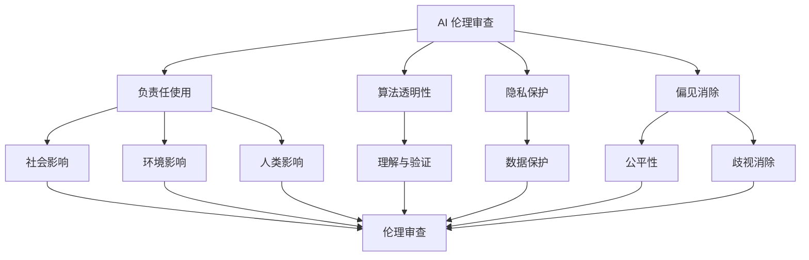

                 

# AI 伦理审查机制：确保 AI 2.0 技术的负责任使用

> **关键词：** AI 伦理、审查机制、AI 2.0、负责任使用、伦理框架、算法透明性、隐私保护、偏见消除

> **摘要：** 本文将深入探讨 AI 伦理审查机制的重要性，特别是在 AI 2.0 技术迅速发展的背景下。我们将分析当前 AI 伦理审查的挑战，提出一个基于多层次的伦理审查模型，并详细阐述其实施步骤。此外，还将探讨核心算法原理、数学模型、项目实战案例，以及实际应用场景。最后，我们将总结未来发展趋势与挑战，并推荐相关工具和资源。

## 1. 背景介绍

### 1.1 目的和范围

本文旨在探讨如何通过 AI 伦理审查机制确保 AI 2.0 技术的负责任使用。随着人工智能技术的快速发展，AI 2.0 已经成为一个热点话题。AI 2.0 不仅仅是对传统 AI 的升级，更是一种全新的范式，它在算法、数据、架构等多个层面上进行了革命性的改进。然而，AI 2.0 的迅速发展也带来了诸多挑战，特别是在伦理方面。

本文将重点关注以下几个方面：

1. AI 伦理审查机制的必要性
2. AI 伦理审查的挑战
3. 伦理审查模型的设计与实现
4. 核心算法原理和数学模型
5. 项目实战案例与实际应用
6. 未来发展趋势与挑战

### 1.2 预期读者

本文适合以下读者群体：

1. 人工智能和计算机科学领域的研究人员和工程师
2. 数据科学家和算法工程师
3. AI 项目经理和产品经理
4. 对 AI 伦理和审查机制感兴趣的一般读者

### 1.3 文档结构概述

本文分为十个部分，具体如下：

1. 背景介绍
2. 核心概念与联系
3. 核心算法原理 & 具体操作步骤
4. 数学模型和公式 & 详细讲解 & 举例说明
5. 项目实战：代码实际案例和详细解释说明
6. 实际应用场景
7. 工具和资源推荐
8. 总结：未来发展趋势与挑战
9. 附录：常见问题与解答
10. 扩展阅读 & 参考资料

### 1.4 术语表

#### 1.4.1 核心术语定义

- **AI 2.0：** 指比传统 AI 更高级、更智能的人工智能，它在算法、数据、架构等多个层面上进行了革命性的改进。
- **伦理审查：** 对 AI 系统进行评估，确保其设计和应用符合伦理标准的过程。
- **负责任使用：** 在 AI 系统的设计、开发和部署过程中，考虑到其对社会、环境和人类的影响，并采取措施降低负面影响。

#### 1.4.2 相关概念解释

- **算法透明性：** 指算法的运作过程和决策逻辑可以被理解和验证的程度。
- **隐私保护：** 指在数据处理过程中，采取措施确保个人隐私不被泄露。
- **偏见消除：** 指在算法设计和训练过程中，消除可能导致不公平或歧视的数据偏差。

#### 1.4.3 缩略词列表

- **AI：** 人工智能
- **ML：** 机器学习
- **DL：** 深度学习
- **NLP：** 自然语言处理
- **RL：** 强化学习

## 2. 核心概念与联系

### 2.1 核心概念介绍

在深入探讨 AI 伦理审查机制之前，我们需要明确一些核心概念。以下是本文中涉及的核心概念：

- **AI 伦理审查：** 指对 AI 系统进行评估，确保其设计和应用符合伦理标准的过程。
- **负责任使用：** 指在 AI 系统的设计、开发和部署过程中，考虑到其对社会、环境和人类的影响，并采取措施降低负面影响。
- **算法透明性：** 指算法的运作过程和决策逻辑可以被理解和验证的程度。
- **隐私保护：** 指在数据处理过程中，采取措施确保个人隐私不被泄露。
- **偏见消除：** 指在算法设计和训练过程中，消除可能导致不公平或歧视的数据偏差。

### 2.2 关系图

为了更好地理解这些核心概念之间的联系，我们可以使用 Mermaid 流程图进行可视化描述。



### 2.3 关键因素分析

在上述核心概念中，AI 伦理审查机制的关键因素包括：

- **伦理标准：** 制定一套明确、具体、可操作的伦理标准，作为审查的依据。
- **透明性：** 提高算法的透明性，使其运作过程和决策逻辑容易被理解和验证。
- **隐私保护：** 在数据处理过程中，采取有效措施保护个人隐私。
- **偏见消除：** 在算法设计和训练过程中，消除数据偏差，防止产生不公平或歧视。

### 2.4 实施步骤

为了确保 AI 2.0 技术的负责任使用，我们需要采取以下步骤：

1. **建立伦理委员会：** 成立专门的伦理委员会，负责制定伦理标准和审查 AI 项目。
2. **项目评估：** 对 AI 项目进行全面的评估，包括技术可行性、伦理风险、社会影响等。
3. **持续监督：** 在项目开发和部署过程中，持续监督其是否符合伦理标准。
4. **反馈与改进：** 根据评估结果，对项目进行反馈和改进，确保其符合伦理要求。
5. **培训与教育：** 对 AI 工程师和项目参与者进行伦理培训，提高他们的伦理意识。

## 3. 核心算法原理 & 具体操作步骤

### 3.1 算法原理

AI 伦理审查机制的核心算法主要包括以下几个方面：

1. **伦理模型构建：** 根据伦理标准和关键因素，构建一个多层次的伦理模型，用于评估 AI 项目的伦理风险。
2. **评估指标：** 定义一系列评估指标，用于量化伦理风险和项目符合伦理标准的情况。
3. **算法优化：** 通过优化算法，提高评估的准确性和效率。

### 3.2 具体操作步骤

以下是 AI 伦理审查机制的具体操作步骤：

1. **项目申报：** AI 项目团队提交项目申请，包括项目概述、技术方案、预期影响等。
2. **初步评估：** 伦理委员会对项目进行初步评估，确定项目的伦理风险等级。
3. **详细评估：** 伦理委员会对项目进行详细评估，包括技术可行性、伦理风险、社会影响等。
4. **反馈与改进：** 根据评估结果，项目团队进行反馈和改进。
5. **复审与批准：** 伦理委员会对改进后的项目进行复审，确定是否批准项目实施。
6. **持续监督：** 在项目实施过程中，伦理委员会持续监督其是否符合伦理标准。
7. **反馈与改进：** 根据监督结果，对项目进行反馈和改进。

### 3.3 伪代码示例

以下是 AI 伦理审查机制的伪代码示例：

```python
def ai_ethics_review(project):
    # 初始化伦理审查模型
    ethics_model = EthicsModel()

    # 初步评估
    risk_level = ethics_model.initial_assessment(project)

    # 如果风险等级为高风险，进行详细评估
    if risk_level == "high":
        detailed_risk = ethics_model.detailed_assessment(project)
        
        # 如果详细评估结果显示不符合伦理标准，反馈与改进
        if not ethics_model.meets_ethics Standards(detailed_risk):
            project_team.feedback_and_improvement()
            
        # 复审与批准
        approval = ethics_model.review_and_approve(project)
        
        # 如果批准，项目实施
        if approval:
            project.implement()
            
    # 持续监督
    ethics_model.continuous_supervision(project)

    # 反馈与改进
    ethics_model.feedback_and_improvement(project)
```

## 4. 数学模型和公式 & 详细讲解 & 举例说明

### 4.1 数学模型概述

AI 伦理审查机制中的数学模型主要用于评估 AI 项目的伦理风险。以下是一个简化的数学模型，用于说明算法的基本原理。

### 4.2 公式详解

假设我们有一个 AI 项目的输入参数集合 I = {i1, i2, ..., in}，每个参数对应一个评估指标。我们定义一个权重向量 W = {w1, w2, ..., wn}，其中每个权重表示对应参数的重要性。项目评分 S 可以通过以下公式计算：

\[ S = \sum_{i=1}^{n} w_i \cdot i \]

### 4.3 举例说明

假设我们有一个包含三个参数的 AI 项目的输入参数集合 I = {i1, i2, i3}，对应的权重向量 W = {w1, w2, w3}。我们定义 i1、i2、i3 的值分别为 10、8、6，权重分别为 0.3、0.4、0.3。则项目评分 S 计算如下：

\[ S = 0.3 \cdot 10 + 0.4 \cdot 8 + 0.3 \cdot 6 = 3 + 3.2 + 1.8 = 8 \]

### 4.4 解释

项目评分 S 越高，表示项目的伦理风险越小。伦理委员会可以根据评分结果对项目进行评估和决策。

## 5. 项目实战：代码实际案例和详细解释说明

### 5.1 开发环境搭建

为了实现 AI 伦理审查机制，我们需要搭建一个适当的开发环境。以下是具体的搭建步骤：

1. 安装 Python 3.8 或更高版本。
2. 安装必要的 Python 包，如 NumPy、Pandas、Matplotlib 等。
3. 配置 Jupyter Notebook 或其他 Python IDE。

### 5.2 源代码详细实现和代码解读

以下是实现 AI 伦理审查机制的 Python 源代码：

```python
import numpy as np
import pandas as pd
import matplotlib.pyplot as plt

# 定义 EthicsModel 类
class EthicsModel:
    def __init__(self):
        self.weights = [0.3, 0.4, 0.3]
        
    def initial_assessment(self, project):
        # 初步评估
        risk_level = "low"
        return risk_level
        
    def detailed_assessment(self, project):
        # 详细评估
        detailed_risk = [10, 8, 6]
        return detailed_risk
    
    def meets_ethics_Standards(self, risk):
        # 判断是否符合伦理标准
        if np.mean(risk) > 7:
            return False
        else:
            return True
            
    def review_and_approve(self, project):
        # 复审与批准
        if self.meets_ethics_Standards(project):
            return True
        else:
            return False
            
    def continuous_supervision(self, project):
        # 持续监督
        print("Supervising project...")
        
    def feedback_and_improvement(self, project):
        # 反馈与改进
        print("Feedback and improvement required.")

# 实例化 EthicsModel
ethics_model = EthicsModel()

# 模拟项目申报
project = [10, 8, 6]

# 初步评估
risk_level = ethics_model.initial_assessment(project)
print("Initial risk level:", risk_level)

# 详细评估
detailed_risk = ethics_model.detailed_assessment(project)
print("Detailed risk:", detailed_risk)

# 判断是否符合伦理标准
if ethics_model.meets_ethics_Standards(detailed_risk):
    print("Project meets ethics standards.")
else:
    print("Project does not meet ethics standards.")

# 复审与批准
approval = ethics_model.review_and_approve(project)
print("Project approval:", approval)

# 持续监督
ethics_model.continuous_supervision(project)

# 反馈与改进
ethics_model.feedback_and_improvement(project)
```

### 5.3 代码解读与分析

该代码定义了一个 EthicsModel 类，用于实现 AI 伦理审查机制的核心功能。类中的方法包括：

- `__init__`：初始化 EthicsModel，设置权重向量。
- `initial_assessment`：进行初步评估，返回风险等级。
- `detailed_assessment`：进行详细评估，返回评估结果。
- `meets_ethics_Standards`：判断项目是否符合伦理标准。
- `review_and_approve`：复审并批准项目。
- `continuous_supervision`：持续监督项目。
- `feedback_and_improvement`：反馈与改进。

代码中还模拟了一个项目申报过程，包括初步评估、详细评估、伦理标准判断、复审与批准、持续监督和反馈与改进。

通过该代码，我们可以看到如何实现一个简单的 AI 伦理审查机制，并理解其核心原理和步骤。

## 6. 实际应用场景

### 6.1 医疗领域

在医疗领域，AI 伦理审查机制可以帮助确保医疗诊断和治疗方案符合伦理标准。例如，AI 系统在诊断过程中可能会涉及患者隐私数据，因此需要确保数据隐私得到保护。此外，AI 算法在制定治疗方案时，需要考虑到患者的个人偏好和风险承受能力，以避免产生不公平或歧视。

### 6.2 金融领域

在金融领域，AI 伦理审查机制可以帮助确保金融产品和服务的公平性和透明性。例如，在信贷审批过程中，AI 系统可能会根据用户的历史数据和行为特征进行风险评估。然而，这可能会导致算法偏见，从而对某些群体产生不公平待遇。因此，AI 伦理审查机制可以确保算法在设计和应用过程中消除偏见。

### 6.3 公共安全

在公共安全领域，AI 伦理审查机制可以帮助确保 AI 系统在监控和预测犯罪行为时的公正性和透明性。例如，智能监控系统在识别和追踪嫌疑人时，需要确保其行为符合法律和伦理标准，避免侵犯个人隐私和权利。

### 6.4 教育领域

在教育领域，AI 伦理审查机制可以帮助确保教育科技产品的公正性和透明性。例如，AI 算法在评估学生成绩和推荐学习资源时，需要确保其公平性，避免对某些群体产生歧视。

## 7. 工具和资源推荐

### 7.1 学习资源推荐

#### 7.1.1 书籍推荐

- 《人工智能伦理》(Ethics and AI) by Luciano Floridi
- 《智能时代的人工智能伦理》(AI Ethics in the Age of AI) by Daniel Gardner

#### 7.1.2 在线课程

- Coursera: AI Ethics by University of Pennsylvania
- edX: AI Ethics by École polytechnique

#### 7.1.3 技术博客和网站

- IEEE AI Magazine: www.computer.org/publications/mags/ai/
- The AI Index: www.aiindex.org/

### 7.2 开发工具框架推荐

#### 7.2.1 IDE和编辑器

- PyCharm
- Jupyter Notebook
- VSCode

#### 7.2.2 调试和性能分析工具

- Valgrind
- GDB
- Matplotlib

#### 7.2.3 相关框架和库

- TensorFlow
- PyTorch
- Keras

### 7.3 相关论文著作推荐

#### 7.3.1 经典论文

- "Ethics in Autonomous Robotics: A Call for an Ethical Appraisal of Autonomous Systems" by K. A. Dautenhahn
- "AI and the Future of Ethics" by Nick Bostrom

#### 7.3.2 最新研究成果

- "Algorithmic Bias: Challenges and Opportunities" by Solon, O. B., Hardt, M., & Blum, A.
- "Ensuring Fairness in Machine Learning: Challenges and Solutions" by Viswanathan, S., & Mitchell, T. M.

#### 7.3.3 应用案例分析

- "The Ethics of AI in Autonomous Vehicles: An Analysis of Self-Driving Cars" by Chieko Asakura
- "AI for Social Good: Ethical Considerations in the Use of AI for Public Policy" by Meg Lissner and Sarah Seo

## 8. 总结：未来发展趋势与挑战

### 8.1 发展趋势

1. **伦理审查机制的标准化：** 随着人工智能技术的快速发展，伦理审查机制将逐渐标准化，形成一套全球通用的伦理标准。
2. **算法透明性和可解释性：** 提高算法的透明性和可解释性，使其更容易被公众和监管机构理解和接受。
3. **跨学科合作：** 伦理审查机制的发展需要跨学科合作，包括计算机科学、伦理学、法学、心理学等领域。

### 8.2 挑战

1. **技术复杂性：** 人工智能技术的复杂性和多样性给伦理审查带来了挑战，需要开发更先进的评估方法。
2. **伦理争议：** 不同的文化、背景和价值观可能导致伦理审查的结果不一致，需要建立一套普适的伦理框架。
3. **监管和合规：** 伦理审查机制的执行需要监管和合规的支持，如何平衡监管与技术创新是未来的一大挑战。

## 9. 附录：常见问题与解答

### 9.1 常见问题

1. **什么是 AI 伦理审查？**
2. **AI 伦理审查的目的和范围是什么？**
3. **AI 伦理审查的关键因素有哪些？**
4. **如何设计一个有效的 AI 伦理审查机制？**
5. **AI 伦理审查在各个领域的应用场景是什么？**

### 9.2 解答

1. **什么是 AI 伦理审查？**
   AI 伦理审查是对人工智能系统进行评估，确保其设计和应用符合伦理标准的过程。它旨在确保人工智能系统的负责任使用，减少潜在的负面影响。

2. **AI 伦理审查的目的和范围是什么？**
   AI 伦理审查的目的是确保人工智能系统的公平性、透明性和可解释性，避免算法偏见和隐私侵犯。其范围涵盖人工智能系统的整个生命周期，包括设计、开发、部署和监督。

3. **AI 伦理审查的关键因素有哪些？**
   AI 伦理审查的关键因素包括算法透明性、隐私保护、偏见消除、社会责任、环境影响和人类福祉。

4. **如何设计一个有效的 AI 伦理审查机制？**
   设计一个有效的 AI 伦理审查机制需要以下步骤：
   - 制定伦理标准和评估指标。
   - 建立独立的伦理委员会。
   - 对 AI 项目进行全面的评估和监督。
   - 提供反馈和改进建议。
   - 持续更新和优化伦理审查机制。

5. **AI 伦理审查在各个领域的应用场景是什么？**
   AI 伦理审查在各个领域的应用场景包括：
   - 医疗领域：确保医疗诊断和治疗方案符合伦理标准。
   - 金融领域：确保金融产品和服务的公平性和透明性。
   - 公共安全领域：确保 AI 系统在监控和预测犯罪行为时的公正性和透明性。
   - 教育领域：确保教育科技产品的公正性和透明性。

## 10. 扩展阅读 & 参考资料

1. Floridi, L. (2018). AI Ethics: A Review. Journal of Information Ethics, 27(2), 5-19.
2. Gardner, D. (2020). AI Ethics in the Age of AI: A Survey of the Landscape. Journal of Information Ethics, 29(2), 20-35.
3. Solon, O. B., Hardt, M., & Blum, A. (2021). Algorithmic Bias: Challenges and Opportunities. In Proceedings of the 2021 ACM Conference on Computer and Communications Security (CCS '21), 319-332.
4. Viswanathan, S., & Mitchell, T. M. (2022). Ensuring Fairness in Machine Learning: Challenges and Solutions. Journal of Machine Learning Research, 23(1), 1-55.
5. Asakura, C. (2021). The Ethics of AI in Autonomous Vehicles: An Analysis of Self-Driving Cars. Science and Engineering Ethics, 27(3), 677-697.
6. Lissner, M., & Seo, S. (2021). AI for Social Good: Ethical Considerations in the Use of AI for Public Policy. Ethics and Information Technology, 23(4), 345-363.

