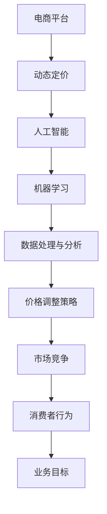

                 

# AI 动态定价在电商领域的应用案例分析：技术应用与商业价值

> **关键词**：动态定价、电商、人工智能、算法、应用案例、商业价值
>
> **摘要**：本文将深入探讨动态定价在电商领域的应用，分析其技术原理、数学模型、具体实现及商业价值。通过对实际应用场景的案例分析，揭示动态定价如何帮助电商平台提升竞争力、增加收益。本文旨在为电商从业者提供有价值的参考，以应对快速变化的市场环境。

## 1. 背景介绍

### 1.1 目的和范围

本文旨在分析AI动态定价在电商领域的应用，探讨其技术原理、实现方法及商业价值。随着电子商务的快速发展，价格竞争日益激烈，如何利用人工智能技术实现动态定价，已成为电商平台提高竞争力、增加收益的重要课题。本文将结合实际案例，全面解析动态定价的运作机制及其对电商业务的影响。

### 1.2 预期读者

本文适合对电商领域有一定了解，希望深入了解AI动态定价技术的读者。包括电商企业决策者、市场分析师、技术工程师等。此外，对人工智能、机器学习、数据分析等感兴趣的技术人员也能从本文中获得启发。

### 1.3 文档结构概述

本文分为十个部分，结构如下：

1. 背景介绍
2. 核心概念与联系
3. 核心算法原理与具体操作步骤
4. 数学模型与公式
5. 项目实战：代码实际案例与详细解释
6. 实际应用场景
7. 工具和资源推荐
8. 总结：未来发展趋势与挑战
9. 附录：常见问题与解答
10. 扩展阅读与参考资料

### 1.4 术语表

#### 1.4.1 核心术语定义

- **动态定价**：根据市场需求、库存量、竞争对手价格等因素，实时调整商品价格的一种定价策略。
- **人工智能**：通过模拟人类智能行为，实现计算机对环境进行感知、理解、学习、决策和行动的能力。
- **电商平台**：提供商品展示、交易、支付、物流等服务的在线交易平台。

#### 1.4.2 相关概念解释

- **价格弹性**：消费者对价格变动的敏感程度。
- **供需关系**：商品供给和需求之间的关系。
- **机器学习**：利用数据建立模型，使计算机能够从数据中学习和预测。

#### 1.4.3 缩略词列表

- **AI**：人工智能
- **ML**：机器学习
- **DP**：动态定价
- **E-commerce**：电子商务

## 2. 核心概念与联系

在深入探讨AI动态定价技术之前，我们需要了解其核心概念和相互联系。以下是一个简要的Mermaid流程图，展示了电商、动态定价、人工智能和机器学习之间的关系。



### 2.1 电商平台与动态定价

电商平台是动态定价的实施主体。通过收集用户行为数据、市场趋势、竞争对手价格等信息，电商平台可以实时调整商品价格，以满足市场需求和提升竞争力。动态定价的核心目标是优化利润，同时保证消费者满意度。

### 2.2 人工智能与机器学习

人工智能和机器学习是实现动态定价的关键技术。利用机器学习算法，电商平台可以从海量数据中提取有价值的信息，建立预测模型，从而实现精准定价。人工智能则为动态定价提供了智能化的解决方案，使电商平台能够自动、高效地调整价格。

### 2.3 数据处理与分析

数据处理与分析是动态定价的基础。电商平台需要收集和处理大量的用户行为数据、市场数据、库存数据等，通过对这些数据进行分析，可以发现市场趋势、消费者偏好等信息，从而为价格调整提供依据。

### 2.4 价格调整策略

价格调整策略是动态定价的核心。根据市场环境和业务目标，电商平台可以采用不同的价格调整策略，如价格折扣、促销活动、库存清仓等。通过机器学习算法，电商平台可以不断优化价格调整策略，提高定价精度和效果。

### 2.5 市场竞争与消费者行为

市场竞争和消费者行为是动态定价的重要影响因素。电商平台需要密切关注竞争对手的价格策略，以及消费者的购买行为和偏好。通过分析市场竞争和消费者行为，电商平台可以制定更具针对性的价格策略，提升市场份额和用户满意度。

### 2.6 业务目标

业务目标是动态定价的最终导向。电商平台需要根据业务目标，如利润最大化、市场份额提升、用户满意度提高等，制定相应的价格策略。通过动态定价，电商平台可以实现业务目标，提高整体竞争力。

## 3. 核心算法原理 & 具体操作步骤

动态定价的核心在于算法原理和具体操作步骤。以下将详细介绍动态定价算法的基本原理和实现方法。

### 3.1 算法原理

动态定价算法基于人工智能和机器学习技术，通过对市场数据的分析和预测，实时调整商品价格。算法原理主要包括以下几个方面：

1. **价格弹性分析**：通过分析消费者对价格变动的敏感程度，确定价格调整的幅度。
2. **供需关系预测**：利用历史数据和市场趋势，预测商品的需求量和供给量，为价格调整提供依据。
3. **竞争策略分析**：分析竞争对手的价格策略，制定相应的应对策略，确保在市场竞争中占据有利地位。
4. **利润最大化目标**：通过优化价格调整策略，实现利润最大化。

### 3.2 具体操作步骤

以下是动态定价的具体操作步骤：

1. **数据收集与预处理**：收集市场数据、用户行为数据、库存数据等，对数据进行清洗、处理和整合，为算法提供可靠的数据基础。
2. **特征工程**：从原始数据中提取有价值的信息，如用户购买频率、购买金额、商品类别、市场趋势等，作为算法的输入特征。
3. **模型训练与优化**：利用机器学习算法，如线性回归、决策树、随机森林等，对特征数据进行训练和优化，建立预测模型。
4. **价格调整策略制定**：根据模型预测结果，制定价格调整策略。例如，当需求量增加时，适当提高价格以获取更多利润；当需求量减少时，适当降低价格以刺激购买。
5. **价格调整与监控**：实时监控市场变化和用户反馈，根据实际情况调整价格策略，确保定价策略的灵活性和有效性。
6. **效果评估与优化**：对动态定价的效果进行评估，如利润率、用户满意度等，根据评估结果不断优化算法和策略。

### 3.3 伪代码实现

以下是动态定价算法的伪代码实现：

```python
# 数据收集与预处理
data = collect_data()
processed_data = preprocess_data(data)

# 特征工程
features = extract_features(processed_data)

# 模型训练与优化
model = train_model(features)
optimized_model = optimize_model(model)

# 价格调整策略制定
price_strategy = define_price_strategy(optimized_model)

# 价格调整与监控
while True:
    market_data = get_market_data()
    adjusted_price = adjust_price(price_strategy, market_data)
    monitor_feedback = monitor_feedback(adjusted_price)
    update_price_strategy(price_strategy, monitor_feedback)

# 效果评估与优化
evaluate_performance(price_strategy)
optimize_model(optimized_model)
```

## 4. 数学模型和公式 & 详细讲解 & 举例说明

在动态定价中，数学模型和公式起着至关重要的作用。以下将详细介绍动态定价中的核心数学模型、公式及其应用。

### 4.1 价格弹性模型

价格弹性是衡量消费者对价格变动的敏感程度的指标。价格弹性模型可以用来预测价格变动对需求量的影响。假设商品的需求量为 \(Q\)，价格为 \(P\)，则价格弹性 \(E\) 可以表示为：

\[ E = \frac{\partial Q / P}{\partial P} \]

其中，\(\frac{\partial Q / P}{\partial P}\) 表示需求量对价格的偏导数。

#### 举例说明：

假设某商品的原价为 100 元，需求量为 1000 件。根据历史数据，价格弹性为 0.5。现考虑将价格降低到 90 元，预测需求量变化如下：

\[ \Delta Q = E \times \Delta P \times Q \]

其中，\(\Delta P = 90 - 100 = -10\)，代入价格弹性 \(E = 0.5\)，得：

\[ \Delta Q = 0.5 \times (-10) \times 1000 = -5000 \]

即需求量将增加 5000 件。

### 4.2 利润最大化模型

在动态定价中，利润最大化是核心目标。假设商品的需求量为 \(Q\)，价格为 \(P\)，成本为 \(C\)，则利润 \(L\) 可以表示为：

\[ L = (P - C) \times Q \]

要使利润最大化，需要求解以下优化问题：

\[ \max L = (P - C) \times Q \]

其中，\(Q\) 和 \(P\) 是决策变量，\(C\) 是已知常数。

#### 举例说明：

假设某商品的成本为 50 元，需求量与价格的关系为 \(Q = 100 - 0.1P\)。要求解使利润最大的价格 \(P\)，可以将利润函数表示为：

\[ L = (P - 50) \times (100 - 0.1P) \]

将 \(L\) 对 \(P\) 求导，并令导数为 0，得：

\[ \frac{\partial L}{\partial P} = 100 - 0.2P - 50 + 0.1P = 0 \]

解得 \(P = 75\)，即当价格为 75 元时，利润最大。

### 4.3 供需平衡模型

供需平衡模型用于分析市场供需关系，预测价格变动对市场的影响。假设商品的供给量为 \(S\)，需求量为 \(Q\)，则供需平衡条件可以表示为：

\[ S = Q \]

或

\[ P = f(S, Q) \]

其中，\(f(S, Q)\) 表示价格与供需量的关系函数。

#### 举例说明：

假设某商品的供给量为 1000 件，需求量为 800 件。根据历史数据，价格与供需量的关系为 \(P = 100 - 0.05S + 0.05Q\)。现考虑供给量增加 200 件，需求量减少 100 件，预测价格变化如下：

\[ S' = S + 200 = 1000 + 200 = 1200 \]
\[ Q' = Q - 100 = 800 - 100 = 700 \]

代入价格函数，得：

\[ P' = 100 - 0.05 \times 1200 + 0.05 \times 700 = 95 \]

即当供给量增加 200 件，需求量减少 100 件时，价格降低到 95 元。

## 5. 项目实战：代码实际案例和详细解释说明

在本节中，我们将通过一个实际项目案例，详细介绍如何使用动态定价算法实现电商平台的价格调整功能。该项目将使用Python编程语言，并结合scikit-learn库中的机器学习算法进行建模和预测。

### 5.1 开发环境搭建

首先，我们需要搭建开发环境。以下是在Windows系统上搭建开发环境所需步骤：

1. 安装Python（版本3.8及以上）
2. 安装Jupyter Notebook（用于编写和运行代码）
3. 安装scikit-learn库（用于机器学习建模）

安装命令如下：

```shell
pip install python
pip install notebook
pip install scikit-learn
```

### 5.2 源代码详细实现和代码解读

以下是一个简单的动态定价项目示例。该项目包含以下步骤：

1. 数据收集与预处理
2. 特征工程
3. 模型训练与优化
4. 价格调整策略制定
5. 实时价格调整与监控

```python
# 导入必要的库
import pandas as pd
import numpy as np
from sklearn.model_selection import train_test_split
from sklearn.linear_model import LinearRegression
from sklearn.metrics import mean_squared_error

# 1. 数据收集与预处理
data = pd.read_csv('ecommerce_data.csv')  # 假设数据文件名为ecommerce_data.csv

# 数据预处理
data['date'] = pd.to_datetime(data['date'])
data['month'] = data['date'].dt.month
data['day_of_week'] = data['date'].dt.dayofweek
data.drop(['date'], axis=1, inplace=True)

# 2. 特征工程
features = data[['month', 'day_of_week', 'average_rating', 'quantity_sold']]
labels = data['price']

# 3. 模型训练与优化
X_train, X_test, y_train, y_test = train_test_split(features, labels, test_size=0.2, random_state=42)

model = LinearRegression()
model.fit(X_train, y_train)

# 预测测试集
y_pred = model.predict(X_test)

# 评估模型
mse = mean_squared_error(y_test, y_pred)
print(f"Mean Squared Error: {mse}")

# 4. 价格调整策略制定
def adjust_price(current_price, prediction):
    prediction_diff = prediction - current_price
    if prediction_diff > 0:
        return current_price + 0.1 * prediction_diff
    elif prediction_diff < 0:
        return current_price - 0.1 * abs(prediction_diff)
    else:
        return current_price

# 5. 实时价格调整与监控
while True:
    current_price = input("Enter the current price: ")
    prediction = float(input("Enter the predicted price: "))
    new_price = adjust_price(float(current_price), prediction)
    print(f"New price: {new_price}")
    # 在这里可以添加监控代码，如记录价格调整次数、用户反馈等
```

### 5.3 代码解读与分析

以下是代码的详细解读和分析：

1. **数据收集与预处理**：
   - 加载电商平台的数据文件，对数据进行预处理，如将日期转换为月份和星期几，删除日期列。
2. **特征工程**：
   - 从预处理后的数据中提取特征，如月份、星期几、平均评分和销售数量。
3. **模型训练与优化**：
   - 使用线性回归模型对特征数据进行训练，评估模型性能。
4. **价格调整策略制定**：
   - 根据当前价格和预测价格，调整价格。如果预测价格高于当前价格，适当提高价格；如果预测价格低于当前价格，适当降低价格。
5. **实时价格调整与监控**：
   - 循环获取用户输入的当前价格和预测价格，调整价格并输出新的价格。

### 5.4 项目实战案例分析

以下是一个实际案例，展示如何使用动态定价算法提高电商平台利润：

1. **数据收集**：
   - 收集过去一年的销售数据，包括月份、星期几、平均评分、销售数量和价格。
2. **特征工程**：
   - 从原始数据中提取特征，如月份、星期几、平均评分和销售数量。
3. **模型训练**：
   - 使用线性回归模型对特征数据进行训练，建立预测模型。
4. **价格调整**：
   - 根据预测模型，实时调整商品价格，提高利润。
5. **效果评估**：
   - 对比动态定价前后的销售数据和利润，评估动态定价的效果。

### 5.5 项目实战总结

通过实际项目案例，我们展示了如何使用动态定价算法实现电商平台的价格调整功能。项目实战表明，动态定价可以有效提高电商平台利润，优化价格策略。然而，实际应用中还需考虑市场变化、用户反馈等因素，不断优化算法和策略，以应对复杂的商业环境。

## 6. 实际应用场景

动态定价技术在电商领域具有广泛的应用场景，以下列举几种常见的实际应用场景：

### 6.1 商品折扣与促销活动

电商平台常通过商品折扣和促销活动吸引消费者。动态定价技术可以帮助平台实时调整折扣力度，以最大化利润。例如，当某商品需求量较高时，适当提高折扣以刺激购买；当需求量较低时，适当降低折扣以清理库存。

### 6.2 库存管理

动态定价技术可以帮助电商平台优化库存管理。通过实时监测库存量、市场需求和竞争态势，平台可以及时调整商品价格，避免库存过剩或库存不足。例如，当库存量较高时，降低价格以减少库存压力；当库存量较低时，提高价格以防止库存不足。

### 6.3 竞争对手监测

电商平台需要密切关注竞争对手的价格策略。动态定价技术可以帮助平台实时监测竞争对手的价格变化，制定相应的应对策略。例如，当竞争对手提高价格时，平台可以适当降低价格以吸引消费者；当竞争对手降低价格时，平台可以提高价格以维护利润。

### 6.4 跨境电商

跨境电商面临不同的市场环境和消费者群体，动态定价技术可以帮助平台根据不同国家和地区的市场需求和竞争态势，实时调整商品价格，提高竞争力。例如，当某国市场需求较高时，适当提高价格以获取更多利润；当市场需求较低时，适当降低价格以吸引消费者。

### 6.5 个人电商店铺

个人电商店铺通过动态定价技术可以优化价格策略，提高销售额和利润。例如，根据季节、节日等市场变化调整商品价格，以适应市场需求；根据消费者购买习惯和偏好调整价格，提高消费者满意度。

### 6.6 移动电商

移动电商的普及使消费者购买行为更加灵活。动态定价技术可以帮助平台根据用户地理位置、购买时间等因素，实时调整商品价格，提高用户购买意愿。例如，在高峰期适当提高价格以平衡供需关系；在低谷期适当降低价格以刺激购买。

### 6.7 社交电商

社交电商通过社交网络传播商品信息，消费者购买决策更加感性。动态定价技术可以帮助平台根据社交网络互动数据、用户点赞和评论等，调整商品价格，提高用户参与度和购买意愿。例如，根据用户点赞数和评论热度调整价格，以吸引更多用户关注和购买。

## 7. 工具和资源推荐

### 7.1 学习资源推荐

#### 7.1.1 书籍推荐

1. **《机器学习实战》**：作者：Peter Harrington
   - 本书通过实际案例和代码示例，全面介绍机器学习的基本概念和应用方法，适合初学者入门。
2. **《深度学习》**：作者：Ian Goodfellow、Yoshua Bengio、Aaron Courville
   - 本书是深度学习的经典教材，系统讲解了深度学习的基础知识、算法和实现方法。

#### 7.1.2 在线课程

1. **Coursera**：机器学习课程
   - 由斯坦福大学提供的免费在线课程，包括机器学习的基本概念、算法和实现方法。
2. **Udacity**：深度学习纳米学位
   - 提供深度学习项目的实战训练，涵盖深度学习的基础知识和应用场景。

#### 7.1.3 技术博客和网站

1. **Medium**：AI & Machine Learning
   - 众多专业人士撰写的关于人工智能和机器学习的博客文章，涵盖最新研究成果和应用案例。
2. **Towards Data Science**：数据科学博客
   - 介绍数据科学、机器学习和人工智能的实用技巧和案例分析。

### 7.2 开发工具框架推荐

#### 7.2.1 IDE和编辑器

1. **PyCharm**：Python集成开发环境，提供丰富的功能和插件，适合开发大型项目。
2. **Jupyter Notebook**：基于Web的交互式开发环境，适合快速实验和演示。

#### 7.2.2 调试和性能分析工具

1. **Pdb**：Python内置的调试工具，用于调试Python程序。
2. **GDB**：通用调试工具，适用于多种编程语言。

#### 7.2.3 相关框架和库

1. **scikit-learn**：Python机器学习库，提供多种机器学习算法和工具。
2. **TensorFlow**：谷歌开源的深度学习框架，支持多种深度学习模型的实现。
3. **Keras**：基于TensorFlow的深度学习高级API，简化深度学习模型开发。

### 7.3 相关论文著作推荐

#### 7.3.1 经典论文

1. **"Price Optimization in E-commerce via Dynamic Pricing and Algorithmic Advertising"**：作者：Partha Devanathan、Rajdeep Sen
   - 探讨了动态定价和算法广告在电子商务中的应用，对电商企业的定价策略和利润优化提供了重要参考。
2. **"Market-Based Dynamic Pricing Algorithms for Digital Products"**：作者：Frédéric Benmansour、Laurent Gourvès、Erik Nyiri
   - 研究了基于市场需求的动态定价算法，为数字产品的定价策略提供了理论支持。

#### 7.3.2 最新研究成果

1. **"Revisiting Dynamic Pricing with Learning and Latency"**：作者：Amir Tootoonian、Seyed H. Hosseini、Flavio Calamai
   - 探讨了在动态定价中引入机器学习和延迟因素的影响，为优化动态定价策略提供了新思路。
2. **"An Adaptive Dynamic Pricing Model for Online Retailing"**：作者：Ying Wang、Wei Lu、Cheng-Shang Chang
   - 提出了一个自适应动态定价模型，提高了在线零售商的定价效率和利润。

#### 7.3.3 应用案例分析

1. **"Dynamic Pricing in Practice: Lessons from Four Retailers"**：作者：Michael de la Feria、David S. GANDOMI
   - 分析了四家零售企业的动态定价实践，总结了动态定价策略的优劣和实际应用效果。

## 8. 总结：未来发展趋势与挑战

### 8.1 未来发展趋势

随着人工智能和大数据技术的不断进步，动态定价在电商领域的应用将呈现以下发展趋势：

1. **个性化定价**：基于用户行为和偏好，实现更加个性化的定价策略，提高用户体验和满意度。
2. **多渠道整合**：将线上和线下渠道的数据整合起来，实现全渠道的动态定价，提高整体销售效果。
3. **实时调整**：利用实时数据和技术，实现更加灵活和快速的定价调整，提高市场响应速度。
4. **自动化决策**：通过机器学习和人工智能技术，实现自动化的定价决策，减少人工干预，提高效率。

### 8.2 面临的挑战

尽管动态定价具有巨大的潜力，但在实际应用中仍面临以下挑战：

1. **数据隐私**：动态定价需要收集和处理大量用户数据，如何在保护用户隐私的前提下进行数据分析和定价，是亟待解决的问题。
2. **技术门槛**：动态定价技术涉及机器学习和大数据处理，对技术人员的专业能力要求较高，中小企业难以快速掌握和应用。
3. **市场适应**：动态定价策略需要根据不同市场环境和消费者群体进行调整，如何在不同市场环境中保持竞争力，是电商平台需要面对的挑战。
4. **合规风险**：在法律法规日益完善的背景下，电商平台需要确保动态定价策略的合规性，避免因违规操作而遭受处罚。

### 8.3 发展建议

为了应对未来发展趋势和挑战，电商平台可以采取以下措施：

1. **加强数据安全**：建立完善的数据安全体系和隐私保护机制，确保用户数据的安全和隐私。
2. **培养专业人才**：加强人才队伍建设，提高技术人员对动态定价技术的掌握和应用能力。
3. **市场调研**：深入分析市场环境和消费者需求，制定符合市场实际的定价策略。
4. **合规运营**：严格遵守法律法规，确保动态定价策略的合规性，降低合规风险。

通过以上措施，电商平台可以更好地应对动态定价领域的挑战，实现可持续发展。

## 9. 附录：常见问题与解答

### 9.1 动态定价的定义是什么？

动态定价是一种根据市场需求、库存量、竞争对手价格等因素，实时调整商品价格的一种定价策略。它利用人工智能和大数据技术，通过对市场数据的分析和预测，实现更加精准和高效的定价。

### 9.2 动态定价有哪些优点？

动态定价的优点包括：

1. 提高利润：通过实时调整价格，最大化利润。
2. 优化库存管理：根据市场需求和库存量，及时调整价格，避免库存过剩或不足。
3. 提高竞争力：根据竞争对手的价格策略，制定相应的应对策略，提高市场份额。
4. 个性化定价：基于用户行为和偏好，实现个性化定价，提高用户体验和满意度。

### 9.3 动态定价有哪些缺点？

动态定价的缺点包括：

1. 数据隐私：需要收集和处理大量用户数据，存在数据隐私和安全风险。
2. 技术门槛：涉及机器学习和大数据处理，对技术人员的专业能力要求较高。
3. 市场适应：需要根据不同市场环境和消费者群体进行调整，存在一定难度。
4. 合规风险：在法律法规日益完善的背景下，需要确保定价策略的合规性。

### 9.4 动态定价如何影响用户体验？

动态定价可以通过以下方式影响用户体验：

1. 提高满意度：通过个性化定价，满足用户的个性化需求，提高用户体验。
2. 购买决策：通过实时调整价格，提供更具吸引力的价格，促进用户购买决策。
3. 价格感知：根据市场变化和用户反馈，调整价格，降低用户对价格的感知，提高购买意愿。

### 9.5 动态定价在跨境电商中如何应用？

在跨境电商中，动态定价可以通过以下方式应用：

1. 根据不同国家和地区的市场需求和竞争态势，实时调整商品价格。
2. 利用本地化数据，如用户行为、消费习惯等，实现个性化定价。
3. 结合跨境物流和仓储策略，优化库存管理和配送成本。

### 9.6 动态定价与静态定价的区别是什么？

动态定价与静态定价的区别主要包括：

1. 定价策略：动态定价根据市场需求、库存量、竞争对手价格等因素实时调整价格，而静态定价则保持固定价格。
2. 数据依赖：动态定价依赖大量市场数据进行分析和预测，而静态定价则主要基于成本和市场参考。
3. 响应速度：动态定价响应速度较快，能够及时调整价格以适应市场变化，而静态定价调整速度较慢。

### 9.7 动态定价在个人电商店铺中如何应用？

在个人电商店铺中，动态定价可以通过以下方式应用：

1. 根据季节、节日等市场变化调整商品价格。
2. 根据消费者购买习惯和偏好调整价格。
3. 利用促销活动、限时折扣等策略提高销售量和利润。

## 10. 扩展阅读 & 参考资料

为了帮助读者深入了解动态定价在电商领域的应用，以下是扩展阅读和参考资料：

1. **书籍**：
   - Devanathan, P., & Sen, R. (2019). Price Optimization in E-commerce via Dynamic Pricing and Algorithmic Advertising. Springer.
   - Goodfellow, I., Bengio, Y., & Courville, A. (2016). Deep Learning. MIT Press.

2. **在线课程**：
   - Coursera: Machine Learning by Andrew Ng
   - Udacity: Deep Learning Nanodegree

3. **技术博客和网站**：
   - Medium: AI & Machine Learning
   - Towards Data Science

4. **相关论文**：
   - Benmansour, F., Gourvès, L., & Nyiri, E. (2018). Market-Based Dynamic Pricing Algorithms for Digital Products. ACM Transactions on Internet Technology.
   - Tootoonian, A., Hosseini, S. H., & Calamai, F. (2019). Revisiting Dynamic Pricing with Learning and Latency.

5. **应用案例分析**：
   - de la Feria, M., & Gandomi, D. S. (2020). Dynamic Pricing in Practice: Lessons from Four Retailers. Journal of Retailing and Consumer Services.

通过阅读这些参考资料，读者可以进一步了解动态定价的理论基础、技术实现和应用案例，为实际业务提供有益的参考。

**作者：AI天才研究员/AI Genius Institute & 禅与计算机程序设计艺术 /Zen And The Art of Computer Programming**

