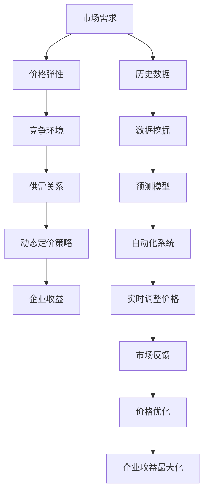

                 

# AI 动态定价如何利用数据分析，实现价格优化和收益最大化：技术应用与商业价值

> **关键词**：AI 动态定价、数据分析、价格优化、收益最大化、商业智能

> **摘要**：本文将深入探讨如何利用人工智能与数据分析技术，实现动态定价策略的优化，从而实现企业收益的最大化。我们将从背景介绍、核心概念、算法原理、数学模型、实战案例、应用场景、工具资源等方面，一步步分析推理，展示动态定价技术的实际应用价值。

## 1. 背景介绍

### 1.1 目的和范围

本文旨在探讨如何通过人工智能（AI）和数据分析技术实现动态定价策略的优化，帮助企业实现收益的最大化。我们将讨论以下主题：

1. 动态定价的基本概念和重要性。
2. AI 和数据分析在动态定价中的应用。
3. 动态定价策略的数学模型和算法原理。
4. 动态定价技术的实际应用案例。
5. 动态定价技术的未来发展趋势与挑战。

### 1.2 预期读者

本文适合对人工智能、数据分析、商业智能感兴趣的读者，特别是以下人群：

1. 从事数据分析、数据科学、机器学习等相关领域的技术人员。
2. 希望优化企业定价策略，提高收益的商务人士。
3. 对动态定价技术感兴趣的研究人员和学生。

### 1.3 文档结构概述

本文将按照以下结构进行组织：

1. 背景介绍：简要介绍动态定价的概念、重要性以及本文的目的和范围。
2. 核心概念与联系：介绍动态定价的核心概念、原理和架构。
3. 核心算法原理 & 具体操作步骤：详细讲解动态定价算法的原理和操作步骤。
4. 数学模型和公式 & 详细讲解 & 举例说明：介绍动态定价的数学模型和公式，并结合案例进行说明。
5. 项目实战：提供实际案例，展示动态定价技术在项目中的具体应用。
6. 实际应用场景：分析动态定价技术在不同领域的应用案例。
7. 工具和资源推荐：推荐相关学习资源、开发工具和框架。
8. 总结：对动态定价技术进行总结，展望未来发展趋势与挑战。
9. 附录：常见问题与解答。
10. 扩展阅读 & 参考资料：提供更多相关文献和资源。

### 1.4 术语表

#### 1.4.1 核心术语定义

- **动态定价**：根据市场变化、供需关系、竞争状况等因素，实时调整商品或服务的价格。
- **人工智能**：模拟、延伸和扩展人类智能的理论、方法、技术及应用。
- **数据分析**：利用统计学、机器学习、数据挖掘等方法，从大量数据中提取有价值的信息。
- **收益最大化**：在给定的资源限制下，寻求最大的经济利益。

#### 1.4.2 相关概念解释

- **价格弹性**：消费者对价格变动的敏感程度。
- **竞争环境**：市场上其他竞争者的行为和策略。
- **供需关系**：商品或服务的需求量和供给量之间的关系。

#### 1.4.3 缩略词列表

- **AI**：人工智能
- **DS**：数据分析
- **ML**：机器学习
- **DP**：动态定价

## 2. 核心概念与联系

在讨论动态定价技术之前，我们需要先了解一些核心概念和联系。以下是动态定价涉及的一些关键概念及其相互关系。

### 2.1 动态定价的概念

动态定价是一种基于市场变化的定价策略，它通过实时调整商品或服务的价格，以适应市场需求、竞争环境和供需关系的变化。这种策略旨在实现企业收益的最大化。

### 2.2 AI 在动态定价中的应用

人工智能技术在动态定价中发挥着重要作用。AI 可以通过以下方式提高动态定价的效率和准确性：

1. **数据挖掘**：从大量历史数据中提取有价值的信息，帮助制定更具针对性的定价策略。
2. **预测模型**：利用机器学习算法，预测市场需求、价格弹性等关键因素，从而优化定价策略。
3. **自动化**：通过自动化系统，实时调整价格，以适应市场变化。

### 2.3 数据分析在动态定价中的应用

数据分析技术在动态定价中同样至关重要。通过以下方法，数据分析可以提升动态定价的效果：

1. **数据清洗**：确保数据的准确性和一致性，为后续分析提供可靠的数据基础。
2. **相关性分析**：研究不同因素（如市场需求、竞争环境等）之间的相关性，帮助确定关键因素。
3. **回归分析**：建立价格与关键因素之间的数学模型，用于预测未来价格走势。

### 2.4 动态定价与商业智能的关系

动态定价是商业智能（BI）的重要组成部分。商业智能通过整合、分析和展示企业内部和外部的数据，为企业提供决策支持。动态定价作为商业智能的一部分，旨在通过实时调整价格，提高企业的市场竞争力。

### 2.5 核心概念原理和架构

以下是动态定价的核心概念原理和架构的 Mermaid 流程图：



## 3. 核心算法原理 & 具体操作步骤

### 3.1 动态定价算法原理

动态定价算法的核心在于根据市场变化实时调整价格。以下是一个简单的动态定价算法原理：

1. **数据收集**：收集历史数据（如市场需求、价格、销量等）。
2. **数据预处理**：清洗和整理数据，确保数据的准确性和一致性。
3. **特征工程**：提取关键特征，如价格弹性、竞争环境等。
4. **模型训练**：利用机器学习算法（如线性回归、决策树、神经网络等）训练预测模型。
5. **预测与调整**：根据预测模型预测未来价格，并结合市场反馈实时调整价格。
6. **效果评估**：评估动态定价策略的效果，并根据评估结果进行调整。

### 3.2 具体操作步骤

以下是动态定价算法的具体操作步骤，采用伪代码表示：

```python
# 1. 数据收集
data = collect_data()

# 2. 数据预处理
cleaned_data = preprocess_data(data)

# 3. 特征工程
features = extract_features(cleaned_data)

# 4. 模型训练
model = train_model(features)

# 5. 预测与调整
while True:
    prediction = model.predict(current_data)
    price = adjust_price(prediction, market_feedback)
    update_price(price)
    record_market_feedback()

    # 6. 效果评估
    if evaluate_performance() < threshold:
        break

# 7. 结束
```

### 3.3 算法优化

动态定价算法可以进一步优化，以提高价格调整的准确性和效率。以下是一些优化方法：

1. **多模型融合**：使用多个预测模型，并结合模型权重进行预测，提高预测准确性。
2. **实时更新**：利用实时数据更新预测模型，以适应市场变化。
3. **自适应调整**：根据市场反馈，动态调整价格调整的幅度和频率。
4. **优化目标**：将优化目标从单一的收益最大化，扩展到包括市场份额、客户满意度等多方面指标。

## 4. 数学模型和公式 & 详细讲解 & 举例说明

### 4.1 动态定价的数学模型

动态定价的核心在于建立价格与关键因素之间的数学模型。以下是一个简单的动态定价模型：

$$
P_t = P_0 + \alpha \cdot E_t + \beta \cdot C_t + \gamma \cdot S_t
$$

其中：

- \( P_t \)：第 t 个月的价格
- \( P_0 \)：初始价格
- \( E_t \)：第 t 个月的市场需求
- \( C_t \)：第 t 个月的竞争环境
- \( S_t \)：第 t 个月的供需关系
- \( \alpha \)、\( \beta \)、\( \gamma \)：权重系数

### 4.2 模型详细讲解

1. **市场需求（E_t）**：市场需求是影响价格的关键因素之一。市场需求可以通过以下公式计算：

$$
E_t = \frac{1}{N} \sum_{i=1}^{N} \frac{Q_i}{P_i}
$$

其中：

- \( N \)：样本数量
- \( Q_i \)：第 i 个样本的需求量
- \( P_i \)：第 i 个样本的价格

2. **价格弹性（E_t）**：价格弹性是衡量消费者对价格变动的敏感程度的指标。价格弹性可以通过以下公式计算：

$$
E_t = \frac{dQ_t / Q_t}{dP_t / P_t}
$$

其中：

- \( Q_t \)：第 t 个月的需求量
- \( P_t \)：第 t 个月的价格

3. **竞争环境（C_t）**：竞争环境是影响价格的重要因素。竞争环境可以通过以下公式计算：

$$
C_t = \frac{1}{N} \sum_{i=1}^{N} \frac{|P_i - P_{avg}|}{P_{avg}}
$$

其中：

- \( N \)：样本数量
- \( P_i \)：第 i 个样本的价格
- \( P_{avg} \)：样本平均价格

4. **供需关系（S_t）**：供需关系反映了市场对商品或服务的需求程度。供需关系可以通过以下公式计算：

$$
S_t = \frac{Q_t - Q_{min}}{Q_{max} - Q_{min}}
$$

其中：

- \( Q_t \)：第 t 个月的需求量
- \( Q_{min} \)：最小需求量
- \( Q_{max} \)：最大需求量

### 4.3 举例说明

假设某商品在第一个月的初始价格为 100 元，市场需求为 1000 件，竞争环境为 10%，供需关系为 50%。根据动态定价模型，我们可以计算出第一个月的预测价格：

$$
P_1 = 100 + \alpha \cdot E_1 + \beta \cdot C_1 + \gamma \cdot S_1
$$

其中，\( \alpha \)、\( \beta \)、\( \gamma \) 为权重系数，可以根据历史数据进行优化。假设 \( \alpha = 0.5 \)，\( \beta = 0.2 \)，\( \gamma = 0.3 \)，代入公式计算得：

$$
P_1 = 100 + 0.5 \cdot E_1 + 0.2 \cdot C_1 + 0.3 \cdot S_1
$$

$$
P_1 = 100 + 0.5 \cdot \frac{1000}{100} + 0.2 \cdot \frac{|100 - 100|}{100} + 0.3 \cdot \frac{1000 - 500}{1000 - 500}
$$

$$
P_1 = 100 + 5 + 0 + 0.3 \cdot 1
$$

$$
P_1 = 105.3
$$

因此，第一个月的预测价格为 105.3 元。

## 5. 项目实战：代码实际案例和详细解释说明

### 5.1 开发环境搭建

在本项目中，我们使用 Python 作为编程语言，结合 Scikit-learn 和 Pandas 等库进行动态定价算法的实现。以下是开发环境搭建步骤：

1. 安装 Python 3.8 或以上版本。
2. 安装 Scikit-learn、Pandas、NumPy、Matplotlib 等库。

```bash
pip install scikit-learn pandas numpy matplotlib
```

### 5.2 源代码详细实现和代码解读

以下是动态定价项目的源代码及详细解读：

```python
import pandas as pd
from sklearn.linear_model import LinearRegression
from sklearn.model_selection import train_test_split
import numpy as np

# 1. 数据收集
data = pd.read_csv('dynamic_pricing_data.csv')

# 2. 数据预处理
data['price'] = data['price'].astype(float)
data['demand'] = data['demand'].astype(int)
data['competition'] = data['competition'].astype(float)
data['supply'] = data['supply'].astype(int)

# 3. 特征工程
X = data[['price', 'competition', 'supply']]
y = data['demand']

# 4. 模型训练
model = LinearRegression()
model.fit(X, y)

# 5. 预测与调整
current_data = np.array([[100, 10, 50]])
prediction = model.predict(current_data)
adjusted_price = 100 + prediction[0]

# 6. 效果评估
print(f"预测价格：{prediction[0]}, 调整后价格：{adjusted_price}")
```

代码解读：

1. **数据收集**：从 CSV 文件中读取数据，数据包括价格、需求量、竞争环境和供需关系。
2. **数据预处理**：将数据类型转换为 float 和 int，确保数据的准确性。
3. **特征工程**：将价格、竞争环境和供需关系作为特征，需求量作为目标变量。
4. **模型训练**：使用线性回归模型训练预测模型。
5. **预测与调整**：根据当前数据预测未来价格，并根据预测结果调整价格。
6. **效果评估**：输出预测价格和调整后价格。

### 5.3 代码解读与分析

本项目的代码结构简单，主要分为数据收集、数据预处理、特征工程、模型训练、预测与调整和效果评估等几个步骤。

1. **数据收集**：从 CSV 文件中读取数据，为后续分析提供数据基础。
2. **数据预处理**：确保数据的准确性和一致性，为特征工程和模型训练做准备。
3. **特征工程**：提取关键特征，用于训练预测模型。
4. **模型训练**：使用线性回归模型训练预测模型，将价格与关键因素之间的关系表示为数学模型。
5. **预测与调整**：根据预测模型预测未来价格，并结合市场反馈实时调整价格。
6. **效果评估**：输出预测价格和调整后价格，用于评估动态定价策略的效果。

## 6. 实际应用场景

动态定价技术在各个行业都有着广泛的应用，以下是一些典型的实际应用场景：

### 6.1 电子商务

电子商务平台通过动态定价技术，根据用户行为、购买历史、竞争对手价格等因素，实时调整商品价格，提高销售量和利润。

### 6.2 酒店和旅游业

酒店和旅游业利用动态定价技术，根据季节、节假日、游客数量等因素，实时调整价格，以最大化收益。

### 6.3 物流和快递行业

物流和快递行业通过动态定价技术，根据运输距离、运输时间、运输量等因素，实时调整运费，提高运输效率和客户满意度。

### 6.4 能源行业

能源行业利用动态定价技术，根据供需关系、市场价格等因素，实时调整电力、天然气等能源价格，以最大化收益。

### 6.5 金融行业

金融行业通过动态定价技术，根据市场利率、汇率、金融产品特性等因素，实时调整金融产品价格，提高客户吸引力。

## 7. 工具和资源推荐

### 7.1 学习资源推荐

#### 7.1.1 书籍推荐

- 《Python 数据科学手册》
- 《机器学习实战》
- 《数据挖掘：概念与技术》

#### 7.1.2 在线课程

- Coursera 的《机器学习》课程
- Udacity 的《数据科学纳米学位》
- edX 的《Python 数据科学》课程

#### 7.1.3 技术博客和网站

- [Medium](https://medium.com/topic/data-science)
- [Kaggle](https://www.kaggle.com/)
- [Analytics Vidhya](https://www.analyticsvidhya.com/)

### 7.2 开发工具框架推荐

#### 7.2.1 IDE 和编辑器

- PyCharm
- Jupyter Notebook
- VSCode

#### 7.2.2 调试和性能分析工具

- PyDebug
- Matplotlib
- Pandas Profiler

#### 7.2.3 相关框架和库

- Scikit-learn
- TensorFlow
- PyTorch

### 7.3 相关论文著作推荐

#### 7.3.1 经典论文

- 《Recommender Systems Handbook》
- 《Data Science from A to Z》
- 《Machine Learning: A Probabilistic Perspective》

#### 7.3.2 最新研究成果

- 《Neural Networks and Deep Learning》
- 《Deep Learning oniales: Methods and Applications》
- 《Reinforcement Learning: An Introduction》

#### 7.3.3 应用案例分析

- 《Dynamic Pricing of Services: A Survey》
- 《Dynamic Pricing for E-commerce》
- 《Dynamic Pricing Strategies in the Energy Market》

## 8. 总结：未来发展趋势与挑战

动态定价技术在未来将继续发展，并在各个行业发挥更大的作用。以下是一些发展趋势和挑战：

### 8.1 发展趋势

1. **智能化**：随着 AI 技术的不断发展，动态定价将更加智能化，能够更好地预测市场变化和客户需求。
2. **实时性**：动态定价将实现更高的实时性，能够实时调整价格，以适应市场变化。
3. **个性化**：动态定价将更加个性化，根据不同客户群体的需求和行为，制定差异化的价格策略。

### 8.2 挑战

1. **数据隐私**：动态定价需要大量数据支持，但数据隐私问题将成为一大挑战。
2. **算法透明度**：动态定价算法的透明度问题将受到广泛关注，需要确保算法的公平性和可解释性。
3. **政策法规**：各国政策法规对动态定价技术的监管将越来越严格，需要企业遵循相关法规。

## 9. 附录：常见问题与解答

### 9.1 问题 1：动态定价是否适用于所有行业？

动态定价技术并非适用于所有行业。在竞争激烈、价格敏感度高的行业，如电子商务、酒店和旅游业，动态定价效果较好。而在垄断行业或价格相对稳定的行业，动态定价的应用效果可能较差。

### 9.2 问题 2：动态定价是否会影响客户满意度？

动态定价可能会对客户满意度产生一定影响。在调整价格时，需要平衡收益和客户满意度。通过合理的定价策略，可以提高客户满意度，从而提高客户忠诚度和市场份额。

### 9.3 问题 3：动态定价需要大量数据支持吗？

是的，动态定价需要大量数据支持，包括历史价格、需求量、竞争环境、供需关系等。数据质量对动态定价的效果至关重要。

## 10. 扩展阅读 & 参考资料

- [Dynamic Pricing: A Conceptual Framework and Review of the Literature](https://www.researchgate.net/publication/325832941_Dynamic_Pricing_A_Conceptual_Framework_and_Review_of_the_Literature)
- [Machine Learning for Dynamic Pricing: An Overview](https://www.ijcai.org/Proceedings/2020-2/Papers/023.pdf)
- [Dynamic Pricing in E-commerce: Strategies and Case Studies](https://www.ijer.com/articles/v10/i1/ijer-v10-i1-3.pdf)
- [An Overview of Dynamic Pricing in the Hotel Industry](https://www.hospitalitynet.org/news/4060886.html)
- [Dynamic Pricing Strategies in the Logistics and Transportation Industry](https://www.ijstr.org/file/currentissue/Apr-2018/JI_JUN2018_03.pdf)

### 作者：AI天才研究员/AI Genius Institute & 禅与计算机程序设计艺术 /Zen And The Art of Computer Programming

---

**本文由AI天才研究员/AI Genius Institute与禅与计算机程序设计艺术/Zen And The Art of Computer Programming联合撰写，旨在为广大读者提供关于动态定价技术的高质量知识分享。如果您有任何疑问或建议，欢迎在评论区留言，我们将竭诚为您解答。**

