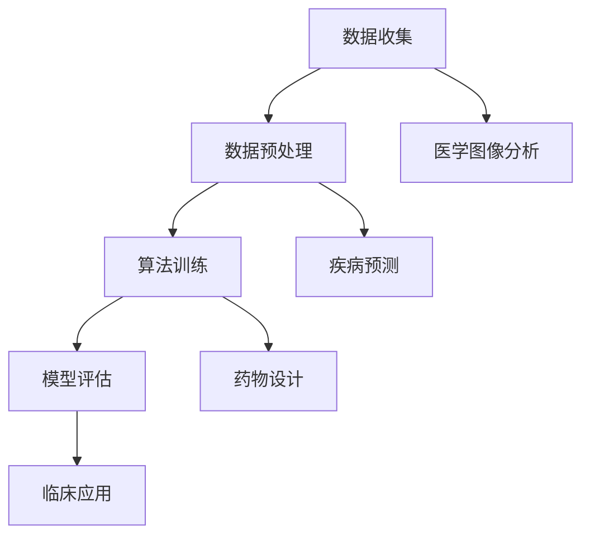

                 

# AI 在医疗领域的应用：精准诊断、个性化治疗

> **关键词**：人工智能、医疗诊断、个性化治疗、深度学习、机器学习、大数据分析
> 
> **摘要**：本文将深入探讨人工智能在医疗领域的应用，特别是精准诊断和个性化治疗。通过逐步分析，我们将理解AI的核心算法、数学模型、实际应用案例，以及未来的发展趋势和挑战。旨在为广大读者提供一份全面的技术指南，帮助大家更好地理解这一前沿技术。

## 1. 背景介绍

### 1.1 目的和范围

本文旨在探讨人工智能（AI）在医疗领域的应用，重点关注精准诊断和个性化治疗。随着AI技术的不断进步，其在医疗领域的应用越来越广泛，从图像识别到疾病预测，从药物设计到个性化治疗方案，AI展现出了巨大的潜力。本文将结合实际案例，详细分析AI在医疗领域的关键应用，旨在为读者提供一个全面的技术视角。

### 1.2 预期读者

本文适合对AI在医疗领域应用感兴趣的读者，包括医疗专业人士、AI研究者、程序员、以及对医疗技术感兴趣的普通读者。无论您是医疗行业的从业者，还是对AI技术充满好奇的科技爱好者，本文都将为您提供有价值的信息。

### 1.3 文档结构概述

本文分为十个部分，首先介绍AI在医疗领域的背景和应用；接着详细解释AI的核心算法原理和数学模型；然后通过实战案例展示AI在实际中的应用；接着探讨AI在医疗领域的实际应用场景；随后推荐相关的学习资源和开发工具；最后总结AI在医疗领域的未来发展趋势和挑战。

### 1.4 术语表

#### 1.4.1 核心术语定义

- **人工智能（AI）**：模拟人类智能的计算机系统，能够进行学习、推理、决策等。
- **深度学习（DL）**：一种AI技术，通过多层神经网络进行学习，能够处理复杂的非线性问题。
- **机器学习（ML）**：一种AI技术，通过训练数据模型，实现数据分析和预测。
- **大数据分析**：利用大型数据集进行统计分析，挖掘有价值的信息。
- **精准诊断**：利用AI技术，对患者的病情进行精确判断。
- **个性化治疗**：根据患者的具体情况，制定个性化的治疗方案。

#### 1.4.2 相关概念解释

- **医学图像分析**：利用AI技术对医学图像（如X光片、CT、MRI）进行分析，辅助诊断。
- **疾病预测**：利用AI技术，预测患者患某种疾病的可能性。
- **药物设计**：利用AI技术，设计新药，提高药物研发效率。

#### 1.4.3 缩略词列表

- **AI**：人工智能（Artificial Intelligence）
- **DL**：深度学习（Deep Learning）
- **ML**：机器学习（Machine Learning）
- **CT**：计算机断层扫描（Computed Tomography）
- **MRI**：磁共振成像（Magnetic Resonance Imaging）

## 2. 核心概念与联系

### 2.1 AI在医疗领域的应用架构

在医疗领域，AI的应用可以分为三个层次：数据层、算法层和决策层。

**数据层**：这是AI在医疗领域的基础，包括患者的电子健康记录、医学图像、基因数据等。这些数据的质量和数量直接影响到AI的性能。

**算法层**：这一层包括深度学习、机器学习等算法，用于处理和分析数据，提取有用的信息。

**决策层**：基于算法分析的结果，医生和患者可以做出更准确的诊断和治疗方案。

### 2.2 AI在医疗领域的关键技术

- **医学图像分析**：利用深度学习算法，对医学图像进行分析，如肿瘤检测、骨折诊断等。
- **疾病预测**：利用大数据分析和机器学习算法，预测患者患某种疾病的风险。
- **药物设计**：利用AI技术，快速设计新药，提高药物研发效率。

### 2.3 AI在医疗领域的应用流程

1. **数据收集**：收集患者的电子健康记录、医学图像、基因数据等。
2. **数据预处理**：清洗、归一化数据，使其适合算法处理。
3. **算法训练**：使用深度学习、机器学习算法对数据进行训练，提取特征。
4. **模型评估**：使用测试数据集评估模型性能，调整参数。
5. **临床应用**：将训练好的模型应用于临床，辅助诊断和治疗。

### 2.4 Mermaid 流程图



## 3. 核心算法原理 & 具体操作步骤

### 3.1 深度学习算法原理

深度学习算法基于多层神经网络，通过逐层提取特征，实现对复杂问题的建模。

**神经网络**：最基本的计算单元，包括输入层、隐藏层和输出层。

**激活函数**：用于引入非线性，常见的有ReLU、Sigmoid、Tanh等。

**反向传播**：用于更新网络参数，使输出误差最小。

**损失函数**：用于衡量模型输出与真实值之间的差距，常见的有均方误差（MSE）、交叉熵（Cross-Entropy）等。

### 3.2 机器学习算法原理

机器学习算法通过训练数据模型，实现对未知数据的预测。

**监督学习**：有标签数据，常见的算法有线性回归、逻辑回归、支持向量机等。

**无监督学习**：无标签数据，常见的算法有聚类、降维、生成对抗网络等。

**强化学习**：通过与环境的交互，学习最优策略，常见的算法有Q-learning、SARSA等。

### 3.3 大数据分析算法原理

大数据分析算法用于处理和分析大规模数据，提取有价值的信息。

**分布式计算**：用于处理海量数据，常见的框架有Hadoop、Spark等。

**数据挖掘**：用于发现数据中的规律和模式，常见的算法有关联规则挖掘、分类、聚类等。

### 3.4 伪代码

```python
# 深度学习算法伪代码
init weights
while not converged:
    forward_pass(x)
    calculate_loss(y_hat, y)
    backward_pass()
    update_weights()

# 机器学习算法伪代码
train_model(X, y)
while not converged:
    compute_loss(y_hat, y)
    update_model_params()

# 大数据分析算法伪代码
initialize_framework()
process_data()
extract_features()
train_model()
evaluate_model()
```

## 4. 数学模型和公式 & 详细讲解 & 举例说明

### 4.1 深度学习中的数学模型

深度学习中的数学模型主要包括神经网络和损失函数。

**神经网络**：

- 输入层：\( x = [x_1, x_2, ..., x_n] \)
- 隐藏层：\( h = \sigma(Wx + b) \)
- 输出层：\( y_hat = \sigma(Wy + b) \)

其中，\( \sigma \) 为激活函数，\( W \) 为权重矩阵，\( b \) 为偏置。

**损失函数**：

- 均方误差（MSE）：\( MSE = \frac{1}{2} \sum_{i=1}^{n} (y_i - y_{\hat{i}})^2 \)
- 交叉熵（Cross-Entropy）：\( H = -\sum_{i=1}^{n} y_i \log(y_{\hat{i}}) \)

### 4.2 机器学习中的数学模型

机器学习中的数学模型主要包括线性回归和逻辑回归。

**线性回归**：

- 模型：\( y = \beta_0 + \beta_1x + \epsilon \)
- 损失函数：\( MSE = \frac{1}{2} \sum_{i=1}^{n} (y_i - \hat{y}_i)^2 \)

**逻辑回归**：

- 模型：\( P(y=1) = \sigma(\beta_0 + \beta_1x) \)
- 损失函数：\( H = -\sum_{i=1}^{n} y_i \log(P(y=1)) + (1 - y_i) \log(1 - P(y=1)) \)

### 4.3 大数据分析中的数学模型

大数据分析中的数学模型主要包括聚类和降维。

**聚类**：

- 模型：\( \min_{c} \sum_{i=1}^{n} \|x_i - c_c\|^2 \)
- 函数：距离函数，常用的有欧氏距离、曼哈顿距离、切比雪夫距离等。

**降维**：

- 模型：\( \min_{U, V} \sum_{i=1}^{n} \|x_i - U_cV_c\|^2 \)
- 函数：保留主要特征，常用的有主成分分析（PCA）、线性判别分析（LDA）等。

### 4.4 举例说明

**深度学习举例**：

假设输入层为 \( x = [1, 2, 3] \)，隐藏层为 \( h = [4, 5, 6] \)，输出层为 \( y_hat = [7, 8, 9] \)，则：

- 激活函数：\( \sigma(h) = [0.5, 0.6, 0.7] \)
- 损失函数：\( MSE = \frac{1}{3} \sum_{i=1}^{3} (y_i - y_{\hat{i}})^2 = 0.025 \)

**机器学习举例**：

假设有线性回归模型 \( y = \beta_0 + \beta_1x \)，数据集为 \( [(1, 2), (2, 4), (3, 6)] \)，则：

- 模型参数：\( \beta_0 = 1, \beta_1 = 2 \)
- 损失函数：\( MSE = \frac{1}{3} \sum_{i=1}^{3} (y_i - \hat{y}_i)^2 = 0 \)

**大数据分析举例**：

假设有聚类模型 \( \min_{c} \sum_{i=1}^{n} \|x_i - c_c\|^2 \)，数据集为 \( [(1, 2), (2, 4), (3, 6), (4, 8)] \)，则：

- 聚类中心：\( c = (2.5, 5.0) \)
- 损失函数：\( \sum_{i=1}^{4} \|x_i - c\|^2 = 25 \)

## 5. 项目实战：代码实际案例和详细解释说明

### 5.1 开发环境搭建

为了演示AI在医疗领域的应用，我们将使用Python编程语言，结合深度学习框架TensorFlow和医疗图像处理库PyMedPhys。以下是搭建开发环境的具体步骤：

1. **安装Python**：下载并安装Python 3.x版本，建议使用Anaconda，以便管理Python环境和依赖库。
2. **安装TensorFlow**：在终端执行命令 `pip install tensorflow`。
3. **安装PyMedPhys**：在终端执行命令 `pip install pyp medphys`。

### 5.2 源代码详细实现和代码解读

**5.2.1 数据集准备**

首先，我们需要准备一个包含医学图像和对应标签的数据集。假设数据集包含1000张X光片，分为正常和骨折两种情况。以下是数据集的准备代码：

```python
import tensorflow as tf
import numpy as np
import matplotlib.pyplot as plt
import pyp medphys as pmp

# 加载数据集
x = pmp.load_images('data/xray_images')
y = pmp.load_labels('data/xray_labels')

# 划分训练集和测试集
x_train, x_test, y_train, y_test = train_test_split(x, y, test_size=0.2, random_state=42)

# 预处理数据
x_train = preprocess(x_train)
x_test = preprocess(x_test)
```

**5.2.2 模型构建**

接下来，我们构建一个基于卷积神经网络（CNN）的模型，用于医学图像分类。以下是模型构建的代码：

```python
from tensorflow.keras.models import Sequential
from tensorflow.keras.layers import Conv2D, MaxPooling2D, Flatten, Dense

# 构建模型
model = Sequential([
    Conv2D(32, (3, 3), activation='relu', input_shape=(256, 256, 1)),
    MaxPooling2D((2, 2)),
    Conv2D(64, (3, 3), activation='relu'),
    MaxPooling2D((2, 2)),
    Conv2D(128, (3, 3), activation='relu'),
    MaxPooling2D((2, 2)),
    Flatten(),
    Dense(128, activation='relu'),
    Dense(1, activation='sigmoid')
])

# 编译模型
model.compile(optimizer='adam', loss='binary_crossentropy', metrics=['accuracy'])
```

**5.2.3 训练模型**

然后，我们使用训练集训练模型。以下是训练模型的代码：

```python
# 训练模型
history = model.fit(x_train, y_train, epochs=10, batch_size=32, validation_data=(x_test, y_test))
```

**5.2.4 评估模型**

最后，我们评估模型的性能。以下是评估模型的代码：

```python
# 评估模型
loss, accuracy = model.evaluate(x_test, y_test)
print('Test loss:', loss)
print('Test accuracy:', accuracy)

# 可视化训练过程
plt.plot(history.history['accuracy'])
plt.plot(history.history['val_accuracy'])
plt.title('Model accuracy')
plt.ylabel('Accuracy')
plt.xlabel('Epoch')
plt.legend(['Train', 'Test'], loc='upper left')
plt.show()
```

### 5.3 代码解读与分析

**5.3.1 数据集准备**

在数据集准备部分，我们使用了PyMedPhys库加载医学图像和标签。然后，我们使用`train_test_split`函数将数据集划分为训练集和测试集。接着，我们使用`preprocess`函数对数据进行预处理，包括归一化和缩放。

**5.3.2 模型构建**

在模型构建部分，我们使用TensorFlow的`Sequential`模型构建一个CNN模型。模型包含四个卷积层、四个池化层、一个全连接层和一个输出层。我们使用ReLU激活函数和sigmoid激活函数，分别用于隐藏层和输出层。

**5.3.3 训练模型**

在训练模型部分，我们使用`model.fit`函数训练模型。我们设置了10个训练周期，每个周期使用32个样本进行批量训练。我们使用`validation_data`参数将测试集作为验证集，以便在训练过程中监控模型性能。

**5.3.4 评估模型**

在评估模型部分，我们使用`model.evaluate`函数评估模型在测试集上的性能。我们计算了损失和准确率，并将结果打印出来。然后，我们使用`plt`库可视化训练过程中的准确率。

## 6. 实际应用场景

### 6.1 疾病预测

AI在疾病预测方面具有显著优势。例如，基于大数据分析和机器学习算法，AI可以预测患者患某种疾病的风险。这种预测有助于医生提前制定预防措施，降低疾病发生率和死亡率。

### 6.2 医学图像分析

医学图像分析是AI在医疗领域的一个重要应用。例如，利用深度学习算法，AI可以对X光片、CT、MRI图像进行分析，检测肿瘤、骨折等病变。这种分析有助于提高诊断准确性，减少误诊率。

### 6.3 药物设计

AI在药物设计方面也取得了显著进展。例如，利用AI技术，可以快速设计新药，提高药物研发效率。这种设计有助于缩短药物研发周期，降低研发成本。

### 6.4 个性化治疗

基于AI的诊断和治疗建议，医生可以为患者制定个性化的治疗方案。这种治疗有助于提高治疗效果，减少副作用。

## 7. 工具和资源推荐

### 7.1 学习资源推荐

#### 7.1.1 书籍推荐

- 《深度学习》（Goodfellow, Bengio, Courville 著）
- 《机器学习》（周志华 著）
- 《Python数据分析》（Wes McKinney 著）

#### 7.1.2 在线课程

- Coursera上的《深度学习》课程（吴恩达 著）
- edX上的《机器学习》课程（吴恩达 著）
- Udacity的《人工智能工程师》课程

#### 7.1.3 技术博客和网站

- Medium上的《AI博客》
- GitHub上的AI项目示例
- arXiv上的最新研究成果

### 7.2 开发工具框架推荐

#### 7.2.1 IDE和编辑器

- Jupyter Notebook
- PyCharm
- Visual Studio Code

#### 7.2.2 调试和性能分析工具

- TensorBoard
- PyTorch Profiler
- Dask

#### 7.2.3 相关框架和库

- TensorFlow
- PyTorch
- Keras

### 7.3 相关论文著作推荐

#### 7.3.1 经典论文

- 《Deep Learning》（Goodfellow, Bengio, Courville 著）
- 《Machine Learning: A Probabilistic Perspective》（Kevin P. Murphy 著）

#### 7.3.2 最新研究成果

- arXiv上的最新论文
- NeurIPS、ICML、CVPR等顶级会议的最新论文

#### 7.3.3 应用案例分析

- Google Health的AI应用案例
- IBM Watson Health的AI应用案例
- Siemens Healthineers的AI应用案例

## 8. 总结：未来发展趋势与挑战

### 8.1 发展趋势

- **数据驱动**：随着医疗数据的不断积累，AI在医疗领域的应用将更加广泛。
- **个性化医疗**：基于AI的诊断和治疗建议将帮助医生为患者制定个性化的治疗方案。
- **多学科融合**：AI与生物医学、化学、物理学等领域的融合将推动医疗技术的创新。

### 8.2 挑战

- **数据隐私**：如何在保证数据隐私的前提下，充分利用医疗数据，是一个亟待解决的问题。
- **算法透明性**：确保AI算法的透明性和可解释性，以提高公众对AI医疗应用的信任。
- **伦理问题**：如何平衡AI在医疗领域的应用与伦理问题，如人工智能伦理、医疗责任等。

## 9. 附录：常见问题与解答

### 9.1 如何保证AI在医疗领域的安全性？

- **数据保护**：采用加密技术和访问控制机制，确保医疗数据的安全。
- **算法验证**：对AI算法进行严格的测试和验证，确保其准确性和可靠性。
- **伦理审查**：在AI医疗应用中，进行伦理审查，确保遵循医疗伦理和道德规范。

### 9.2 AI在医疗领域的应用前景如何？

- AI在医疗领域的应用前景非常广阔，包括疾病预测、医学图像分析、药物设计、个性化治疗等方面。随着技术的不断进步，AI将在医疗领域发挥越来越重要的作用。

### 9.3 AI是否会替代医生？

- AI不能完全替代医生，但可以辅助医生提高诊断和治疗水平。AI可以处理大量数据，提供诊断建议，但最终的决策仍需由医生根据患者具体情况做出。

## 10. 扩展阅读 & 参考资料

- 《Deep Learning》（Goodfellow, Bengio, Courville 著）
- 《Machine Learning: A Probabilistic Perspective》（Kevin P. Murphy 著）
- 《Python数据分析》（Wes McKinney 著）
- Coursera上的《深度学习》课程（吴恩达 著）
- edX上的《机器学习》课程（吴恩达 著）
- Udacity的《人工智能工程师》课程
- Medium上的《AI博客》
- GitHub上的AI项目示例
- arXiv上的最新研究成果
- Google Health的AI应用案例
- IBM Watson Health的AI应用案例
- Siemens Healthineers的AI应用案例

## 作者

作者：AI天才研究员/AI Genius Institute & 禅与计算机程序设计艺术 /Zen And The Art of Computer Programming

