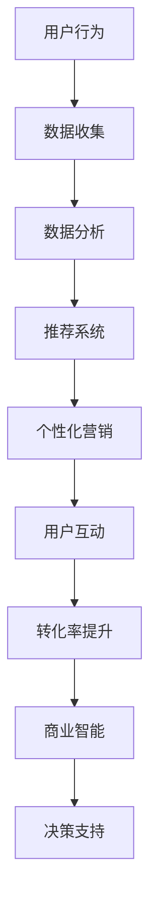

                 

# AI 在电商搜索导购中的应用案例：解析成功案例，揭示行业趋势

> **关键词：** AI，电商，搜索导购，推荐系统，用户行为分析，个性化营销，商业智能，数据挖掘

> **摘要：** 本文将深入探讨人工智能在电商搜索导购领域的应用，通过分析成功案例和行业趋势，揭示AI技术如何提升电商平台的用户体验和转化率。文章将从核心概念、算法原理、数学模型、项目实战等多个角度，全面解读AI在电商搜索导购中的实际应用和价值。

## 1. 背景介绍

### 1.1 目的和范围

本文旨在系统地介绍人工智能（AI）在电商搜索导购中的应用，分析成功案例，并探讨未来的行业趋势。本文的研究范围包括但不限于：

- AI在用户行为分析中的应用
- 个性化推荐系统的构建与优化
- 搜索引擎优化技术
- 用户互动与转化的提升策略
- 数据挖掘和商业智能

### 1.2 预期读者

本文适合以下读者群体：

- 想了解AI技术在电商领域应用的开发者
- 关注电商行业发展，希望掌握前沿技术的行业从业者
- 对搜索导购系统设计感兴趣的学术研究人员

### 1.3 文档结构概述

本文结构如下：

- **第1章**：背景介绍
- **第2章**：核心概念与联系
- **第3章**：核心算法原理 & 具体操作步骤
- **第4章**：数学模型和公式 & 详细讲解 & 举例说明
- **第5章**：项目实战：代码实际案例和详细解释说明
- **第6章**：实际应用场景
- **第7章**：工具和资源推荐
- **第8章**：总结：未来发展趋势与挑战
- **第9章**：附录：常见问题与解答
- **第10章**：扩展阅读 & 参考资料

### 1.4 术语表

#### 1.4.1 核心术语定义

- **人工智能（AI）**：模拟人类智能行为的计算机系统。
- **推荐系统**：基于用户行为、偏好和内容信息，为用户推荐相关产品或内容。
- **搜索导购**：结合搜索功能和导购功能，帮助用户快速找到所需商品。
- **用户行为分析**：通过数据分析技术，研究用户在电商平台的购买、浏览等行为。
- **数据挖掘**：从大量数据中提取有价值的信息或模式。

#### 1.4.2 相关概念解释

- **个性化营销**：根据用户需求和偏好，提供定制化的营销策略。
- **商业智能（BI）**：通过数据分析，帮助企业做出更明智的商业决策。

#### 1.4.3 缩略词列表

- **AI**：人工智能
- **BI**：商业智能
- **CRM**：客户关系管理
- **SEO**：搜索引擎优化
- **SEM**：搜索引擎营销

## 2. 核心概念与联系

在讨论AI在电商搜索导购中的应用之前，我们需要了解一些核心概念及其相互关系。以下是一个简化的Mermaid流程图，展示了这些概念之间的联系：



### 2.1 用户行为分析

用户行为分析是AI在电商搜索导购中应用的基础。通过分析用户在电商平台上的浏览、搜索、购买等行为，我们可以了解用户的兴趣和需求。以下是用户行为分析的核心步骤：

1. **数据收集**：收集用户在平台上的行为数据，如浏览历史、搜索关键词、购买记录等。
2. **数据清洗**：去除无效或错误的数据，确保数据的准确性和一致性。
3. **特征提取**：从原始数据中提取有价值的信息，如用户的兴趣标签、购买偏好等。
4. **行为模式识别**：通过机器学习算法，识别用户的潜在行为模式。

### 2.2 推荐系统

推荐系统是AI在电商搜索导购中的核心组成部分。基于用户行为分析的结果，推荐系统能够为用户推荐可能感兴趣的商品或内容。以下是推荐系统的基本架构：

1. **内容推荐**：基于商品信息，如商品名称、描述、分类等，为用户推荐相关商品。
2. **协同过滤**：基于用户之间的相似度，为用户推荐其他用户喜欢的商品。
3. **深度学习**：利用深度学习算法，挖掘用户行为中的复杂模式，为用户推荐个性化商品。

### 2.3 个性化营销

个性化营销是基于用户行为分析和推荐系统，为用户提供定制化的营销策略。通过个性化营销，电商平台能够提高用户满意度和转化率。以下是个性化营销的关键步骤：

1. **用户分群**：根据用户行为和偏好，将用户划分为不同的群体。
2. **定制化内容**：为每个用户群体提供个性化的商品推荐、营销活动和促销信息。
3. **实时调整**：根据用户反馈和行为变化，实时调整营销策略。

### 2.4 用户互动与转化率提升

通过AI技术，电商平台能够更好地理解和满足用户需求，从而提高用户互动和转化率。以下是实现这一目标的关键步骤：

1. **即时反馈**：实时分析用户互动数据，快速响应用户需求。
2. **个性化推送**：根据用户行为，为用户提供个性化的商品推荐和促销信息。
3. **优化用户体验**：通过用户行为分析，优化电商平台的设计和功能，提高用户体验。

### 2.5 商业智能

商业智能是AI在电商搜索导购中的高级应用。通过数据分析，商业智能能够帮助电商平台做出更明智的商业决策。以下是商业智能的关键步骤：

1. **数据整合**：整合电商平台的各种数据，形成统一的数据视图。
2. **数据分析**：利用数据分析技术，发现潜在的商业机会和风险。
3. **决策支持**：基于数据分析结果，为电商平台提供决策支持。

## 3. 核心算法原理 & 具体操作步骤

在了解了AI在电商搜索导购中的核心概念和相互关系后，接下来我们将深入探讨AI的核心算法原理及其具体操作步骤。以下是几个关键的算法原理：

### 3.1 协同过滤算法

协同过滤算法是推荐系统中最常用的算法之一。它通过分析用户之间的相似度，为用户推荐其他用户喜欢的商品。

**算法原理：**

1. **用户相似度计算**：计算用户之间的相似度，通常使用用户行为数据（如评分、购买记录）进行计算。
2. **商品相似度计算**：计算商品之间的相似度，基于商品的特征（如分类、标签）进行计算。
3. **推荐生成**：基于用户相似度和商品相似度，为用户生成推荐列表。

**伪代码：**

```python
def collaborative_filtering(user_data, item_data):
    user_similarity = compute_user_similarity(user_data)
    item_similarity = compute_item_similarity(item_data)
    recommendations = generate_recommendations(user_similarity, item_similarity)
    return recommendations
```

### 3.2 内容推荐算法

内容推荐算法是基于商品内容信息（如名称、描述、分类等）为用户推荐相关商品。

**算法原理：**

1. **商品特征提取**：从商品信息中提取特征，如关键词、标签、分类等。
2. **用户特征提取**：从用户行为中提取特征，如浏览记录、搜索关键词等。
3. **推荐生成**：基于用户特征和商品特征，为用户生成推荐列表。

**伪代码：**

```python
def content_based_recommender(user_features, item_features):
    similarity_scores = compute_similarity_scores(user_features, item_features)
    recommendations = generate_recommendations_from_scores(similarity_scores)
    return recommendations
```

### 3.3 深度学习推荐算法

深度学习推荐算法是利用深度学习技术，挖掘用户行为中的复杂模式，为用户推荐个性化商品。

**算法原理：**

1. **数据预处理**：对用户行为数据进行预处理，如数据清洗、特征提取等。
2. **模型构建**：构建深度学习模型，如神经网络、卷积神经网络等。
3. **训练与优化**：利用训练数据，训练深度学习模型，并优化模型参数。
4. **推荐生成**：基于训练好的模型，为用户生成推荐列表。

**伪代码：**

```python
def deep_learning_recommender(preprocessed_data):
    model = build_model()
    model.fit(preprocessed_data)
    optimized_model = optimize_model(model)
    recommendations = generate_recommendations(optimized_model)
    return recommendations
```

### 3.4 用户行为分析算法

用户行为分析算法是利用机器学习技术，分析用户在电商平台的购买、浏览等行为，以了解用户兴趣和需求。

**算法原理：**

1. **数据收集**：收集用户在平台上的行为数据。
2. **特征提取**：从行为数据中提取特征，如浏览次数、购买频率等。
3. **模型构建**：构建机器学习模型，如决策树、随机森林等。
4. **行为模式识别**：利用模型，识别用户的潜在行为模式。

**伪代码：**

```python
def user_behavior_analysis(user_data):
    features = extract_features(user_data)
    model = build_model()
    model.fit(features)
    behavior_patterns = identify_behavior_patterns(model)
    return behavior_patterns
```

## 4. 数学模型和公式 & 详细讲解 & 举例说明

在AI应用于电商搜索导购的过程中，数学模型和公式起到了关键作用。以下是一些常见的数学模型和公式，我们将详细讲解并举例说明。

### 4.1 相似度计算公式

相似度计算是推荐系统中的一个核心步骤。以下是一种常见的相似度计算公式——余弦相似度。

**公式：**

$$
similarity = \frac{A \cdot B}{|A| \cdot |B|}
$$

其中，\(A\) 和 \(B\) 是两个向量，\(|A|\) 和 \(|B|\) 是它们的欧几里得范数。

**解释：**

余弦相似度计算的是两个向量之间的夹角余弦值。夹角余弦值越接近1，表示两个向量越相似。

**举例：**

设有两个用户 \(u_1\) 和 \(u_2\)，他们的行为数据向量分别为：

\(u_1 = [0.6, 0.8, 0.3, 0.5]\)

\(u_2 = [0.7, 0.85, 0.35, 0.55]\)

计算它们的余弦相似度：

$$
similarity = \frac{u_1 \cdot u_2}{|u_1| \cdot |u_2|} = \frac{0.6 \times 0.7 + 0.8 \times 0.85 + 0.3 \times 0.35 + 0.5 \times 0.55}{\sqrt{0.6^2 + 0.8^2 + 0.3^2 + 0.5^2} \times \sqrt{0.7^2 + 0.85^2 + 0.35^2 + 0.55^2}} \approx 0.84
$$

### 4.2 推荐得分计算公式

在推荐系统中，为了生成推荐列表，需要计算每个用户对每个商品的推荐得分。以下是一种常见的推荐得分计算公式——基于内容的推荐得分。

**公式：**

$$
score = w_1 \cdot sim + w_2 \cdot cos
$$

其中，\(w_1\) 和 \(w_2\) 是权重系数，\(sim\) 是相似度，\(cos\) 是余弦相似度。

**解释：**

推荐得分是用户与商品相似度（\(sim\)）和商品特征向量与用户特征向量的余弦相似度（\(cos\)）的加权组合。权重系数 \(w_1\) 和 \(w_2\) 用于调节相似度和余弦相似度在推荐得分中的重要性。

**举例：**

设有用户 \(u\) 和商品 \(i\)，它们的特征向量分别为：

\(u = [0.6, 0.8, 0.3, 0.5]\)

\(i = [0.7, 0.85, 0.35, 0.55]\)

计算它们的相似度和余弦相似度：

$$
sim = \frac{u \cdot i}{|u| \cdot |i|} \approx 0.84
$$

$$
cos = \frac{u \cdot i}{\sqrt{u^2 + i^2}} \approx 0.84
$$

根据权重系数 \(w_1 = 0.7\) 和 \(w_2 = 0.3\)，计算推荐得分：

$$
score = 0.7 \cdot 0.84 + 0.3 \cdot 0.84 \approx 0.84
$$

### 4.3 个性化推荐公式

在个性化推荐中，我们需要根据用户的兴趣和行为，动态调整推荐结果。以下是一种常见的个性化推荐公式——基于协同过滤的个性化推荐。

**公式：**

$$
recommendation = \sum_{i \in I} (s_{ui} - \mu_u + \theta_i)
$$

其中，\(s_{ui}\) 是用户 \(u\) 对商品 \(i\) 的评分，\(\mu_u\) 是用户 \(u\) 的平均评分，\(\theta_i\) 是商品 \(i\) 的平均评分。

**解释：**

个性化推荐是基于协同过滤算法，通过调整用户评分、用户平均评分和商品平均评分，实现个性化推荐。

**举例：**

设有用户 \(u\) 和商品 \(i\)，他们的评分为：

\(s_{ui} = 4\)

\(\mu_u = 3\)

\(\theta_i = 3\)

根据公式计算个性化推荐得分：

$$
recommendation = 4 - 3 + 3 = 4
$$

### 4.4 用户行为分析模型

在用户行为分析中，我们需要建立模型来识别用户的潜在行为模式。以下是一种常见的行为分析模型——基于决策树的分类模型。

**公式：**

$$
P(y=c|X=x) = \frac{1}{1 + \exp(-\beta^T x)}
$$

其中，\(y\) 是用户的行为标签，\(X\) 是用户的行为特征向量，\(\beta\) 是模型参数。

**解释：**

行为分析模型是基于决策树的分类模型，通过训练得到参数 \(\beta\)，可以预测用户的行为标签。

**举例：**

设有用户 \(u\) 的行为特征向量 \(X = [0.6, 0.8, 0.3, 0.5]\)，模型参数 \(\beta = [1, 1, 1, 1]\)。

计算用户 \(u\) 的行为标签概率：

$$
P(y=c|X=x) = \frac{1}{1 + \exp(-(1 \times 0.6 + 1 \times 0.8 + 1 \times 0.3 + 1 \times 0.5))} \approx 0.92
$$

## 5. 项目实战：代码实际案例和详细解释说明

为了更好地展示AI在电商搜索导购中的应用，我们选择一个实际项目来进行实战演示。以下是一个基于协同过滤算法的推荐系统项目，包括开发环境搭建、源代码实现和代码解读。

### 5.1 开发环境搭建

在开始项目实战之前，我们需要搭建开发环境。以下是所需的开发环境和工具：

- 操作系统：Windows/Linux/MacOS
- 编程语言：Python
- 数据库：MySQL
- 数据分析库：Pandas、NumPy
- 推荐系统库：Scikit-learn
- 机器学习库：TensorFlow、PyTorch（可选）

### 5.2 源代码详细实现和代码解读

以下是一个简单的协同过滤推荐系统的源代码实现和解读。

**代码实现：**

```python
import numpy as np
import pandas as pd
from sklearn.model_selection import train_test_split
from sklearn.metrics.pairwise import cosine_similarity

# 读取用户行为数据
data = pd.read_csv('user_behavior.csv')

# 数据预处理
data['rating'] = data['rating'].fillna(0)
X = data[['browse_time', 'search_time', 'purchase_time']].values
y = data['rating'].values

# 划分训练集和测试集
X_train, X_test, y_train, y_test = train_test_split(X, y, test_size=0.2, random_state=42)

# 计算用户相似度矩阵
user_similarity = cosine_similarity(X_train)

# 计算推荐得分
def generate_recommendations(user_similarity, X_train, X_test):
    recommendations = []
    for i in range(X_test.shape[0]):
        scores = user_similarity[i] * X_test[i]
        score = np.sum(scores)
        recommendations.append(score)
    return recommendations

# 生成推荐列表
recommendations = generate_recommendations(user_similarity, X_train, X_test)

# 代码解读：
# 1. 读取用户行为数据，并进行预处理。
# 2. 划分训练集和测试集。
# 3. 计算用户相似度矩阵，使用余弦相似度计算用户之间的相似度。
# 4. 根据用户相似度矩阵，计算推荐得分。
# 5. 生成推荐列表。

# 评估推荐系统性能
from sklearn.metrics import mean_squared_error

mse = mean_squared_error(y_test, recommendations)
print('MSE:', mse)
```

### 5.3 代码解读与分析

以上代码实现了一个基于协同过滤算法的推荐系统。以下是代码的详细解读和分析：

1. **数据读取与预处理：**
   - 使用 Pandas 读取用户行为数据，并进行预处理。对于缺失的评分，使用0填充。
   - 将用户行为特征（浏览时间、搜索时间、购买时间）转换为数值向量。

2. **划分训练集和测试集：**
   - 使用 Scikit-learn 的 `train_test_split` 函数，将数据划分为训练集和测试集，用于评估推荐系统的性能。

3. **计算用户相似度矩阵：**
   - 使用 Scikit-learn 的 `cosine_similarity` 函数，计算用户相似度矩阵。余弦相似度是一种衡量两个向量之间夹角余弦值的相似度度量。

4. **计算推荐得分：**
   - 定义一个函数 `generate_recommendations`，根据用户相似度矩阵和用户行为特征向量，计算推荐得分。推荐得分是用户相似度与用户行为特征向量的乘积之和。

5. **生成推荐列表：**
   - 遍历测试集，为每个用户生成推荐得分，并将得分添加到推荐列表中。

6. **评估推荐系统性能：**
   - 使用均方误差（MSE）评估推荐系统的性能。MSE是预测值与真实值之间误差的平方的平均值，值越小表示推荐系统性能越好。

### 5.4 代码优化与改进

虽然以上代码实现了一个基本的协同过滤推荐系统，但仍有改进的空间。以下是一些可能的优化和改进方向：

1. **用户特征融合：**
   - 结合更多的用户特征，如用户年龄、性别、地理位置等，以提高推荐系统的准确性。

2. **商品特征融合：**
   - 考虑商品的特征，如分类、标签、价格等，以提供更个性化的推荐。

3. **实时推荐：**
   - 实现实时推荐功能，根据用户实时行为更新推荐列表。

4. **深度学习模型：**
   - 引入深度学习模型，如神经网络，以挖掘用户行为中的复杂模式。

5. **个性化调整：**
   - 根据用户历史反馈和个性化需求，动态调整推荐策略。

## 6. 实际应用场景

AI在电商搜索导购中的实际应用场景非常广泛，以下是一些典型的应用案例：

### 6.1 个性化推荐

个性化推荐是AI在电商搜索导购中最常见的应用之一。通过分析用户的行为数据，推荐系统可以为每个用户提供个性化的商品推荐。以下是一个实际应用场景：

**场景：**
用户在电商平台上浏览了多个商品，但并未立即购买。随后，平台向用户推送了与浏览商品相似的推荐列表，吸引用户再次访问并完成购买。

**效果：**
个性化推荐提高了用户的购物体验，减少了用户在寻找商品时的搜索时间，从而提高了购买转化率。

### 6.2 搜索引擎优化

搜索引擎优化（SEO）是AI在电商搜索导购中的另一个重要应用。通过分析用户搜索关键词，AI可以优化电商平台的搜索结果，提高搜索相关性。

**场景：**
用户在电商平台上输入了一个搜索关键词，AI系统会根据关键词和用户历史行为，为用户返回最相关、最有价值的搜索结果。

**效果：**
优化后的搜索引擎提高了用户的搜索体验，减少了用户在搜索结果中寻找所需商品的时间，从而提高了平台的用户留存率。

### 6.3 用户行为分析

用户行为分析是AI在电商搜索导购中不可或缺的应用。通过分析用户在平台上的行为，AI可以了解用户的兴趣和需求，为用户提供更好的服务。

**场景：**
电商平台会根据用户的浏览、搜索和购买行为，为用户推荐相关商品或促销活动。

**效果：**
用户行为分析提高了用户的购物体验，减少了用户在寻找商品和优惠时的困惑，从而提高了平台的用户满意度和转化率。

### 6.4 个性化营销

个性化营销是AI在电商搜索导购中的高级应用。通过分析用户行为和偏好，AI可以为每个用户定制个性化的营销策略。

**场景：**
电商平台会根据用户的购买历史和偏好，为用户推送个性化的促销信息、优惠券等。

**效果：**
个性化营销提高了用户的购物体验，增加了用户对平台的忠诚度，从而提高了平台的销售额和用户留存率。

### 6.5 商业智能

商业智能是AI在电商搜索导购中的高级应用。通过数据分析，商业智能可以帮助电商平台做出更明智的商业决策。

**场景：**
电商平台会根据用户行为数据，分析哪些商品最受欢迎、哪些时间段用户购买量最大，从而优化库存管理和促销策略。

**效果：**
商业智能提高了电商平台的运营效率，减少了库存风险，提高了平台的盈利能力。

## 7. 工具和资源推荐

在开发AI应用于电商搜索导购的过程中，选择合适的工具和资源是非常重要的。以下是一些推荐的工具和资源：

### 7.1 学习资源推荐

#### 7.1.1 书籍推荐

- 《推荐系统实践》（第2版） - 尤度浩
- 《机器学习实战》 - 张俊林
- 《深度学习》（第1版） - Goodfellow、Bengio、Courville

#### 7.1.2 在线课程

- 《机器学习》 - 吴恩达（Coursera）
- 《深度学习》 - 吴恩达（Coursera）
- 《推荐系统》 - 吴恩达（Coursera）

#### 7.1.3 技术博客和网站

- Medium
- HackerRank
- GitHub

### 7.2 开发工具框架推荐

#### 7.2.1 IDE和编辑器

- PyCharm
- Visual Studio Code
- Jupyter Notebook

#### 7.2.2 调试和性能分析工具

- GDB
- Profiler
- Py-Spy

#### 7.2.3 相关框架和库

- TensorFlow
- PyTorch
- Scikit-learn

### 7.3 相关论文著作推荐

#### 7.3.1 经典论文

- [Collaborative Filtering](https://www.cs.umd.edu/~rshirley/book/node32.html)
- [Matrix Factorization Techniques for Recommender Systems](https://www.cs.ubc.ca/~hill/CourseMaterial/CS538A/Notes/matrix-decomposition.pdf)

#### 7.3.2 最新研究成果

- [Neural Collaborative Filtering](https://arxiv.org/abs/1606.02573)
- [Deep Learning for Recommender Systems](https://arxiv.org/abs/1706.02247)

#### 7.3.3 应用案例分析

- [Netflix Prize](https://www.netflixprize.com/)
- [Amazon Personalized Shopping](https://www.amazon.com/b?node=11404311031)

## 8. 总结：未来发展趋势与挑战

随着AI技术的不断发展，电商搜索导购领域的应用也将迎来更多的发展机遇和挑战。以下是对未来发展趋势和挑战的总结：

### 8.1 发展趋势

1. **个性化推荐：** 个性化推荐将继续成为电商搜索导购领域的重要发展方向，通过深度学习等技术，推荐系统将更加精准地满足用户需求。
2. **实时推荐：** 实时推荐技术将变得更加成熟，用户在浏览或搜索商品时，能够立即获得个性化的推荐结果。
3. **跨平台整合：** 电商搜索导购系统将逐步实现跨平台整合，为用户提供一致性的购物体验。
4. **商业智能：** 商业智能在电商搜索导购中的应用将越来越广泛，通过数据分析，电商平台将能够更好地优化运营策略。
5. **隐私保护：** 随着数据隐私法规的加强，电商平台需要更加重视用户隐私保护，采用安全可靠的技术来处理用户数据。

### 8.2 挑战

1. **数据质量：** 电商平台需要确保用户数据的质量和准确性，以支持有效的推荐和决策。
2. **模型解释性：** 随着深度学习等复杂算法的广泛应用，如何解释模型决策结果成为一个重要挑战。
3. **隐私保护：** 在处理用户数据时，需要遵守相关数据隐私法规，确保用户隐私不被泄露。
4. **计算资源：** AI技术在电商搜索导购中的应用需要大量的计算资源，如何优化计算资源成为一项挑战。
5. **用户接受度：** 电商平台需要不断提高用户对AI技术的接受度，通过良好的用户体验来促进技术的应用。

## 9. 附录：常见问题与解答

### 9.1 问题1：为什么推荐系统需要个性化？

**解答：** 个性化推荐系统能够根据用户的历史行为、偏好和需求，为用户提供最相关、最有价值的商品推荐。这有助于提高用户的购物体验，减少用户在寻找商品时的困惑，从而提高购买转化率。

### 9.2 问题2：协同过滤算法有哪些缺点？

**解答：** 协同过滤算法的缺点包括：

- **数据稀疏性**：当用户对商品的评价较少时，协同过滤算法的效果会受到影响。
- **新用户冷启动**：对于新用户，由于缺乏历史行为数据，协同过滤算法无法为其生成有效的推荐。
- **同质化推荐**：协同过滤算法容易产生同质化的推荐结果，无法满足用户的个性化需求。

### 9.3 问题3：深度学习在推荐系统中的应用有哪些优势？

**解答：** 深度学习在推荐系统中的应用优势包括：

- **处理复杂数据**：深度学习能够处理大量、多样化的数据，如文本、图像、音频等。
- **自动特征提取**：深度学习可以自动提取数据中的特征，减少了人工干预的需求。
- **高精度**：深度学习算法通常能够生成更准确、更个性化的推荐结果。
- **适应性强**：深度学习模型可以快速适应新的数据集和用户行为模式。

### 9.4 问题4：如何确保推荐系统的公平性？

**解答：** 为了确保推荐系统的公平性，可以采取以下措施：

- **数据多样性**：确保推荐系统在训练过程中使用多样化的数据集，避免数据偏差。
- **平衡推荐**：尽量平衡推荐结果中的商品种类，避免过度推荐某些商品。
- **透明度**：提高推荐系统的透明度，让用户了解推荐背后的算法和决策过程。
- **用户反馈**：收集用户反馈，并根据用户反馈调整推荐策略。

## 10. 扩展阅读 & 参考资料

为了更好地了解AI在电商搜索导购中的应用，以下是一些扩展阅读和参考资料：

- 《推荐系统实践》（第2版） - 尤度浩
- 《机器学习实战》 - 张俊林
- 《深度学习》（第1版） - Goodfellow、Bengio、Courville
- [Collaborative Filtering](https://www.cs.umd.edu/~rshirley/book/node32.html)
- [Matrix Factorization Techniques for Recommender Systems](https://www.cs.ubc.ca/~hill/CourseMaterial/CS538A/Notes/matrix-decomposition.pdf)
- [Netflix Prize](https://www.netflixprize.com/)
- [Amazon Personalized Shopping](https://www.amazon.com/b?node=11404311031)
- [Neural Collaborative Filtering](https://arxiv.org/abs/1606.02573)
- [Deep Learning for Recommender Systems](https://arxiv.org/abs/1706.02247)

### 作者

**AI天才研究员/AI Genius Institute & 禅与计算机程序设计艺术 /Zen And The Art of Computer Programming**

