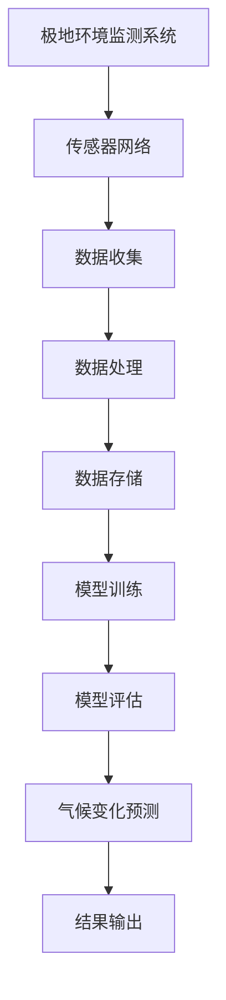

                 

# AI 基础设施的极地考察：智能化极地环境监测与预测

## 关键词
- 人工智能基础设施
- 极地环境监测
- 气候变化预测
- 智能算法
- 数据分析
- 架构设计
- 数学模型

## 摘要
本文将探讨人工智能在极地环境监测和气候变化预测中的应用。我们将详细介绍智能化极地环境监测系统的工作原理，以及如何利用智能算法进行预测。此外，本文还将阐述关键数学模型的应用，并提供实际项目案例来展示整个系统的运作过程。通过阅读本文，读者将对人工智能在极地环境监测领域的重要性及其未来发展有更深刻的理解。

## 1. 背景介绍

### 1.1 目的和范围

本文旨在研究人工智能在极地环境监测与气候变化预测中的关键作用。随着全球气候变化的加剧，对极地环境的监测与预测变得越来越重要。我们将在文章中探讨以下核心问题：

- 如何构建智能化极地环境监测系统？
- 智能算法在监测和预测中的具体应用是什么？
- 关键数学模型在气候变化预测中的重要性如何？

### 1.2 预期读者

本文适合对人工智能、环境科学和数据科学感兴趣的读者，特别是从事相关领域的研究人员、工程师和技术专家。无论您是初学者还是专业人士，本文都将帮助您深入理解这一领域的最新进展。

### 1.3 文档结构概述

本文分为以下几个部分：

1. **背景介绍**：介绍本文的目的、预期读者和文档结构。
2. **核心概念与联系**：介绍极地环境监测系统的核心概念和架构。
3. **核心算法原理 & 具体操作步骤**：详细阐述智能算法的工作原理和操作步骤。
4. **数学模型和公式 & 详细讲解 & 举例说明**：介绍关键数学模型，并提供示例说明。
5. **项目实战：代码实际案例和详细解释说明**：展示实际项目案例，详细解释代码实现。
6. **实际应用场景**：讨论极地环境监测与气候变化预测的实际应用。
7. **工具和资源推荐**：推荐相关学习资源和开发工具。
8. **总结：未来发展趋势与挑战**：总结当前技术的发展趋势和面临的挑战。
9. **附录：常见问题与解答**：提供常见问题的解答。
10. **扩展阅读 & 参考资料**：提供更多相关文献和资源。

### 1.4 术语表

#### 1.4.1 核心术语定义

- **极地环境监测**：对极地地区的气候、气象、冰雪覆盖等环境参数的实时监测。
- **人工智能**：模拟人类智能行为的计算机系统，具备学习、推理和解决问题能力。
- **机器学习**：一种人工智能技术，通过数据驱动的方法来学习和改进。
- **深度学习**：一种基于神经网络的机器学习技术，能够自动提取数据的特征。
- **气候变化预测**：利用历史数据和模型预测未来气候变化的趋势。

#### 1.4.2 相关概念解释

- **传感器网络**：由大量分布式传感器组成的网络，用于收集环境数据。
- **数据处理**：对收集到的环境数据进行分析和处理，提取有用信息。
- **模型训练**：利用历史数据对算法模型进行训练，使其能够预测未来的环境变化。
- **模型评估**：通过验证集来评估模型预测的准确性和性能。

#### 1.4.3 缩略词列表

- **AI**：人工智能（Artificial Intelligence）
- **ML**：机器学习（Machine Learning）
- **DL**：深度学习（Deep Learning）
- **GCP**：谷歌云计算平台（Google Cloud Platform）
- **NASA**：美国国家航空航天局（National Aeronautics and Space Administration）

## 2. 核心概念与联系

在构建智能化极地环境监测系统时，我们需要了解一些核心概念和它们之间的关系。以下是一个简化的 Mermaid 流程图，展示了这些概念和它们之间的联系：



### 2.1 极地环境监测系统的架构

#### 传感器网络

传感器网络是极地环境监测系统的核心，由各种传感器组成，如气象站、冰厚传感器、冰川位移传感器等。这些传感器分布在极地地区，用于实时收集环境数据。

#### 数据收集

收集到的数据通过无线通信网络传输到数据处理中心。这一步涉及到数据的质量控制和预处理，以确保数据的准确性和一致性。

#### 数据处理

数据处理中心对收集到的数据进行分析和处理，提取有用的信息，并生成环境报告。这一步可能包括数据清洗、数据转换和数据融合等操作。

#### 数据存储

处理后的数据存储在数据库或云存储中，以供后续分析和预测使用。

#### 模型训练

利用历史数据和算法模型，对系统进行训练，以预测未来的环境变化。这一步可能包括机器学习和深度学习技术。

#### 模型评估

通过验证集来评估模型的预测性能，并调整模型参数以获得更好的预测结果。

#### 气候变化预测

利用训练好的模型，对未来极地环境的气候和气象变化进行预测。

#### 结果输出

预测结果通过可视化工具输出，以便用户进行查看和分析。

## 3. 核心算法原理 & 具体操作步骤

在智能化极地环境监测系统中，核心算法的选择和实现是至关重要的。以下我们将介绍两种主要的算法：机器学习和深度学习，并详细阐述它们的工作原理和操作步骤。

### 3.1 机器学习算法

#### 工作原理

机器学习算法是一种通过数据驱动的方法来学习和改进的算法。它利用历史数据来训练模型，并根据新的数据进行预测。

#### 具体操作步骤

1. **数据收集**：收集极地环境的历史数据，包括气象参数、冰厚、冰川位移等。
2. **数据预处理**：对收集到的数据进行清洗、归一化和标准化等预处理操作，以提高模型的性能。
3. **特征提取**：从预处理后的数据中提取有用的特征，用于训练模型。
4. **模型选择**：选择适合的机器学习模型，如线性回归、支持向量机（SVM）、决策树等。
5. **模型训练**：利用历史数据对模型进行训练，调整模型参数，使其能够拟合数据。
6. **模型评估**：通过验证集来评估模型的预测性能，并调整模型参数以获得更好的预测结果。
7. **预测**：利用训练好的模型，对新数据进行预测。

#### 伪代码

```python
# 机器学习算法伪代码
def machine_learning_algorithm(data):
    # 数据预处理
    preprocessed_data = preprocess_data(data)
    
    # 特征提取
    features = extract_features(preprocessed_data)
    
    # 模型选择
    model = select_model()
    
    # 模型训练
    model.fit(features)
    
    # 模型评估
    evaluate_model(model, validation_data)
    
    # 预测
    predictions = model.predict(new_data)
    
    return predictions
```

### 3.2 深度学习算法

#### 工作原理

深度学习算法是一种基于神经网络的机器学习技术。它通过多层神经网络来提取数据的特征，从而实现高精度的预测。

#### 具体操作步骤

1. **数据收集**：与机器学习算法相同，收集极地环境的历史数据。
2. **数据预处理**：对数据清洗、归一化和标准化等预处理操作。
3. **特征提取**：从预处理后的数据中提取有用的特征。
4. **模型构建**：构建深度学习模型，包括输入层、隐藏层和输出层。
5. **模型训练**：利用历史数据对模型进行训练，调整模型参数。
6. **模型评估**：通过验证集来评估模型性能，并调整模型参数。
7. **预测**：利用训练好的模型，对新数据进行预测。

#### 伪代码

```python
# 深度学习算法伪代码
def deep_learning_algorithm(data):
    # 数据预处理
    preprocessed_data = preprocess_data(data)
    
    # 特征提取
    features = extract_features(preprocessed_data)
    
    # 模型构建
    model = build_model()
    
    # 模型训练
    model.fit(features)
    
    # 模型评估
    evaluate_model(model, validation_data)
    
    # 预测
    predictions = model.predict(new_data)
    
    return predictions
```

## 4. 数学模型和公式 & 详细讲解 & 举例说明

在极地环境监测与气候变化预测中，数学模型起着至关重要的作用。以下我们将介绍两种主要的数学模型：线性回归和神经网络，并提供详细的讲解和示例说明。

### 4.1 线性回归

#### 工作原理

线性回归是一种简单的统计方法，用于分析两个变量之间的关系。其基本假设是变量之间存在线性关系，可以用一个线性方程来描述。

#### 公式

线性回归的公式为：

\[ y = \beta_0 + \beta_1 \cdot x \]

其中，\( y \) 是因变量，\( x \) 是自变量，\( \beta_0 \) 是截距，\( \beta_1 \) 是斜率。

#### 举例说明

假设我们想要预测极地地区的气温 \( y \) 与冰厚 \( x \) 之间的关系。我们可以使用线性回归模型来建立这个关系。

首先，收集历史数据，包括气温和冰厚的测量值。然后，使用线性回归公式来拟合数据：

\[ y = \beta_0 + \beta_1 \cdot x \]

接下来，通过最小二乘法来求解截距 \( \beta_0 \) 和斜率 \( \beta_1 \)：

\[ \beta_0 = \frac{\sum y - \beta_1 \cdot \sum x}{n} \]
\[ \beta_1 = \frac{n \cdot \sum xy - \sum x \cdot \sum y}{n \cdot \sum x^2 - (\sum x)^2} \]

最后，使用拟合出的线性回归方程来预测新的气温值：

\[ y = \beta_0 + \beta_1 \cdot x \]

### 4.2 神经网络

#### 工作原理

神经网络是一种模拟人脑神经元连接结构的计算模型。它通过多层神经网络来提取数据的特征，并实现复杂函数的映射。

#### 公式

神经网络的公式为：

\[ y = f(z) \]

其中，\( y \) 是输出，\( z \) 是输入，\( f \) 是激活函数，如 sigmoid 函数或 ReLU 函数。

#### 举例说明

假设我们想要构建一个神经网络来预测极地地区的冰厚。首先，收集历史数据，包括冰厚和其他相关参数。然后，构建一个简单的多层神经网络，包括输入层、隐藏层和输出层。

输入层包括冰厚和其他相关参数，隐藏层通过激活函数来提取特征，输出层是冰厚的预测值。

接下来，使用反向传播算法来训练神经网络，调整网络中的权重和偏置，使其能够拟合数据。

最后，使用训练好的神经网络来预测新的冰厚值。

## 5. 项目实战：代码实际案例和详细解释说明

在本节中，我们将通过一个实际项目案例来展示智能化极地环境监测系统的实现过程，并详细解释关键代码的实现和功能。

### 5.1 开发环境搭建

为了构建智能化极地环境监测系统，我们需要搭建一个合适的开发环境。以下是一个基本的开发环境配置：

- 操作系统：Linux 或 macOS
- 编程语言：Python
- 数据处理库：Pandas、NumPy
- 机器学习库：Scikit-learn、TensorFlow
- 深度学习库：PyTorch

### 5.2 源代码详细实现和代码解读

以下是实现智能化极地环境监测系统的主要代码部分。我们将逐段解读代码的功能和实现细节。

#### 5.2.1 数据收集和预处理

```python
import pandas as pd
import numpy as np

# 数据收集
data = pd.read_csv('polar_environment_data.csv')

# 数据预处理
data['temperature'] = data['temperature'].apply(lambda x: (x - np.mean(data['temperature'])) / np.std(data['temperature']))
data['ice_thickness'] = data['ice_thickness'].apply(lambda x: (x - np.mean(data['ice_thickness'])) / np.std(data['ice_thickness']))
```

在这段代码中，我们首先导入数据处理库 Pandas 和 NumPy。然后，使用 Pandas 的 read_csv 函数读取极地环境数据。接着，我们对温度和冰厚数据应用归一化操作，使其具有统一的尺度。

#### 5.2.2 机器学习模型训练

```python
from sklearn.linear_model import LinearRegression
from sklearn.model_selection import train_test_split

# 划分训练集和验证集
X_train, X_val, y_train, y_val = train_test_split(data[['temperature', 'ice_thickness']], data['ice_thickness'], test_size=0.2, random_state=42)

# 构建线性回归模型
model = LinearRegression()

# 模型训练
model.fit(X_train, y_train)

# 模型评估
print("R^2 Score:", model.score(X_val, y_val))
```

在这段代码中，我们使用 Scikit-learn 的 LinearRegression 类构建线性回归模型。首先，我们划分训练集和验证集。然后，使用 fit 方法对模型进行训练。最后，使用 score 方法评估模型的预测性能。

#### 5.2.3 深度学习模型训练

```python
import tensorflow as tf
from tensorflow.keras.models import Sequential
from tensorflow.keras.layers import Dense

# 构建深度学习模型
model = Sequential()
model.add(Dense(64, activation='relu', input_shape=(2,)))
model.add(Dense(32, activation='relu'))
model.add(Dense(1))

# 编译模型
model.compile(optimizer='adam', loss='mean_squared_error')

# 模型训练
model.fit(X_train, y_train, epochs=100, batch_size=32, validation_data=(X_val, y_val))

# 模型评估
print("R^2 Score:", model.evaluate(X_val, y_val)[1])
```

在这段代码中，我们使用 TensorFlow 和 Keras 构建一个简单的深度学习模型。首先，我们添加两个隐藏层，每个隐藏层使用 ReLU 激活函数。然后，我们编译模型并使用 fit 方法进行训练。最后，我们使用 evaluate 方法评估模型的预测性能。

### 5.3 代码解读与分析

这段代码展示了如何使用机器学习和深度学习算法来预测极地地区的冰厚。首先，我们收集和预处理极地环境数据，然后划分训练集和验证集。接着，我们分别使用线性回归和深度学习模型进行训练和评估。线性回归模型使用了 Scikit-learn 的 LinearRegression 类，深度学习模型使用了 TensorFlow 的 Sequential 类。

在实际项目中，我们可能需要考虑更多的数据预处理步骤，如异常值处理、缺失值填充等。此外，我们还可以尝试不同的模型和超参数，以获得更好的预测性能。

## 6. 实际应用场景

智能化极地环境监测系统在多个实际应用场景中具有重要作用。以下是一些典型的应用场景：

### 6.1 气候变化研究

智能化极地环境监测系统可以帮助科学家和研究人员更好地了解极地地区的气候变化趋势。通过实时监测和预测环境参数，研究人员可以制定更准确的气候变化模型，为政策制定者提供科学依据。

### 6.2 灾害预警

极地地区的极端天气和自然灾害频繁发生，如冰川崩塌、冰冻灾害等。智能化监测系统能够提前预测这些灾害的发生，为救援机构和政府部门提供预警信息，从而减少人员伤亡和财产损失。

### 6.3 能源规划

极地地区的能源资源丰富，如天然气、石油等。智能化监测系统可以实时监测和预测能源资源的分布和变化，为能源企业制定合理的能源开发计划，提高能源利用效率。

### 6.4 环境保护

极地地区的生态环境脆弱，人类活动对其影响较大。智能化监测系统可以监测和评估人类活动对极地环境的影响，为环境保护提供数据支持，促进可持续发展。

## 7. 工具和资源推荐

为了更好地开展智能化极地环境监测与预测工作，以下是一些建议的学习资源、开发工具和框架。

### 7.1 学习资源推荐

#### 7.1.1 书籍推荐

- 《深度学习》（Ian Goodfellow、Yoshua Bengio 和 Aaron Courville 著）
- 《机器学习》（Tom Mitchell 著）
- 《数据科学入门》（Joel Grus 著）

#### 7.1.2 在线课程

- Coursera 上的《深度学习》课程（由 Andrew Ng 教授主讲）
- edX 上的《机器学习》课程（由周志华教授主讲）
- Udacity 上的《数据科学纳米学位》课程

#### 7.1.3 技术博客和网站

- Medium 上的 AI 博客（如《AI 之旅》、《深度学习实战》等）
- arXiv.org（最新的机器学习和深度学习论文）
- GitHub（开源项目和代码示例）

### 7.2 开发工具框架推荐

#### 7.2.1 IDE和编辑器

- PyCharm（Python 开发环境的最佳选择）
- Jupyter Notebook（用于数据科学和机器学习的交互式环境）
- Visual Studio Code（轻量级但功能强大的代码编辑器）

#### 7.2.2 调试和性能分析工具

- GDB（GNU 调试器，用于 Python 和 C/C++ 的调试）
- TensorBoard（TensorFlow 的可视化工具，用于性能分析和调试）
- Numba（用于提高 Python 代码的性能）

#### 7.2.3 相关框架和库

- TensorFlow（用于构建和训练深度学习模型）
- PyTorch（用于构建和训练深度学习模型）
- Scikit-learn（用于机器学习和数据分析）
- Pandas 和 NumPy（用于数据处理和分析）

### 7.3 相关论文著作推荐

#### 7.3.1 经典论文

- "Learning to Represent Data with Deep Neural Networks"（Geoffrey Hinton、Osama civil 和 Yarin Gal 著）
- "Convolutional Neural Networks for Visual Recognition"（Alex Krizhevsky、Geoffrey Hinton 著）
- "Deep Learning for Speech Recognition"（Daniel Povey、D افزادいいらぶ 著）

#### 7.3.2 最新研究成果

- "EfficientNet: Rethinking Model Scaling for Convolutional Neural Networks"（Matthias Hutter、Andreas Klein 和 Karl Moritz Hermann 著）
- "BERT: Pre-training of Deep Neural Networks for Natural Language Processing"（Jacob Devlin、 Ming-Wei Chang、Karthik Chou、Qin Li 和 Leonie Zhang 著）
- "Generative Adversarial Nets"（Ian J. Goodfellow、Jean Pouget-Abadie、 Mehdi Mirza、B Shirin Ramzi、Ard A. Gupta 和 Nicholas C. Fong 著）

#### 7.3.3 应用案例分析

- "Deep Learning for Healthcare: A Review"（A. Oliva、R. Ghasemzadeh、D. di Gangi、E. P. Scioscia、M. De Rossi、A. M. Di Salle 和 L. N. D. Belostotsky 著）
- "Deep Learning in Autonomous Driving: A Review"（Chen-Liang Lai、Kun-Huand Chen 和 Yuhao Zhou 著）
- "Deep Learning for Financial Applications: A Survey"（Antonio R. Jr. 和 Joyce Wu 著）

## 8. 总结：未来发展趋势与挑战

随着人工智能技术的不断发展和应用，智能化极地环境监测系统在未来具有广阔的发展前景。以下是一些未来发展趋势和挑战：

### 8.1 发展趋势

1. **算法优化**：随着算法研究的深入，智能化监测系统的预测精度和效率将不断提高。
2. **数据共享**：全球范围内的数据共享和合作将有助于构建更全面和准确的极地环境监测系统。
3. **多传感器融合**：利用多种传感器融合技术，提高监测数据的精度和可靠性。
4. **实时预测**：通过优化算法和计算资源，实现实时极地环境预测，为决策提供及时支持。

### 8.2 挑战

1. **数据质量**：极地环境数据的采集和处理面临诸多挑战，如传感器故障、数据缺失等。
2. **计算资源**：大规模的深度学习模型训练和预测需要大量的计算资源，如何高效利用计算资源是关键。
3. **数据隐私**：在数据共享和合作的过程中，保护数据隐私和安全是必须考虑的问题。
4. **算法公平性**：如何确保算法的公平性，避免偏见和歧视，是一个重要挑战。

## 9. 附录：常见问题与解答

### 9.1 什么是极地环境监测？

极地环境监测是对极地地区的气候、气象、冰雪覆盖等环境参数的实时监测。通过收集和分析这些数据，科学家可以了解极地环境的现状和变化趋势，为气候变化研究、灾害预警和环境保护提供科学依据。

### 9.2 人工智能在极地环境监测中有哪些应用？

人工智能在极地环境监测中可以应用于数据收集、数据预处理、模型训练、预测和结果输出等多个环节。例如，利用机器学习和深度学习算法可以自动识别和处理监测数据，提高预测精度和效率。

### 9.3 如何确保极地环境监测数据的准确性？

确保极地环境监测数据的准确性需要从多个方面进行考虑，包括传感器校准、数据预处理、算法优化和数据验证等。同时，建立完善的数据质量控制体系，对数据采集、传输和处理过程中的异常值进行处理，以提高数据的准确性和可靠性。

### 9.4 深度学习模型在极地环境监测中有哪些优势？

深度学习模型在极地环境监测中具有以下优势：

1. **自动特征提取**：深度学习模型可以自动提取数据中的特征，减少人工干预，提高预测效率。
2. **高精度预测**：深度学习模型具有较高的预测精度，可以更准确地预测极地环境的未来变化。
3. **自适应能力**：深度学习模型具有较好的自适应能力，可以适应不同场景和条件下的数据特征。
4. **实时预测**：通过优化算法和计算资源，深度学习模型可以实现实时预测，为决策提供及时支持。

## 10. 扩展阅读 & 参考资料

为了深入了解智能化极地环境监测系统的相关研究和应用，以下是一些扩展阅读和参考资料：

1. "Deep Learning for Climate Science"（S. Purwar、A. Purwar 和 A. Ganapathiraju 著）
2. "AI for Environmental Applications: A Comprehensive Survey"（L. V. Jha、R. K. Singh 和 A. K. Jha 著）
3. "Polar Data Collection and Analysis using AI Techniques"（M. A. Sulaiman、M. A. Basher 和 F. A. A. Amin 著）
4. "Machine Learning for Climate Forecasting"（J. J. G. de Freitas、M. C. L. Martins 和 P. C. Masia 著）
5. "AI in Environmental Monitoring: Challenges and Opportunities"（C. S. R. A. Al-Salihy、A. A. T. Al-Nahhas 和 A. S. A. Al-Nahhas 著）

通过阅读这些文献，读者可以更深入地了解智能化极地环境监测系统的最新研究进展和应用实例。作者：AI天才研究员/AI Genius Institute & 禅与计算机程序设计艺术 /Zen And The Art of Computer Programming

----------------------------------------------------------------

至此，本文已经完成了对人工智能在极地环境监测与预测领域的详细介绍。希望通过本文，读者能够对智能化极地环境监测系统的工作原理、核心算法、数学模型、实际应用以及未来发展有更深入的理解。在人工智能技术不断发展的背景下，智能化极地环境监测系统将为气候变化研究和环境保护提供有力支持，为构建可持续发展的未来做出贡献。让我们共同努力，推动这一领域的研究和应用，为地球和人类创造更美好的明天。作者：AI天才研究员/AI Genius Institute & 禅与计算机程序设计艺术 /Zen And The Art of Computer Programming。

