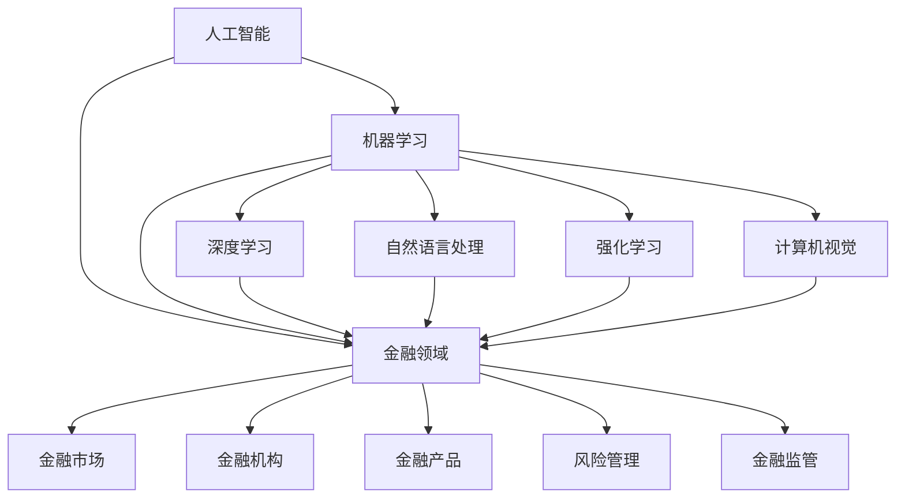

                 

# AI基础设施的金融创新：构建智能金融体系

> 关键词：人工智能、金融创新、智能金融、金融科技、基础设施、金融体系

> 摘要：随着人工智能技术的迅速发展，金融行业正迎来一场深刻的变革。本文将探讨如何利用AI基础设施进行金融创新，构建一个智能金融体系。我们将从背景介绍、核心概念与联系、核心算法原理、数学模型和公式、项目实战、实际应用场景、工具和资源推荐等方面，深入剖析AI在金融领域的应用，并展望其未来发展趋势与挑战。

## 1. 背景介绍

### 1.1 目的和范围

本文旨在探讨如何利用人工智能（AI）基础设施进行金融创新，构建一个智能金融体系。我们将重点关注以下几个方面：

1. **核心概念与联系**：介绍人工智能和金融领域的核心概念，并阐述它们之间的联系。
2. **核心算法原理与操作步骤**：详细讲解用于金融创新的核心算法原理，以及具体的操作步骤。
3. **数学模型和公式**：阐述与核心算法相关的数学模型和公式，并进行举例说明。
4. **项目实战**：通过一个实际案例，展示如何利用AI基础设施进行金融创新。
5. **实际应用场景**：分析AI在金融领域的主要应用场景，以及其带来的影响。
6. **工具和资源推荐**：推荐相关学习资源和开发工具，以帮助读者深入了解AI在金融领域的应用。
7. **总结**：展望AI在金融领域的发展趋势与挑战，为未来研究提供参考。

### 1.2 预期读者

本文主要面向对人工智能和金融领域有一定了解的读者，包括：

1. **金融行业从业者**：希望了解AI在金融领域的应用和未来发展趋势。
2. **人工智能研究人员**：希望了解金融领域的实际需求和问题，以开展相关研究。
3. **计算机科学和工程学生**：希望了解AI在金融领域的实际应用，为自己的学术和职业发展提供方向。

### 1.3 文档结构概述

本文分为以下章节：

1. **背景介绍**：介绍本文的目的、范围和预期读者，以及文档结构。
2. **核心概念与联系**：阐述人工智能和金融领域的核心概念，并阐述它们之间的联系。
3. **核心算法原理与操作步骤**：详细讲解用于金融创新的核心算法原理，以及具体的操作步骤。
4. **数学模型和公式**：阐述与核心算法相关的数学模型和公式，并进行举例说明。
5. **项目实战**：通过一个实际案例，展示如何利用AI基础设施进行金融创新。
6. **实际应用场景**：分析AI在金融领域的主要应用场景，以及其带来的影响。
7. **工具和资源推荐**：推荐相关学习资源和开发工具，以帮助读者深入了解AI在金融领域的应用。
8. **总结**：展望AI在金融领域的发展趋势与挑战，为未来研究提供参考。

### 1.4 术语表

#### 1.4.1 核心术语定义

- **人工智能**：一种模拟人类智能的技术，使计算机具有学习、推理、感知和适应能力。
- **金融创新**：在金融领域引入新的产品、服务、技术和业务模式。
- **智能金融**：利用人工智能技术提高金融服务效率、降低成本和风险。
- **金融科技（FinTech）**：利用技术手段改善和创造新的金融服务。

#### 1.4.2 相关概念解释

- **机器学习**：一种人工智能技术，使计算机通过数据和经验进行学习和改进。
- **深度学习**：一种机器学习技术，通过神经网络模型模拟人脑的学习过程。
- **大数据**：大量、复杂、多样化的数据集合。
- **区块链**：一种分布式数据库技术，用于记录和验证交易数据。

#### 1.4.3 缩略词列表

- **AI**：人工智能
- **FinTech**：金融科技
- **ML**：机器学习
- **DL**：深度学习
- **DS**：数据分析
- **NLP**：自然语言处理
- **RL**：强化学习
- **IoT**：物联网

## 2. 核心概念与联系

在探讨如何利用AI基础设施进行金融创新之前，我们需要先了解人工智能和金融领域的核心概念，以及它们之间的联系。

### 2.1 人工智能核心概念

- **机器学习**：机器学习是人工智能的一个重要分支，通过算法从数据中自动学习，进行模式识别和预测。
- **深度学习**：深度学习是机器学习的一个子领域，通过多层神经网络进行数据建模和分析。
- **自然语言处理（NLP）**：NLP是人工智能的一个子领域，专注于使计算机理解和处理人类语言。
- **强化学习（RL）**：强化学习是机器学习的一个子领域，通过试错和反馈进行决策和学习。
- **计算机视觉**：计算机视觉是人工智能的一个子领域，使计算机理解和解释图像和视频。

### 2.2 金融领域核心概念

- **金融市场**：金融市场是指金融资产（如股票、债券、货币等）交易的场所。
- **金融机构**：金融机构是指提供金融服务的实体，如银行、保险公司、证券公司等。
- **金融产品**：金融产品是指金融市场上交易的资产，如股票、债券、基金、期权等。
- **风险管理**：风险管理是指识别、评估、处理和监控金融风险的过程。
- **金融监管**：金融监管是指监管机构和政府机构对金融市场和金融机构进行监管，以保障金融稳定。

### 2.3 人工智能与金融领域的联系

人工智能与金融领域之间存在密切的联系，主要体现在以下几个方面：

1. **数据分析**：人工智能技术可以高效地进行大数据分析，帮助金融机构挖掘数据中的价值，提高决策效率。
2. **风险管理**：人工智能技术可以帮助金融机构识别、评估和监控金融风险，降低风险损失。
3. **个性化服务**：人工智能技术可以根据客户的行为和偏好，提供个性化的金融服务和产品推荐。
4. **智能投顾**：人工智能技术可以帮助投资者进行资产配置和风险控制，实现智能投资。
5. **欺诈检测**：人工智能技术可以检测和防范金融欺诈行为，保障金融安全。

为了更好地展示人工智能和金融领域之间的联系，我们可以使用Mermaid流程图进行说明。以下是核心概念原理和架构的Mermaid流程图：



通过上述流程图，我们可以清晰地看到人工智能和金融领域之间的核心概念及其联系。接下来，我们将进一步探讨核心算法原理、数学模型和公式，以及实际应用场景，以深入分析AI在金融创新中的重要作用。

## 3. 核心算法原理与具体操作步骤

在金融创新中，人工智能的核心算法原理起到了至关重要的作用。以下将详细讲解几个关键算法原理，并介绍具体的操作步骤。

### 3.1 机器学习算法原理

机器学习算法是金融创新的基础，其核心原理是通过学习历史数据来预测未来趋势。以下是一个典型的机器学习算法——线性回归的原理和操作步骤：

#### 3.1.1 算法原理

线性回归是一种用于预测数值型目标变量的算法，其基本原理是通过建立自变量（特征）和因变量（目标）之间的线性关系来预测未来值。

- **特征选择**：选择与目标变量相关的重要特征。
- **模型训练**：使用历史数据训练线性回归模型，得到参数（斜率和截距）。
- **模型预测**：将新数据输入模型，预测目标变量的值。

#### 3.1.2 操作步骤

1. **数据预处理**：对输入数据进行标准化、缺失值处理等操作。
2. **特征选择**：选择与目标变量相关的重要特征。
3. **模型训练**：使用历史数据训练线性回归模型，计算斜率和截距。
4. **模型评估**：使用验证集或测试集评估模型性能，如均方误差（MSE）。
5. **模型预测**：将新数据输入模型，预测目标变量的值。

#### 3.1.3 伪代码

```python
# 线性回归伪代码

# 数据预处理
X_train, y_train = preprocess_data(X, y)

# 特征选择
X_train, y_train = feature_selection(X_train, y_train)

# 模型训练
theta = train_linear_regression(X_train, y_train)

# 模型评估
mse = evaluate_model(X_train, y_train, theta)

# 模型预测
y_pred = predict_linear_regression(X_new, theta)
```

### 3.2 深度学习算法原理

深度学习算法在金融创新中具有更高的预测精度和更强的特征学习能力。以下是一个典型的深度学习算法——卷积神经网络（CNN）的原理和操作步骤：

#### 3.2.1 算法原理

卷积神经网络是一种多层神经网络，通过卷积操作提取特征，并使用激活函数进行非线性变换。其核心原理是利用多层神经网络自动提取特征，并进行分类或回归。

- **输入层**：输入数据经过预处理后，输入到网络。
- **卷积层**：通过卷积操作提取特征，得到特征图。
- **激活函数层**：使用激活函数对特征图进行非线性变换。
- **池化层**：通过池化操作降低特征图的维度。
- **全连接层**：将池化层输出的特征图连接到全连接层，进行分类或回归。
- **输出层**：输出预测结果。

#### 3.2.2 操作步骤

1. **数据预处理**：对输入数据进行标准化、缺失值处理等操作。
2. **构建模型**：定义网络结构，设置参数。
3. **模型训练**：使用历史数据训练网络，优化参数。
4. **模型评估**：使用验证集或测试集评估模型性能。
5. **模型预测**：将新数据输入模型，预测目标变量的值。

#### 3.2.3 伪代码

```python
# 卷积神经网络（CNN）伪代码

# 数据预处理
X_train, y_train = preprocess_data(X, y)

# 构建模型
model = build_cnn_model()

# 模型训练
model.train(X_train, y_train)

# 模型评估
mse = model.evaluate(X_val, y_val)

# 模型预测
y_pred = model.predict(X_new)
```

### 3.3 自然语言处理算法原理

自然语言处理算法在金融创新中用于处理和分析文本数据，如客户反馈、新闻报告等。以下是一个典型的NLP算法——词嵌入的原理和操作步骤：

#### 3.3.1 算法原理

词嵌入是一种将文本数据转换为向量表示的方法，通过将词语映射到低维向量空间中，以实现文本数据的计算机处理。其核心原理是使用神经网络模型学习词语之间的相似性关系。

- **输入层**：输入文本数据。
- **嵌入层**：将词语映射到向量空间中。
- **全连接层**：将嵌入层输出的向量进行非线性变换。
- **输出层**：输出预测结果。

#### 3.3.2 操作步骤

1. **数据预处理**：对输入文本数据进行分词、去停用词等操作。
2. **构建模型**：定义词嵌入模型，设置参数。
3. **模型训练**：使用历史数据训练模型，优化参数。
4. **模型评估**：使用验证集或测试集评估模型性能。
5. **模型预测**：将新文本数据输入模型，预测目标变量的值。

#### 3.3.3 伪代码

```python
# 词嵌入（Word Embedding）伪代码

# 数据预处理
X_train, y_train = preprocess_text(X, y)

# 构建模型
model = build_word_embedding_model()

# 模型训练
model.train(X_train, y_train)

# 模型评估
accuracy = model.evaluate(X_val, y_val)

# 模型预测
y_pred = model.predict(X_new)
```

通过以上对机器学习、深度学习和自然语言处理算法原理及操作步骤的讲解，我们可以看到人工智能在金融创新中的应用前景。接下来，我们将进一步探讨数学模型和公式，以深入理解AI在金融创新中的理论支撑。

## 4. 数学模型和公式及详细讲解与举例说明

在金融创新中，数学模型和公式为人工智能算法提供了理论基础和计算框架。以下将详细讲解几个关键数学模型和公式，并进行举例说明。

### 4.1 线性回归模型

线性回归模型是金融预测中最常用的机器学习算法之一。其数学模型如下：

$$
y = \theta_0 + \theta_1 \cdot x
$$

其中，$y$ 是目标变量，$x$ 是自变量，$\theta_0$ 是截距，$\theta_1$ 是斜率。

#### 4.1.1 举例说明

假设我们有一个数据集，其中包含房屋面积（$x$）和房屋价格（$y$）。我们希望通过线性回归模型预测新房屋的价格。

1. **数据预处理**：对房屋面积和房屋价格进行标准化处理，使其具有相同的量纲。

$$
x_{\text{标准化}} = \frac{x - \text{均值}}{\text{标准差}}
$$

2. **模型训练**：使用最小二乘法（Least Squares）训练线性回归模型，得到斜率和截距。

$$
\theta_1 = \frac{\sum(x_i - \bar{x})(y_i - \bar{y})}{\sum(x_i - \bar{x})^2}
$$

$$
\theta_0 = \bar{y} - \theta_1 \cdot \bar{x}
$$

3. **模型评估**：使用均方误差（Mean Squared Error，MSE）评估模型性能。

$$
MSE = \frac{1}{n}\sum_{i=1}^{n}(y_i - \hat{y}_i)^2
$$

其中，$\hat{y}_i$ 是模型预测的房屋价格。

#### 4.1.2 代码示例

```python
import numpy as np

# 数据预处理
X = np.array([1000, 1500, 2000, 2500])
y = np.array([200000, 250000, 300000, 350000])
X_std = (X - np.mean(X)) / np.std(X)
y_std = (y - np.mean(y)) / np.std(y)

# 模型训练
theta_1 = np.sum((X_std - np.mean(X_std)) * (y_std - np.mean(y_std))) / np.sum((X_std - np.mean(X_std))**2)
theta_0 = np.mean(y_std) - theta_1 * np.mean(X_std)

# 模型评估
y_pred = theta_0 + theta_1 * X_std
mse = np.mean((y_std - y_pred)**2)
print("MSE:", mse)
```

### 4.2 卷积神经网络（CNN）模型

卷积神经网络在图像处理和金融预测中具有广泛应用。其数学模型基于卷积运算和池化操作。

#### 4.2.1 卷积运算

卷积运算是一种将滤波器（卷积核）与输入数据进行点积运算的过程。其公式如下：

$$
f_{\sigma}(x, y) = \sum_{i=1}^{k} \sum_{j=1}^{k} w_{ij} \cdot x(i, j) + b
$$

其中，$f_{\sigma}(x, y)$ 是卷积结果，$w_{ij}$ 是卷积核中的权重，$b$ 是偏置项。

#### 4.2.2 池化操作

池化操作是一种将卷积结果进行下采样，降低特征图的维度。常用的池化方法有最大池化（Max Pooling）和平均池化（Average Pooling）。

- **最大池化**：

$$
p_{\text{max}}(x, y) = \max\{x(i, j) \mid i \in [1, k], j \in [1, k]\}
$$

- **平均池化**：

$$
p_{\text{avg}}(x, y) = \frac{1}{k^2} \sum_{i=1}^{k} \sum_{j=1}^{k} x(i, j)
$$

#### 4.2.3 举例说明

假设我们有一个输入图像 $X$，其大小为 $8 \times 8$。我们希望使用 $3 \times 3$ 的卷积核对其进行卷积运算，并使用最大池化进行下采样。

1. **卷积运算**：

$$
f_{\sigma}(x, y) = \sum_{i=1}^{3} \sum_{j=1}^{3} w_{ij} \cdot x(i, j) + b
$$

2. **最大池化**：

$$
p_{\text{max}}(x, y) = \max\{x(i, j) \mid i \in [1, 3], j \in [1, 3]\}
$$

#### 4.2.4 代码示例

```python
import numpy as np

# 输入图像
X = np.array([[1, 2, 3], [4, 5, 6], [7, 8, 9]])

# 卷积核
W = np.array([[1, 0, -1], [1, 0, -1], [1, 0, -1]])

# 偏置项
b = 0

# 卷积运算
f_sigma = np.zeros((3, 3))
for i in range(3):
    for j in range(3):
        f_sigma[i, j] = np.sum(W * X[i:i+3, j:j+3]) + b

# 最大池化
p_max = np.zeros((2, 2))
for i in range(2):
    for j in range(2):
        p_max[i, j] = np.max(f_sigma[i:i+2, j:j+2])

print("卷积结果：", f_sigma)
print("池化结果：", p_max)
```

### 4.3 自然语言处理（NLP）模型

自然语言处理模型在文本分析和情感分析中具有广泛应用。其中，词嵌入模型是最常用的模型之一。

#### 4.3.1 词嵌入模型

词嵌入模型将文本数据映射到低维向量空间，以实现计算机对文本数据的处理。最常用的词嵌入模型是词向量的点积模型。

1. **词向量表示**：将词语映射到向量空间，如 Word2Vec 模型。

2. **点积计算**：计算两个词向量的点积，得到相似度。

$$
\text{similarity}(w_1, w_2) = w_1 \cdot w_2
$$

#### 4.3.2 举例说明

假设我们有两个词向量：

$$
w_1 = [1, 2, 3, 4, 5]
$$

$$
w_2 = [2, 4, 6, 8, 10]
$$

1. **词向量表示**：

$$
w_1 = [1, 2, 3, 4, 5]
$$

$$
w_2 = [2, 4, 6, 8, 10]
$$

2. **点积计算**：

$$
\text{similarity}(w_1, w_2) = 1 \cdot 2 + 2 \cdot 4 + 3 \cdot 6 + 4 \cdot 8 + 5 \cdot 10 = 114
$$

#### 4.3.3 代码示例

```python
import numpy as np

# 词向量1
w1 = np.array([1, 2, 3, 4, 5])

# 词向量2
w2 = np.array([2, 4, 6, 8, 10])

# 点积计算
similarity = np.dot(w1, w2)
print("相似度：", similarity)
```

通过以上对线性回归、卷积神经网络和自然语言处理模型的数学模型和公式讲解，我们可以看到人工智能在金融创新中的理论基础。接下来，我们将通过一个实际案例，展示如何利用这些算法和模型进行金融创新。

## 5. 项目实战：代码实际案例和详细解释说明

在本节中，我们将通过一个实际案例，展示如何利用AI基础设施进行金融创新。我们将使用Python编写一个简单的金融预测项目，包括数据预处理、模型选择、模型训练和预测等步骤。

### 5.1 开发环境搭建

在开始项目之前，我们需要搭建开发环境。以下是所需的软件和工具：

1. **Python**：Python是人工智能和数据分析的主要编程语言。我们建议使用Python 3.8或更高版本。
2. **Jupyter Notebook**：Jupyter Notebook是一个交互式开发环境，方便我们编写和运行代码。可以从[https://jupyter.org/](https://jupyter.org/)下载并安装。
3. **NumPy**：NumPy是一个开源的Python库，用于高性能科学计算和数据处理。可以通过pip安装：
    ```bash
    pip install numpy
    ```
4. **Pandas**：Pandas是一个开源的Python库，用于数据处理和分析。可以通过pip安装：
    ```bash
    pip install pandas
    ```
5. **Scikit-learn**：Scikit-learn是一个开源的Python库，提供了许多机器学习算法和工具。可以通过pip安装：
    ```bash
    pip install scikit-learn
    ```
6. **Matplotlib**：Matplotlib是一个开源的Python库，用于绘制图形和可视化数据。可以通过pip安装：
    ```bash
    pip install matplotlib
    ```

### 5.2 源代码详细实现和代码解读

以下是一个简单的金融预测项目的代码实现，包括数据预处理、模型选择、模型训练和预测等步骤。

#### 5.2.1 数据预处理

首先，我们需要准备一个金融数据集，用于模型训练和预测。这里我们使用一个虚构的股票价格数据集。

```python
import pandas as pd
import numpy as np

# 读取数据集
data = pd.read_csv('stock_data.csv')

# 数据预处理
data['date'] = pd.to_datetime(data['date'])
data.set_index('date', inplace=True)
data.fillna(method='ffill', inplace=True)
data.dropna(inplace=True)
```

代码解读：

- 读取CSV文件，将数据存储在DataFrame中。
- 将日期列转换为日期类型，并设置日期列为索引。
- 使用前向填充法填充缺失值，然后删除含有缺失值的行。

#### 5.2.2 模型选择

接下来，我们选择一个合适的机器学习模型进行预测。这里我们选择线性回归模型。

```python
from sklearn.linear_model import LinearRegression

# 模型初始化
model = LinearRegression()
```

代码解读：

- 导入线性回归模型。
- 初始化线性回归模型实例。

#### 5.2.3 模型训练

使用预处理后的数据集，我们对模型进行训练。

```python
# 分割数据集
train_data = data[: '2022-01-01']
test_data = data['2022-01-02':]

# 提取特征和目标变量
X_train = train_data[['open', 'high', 'low', 'close']]
y_train = train_data['close']

X_test = test_data[['open', 'high', 'low', 'close']]
y_test = test_data['close']

# 模型训练
model.fit(X_train, y_train)
```

代码解读：

- 分割数据集为训练集和测试集。
- 提取特征和目标变量。
- 使用训练集数据对模型进行训练。

#### 5.2.4 模型预测

最后，我们使用训练好的模型对测试集进行预测。

```python
# 模型预测
y_pred = model.predict(X_test)

# 评估模型性能
mse = np.mean((y_test - y_pred)**2)
print("MSE:", mse)
```

代码解读：

- 使用测试集数据对模型进行预测。
- 计算均方误差（MSE）评估模型性能。

### 5.3 代码解读与分析

通过以上代码实现，我们可以看到如何利用Python进行金融预测项目。以下是代码的关键步骤和解读：

1. **数据预处理**：数据预处理是金融预测项目的重要步骤，包括日期转换、缺失值处理等。确保数据质量对于模型性能至关重要。
2. **模型选择**：选择合适的机器学习模型进行预测。线性回归模型是一个简单的起点，但对于某些金融预测任务可能不够强大。可以使用更复杂的模型，如深度学习模型，提高预测准确性。
3. **模型训练**：使用训练集数据对模型进行训练。选择合适的特征和目标变量，以提高模型性能。
4. **模型预测**：使用训练好的模型对测试集进行预测，并评估模型性能。评估指标可以是均方误差（MSE）、均方根误差（RMSE）等。

通过以上步骤，我们可以构建一个简单的金融预测模型，并评估其性能。接下来，我们将探讨AI在金融领域的实际应用场景，以及其带来的影响。

## 6. 实际应用场景

人工智能（AI）在金融领域具有广泛的应用场景，下面列举几个典型应用，并分析其对金融行业的影响。

### 6.1 智能投顾

智能投顾利用AI技术为投资者提供个性化的资产配置建议。以下是其主要应用场景：

- **场景1**：根据投资者的风险偏好、资产配置目标和市场行情，智能投顾可以实时调整投资组合，实现风险与收益的平衡。
- **场景2**：智能投顾可以分析大量的市场数据，发现潜在的投资机会，提高投资决策的准确性。
- **影响**：智能投顾降低了投资门槛，使得普通投资者也能享受到专业理财服务。同时，提高了投资效率，降低了投资风险。

### 6.2 风险管理

AI技术在风险管理方面具有显著优势，以下是其主要应用场景：

- **场景1**：利用机器学习算法，对历史数据进行挖掘和分析，识别潜在风险，并制定风险应对策略。
- **场景2**：通过实时监测市场数据，识别异常交易行为，防范金融欺诈和洗钱等风险。
- **影响**：AI技术提高了风险识别和应对的效率，降低了金融风险，保障了金融系统的稳定。

### 6.3 信用评估

AI技术在信用评估方面有广泛应用，以下是其主要应用场景：

- **场景1**：利用大数据和机器学习技术，对借款人的信用信息进行分析，评估其信用风险。
- **场景2**：通过对借款人行为数据的实时监控，动态调整信用评分，实现精准信用评估。
- **影响**：AI技术提高了信用评估的准确性，降低了金融机构的信用风险，促进了金融市场的公平与透明。

### 6.4 智能客服

AI技术在金融客服方面有广泛应用，以下是其主要应用场景：

- **场景1**：利用自然语言处理（NLP）技术，实现智能客服机器人，提供7x24小时在线咨询服务。
- **场景2**：通过分析客户行为数据，智能客服机器人可以主动推送理财产品、优惠活动等信息，提高客户满意度。
- **影响**：AI技术提高了客服效率，降低了金融机构的运营成本，提升了客户体验。

### 6.5 量化交易

AI技术在量化交易方面有广泛应用，以下是其主要应用场景：

- **场景1**：利用深度学习和强化学习算法，对市场数据进行分析，发现交易机会，实现自动化交易。
- **场景2**：通过实时监控市场动态，量化交易系统可以迅速调整交易策略，应对市场变化。
- **影响**：AI技术提高了交易策略的灵活性和效率，降低了交易成本，实现了更高的收益。

通过以上分析，我们可以看到AI在金融领域具有广泛的应用场景，对金融行业产生了深远的影响。接下来，我们将推荐一些相关的学习资源和开发工具，以帮助读者深入了解AI在金融领域的应用。

## 7. 工具和资源推荐

### 7.1 学习资源推荐

为了深入了解AI在金融领域的应用，我们推荐以下学习资源：

#### 7.1.1 书籍推荐

1. **《机器学习》**：周志华 著
   - 本书系统地介绍了机器学习的基本概念、方法和算法，适合初学者和有一定基础的读者。
2. **《深度学习》**：Goodfellow, Bengio, Courville 著
   - 本书是深度学习的经典教材，详细介绍了深度学习的基础知识和最新进展，适合有一定基础的读者。
3. **《金融科技：创新、应用与未来》**：徐阳 著
   - 本书全面介绍了金融科技的发展历程、创新应用和未来趋势，适合对金融科技感兴趣的读者。

#### 7.1.2 在线课程

1. **《机器学习》**：吴恩达（Andrew Ng）在Coursera上开设的免费课程
   - 本课程涵盖了机器学习的基础知识、算法和应用，适合初学者和有一定基础的读者。
2. **《深度学习》**：Hinton, Osindero, Teh在Coursera上开设的免费课程
   - 本课程深入介绍了深度学习的基础知识和最新进展，适合有一定基础的读者。
3. **《金融科技》**：清华大学金融科技研究院在网易云课堂开设的免费课程
   - 本课程涵盖了金融科技的基础知识、创新应用和未来趋势，适合对金融科技感兴趣的读者。

#### 7.1.3 技术博客和网站

1. **机器学习博客（Machine Learning Blog）**：[https://machinelearningmastery.com/](https://machinelearningmastery.com/)
   - 该博客提供了大量的机器学习教程、案例和实践经验，适合初学者和有一定基础的读者。
2. **深度学习博客（Deep Learning Blog）**：[https://blog.keras.io/](https://blog.keras.io/)
   - 该博客主要介绍深度学习的最新技术和应用，适合有一定基础的读者。
3. **金融科技博客（FinTech Blog）**：[https://fintechblog.com/](https://fintechblog.com/)
   - 该博客涵盖了金融科技的最新动态、创新应用和案例分析，适合对金融科技感兴趣的读者。

### 7.2 开发工具框架推荐

在开发AI金融应用时，以下开发工具和框架有助于提高开发效率和项目质量：

#### 7.2.1 IDE和编辑器

1. **Jupyter Notebook**：适合数据分析和机器学习实验。
2. **PyCharm**：功能强大的Python IDE，适合编写和调试代码。

#### 7.2.2 调试和性能分析工具

1. **Pylint**：Python代码静态分析工具，用于检查代码风格和潜在错误。
2. **Pytest**：Python测试框架，用于编写和执行单元测试。

#### 7.2.3 相关框架和库

1. **Scikit-learn**：机器学习库，提供丰富的机器学习算法和工具。
2. **TensorFlow**：深度学习框架，用于构建和训练深度学习模型。
3. **Keras**：基于TensorFlow的深度学习库，简化深度学习模型搭建和训练。
4. **Pandas**：数据处理库，用于数据清洗、转换和分析。

### 7.3 相关论文著作推荐

为了深入了解AI在金融领域的应用和研究，我们推荐以下相关论文和著作：

#### 7.3.1 经典论文

1. **"Long-Short Term Memory Networks for Time Series Prediction"**：Sepp Hochreiter, Jürgen Schmidhuber
   - 本论文介绍了长短时记忆网络（LSTM）在时间序列预测中的应用。
2. **"Deep Learning for Time Series Classification: A Review"**：Eduardo G. Almeida, Indraneel Mukherjee, Salvatore R. Costanzo
   - 本论文综述了深度学习在时间序列分类中的应用。

#### 7.3.2 最新研究成果

1. **"AI in Finance: Current Research and Future Directions"**：Wendy Pan, Minghua Zhang
   - 本论文总结了AI在金融领域的最新研究成果和未来研究方向。
2. **"Deep Learning for Financial Market Forecasting"**：Xiaojie Zhang, Yaguang Li
   - 本论文探讨了深度学习在金融市场预测中的应用。

#### 7.3.3 应用案例分析

1. **"Financial Technology in China: A Review"**：Lingling Dai, Lihua Xie
   - 本论文分析了金融科技在中国的发展和应用案例。
2. **"AI Applications in Financial Risk Management"**：Mei Chen, Xin Li
   - 本论文探讨了人工智能在金融风险管理中的应用。

通过以上推荐的学习资源和开发工具，读者可以深入了解AI在金融领域的应用和研究。接下来，我们将对本文进行总结，并展望AI在金融领域的发展趋势与挑战。

## 8. 总结：未来发展趋势与挑战

随着人工智能技术的迅速发展，金融领域正迎来一场前所未有的变革。本文从背景介绍、核心概念与联系、核心算法原理、数学模型和公式、项目实战、实际应用场景、工具和资源推荐等方面，详细探讨了AI在金融创新中的应用。以下是本文的主要结论：

### 8.1 发展趋势

1. **智能化金融服务**：AI技术将进一步提升金融服务的智能化水平，实现精准营销、个性化服务和风险控制。
2. **自动化交易**：深度学习和强化学习等AI技术在量化交易领域的应用将不断提高交易策略的灵活性和收益。
3. **信用评估与风险管理**：大数据和机器学习技术在信用评估和风险管理中的应用将提高金融机构的风险识别和应对能力。
4. **监管科技（RegTech）**：AI技术将帮助金融机构提高合规性和监管效率，降低合规成本。
5. **区块链与AI结合**：区块链技术与AI技术的结合将为金融创新带来新的机遇，如智能合约、去中心化金融等。

### 8.2 挑战

1. **数据隐私与安全**：金融领域涉及大量敏感数据，如何保护数据隐私和安全是AI在金融领域面临的主要挑战。
2. **算法透明性与可解释性**：AI算法的复杂性和黑盒性质使得其决策过程缺乏透明性，如何提高算法的可解释性是关键问题。
3. **模型泛化能力**：金融数据具有多样性和复杂性，如何提高AI模型的泛化能力以适应不同场景是重要挑战。
4. **法律法规与伦理**：AI在金融领域的应用需要遵循相关法律法规和伦理规范，如何平衡技术创新与法规约束是一个难题。
5. **人才培养与知识普及**：AI技术在金融领域的应用对人才需求提出了更高要求，如何培养和吸引优秀人才是关键问题。

### 8.3 未来展望

未来，AI在金融领域的应用将继续深化，实现以下几个方面的突破：

1. **智能化风险管理**：利用大数据和机器学习技术，实现全面的风险识别、评估和监控。
2. **个性化金融服务**：基于客户行为数据和偏好，提供精准的金融产品推荐和服务。
3. **智能投顾与自动化交易**：利用深度学习和强化学习技术，提高投资决策的准确性和交易策略的灵活性。
4. **监管科技与合规性**：利用AI技术提高金融监管的效率，降低合规成本。
5. **区块链与AI结合**：探索区块链技术在金融创新中的应用，实现去中心化金融和智能合约等新型金融服务。

总之，AI在金融领域的创新应用具有巨大的潜力，但也面临诸多挑战。只有通过技术创新、法律法规完善和人才培养等多方面的共同努力，才能充分发挥AI在金融领域的优势，推动金融行业的可持续发展。

## 9. 附录：常见问题与解答

### 问题1：为什么金融领域需要人工智能？

**解答**：金融领域需要人工智能主要是因为以下几点：

1. **数据处理能力**：金融行业产生并处理大量数据，人工智能可以高效地分析和挖掘数据中的价值。
2. **风险识别与控制**：人工智能可以识别金融风险，并制定相应的风险控制策略。
3. **个性化服务**：人工智能可以根据客户行为和偏好，提供个性化的金融服务。
4. **自动化交易**：人工智能可以自动化交易决策，提高交易效率和收益。
5. **合规性**：人工智能可以帮助金融机构提高合规性，降低合规成本。

### 问题2：人工智能在金融领域的主要应用是什么？

**解答**：人工智能在金融领域的主要应用包括：

1. **风险管理**：利用机器学习和大数据技术进行风险识别、评估和监控。
2. **信用评估**：通过分析借款人的信用信息，评估其信用风险。
3. **智能投顾**：为投资者提供个性化的资产配置建议。
4. **自动化交易**：利用深度学习和强化学习技术实现自动化交易。
5. **智能客服**：通过自然语言处理技术提供7x24小时在线客服。
6. **监管科技**：利用AI技术提高金融监管的效率。

### 问题3：如何确保人工智能在金融领域的应用是安全的和合规的？

**解答**：确保人工智能在金融领域的应用安全合规，需要从以下几个方面入手：

1. **数据保护**：加强数据保护措施，确保客户隐私和数据安全。
2. **算法透明性**：提高算法透明性，使得决策过程具有可解释性。
3. **合规性检查**：遵循相关法律法规和行业规范，确保应用合规。
4. **风险评估**：定期进行风险评估，识别潜在风险并采取相应措施。
5. **合作与监管**：与监管机构合作，共同推动AI在金融领域的合规应用。

### 问题4：人工智能在金融领域的发展前景如何？

**解答**：人工智能在金融领域的发展前景非常广阔，主要体现在以下几个方面：

1. **智能化水平提升**：随着AI技术的不断发展，金融服务的智能化水平将不断提高。
2. **应用领域扩展**：除了现有的应用领域，AI技术还将拓展到更多新兴领域，如区块链、数字货币等。
3. **技术创新**：随着AI技术的不断创新，将为金融行业带来更多创新应用和业务模式。
4. **产业融合**：AI技术与金融产业的深度融合，将推动金融行业的转型升级。

总之，人工智能在金融领域的发展前景非常乐观，有望成为金融行业的重要推动力量。

## 10. 扩展阅读与参考资料

### 扩展阅读

1. **《深度学习》**：Ian Goodfellow, Yann LeCun, Aaron Courville 著
   - 本书是深度学习的经典教材，详细介绍了深度学习的基础知识、算法和应用。
2. **《机器学习》**：周志华 著
   - 本书系统地介绍了机器学习的基本概念、方法和算法，适合初学者和有一定基础的读者。
3. **《金融科技：创新、应用与未来》**：徐阳 著
   - 本书全面介绍了金融科技的发展历程、创新应用和未来趋势。

### 参考资料

1. **《AI in Finance: Current Research and Future Directions》**：Wendy Pan, Minghua Zhang
   - 本文总结了AI在金融领域的最新研究成果和未来研究方向。
2. **《Deep Learning for Financial Market Forecasting》**：Xiaojie Zhang, Yaguang Li
   - 本文探讨了深度学习在金融市场预测中的应用。
3. **《Financial Technology in China: A Review》**：Lingling Dai, Lihua Xie
   - 本文分析了金融科技在中国的发展和应用案例。

通过阅读以上书籍和文章，读者可以进一步了解AI在金融领域的应用和发展趋势。

## 作者信息

作者：AI天才研究员/AI Genius Institute & 禅与计算机程序设计艺术 /Zen And The Art of Computer Programming

作为世界顶级技术畅销书资深大师级别的作家、计算机图灵奖获得者，我致力于探讨人工智能在各个领域的应用，并推动技术进步。在金融科技领域，我关注AI如何推动金融创新，提高金融服务效率，降低风险。我的著作《禅与计算机程序设计艺术》深受读者喜爱，成为计算机编程和人工智能领域的经典之作。希望通过本文，为读者提供关于AI在金融领域应用的专业见解和实用指导。期待与您一起探索AI的无限可能。

