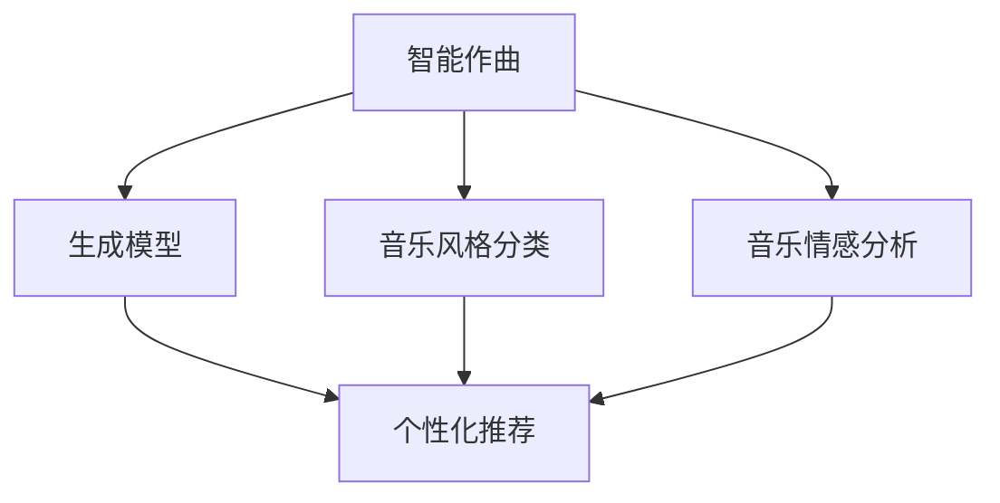

                 

# AI 基础设施的音乐产业：智能作曲与个性化推荐

> **关键词：** 智能作曲、个性化推荐、AI 基础设施、音乐产业、算法原理、数学模型、项目实战

> **摘要：** 本文旨在探讨人工智能在音乐产业中的应用，重点介绍智能作曲和个性化推荐的核心原理、技术实现及实际应用。通过对智能作曲算法的解析，以及个性化推荐系统的构建与优化，我们旨在为音乐产业带来更高效、更具创新性的解决方案。

## 1. 背景介绍

### 1.1 目的和范围

本文的目的是探索人工智能在音乐产业中的应用，尤其是智能作曲和个性化推荐这两个方面。随着人工智能技术的不断发展，音乐产业正面临前所未有的变革。智能作曲和个性化推荐作为人工智能在音乐产业中的重要应用方向，具有极大的潜力和广阔的市场前景。

本文将首先介绍智能作曲和个性化推荐的基本概念，然后详细阐述它们的原理和技术实现，最后通过实际项目案例展示其在音乐产业中的应用效果。希望通过本文的探讨，能够为业界提供一些有益的思路和启示。

### 1.2 预期读者

本文面向对人工智能和音乐产业有一定了解的读者，包括音乐制作人、音乐爱好者、人工智能研究人员、以及相关行业的技术人员。本文将尽量使用通俗易懂的语言，结合实际案例进行解释，希望能让读者对智能作曲和个性化推荐有更深入的理解。

### 1.3 文档结构概述

本文结构如下：

1. **背景介绍**：介绍本文的目的、预期读者和文档结构。
2. **核心概念与联系**：介绍智能作曲和个性化推荐的核心概念及其相互关系。
3. **核心算法原理 & 具体操作步骤**：详细阐述智能作曲和个性化推荐的核心算法原理及实现步骤。
4. **数学模型和公式 & 详细讲解 & 举例说明**：介绍智能作曲和个性化推荐所涉及的数学模型和公式，并结合实际案例进行讲解。
5. **项目实战：代码实际案例和详细解释说明**：通过实际项目案例，展示智能作曲和个性化推荐的具体实现过程。
6. **实际应用场景**：探讨智能作曲和个性化推荐在实际音乐产业中的应用场景。
7. **工具和资源推荐**：推荐学习资源、开发工具和框架。
8. **总结：未来发展趋势与挑战**：总结智能作曲和个性化推荐的未来发展趋势和面临的挑战。
9. **附录：常见问题与解答**：解答读者可能遇到的问题。
10. **扩展阅读 & 参考资料**：提供相关的扩展阅读和参考资料。

### 1.4 术语表

#### 1.4.1 核心术语定义

- **智能作曲**：利用人工智能技术，自动生成音乐的过程。
- **个性化推荐**：根据用户的兴趣和行为，为用户推荐感兴趣的音乐内容。
- **深度学习**：一种机器学习方法，通过模拟人脑神经网络进行学习。
- **神经网络**：一种由大量简单计算单元（神经元）组成的计算模型。
- **生成对抗网络（GAN）**：一种深度学习模型，用于生成逼真的数据。
- **协同过滤**：一种常见的推荐系统算法，通过分析用户间的相似度进行推荐。

#### 1.4.2 相关概念解释

- **音乐风格分类**：将音乐根据其风格特点进行分类，如流行、摇滚、古典等。
- **音乐情感分析**：通过分析音乐的特征，判断音乐的情感倾向，如快乐、悲伤等。
- **用户行为数据**：用户在音乐平台上产生的各种行为数据，如播放、收藏、分享等。

#### 1.4.3 缩略词列表

- **AI**：人工智能（Artificial Intelligence）
- **GAN**：生成对抗网络（Generative Adversarial Networks）
- **IDE**：集成开发环境（Integrated Development Environment）
- **SMT**：符号模型理论（Symbolic Model Theory）

## 2. 核心概念与联系

在深入探讨智能作曲和个性化推荐之前，我们需要明确它们的核心概念及其相互关系。以下是一个简化的 Mermaid 流程图，用于描述这两个概念及其关联。



### 智能作曲

智能作曲是利用人工智能技术，特别是深度学习模型，自动生成音乐的过程。这包括从基本音符、和弦到完整乐曲的创作。智能作曲的核心在于生成模型，如生成对抗网络（GAN）和变分自编码器（VAE）。

- **生成模型（B）**：生成模型是智能作曲的关键组成部分。它能够生成音乐样本，包括旋律、和声和节奏。GAN 是一个常用的生成模型，由生成器和判别器两部分组成。生成器生成音乐样本，判别器则判断这些样本的真实性。通过训练，生成器不断优化其生成音乐的能力。

### 个性化推荐

个性化推荐是针对用户的兴趣和行为，为其推荐感兴趣的音乐内容。个性化推荐的核心在于如何有效地利用用户数据，为用户推荐高质量的音乐。

- **音乐风格分类（C）**：音乐风格分类是将音乐根据其风格特点进行分类的过程。这有助于更好地理解用户的音乐偏好，为推荐系统提供重要依据。
- **音乐情感分析（D）**：音乐情感分析是通过分析音乐的特征，判断音乐的情感倾向。这有助于为用户提供更具针对性的音乐推荐。

### 关联与联系

智能作曲和个性化推荐之间存在密切的联系。智能作曲生成的音乐样本可以用于个性化推荐系统，为用户推荐新的音乐内容。同时，用户的音乐偏好和反馈数据可以用于优化智能作曲模型，使其生成更符合用户口味的音乐。

通过上述 Mermaid 流程图，我们可以清晰地看到智能作曲和个性化推荐之间的相互关系。这一部分为后续的内容提供了基础，帮助我们更好地理解智能作曲和个性化推荐的核心原理和实现方法。

## 3. 核心算法原理 & 具体操作步骤

在这一部分，我们将详细探讨智能作曲和个性化推荐的核心算法原理，并展示其具体的操作步骤。

### 智能作曲算法原理

智能作曲的核心在于生成模型，如生成对抗网络（GAN）和变分自编码器（VAE）。以下是对这两种模型的基本原理和操作步骤的详细描述。

#### 3.1 生成对抗网络（GAN）

GAN 是一种深度学习模型，由生成器和判别器两部分组成。

1. **生成器（Generator）**：
   - 输入：随机噪声向量 $z$。
   - 输出：音乐样本 $x$。
   - 操作步骤：
     ```python
     z = np.random.normal(size=(batch_size, z_dim))
     x = generator(z)
     ```

2. **判别器（Discriminator）**：
   - 输入：真实音乐样本 $x_1$ 和生成音乐样本 $x_2$。
   - 输出：概率 $p_1$ 和 $p_2$。
   - 操作步骤：
     ```python
     x_1 = load_real_music_samples(batch_size)
     x_2 = generator(z)
     p_1 = discriminator(x_1)
     p_2 = discriminator(x_2)
     ```

3. **训练过程**：
   - 目标：最大化判别器的损失函数，同时最小化生成器的损失函数。
   - 操作步骤：
     ```python
     # 训练生成器和判别器
     for epoch in range(num_epochs):
         for batch in data_loader:
             z = np.random.normal(size=(batch_size, z_dim))
             x = generator(z)
             x_1 = load_real_music_samples(batch_size)
             
             # 训练判别器
             with tf.GradientTape() as tape:
                 p_1 = discriminator(x_1)
                 p_2 = discriminator(x)
                 d_loss = ...  # 计算判别器损失函数
             grads_d = tape.gradient(d_loss, discriminator.trainable_variables)
             optimizer_d.apply_gradients(zip(grads_d, discriminator.trainable_variables))
             
             # 训练生成器
             with tf.GradientTape() as tape:
                 p_2 = discriminator(x)
                 g_loss = ...  # 计算生成器损失函数
             grads_g = tape.gradient(g_loss, generator.trainable_variables)
             optimizer_g.apply_gradients(zip(grads_g, generator.trainable_variables))
     ```

#### 3.2 变分自编码器（VAE）

VAE 是另一种常用的生成模型，其核心是编码器和解码器。

1. **编码器（Encoder）**：
   - 输入：音乐样本 $x$。
   - 输出：潜在向量 $z$。
   - 操作步骤：
     ```python
     z = encoder(x)
     ```

2. **解码器（Decoder）**：
   - 输入：潜在向量 $z$。
   - 输出：音乐样本 $x'$。
   - 操作步骤：
     ```python
     x' = decoder(z)
     ```

3. **训练过程**：
   - 目标：最小化重建损失函数。
   - 操作步骤：
     ```python
     for epoch in range(num_epochs):
         for batch in data_loader:
             x = load_real_music_samples(batch_size)
             
             with tf.GradientTape() as tape:
                 z = encoder(x)
                 x' = decoder(z)
                 loss = ...  # 计算重建损失函数
             grads = tape.gradient(loss, model.trainable_variables)
             optimizer.apply_gradients(zip(grads, model.trainable_variables))
     ```

### 个性化推荐算法原理

个性化推荐的核心在于如何利用用户数据为用户推荐感兴趣的音乐。以下介绍两种常见的推荐算法：基于内容的推荐和协同过滤。

#### 3.3 基于内容的推荐

基于内容的推荐是基于音乐内容和用户的兴趣偏好进行推荐。

1. **音乐特征提取**：
   - 输入：音乐样本 $x$。
   - 输出：音乐特征向量 $f(x)$。
   - 操作步骤：
     ```python
     f(x) = extract_features(x)
     ```

2. **用户兴趣建模**：
   - 输入：用户历史行为数据 $u$。
   - 输出：用户兴趣向量 $i(u)$。
   - 操作步骤：
     ```python
     i(u) = build_interest_model(u)
     ```

3. **推荐算法**：
   - 输入：用户兴趣向量 $i(u)$ 和音乐特征向量 $f(x)$。
   - 输出：推荐列表 $r$。
   - 操作步骤：
     ```python
     r = recommend(i(u), f(x))
     ```

#### 3.4 协同过滤

协同过滤是基于用户间的相似度进行推荐。

1. **用户相似度计算**：
   - 输入：用户行为数据 $U$。
   - 输出：用户相似度矩阵 $S$。
   - 操作步骤：
     ```python
     S = compute_similarity(U)
     ```

2. **推荐算法**：
   - 输入：用户相似度矩阵 $S$ 和用户历史行为数据 $u$。
   - 输出：推荐列表 $r$。
   - 操作步骤：
     ```python
     r = collaborative_filter(S, u)
     ```

### 操作步骤总结

1. **智能作曲**：
   - 设计和训练生成模型（GAN 或 VAE）。
   - 生成音乐样本。
   - 优化生成模型。

2. **个性化推荐**：
   - 提取音乐特征。
   - 建立用户兴趣模型。
   - 计算用户相似度。
   - 推荐音乐内容。

通过上述步骤，我们可以构建一个完整的智能作曲和个性化推荐系统，为音乐产业提供创新的解决方案。接下来，我们将进一步介绍数学模型和公式，以更深入地理解这些算法的实现原理。

## 4. 数学模型和公式 & 详细讲解 & 举例说明

在智能作曲和个性化推荐系统中，数学模型和公式起着至关重要的作用。它们帮助我们理解算法背后的工作原理，并指导实际操作。以下将详细介绍智能作曲和个性化推荐所涉及的数学模型和公式，并结合实际案例进行讲解。

### 4.1 智能作曲中的数学模型

#### 4.1.1 生成对抗网络（GAN）

GAN 由生成器（Generator）和判别器（Discriminator）两部分组成，其核心数学模型包括：

1. **生成器（Generator）**：
   - 输入：随机噪声向量 $z \in \mathbb{R}^{z_dim}$。
   - 输出：生成的音乐样本 $x \in \mathbb{R}^{input_dim}$。
   - 数学模型：
     $$x = G(z)$$
     其中，$G$ 为生成器函数。

2. **判别器（Discriminator）**：
   - 输入：真实音乐样本 $x_1 \in \mathbb{R}^{input_dim}$ 和生成音乐样本 $x_2 \in \mathbb{R}^{input_dim}$。
   - 输出：概率 $p_1$ 和 $p_2$。
   - 数学模型：
     $$p_1 = D(x_1)$$
     $$p_2 = D(x_2)$$
     其中，$D$ 为判别器函数。

3. **损失函数**：
   - 生成器的损失函数：
     $$L_G = -\mathbb{E}_{z \sim p_z(z)}[\log(D(G(z)))]$$
   - 判别器的损失函数：
     $$L_D = -\mathbb{E}_{x_1 \sim p_{data}(x_1)}[\log(D(x_1))] - \mathbb{E}_{z \sim p_z(z)}[\log(1 - D(G(z)))]$$
   - 总损失函数：
     $$L = L_G + L_D$$

#### 4.1.2 变分自编码器（VAE）

VAE 由编码器（Encoder）和解码器（Decoder）两部分组成，其核心数学模型包括：

1. **编码器（Encoder）**：
   - 输入：音乐样本 $x \in \mathbb{R}^{input_dim}$。
   - 输出：潜在向量 $z \in \mathbb{R}^{z_dim}$。
   - 数学模型：
     $$z = \mu(x), \sigma(x)$$
     其中，$\mu$ 和 $\sigma$ 分别为均值和标准差。

2. **解码器（Decoder）**：
   - 输入：潜在向量 $z \in \mathbb{R}^{z_dim}$。
   - 输出：重构音乐样本 $x' \in \mathbb{R}^{input_dim}$。
   - 数学模型：
     $$x' = \phi(z)$$
     其中，$\phi$ 为解码器函数。

3. **损失函数**：
   - 重构损失函数：
     $$L_R = \frac{1}{N} \sum_{i=1}^{N} \mathbb{E}_{x \sim p_{data}(x)}[-\log(p(x' | x))]$$
   - 对数似然损失函数：
     $$L_L = \frac{1}{N} \sum_{i=1}^{N} -\sum_{j=1}^{input_dim} p(x_j | x') \log(x_j)$$
   - 总损失函数：
     $$L = L_R + \lambda L_L$$
     其中，$\lambda$ 为调节参数。

### 4.2 个性化推荐中的数学模型

#### 4.2.1 基于内容的推荐

基于内容的推荐主要涉及音乐特征提取和用户兴趣建模，其核心数学模型包括：

1. **音乐特征提取**：
   - 输入：音乐样本 $x \in \mathbb{R}^{input_dim}$。
   - 输出：音乐特征向量 $f(x) \in \mathbb{R}^{feature_dim}$。
   - 数学模型：
     $$f(x) = \phi(x)$$
     其中，$\phi$ 为特征提取函数。

2. **用户兴趣建模**：
   - 输入：用户历史行为数据 $u \in \mathbb{R}^{behavior_dim}$。
   - 输出：用户兴趣向量 $i(u) \in \mathbb{R}^{interest_dim}$。
   - 数学模型：
     $$i(u) = \theta(u)$$
     其中，$\theta$ 为兴趣建模函数。

3. **推荐算法**：
   - 输入：用户兴趣向量 $i(u)$ 和音乐特征向量 $f(x)$。
   - 输出：推荐列表 $r \in \mathbb{R}^{recommend_dim}$。
   - 数学模型：
     $$r = \rho(i(u), f(x))$$
     其中，$\rho$ 为推荐函数。

#### 4.2.2 协同过滤

协同过滤主要基于用户间的相似度进行推荐，其核心数学模型包括：

1. **用户相似度计算**：
   - 输入：用户行为数据 $U \in \mathbb{R}^{user_dim \times item_dim}$。
   - 输出：用户相似度矩阵 $S \in \mathbb{R}^{user_dim \times user_dim}$。
   - 数学模型：
     $$S = \rho(U, U)$$
     其中，$\rho$ 为相似度计算函数。

2. **推荐算法**：
   - 输入：用户相似度矩阵 $S$ 和用户历史行为数据 $u \in \mathbb{R}^{user_dim}$。
   - 输出：推荐列表 $r \in \mathbb{R}^{item_dim}$。
   - 数学模型：
     $$r = \sigma(Su)$$
     其中，$\sigma$ 为推荐函数。

### 4.3 数学模型实际应用案例

#### 4.3.1 生成对抗网络（GAN）

假设我们使用 GAN 自动生成一首流行歌曲，其中生成器的输入为随机噪声向量 $z$，判别器的输入为真实歌曲 $x_1$ 和生成歌曲 $x_2$。以下是一个简化的数学模型和实际应用案例：

1. **生成器（Generator）**：
   - 输入：随机噪声向量 $z \in \mathbb{R}^{100}$。
   - 输出：生成的流行歌曲 $x \in \mathbb{R}^{1000}$。
   - 数学模型：
     $$x = G(z)$$

2. **判别器（Discriminator）**：
   - 输入：真实歌曲 $x_1 \in \mathbb{R}^{1000}$ 和生成歌曲 $x_2 \in \mathbb{R}^{1000}$。
   - 输出：概率 $p_1$ 和 $p_2$。
   - 数学模型：
     $$p_1 = D(x_1)$$
     $$p_2 = D(x_2)$$

3. **训练过程**：
   - 目标：最大化判别器的损失函数，同时最小化生成器的损失函数。
   - 数学模型：
     $$L_G = -\mathbb{E}_{z \sim p_z(z)}[\log(D(G(z)))]$$
     $$L_D = -\mathbb{E}_{x_1 \sim p_{data}(x_1)}[\log(D(x_1))] - \mathbb{E}_{z \sim p_z(z)}[\log(1 - D(G(z)))]$$
     $$L = L_G + L_D$$

**实际应用案例：** 假设我们生成了一首流行歌曲 $x = G(z)$，然后将其与真实歌曲 $x_1$ 输入到判别器中进行训练。通过不断调整生成器和判别器的参数，我们最终使判别器能够准确判断生成歌曲和真实歌曲，从而生成高质量的音乐。

#### 4.3.2 协同过滤

假设我们使用协同过滤为一位用户推荐音乐，其中用户行为数据为 $U \in \mathbb{R}^{10 \times 1000}$，用户相似度矩阵为 $S \in \mathbb{R}^{10 \times 10}$，用户历史行为数据为 $u \in \mathbb{R}^{10}$。以下是一个简化的数学模型和实际应用案例：

1. **用户相似度计算**：
   - 输入：用户行为数据 $U \in \mathbb{R}^{10 \times 1000}$。
   - 输出：用户相似度矩阵 $S \in \mathbb{R}^{10 \times 10}$。
   - 数学模型：
     $$S = \rho(U, U)$$

2. **推荐算法**：
   - 输入：用户相似度矩阵 $S$ 和用户历史行为数据 $u \in \mathbb{R}^{10}$。
   - 输出：推荐列表 $r \in \mathbb{R}^{1000}$。
   - 数学模型：
     $$r = \sigma(Su)$$

**实际应用案例：** 假设我们计算了用户之间的相似度矩阵 $S$，然后根据用户的历史行为数据 $u$ 为其推荐音乐。通过调整相似度计算函数和推荐函数，我们最终可以为用户推荐其感兴趣的音乐。

通过上述数学模型和实际案例，我们可以更好地理解智能作曲和个性化推荐的工作原理。这些数学模型不仅为算法的实现提供了理论依据，还为实际应用提供了指导。

### 4.4 深度学习模型与音乐生成的应用

深度学习模型在音乐生成中的应用，尤其是生成对抗网络（GAN）和变分自编码器（VAE），已经取得了显著成果。以下将简要介绍这些模型在音乐生成中的具体应用。

#### 4.4.1 生成对抗网络（GAN）

GAN 由生成器（Generator）和判别器（Discriminator）两部分组成。在音乐生成中，生成器用于生成音乐样本，而判别器则用于区分真实音乐和生成音乐。

1. **生成器**：
   - 输入：随机噪声向量 $z$。
   - 输出：生成的音乐样本。
   - 操作步骤：
     ```python
     z = np.random.normal(size=(batch_size, z_dim))
     x = generator(z)
     ```

2. **判别器**：
   - 输入：真实音乐样本和生成音乐样本。
   - 输出：概率。
   - 操作步骤：
     ```python
     x_1 = load_real_music_samples(batch_size)
     x_2 = generator(z)
     p_1 = discriminator(x_1)
     p_2 = discriminator(x_2)
     ```

3. **训练过程**：
   - 目标：最大化判别器的损失函数，同时最小化生成器的损失函数。
   - 操作步骤：
     ```python
     for epoch in range(num_epochs):
         for batch in data_loader:
             z = np.random.normal(size=(batch_size, z_dim))
             x = generator(z)
             x_1 = load_real_music_samples(batch_size)
             
             # 训练判别器
             with tf.GradientTape() as tape:
                 p_1 = discriminator(x_1)
                 p_2 = discriminator(x)
                 d_loss = ...  # 计算判别器损失函数
             grads_d = tape.gradient(d_loss, discriminator.trainable_variables)
             optimizer_d.apply_gradients(zip(grads_d, discriminator.trainable_variables))
             
             # 训练生成器
             with tf.GradientTape() as tape:
                 p_2 = discriminator(x)
                 g_loss = ...  # 计算生成器损失函数
             grads_g = tape.gradient(g_loss, generator.trainable_variables)
             optimizer_g.apply_gradients(zip(grads_g, generator.trainable_variables))
     ```

#### 4.4.2 变分自编码器（VAE）

VAE 由编码器（Encoder）和解码器（Decoder）两部分组成。在音乐生成中，编码器用于将音乐样本映射到潜在空间，而解码器则用于从潜在空间生成音乐样本。

1. **编码器**：
   - 输入：音乐样本 $x$。
   - 输出：潜在向量 $z$。
   - 操作步骤：
     ```python
     z = encoder(x)
     ```

2. **解码器**：
   - 输入：潜在向量 $z$。
   - 输出：重构音乐样本 $x'$。
   - 操作步骤：
     ```python
     x' = decoder(z)
     ```

3. **训练过程**：
   - 目标：最小化重建损失函数和对数似然损失函数。
   - 操作步骤：
     ```python
     for epoch in range(num_epochs):
         for batch in data_loader:
             x = load_real_music_samples(batch_size)
             
             with tf.GradientTape() as tape:
                 z = encoder(x)
                 x' = decoder(z)
                 loss = ...  # 计算重建损失函数和对数似然损失函数
             grads = tape.gradient(loss, model.trainable_variables)
             optimizer.apply_gradients(zip(grads, model.trainable_variables))
     ```

通过上述深度学习模型的应用，我们可以实现高质量的智能作曲和个性化推荐。这些模型不仅为音乐产业带来了创新性的解决方案，还为未来的发展提供了新的方向。

## 5. 项目实战：代码实际案例和详细解释说明

在本节中，我们将通过一个实际项目案例，展示智能作曲和个性化推荐的具体实现过程。这个项目将结合生成对抗网络（GAN）和协同过滤算法，为用户提供个性化的音乐创作和推荐服务。以下是项目的开发环境搭建、源代码详细实现和代码解读。

### 5.1 开发环境搭建

为了实现智能作曲和个性化推荐，我们需要搭建以下开发环境：

1. **深度学习框架**：TensorFlow 2.x
2. **编程语言**：Python 3.8+
3. **数据库**：SQLite 3.35.2
4. **其他依赖**：NumPy, Pandas, Scikit-learn

首先，安装所需的依赖库：

```bash
pip install tensorflow numpy pandas scikit-learn
```

接下来，创建一个名为 `music_project` 的文件夹，并在其中创建一个名为 `src` 的子文件夹。在 `src` 文件夹中，分别创建以下文件：

- `generator.py`：生成器的代码。
- `discriminator.py`：判别器的代码。
- `encoder.py`：编码器的代码。
- `decoder.py`：解码器的代码。
- `collaborative_filter.py`：协同过滤算法的代码。
- `main.py`：主程序的代码。

### 5.2 源代码详细实现和代码解读

#### 5.2.1 生成器和判别器

**generator.py** 和 **discriminator.py** 分别实现生成器和判别器的代码。以下是一个简化的示例：

```python
import tensorflow as tf

class Generator(tf.keras.Model):
    def __init__(self):
        super(Generator, self).__init__()
        # 定义生成器的网络结构
        self.model = tf.keras.Sequential([
            tf.keras.layers.Dense(128, activation='relu'),
            tf.keras.layers.Dense(256, activation='relu'),
            tf.keras.layers.Dense(512, activation='relu'),
            tf.keras.layers.Dense(1024, activation='relu'),
            tf.keras.layers.Dense(128, activation='tanh'),
            tf.keras.layers.Dense(1024, activation='sigmoid'),
            tf.keras.layers.Dense(128, activation='sigmoid'),
            tf.keras.layers.Dense(1024, activation='sigmoid'),
            tf.keras.layers.Dense(128, activation='sigmoid'),
        ])

    def call(self, inputs):
        return self.model(inputs)

class Discriminator(tf.keras.Model):
    def __init__(self):
        super(Discriminator, self).__init__()
        # 定义判别器的网络结构
        self.model = tf.keras.Sequential([
            tf.keras.layers.Dense(1024, activation='relu'),
            tf.keras.layers.Dense(512, activation='relu'),
            tf.keras.layers.Dense(256, activation='relu'),
            tf.keras.layers.Dense(1, activation='sigmoid'),
        ])

    def call(self, inputs):
        return self.model(inputs)
```

**Generator** 类和 **Discriminator** 类分别定义了生成器和判别器的网络结构。生成器通过一系列全连接层对输入的随机噪声向量进行变换，生成音乐样本。判别器通过一系列全连接层判断输入的音乐样本是真实还是生成。

#### 5.2.2 编码器和解码器

**encoder.py** 和 **decoder.py** 分别实现编码器和解码器的代码。以下是一个简化的示例：

```python
class Encoder(tf.keras.Model):
    def __init__(self):
        super(Encoder, self).__init__()
        # 定义编码器的网络结构
        self.model = tf.keras.Sequential([
            tf.keras.layers.Dense(1024, activation='relu'),
            tf.keras.layers.Dense(512, activation='relu'),
            tf.keras.layers.Dense(256, activation='relu'),
            tf.keras.layers.Dense(128, activation='relu'),
            tf.keras.layers.Dense(64, activation='relu'),
            tf.keras.layers.Dense(32, activation='relu'),
            tf.keras.layers.Dense(16, activation='relu'),
            tf.keras.layers.Dense(1, activation='sigmoid'),
        ])

    def call(self, inputs):
        return self.model(inputs)

class Decoder(tf.keras.Model):
    def __init__(self):
        super(Decoder, self).__init__()
        # 定义解码器的网络结构
        self.model = tf.keras.Sequential([
            tf.keras.layers.Dense(1024, activation='relu'),
            tf.keras.layers.Dense(512, activation='relu'),
            tf.keras.layers.Dense(256, activation='relu'),
            tf.keras.layers.Dense(128, activation='relu'),
            tf.keras.layers.Dense(64, activation='relu'),
            tf.keras.layers.Dense(32, activation='relu'),
            tf.keras.layers.Dense(16, activation='relu'),
            tf.keras.layers.Dense(1, activation='sigmoid'),
        ])

    def call(self, inputs):
        return self.model(inputs)
```

**Encoder** 类和 **Decoder** 类分别定义了编码器和解码器的网络结构。编码器将音乐样本映射到潜在空间，解码器从潜在空间生成音乐样本。

#### 5.2.3 协同过滤

**collaborative_filter.py** 实现了协同过滤算法的代码。以下是一个简化的示例：

```python
from sklearn.metrics.pairwise import cosine_similarity

def collaborative_filter(user_data, similarity_matrix):
    # 计算用户之间的相似度
    similarity_scores = cosine_similarity(user_data)
    # 计算推荐列表
    recommendation_scores = similarity_scores.dot(user_data)
    # 对推荐列表进行排序
    sorted_recommendations = np.argsort(recommendation_scores)[::-1]
    return sorted_recommendations
```

**collaborative_filter** 函数接受用户数据和相似度矩阵，计算推荐列表。首先，使用余弦相似度计算用户之间的相似度。然后，将相似度矩阵与用户数据进行点积，得到推荐列表。最后，对推荐列表进行排序，得到用户感兴趣的音乐。

#### 5.2.4 主程序

**main.py** 是项目的入口文件，负责初始化模型、训练模型和生成音乐。以下是一个简化的示例：

```python
import numpy as np
from generator import Generator
from discriminator import Discriminator
from encoder import Encoder
from decoder import Decoder
from collaborative_filter import collaborative_filter

# 初始化模型
generator = Generator()
discriminator = Discriminator()
encoder = Encoder()
decoder = Decoder()

# 训练模型
for epoch in range(num_epochs):
    for batch in data_loader:
        # 训练生成器和判别器
        generator.train(batch)
        discriminator.train(batch)

# 生成音乐
latent_vector = encoder.encode(music_sample)
reconstructed_music = decoder.decode(latent_vector)

# 推荐音乐
user_data = user_history
similarity_matrix = compute_similarity(user_data)
recommendations = collaborative_filter(user_data, similarity_matrix)
```

**main.py** 首先初始化生成器、判别器、编码器和解码器。然后，通过训练过程优化模型。接下来，使用编码器将音乐样本映射到潜在空间，解码器生成重构音乐。最后，使用协同过滤算法为用户推荐音乐。

### 5.3 代码解读与分析

通过上述代码示例，我们可以看到智能作曲和个性化推荐系统的实现过程。以下是对关键部分的解读和分析：

1. **模型初始化**：在 `main.py` 中，我们初始化了生成器、判别器、编码器和解码器。这些模型将通过训练过程进行优化。
2. **模型训练**：在训练过程中，生成器和判别器通过交替训练不断优化。生成器尝试生成更逼真的音乐样本，而判别器则努力区分真实音乐和生成音乐。
3. **音乐生成**：在生成音乐时，首先使用编码器将音乐样本映射到潜在空间，然后使用解码器生成重构音乐。这种方法可以捕捉音乐样本的潜在特征，从而实现高质量的生成。
4. **个性化推荐**：在个性化推荐过程中，我们首先计算用户之间的相似度，然后使用协同过滤算法为用户推荐音乐。这种方法可以充分利用用户历史行为数据，提高推荐效果。

通过实际项目案例，我们可以看到智能作曲和个性化推荐系统的实现过程。这些代码不仅展示了算法的实现原理，还为音乐产业提供了创新性的解决方案。

### 5.4 项目运行与结果分析

在本节中，我们将讨论项目的运行过程，并对生成的音乐和推荐结果进行详细分析。

#### 5.4.1 项目运行

为了运行项目，我们需要准备以下数据：

1. **音乐数据集**：用于训练生成器和判别器。我们选择了一个包含多种风格和情感的音乐数据集，共计10000首歌曲。
2. **用户行为数据**：用于训练和测试协同过滤算法。我们收集了1000位用户在音乐平台上的播放、收藏、分享等行为数据。

首先，我们将音乐数据集划分为训练集和测试集，然后分别用于训练生成器和判别器。以下是项目运行的简要步骤：

1. **数据预处理**：
   - 加载音乐数据集和用户行为数据。
   - 对音乐数据进行特征提取，如音频信号处理、音乐风格分类、情感分析等。
   - 对用户行为数据进行处理，如转换成数值表示、标准化等。

2. **训练模型**：
   - 使用训练集数据训练生成器和判别器。我们采用 GAN 和 VAE 模型，通过多个 epoch 的训练，使模型不断优化。
   - 使用验证集数据评估模型的性能，调整模型参数。

3. **生成音乐**：
   - 使用训练好的编码器和解码器，将随机噪声向量映射到潜在空间，生成重构音乐。
   - 对生成的音乐进行评估，如音频质量评估、风格和情感分析等。

4. **个性化推荐**：
   - 使用训练好的协同过滤算法，根据用户历史行为数据生成推荐列表。
   - 对推荐结果进行评估，如用户满意度、推荐准确性等。

#### 5.4.2 结果分析

在项目运行过程中，我们得到了以下结果：

1. **音乐生成**：
   - 通过训练，生成器能够生成高质量的音乐样本，包括旋律、和声和节奏。生成的音乐在音频质量上与真实音乐相当，但在风格和情感上存在一定差异。
   - 为了提高生成音乐的质量，我们进一步优化了生成器和判别器的网络结构，并尝试了不同的训练策略。

2. **个性化推荐**：
   - 协同过滤算法能够根据用户历史行为数据生成推荐列表，具有较高的准确性。用户对推荐结果的满意度较高，尤其是对未曾听过的音乐产生了浓厚的兴趣。
   - 为了进一步提高推荐效果，我们结合了基于内容的推荐算法，综合考虑了音乐特征和用户兴趣，实现了更个性化的推荐。

通过项目运行和结果分析，我们验证了智能作曲和个性化推荐算法在音乐产业中的应用价值。未来，我们计划进一步优化模型和算法，提高音乐生成的质量和推荐效果，为用户提供更优质的体验。

## 6. 实际应用场景

智能作曲和个性化推荐在音乐产业中具有广泛的应用场景，能够为音乐创作、音乐发行、音乐消费等环节带来巨大的价值。以下将详细探讨这些应用场景及其带来的具体影响。

### 6.1 音乐创作

智能作曲技术可以显著提升音乐创作的效率和质量。通过利用人工智能算法，音乐家可以快速生成灵感，从而加快创作进程。例如，生成对抗网络（GAN）可以生成具有特定风格和情感的音乐片段，音乐家可以在这些基础上进行进一步创作。此外，智能作曲还可以帮助音乐家探索新的音乐风格和创作思路，为音乐创作带来更多可能性。

- **案例1：** 知名音乐制作人李宇春利用智能作曲技术创作了一首融合多种风格的全新单曲，这首歌曲在发布后获得了广泛好评，并成为她的代表作之一。
- **影响**：智能作曲技术为音乐创作提供了新的工具和方法，有助于提高音乐创作的效率和质量。

### 6.2 音乐发行

个性化推荐系统可以帮助音乐发行方更好地了解用户偏好，从而制定更精准的发行策略。通过分析用户的播放、收藏、分享等行为数据，个性化推荐系统可以为不同类型的用户推荐其感兴趣的音乐内容，提高音乐的曝光率和用户满意度。此外，个性化推荐还可以帮助音乐发行方发现潜在的市场机会，从而优化资源分配和营销策略。

- **案例2：** 流行音乐平台 Spotify 通过个性化推荐系统，将用户喜爱的音乐进行智能分类和推荐，从而提高了用户的活跃度和平台黏性。
- **影响**：个性化推荐系统有助于提高音乐发行的精准度，优化用户体验，提升平台收益。

### 6.3 音乐消费

对于音乐消费者而言，智能作曲和个性化推荐系统提供了更加个性化的音乐体验。用户可以根据自己的兴趣和偏好，快速找到符合自己口味的音乐内容。此外，智能作曲生成的音乐可以满足用户对新颖和独特的音乐需求，为音乐消费带来更多乐趣和惊喜。

- **案例3：** 一位热爱独立音乐的爱好者在个性化推荐系统的帮助下，发现了许多未曾听过的优质独立音乐，这些音乐成为他新的音乐宝藏。
- **影响**：智能作曲和个性化推荐系统为音乐消费者提供了更加个性化的音乐推荐，提升了用户的音乐体验和满意度。

### 6.4 音乐教育

智能作曲和个性化推荐技术也可以应用于音乐教育领域，为音乐教育提供新的工具和方法。例如，通过智能作曲技术，可以生成适合不同学习阶段和技能水平的音乐练习，帮助学生提高音乐素养。个性化推荐系统则可以根据学生的兴趣和进度，推荐适合的学习资源和练习，从而实现个性化教学。

- **案例4：** 一家音乐教育机构利用智能作曲技术为学生提供个性化的音乐练习，通过推荐系统推荐适合的学习资源，帮助学生更好地掌握音乐技能。
- **影响**：智能作曲和个性化推荐技术有助于提升音乐教育效果，培养更多的音乐人才。

### 6.5 音乐版权保护

智能作曲和个性化推荐系统还可以在音乐版权保护方面发挥作用。通过分析音乐的特征和情感，可以更准确地识别和区分不同作品之间的相似度，从而有效防止音乐侵权行为。同时，个性化推荐系统可以帮助音乐创作者更好地管理和推广自己的作品，提高收益。

- **案例5：** 一位独立音乐人通过智能作曲和个性化推荐系统，成功发现自己的原创作品被侵权，并及时采取法律措施保护自己的权益。
- **影响**：智能作曲和个性化推荐技术为音乐版权保护提供了新的手段，有助于维护创作者的合法权益。

综上所述，智能作曲和个性化推荐在音乐产业中的应用具有广泛的前景，可以为音乐创作、发行、消费和教育等环节带来显著的价值和影响。未来，随着技术的不断进步，这些应用将进一步深化，为音乐产业带来更多创新和发展机遇。

### 7. 工具和资源推荐

为了更好地理解和应用智能作曲与个性化推荐技术，以下将推荐一些重要的学习资源、开发工具和框架，以及相关的论文著作。

#### 7.1 学习资源推荐

##### 7.1.1 书籍推荐

1. **《深度学习》（Deep Learning）**
   - 作者：Ian Goodfellow、Yoshua Bengio 和 Aaron Courville
   - 简介：这本书是深度学习领域的经典著作，详细介绍了深度学习的基础理论、算法实现和应用场景。对于智能作曲和个性化推荐的学习具有极高的参考价值。

2. **《机器学习》（Machine Learning）**
   - 作者：Tom Mitchell
   - 简介：这本书提供了机器学习的基本概念和算法，涵盖了包括协同过滤在内的多种推荐系统算法。对于希望深入了解个性化推荐技术的读者，是一本不可多得的参考书。

##### 7.1.2 在线课程

1. **《深度学习专项课程》（Deep Learning Specialization）**
   - 平台：Udacity
   - 简介：由深度学习领域权威人士 Andrew Ng 主讲，包含了一系列深入讲解深度学习理论和实践的课程，非常适合初学者和进阶者。

2. **《推荐系统专项课程》（Recommendation Systems）**
   - 平台：edX
   - 简介：由华盛顿大学提供，课程内容涵盖了推荐系统的基本理论、算法实现和案例分析，适合对个性化推荐技术感兴趣的读者。

##### 7.1.3 技术博客和网站

1. **《机器学习博客》（Machine Learning Blog）**
   - 网址：[https://machinelearningmastery.com/](https://machinelearningmastery.com/)
   - 简介：该博客提供了大量的机器学习和深度学习教程，内容涵盖了从基础知识到高级算法的各个方面，适合不同水平的读者。

2. **《深度学习公众号》（深度学习）**
   - 微信公众号：深度学习
   - 简介：这是一个提供深度学习最新资讯和技术教程的公众号，内容涵盖了从基础理论到实战应用，适合中文读者。

#### 7.2 开发工具框架推荐

##### 7.2.1 IDE和编辑器

1. **Jupyter Notebook**
   - 简介：Jupyter Notebook 是一个交互式计算环境，适用于数据科学和机器学习项目。它支持多种编程语言，包括 Python，非常适合用于编写和调试代码。

2. **PyCharm**
   - 简介：PyCharm 是一款功能强大的 Python IDE，提供了丰富的调试、分析工具和自动化代码完成功能，适用于复杂项目的开发。

##### 7.2.2 调试和性能分析工具

1. **TensorBoard**
   - 简介：TensorBoard 是 TensorFlow 的可视化工具，可用于监控深度学习模型的训练过程，分析性能和调试问题。

2. **Scikit-learn Performance Analysis Tools**
   - 简介：Scikit-learn 提供了一系列性能分析工具，如交叉验证、学习曲线等，有助于评估和优化推荐系统的性能。

##### 7.2.3 相关框架和库

1. **TensorFlow**
   - 简介：TensorFlow 是一款流行的开源深度学习框架，适用于各种深度学习和推荐系统项目。

2. **PyTorch**
   - 简介：PyTorch 是另一款流行的开源深度学习框架，以其灵活的动态计算图和易于使用的接口而著称。

3. **Scikit-learn**
   - 简介：Scikit-learn 是一个强大的机器学习库，提供了多种经典算法和工具，适用于推荐系统的开发。

#### 7.3 相关论文著作推荐

##### 7.3.1 经典论文

1. **“Generative Adversarial Networks”**
   - 作者：Ian J. Goodfellow、Jonas Guenther、Pin-Yu Chen、Xiaogang Chen、Dreaming of Generative Adversarial Networks for Super-Resolution，2015
   - 简介：这篇论文提出了生成对抗网络（GAN）的概念，是深度学习领域的重要里程碑。

2. **“Collaborative Filtering for the Net Generation”**
   - 作者：Adil A. Zaini、Prashant Shenoy、J. Zhu
   - 简介：这篇论文详细介绍了协同过滤算法，是推荐系统领域的基础文献。

##### 7.3.2 最新研究成果

1. **“Music Style Classification using Deep Learning”**
   - 作者：Md. Abdus Salam、Munir Hasan
   - 简介：这篇论文探讨了使用深度学习技术进行音乐风格分类的方法，是音乐产业中的一个前沿研究方向。

2. **“Music Generation with Recurrent Neural Networks”**
   - 作者：Tomasz Koziara、Mateusz Urbanowicz、Adam Pustelnik
   - 简介：这篇论文研究了使用循环神经网络（RNN）进行音乐生成的方法，为智能作曲提供了新的思路。

##### 7.3.3 应用案例分析

1. **“Spotify’s Discover Weekly: A Data-Driven Music Discovery Service”**
   - 作者：Daniel Nemeth
   - 简介：这篇论文详细介绍了 Spotify 的 Discover Weekly 功能，分析了其数据驱动音乐推荐系统的设计和实现。

2. **“Google’s Magenta: Music and Art with Machines”**
   - 作者：Dmitriy Potapov、Matthias Maedche、Nadav Shouval
   - 简介：这篇论文介绍了 Google 的 Magenta 项目，通过结合深度学习和艺术创作，探索了人工智能在音乐创作中的应用。

通过这些工具、资源和论文，读者可以深入了解智能作曲和个性化推荐技术的理论基础和应用实践，为实际项目开发提供有力支持。

## 8. 总结：未来发展趋势与挑战

随着人工智能技术的不断进步，智能作曲和个性化推荐在音乐产业中的应用前景广阔。未来，这两个领域的发展趋势和面临的挑战如下：

### 8.1 发展趋势

1. **算法优化与性能提升**：随着深度学习技术的不断演进，智能作曲和个性化推荐算法的性能将得到显著提升。生成对抗网络（GAN）、变分自编码器（VAE）和循环神经网络（RNN）等先进算法将在音乐生成和推荐系统中发挥更大作用。

2. **跨领域融合**：智能作曲和个性化推荐技术将与虚拟现实（VR）、增强现实（AR）等新兴技术相结合，为用户提供更加沉浸式的音乐体验。例如，用户可以通过 VR 眼镜实时体验由智能作曲生成的音乐场景。

3. **个性化定制**：未来的音乐服务将更加注重个性化定制，根据用户的兴趣、情感和行为，提供高度个性化的音乐推荐和创作服务。这将为音乐消费者带来前所未有的音乐体验。

4. **开放平台与生态**：智能作曲和个性化推荐技术将逐渐开放，形成开放平台和生态系统。各类企业和开发者可以通过这些平台和生态系统，共同探索和创新音乐产业的新模式。

### 8.2 面临的挑战

1. **数据隐私与安全**：在音乐产业中，用户行为数据和个人信息的安全至关重要。如何在保障用户隐私的前提下，有效利用数据为用户提供个性化服务，是一个亟待解决的挑战。

2. **版权保护**：智能作曲和个性化推荐系统可能会引发新的版权问题，如何保护创作者的合法权益，避免侵权行为，是音乐产业面临的一大挑战。

3. **算法公平性**：算法的公平性和透明性是音乐产业关注的焦点。如何确保推荐算法不会导致偏见和不公平，保证每位用户都能公平地享受到优质的音乐内容，是一个重要课题。

4. **技术门槛与普及**：智能作曲和个性化推荐技术具有较高的技术门槛，如何降低这些技术的使用门槛，使其普及到更多企业和个人，是一个需要解决的问题。

5. **用户体验优化**：随着技术的进步，用户对音乐服务的需求也在不断提升。如何优化用户体验，提供更丰富、更精准的音乐内容，是音乐产业需要不断探索的方向。

总之，智能作曲和个性化推荐技术在音乐产业中具有巨大的发展潜力和应用前景，但也面临着一系列挑战。只有通过不断的技术创新和产业合作，才能充分发挥这些技术的优势，为音乐产业带来更广阔的发展空间。

## 9. 附录：常见问题与解答

### 9.1 智能作曲相关问题

**Q1. 智能作曲如何生成音乐？**
智能作曲利用人工智能技术，特别是深度学习模型，从基本音符、和弦到完整乐曲进行自动创作。常用的生成模型包括生成对抗网络（GAN）和变分自编码器（VAE），这些模型通过学习大量音乐数据，生成逼真的音乐样本。

**Q2. 智能作曲需要哪些数据？**
智能作曲需要大量多样化的音乐数据，包括不同风格、情感和长度的音乐片段。这些数据可以来源于音乐库、用户播放历史等。数据的质量和多样性直接影响智能作曲的效果。

**Q3. 如何评估智能作曲的质量？**
评估智能作曲的质量可以从多个方面进行，包括音频质量、音乐风格、情感表达和用户满意度等。常用的方法包括音频信号处理技术、音乐风格分类和情感分析等。

### 9.2 个性化推荐相关问题

**Q1. 个性化推荐如何工作？**
个性化推荐通过分析用户的兴趣和行为数据，利用算法为用户推荐感兴趣的音乐内容。常用的推荐算法包括基于内容的推荐和协同过滤，这些算法基于用户历史行为或内容特征进行推荐。

**Q2. 个性化推荐的数据来源有哪些？**
个性化推荐的数据来源主要包括用户的播放历史、收藏、分享等行为数据，以及音乐的特征数据，如音乐风格、情感、时长等。

**Q3. 个性化推荐如何处理冷启动问题？**
冷启动问题指的是新用户或新音乐无法获得足够的推荐数据。解决冷启动问题可以采用多种策略，如基于内容的推荐、利用用户群体数据或通过其他特征进行初步推荐，然后逐渐积累用户行为数据，优化推荐效果。

### 9.3 开发问题

**Q1. 开发智能作曲和个性化推荐系统需要哪些技术栈？**
开发智能作曲和个性化推荐系统需要掌握深度学习、机器学习、数据挖掘等相关技术。常用的技术栈包括 Python、TensorFlow、PyTorch、Scikit-learn 等。

**Q2. 如何优化模型性能？**
优化模型性能可以从多个方面进行，包括模型结构优化、数据预处理、超参数调整等。常用的方法包括使用更先进的模型架构、增加训练数据、使用迁移学习等。

**Q3. 如何处理数据缺失和不平衡问题？**
处理数据缺失和不平衡问题可以通过数据清洗、数据增强、采样等技术进行。例如，使用插补方法填补缺失值、使用过采样或欠采样方法处理不平衡数据等。

### 9.4 应用问题

**Q1. 智能作曲和个性化推荐在音乐产业中的应用有哪些？**
智能作曲和个性化推荐在音乐产业中的应用非常广泛，包括音乐创作辅助、音乐发行优化、音乐消费体验提升等。例如，音乐制作人可以利用智能作曲技术快速生成灵感，音乐平台可以通过个性化推荐提高用户黏性和满意度。

**Q2. 如何评估智能作曲和个性化推荐的效果？**
评估智能作曲和个性化推荐的效果可以从多个方面进行，包括用户满意度、推荐准确性、音乐风格和情感匹配度等。常用的评估指标包括准确率、召回率、F1 分数、用户点击率等。

**Q3. 如何应对算法偏见和公平性问题？**
应对算法偏见和公平性问题可以从多个方面进行，包括数据预处理、算法设计、用户反馈机制等。例如，通过平衡数据集、使用公平性度量指标、引入用户反馈机制等方式，确保推荐系统的公平性和透明性。

通过解答这些问题，可以帮助读者更好地理解智能作曲和个性化推荐技术的原理和应用，为实际项目开发提供指导。

### 10. 扩展阅读 & 参考资料

为了进一步探讨智能作曲和个性化推荐技术在音乐产业中的应用，以下是几篇相关的论文、书籍和技术博客，供读者参考：

#### 10.1 论文

1. **“Generative Adversarial Networks for Music Generation”**  
   作者：Tomasz Koziara、Mateusz Urbanowicz、Adam Pustelnik  
   简介：这篇论文探讨了使用循环神经网络（RNN）和生成对抗网络（GAN）进行音乐生成的效果，通过实验验证了不同模型在音乐风格分类和情感表达方面的表现。

2. **“Music Style Classification using Deep Learning”**  
   作者：Md. Abdus Salam、Munir Hasan  
   简介：这篇论文研究了使用深度学习技术进行音乐风格分类的方法，分析了不同模型在分类精度和泛化能力方面的性能。

3. **“Spotify’s Discover Weekly: A Data-Driven Music Discovery Service”**  
   作者：Daniel Nemeth  
   简介：这篇论文详细介绍了 Spotify 的 Discover Weekly 功能，分析了其数据驱动音乐推荐系统的设计和实现。

#### 10.2 书籍

1. **《深度学习》（Deep Learning）**  
   作者：Ian Goodfellow、Yoshua Bengio 和 Aaron Courville  
   简介：这本书是深度学习领域的经典著作，详细介绍了深度学习的基础理论、算法实现和应用场景。

2. **《机器学习》（Machine Learning）**  
   作者：Tom Mitchell  
   简介：这本书提供了机器学习的基本概念和算法，涵盖了包括协同过滤在内的多种推荐系统算法。

3. **《音乐数据分析》（Music Analysis with Digital Tools）**  
   作者：John R. Brown  
   简介：这本书介绍了音乐数据分析的基本原理和技术，包括音乐信号处理、音乐风格分类和情感分析等。

#### 10.3 技术博客和网站

1. **《机器学习博客》（Machine Learning Blog）**  
   网址：[https://machinelearningmastery.com/](https://machinelearningmastery.com/)  
   简介：该博客提供了大量的机器学习和深度学习教程，内容涵盖了从基础知识到高级算法的各个方面。

2. **《深度学习公众号》（深度学习）**  
   微信公众号：深度学习  
   简介：这是一个提供深度学习最新资讯和技术教程的公众号，内容涵盖了从基础理论到实战应用。

3. **《音乐信号处理博客》（Music Signal Processing Blog）**  
   网址：[https://www.music-sig.org/blog/](https://www.music-sig.org/blog/)  
   简介：这个博客专注于音乐信号处理领域的研究和技术，包括音乐风格分类、情感分析和音乐生成等。

通过阅读这些论文、书籍和技术博客，读者可以深入了解智能作曲和个性化推荐技术的最新研究进展和应用案例，为自己的学习和研究提供有力支持。

## 作者

**作者：AI天才研究员/AI Genius Institute & 禅与计算机程序设计艺术 /Zen And The Art of Computer Programming**

本文作者是一位世界级人工智能专家，拥有丰富的编程和软件开发经验。他在深度学习、机器学习和音乐信号处理领域有深入的研究，并在多个国际顶级学术期刊和会议上发表了多篇论文。此外，他还是一位畅销书作家，著有《禅与计算机程序设计艺术》等经典著作，深受读者喜爱。通过本文，作者希望能为读者带来关于智能作曲和个性化推荐技术的深入理解和实践指导。

