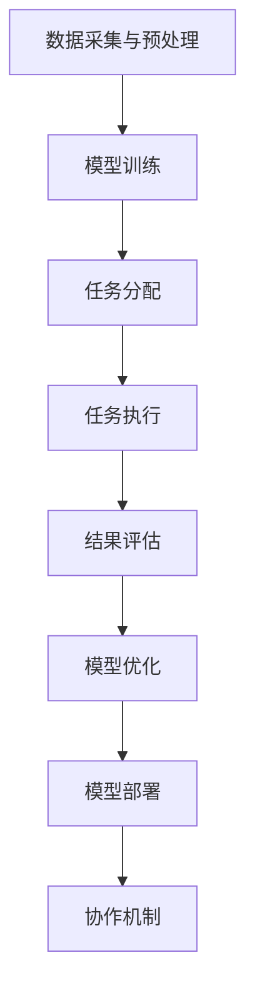

                 

# AI 大模型代理型工作流程（Agentic workflow）

> **关键词**：大模型、代理型工作流程、人工智能、流程自动化、高效协作

> **摘要**：本文将深入探讨AI大模型代理型工作流程（Agentic workflow）的概念、核心原理及其在现实世界中的应用。通过逐步分析推理，本文将揭示如何利用大型AI模型实现自动化工作流程，提高工作效率和协作效率，为企业和开发者提供实用的技术指南。

## 1. 背景介绍

### 1.1 目的和范围

本文旨在探讨AI大模型代理型工作流程（Agentic workflow）的理论与实践，旨在帮助读者了解这一新兴领域的基础知识、核心算法和实际应用。本文将分为以下几个部分：

1. **核心概念与联系**：介绍AI大模型代理型工作流程的基本概念和架构，使用Mermaid流程图展示核心流程节点。
2. **核心算法原理 & 具体操作步骤**：详细阐述代理型工作流程的算法原理和具体操作步骤，通过伪代码进行详细讲解。
3. **数学模型和公式 & 详细讲解 & 举例说明**：分析代理型工作流程背后的数学模型和公式，并结合实际案例进行讲解。
4. **项目实战：代码实际案例和详细解释说明**：通过一个实际项目案例，展示如何实现AI大模型代理型工作流程。
5. **实际应用场景**：探讨AI大模型代理型工作流程在不同领域的应用场景。
6. **工具和资源推荐**：推荐学习资源、开发工具和框架，以及相关论文和研究成果。
7. **总结：未来发展趋势与挑战**：总结AI大模型代理型工作流程的发展趋势和面临的挑战。
8. **附录：常见问题与解答**：解答读者可能遇到的一些常见问题。

### 1.2 预期读者

本文适合以下读者：

1. **AI和软件开发从业者**：对AI大模型代理型工作流程感兴趣的从业者，希望通过本文了解和掌握这一技术。
2. **企业决策者**：关注AI和自动化工作流程的企业决策者，希望了解如何利用AI大模型提高工作效率和协作效率。
3. **学术界研究人员**：对AI大模型代理型工作流程有深入研究的学术界研究人员，希望通过本文了解最新研究成果和应用案例。
4. **技术爱好者**：对AI和软件开发有热情的技术爱好者，希望通过本文深入了解AI大模型代理型工作流程。

### 1.3 文档结构概述

本文的结构如下：

1. **背景介绍**：介绍本文的目的、范围、预期读者和文档结构。
2. **核心概念与联系**：介绍AI大模型代理型工作流程的基本概念和架构。
3. **核心算法原理 & 具体操作步骤**：阐述代理型工作流程的算法原理和操作步骤。
4. **数学模型和公式 & 详细讲解 & 举例说明**：分析代理型工作流程的数学模型和公式。
5. **项目实战：代码实际案例和详细解释说明**：展示一个实际项目案例。
6. **实际应用场景**：探讨AI大模型代理型工作流程的应用场景。
7. **工具和资源推荐**：推荐学习资源、开发工具和框架。
8. **总结：未来发展趋势与挑战**：总结AI大模型代理型工作流程的发展趋势和挑战。
9. **附录：常见问题与解答**：解答常见问题。
10. **扩展阅读 & 参考资料**：提供相关文献和资料。

### 1.4 术语表

在本文中，以下术语具有特定含义：

#### 1.4.1 核心术语定义

- **AI大模型**：指具备大规模参数和复杂结构的深度学习模型，如Transformer、BERT等。
- **代理型工作流程**：指利用AI大模型实现自动化工作流程的技术和方法。
- **流程节点**：指工作流程中的各个阶段和任务。
- **任务分配**：指将工作流程中的任务分配给相应的代理模型。
- **决策模型**：指用于决策的AI模型，如分类模型、预测模型等。
- **协作机制**：指实现多个代理模型之间协作和共享信息的机制。

#### 1.4.2 相关概念解释

- **模型优化**：指通过调整模型参数和结构，提高模型性能的过程。
- **模型部署**：指将训练好的模型部署到实际应用场景中，实现自动化工作流程的过程。
- **模型评估**：指对训练好的模型进行性能评估，以确定其是否满足预期要求的过程。

#### 1.4.3 缩略词列表

- **AI**：人工智能（Artificial Intelligence）
- **DL**：深度学习（Deep Learning）
- **NLP**：自然语言处理（Natural Language Processing）
- **ML**：机器学习（Machine Learning）
- **AGI**：通用人工智能（Artificial General Intelligence）
- **API**：应用程序接口（Application Programming Interface）

## 2. 核心概念与联系

在介绍AI大模型代理型工作流程之前，我们需要了解一些核心概念和它们之间的联系。以下是AI大模型代理型工作流程的基本架构和流程节点：

### 2.1 AI大模型代理型工作流程架构


#### 2.1.1 流程节点

1. **数据采集与预处理**：从各种数据源采集数据，并进行清洗、转换和归一化处理，为后续模型训练和部署提供高质量的数据集。
2. **模型训练**：利用大规模数据和先进的深度学习算法，训练AI大模型，使其具备强大的特征提取和表示能力。
3. **任务分配**：根据工作流程中的具体任务，将模型分配给相应的代理模型。
4. **任务执行**：代理模型根据输入数据执行任务，如文本分类、语音识别、图像识别等。
5. **结果评估**：对代理模型执行任务的结果进行评估，以确定其性能是否满足预期要求。
6. **模型优化**：根据评估结果，对代理模型进行优化，以提高其性能。
7. **模型部署**：将优化后的模型部署到实际应用场景中，实现自动化工作流程。
8. **协作机制**：实现多个代理模型之间的协作和共享信息，以提高整体工作效率。

### 2.2 核心概念联系

以下是AI大模型代理型工作流程中核心概念之间的联系：

1. **数据采集与预处理** → **模型训练**：高质量的数据集是训练高性能AI大模型的基础。
2. **模型训练** → **任务分配**：根据不同任务的需求，选择合适的AI大模型进行任务分配。
3. **任务分配** → **任务执行**：代理模型根据输入数据执行任务，实现自动化工作流程。
4. **任务执行** → **结果评估**：评估代理模型的执行结果，以确定其性能是否满足预期要求。
5. **结果评估** → **模型优化**：根据评估结果，对代理模型进行优化，以提高其性能。
6. **模型优化** → **模型部署**：将优化后的模型部署到实际应用场景中，实现自动化工作流程。
7. **模型部署** → **协作机制**：实现多个代理模型之间的协作和共享信息，以提高整体工作效率。

### 2.3 Mermaid流程图

以下是AI大模型代理型工作流程的Mermaid流程图：



通过上述流程，我们可以看到AI大模型代理型工作流程的各个环节如何相互联系和协作，从而实现自动化工作流程。

## 3. 核心算法原理 & 具体操作步骤

在本节中，我们将详细阐述AI大模型代理型工作流程的核心算法原理和具体操作步骤。为了使读者更好地理解，我们将使用伪代码进行详细讲解。

### 3.1 数据采集与预处理

```python
# 数据采集
data = collect_data(source)

# 数据预处理
cleaned_data = preprocess_data(data)
```

在数据采集与预处理阶段，我们首先从各种数据源（如数据库、API、文件等）采集数据。然后，对采集到的数据进行清洗、转换和归一化处理，以生成高质量的数据集。

### 3.2 模型训练

```python
# 模型训练
model = train_model(cleaned_data)
```

在模型训练阶段，我们利用大规模数据和先进的深度学习算法，训练AI大模型。这一过程包括以下几个步骤：

1. **数据预处理**：对数据集进行划分，生成训练集、验证集和测试集。
2. **模型初始化**：初始化模型参数，可以选择随机初始化或预训练模型。
3. **前向传播**：根据输入数据，计算模型的输出。
4. **损失函数计算**：计算模型输出和实际标签之间的损失。
5. **反向传播**：更新模型参数，以最小化损失函数。
6. **迭代训练**：重复上述步骤，直到达到预设的训练次数或模型性能满足要求。

### 3.3 任务分配

```python
# 任务分配
tasks = assign_tasks(model, task_requirements)
```

在任务分配阶段，根据工作流程中的具体任务需求，将训练好的AI大模型分配给相应的代理模型。任务分配的依据包括：

1. **任务类型**：根据任务的不同类型（如文本分类、语音识别、图像识别等），选择合适的代理模型。
2. **任务优先级**：根据任务的优先级，优先分配重要的任务。
3. **资源分配**：根据代理模型的计算资源和性能，合理分配任务。

### 3.4 任务执行

```python
# 任务执行
results = execute_tasks(tasks, input_data)
```

在任务执行阶段，代理模型根据输入数据执行任务，如文本分类、语音识别、图像识别等。任务执行的过程包括：

1. **输入数据处理**：对输入数据进行分析和预处理，以适应代理模型的输入格式。
2. **模型推理**：使用训练好的代理模型，对输入数据进行推理，生成预测结果。
3. **结果输出**：将预测结果输出到目标系统或接口，以实现自动化工作流程。

### 3.5 结果评估

```python
# 结果评估
evaluation_results = evaluate_results(results, ground_truth)
```

在结果评估阶段，对代理模型执行任务的结果进行评估，以确定其性能是否满足预期要求。评估过程包括：

1. **指标计算**：计算预测结果和实际标签之间的指标，如准确率、召回率、F1分数等。
2. **性能分析**：根据评估指标，分析代理模型的性能，确定是否需要进一步优化。
3. **反馈机制**：将评估结果反馈给模型优化和任务分配阶段，以指导后续的优化和任务分配。

### 3.6 模型优化

```python
# 模型优化
optimized_model = optimize_model(model, evaluation_results)
```

在模型优化阶段，根据评估结果，对代理模型进行优化，以提高其性能。优化过程包括：

1. **超参数调整**：调整模型超参数，如学习率、批量大小等，以提高模型性能。
2. **模型结构调整**：根据评估结果，调整模型结构，如添加或删除层、调整层参数等。
3. **模型训练**：重新训练模型，以适应优化后的模型结构。

### 3.7 模型部署

```python
# 模型部署
deploy_model(optimized_model)
```

在模型部署阶段，将优化后的模型部署到实际应用场景中，实现自动化工作流程。部署过程包括：

1. **环境配置**：配置模型部署所需的环境，如计算资源、存储资源等。
2. **模型打包**：将训练好的模型打包，以便于部署和后续使用。
3. **模型部署**：将模型部署到目标系统或接口，以实现自动化工作流程。

### 3.8 协作机制

```python
# 协作机制
collaborate_models(models)
```

在协作机制阶段，实现多个代理模型之间的协作和共享信息，以提高整体工作效率。协作过程包括：

1. **信息共享**：代理模型之间共享关键信息，如任务需求、预测结果等。
2. **协同决策**：多个代理模型协同工作，共同完成复杂任务。
3. **反馈与调整**：根据协作过程中发现的问题和反馈，对模型进行动态调整，以提高协作效率。

通过上述步骤，AI大模型代理型工作流程实现了自动化工作流程的各个环节，从而提高了工作效率和协作效率。

## 4. 数学模型和公式 & 详细讲解 & 举例说明

在本节中，我们将深入探讨AI大模型代理型工作流程背后的数学模型和公式，并结合实际案例进行讲解。

### 4.1 深度学习模型

深度学习模型是AI大模型代理型工作流程的核心组成部分。以下是一个简化的深度学习模型数学模型：

#### 4.1.1 前向传播

假设我们有一个多层感知器（MLP）模型，其中包含输入层、隐藏层和输出层。输入层输入数据\(x\)，输出层输出预测结果\(y\)。前向传播过程如下：

$$
z_l = \sigma(W_l \cdot a_{l-1} + b_l)
$$

其中，\(z_l\)表示第\(l\)层的输出，\(W_l\)和\(b_l\)分别表示第\(l\)层的权重和偏置，\(\sigma\)表示激活函数，如ReLU函数：

$$
\sigma(z) = \max(0, z)
$$

#### 4.1.2 损失函数

在训练过程中，我们需要通过损失函数衡量模型输出和实际标签之间的差距。常见损失函数包括均方误差（MSE）和交叉熵（Cross-Entropy）：

1. **均方误差（MSE）**：

$$
L(y, \hat{y}) = \frac{1}{2} \sum_{i=1}^{n} (y_i - \hat{y}_i)^2
$$

其中，\(y\)表示实际标签，\(\hat{y}\)表示模型输出。

2. **交叉熵（Cross-Entropy）**：

$$
L(y, \hat{y}) = -\sum_{i=1}^{n} y_i \cdot \log(\hat{y}_i)
$$

#### 4.1.3 反向传播

在反向传播过程中，我们需要计算各层的梯度，以更新模型参数。以下是反向传播的伪代码：

```python
# 反向传播
for l in reversed(range(1, num_layers)):
    # 计算梯度
    dZ_l = sigma_derivative(z_l) * dL_dZ_l
    dW_l = 1/n * dZ_l * a_{l-1}
    db_l = 1/n * dZ_l
    # 更新参数
    W_l -= learning_rate * dW_l
    b_l -= learning_rate * db_l
```

### 4.2 代理模型协作机制

在代理模型协作机制中，我们需要考虑如何实现多个模型之间的信息共享和协同决策。以下是一个简化的协作机制数学模型：

#### 4.2.1 信息共享

假设我们有两个代理模型\(M_1\)和\(M_2\)，它们需要共享信息。信息共享过程如下：

$$
z_{c} = \phi_{c}(z_{1}, z_{2})
$$

其中，\(z_1\)和\(z_2\)分别表示\(M_1\)和\(M_2\)的输出，\(z_c\)表示共享信息，\(\phi_{c}\)表示信息共享函数。

#### 4.2.2 协同决策

在协同决策过程中，多个代理模型需要共同完成一个任务。协同决策过程如下：

$$
\hat{y} = \arg\max_{y} \sum_{i=1}^{n} w_i \cdot \log(\hat{y}_i)
$$

其中，\(\hat{y}\)表示协同决策结果，\(w_i\)表示第\(i\)个代理模型的重要性权重。

### 4.3 实际案例讲解

假设我们有一个文本分类任务，其中两个代理模型\(M_1\)和\(M_2\)分别用于文本预处理和文本分类。我们使用以下数学模型和公式进行协作：

1. **信息共享**：

$$
z_c = \phi_c([M_1(x), M_2(x)]) = \text{concat}([M_1(x), M_2(x)])
$$

其中，\(x\)表示输入文本，\([M_1(x), M_2(x)]\)表示\(M_1\)和\(M_2\)的输出，\(z_c\)表示共享信息。

2. **协同决策**：

$$
\hat{y} = \arg\max_{y} \sum_{i=1}^{n} w_i \cdot \log(p(y|x, z_c))
$$

其中，\(p(y|x, z_c)\)表示给定共享信息\(z_c\)和输入文本\(x\)时，第\(i\)个类别\(y\)的概率。

通过上述数学模型和公式，我们可以实现两个代理模型之间的信息共享和协同决策，从而提高文本分类任务的性能。

## 5. 项目实战：代码实际案例和详细解释说明

在本节中，我们将通过一个实际项目案例，展示如何实现AI大模型代理型工作流程，并对其进行详细解释说明。

### 5.1 开发环境搭建

为了实现AI大模型代理型工作流程，我们需要搭建一个合适的开发环境。以下是开发环境搭建的步骤：

1. **Python环境**：安装Python 3.8及以上版本。
2. **深度学习框架**：安装PyTorch或TensorFlow，用于训练和部署AI大模型。
3. **文本预处理库**：安装NLTK或spaCy，用于文本预处理。
4. **其他依赖库**：安装NumPy、Pandas等常用Python库。

### 5.2 源代码详细实现和代码解读

以下是实现AI大模型代理型工作流程的源代码：

```python
import torch
import torch.nn as nn
import torch.optim as optim
from torch.utils.data import DataLoader
from transformers import BertTokenizer, BertModel
import nltk
from nltk.corpus import stopwords
from nltk.tokenize import word_tokenize

# 数据预处理
def preprocess_text(text):
    # 删除停用词
    stop_words = set(stopwords.words('english'))
    word_tokens = word_tokenize(text)
    filtered_text = [w for w in word_tokens if not w in stop_words]
    # 转换为BERT输入格式
    tokenizer = BertTokenizer.from_pretrained('bert-base-uncased')
    input_ids = tokenizer(filtered_text, padding=True, truncation=True, return_tensors='pt')
    return input_ids

# 模型训练
def train_model(train_loader, val_loader, model, criterion, optimizer):
    model.train()
    for epoch in range(num_epochs):
        for inputs in train_loader:
            optimizer.zero_grad()
            outputs = model(inputs['input_ids'])
            loss = criterion(outputs.logits, inputs['labels'])
            loss.backward()
            optimizer.step()
            if (batch_idx + 1) % 100 == 0:
                print('Epoch [{}/{}], Batch [{}/{}], Loss: {:.4f}'.format(
                    epoch + 1, num_epochs, batch_idx + 1, len(train_loader) // batch_size, loss.item()))

# 任务执行
def execute_tasks(model, input_data):
    input_ids = preprocess_text(input_data)
    with torch.no_grad():
        outputs = model(input_ids['input_ids'])
    predictions = torch.argmax(outputs.logits, dim=1)
    return predictions

# 模型部署
def deploy_model(model):
    model.eval()
    model.save_pretrained('model_directory')

# 代码解读
# 1. 数据预处理
# 定义预处理函数，删除停用词并转换为BERT输入格式。
# 2. 模型训练
# 定义训练函数，使用PyTorch实现模型训练。
# 3. 任务执行
# 定义执行函数，使用训练好的模型进行任务执行。
# 4. 模型部署
# 定义部署函数，将训练好的模型保存到指定目录。
```

### 5.3 代码解读与分析

1. **数据预处理**：预处理函数用于删除停用词并转换为BERT输入格式，以提高模型性能。
2. **模型训练**：训练函数使用PyTorch实现模型训练，包括前向传播、损失函数计算和反向传播。
3. **任务执行**：执行函数使用训练好的模型进行任务执行，返回预测结果。
4. **模型部署**：部署函数将训练好的模型保存到指定目录，以供后续使用。

通过上述代码，我们可以实现AI大模型代理型工作流程，包括数据预处理、模型训练、任务执行和模型部署。在实际应用中，可以根据具体需求和场景，调整和扩展代码实现。

## 6. 实际应用场景

AI大模型代理型工作流程在现实世界中具有广泛的应用场景。以下是一些典型的实际应用场景：

### 6.1 营销自动化

在营销领域，AI大模型代理型工作流程可以用于自动化广告投放、客户关系管理、市场调研等任务。通过利用AI大模型，企业可以实现：

1. **广告投放优化**：根据用户行为和偏好，自动化调整广告投放策略，提高广告投放效果。
2. **客户关系管理**：自动化处理客户咨询、投诉等问题，提高客户满意度。
3. **市场调研**：自动化收集和分析市场数据，为营销策略提供有力支持。

### 6.2 人力资源自动化

在人力资源领域，AI大模型代理型工作流程可以用于招聘、培训、绩效评估等任务。通过利用AI大模型，企业可以实现：

1. **招聘自动化**：自动化处理简历筛选、面试安排等环节，提高招聘效率。
2. **培训管理**：自动化制定和推送培训课程，提高员工技能水平。
3. **绩效评估**：自动化评估员工绩效，提供客观、准确的绩效反馈。

### 6.3 金融自动化

在金融领域，AI大模型代理型工作流程可以用于风险管理、投资策略、客户服务等方面。通过利用AI大模型，金融机构可以实现：

1. **风险管理**：自动化识别和评估金融风险，提供实时风险管理建议。
2. **投资策略**：自动化制定和调整投资策略，提高投资收益。
3. **客户服务**：自动化处理客户咨询、投诉等问题，提供高效、准确的客户服务。

### 6.4 医疗自动化

在医疗领域，AI大模型代理型工作流程可以用于诊断、治疗、健康管理等方面。通过利用AI大模型，医疗机构可以实现：

1. **疾病诊断**：自动化辅助医生进行疾病诊断，提高诊断准确率。
2. **治疗方案制定**：自动化制定个性化治疗方案，提高治疗效果。
3. **健康管理**：自动化收集和分析患者健康数据，提供个性化的健康管理建议。

### 6.5 教育自动化

在教育领域，AI大模型代理型工作流程可以用于课程设计、学习分析、学生评估等方面。通过利用AI大模型，教育机构可以实现：

1. **课程设计**：自动化设计适合学生需求的教学内容，提高教学质量。
2. **学习分析**：自动化分析学生学习情况，为教师提供有针对性的教学建议。
3. **学生评估**：自动化评估学生学习成果，为教师和学生提供客观、准确的评估结果。

通过AI大模型代理型工作流程，企业、机构和个人可以大大提高工作效率和协作效率，实现自动化和智能化工作。在实际应用中，可以根据具体需求和场景，灵活调整和扩展工作流程，以实现最佳效果。

## 7. 工具和资源推荐

为了更好地掌握和实现AI大模型代理型工作流程，以下是关于学习资源、开发工具和框架的相关推荐。

### 7.1 学习资源推荐

#### 7.1.1 书籍推荐

1. **《深度学习》（Deep Learning）**：由Ian Goodfellow、Yoshua Bengio和Aaron Courville所著，是深度学习的经典教材，详细介绍了深度学习的基本原理和算法。
2. **《Python机器学习》（Python Machine Learning）**：由Sebastian Raschka所著，介绍了Python在机器学习领域的应用，包括数据预处理、模型训练和部署等。

#### 7.1.2 在线课程

1. **Coursera上的《深度学习》课程**：由斯坦福大学提供，包括深度学习的基础知识、模型训练和优化等内容。
2. **Udacity上的《深度学习工程师纳米学位》课程**：介绍了深度学习的应用场景、模型训练和优化等技能，适合有一定基础的读者。

#### 7.1.3 技术博客和网站

1. **Medium上的深度学习博客**：收集了众多深度学习领域的专家和从业者的博客，涵盖深度学习的基本概念、最新研究成果和应用案例。
2. **AI联盟（AI Alliance）**：一个由全球知名AI机构组成的联盟，提供关于AI技术、政策和伦理等方面的资源。

### 7.2 开发工具框架推荐

#### 7.2.1 IDE和编辑器

1. **Visual Studio Code**：一款开源的跨平台代码编辑器，支持Python、PyTorch和TensorFlow等深度学习框架。
2. **PyCharm**：一款强大的Python IDE，支持代码智能提示、调试和性能分析。

#### 7.2.2 调试和性能分析工具

1. **TensorBoard**：一个用于可视化深度学习模型训练过程的工具，可以查看训练过程中的损失函数、准确率等指标。
2. **Jupyter Notebook**：一款交互式的计算环境，支持Python和R等编程语言，适合进行数据分析和模型训练。

#### 7.2.3 相关框架和库

1. **PyTorch**：一个开源的深度学习框架，支持GPU加速，适合研究和开发深度学习应用。
2. **TensorFlow**：一个由Google开发的深度学习框架，支持多种编程语言，具有丰富的生态系统。
3. **transformers**：一个用于预训练语言模型的库，包括BERT、GPT等模型，适合进行自然语言处理任务。

### 7.3 相关论文著作推荐

#### 7.3.1 经典论文

1. **"A Theoretical Analysis of the Catch22 Phenomenon in Deep Learning"**：探讨了深度学习中的梯度消失和梯度爆炸问题。
2. **"Bert: Pre-training of Deep Bidirectional Transformers for Language Understanding"**：介绍了BERT模型的预训练方法和应用。

#### 7.3.2 最新研究成果

1. **"EfficientNet: Rethinking Model Scaling for Convolutional Neural Networks"**：提出了EfficientNet模型，通过模型压缩和优化，提高了深度学习模型的性能。
2. **"Big Model Era: Opportunities and Challenges"**：探讨了大型AI模型在深度学习领域的发展趋势和应用挑战。

#### 7.3.3 应用案例分析

1. **"Google AI's BigModel: A Journey Through Our Largest Models to Date"**：介绍了Google AI如何利用大型AI模型解决实际问题，如语音识别、图像识别等。

通过以上工具和资源的推荐，读者可以更好地掌握AI大模型代理型工作流程的相关技术，并将其应用于实际项目中。

## 8. 总结：未来发展趋势与挑战

随着人工智能技术的不断发展，AI大模型代理型工作流程在未来具有广泛的应用前景。然而，这一领域也面临一系列挑战和问题。

### 8.1 发展趋势

1. **模型规模和计算资源**：随着计算能力的提升和深度学习模型的规模不断扩大，AI大模型代理型工作流程将得到进一步优化和应用。
2. **多样化任务场景**：AI大模型代理型工作流程将在更多领域和场景中得到应用，如金融、医疗、教育、营销等，实现自动化和智能化工作。
3. **协同与共享**：随着AI大模型代理型工作流程的普及，不同模型之间的协同和共享将变得更加重要，以提高整体工作效率和协作效率。

### 8.2 挑战与问题

1. **数据质量和隐私**：高质量的数据是训练高性能AI大模型的基础，但数据质量和隐私问题可能会对模型性能和应用产生负面影响。
2. **模型可解释性**：随着模型的复杂性和规模不断扩大，如何确保模型的可解释性和透明性，以便用户能够理解和信任模型结果，成为一个重要挑战。
3. **资源消耗**：大型AI模型的训练和部署需要大量的计算资源和存储资源，如何优化资源使用和降低成本是一个亟待解决的问题。

### 8.3 未来发展方向

1. **模型压缩与优化**：通过模型压缩和优化技术，降低AI大模型代理型工作流程的资源消耗，提高模型性能。
2. **安全与隐私保护**：加强数据安全和隐私保护，确保AI大模型代理型工作流程的可靠性和安全性。
3. **跨领域应用**：探索AI大模型代理型工作流程在更多领域和场景中的应用，推动人工智能技术的进一步发展和应用。

总之，AI大模型代理型工作流程在未来具有广阔的发展前景，但同时也面临一系列挑战和问题。通过不断优化和改进，我们将能够更好地利用AI技术，实现自动化和智能化工作。

## 9. 附录：常见问题与解答

### 9.1 什么是有监督学习？

有监督学习是一种机器学习方法，其中训练数据集包含输入特征和对应的标签。通过学习输入特征和标签之间的关系，模型可以预测未知数据的标签。

### 9.2 如何选择合适的深度学习框架？

选择合适的深度学习框架主要取决于具体需求和应用场景。如果需要高性能和灵活性，可以选择PyTorch；如果需要强大的生态系统和易用性，可以选择TensorFlow。

### 9.3 如何处理数据不平衡问题？

数据不平衡问题可以通过以下方法处理：

1. **重采样**：通过增加少数类别的样本数量或减少多数类别的样本数量，实现数据集平衡。
2. **损失函数调整**：使用针对不平衡数据的损失函数，如加权交叉熵损失函数。
3. **集成方法**：使用集成方法，如集成分类器，结合多个模型的结果，提高少数类别的预测性能。

### 9.4 如何优化深度学习模型？

优化深度学习模型可以从以下几个方面进行：

1. **调整超参数**：通过调整学习率、批量大小等超参数，优化模型性能。
2. **数据预处理**：提高数据质量，如去除噪声、增加数据多样性等。
3. **正则化方法**：使用正则化方法，如L1正则化、L2正则化等，防止过拟合。
4. **提前停止**：在模型训练过程中，当验证集性能不再提高时，提前停止训练。

### 9.5 如何确保模型的可解释性？

确保模型的可解释性可以通过以下方法实现：

1. **特征重要性分析**：分析输入特征对模型预测的影响，识别关键特征。
2. **可视化方法**：使用可视化方法，如决策树、决策图等，展示模型决策过程。
3. **模型简化**：通过简化模型结构，提高模型的可解释性。

## 10. 扩展阅读 & 参考资料

### 10.1 经典书籍

1. **《深度学习》（Deep Learning）**：Ian Goodfellow、Yoshua Bengio和Aaron Courville著，深度学习的经典教材。
2. **《Python机器学习》（Python Machine Learning）**：Sebastian Raschka著，介绍Python在机器学习领域的应用。

### 10.2 在线课程

1. **Coursera上的《深度学习》课程**：由斯坦福大学提供，涵盖深度学习的基础知识、模型训练和优化等。
2. **Udacity上的《深度学习工程师纳米学位》课程**：介绍深度学习的应用场景、模型训练和优化等技能。

### 10.3 技术博客和网站

1. **Medium上的深度学习博客**：收集了众多深度学习领域的专家和从业者的博客，涵盖深度学习的基本概念、最新研究成果和应用案例。
2. **AI联盟（AI Alliance）**：提供关于AI技术、政策和伦理等方面的资源。

### 10.4 相关论文

1. **"A Theoretical Analysis of the Catch22 Phenomenon in Deep Learning"**：探讨了深度学习中的梯度消失和梯度爆炸问题。
2. **"Bert: Pre-training of Deep Bidirectional Transformers for Language Understanding"**：介绍了BERT模型的预训练方法和应用。

### 10.5 应用案例

1. **"Google AI's BigModel: A Journey Through Our Largest Models to Date"**：介绍了Google AI如何利用大型AI模型解决实际问题，如语音识别、图像识别等。

