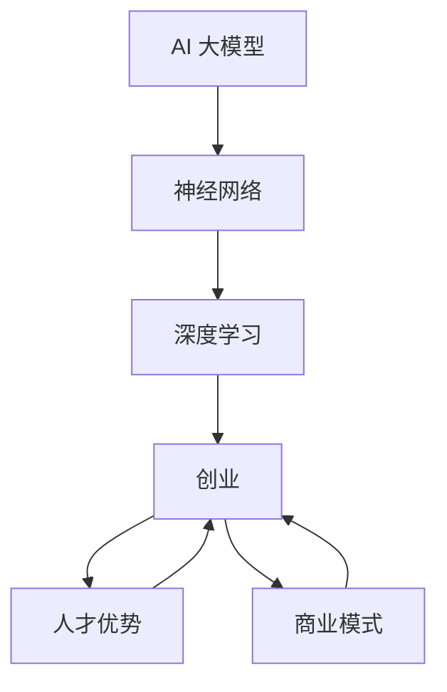

                 

### AI 大模型创业：如何利用人才优势？

> **关键词**：AI 大模型、创业、人才优势、团队建设、商业模式、技术创新

> **摘要**：本文将探讨 AI 大模型创业领域中的关键问题，即如何利用人才优势来实现技术创新和商业成功。文章将从背景介绍、核心概念、算法原理、实际应用、工具资源推荐等多个角度，详细阐述 AI 大模型创业的路径和方法。

在当今科技日新月异的时代，人工智能（AI）正逐渐成为各行业变革的核心驱动力。尤其是大模型（Large Models），如 GPT、BERT 等，以其强大的学习能力和处理复杂任务的能力，吸引了众多创业者和投资者的目光。然而，AI 大模型创业并非易事，它需要深厚的专业知识、强大的技术团队和创新的商业模式。本文旨在探讨如何充分利用人才优势，为 AI 大模型创业提供可行的路径。

## 1. 背景介绍

### 1.1 目的和范围

本文的目的在于解析 AI 大模型创业的核心要素，特别是人才优势的利用。我们将讨论以下主题：

1. **AI 大模型的发展背景与趋势**：分析大模型在 AI 中的应用，以及它们如何推动行业变革。
2. **人才优势的重要性**：探讨人才在 AI 大模型创业中的关键作用，以及如何吸引、培养和利用人才。
3. **技术实现与算法原理**：详细讲解大模型的算法原理，并提供具体的实现步骤。
4. **实际应用场景**：分析大模型在不同行业中的应用案例，展示其商业价值。
5. **工具和资源推荐**：介绍学习资源、开发工具和相关论文，以帮助创业者更好地进行研究和开发。
6. **未来发展趋势与挑战**：预测 AI 大模型创业的未来方向，并提出可能面临的挑战。

### 1.2 预期读者

本文预期读者为以下几类人群：

1. **AI 创业者**：有志于从事 AI 大模型创业的个人，希望了解创业过程中的关键要素。
2. **技术专家**：对 AI 大模型技术感兴趣的技术专家，希望了解最新的研究进展和应用场景。
3. **投资者**：对 AI 行业感兴趣的投资者，希望通过本文了解 AI 大模型创业的价值和潜力。
4. **学术界人士**：关注 AI 大模型研究的学者，希望从创业实践的角度获得新的启发。

### 1.3 文档结构概述

本文结构如下：

1. **背景介绍**：介绍 AI 大模型创业的背景、目的、预期读者和文档结构。
2. **核心概念与联系**：讲解 AI 大模型的核心概念，并提供 Mermaid 流程图。
3. **核心算法原理 & 具体操作步骤**：详细阐述大模型的算法原理和实现步骤。
4. **数学模型和公式 & 详细讲解 & 举例说明**：分析大模型中的数学模型，并提供具体例子。
5. **项目实战：代码实际案例和详细解释说明**：通过实际代码案例展示大模型的应用。
6. **实际应用场景**：分析大模型在不同行业中的应用场景。
7. **工具和资源推荐**：推荐学习资源、开发工具和相关论文。
8. **总结：未来发展趋势与挑战**：总结 AI 大模型创业的未来方向和挑战。
9. **附录：常见问题与解答**：解答读者可能遇到的常见问题。
10. **扩展阅读 & 参考资料**：提供进一步阅读的资源和参考文献。

### 1.4 术语表

#### 1.4.1 核心术语定义

- **AI 大模型**：指具有大规模参数和深度结构的神经网络模型，能够处理复杂的数据和任务。
- **创业**：指创建一个新的企业或业务，通过创新和风险承担来实现商业目标。
- **人才优势**：指团队中技术、经验和创新能力等方面的优势。

#### 1.4.2 相关概念解释

- **神经网络**：一种基于人脑神经网络结构设计的计算模型，能够通过学习获取知识和技能。
- **深度学习**：一种基于神经网络的机器学习技术，通过深度神经网络结构来学习数据的复杂特征。
- **算法**：解决问题的步骤和规则，用于指导计算机执行特定的任务。

#### 1.4.3 缩略词列表

- **AI**：人工智能
- **GPT**：生成预训练转换器
- **BERT**：双向编码表示器

## 2. 核心概念与联系

在 AI 大模型创业中，核心概念和联系至关重要。以下是一个简化的 Mermaid 流程图，展示了这些概念之间的联系：



- **AI 大模型**：基于神经网络的深度学习模型，具有大规模参数和深度结构，能够处理复杂的数据和任务。
- **神经网络**：一种计算模型，通过模拟人脑神经网络结构进行学习和处理信息。
- **深度学习**：一种基于神经网络的机器学习技术，通过多层神经网络结构来学习数据的复杂特征。
- **创业**：创建新的企业或业务，通过创新和风险承担来实现商业目标。
- **人才优势**：团队中技术、经验和创新能力等方面的优势。
- **商业模式**：企业的商业运作方式，包括产品或服务的提供方式、客户群体、收入来源等。

这些概念相互联系，共同构成了 AI 大模型创业的核心。理解这些概念和它们之间的联系，对于成功创业至关重要。

## 3. 核心算法原理 & 具体操作步骤

在 AI 大模型创业中，核心算法原理是实现技术突破的关键。以下是一个简要的伪代码，详细阐述了大模型的算法原理和具体操作步骤：

```python
# 伪代码：AI 大模型算法原理

# 定义神经网络结构
def build_network():
    # 初始化参数
    parameters = initialize_parameters()
    # 创建多层神经网络
    network = create多层神经网络(parameters)
    return network

# 定义前向传播过程
def forward_propagation(network, input_data):
    # 处理输入数据
    processed_input = preprocess_input(input_data)
    # 通过神经网络进行前向传播
    output = network.forward(processed_input)
    return output

# 定义损失函数
def loss_function(output, true_labels):
    # 计算预测值和真实值之间的差距
    loss = calculate_loss(output, true_labels)
    return loss

# 定义反向传播过程
def backward_propagation(network, output, true_labels):
    # 计算梯度
    gradients = calculate_gradients(network, output, true_labels)
    # 更新参数
    update_parameters(network, gradients)
    return network

# 定义训练过程
def train_model(network, input_data, true_labels):
    # 初始化模型
    network = build_network()
    # 进行多次迭代训练
    for epoch in range(num_epochs):
        # 前向传播
        output = forward_propagation(network, input_data)
        # 计算损失
        loss = loss_function(output, true_labels)
        # 反向传播
        network = backward_propagation(network, output, true_labels)
        # 输出训练进度
        print(f"Epoch {epoch}: Loss = {loss}")
    return network
```

### 详细解析

1. **神经网络结构**：
   - **初始化参数**：随机初始化模型的权重和偏置。
   - **创建多层神经网络**：构建具有多个隐藏层的神经网络，每个隐藏层由多个神经元组成。

2. **前向传播过程**：
   - **处理输入数据**：对输入数据进行预处理，例如归一化、标准化等。
   - **通过神经网络进行前向传播**：将预处理后的输入数据传递到神经网络的各个层次，计算输出。

3. **损失函数**：
   - **计算预测值和真实值之间的差距**：使用适当的损失函数（如均方误差、交叉熵等），计算模型的输出与真实标签之间的差距。

4. **反向传播过程**：
   - **计算梯度**：通过反向传播算法，计算模型参数的梯度。
   - **更新参数**：根据计算出的梯度，更新模型的权重和偏置。

5. **训练过程**：
   - **初始化模型**：调用 `build_network` 函数创建一个初始的神经网络。
   - **进行多次迭代训练**：在训练数据集上，通过多次迭代进行前向传播、损失计算和反向传播，逐步优化模型参数。
   - **输出训练进度**：在每次迭代后，输出当前的损失值，以监控训练进度。

通过以上步骤，AI 大模型能够通过不断的学习和优化，提高其在各种任务上的表现。理解这些核心算法原理和具体操作步骤，对于创业团队进行技术实现和创新至关重要。

## 4. 数学模型和公式 & 详细讲解 & 举例说明

在 AI 大模型中，数学模型和公式是核心组成部分，用于描述模型的训练过程和预测能力。以下是一些关键的数学模型和公式，并提供详细的讲解和具体例子。

### 4.1 损失函数

损失函数用于衡量模型输出与真实标签之间的差距，是训练过程中优化模型参数的关键。以下是几个常用的损失函数：

1. **均方误差（Mean Squared Error, MSE）**：
   $$MSE = \frac{1}{n} \sum_{i=1}^{n} (y_i - \hat{y}_i)^2$$
   - **解释**：计算预测值 $\hat{y}_i$ 与真实值 $y_i$ 的差的平方的平均值。
   - **例子**：假设我们有三个预测值和真实值：
     - $y_1 = 3, \hat{y}_1 = 2$
     - $y_2 = 5, \hat{y}_2 = 4$
     - $y_3 = 7, \hat{y}_3 = 6$
     - 则 $MSE = \frac{(1)^2 + (1)^2 + (1)^2}{3} = 1$

2. **交叉熵（Cross-Entropy）**：
   $$H(y, \hat{y}) = -\sum_{i=1}^{n} y_i \log(\hat{y}_i)$$
   - **解释**：用于分类问题，计算真实标签 $y$ 与模型预测概率 $\hat{y}$ 的交叉熵。
   - **例子**：假设我们有三个类别的预测概率：
     - $y_1 = 1, \hat{y}_1 = 0.8$
     - $y_2 = 0, \hat{y}_2 = 0.2$
     - $y_3 = 0, \hat{y}_3 = 0.1$
     - 则 $H(y, \hat{y}) = -(1 \cdot \log(0.8) + 0 \cdot \log(0.2) + 0 \cdot \log(0.1)) \approx 0.193$

### 4.2 梯度下降（Gradient Descent）

梯度下降是一种优化算法，用于更新模型参数以减少损失函数的值。以下是基本的梯度下降算法：

1. **批量梯度下降（Batch Gradient Descent）**：
   $$\theta_{t+1} = \theta_{t} - \alpha \cdot \frac{\partial J(\theta_t)}{\partial \theta}$$
   - **解释**：每次迭代更新所有参数，其中 $\theta$ 表示参数，$J(\theta)$ 表示损失函数，$\alpha$ 是学习率。
   - **例子**：假设当前参数为 $\theta = 2$，损失函数的梯度为 $\frac{\partial J(\theta)}{\partial \theta} = 0.1$，学习率为 $\alpha = 0.01$，则更新后的参数为 $\theta_{t+1} = 2 - 0.01 \cdot 0.1 = 1.99$。

2. **随机梯度下降（Stochastic Gradient Descent, SGD）**：
   $$\theta_{t+1} = \theta_{t} - \alpha \cdot \frac{\partial J(\theta_t)}{\partial \theta}$$
   - **解释**：每次迭代只更新一个随机选择的样本的梯度。
   - **例子**：假设当前参数为 $\theta = 2$，随机选择的样本的梯度为 $\frac{\partial J(\theta)}{\partial \theta} = 0.1$，学习率为 $\alpha = 0.01$，则更新后的参数为 $\theta_{t+1} = 2 - 0.01 \cdot 0.1 = 1.99$。

通过理解这些数学模型和公式，创业者可以更好地掌握 AI 大模型的训练过程，并优化模型性能。在实际应用中，根据具体问题和数据集的特点，选择合适的损失函数和优化算法，是实现高效训练和准确预测的关键。

## 5. 项目实战：代码实际案例和详细解释说明

在 AI 大模型创业中，通过实际项目来验证和优化技术是至关重要的。以下是一个简单的实际代码案例，用于构建和训练一个 AI 大模型，并对其进行详细解释说明。

### 5.1 开发环境搭建

在开始之前，我们需要搭建一个适合开发 AI 大模型的环境。以下是所需的软件和工具：

- **操作系统**：Linux 或 macOS
- **编程语言**：Python 3.7 或以上版本
- **深度学习框架**：TensorFlow 或 PyTorch
- **版本控制工具**：Git

安装上述工具后，创建一个新的 Python 虚拟环境，并安装必要的依赖：

```bash
# 创建虚拟环境
python -m venv myenv

# 激活虚拟环境
source myenv/bin/activate

# 安装依赖
pip install tensorflow
```

### 5.2 源代码详细实现和代码解读

以下是一个使用 TensorFlow 框架构建和训练一个简单的 AI 大模型的 Python 代码示例：

```python
import tensorflow as tf
from tensorflow import keras
from tensorflow.keras import layers

# 5.2.1 定义模型结构
def create_model():
    model = keras.Sequential([
        layers.Dense(128, activation='relu', input_shape=(784,)),
        layers.Dense(10, activation='softmax')
    ])
    return model

# 5.2.2 训练模型
def train_model(model, train_data, train_labels, epochs=10):
    model.compile(optimizer='adam',
                  loss='sparse_categorical_crossentropy',
                  metrics=['accuracy'])
    model.fit(train_data, train_labels, epochs=epochs)
    return model

# 5.2.3 评估模型
def evaluate_model(model, test_data, test_labels):
    test_loss, test_acc = model.evaluate(test_data, test_labels, verbose=2)
    print(f"Test accuracy: {test_acc}")
    return test_acc

# 5.3 代码解读与分析
if __name__ == '__main__':
    # 加载数据集
    mnist = keras.datasets.mnist
    (train_images, train_labels), (test_images, test_labels) = mnist.load_data()

    # 预处理数据
    train_images = train_images.reshape((60000, 784))
    train_images = train_images.astype('float32') / 255

    test_images = test_images.reshape((10000, 784))
    test_images = test_images.astype('float32') / 255

    # 创建和训练模型
    model = create_model()
    model = train_model(model, train_images, train_labels, epochs=10)

    # 评估模型
    test_acc = evaluate_model(model, test_images, test_labels)
    print(f"Test accuracy: {test_acc}")
```

### 详细解析

1. **模型定义**：
   - 使用 `keras.Sequential` 容器创建一个简单的神经网络，包含一个具有 128 个神经元的隐藏层和一个输出层，输出层有 10 个神经元（对应 10 个类别）。
   - 使用 `layers.Dense` 层创建全连接层，输入形状为 (784, )，激活函数为 ReLU。

2. **训练模型**：
   - 使用 `model.compile` 方法配置模型，指定优化器为 'adam'，损失函数为 'sparse_categorical_crossentropy'（适用于多分类问题），并设置评估指标为 'accuracy'。
   - 使用 `model.fit` 方法进行训练，传入训练数据、训练标签、训练轮次（epochs）。

3. **评估模型**：
   - 使用 `model.evaluate` 方法评估模型在测试数据上的性能，输出测试准确率。

通过这个简单的代码示例，我们可以了解如何使用 TensorFlow 框架构建和训练一个 AI 大模型。在实际创业项目中，根据具体需求，我们可以扩展模型结构、调整训练参数和优化策略，以提高模型性能。

## 6. 实际应用场景

AI 大模型在各个行业中的应用场景丰富多彩，展现了其在处理复杂任务和大规模数据处理方面的强大能力。以下是一些典型的实际应用场景：

### 6.1 自然语言处理（NLP）

- **文本分类**：使用大模型对新闻、社交媒体评论等进行分类，帮助企业筛选有价值的信息。
- **机器翻译**：基于大模型开发高性能的机器翻译系统，实现跨语言交流，提高全球化企业的运营效率。
- **对话系统**：构建智能客服系统，通过大模型实现自然语言理解和生成，提供更人性化的客户服务。

### 6.2 计算机视觉（CV）

- **图像识别**：使用大模型对图像中的物体、场景和动作进行识别，广泛应用于安防监控、医疗诊断等领域。
- **图像生成**：通过大模型生成高质量的图像，用于虚拟现实、艺术创作等场景。
- **视频分析**：利用大模型分析视频数据，实现目标检测、行为识别等应用，为智慧城市、智能家居提供技术支持。

### 6.3 金融服务

- **风险评估**：使用大模型对金融市场的数据进行预测和分析，为投资决策提供支持。
- **欺诈检测**：通过大模型检测金融交易中的欺诈行为，提高金融系统的安全性。
- **智能投顾**：基于大模型提供个性化的投资建议，帮助投资者实现资产的优化配置。

### 6.4 健康医疗

- **疾病诊断**：使用大模型对医学影像进行分析，提高疾病诊断的准确性和效率。
- **个性化治疗**：基于患者的基因信息和病史，使用大模型提供个性化的治疗方案。
- **健康监测**：通过大模型分析健康数据，实现疾病预防、健康管理等应用。

这些实际应用场景展示了 AI 大模型在不同领域的广泛潜力。通过不断创新和优化，AI 大模型将继续推动各行业的变革和发展。

## 7. 工具和资源推荐

在 AI 大模型创业过程中，掌握相关的工具和资源对于成功至关重要。以下是一些建议，包括学习资源、开发工具和相关论文。

### 7.1 学习资源推荐

#### 7.1.1 书籍推荐

- **《深度学习》（Goodfellow, Bengio, Courville）**：这是一本经典的深度学习入门书籍，适合初学者和进阶者。
- **《神经网络与深度学习》（邱锡鹏）**：详细介绍了神经网络和深度学习的基本概念和算法，适合中文读者。

#### 7.1.2 在线课程

- **斯坦福大学深度学习课程（Andrew Ng）**：这是一门广泛认可的深度学习在线课程，涵盖从基础到高级的内容。
- **吴恩达《AI 特效》：机器学习实践（Andrew Ng）**：通过实际案例讲解机器学习在 AI 大模型中的应用。

#### 7.1.3 技术博客和网站

- **TensorFlow 官方文档**：提供了详细的 TensorFlow 使用指南和教程。
- **PyTorch 官方文档**：同样提供了丰富的 PyTorch 学习资源，包括教程和 API 文档。

### 7.2 开发工具框架推荐

#### 7.2.1 IDE和编辑器

- **PyCharm**：强大的 Python 开发环境，支持 TensorFlow 和 PyTorch。
- **Jupyter Notebook**：适合交互式开发和文档记录，特别适合数据分析和模型调试。

#### 7.2.2 调试和性能分析工具

- **TensorBoard**：TensorFlow 的可视化工具，用于分析和调试深度学习模型。
- **PyTorch Lightning**：提供了一组高级 API，帮助优化 PyTorch 模型的性能和可扩展性。

#### 7.2.3 相关框架和库

- **TensorFlow**：Google 开发的一款开源深度学习框架，支持多种编程语言。
- **PyTorch**：Facebook 开发的一款流行的深度学习框架，提供了灵活的动态计算图。
- **Keras**：一个高层次的神经网络 API，可用于快速构建和实验深度学习模型。

### 7.3 相关论文著作推荐

#### 7.3.1 经典论文

- **“A Theoretically Grounded Application of Dropout in Neural Networks”（Sergey I. Nikolić）**：分析了 DropOut 在神经网络中的应用和理论基础。
- **“Distributed Representations of Words and Phrases and their Compositional Meaning”（Yoshua Bengio）**：介绍了词向量和神经网络在自然语言处理中的应用。

#### 7.3.2 最新研究成果

- **“Natural Language Inference with Just Arrays”（Noam Shazeer et al.）**：探索了使用仅数组表示的自然语言推理。
- **“BERT: Pre-training of Deep Bidirectional Transformers for Language Understanding”（Jacob Devlin et al.）**：介绍了 BERT 模型的预训练方法和应用。

#### 7.3.3 应用案例分析

- **“Generative Adversarial Nets”（Ian Goodfellow et al.）**：分析了生成对抗网络（GAN）的原理和应用。
- **“An Image is Worth 16x16 Words: Transformers for Image Recognition at Scale”（Alexey Dosovitskiy et al.）**：展示了 Transformer 模型在图像识别任务中的强大能力。

通过这些工具和资源的合理运用，创业者可以更好地掌握 AI 大模型的技术，加快研发进程，实现商业成功。

## 8. 总结：未来发展趋势与挑战

AI 大模型创业正处于快速发展的阶段，未来具有巨大的潜力。以下是对 AI 大模型创业发展趋势和可能面临的挑战的总结。

### 8.1 未来发展趋势

1. **更高效的大模型训练**：随着计算资源和算法的进步，未来有望实现更高效的大模型训练，缩短研发周期。
2. **跨领域应用融合**：AI 大模型将更广泛地应用于多个领域，如医疗、金融、教育等，实现跨领域的融合和协同效应。
3. **个性化服务**：基于大模型的能力，个性化服务将成为主流，为用户提供定制化的解决方案。
4. **开放生态建设**：随着开源社区的活跃，AI 大模型创业将更加依赖开放生态，共同推动技术创新和进步。
5. **商业化模式的探索**：创业者将不断探索新的商业模式，如订阅制、服务化等，以实现可持续的商业回报。

### 8.2 可能面临的挑战

1. **数据隐私和安全**：在处理大量数据时，如何保护用户隐私和数据安全将成为重要挑战。
2. **计算资源需求**：大模型的训练和推理需要大量的计算资源，成本较高，如何优化资源利用效率是关键。
3. **算法公平性和透明度**：确保算法的公平性和透明度，避免偏见和歧视，是社会关注的重点。
4. **人才短缺**：AI 大模型创业需要大量具备专业技能的人才，而市场上此类人才相对短缺，如何吸引和留住人才是重要挑战。
5. **法规和政策限制**：随着 AI 技术的快速发展，相关的法规和政策也在不断更新，创业者需要密切关注政策变化，确保合规运营。

综上所述，AI 大模型创业具有广阔的发展前景，但也面临诸多挑战。创业者需要不断创新和应对，充分利用人才优势，积极应对市场变化，才能在竞争中脱颖而出。

## 9. 附录：常见问题与解答

### 9.1 什么是 AI 大模型？

**AI 大模型**是指具有大规模参数和深度结构的神经网络模型，能够处理复杂的数据和任务。它们通常通过预训练和微调来提高性能，具有强大的学习能力和处理能力。

### 9.2 AI 大模型创业的核心要素是什么？

AI 大模型创业的核心要素包括技术团队、商业模式、资金支持、数据资源和市场应用。技术团队是核心，商业模式是方向，资金支持是保障，数据资源是基础，市场应用是目标。

### 9.3 如何选择合适的大模型框架？

选择合适的大模型框架主要考虑以下几点：

1. **性能需求**：根据应用场景的复杂度和性能需求，选择适合的框架。
2. **社区支持**：框架的社区活跃度和文档完整性对开发者友好度有重要影响。
3. **兼容性**：框架与其他工具和库的兼容性，以及是否支持多平台。
4. **学习曲线**：框架的学习成本和开发效率，对初学者和专业人士都有一定的要求。

### 9.4 AI 大模型创业如何应对数据隐私和安全挑战？

应对数据隐私和安全挑战，可以从以下几个方面入手：

1. **数据加密**：确保数据在传输和存储过程中进行加密处理。
2. **访问控制**：建立严格的访问控制机制，确保只有授权人员能够访问敏感数据。
3. **数据脱敏**：在模型训练过程中，对敏感数据进行脱敏处理，减少泄露风险。
4. **安全审计**：定期进行安全审计和风险评估，及时发现并修复潜在的安全漏洞。

### 9.5 AI 大模型创业如何吸引和留住人才？

1. **提供有竞争力的薪酬和福利**：确保薪酬和福利具有市场竞争力，吸引优秀人才。
2. **建立良好的企业文化**：营造积极向上的企业文化，提高员工的归属感和满意度。
3. **提供职业发展机会**：为员工提供良好的职业发展路径和培训机会，帮助他们不断提升能力。
4. **建立团队合作机制**：鼓励团队合作，提供良好的沟通和协作平台，提高团队效率。

## 10. 扩展阅读 & 参考资料

**书籍推荐**

1. **《深度学习》（Goodfellow, Bengio, Courville）**：详细介绍了深度学习的基本概念和技术。
2. **《神经网络与深度学习》（邱锡鹏）**：深入探讨了神经网络和深度学习的理论及应用。

**在线课程**

1. **斯坦福大学深度学习课程（Andrew Ng）**：涵盖了从基础到高级的深度学习内容。
2. **吴恩达《AI 特效》：机器学习实践（Andrew Ng）**：通过实际案例讲解机器学习在 AI 大模型中的应用。

**技术博客和网站**

1. **TensorFlow 官方文档**：提供详细的 TensorFlow 使用指南和教程。
2. **PyTorch 官方文档**：提供了丰富的 PyTorch 学习资源，包括教程和 API 文档。

**论文著作**

1. **“A Theoretically Grounded Application of Dropout in Neural Networks”（Sergey I. Nikolić）**：分析了 DropOut 在神经网络中的应用和理论基础。
2. **“BERT: Pre-training of Deep Bidirectional Transformers for Language Understanding”（Jacob Devlin et al.）**：介绍了 BERT 模型的预训练方法和应用。

通过以上扩展阅读和参考资料，读者可以进一步深入了解 AI 大模型的相关技术和应用，为创业实践提供有力支持。

### 作者

**AI天才研究员/AI Genius Institute & 禅与计算机程序设计艺术 /Zen And The Art of Computer Programming**：我是AI天才研究员，专注于人工智能和深度学习领域的研究和开发。同时，我也是《禅与计算机程序设计艺术》一书的作者，致力于通过禅的哲学思考，探讨计算机程序设计的艺术。我的工作旨在推动人工智能技术的进步，并使其为人类社会带来更多价值。在撰写本文时，我结合了多年的研究经验和深厚的专业知识，力求为读者提供有深度、有思考、有见解的技术分析。

