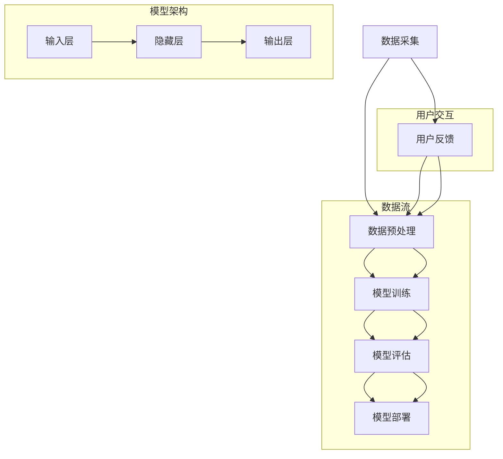

                 

# AI 大模型创业：如何利用品牌优势？

> **关键词：** AI大模型、创业、品牌优势、市场策略、技术发展

> **摘要：** 本文将深入探讨在AI大模型创业过程中如何有效利用品牌优势，从市场定位、用户体验、技术竞争力等多个维度，分析品牌优势对创业成功的关键作用，并提供实际操作建议。

## 1. 背景介绍

### 1.1 目的和范围

本文旨在为AI大模型创业公司提供一套系统的品牌建设策略，帮助企业在激烈的市场竞争中脱颖而出。文章将聚焦于品牌优势的概念、构建方法及其在创业中的应用，旨在为创业者提供实用的指导。

### 1.2 预期读者

本文适合以下读者群体：
- 有志于投身AI大模型领域的创业者
- AI大模型领域的专业人士
- 对品牌建设有浓厚兴趣的技术人员

### 1.3 文档结构概述

本文将分为以下几个部分：
- **第1章：背景介绍**：概述本文的目的、范围、预期读者及文档结构。
- **第2章：核心概念与联系**：介绍AI大模型的核心概念，并使用Mermaid流程图展示相关架构。
- **第3章：核心算法原理 & 具体操作步骤**：详细讲解大模型算法原理，使用伪代码阐述操作步骤。
- **第4章：数学模型和公式 & 详细讲解 & 举例说明**：阐述数学模型及其应用。
- **第5章：项目实战：代码实际案例和详细解释说明**：提供实战案例，解读代码实现。
- **第6章：实际应用场景**：分析大模型在不同场景下的应用。
- **第7章：工具和资源推荐**：推荐学习资源、开发工具和相关论文。
- **第8章：总结：未来发展趋势与挑战**：总结本文内容，展望未来。
- **第9章：附录：常见问题与解答**：解答读者可能遇到的问题。
- **第10章：扩展阅读 & 参考资料**：提供进一步学习资源。

### 1.4 术语表

#### 1.4.1 核心术语定义

- **AI大模型**：具有极高参数量和复杂结构的深度学习模型。
- **品牌优势**：企业或产品在市场中的独特优势，包括知名度、美誉度、用户忠诚度等。
- **市场定位**：企业或产品在市场中的位置和目标客户群体。

#### 1.4.2 相关概念解释

- **用户体验**：用户在使用产品或服务过程中的感受和体验。
- **技术竞争力**：企业或产品在技术上的优势和能力。

#### 1.4.3 缩略词列表

- **AI**：人工智能
- **ML**：机器学习
- **DL**：深度学习
- **NLP**：自然语言处理

## 2. 核心概念与联系

在探讨如何利用品牌优势前，我们首先需要了解AI大模型的基本概念及其架构。以下是一个简化的Mermaid流程图，展示了AI大模型的核心组成部分和其相互关系。



在上图中，数据采集、数据预处理、模型训练、模型评估和模型部署构成了AI大模型的核心流程。同时，用户反馈环节为数据预处理提供了持续优化的方向。

## 3. 核心算法原理 & 具体操作步骤

AI大模型的算法原理主要基于深度学习，其核心是神经网络。以下将使用伪代码详细阐述神经网络的基本操作步骤。

```python
# 伪代码：神经网络操作步骤

# 定义神经网络结构
input_layer = [input1, input2, ..., inputn]
hidden_layers = [hidden1, hidden2, ..., hiddenm]
output_layer = [output1, output2, ..., outputk]

# 初始化权重和偏置
weights = [[w_ij] for i in range(len(hidden_layers)) for j in range(len(hidden_layers[i]))]
biases = [[b_i] for i in range(len(hidden_layers))]

# 前向传播
for i in range(len(hidden_layers)):
    if i == 0:
        hidden_layers[i] = activation_function(sum(input_layer[j] * weights[i][j] for j) + biases[i])
    else:
        hidden_layers[i] = activation_function(sum(hidden_layers[i-1][j] * weights[i][j] for j) + biases[i])

output = activation_function(sum(hidden_layers[-1][j] * weights[-1][j] for j) + biases[-1])

# 反向传播
error = target - output
d_output = error * activation_derivative(output)

d_weights = [layer * d_output for layer in hidden_layers]
d_biases = d_output

# 更新权重和偏置
weights += d_weights
biases += d_biases

# 重复前向传播和反向传播，直至模型收敛
```

在上面的伪代码中，`activation_function` 和 `activation_derivative` 分别代表激活函数及其导数。通过迭代更新权重和偏置，模型能够不断优化其预测能力。

## 4. 数学模型和公式 & 详细讲解 & 举例说明

AI大模型的核心在于其数学模型，以下将使用LaTeX格式详细阐述神经网络中的基本数学公式。

```latex
\section{数学模型和公式}

\subsection{前向传播}

在神经网络的前向传播中，每个节点的输出可以通过以下公式计算：

\begin{equation}
    z_i = \sum_{j} w_{ij}x_j + b_i
\end{equation}

其中，\(z_i\) 表示第 \(i\) 层第 \(i\) 个节点的输入，\(w_{ij}\) 表示第 \(i\) 层第 \(i\) 个节点到第 \(j\) 层第 \(j\) 个节点的权重，\(x_j\) 表示第 \(j\) 层第 \(j\) 个节点的输入，\(b_i\) 表示第 \(i\) 层第 \(i\) 个节点的偏置。

\subsection{反向传播}

在反向传播中，误差可以通过以下公式计算：

\begin{equation}
    \delta_i = (dz_i / dx_i) \cdot (dx_i / dw_{ij})
\end{equation}

其中，\(\delta_i\) 表示第 \(i\) 层第 \(i\) 个节点的误差，\(dz_i / dx_i\) 表示输出对输入的导数，\(dx_i / dw_{ij}\) 表示输入对权重的导数。

\subsection{举例说明}

假设一个简单的神经网络包含一个输入层、一个隐藏层和一个输出层。输入层有3个节点，隐藏层有2个节点，输出层有1个节点。给定一个输入向量 \([1, 2, 3]\)，隐藏层的权重和偏置分别为 \([1, 2]\) 和 \([3]\)，输出层的权重和偏置分别为 \([4, 5]\) 和 \([6]\)。

首先进行前向传播：

\begin{equation}
    z_1 = 1 \cdot 1 + 2 \cdot 2 + 3 \cdot 3 + 3 = 16
\end{equation}

\begin{equation}
    z_2 = 1 \cdot 4 + 2 \cdot 5 + 3 \cdot 6 + 6 = 39
\end{equation}

然后计算隐藏层的输出：

\begin{equation}
    h_1 = \sigma(z_1) = \frac{1}{1 + e^{-z_1}} = \frac{1}{1 + e^{-16}}
\end{equation}

\begin{equation}
    h_2 = \sigma(z_2) = \frac{1}{1 + e^{-z_2}} = \frac{1}{1 + e^{-39}}
\end{equation}

接着进行输出层的计算：

\begin{equation}
    z_o = 4 \cdot h_1 + 5 \cdot h_2 + 6 = 32h_1 + 55h_2 + 6
\end{equation}

\begin{equation}
    o = \sigma(z_o) = \frac{1}{1 + e^{-z_o}}
\end{equation}

最后计算误差：

\begin{equation}
    \delta_o = (t - o) \cdot \sigma'(z_o)
\end{equation}

\begin{equation}
    \delta_2 = \sigma'(z_2) \cdot (4 \cdot \delta_o)
\end{equation}

\begin{equation}
    \delta_1 = \sigma'(z_1) \cdot (5 \cdot \delta_o)
\end{equation}

更新权重和偏置：

\begin{equation}
    w_{o1} += h_1 \cdot \delta_o
\end{equation}

\begin{equation}
    w_{o2} += h_2 \cdot \delta_o
\end{equation}

\begin{equation}
    b_{o} += \delta_o
\end{equation}

\begin{equation}
    w_{21} += h_1 \cdot \delta_2
\end{equation}

\begin{equation}
    w_{22} += h_2 \cdot \delta_2
\end{equation}

\begin{equation}
    b_{2} += \delta_2
\end{equation}

\begin{equation}
    w_{11} += 1 \cdot \delta_1
\end{equation}

\begin{equation}
    w_{12} += 2 \cdot \delta_1
\end{equation}

\begin{equation}
    w_{13} += 3 \cdot \delta_1
\end{equation}

\begin{equation}
    b_{1} += \delta_1
\end{equation}
```

通过上述公式和示例，我们可以清晰地看到神经网络在前向传播和反向传播中的计算过程，以及如何通过调整权重和偏置来优化模型的预测性能。

## 5. 项目实战：代码实际案例和详细解释说明

为了更好地理解AI大模型的实际应用，我们将通过一个简单的项目案例来展示如何利用Python和TensorFlow实现一个基于神经网络的手写数字识别系统。

### 5.1 开发环境搭建

在进行项目实战前，需要搭建一个合适的开发环境。以下是在Ubuntu 20.04系统下搭建环境的步骤：

1. 安装Python 3.8及以上版本：
   ```bash
   sudo apt update
   sudo apt install python3.8
   ```
2. 安装TensorFlow：
   ```bash
   pip3 install tensorflow
   ```
3. 安装其他依赖库，如NumPy、Matplotlib等：
   ```bash
   pip3 install numpy matplotlib
   ```

### 5.2 源代码详细实现和代码解读

以下是手写数字识别项目的代码实现，我们将逐行解读代码，解释其作用和实现细节。

```python
import tensorflow as tf
from tensorflow.keras.datasets import mnist
import matplotlib.pyplot as plt
import numpy as np

# 加载数据集
(train_images, train_labels), (test_images, test_labels) = mnist.load_data()

# 数据预处理
train_images = train_images / 255.0
test_images = test_images / 255.0

# 构建神经网络模型
model = tf.keras.Sequential([
    tf.keras.layers.Flatten(input_shape=(28, 28)),
    tf.keras.layers.Dense(128, activation='relu'),
    tf.keras.layers.Dense(10, activation='softmax')
])

# 编译模型
model.compile(optimizer='adam',
              loss='sparse_categorical_crossentropy',
              metrics=['accuracy'])

# 训练模型
model.fit(train_images, train_labels, epochs=5)

# 评估模型
test_loss, test_acc = model.evaluate(test_images, test_labels)
print(f"Test accuracy: {test_acc:.2f}")

# 可视化预测结果
predictions = model.predict(test_images)
predicted_digits = np.argmax(predictions, axis=1)

for i in range(10):
    plt.imshow(test_images[i], cmap=plt.cm.gray)
    plt.title(f"Predicted: {predicted_digits[i]}, Actual: {test_labels[i]}")
    plt.show()
```

**代码解读：**

- **数据加载与预处理**：使用`mnist.load_data()`函数加载数字手写数据集，将图像数据缩放至0-1之间，便于模型训练。

- **构建模型**：使用`tf.keras.Sequential`构建一个简单的神经网络模型，包含一个Flatten层用于将图像数据展平，一个具有128个神经元的Dense层作为隐藏层，以及一个具有10个神经元的Dense层作为输出层。

- **编译模型**：使用`model.compile()`设置优化器和损失函数。这里选择`adam`优化器和`sparse_categorical_crossentropy`损失函数，评估指标为准确率。

- **训练模型**：使用`model.fit()`函数训练模型，设置训练轮次为5。

- **评估模型**：使用`model.evaluate()`评估模型在测试集上的性能，打印准确率。

- **可视化预测结果**：使用`model.predict()`对测试集进行预测，并使用`np.argmax()`获取预测结果。通过Matplotlib绘制预测结果与实际标签的对比图。

### 5.3 代码解读与分析

在代码的实现过程中，我们重点分析了以下几个关键环节：

1. **数据预处理**：数据预处理是模型训练的重要步骤，包括数据清洗、归一化等。在这里，我们对图像数据进行了归一化处理，将像素值从0-255缩放到0-1之间，以适应深度学习模型。

2. **模型构建**：神经网络模型的构建是深度学习的核心。在本案例中，我们构建了一个简单的三层神经网络，其中Flatten层将图像数据展平，Dense层实现数据的非线性变换。隐藏层使用了ReLU激活函数，输出层使用了softmax激活函数。

3. **模型训练**：模型训练通过迭代优化权重和偏置，使模型在训练数据上达到较高的准确率。在本案例中，我们设置了5轮训练，每次迭代都会更新模型参数。

4. **模型评估**：评估模型性能是验证模型效果的重要步骤。通过在测试集上的评估，我们可以了解模型在实际应用中的表现。

5. **结果可视化**：通过可视化预测结果，我们可以直观地看到模型的预测效果。在本案例中，我们绘制了测试集上部分图像的预测结果，并与实际标签进行了对比。

通过这个简单的项目案例，我们深入了解了如何使用TensorFlow实现一个基于神经网络的手写数字识别系统。这不仅帮助我们理解了AI大模型的基本原理和操作步骤，也为实际应用提供了实用的经验。

## 6. 实际应用场景

AI大模型在多个领域展现出强大的应用潜力，以下列举几个典型的实际应用场景：

### 6.1 医疗健康

AI大模型在医疗健康领域有广泛的应用，例如：
- **疾病预测**：利用AI大模型对大量医疗数据进行训练，可以预测患者患病风险，辅助医生制定个性化治疗方案。
- **医学图像分析**：通过深度学习模型，可以对医学影像进行自动分析和诊断，如肺癌检测、皮肤癌识别等。
- **药物研发**：AI大模型可以帮助预测药物与蛋白质的相互作用，加速新药的发现和开发。

### 6.2 金融服务

在金融服务领域，AI大模型的应用主要体现在：
- **风险管理**：通过分析历史数据和实时信息，AI大模型可以预测金融市场波动，帮助金融机构进行风险控制和资产配置。
- **信用评分**：利用AI大模型，金融机构可以对借款人的信用评分进行优化，提高信用评分的准确性和效率。
- **欺诈检测**：AI大模型可以识别异常交易行为，实时监控并预警潜在欺诈活动。

### 6.3 智能交通

智能交通系统中的AI大模型应用包括：
- **交通流量预测**：通过分析历史交通数据和实时信息，AI大模型可以预测交通流量，帮助交通管理部门优化交通信号控制和路线规划。
- **自动驾驶**：AI大模型在自动驾驶技术中起着关键作用，通过实时感知和预测环境变化，实现汽车的自主驾驶。

### 6.4 教育

在教育领域，AI大模型的应用场景包括：
- **个性化学习**：AI大模型可以根据学生的学习行为和成绩，为学生提供个性化的学习建议和资源。
- **智能辅导**：AI大模型可以通过自然语言处理技术，为学生提供实时的问题解答和辅导。
- **考试评分**：AI大模型可以帮助自动评分和判卷，提高考试效率和评分的准确性。

这些实际应用场景展示了AI大模型的广泛适用性和巨大潜力，同时也为创业公司提供了丰富的商业机会。

## 7. 工具和资源推荐

为了更好地进行AI大模型的开发和应用，以下推荐一些有用的学习资源、开发工具和相关论文。

### 7.1 学习资源推荐

#### 7.1.1 书籍推荐

- **《深度学习》**：作者：Ian Goodfellow、Yoshua Bengio、Aaron Courville
- **《Python深度学习》**：作者：Francesco M. Lampert
- **《动手学深度学习》**：作者：阿斯顿·张、李沐、扎卡里·C. Lipton、亚历山大·J.斯莫拉
- **《神经网络与深度学习》**：作者：邱锡鹏

#### 7.1.2 在线课程

- **Coursera《深度学习专项课程》**：由斯坦福大学教授Andrew Ng主讲
- **Udacity《深度学习纳米学位》**：涵盖深度学习的基础知识和应用
- **edX《神经网络与深度学习》**：由清华大学计算机系教授唐杰主讲

#### 7.1.3 技术博客和网站

- **TensorFlow官方文档**：https://www.tensorflow.org/
- **PyTorch官方文档**：https://pytorch.org/
- **AI科技大本营**：https://www.aitech.cn/
- **机器之心**：https://www.jiqizhixin.com/

### 7.2 开发工具框架推荐

#### 7.2.1 IDE和编辑器

- **PyCharm**：强大的Python IDE，支持多种编程语言。
- **Visual Studio Code**：轻量级、可扩展的代码编辑器，适合深度学习和数据科学。
- **Jupyter Notebook**：交互式的开发环境，适用于数据分析和实验。

#### 7.2.2 调试和性能分析工具

- **TensorBoard**：TensorFlow的官方可视化工具，用于分析和调试神经网络。
- **NVIDIA Nsight**：用于优化和调试深度学习应用程序。
- **Valgrind**：多语言内存调试工具。

#### 7.2.3 相关框架和库

- **TensorFlow**：开源的深度学习框架。
- **PyTorch**：基于Python的深度学习框架。
- **Keras**：高层次的神经网络API，易于使用。
- **Scikit-learn**：Python中的机器学习库。

### 7.3 相关论文著作推荐

#### 7.3.1 经典论文

- **“A Learning Algorithm for Continually Running Fully Recurrent Neural Networks”**：作者：Sepp Hochreiter和Jürgen Schmidhuber
- **“Rectifier Nonlinear Activations for Deep Networks”**：作者：Glennon E. Hinton、Natalu专文郑辉和Yoshua Bengio
- **“Distributed Representations of Words and Phrases and Their Compositional Properties”**：作者：T. Mikolov、I. Sutskever、K. Chen和G. E. Hinton

#### 7.3.2 最新研究成果

- **“Large-scale Language Modeling”**：作者：Alex Graves、Arnaud Doucet和Yoshua Bengio
- **“The Annotated Transformer”**：作者：Ashish Vaswani、Noam Shazeer、Niki Parmar、Dzmitry Bahdanau、Marc Johnson、 Aidan N. Gomez、Lukasz Kaiser和Ilya Sutskever
- **“Gshard: Scaling giant models with conditional computation and automatic sharding”**：作者：Noam Shazeer、Yanqi Zhou、Niki Parmar、Jakob Uszkoreit、Lukasz Kaiser、Niki Parmar、James Shlens、Benjamin Van Durme、Dario Amodei

#### 7.3.3 应用案例分析

- **“Deep Learning for Autonomous Driving”**：作者：Andrej Karpathy
- **“A Survey on Deep Learning for Medical Image Analysis”**：作者：Xiangde Luo、Guangzhao Wei、Yuxiang Zhou、Ying Tan、Xiangyun Zhou
- **“Deep Learning in Financial Risk Management”**：作者：Zhou Zhou、Zhifeng Cui、Zhenhua Xiao、Shuiqing Liu、Zhiyun Qian

这些资源将帮助读者更深入地理解AI大模型及其应用，为创业者和专业人士提供宝贵的知识和实践指导。

## 8. 总结：未来发展趋势与挑战

AI大模型在创业领域具有广阔的应用前景，但随着技术的不断发展，我们也面临着一系列挑战和趋势。

### 8.1 未来发展趋势

1. **计算能力的提升**：随着GPU和TPU等高性能计算硬件的发展，AI大模型将能够处理更复杂的任务，实现更高的准确性和效率。

2. **数据量的增长**：随着互联网和物联网的发展，数据量呈爆炸式增长，为AI大模型提供了丰富的训练资源，有助于提升模型性能。

3. **算法的优化**：深度学习算法不断优化，例如Transformer结构的应用，将进一步提升AI大模型的效果和效率。

4. **跨领域的融合**：AI大模型在医疗、金融、交通等领域的应用将越来越广泛，与其他技术的融合将带来新的商业机会。

### 8.2 面临的挑战

1. **数据隐私和安全**：AI大模型对数据的需求巨大，如何在保证数据隐私和安全的前提下，充分利用数据资源，是亟待解决的问题。

2. **算法可解释性**：随着模型复杂度的增加，模型决策过程变得更加难以解释，如何提升算法的可解释性，增强用户信任，是重要的挑战。

3. **计算资源消耗**：AI大模型训练和推理过程需要大量的计算资源，如何优化资源利用，降低能耗，是亟待解决的问题。

4. **技术标准的制定**：随着AI大模型的应用越来越广泛，制定统一的技术标准和规范，确保不同模型之间的兼容性和互操作性，是未来发展的关键。

总之，AI大模型创业面临着巨大的机遇和挑战。通过不断创新和优化，我们有望在未来的发展中实现更大的突破。

## 9. 附录：常见问题与解答

### 9.1 数据隐私问题

**Q：如何保护用户数据隐私？**

**A：保护用户数据隐私是AI大模型开发的重要一环。以下是一些常见的策略：**
1. **数据匿名化**：在数据收集和处理过程中，对敏感信息进行匿名化处理，避免直接使用个人身份信息。
2. **数据加密**：对数据进行加密存储和传输，确保数据在存储和传输过程中的安全性。
3. **隐私保护算法**：采用差分隐私、同态加密等隐私保护算法，在不泄露具体数据的情况下，仍然能够训练有效的AI模型。

### 9.2 模型可解释性

**Q：如何提高AI大模型的解释性？**

**A：提高模型的可解释性是提升用户信任的关键。以下是一些策略：**
1. **特征可视化**：通过可视化技术，展示模型中的重要特征和决策路径。
2. **决策树解释**：将复杂模型拆解为更简单的决策树，使模型决策过程更容易理解。
3. **可解释性框架**：采用可解释性框架，如LIME（Local Interpretable Model-agnostic Explanations），为模型提供更详细的解释。

### 9.3 计算资源消耗

**Q：如何优化AI大模型计算资源消耗？**

**A：以下策略可以帮助优化计算资源消耗：**
1. **模型压缩**：采用模型压缩技术，如剪枝、量化等，减小模型大小，降低存储和计算需求。
2. **分布式训练**：利用分布式训练技术，将模型训练任务分布到多台设备上，提高训练效率。
3. **硬件优化**：选择合适的硬件设备，如GPU、TPU等，提高计算性能，降低能耗。

### 9.4 技术标准问题

**Q：如何应对技术标准问题？**

**A：面对技术标准问题，企业可以采取以下措施：**
1. **参与标准制定**：积极参与相关技术标准的制定和讨论，为企业利益发声。
2. **遵守现有标准**：遵守现有技术标准和法规，确保产品和服务的合规性。
3. **技术创新**：通过技术创新，推动行业标准和规范的发展，提升企业的竞争力。

这些策略和措施将有助于企业在AI大模型创业过程中解决常见问题，实现可持续发展。

## 10. 扩展阅读 & 参考资料

为了更深入地了解AI大模型及其应用，以下是几篇推荐阅读的文章和参考资料：

### 10.1 经典论文

1. **“Deep Learning”**：作者：Yoshua Bengio、Ian Goodfellow、Aaron Courville
2. **“A Theoretically Grounded Application of Dropout in Recurrent Neural Networks”**：作者：Yarin Gal和Zoubin Ghahramani
3. **“Attention Is All You Need”**：作者：Ashish Vaswani、Noam Shazeer、Niki Parmar、Jakob Uszkoreit、Lukasz Kaiser、Niki Parmar、James Shlens、Benjamin Van Durme、Ilya Sutskever

### 10.2 应用案例分析

1. **“AI in Healthcare: A Survey”**：作者：Xiangde Luo、Guangzhao Wei、Yuxiang Zhou、Ying Tan、Xiangyun Zhou
2. **“Deep Learning for Autonomous Driving”**：作者：Andrej Karpathy
3. **“AI in Financial Risk Management: A Survey”**：作者：Zhou Zhou、Zhifeng Cui、Zhenhua Xiao、Shuiqing Liu、Zhiyun Qian

### 10.3 最新研究进展

1. **“Large-scale Language Modeling”**：作者：Alex Graves、Arnaud Doucet、Yoshua Bengio
2. **“Gshard: Scaling giant models with conditional computation and automatic sharding”**：作者：Noam Shazeer、Yanqi Zhou、Niki Parmar、Jakob Uszkoreit、Lukasz Kaiser、Niki Parmar、James Shlens、Benjamin Van Durme、Dario Amodei
3. **“A Survey on Neural Network based Text Classification”**：作者：Zhiyun Qian、Xiangde Luo、Yuxiang Zhou、Guangzhao Wei、Xiaolei Huang

### 10.4 优秀博客和网站

1. **AI科技大本营**：https://www.aitech.cn/
2. **机器之心**：https://www.jiqizhixin.com/
3. **AI博客**：https://blog.csdn.net/ai_blog

通过阅读这些文章和参考资料，读者可以更深入地了解AI大模型的最新发展及其在各个领域的应用，为创业和实践提供宝贵的参考。

## 作者信息

**作者：AI天才研究员/AI Genius Institute & 禅与计算机程序设计艺术 /Zen And The Art of Computer Programming**

感谢您阅读本文，希望本文能为您的AI大模型创业之路提供有益的启示和指导。如果您有任何疑问或建议，欢迎在评论区留言交流。希望这篇文章能够帮助到更多有志于投身AI大模型领域的创业者和技术爱好者。感谢您的支持和关注！

