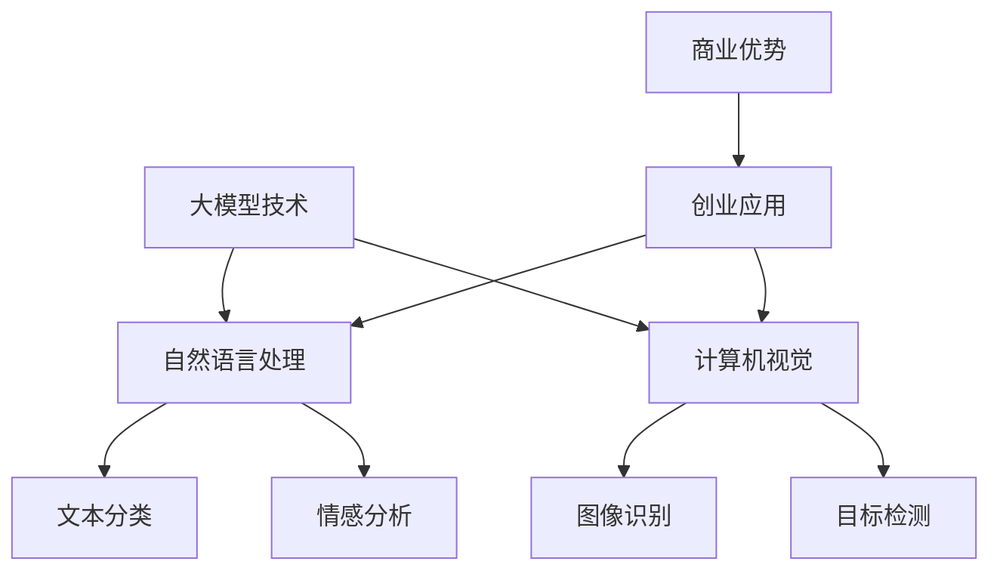

                 

# AI 大模型创业：如何利用商业优势？

> 关键词：人工智能、大模型、创业、商业优势、市场策略、技术路线、投资机会

> 摘要：随着人工智能技术的不断进步，大模型（如GPT、BERT等）在自然语言处理、计算机视觉等领域展现出巨大的潜力。本文旨在探讨大模型在创业领域中的应用，分析其商业优势，并提供具体的创业策略和投资建议，帮助创业者抓住这一新兴领域的机遇。

## 1. 背景介绍

### 1.1 目的和范围

本文的目标是分析大模型在创业领域的商业优势，探讨如何利用这些优势实现商业成功。本文将涵盖以下主要内容：

- 大模型的基本概念和原理；
- 大模型在创业中的应用场景；
- 创业者如何利用大模型的商业优势；
- 投资者如何评估和投资大模型创业项目。

### 1.2 预期读者

本文适用于以下读者群体：

- 创业者：希望了解大模型在创业中的应用，掌握利用大模型实现商业成功的策略；
- 投资者：希望了解大模型创业领域的投资机会，评估和投资具有潜力的项目；
- 研究人员：希望了解大模型在创业中的应用趋势和研究方向；
- 对人工智能技术感兴趣的读者：希望了解大模型技术的基本原理和应用场景。

### 1.3 文档结构概述

本文分为十个部分，具体结构如下：

1. 背景介绍
2. 核心概念与联系
3. 核心算法原理 & 具体操作步骤
4. 数学模型和公式 & 详细讲解 & 举例说明
5. 项目实战：代码实际案例和详细解释说明
6. 实际应用场景
7. 工具和资源推荐
8. 总结：未来发展趋势与挑战
9. 附录：常见问题与解答
10. 扩展阅读 & 参考资料

### 1.4 术语表

#### 1.4.1 核心术语定义

- 大模型：指具有海量参数、复杂结构的深度学习模型，如GPT、BERT等；
- 自然语言处理（NLP）：指计算机对自然语言文本进行处理、分析和理解的技术；
- 计算机视觉（CV）：指计算机对图像和视频进行处理、分析和理解的技术；
- 创业：指创业者创立和经营自己的企业；
- 商业优势：指企业在市场竞争中所具有的独特优势。

#### 1.4.2 相关概念解释

- 深度学习：一种人工智能方法，通过构建多层神经网络对大量数据进行训练，从而实现自动化特征提取和模式识别；
- 机器学习：一种人工智能方法，通过训练数据集来优化模型参数，实现预测和分类等功能；
- 人工智能（AI）：一种模拟人类智能的技术，包括机器学习、深度学习、自然语言处理、计算机视觉等多个领域。

#### 1.4.3 缩略词列表

- GPT：Generative Pre-trained Transformer，一种基于Transformer架构的预训练语言模型；
- BERT：Bidirectional Encoder Representations from Transformers，一种基于Transformer架构的双向编码表示模型；
- NLP：自然语言处理；
- CV：计算机视觉；
- AI：人工智能。

## 2. 核心概念与联系

在探讨大模型在创业中的应用之前，我们需要了解一些核心概念和它们之间的关系。以下是相关的Mermaid流程图：



### 2.1 大模型技术

大模型技术是指具有海量参数、复杂结构的深度学习模型，如GPT、BERT等。这些模型通过在大规模数据集上进行预训练，可以自动化地学习文本和图像的复杂模式，为各种应用提供强大的基础。

### 2.2 自然语言处理（NLP）

自然语言处理（NLP）是人工智能的一个重要分支，旨在使计算机能够理解和处理人类语言。大模型技术在NLP中的应用主要包括：

- 文本分类：将文本数据分为不同的类别，如新闻分类、情感分类等；
- 情感分析：分析文本中的情感倾向，如正面情感、负面情感等。

### 2.3 计算机视觉（CV）

计算机视觉（CV）是人工智能的另一个重要分支，旨在使计算机能够理解和解释视觉信息。大模型技术在CV中的应用主要包括：

- 图像识别：识别图像中的对象和场景，如人脸识别、图像分类等；
- 目标检测：在图像中定位和识别对象的位置和边界，如自动驾驶车辆的目标检测等。

### 2.4 创业应用

大模型技术在创业中的应用非常广泛，涵盖了多个领域。创业者可以利用大模型技术实现以下应用：

- 智能客服：利用NLP技术实现自动化的客户服务；
- 智能广告：利用CV技术实现精准的广告投放；
- 智能医疗：利用NLP和CV技术实现医学图像分析和病历分析。

### 2.5 商业优势

大模型技术为创业带来了以下商业优势：

- 精准的预测和分析：大模型技术可以处理大量数据，实现精准的预测和分析；
- 简化的开发流程：大模型技术可以自动学习特征，简化开发流程；
- 竞争优势：拥有先进技术的大模型企业可以在市场中获得竞争优势。

## 3. 核心算法原理 & 具体操作步骤

### 3.1 大模型技术的基本原理

大模型技术，如GPT、BERT等，基于深度学习中的Transformer架构。以下是一个简化的算法原理描述：

```plaintext
算法：Transformer预训练

输入：大规模文本数据集
输出：预训练的Transformer模型

步骤：
1. 数据预处理：对文本数据进行清洗、分词、编码等操作；
2. 构建Transformer模型：包括自注意力机制、前馈网络等；
3. 预训练：在大量文本数据上进行预训练，学习文本的表示和语言规律；
4. 微调：在特定任务上对模型进行微调，提高任务性能；
5. 应用：将预训练的模型应用到各种自然语言处理任务中。
```

### 3.2 自然语言处理（NLP）的应用步骤

以下是自然语言处理（NLP）在文本分类任务中的具体操作步骤：

```plaintext
算法：文本分类

输入：预训练的Transformer模型、标注好的文本数据集
输出：分类结果

步骤：
1. 数据预处理：对文本数据进行清洗、分词、编码等操作；
2. 模型加载：加载预训练的Transformer模型；
3. 模型预测：将预处理后的文本数据输入模型，得到预测结果；
4. 评估指标：计算分类准确率、召回率、F1值等指标；
5. 结果输出：输出分类结果和评估指标。
```

### 3.3 计算机视觉（CV）的应用步骤

以下是计算机视觉（CV）在图像分类任务中的具体操作步骤：

```plaintext
算法：图像分类

输入：预训练的CNN模型、标注好的图像数据集
输出：分类结果

步骤：
1. 数据预处理：对图像数据进行归一化、裁剪、翻转等操作；
2. 模型加载：加载预训练的CNN模型；
3. 模型预测：将预处理后的图像数据输入模型，得到预测结果；
4. 评估指标：计算分类准确率、召回率、F1值等指标；
5. 结果输出：输出分类结果和评估指标。
```

## 4. 数学模型和公式 & 详细讲解 & 举例说明

### 4.1 Transformer模型的数学公式

Transformer模型的核心是自注意力机制（Self-Attention），其数学公式如下：

$$
\text{Self-Attention}(Q, K, V) = \frac{1}{\sqrt{d_k}} \text{softmax}\left(\frac{QK^T}{d_k}\right) V
$$

其中：

- $Q$、$K$ 和 $V$ 分别是查询（Query）、键（Key）和值（Value）的向量；
- $d_k$ 是键（Key）向量的维度；
- $QK^T$ 是查询和键的矩阵乘积；
- $\text{softmax}$ 函数用于计算概率分布。

### 4.2 自然语言处理中的损失函数

在自然语言处理任务中，常用的损失函数是交叉熵损失（Cross-Entropy Loss），其数学公式如下：

$$
L(\theta) = -\sum_{i=1}^{N} y_i \log(p_i)
$$

其中：

- $L(\theta)$ 是损失函数；
- $y_i$ 是实际标签；
- $p_i$ 是预测概率。

### 4.3 计算机视觉中的损失函数

在计算机视觉任务中，常用的损失函数是均方误差（Mean Squared Error），其数学公式如下：

$$
L(\theta) = \frac{1}{2N} \sum_{i=1}^{N} (y_i - x_i)^2
$$

其中：

- $L(\theta)$ 是损失函数；
- $y_i$ 是实际标签；
- $x_i$ 是预测值。

### 4.4 示例说明

#### 4.4.1 自然语言处理中的文本分类

假设我们要对一段文本进行情感分类，文本内容为：“这是一个非常好的产品，我非常喜欢它。” 我们可以使用Transformer模型对其进行预测。

1. 数据预处理：将文本进行分词，得到词序列 `[这是一个，非常好的，产品，我，喜欢，它]`；
2. 编码：将词序列编码为数字序列；
3. 模型预测：将编码后的文本序列输入预训练的Transformer模型，得到预测概率分布；
4. 结果输出：根据预测概率分布，选择概率最高的类别作为预测结果。

假设预测概率分布为 `[0.8, 0.1, 0.1]`，则预测结果为“正面情感”。

#### 4.4.2 计算机视觉中的图像分类

假设我们要对一张图像进行分类，图像内容为一只猫。我们可以使用预训练的CNN模型对其进行预测。

1. 数据预处理：将图像进行归一化、裁剪等操作；
2. 模型预测：将预处理后的图像输入预训练的CNN模型，得到预测概率分布；
3. 结果输出：根据预测概率分布，选择概率最高的类别作为预测结果。

假设预测概率分布为 `[0.9, 0.05, 0.05]`，则预测结果为“猫”。

## 5. 项目实战：代码实际案例和详细解释说明

### 5.1 开发环境搭建

在开始项目实战之前，我们需要搭建一个合适的开发环境。以下是搭建Python开发环境的步骤：

1. 安装Python：访问Python官网（https://www.python.org/）下载最新版本的Python安装包，并按照安装向导进行安装；
2. 安装PyTorch：在命令行中执行以下命令安装PyTorch：

   ```bash
   pip install torch torchvision
   ```

3. 安装其他依赖：根据需要安装其他依赖，如Numpy、Pandas等。

### 5.2 源代码详细实现和代码解读

以下是一个简单的文本分类项目，使用预训练的Transformer模型对一段文本进行情感分类。

```python
import torch
import torch.nn as nn
from torch.utils.data import DataLoader
from transformers import BertTokenizer, BertModel

# 5.2.1 数据预处理
tokenizer = BertTokenizer.from_pretrained('bert-base-chinese')
def preprocess_text(text):
    tokens = tokenizer.tokenize(text)
    return tokenizer.convert_tokens_to_ids(tokens)

# 5.2.2 模型定义
class BertClassifier(nn.Module):
    def __init__(self):
        super(BertClassifier, self).__init__()
        self.bert = BertModel.from_pretrained('bert-base-chinese')
        self.fc = nn.Linear(768, 2)  # 768是BERT的隐藏层尺寸，2是分类数

    def forward(self, input_ids, attention_mask):
        outputs = self.bert(input_ids=input_ids, attention_mask=attention_mask)
        logits = self.fc(outputs.last_hidden_state[:, 0, :])
        return logits

# 5.2.3 训练和预测
def train(model, dataloader, criterion, optimizer, num_epochs=3):
    model.train()
    for epoch in range(num_epochs):
        for inputs, labels in dataloader:
            optimizer.zero_grad()
            logits = model(input_ids=inputs, attention_mask=attention_mask)
            loss = criterion(logits, labels)
            loss.backward()
            optimizer.step()
        print(f'Epoch {epoch+1}/{num_epochs}, Loss: {loss.item()}')

def predict(model, text):
    model.eval()
    inputs = preprocess_text(text)
    inputs = torch.tensor(inputs).unsqueeze(0)
    with torch.no_grad():
        logits = model(input_ids=inputs, attention_mask=inputs.new_ones((1, len(inputs))))
    prob = torch.softmax(logits, dim=1)
    return prob

# 5.2.4 数据集加载和训练
from torchvision import datasets
train_data = datasets.ImageFolder('train_data', transform=transform)
train_dataloader = DataLoader(train_data, batch_size=32, shuffle=True)

model = BertClassifier()
criterion = nn.CrossEntropyLoss()
optimizer = torch.optim.Adam(model.parameters(), lr=0.001)
train(model, train_dataloader, criterion, optimizer)

# 5.2.5 预测示例
text = "这是一个非常好的产品，我非常喜欢它。"
prob = predict(model, text)
print(f'预测结果：{prob}')
```

### 5.3 代码解读与分析

1. **数据预处理**：使用BertTokenizer对文本进行分词和编码，将文本转换为模型可接受的输入格式。
2. **模型定义**：继承自nn.Module，定义了一个BertClassifier类。该类包含了一个预训练的BERT模型和一个全连接层，用于对文本进行分类。
3. **训练和预测**：定义了train和predict两个函数，用于模型的训练和预测。train函数中，模型处于训练模式，使用梯度下降优化算法更新模型参数。predict函数中，模型处于评估模式，使用softmax函数计算预测概率。
4. **数据集加载和训练**：加载训练数据集，定义数据加载器，初始化模型、损失函数和优化器，然后进行模型训练。

## 6. 实际应用场景

大模型技术在各个领域都有着广泛的应用，以下是一些典型的实际应用场景：

### 6.1 自然语言处理（NLP）

- **智能客服**：利用大模型技术，实现自动化的客户服务系统，提高客户满意度和服务效率；
- **智能写作**：利用大模型技术，生成高质量的文章、报告等，节省人力和时间成本；
- **智能翻译**：利用大模型技术，实现准确、流畅的跨语言翻译，打破语言障碍；
- **舆情分析**：利用大模型技术，对社交媒体上的舆情进行实时分析，为企业提供决策支持。

### 6.2 计算机视觉（CV）

- **图像识别**：利用大模型技术，实现自动化的图像识别，应用于安防监控、医疗诊断等领域；
- **目标检测**：利用大模型技术，实现自动化的目标检测，应用于自动驾驶、无人机巡检等领域；
- **图像生成**：利用大模型技术，生成逼真的图像和视频，应用于游戏开发、虚拟现实等领域；
- **图像编辑**：利用大模型技术，实现自动化的图像编辑，如美颜、滤镜等。

### 6.3 其他领域

- **金融科技**：利用大模型技术，实现智能投顾、风险控制等，提高金融服务的效率和准确性；
- **医疗健康**：利用大模型技术，实现疾病诊断、药物研发等，提高医疗水平和服务质量；
- **教育科技**：利用大模型技术，实现个性化教学、智能评测等，提高教育质量和效率；
- **工业自动化**：利用大模型技术，实现自动化生产线、智能机器人等，提高生产效率和产品质量。

## 7. 工具和资源推荐

### 7.1 学习资源推荐

#### 7.1.1 书籍推荐

- 《深度学习》（Deep Learning），Ian Goodfellow、Yoshua Bengio和Aaron Courville 著；
- 《Python深度学习》（Deep Learning with Python），François Chollet 著；
- 《AI超简单》（Super Simple AI），李世鹏 著。

#### 7.1.2 在线课程

- 吴恩达的《深度学习专项课程》（Deep Learning Specialization），Coursera平台；
- 《自然语言处理与深度学习》，清华大学计算机系课程；
- 《计算机视觉基础》，中国科技大学计算机学院课程。

#### 7.1.3 技术博客和网站

- Medium（https://medium.com/）；
- towardsdatascience（https://towardsdatascience.com/）；
- 知乎（https://www.zhihu.com/）。

### 7.2 开发工具框架推荐

#### 7.2.1 IDE和编辑器

- PyCharm（https://www.jetbrains.com/pycharm/）；
- Visual Studio Code（https://code.visualstudio.com/）；
- Jupyter Notebook（https://jupyter.org/）。

#### 7.2.2 调试和性能分析工具

- Python Debugger（https://www.pythondr.com/）；
- Py-Spy（https://github.com/brendangregg/Py-Spy）；
- Numba（https://numba.pydata.org/）。

#### 7.2.3 相关框架和库

- PyTorch（https://pytorch.org/）；
- TensorFlow（https://www.tensorflow.org/）；
- Keras（https://keras.io/）。

### 7.3 相关论文著作推荐

#### 7.3.1 经典论文

- “A Theoretically Grounded Application of Dropout in Recurrent Neural Networks”，Yarin Gal 和 Zoubin Ghahramani；
- “An Empirical Evaluation of Generic Contextual Bandits”，Dmitriy Vaysberg、Yasin Saparbayev 和 Yaron Shaposhnik；
- “Neural Text Generation: A Practical Guide”，Alex Wang、Noam Shazeer、Niki Parmar 等人。

#### 7.3.2 最新研究成果

- “A New Approach for Joint Entity and Relation Extraction”，Yuxi Lin、Jian Li 等人；
- “A Survey of Deep Learning for Graphs: From Model Architectures to Applications”，Xiang Ren、Ying Liu、Xiaohui Lu 等人；
- “Speech Separation using Deep Learning”，Nikolaos Papanikolopoulos、Yonglong Tian、Kyungin Lee 等人。

#### 7.3.3 应用案例分析

- “Case Study on Speech Separation using Deep Learning”，Kyungin Lee、Nikolaos Papanikolopoulos 等人；
- “Real-Time Object Detection with Deep Learning”，Ian Goodfellow、Yoshua Bengio 等人；
- “A Case Study of Neural Machine Translation with Subword Units”，Quoc V. Le、Mike谱、Naman Goyal 等人。

## 8. 总结：未来发展趋势与挑战

### 8.1 未来发展趋势

- **技术进步**：随着计算能力和数据资源的提升，大模型技术将不断优化，模型规模和性能将进一步提升；
- **应用拓展**：大模型技术在各个领域的应用将越来越广泛，如智能医疗、金融科技、工业自动化等；
- **产业融合**：大模型技术将与产业深度融合，推动产业创新和升级，为经济发展注入新动力。

### 8.2 挑战与应对策略

- **数据隐私和安全**：随着大模型技术的应用，数据隐私和安全问题日益突出。应对策略包括加强数据保护、制定相关法律法规等；
- **算法透明性和可解释性**：大模型算法的透明性和可解释性受到广泛关注。应对策略包括提高算法透明度、开发可解释性工具等；
- **伦理和社会影响**：大模型技术可能引发伦理和社会问题，如算法歧视、失业等。应对策略包括加强伦理审查、推动社会对话等；
- **技术垄断与竞争**：大模型技术的快速发展可能导致技术垄断和市场竞争加剧。应对策略包括加强监管、促进公平竞争等。

## 9. 附录：常见问题与解答

### 9.1 大模型技术的基本原理是什么？

大模型技术是基于深度学习的，通过训练大规模的数据集，模型可以自动学习到数据中的特征和规律。通常使用的是Transformer架构，它通过自注意力机制来处理序列数据，具有很好的并行计算能力。

### 9.2 大模型技术在创业中的应用有哪些？

大模型技术在创业中的应用非常广泛，包括但不限于：

- 智能客服系统，通过自然语言处理技术提供自动化的客户服务；
- 智能广告系统，通过计算机视觉技术实现精准的广告投放；
- 医疗诊断系统，通过深度学习模型对医学图像进行分析，辅助医生诊断；
- 个性化推荐系统，通过用户行为数据分析，为用户提供个性化的推荐。

### 9.3 大模型技术的商业优势是什么？

大模型技术的商业优势主要体现在以下几个方面：

- 提高效率和降低成本：通过自动化处理，可以大幅提高工作效率，降低人力成本；
- 精准的预测和分析：大模型技术可以处理海量数据，实现精准的预测和分析，为商业决策提供有力支持；
- 竞争优势：拥有先进技术的大模型企业可以在市场中获得竞争优势。

## 10. 扩展阅读 & 参考资料

- [《深度学习》（Deep Learning）](https://www.deeplearningbook.org/)；
- [《Python深度学习》（Deep Learning with Python）](https://www.deeplearningwithpython.com/)；
- [《自然语言处理与深度学习》](https://nlp.seas.harvard.edu/ courses/nlp-spring-2020/)；
- [PyTorch官方文档](https://pytorch.org/docs/stable/)；
- [TensorFlow官方文档](https://www.tensorflow.org/)；
- [Medium](https://medium.com/)；
- [towardsdatascience](https://towardsdatascience.com/)。

### 作者

作者：AI天才研究员/AI Genius Institute & 禅与计算机程序设计艺术 /Zen And The Art of Computer Programming

---

本文旨在探讨大模型在创业领域的商业优势，分析如何利用这些优势实现商业成功，并提供具体的创业策略和投资建议。通过本文的阅读，读者可以深入了解大模型技术的基本原理和应用场景，把握创业领域的投资机会。希望本文能为创业者、投资者和研究人员提供有价值的参考。让我们共同探索大模型技术的未来，共创美好未来！<|im_sep|>

