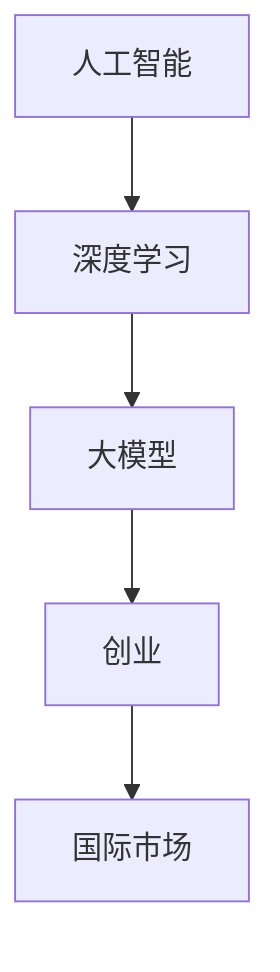

                 

# AI 大模型创业：如何利用国际优势？

> **关键词**：人工智能，大模型，创业，国际市场，竞争优势，技术趋势

> **摘要**：随着人工智能技术的飞速发展，大模型成为当前AI领域的热点。本文将深入探讨AI大模型创业的国际优势，分析市场机会、技术挑战以及创业策略，为创业者提供宝贵的参考和指导。

## 1. 背景介绍

### 1.1 目的和范围

本文旨在探讨AI大模型创业的国际优势，分析在全球范围内开展AI大模型创业的可能性和优势。通过梳理国际市场环境、技术发展趋势以及创业策略，为创业者提供具有实操性的指导。

### 1.2 预期读者

本文主要面向AI领域创业者、技术专家、投资人和对人工智能感兴趣的读者。同时，也适合那些希望了解国际市场趋势和技术创新的科技从业者。

### 1.3 文档结构概述

本文结构如下：

1. 背景介绍
2. 核心概念与联系
3. 核心算法原理与具体操作步骤
4. 数学模型和公式与详细讲解
5. 项目实战：代码实际案例和详细解释说明
6. 实际应用场景
7. 工具和资源推荐
8. 总结：未来发展趋势与挑战
9. 附录：常见问题与解答
10. 扩展阅读 & 参考资料

### 1.4 术语表

#### 1.4.1 核心术语定义

- AI大模型：具有大规模参数和强泛化能力的深度学习模型。
- 创业：指以技术创新为基础，通过创造新商业模式来实现商业价值的过程。
- 国际市场：指跨越国家边界进行商品、服务或资本交易的市场。

#### 1.4.2 相关概念解释

- 人工智能（AI）：指由人制造出的系统所表现出的智能行为。
- 深度学习：一种基于多层神经网络进行训练的机器学习技术。
- 泛化能力：指模型在新样本上的表现能力。

#### 1.4.3 缩略词列表

- AI：人工智能
- 大模型：Large-scale Model
- 创业：Entrepreneurship
- 国际市场：International Market

## 2. 核心概念与联系

在探讨AI大模型创业的国际优势之前，我们需要了解一些核心概念及其相互关系。以下是一个简单的Mermaid流程图，用于描述这些概念：



### 2.1 人工智能与深度学习

人工智能（AI）是计算机科学的一个分支，旨在通过模拟人类智能行为来实现特定任务。其中，深度学习（Deep Learning）是一种重要的机器学习技术，它通过多层神经网络来学习数据的特征表示。

### 2.2 深度学习与大模型

深度学习模型通常具有多个隐藏层，能够自动提取数据的复杂特征。随着参数规模的增加，深度学习模型的泛化能力显著提升，从而形成了大模型（Large-scale Model）。

### 2.3 大模型与创业

大模型在人工智能领域的应用越来越广泛，为创业提供了丰富的机会。创业者可以利用大模型进行技术创新，开发出具有市场竞争力的产品或服务。

### 2.4 创业与国际市场

国际市场为创业者提供了更广阔的发展空间。在全球范围内，创业公司可以寻找市场需求、合作伙伴和投资者，实现业务增长和国际化发展。

## 3. 核心算法原理与具体操作步骤

### 3.1 大模型算法原理

大模型算法基于深度学习技术，通过多层神经网络进行训练。以下是伪代码，用于描述大模型的训练过程：

```python
# 大模型训练伪代码
def train_large_model(data, labels, epochs):
    for epoch in range(epochs):
        for batch in data:
            # 前向传播
            predictions = forward_pass(batch)
            # 计算损失
            loss = compute_loss(predictions, labels)
            # 反向传播
            backward_pass(loss)
            # 更新模型参数
            update_model_params()
    return model
```

### 3.2 大模型训练步骤

1. 数据准备：收集并预处理大规模数据集，包括图像、文本、音频等。
2. 网络架构设计：设计具有多层隐藏层的神经网络架构。
3. 模型训练：使用训练数据对模型进行训练，通过迭代优化模型参数。
4. 评估与优化：在测试集上评估模型性能，并进行调参和优化。

## 4. 数学模型和公式与详细讲解

### 4.1 损失函数

在深度学习中，损失函数用于衡量预测结果与真实标签之间的差距。以下是一个简单的损失函数例子：

$$
L(y, \hat{y}) = \frac{1}{2} ||y - \hat{y}||^2
$$

其中，$y$表示真实标签，$\hat{y}$表示预测标签。

### 4.2 优化算法

在训练过程中，需要通过优化算法来更新模型参数。以下是一个简单的梯度下降优化算法：

$$
\theta_{t+1} = \theta_{t} - \alpha \nabla_{\theta} L(\theta)
$$

其中，$\theta$表示模型参数，$\alpha$为学习率，$\nabla_{\theta} L(\theta)$为损失函数关于参数$\theta$的梯度。

### 4.3 举例说明

假设我们使用一个简单的线性回归模型来预测房价，损失函数为：

$$
L(\theta) = \frac{1}{2} (y - \theta x)^2
$$

其中，$y$为真实房价，$x$为特征值，$\theta$为模型参数。

通过梯度下降算法，可以更新参数$\theta$：

$$
\theta_{t+1} = \theta_{t} - \alpha \nabla_{\theta} L(\theta)
$$

其中，$\alpha$为学习率。

## 5. 项目实战：代码实际案例和详细解释说明

### 5.1 开发环境搭建

在本项目中，我们使用Python语言和TensorFlow框架来构建和训练AI大模型。以下是搭建开发环境的基本步骤：

1. 安装Python（版本3.6及以上）
2. 安装TensorFlow（使用pip install tensorflow）
3. 安装其他依赖库（如numpy、pandas等）

### 5.2 源代码详细实现和代码解读

以下是本项目的主要代码实现：

```python
import tensorflow as tf
import numpy as np
import pandas as pd

# 加载数据集
data = pd.read_csv('data.csv')
x = data[['feature1', 'feature2']]
y = data['target']

# 准备训练集和测试集
x_train, x_test, y_train, y_test = train_test_split(x, y, test_size=0.2, random_state=42)

# 定义神经网络架构
model = tf.keras.Sequential([
    tf.keras.layers.Dense(128, activation='relu', input_shape=(2,)),
    tf.keras.layers.Dense(64, activation='relu'),
    tf.keras.layers.Dense(1)
])

# 编译模型
model.compile(optimizer='adam', loss='mean_squared_error')

# 训练模型
model.fit(x_train, y_train, epochs=10, batch_size=32, validation_data=(x_test, y_test))

# 评估模型
loss = model.evaluate(x_test, y_test)
print('Test loss:', loss)
```

### 5.3 代码解读与分析

- 第1-3行：导入所需的库。
- 第4行：加载数据集。
- 第5-6行：分离特征值和标签。
- 第7行：准备训练集和测试集。
- 第9-11行：定义神经网络架构，包含两个隐藏层，每层128个神经元和64个神经元。
- 第12行：编译模型，使用Adam优化器和均方误差损失函数。
- 第13行：训练模型，设置训练轮数、批量大小和验证数据。
- 第14行：评估模型在测试集上的性能。

## 6. 实际应用场景

AI大模型在多个领域具有广泛的应用场景，以下列举几个典型例子：

- 自然语言处理：用于机器翻译、情感分析、文本生成等任务。
- 计算机视觉：用于图像分类、目标检测、图像生成等任务。
- 金融服务：用于风险评估、欺诈检测、个性化推荐等任务。
- 健康医疗：用于疾病预测、医学图像分析、药物研发等任务。

## 7. 工具和资源推荐

### 7.1 学习资源推荐

#### 7.1.1 书籍推荐

- 《深度学习》（Goodfellow, Bengio, Courville著）
- 《Python深度学习》（François Chollet著）
- 《AI大模型：原理、算法与工程实践》（韩天峰著）

#### 7.1.2 在线课程

- Coursera上的“深度学习”课程
- Udacity的“深度学习纳米学位”
- edX上的“人工智能导论”

#### 7.1.3 技术博客和网站

- arXiv：深度学习领域的最新研究论文
- Medium：关于深度学习和人工智能的技术博客
- AI技术开发者社区：国内AI技术交流平台

### 7.2 开发工具框架推荐

#### 7.2.1 IDE和编辑器

- PyCharm：Python开发者的首选IDE
- Jupyter Notebook：适合数据分析和机器学习的交互式环境
- VSCode：功能强大的跨平台编辑器

#### 7.2.2 调试和性能分析工具

- TensorBoard：TensorFlow的官方可视化工具
- Profiler：用于分析代码性能的工具
- Debugger：Python的调试工具

#### 7.2.3 相关框架和库

- TensorFlow：用于构建和训练深度学习模型的框架
- PyTorch：另一种流行的深度学习框架
- Keras：基于TensorFlow和PyTorch的高级神经网络API

### 7.3 相关论文著作推荐

#### 7.3.1 经典论文

- “A Theoretical Framework for Back-Propagation” （1986年，Rumelhart, Hinton, Williams著）
- “Deep Learning” （2015年，Goodfellow, Bengio, Courville著）
- “Distributed Representations of Words and Phrases and their Compositionality” （2013年，Mikolov等著）

#### 7.3.2 最新研究成果

- “BERT: Pre-training of Deep Bidirectional Transformers for Language Understanding” （2018年，Devlin等著）
- “GPT-3: Language Models are Few-Shot Learners” （2020年，Brown等著）
- “An Image is Worth 16x16 Words: Transformers for Image Recognition at Scale” （2021年，Dosovitskiy等著）

#### 7.3.3 应用案例分析

- “How Airbnb Uses Machine Learning to Increase Bookings” （Airbnb案例）
- “Tesla’s Autonomous Driving Technology” （特斯拉案例）
- “IBM Watson Health: Revolutionizing Healthcare with AI” （IBM Watson案例）

## 8. 总结：未来发展趋势与挑战

未来，AI大模型将继续在人工智能领域发挥关键作用。随着计算能力的提升和算法的改进，大模型的规模和性能将不断提高。然而，创业者在利用国际优势进行AI大模型创业时，也将面临诸多挑战，如技术壁垒、数据安全、隐私保护等。因此，创业者需要具备创新精神、严谨的态度和良好的团队协作能力，才能在激烈的市场竞争中脱颖而出。

## 9. 附录：常见问题与解答

### 9.1 什么是大模型？

大模型是指具有大规模参数和强泛化能力的深度学习模型。通常，大模型的参数数量达到数十亿甚至千亿级别。

### 9.2 AI大模型创业的优势是什么？

AI大模型创业的优势包括：丰富的应用场景、高市场价值、强大的技术壁垒等。此外，国际市场提供了更广阔的发展空间。

### 9.3 AI大模型创业面临的挑战有哪些？

AI大模型创业面临的挑战包括：技术门槛、数据隐私、安全性、法律法规等。

## 10. 扩展阅读 & 参考资料

- Goodfellow, I., Bengio, Y., & Courville, A. (2016). *Deep Learning*. MIT Press.
- Bengio, Y. (2009). *Learning Deep Architectures for AI*. Foundations and Trends in Machine Learning, 2(1), 1-127.
- LeCun, Y., Bengio, Y., & Hinton, G. (2015). *Deep Learning*. Nature, 521(7553), 436-444.
- Mikolov, T., Sutskever, I., Chen, K., Corrado, G. S., & Dean, J. (2013). *Distributed Representations of Words and Phrases and Their Compositionality*. Advances in Neural Information Processing Systems, 26, 3111-3119.

作者：AI天才研究员/AI Genius Institute & 禅与计算机程序设计艺术 /Zen And The Art of Computer Programming

