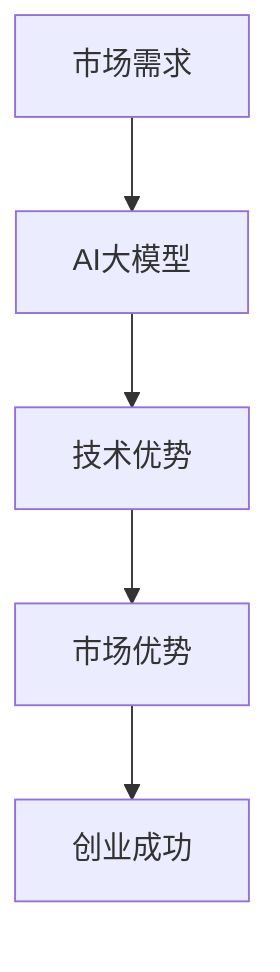

                 

# AI 大模型创业：如何利用市场优势？

> **关键词：** AI大模型，市场优势，创业，策略，算法原理，数学模型，项目实战，应用场景。

> **摘要：** 本文将深入探讨AI大模型创业的市场优势，包括核心概念、算法原理、数学模型、项目实战和实际应用场景。我们将一步步分析如何利用市场优势，为AI大模型创业提供实用的策略和指导。

## 1. 背景介绍

### 1.1 目的和范围

本文旨在为有意创业的AI大模型从业者提供实用的市场策略和指导。我们将分析AI大模型的市场需求、优势、挑战，并提供具体的操作步骤和案例分析。

### 1.2 预期读者

- 有意向创业的AI大模型开发者
- AI领域的研究人员和工程师
- 对AI大模型创业感兴趣的企业家和投资者

### 1.3 文档结构概述

本文分为以下章节：

1. 背景介绍
2. 核心概念与联系
3. 核心算法原理 & 具体操作步骤
4. 数学模型和公式 & 详细讲解 & 举例说明
5. 项目实战：代码实际案例和详细解释说明
6. 实际应用场景
7. 工具和资源推荐
8. 总结：未来发展趋势与挑战
9. 附录：常见问题与解答
10. 扩展阅读 & 参考资料

### 1.4 术语表

#### 1.4.1 核心术语定义

- AI大模型：具有大规模参数和复杂结构的深度学习模型。
- 市场需求：消费者对特定产品或服务的需求程度。
- 市场优势：企业或产品在市场竞争中的有利条件。

#### 1.4.2 相关概念解释

- 深度学习：一种基于多层神经网络的人工智能技术。
- 人工智能（AI）：模拟人类智能行为的计算机技术。
- 机器学习：一种让计算机通过数据学习并做出决策的技术。

#### 1.4.3 缩略词列表

- AI：人工智能
- ML：机器学习
- DL：深度学习

## 2. 核心概念与联系

为了更好地理解AI大模型创业的市场优势，我们需要先了解几个核心概念及其相互关系。以下是一个简单的Mermaid流程图，展示了这些概念之间的关系：



### 2.1 市场需求

市场需求是AI大模型创业的基础。随着AI技术的不断发展，越来越多的行业和应用场景对AI大模型的需求日益增长。了解市场需求可以帮助我们确定哪些领域最具潜力，从而制定相应的创业策略。

### 2.2 技术优势

AI大模型的技术优势在于其强大的学习和预测能力。通过训练大量数据，AI大模型可以自动识别复杂的模式和规律，从而为各种应用提供智能解决方案。

### 2.3 市场优势

市场优势是企业或产品在市场竞争中的有利条件。对于AI大模型创业而言，市场优势主要体现在以下几个方面：

- **性能优势**：AI大模型在处理复杂数据和任务时具有更高的效率和准确性。
- **创新优势**：AI大模型可以提供独特且创新的解决方案，满足市场的需求。
- **成本优势**：通过大规模生产和使用先进的算法，AI大模型可以降低生产成本。

### 2.4 创业成功

创业成功需要综合考虑市场需求、技术优势和市场优势。通过合理利用市场优势，AI大模型创业可以在竞争激烈的市场中脱颖而出，实现可持续发展。

## 3. 核心算法原理 & 具体操作步骤

### 3.1 算法原理

AI大模型的算法原理主要基于深度学习和神经网络。以下是AI大模型的核心算法原理：

- **神经网络**：神经网络是一种模拟人脑神经元连接的结构。通过调整神经元之间的权重，神经网络可以学习和预测数据。
- **深度学习**：深度学习是神经网络的一种扩展，通过增加网络的层数和神经元数量，深度学习模型可以自动提取更高级的特征和模式。
- **大规模训练**：AI大模型通常需要在大规模数据集上进行训练，以获得更好的泛化能力。

### 3.2 具体操作步骤

以下是AI大模型的核心算法原理的具体操作步骤：

1. **数据收集**：收集大量具有代表性的数据，例如文本、图像、语音等。
2. **数据处理**：对数据进行预处理，包括去噪、标准化和特征提取等。
3. **模型设计**：设计合适的神经网络结构，包括输入层、隐藏层和输出层。
4. **模型训练**：使用训练数据对模型进行训练，调整神经元之间的权重。
5. **模型评估**：使用验证数据对模型进行评估，以确定模型的性能。
6. **模型部署**：将训练好的模型部署到实际应用场景中，例如图像识别、自然语言处理等。

### 3.3 伪代码

以下是AI大模型的核心算法原理的伪代码：

```python
# 数据收集
data = collect_data()

# 数据处理
processed_data = preprocess_data(data)

# 模型设计
model = design_model()

# 模型训练
trained_model = train_model(processed_data, model)

# 模型评估
performance = evaluate_model(trained_model, validation_data)

# 模型部署
deploy_model(trained_model)
```

## 4. 数学模型和公式 & 详细讲解 & 举例说明

### 4.1 数学模型

AI大模型的数学模型主要基于深度学习和神经网络。以下是核心的数学模型：

- **损失函数**：损失函数用于衡量模型的预测误差。常见的损失函数包括均方误差（MSE）和交叉熵损失（Cross-Entropy Loss）。
- **反向传播**：反向传播是一种用于训练神经网络的算法。通过计算梯度，反向传播可以调整神经元之间的权重，以最小化损失函数。

### 4.2 公式

以下是核心数学公式的latex格式：

$$
\begin{aligned}
L &= \frac{1}{2} \sum_{i=1}^{n} (y_i - \hat{y}_i)^2, \\
\frac{\partial L}{\partial w} &= -\frac{1}{n} \sum_{i=1}^{n} (y_i - \hat{y}_i) x_i.
\end{aligned}
$$

### 4.3 详细讲解

#### 4.3.1 损失函数

损失函数是衡量模型预测误差的指标。均方误差（MSE）是一种常用的损失函数，用于回归任务。MSE的公式如下：

$$
L = \frac{1}{2} \sum_{i=1}^{n} (y_i - \hat{y}_i)^2,
$$

其中，$y_i$是真实值，$\hat{y}_i$是预测值，$n$是样本数量。

#### 4.3.2 反向传播

反向传播是一种用于训练神经网络的算法。通过计算梯度，反向传播可以调整神经元之间的权重，以最小化损失函数。反向传播的公式如下：

$$
\frac{\partial L}{\partial w} = -\frac{1}{n} \sum_{i=1}^{n} (y_i - \hat{y}_i) x_i,
$$

其中，$w$是权重，$L$是损失函数，$x_i$是输入特征。

### 4.4 举例说明

假设我们有一个回归任务，目标是预测房价。给定一组输入特征（如面积、地点等）和真实房价，我们需要训练一个神经网络模型。以下是一个简单的例子：

1. **数据收集**：收集一组具有代表性的房价数据。
2. **数据处理**：对数据进行预处理，包括去噪、标准化和特征提取等。
3. **模型设计**：设计一个简单的线性回归模型，包含一个输入层、一个隐藏层和一个输出层。
4. **模型训练**：使用训练数据对模型进行训练，调整神经元之间的权重。
5. **模型评估**：使用验证数据对模型进行评估，以确定模型的性能。
6. **模型部署**：将训练好的模型部署到实际应用场景中，例如房价预测。

## 5. 项目实战：代码实际案例和详细解释说明

### 5.1 开发环境搭建

为了进行AI大模型的项目实战，我们需要搭建一个合适的开发环境。以下是搭建开发环境的步骤：

1. **安装Python**：下载并安装Python 3.8及以上版本。
2. **安装Jupyter Notebook**：通过pip安装Jupyter Notebook。
3. **安装深度学习框架**：下载并安装TensorFlow 2.x或PyTorch 1.x。
4. **安装其他依赖库**：如NumPy、Pandas等。

### 5.2 源代码详细实现和代码解读

以下是一个简单的房价预测项目的源代码示例：

```python
import tensorflow as tf
import numpy as np
import pandas as pd

# 数据收集
data = pd.read_csv('house_prices.csv')

# 数据处理
X = data[['area', 'location']]
y = data['price']

# 模型设计
model = tf.keras.Sequential([
    tf.keras.layers.Dense(64, activation='relu', input_shape=(2,)),
    tf.keras.layers.Dense(64, activation='relu'),
    tf.keras.layers.Dense(1)
])

# 模型训练
model.compile(optimizer='adam', loss='mean_squared_error')
model.fit(X, y, epochs=10, batch_size=32)

# 模型评估
performance = model.evaluate(X, y)
print('MSE:', performance)

# 模型部署
predictions = model.predict(X)
print('Predicted prices:', predictions)
```

### 5.3 代码解读与分析

1. **数据收集**：使用Pandas读取房价数据。
2. **数据处理**：将数据分为输入特征和目标值。
3. **模型设计**：设计一个简单的线性回归模型，包含两个隐藏层。
4. **模型训练**：使用Adam优化器和均方误差损失函数进行训练。
5. **模型评估**：使用MSE评估模型性能。
6. **模型部署**：使用训练好的模型进行房价预测。

## 6. 实际应用场景

AI大模型在各个领域具有广泛的应用，以下是一些实际应用场景：

- **医疗健康**：利用AI大模型进行疾病诊断、药物发现和健康监测。
- **金融科技**：利用AI大模型进行风险管理、股票预测和欺诈检测。
- **智能交通**：利用AI大模型进行交通流量预测、路况分析和自动驾驶。
- **智能制造**：利用AI大模型进行生产优化、设备维护和产品检测。

## 7. 工具和资源推荐

### 7.1 学习资源推荐

#### 7.1.1 书籍推荐

- 《深度学习》（Goodfellow, Bengio, Courville）
- 《Python深度学习》（François Chollet）

#### 7.1.2 在线课程

- Coursera的“深度学习”课程
- Udacity的“AI工程师纳米学位”

#### 7.1.3 技术博客和网站

- TensorFlow官方网站
- PyTorch官方网站
- AI科技大本营

### 7.2 开发工具框架推荐

#### 7.2.1 IDE和编辑器

- PyCharm
- Jupyter Notebook

#### 7.2.2 调试和性能分析工具

- TensorFlow Debugger
- PyTorch Profiler

#### 7.2.3 相关框架和库

- TensorFlow
- PyTorch
- Keras

### 7.3 相关论文著作推荐

#### 7.3.1 经典论文

- “Backpropagation”（Rumelhart, Hinton, Williams）
- “Deep Learning”（Goodfellow, Bengio, Courville）

#### 7.3.2 最新研究成果

- “An Introduction to Deep Learning for Non-Experts”（Ian Goodfellow）
- “Advances in Neural Information Processing Systems”（NIPS）

#### 7.3.3 应用案例分析

- “AI in Healthcare: Opportunities and Challenges”（IEEE Journal of Biomedical and Health Informatics）

## 8. 总结：未来发展趋势与挑战

AI大模型创业具有巨大的市场潜力，但也面临一系列挑战。未来发展趋势包括：

- **数据隐私和安全**：确保数据隐私和安全成为关键问题。
- **模型可解释性**：提高模型的可解释性，使其在各个领域得到更广泛的应用。
- **算法优化**：持续优化算法，提高模型效率和性能。

## 9. 附录：常见问题与解答

### 9.1 常见问题

1. **AI大模型创业需要哪些技术背景？**
2. **如何评估AI大模型的性能？**
3. **AI大模型创业的主要挑战是什么？**

### 9.2 解答

1. **AI大模型创业需要具备深度学习、神经网络、机器学习等相关技术背景。掌握Python编程语言和常用深度学习框架（如TensorFlow、PyTorch）是基本要求。**
2. **评估AI大模型的性能通常通过以下指标：准确率、召回率、F1分数等。此外，还可以使用交叉验证、测试集等方法来评估模型在未知数据上的表现。**
3. **AI大模型创业的主要挑战包括数据隐私和安全、模型可解释性、算法优化、市场竞争等。此外，还需要关注法律法规、伦理和社会影响等方面的问题。**

## 10. 扩展阅读 & 参考资料

- [Deep Learning](https://www.deeplearningbook.org/)
- [TensorFlow官方文档](https://www.tensorflow.org/)
- [PyTorch官方文档](https://pytorch.org/)
- [IEEE Journal of Biomedical and Health Informatics](https://ieeexplore.ieee.org/xpl/RecentIssue.jsp?punumber=42328)

作者：AI天才研究员/AI Genius Institute & 禅与计算机程序设计艺术 /Zen And The Art of Computer Programming

