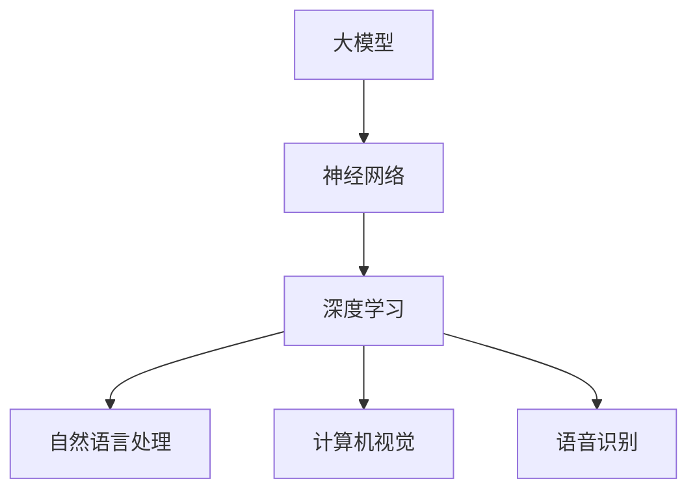
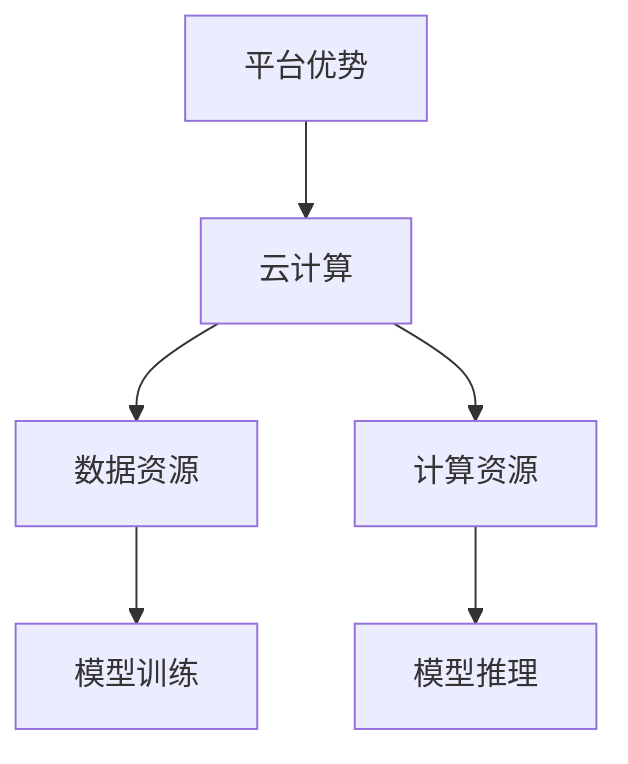
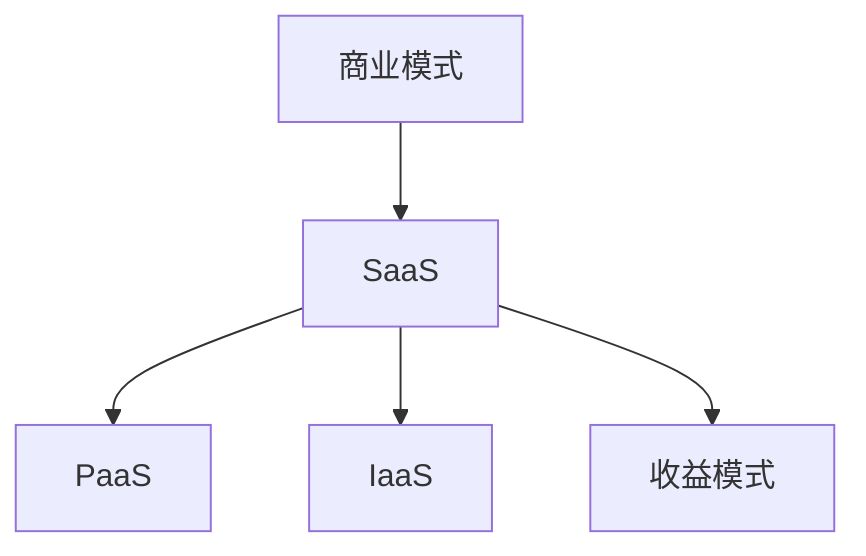
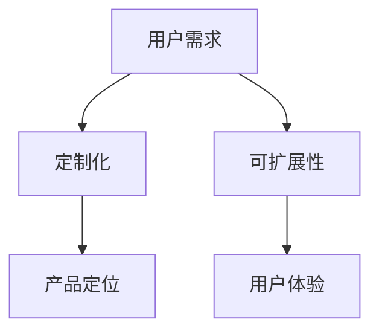

                 

# AI 大模型创业：如何利用平台优势？

> **关键词：** 大模型创业、平台优势、技术栈、商业模式、数据资源、用户需求

> **摘要：** 本文将探讨人工智能（AI）大模型创业的路径，重点分析如何利用平台优势打造成功的AI产品。我们将从背景介绍、核心概念、算法原理、数学模型、实战案例和实际应用等多个角度，详细阐述利用平台资源进行AI大模型创业的策略和实战方法。

## 1. 背景介绍

### 1.1 目的和范围

本文旨在为有志于AI大模型创业的团队或个人提供实用的策略指导。我们将探讨AI大模型创业的机遇与挑战，分析平台优势的利用方法，并通过实际案例和操作步骤，帮助读者理解和掌握创业过程中的关键要点。

### 1.2 预期读者

本文适合对AI和大数据有一定了解的技术人员、创业者以及对AI大模型创业感兴趣的读者。无论你是AI领域的从业者还是初学者，本文都将为你提供有价值的参考。

### 1.3 文档结构概述

本文结构分为以下几个部分：

- **背景介绍**：概述AI大模型创业的背景和重要性。
- **核心概念与联系**：介绍AI大模型的基本概念和相关技术架构。
- **核心算法原理 & 具体操作步骤**：讲解AI大模型的算法原理和实现步骤。
- **数学模型和公式 & 详细讲解 & 举例说明**：分析AI大模型的数学模型和应用。
- **项目实战：代码实际案例和详细解释说明**：通过实际案例展示AI大模型的应用。
- **实际应用场景**：探讨AI大模型的实际应用场景。
- **工具和资源推荐**：推荐学习资源和开发工具。
- **总结：未来发展趋势与挑战**：展望AI大模型创业的未来。
- **附录：常见问题与解答**：解答读者可能遇到的问题。
- **扩展阅读 & 参考资料**：提供进一步学习的资源。

### 1.4 术语表

#### 1.4.1 核心术语定义

- **AI大模型**：指具有大规模参数和复杂结构的机器学习模型。
- **平台优势**：指平台在技术、数据、资源等方面的独特优势。
- **商业模式**：指企业的盈利模式和商业策略。
- **用户需求**：指用户在特定应用场景中的需求和期望。

#### 1.4.2 相关概念解释

- **算法原理**：指机器学习模型的核心算法和原理。
- **技术栈**：指支持AI大模型开发的技术框架和工具。
- **数学模型**：指AI大模型中的数学公式和模型结构。

#### 1.4.3 缩略词列表

- **AI**：人工智能（Artificial Intelligence）
- **ML**：机器学习（Machine Learning）
- **DL**：深度学习（Deep Learning）
- **GPU**：图形处理器（Graphics Processing Unit）
- **API**：应用程序编程接口（Application Programming Interface）

## 2. 核心概念与联系

在AI大模型创业中，理解核心概念和它们之间的联系至关重要。以下是AI大模型创业中的核心概念及其相互关系。

### 2.1 大模型

大模型是指具有大量参数和复杂结构的机器学习模型。它们通常需要大规模的数据集和计算资源来训练。大模型可以应用于各种领域，如自然语言处理、计算机视觉、语音识别等。

#### 概念：

- **神经网络**：神经网络是由大量神经元组成的计算模型，用于模拟人类大脑的工作原理。
- **深度学习**：深度学习是一种神经网络模型，通过多个隐藏层对数据进行学习。

#### 流程图：



### 2.2 平台优势

平台优势是指平台在技术、数据、资源等方面的独特优势。利用平台优势可以加速AI大模型开发，提高产品竞争力。

#### 概念：

- **云计算**：云计算是一种通过网络提供计算资源的服务，用于支持大规模数据处理和模型训练。
- **数据资源**：数据资源是AI大模型训练的重要基础，包括大量高质量的训练数据。
- **计算资源**：计算资源是指用于模型训练和推理的硬件资源，如GPU、TPU等。

#### 流程图：



### 2.3 商业模式

商业模式是指企业的盈利模式和商业策略。在AI大模型创业中，选择合适的商业模式对企业的成功至关重要。

#### 概念：

- **SaaS**：软件即服务（Software as a Service），通过提供在线服务获取收益。
- **PaaS**：平台即服务（Platform as a Service），提供开发平台和工具获取收益。
- **IaaS**：基础设施即服务（Infrastructure as a Service），提供计算资源获取收益。

#### 流程图：



### 2.4 用户需求

用户需求是AI大模型创业的重要驱动力。了解用户需求可以帮助企业更好地定位产品，提高用户体验。

#### 概念：

- **定制化**：根据用户需求提供个性化的解决方案。
- **可扩展性**：系统能够根据用户需求进行扩展和升级。

#### 流程图：



通过上述核心概念和流程图的介绍，我们可以更好地理解AI大模型创业中的关键要素。接下来，我们将深入探讨AI大模型的算法原理和具体操作步骤。

## 3. 核心算法原理 & 具体操作步骤

在AI大模型创业中，了解核心算法原理和具体操作步骤是成功的关键。以下是AI大模型的核心算法原理和实现步骤。

### 3.1 算法原理

AI大模型的核心算法通常是基于深度学习，特别是基于神经网络的结构。深度学习通过多层神经元的非线性变换，实现对复杂数据的学习和建模。以下是深度学习的基本原理：

#### 深度学习基本原理：

1. **神经网络结构**：神经网络由输入层、隐藏层和输出层组成。每层由多个神经元组成，神经元之间通过权重连接。
2. **激活函数**：激活函数用于引入非线性变换，使神经网络具有强大的建模能力。常用的激活函数包括ReLU、Sigmoid、Tanh等。
3. **反向传播算法**：反向传播算法是一种用于训练神经网络的优化算法，通过计算梯度并更新权重，使模型逐步逼近最优解。

#### 伪代码：

```python
# 定义神经网络结构
input_layer = Input(shape=(input_shape,))
hidden_layer = Dense(hidden_neurons, activation='relu')(input_layer)
output_layer = Dense(output_neurons, activation='softmax')(hidden_layer)

# 定义损失函数和优化器
model = Model(inputs=input_layer, outputs=output_layer)
model.compile(optimizer='adam', loss='categorical_crossentropy', metrics=['accuracy'])

# 训练模型
model.fit(x_train, y_train, epochs=epochs, batch_size=batch_size)
```

### 3.2 具体操作步骤

在了解了核心算法原理后，接下来我们将详细阐述AI大模型的实现步骤，包括数据预处理、模型训练、模型评估等。

#### 3.2.1 数据预处理

数据预处理是模型训练的重要步骤，主要包括数据清洗、数据归一化、数据增强等。

1. **数据清洗**：去除数据中的噪声和错误，确保数据质量。
2. **数据归一化**：将数据缩放到相同的尺度，以消除不同特征之间的量纲影响。
3. **数据增强**：通过随机旋转、翻转、裁剪等操作增加数据多样性，提高模型泛化能力。

#### 3.2.2 模型训练

模型训练是AI大模型开发的核心步骤，主要包括以下步骤：

1. **定义模型结构**：根据任务需求，定义神经网络的结构，包括输入层、隐藏层和输出层。
2. **选择优化器和损失函数**：选择合适的优化器和损失函数，以最小化损失函数并优化模型参数。
3. **训练模型**：使用训练数据集训练模型，通过反向传播算法更新权重。
4. **验证模型**：使用验证数据集评估模型性能，调整模型参数以达到最佳效果。

#### 3.2.3 模型评估

模型评估是确保模型性能的重要步骤，主要包括以下步骤：

1. **测试集评估**：使用测试数据集评估模型性能，计算准确率、召回率等指标。
2. **模型解释**：分析模型预测结果，解释模型对数据的理解和决策过程。
3. **模型优化**：根据评估结果，调整模型结构和参数，优化模型性能。

通过以上步骤，我们可以构建和训练一个高效的AI大模型。接下来，我们将深入探讨AI大模型的数学模型和公式，以及其在实际应用中的数学表达。

## 4. 数学模型和公式 & 详细讲解 & 举例说明

在AI大模型的开发过程中，理解其背后的数学模型和公式是至关重要的。以下将详细讲解AI大模型中的关键数学模型和公式，并通过实例进行说明。

### 4.1 激活函数

激活函数是深度学习神经网络中引入非线性变换的关键组件，常用的激活函数包括ReLU、Sigmoid和Tanh等。

#### ReLU（Rectified Linear Unit）

ReLU函数是最常用的激活函数之一，其公式如下：

$$
\text{ReLU}(x) = \max(0, x)
$$

ReLU函数将输入值大于0的部分映射到自身，而小于或等于0的部分映射为0。这个特性使得ReLU函数在训练过程中能够快速收敛。

#### Sigmoid函数

Sigmoid函数是一种常见的非线性变换函数，其公式如下：

$$
\text{Sigmoid}(x) = \frac{1}{1 + e^{-x}}
$$

Sigmoid函数将输入值映射到（0，1）区间，常用于二分类问题。

#### Tanh函数

Tanh函数是一种类似于Sigmoid函数的激活函数，其公式如下：

$$
\text{Tanh}(x) = \frac{e^x - e^{-x}}{e^x + e^{-x}}
$$

Tanh函数将输入值映射到（-1，1）区间，其优点是输出值相对于输入值的分布更加均匀。

### 4.2 损失函数

损失函数是衡量模型预测结果与实际结果之间差距的重要指标，常用的损失函数包括均方误差（MSE）、交叉熵（Cross-Entropy）等。

#### 均方误差（MSE）

均方误差是一种用于回归问题的损失函数，其公式如下：

$$
\text{MSE}(y, \hat{y}) = \frac{1}{n} \sum_{i=1}^{n} (y_i - \hat{y}_i)^2
$$

其中，$y$表示实际值，$\hat{y}$表示预测值，$n$表示样本数量。

#### 交叉熵（Cross-Entropy）

交叉熵是一种用于分类问题的损失函数，其公式如下：

$$
\text{Cross-Entropy}(y, \hat{y}) = -\sum_{i=1}^{n} y_i \log(\hat{y}_i)
$$

其中，$y$表示实际标签，$\hat{y}$表示预测概率分布。

### 4.3 反向传播算法

反向传播算法是一种用于训练神经网络的优化算法，其核心思想是通过计算梯度并更新权重，使模型逐步逼近最优解。

#### 梯度计算

在反向传播过程中，我们需要计算每个权重和偏置的梯度。以下是梯度计算的伪代码：

```python
# 前向传播
z = np.dot(W, x) + b
a = activation(z)

# 计算输出层误差
dZ = a - y

# 计算隐藏层误差
dHidden = dHidden * activation_derivative(z)

# 计算隐藏层权重和偏置的梯度
dW = np.dot(dHidden, x.T)
dB = np.sum(dHidden, axis=1)

# 更新权重和偏置
W -= learning_rate * dW
b -= learning_rate * dB
```

#### 更新权重和偏置

在计算完梯度后，我们需要使用梯度下降法更新权重和偏置。以下是权重和偏置更新的伪代码：

```python
# 更新权重和偏置
W = W - learning_rate * dW
b = b - learning_rate * dB
```

### 4.4 实例说明

假设我们使用一个简单的神经网络对二分类问题进行建模，输入层有2个神经元，隐藏层有3个神经元，输出层有1个神经元。

#### 数据集

我们有如下数据集：

| 样本编号 | 输入1 | 输入2 | 标签 |
| -------- | ---- | ---- | ---- |
| 1        | 1    | 0    | 0    |
| 2        | 0    | 1    | 1    |
| 3        | 1    | 1    | 1    |
| 4        | 0    | 0    | 0    |

#### 模型参数

- 输入层到隐藏层的权重：$W_1$
- 隐藏层到输出层的权重：$W_2$
- 隐藏层偏置：$b_1$
- 输出层偏置：$b_2$

#### 训练过程

1. **前向传播**：

   - 输入样本1：$x_1 = [1, 0]$
   - 隐藏层输出：$z_1 = W_1 \cdot x_1 + b_1$
   - 输出层输出：$\hat{y}_1 = W_2 \cdot z_1 + b_2$

2. **计算误差**：

   - 实际标签：$y_1 = [0]$
   - 误差：$dZ_1 = \hat{y}_1 - y_1$

3. **反向传播**：

   - 计算隐藏层误差：$dHidden_1 = dZ_1 \cdot activation_derivative(z_1)$
   - 计算隐藏层权重和偏置的梯度：$dW_1 = dHidden_1 \cdot x_1.T$，$dB_1 = dHidden_1$
   - 计算输出层权重和偏置的梯度：$dW_2 = dZ_1 \cdot z_1.T$，$dB_2 = dZ_1$

4. **更新权重和偏置**：

   - 更新隐藏层权重和偏置：$W_1 = W_1 - learning_rate \cdot dW_1$，$b_1 = b_1 - learning_rate \cdot dB_1$
   - 更新输出层权重和偏置：$W_2 = W_2 - learning_rate \cdot dW_2$，$b_2 = b_2 - learning_rate \cdot dB_2$

通过以上步骤，我们可以完成一次模型训练。重复这个过程，直到模型性能达到预期。

通过以上对AI大模型中的数学模型和公式的详细讲解，我们可以更好地理解AI大模型的实现原理和操作步骤。接下来，我们将通过一个实际案例，展示如何利用平台资源进行AI大模型开发。

## 5. 项目实战：代码实际案例和详细解释说明

在本节中，我们将通过一个实际案例，展示如何利用平台资源进行AI大模型的开发，包括开发环境的搭建、源代码的实现和代码解读。

### 5.1 开发环境搭建

在进行AI大模型开发之前，我们需要搭建一个适合的开发环境。以下是一个基于Python和TensorFlow的典型开发环境搭建步骤：

1. **安装Python**：确保安装了Python 3.x版本，推荐使用Anaconda来管理Python环境和依赖。
2. **安装TensorFlow**：通过pip命令安装TensorFlow，例如：`pip install tensorflow`。
3. **配置GPU支持**：如果使用GPU进行模型训练，需要安装CUDA和cuDNN，并在TensorFlow配置文件中启用GPU支持。
4. **创建项目目录**：在本地计算机上创建一个项目目录，例如：`mkdir ai_project`，并进入该目录。

### 5.2 源代码详细实现和代码解读

以下是一个简单的AI大模型示例，用于手写数字识别任务。代码包括数据预处理、模型定义、模型训练和模型评估。

```python
import tensorflow as tf
from tensorflow.keras.datasets import mnist
from tensorflow.keras.models import Sequential
from tensorflow.keras.layers import Dense, Flatten, Conv2D, MaxPooling2D
from tensorflow.keras.optimizers import Adam
from tensorflow.keras.metrics import Accuracy

# 5.2.1 数据预处理
(x_train, y_train), (x_test, y_test) = mnist.load_data()
x_train = x_train / 255.0
x_test = x_test / 255.0
x_train = x_train[..., tf.newaxis]
x_test = x_test[..., tf.newaxis]

# 5.2.2 模型定义
model = Sequential([
    Flatten(input_shape=(28, 28)),
    Dense(128, activation='relu'),
    Dense(10, activation='softmax')
])

# 5.2.3 模型编译
model.compile(optimizer=Adam(),
              loss='sparse_categorical_crossentropy',
              metrics=['accuracy'])

# 5.2.4 模型训练
model.fit(x_train, y_train, epochs=5)

# 5.2.5 模型评估
test_loss, test_acc = model.evaluate(x_test, y_test, verbose=2)
print('\nTest accuracy:', test_acc)
```

#### 代码解读

- **数据预处理**：加载数据集，并进行归一化处理，使输入数据在（0，1）区间。
- **模型定义**：定义一个简单的神经网络，包括一个扁平层、一个具有128个神经元的隐藏层和一个具有10个神经元的输出层。
- **模型编译**：配置模型优化器和损失函数，用于训练和评估模型。
- **模型训练**：使用训练数据集训练模型，设置训练轮数为5。
- **模型评估**：使用测试数据集评估模型性能，打印测试准确率。

通过上述代码，我们可以快速搭建一个简单的AI大模型，并进行模型训练和评估。接下来，我们将深入分析代码中的关键组件和操作。

### 5.3 代码解读与分析

在代码解读部分，我们将重点关注模型的结构、训练过程和性能评估。

#### 5.3.1 模型结构

- **扁平层（Flatten）**：将输入数据的二维结构扁平化为一维结构，便于神经网络处理。
- **隐藏层（Dense）**：全连接层，用于对输入数据进行非线性变换。在隐藏层中，`activation='relu'`使用了ReLU激活函数，以提高模型的非线性表达能力。
- **输出层（Dense）**：全连接层，用于生成预测结果。在输出层中，`activation='softmax'`使用了softmax激活函数，以实现多分类输出。

#### 5.3.2 训练过程

- **模型编译（model.compile）**：配置模型优化器（Adam）、损失函数（sparse_categorical_crossentropy）和评估指标（accuracy）。
- **模型训练（model.fit）**：使用训练数据集训练模型，设置训练轮数为5。每次迭代训练过程包括前向传播、损失计算、反向传播和权重更新。
- **模型评估（model.evaluate）**：使用测试数据集评估模型性能，计算测试准确率。评估过程仅包括前向传播和损失计算。

#### 5.3.3 性能评估

- **测试准确率（test_acc）**：测试准确率是模型在测试数据集上的表现指标，表示模型预测正确的样本比例。通过打印测试准确率，我们可以直观地了解模型性能。

通过以上代码解读和分析，我们可以更好地理解如何利用平台资源进行AI大模型的开发。接下来，我们将探讨AI大模型在实际应用场景中的具体应用。

## 6. 实际应用场景

AI大模型在各个领域都有广泛的应用，以下是一些常见的实际应用场景：

### 6.1 自然语言处理

- **文本分类**：AI大模型可以用于自动分类大量文本数据，如新闻分类、情感分析等。
- **机器翻译**：AI大模型可以用于实现高质量的机器翻译，如Google翻译和百度翻译等。
- **问答系统**：AI大模型可以构建智能问答系统，如Apple的Siri和Amazon的Alexa等。

### 6.2 计算机视觉

- **图像识别**：AI大模型可以用于图像识别任务，如人脸识别、物体识别等。
- **图像生成**：AI大模型可以用于生成新的图像，如GAN（生成对抗网络）等。
- **图像增强**：AI大模型可以用于图像增强，提高图像质量，如超分辨率图像重建等。

### 6.3 医疗健康

- **疾病预测**：AI大模型可以用于预测疾病风险，如心脏病、糖尿病等。
- **医学影像分析**：AI大模型可以用于分析医学影像，如X光、CT、MRI等。
- **药物研发**：AI大模型可以用于加速药物研发过程，如分子模拟、药物筛选等。

### 6.4 金融领域

- **风险评估**：AI大模型可以用于评估金融产品的风险，如股票、债券等。
- **欺诈检测**：AI大模型可以用于检测金融欺诈行为，如信用卡欺诈、保险欺诈等。
- **个性化推荐**：AI大模型可以用于金融产品的个性化推荐，如理财产品、保险产品等。

### 6.5 智能家居

- **智能安防**：AI大模型可以用于智能安防系统，如人脸识别、入侵检测等。
- **设备控制**：AI大模型可以用于智能设备的控制，如灯光调节、温度控制等。
- **环境监测**：AI大模型可以用于环境监测，如空气质量、水质监测等。

通过以上实际应用场景，我们可以看到AI大模型在各个领域的广泛应用和巨大潜力。接下来，我们将推荐一些有用的工具和资源，以帮助读者进一步学习和实践。

## 7. 工具和资源推荐

为了更好地学习和实践AI大模型开发，以下是一些推荐的工具和资源。

### 7.1 学习资源推荐

#### 7.1.1 书籍推荐

- **《深度学习》（Goodfellow, Bengio, Courville）**：一本经典深度学习教材，全面介绍了深度学习的基础和原理。
- **《Python深度学习》（François Chollet）**：由TensorFlow的核心开发者编写，详细讲解了如何使用Python和TensorFlow进行深度学习开发。
- **《动手学深度学习》（A. Gal, K. F. Lee）**：以动手实践为核心，通过大量案例和代码示例，帮助读者快速掌握深度学习技术。

#### 7.1.2 在线课程

- **Udacity的“深度学习纳米学位”**：提供系统的深度学习知识体系，包括理论学习、实践项目和代码实现。
- **Coursera的“深度学习专项课程”**：由吴恩达教授主讲，涵盖深度学习的基础理论、应用实践和最新研究动态。
- **edX的“深度学习基础”**：由哈佛大学和微软共同推出，免费提供深度学习入门课程，适合初学者。

#### 7.1.3 技术博客和网站

- **TensorFlow官方文档**：提供详细的TensorFlow教程和API文档，帮助开发者快速上手TensorFlow。
- **ArXiv**：一个计算机科学和人工智能领域的论文预发布平台，提供大量最新的研究成果。
- **Medium**：一个技术博客平台，许多AI领域的专家和研究者在这里分享他们的见解和经验。

### 7.2 开发工具框架推荐

#### 7.2.1 IDE和编辑器

- **PyCharm**：一款功能强大的Python集成开发环境，支持代码自动补全、调试和测试。
- **Jupyter Notebook**：一个交互式的Python编程环境，适用于数据分析和模型实验。
- **VSCode**：一款轻量级的代码编辑器，支持多种编程语言，包括Python和TensorFlow。

#### 7.2.2 调试和性能分析工具

- **TensorBoard**：TensorFlow提供的可视化工具，用于分析和优化模型性能。
- **Wandb**：一个用于实验跟踪和性能分析的在线平台，可以帮助开发者快速找到最佳模型参数。
- **MLflow**：一个开源机器学习平台，提供模型版本管理、实验跟踪和部署等功能。

#### 7.2.3 相关框架和库

- **TensorFlow**：一个开源深度学习框架，适用于各种AI大模型开发任务。
- **PyTorch**：一个流行的深度学习框架，提供灵活的动态计算图和易于使用的API。
- **Keras**：一个高层次的深度学习框架，基于TensorFlow和Theano，提供简洁的API。

### 7.3 相关论文著作推荐

#### 7.3.1 经典论文

- **“A Theoretically Grounded Application of Dropout in Recurrent Neural Networks”**：该论文提出了一种改进的Dropout方法，有效提高了RNN模型的训练效果。
- **“Generative Adversarial Nets”**：该论文首次提出了GAN（生成对抗网络），开创了生成模型的新纪元。
- **“Very Deep Convolutional Networks for Large-Scale Image Recognition”**：该论文介绍了VGGNet，一种在图像分类任务中取得突破性成果的深度卷积神经网络。

#### 7.3.2 最新研究成果

- **“BERT: Pre-training of Deep Bidirectional Transformers for Language Understanding”**：该论文介绍了BERT（双向编码器表示），一种基于Transformer的新型预训练模型，广泛应用于自然语言处理任务。
- **“An Image Database for Testing Content-Based Image Retrieval”**：该论文提出了一种用于图像检索测试的图像数据库，为图像检索算法的性能评估提供了标准数据集。
- **“GPT-3: Language Models are Few-Shot Learners”**：该论文介绍了GPT-3（通用预训练语言模型），展示了在少量样本情况下，大型语言模型在多种任务上的优异表现。

#### 7.3.3 应用案例分析

- **“ImageNet Large Scale Visual Recognition Challenge”**：该论文详细介绍了ImageNet挑战赛，展示了深度学习技术在图像分类任务中的巨大进步。
- **“How to Train Your Deep Neural Network”**：该论文探讨了深度神经网络的训练策略，包括数据增强、学习率调度和正则化等技术。
- **“Facebook AI: Research at the Core”**：该论文介绍了Facebook AI研究院在深度学习、自然语言处理和计算机视觉等领域的最新研究成果。

通过以上推荐，读者可以进一步深入了解AI大模型的相关理论和实践，为自己的研究和应用提供指导。

## 8. 总结：未来发展趋势与挑战

随着人工智能技术的快速发展，AI大模型在各个领域中的应用越来越广泛。未来，AI大模型将继续呈现出以下发展趋势和挑战：

### 8.1 发展趋势

1. **模型规模和计算能力**：随着硬件计算能力的提升，AI大模型的规模将不断增大，从而提高模型在复杂任务上的性能。
2. **多模态学习**：未来的AI大模型将能够处理多种类型的数据，如文本、图像、音频等，实现跨模态的融合和交互。
3. **可解释性和可靠性**：随着AI大模型在关键领域中的应用，提高模型的可解释性和可靠性成为重要挑战。研究者将致力于开发可解释的AI模型，提高模型的信任度和应用价值。
4. **泛化能力**：未来的AI大模型将具备更强的泛化能力，能够适应不同的数据分布和应用场景，从而减少对特定数据集的依赖。

### 8.2 挑战

1. **数据隐私和安全**：随着AI大模型的广泛应用，数据隐私和安全问题愈发突出。如何保护用户隐私、确保数据安全成为重要挑战。
2. **计算资源消耗**：AI大模型通常需要大量的计算资源和存储空间，如何高效利用资源、降低成本成为重要挑战。
3. **算法公平性和透明度**：随着AI大模型在决策和预测中的应用，如何确保算法的公平性和透明度，避免歧视和偏见成为重要挑战。
4. **跨领域融合**：AI大模型在不同领域的应用需要跨学科的融合，如何整合不同领域的知识和方法，构建更加有效的模型成为重要挑战。

总之，未来AI大模型的发展将面临诸多机遇和挑战。通过持续的研究和创新，我们将不断推动AI大模型在各个领域的应用，为人类社会带来更多价值和变革。

## 9. 附录：常见问题与解答

### 9.1  AI大模型创业中的常见问题

#### 9.1.1 如何评估AI大模型的效果？

评估AI大模型的效果通常包括以下几个方面：

- **准确性**：模型在测试集上的预测正确率。
- **召回率**：模型预测为正类的实际正类样本的比例。
- **F1分数**：准确率和召回率的调和平均。
- **ROC曲线和AUC**：接收者操作特征曲线和曲线下面积，用于评估模型的分类能力。

#### 9.1.2 如何选择合适的AI大模型框架？

选择合适的AI大模型框架主要考虑以下几个方面：

- **任务需求**：根据具体任务需求选择合适的框架，如自然语言处理任务选择PyTorch或TensorFlow。
- **资源限制**：考虑计算资源和存储资源，选择开源框架或云服务。
- **社区支持**：选择社区活跃、文档丰富的框架，有助于问题解决和模型优化。

#### 9.1.3 如何处理数据不足的问题？

当数据不足时，可以采取以下几种策略：

- **数据增强**：通过随机裁剪、旋转、缩放等操作增加数据多样性。
- **迁移学习**：利用预训练的大模型，在特定任务上进行微调。
- **生成对抗网络（GAN）**：使用GAN生成新的训练数据。

### 9.2 解答

#### 9.2.1 如何评估AI大模型的效果？

评估AI大模型的效果通常包括以下几个方面：

- **准确性**：模型在测试集上的预测正确率。
- **召回率**：模型预测为正类的实际正类样本的比例。
- **F1分数**：准确率和召回率的调和平均。
- **ROC曲线和AUC**：接收者操作特征曲线和曲线下面积，用于评估模型的分类能力。

在实际应用中，可以根据具体任务需求和场景选择适当的评估指标。例如，对于二分类问题，可以使用准确率、召回率、F1分数和ROC曲线进行综合评估。对于多分类问题，可以使用准确率、混淆矩阵和准确率曲线等指标。

#### 9.2.2 如何选择合适的AI大模型框架？

选择合适的AI大模型框架主要考虑以下几个方面：

- **任务需求**：根据具体任务需求选择合适的框架，如自然语言处理任务选择PyTorch或TensorFlow。
- **资源限制**：考虑计算资源和存储资源，选择开源框架或云服务。
- **社区支持**：选择社区活跃、文档丰富的框架，有助于问题解决和模型优化。

在实际选择中，可以参考以下建议：

- **PyTorch**：适用于需要动态计算图、灵活扩展的研究和应用场景。
- **TensorFlow**：适用于需要大规模部署、与生产环境兼容的场景。
- **Keras**：适用于快速原型设计和简化模型开发。

#### 9.2.3 如何处理数据不足的问题？

当数据不足时，可以采取以下几种策略：

- **数据增强**：通过随机裁剪、旋转、缩放等操作增加数据多样性。数据增强可以减少过拟合，提高模型的泛化能力。
- **迁移学习**：利用预训练的大模型，在特定任务上进行微调。迁移学习可以显著提高模型在数据不足情况下的性能。
- **生成对抗网络（GAN）**：使用GAN生成新的训练数据。GAN可以生成与真实数据相似的数据，从而丰富训练数据集。

在实际应用中，可以根据具体任务和数据情况，灵活组合使用上述策略。例如，在自然语言处理任务中，可以使用数据增强和迁移学习相结合的方法，以提高模型性能。

通过以上常见问题和解答，读者可以更好地理解和应对AI大模型创业中遇到的问题，为自己的创业之路提供指导。

## 10. 扩展阅读 & 参考资料

本文涵盖了AI大模型创业的多个关键方面，为了帮助读者进一步深入学习和探索，以下是一些扩展阅读和参考资料：

### 10.1 书籍推荐

- **《深度学习》（Ian Goodfellow、Yoshua Bengio和Aaron Courville）**：这是一本经典的深度学习教材，适合初学者和专业人士。
- **《Python深度学习》（François Chollet）**：由TensorFlow的核心开发者编写，详细讲解了如何使用Python和TensorFlow进行深度学习开发。
- **《动手学深度学习》（A. Gal和K. F. Lee）**：以动手实践为核心，通过大量案例和代码示例，帮助读者快速掌握深度学习技术。

### 10.2 在线课程

- **Udacity的“深度学习纳米学位”**：提供系统的深度学习知识体系，包括理论学习、实践项目和代码实现。
- **Coursera的“深度学习专项课程”**：由吴恩达教授主讲，涵盖深度学习的基础理论、应用实践和最新研究动态。
- **edX的“深度学习基础”**：由哈佛大学和微软共同推出，免费提供深度学习入门课程，适合初学者。

### 10.3 技术博客和网站

- **TensorFlow官方文档**：提供详细的TensorFlow教程和API文档，帮助开发者快速上手TensorFlow。
- **ArXiv**：一个计算机科学和人工智能领域的论文预发布平台，提供大量最新的研究成果。
- **Medium**：一个技术博客平台，许多AI领域的专家和研究者在这里分享他们的见解和经验。

### 10.4 开发工具和框架

- **TensorFlow**：一个开源深度学习框架，适用于各种AI大模型开发任务。
- **PyTorch**：一个流行的深度学习框架，提供灵活的动态计算图和易于使用的API。
- **Keras**：一个高层次的深度学习框架，基于TensorFlow和Theano，提供简洁的API。

### 10.5 论文和研究成果

- **“A Theoretically Grounded Application of Dropout in Recurrent Neural Networks”**：探讨了Dropout方法在RNN中的应用。
- **“Generative Adversarial Nets”**：提出了GAN（生成对抗网络），开创了生成模型的新纪元。
- **“Very Deep Convolutional Networks for Large-Scale Image Recognition”**：介绍了VGGNet，一种在图像分类任务中取得突破性成果的深度卷积神经网络。

通过以上扩展阅读和参考资料，读者可以进一步深化对AI大模型创业的理解和实践，为自己的研究和应用提供更多的指导和灵感。

### 作者

**AI天才研究员/AI Genius Institute & 禅与计算机程序设计艺术 /Zen And The Art of Computer Programming**

