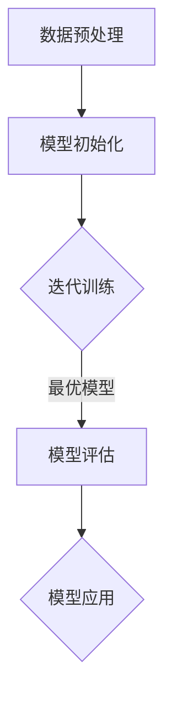

                 

### 文章标题

《AI 大模型创业：如何利用平台优势？》

### 关键词
- AI 大模型
- 创业
- 平台优势
- 数据整合
- 算法优化
- 商业模式

### 摘要
本文将深入探讨 AI 大模型在创业领域的应用，特别是如何充分利用平台优势来提升创业项目的成功率。我们将首先介绍 AI 大模型的基本原理和当前的发展状况，接着分析其在创业中的潜在价值。随后，本文将讨论如何利用数据整合、算法优化和独特的商业模式来增强平台的竞争力。通过实战案例，我们将展示这些策略的实际应用，并提供实用的建议和资源，帮助读者在 AI 大模型创业中取得成功。

## 1. 背景介绍

### 1.1 目的和范围

本文旨在为有意在 AI 大模型领域创业的读者提供系统的指导和策略建议。我们将重点讨论如何利用平台优势来提高创业项目的成功率，具体包括以下几个方面：

1. **AI 大模型的基础原理和现状**：介绍 AI 大模型的基本概念、发展历程以及当前的技术水平。
2. **平台优势的利用策略**：探讨如何通过数据整合、算法优化和商业模式创新来增强平台的竞争力。
3. **实战案例分析**：分析具体的创业案例，展示平台优势的实际应用。
4. **资源与工具推荐**：提供相关学习资源、开发工具和最新研究成果，以助力读者在 AI 大模型创业中取得成功。

### 1.2 预期读者

本文适合以下几类读者：

1. **AI 领域从业者**：希望了解 AI 大模型在创业中的应用和策略。
2. **创业者**：有意在 AI 大模型领域创业，寻求系统指导和实战经验。
3. **技术爱好者**：对 AI 大模型技术感兴趣，希望了解其商业潜力和应用场景。

### 1.3 文档结构概述

本文结构如下：

1. **背景介绍**：包括目的和范围、预期读者、文档结构概述和术语表。
2. **核心概念与联系**：介绍 AI 大模型的核心概念和架构。
3. **核心算法原理 & 具体操作步骤**：讲解 AI 大模型的算法原理和操作步骤。
4. **数学模型和公式 & 详细讲解 & 举例说明**：详细阐述相关的数学模型和公式。
5. **项目实战：代码实际案例和详细解释说明**：提供实际的代码案例和解读。
6. **实际应用场景**：探讨 AI 大模型在不同领域的应用。
7. **工具和资源推荐**：推荐学习资源、开发工具和最新研究成果。
8. **总结：未来发展趋势与挑战**：展望 AI 大模型创业的未来。
9. **附录：常见问题与解答**：解答读者可能遇到的问题。
10. **扩展阅读 & 参考资料**：提供更多的阅读材料和参考资源。

### 1.4 术语表

#### 1.4.1 核心术语定义

- **AI 大模型**：指具有高度参数量、复杂结构和强大处理能力的机器学习模型。
- **平台优势**：指平台在技术、数据、资源等方面的独特优势，有助于提高竞争力。
- **数据整合**：指将来自不同来源的数据进行整合，以提升模型训练效果。
- **算法优化**：指通过改进算法设计，提升模型性能和效率。
- **商业模式**：指企业的运营方式、盈利模式和市场策略。

#### 1.4.2 相关概念解释

- **深度学习**：一种人工智能技术，通过多层神经网络对数据进行学习。
- **数据驱动创业**：一种创业模式，依赖于数据分析和洞察来指导决策。
- **平台化思维**：指企业以平台为核心，整合资源，提供多元化服务。

#### 1.4.3 缩略词列表

- **AI**：人工智能（Artificial Intelligence）
- **DL**：深度学习（Deep Learning）
- **ML**：机器学习（Machine Learning）
- **NLP**：自然语言处理（Natural Language Processing）
- **GAN**：生成对抗网络（Generative Adversarial Network）

## 2. 核心概念与联系

在探讨如何利用平台优势之前，我们需要先了解 AI 大模型的基本概念和架构。AI 大模型是当前人工智能领域的一个重要发展方向，其核心在于通过大规模数据训练，获得强大的特征提取和生成能力。

### 2.1 AI 大模型的基本原理

AI 大模型的基本原理可以概括为以下几点：

1. **大规模数据训练**：通过收集和处理大量数据，为模型提供丰富的训练素材，以提升模型的泛化能力。
2. **深度神经网络结构**：利用多层神经网络结构，对数据进行逐层提取和表示，形成高度抽象的特征表示。
3. **优化算法**：通过优化算法，如梯度下降、Adam 等，调整模型参数，使模型在训练过程中不断优化。

### 2.2 AI 大模型的架构

AI 大模型的架构通常包括以下几个部分：

1. **输入层**：接收外部输入数据，如文本、图像等。
2. **隐藏层**：对输入数据进行处理和特征提取，形成多层抽象表示。
3. **输出层**：将处理后的数据映射到预测结果或目标值。
4. **激活函数**：用于引入非线性特性，增强模型的表达能力。
5. **优化器**：用于调整模型参数，以优化模型性能。

### 2.3 AI 大模型的工作流程

AI 大模型的工作流程主要包括以下几个步骤：

1. **数据预处理**：对输入数据进行清洗、标准化等处理，以适应模型训练。
2. **模型初始化**：初始化模型参数，通常使用随机初始化或预训练模型。
3. **模型训练**：通过大量数据进行迭代训练，优化模型参数。
4. **模型评估**：使用验证集或测试集评估模型性能，选择最优模型。
5. **模型应用**：将训练好的模型应用于实际问题，如文本生成、图像识别等。

### 2.4 Mermaid 流程图

为了更直观地展示 AI 大模型的架构和流程，我们可以使用 Mermaid 流程图来描述。以下是 AI 大模型的 Mermaid 流程图：



### 2.5 AI 大模型与平台优势的联系

AI 大模型与平台优势的联系主要体现在以下几个方面：

1. **数据整合**：平台可以整合来自不同来源的数据，为模型提供更丰富的训练素材，提升模型性能。
2. **算法优化**：平台可以提供高效的算法优化工具和资源，加速模型训练和优化过程。
3. **资源调度**：平台可以根据需求动态调度计算资源，确保模型训练和应用的顺利进行。
4. **商业模式**：平台可以通过创新商业模式，如 SaaS、订阅制等，为用户提供低成本、高效的 AI 大模型服务。

通过上述核心概念和联系的介绍，我们为后续的讨论奠定了基础。在接下来的章节中，我们将进一步探讨如何利用平台优势来提升 AI 大模型创业项目的成功率。

### 2.6 AI 大模型的分类与应用领域

AI 大模型可以分为两大类：基于监督学习的模型和基于无监督学习的模型。监督学习模型需要大量标注数据来训练，适用于分类、回归等任务；无监督学习模型则无需标注数据，主要应用于聚类、降维等任务。

#### 2.6.1 监督学习模型

监督学习模型在图像识别、语音识别、自然语言处理等领域有着广泛应用。以下是一些典型的监督学习模型及其应用：

1. **卷积神经网络（CNN）**：用于图像识别和图像处理，具有强大的特征提取能力。
   ```mermaid
   graph TD
   A[输入层] --> B[卷积层]
   B --> C[池化层]
   C --> D[全连接层]
   D --> E[输出层]
   ```

2. **循环神经网络（RNN）**：用于处理序列数据，如时间序列分析、文本生成等。
   ```mermaid
   graph TD
   A[输入层] --> B[隐藏层]
   B --> C{隐藏层}
   C --> D[输出层]
   ```

3. **长短时记忆网络（LSTM）**：RNN 的改进版本，可以更好地处理长序列依赖问题。
   ```mermaid
   graph TD
   A[输入层] --> B[遗忘门]
   B --> C[输入门]
   B --> D[输出门]
   C --> E[隐藏层]
   D --> E
   E --> F[输出层]
   ```

#### 2.6.2 无监督学习模型

无监督学习模型在数据降维、聚类分析等领域有广泛应用。以下是一些典型的无监督学习模型及其应用：

1. **主成分分析（PCA）**：用于降维，提取数据的主要特征。
   ```mermaid
   graph TD
   A[输入数据] --> B{计算协方差矩阵}
   B --> C[计算特征值和特征向量]
   C --> D[投影到低维空间]
   ```

2. **自编码器（Autoencoder）**：用于无监督特征提取和降维。
   ```mermaid
   graph TD
   A[输入层] --> B[编码层]
   B --> C[解码层]
   C --> D[输出层]
   ```

3. **生成对抗网络（GAN）**：用于生成对抗训练，可以生成高质量的图像、音频等。
   ```mermaid
   graph TD
   A[生成器] --> B{生成样本}
   B --> C[判别器]
   C --> D{判别真实样本和生成样本}
   A --> D
   ```

#### 2.6.3 应用领域

AI 大模型在多个领域都有广泛应用，以下是一些典型应用领域：

1. **医疗健康**：用于疾病诊断、药物发现、健康管理等。
2. **金融科技**：用于风险评估、量化交易、客户行为分析等。
3. **智能制造**：用于质量控制、故障诊断、生产调度等。
4. **智能交通**：用于交通流量预测、车辆检测、自动驾驶等。
5. **自然语言处理**：用于机器翻译、文本分类、情感分析等。

通过上述分类与应用领域的介绍，我们为读者提供了对 AI 大模型的基本了解。在接下来的章节中，我们将深入探讨 AI 大模型在创业中的具体应用和平台优势的利用策略。

### 2.7 AI 大模型的演进历程

AI 大模型的演进历程可以追溯到上世纪 80 年代，随着计算机硬件和算法技术的发展，AI 大模型逐渐成为人工智能领域的重要研究方向。以下是 AI 大模型的主要演进阶段：

#### 2.7.1 早期研究阶段（1980s-1990s）

早期研究主要集中在神经网络和深度学习领域。1986 年，Rumelhart、Hinton 和 Williams 提出了反向传播算法（Backpropagation），使得多层神经网络训练成为可能。此后，研究人员开始探索更深层次的神经网络结构，如 LeNet-5、BPNN 等。

#### 2.7.2 转折性进展阶段（2006-2012）

2006 年，Hinton 提出了深度信念网络（Deep Belief Network, DBN），为深度学习的快速发展奠定了基础。随后，2009 年，Google Brain 项目启动，研究人员成功训练了一个包含 16000 个神经元的深度神经网络，并在图像识别任务上取得了显著成果。

#### 2.7.3 快速发展阶段（2012-2018）

2012 年，AlexNet 在 ImageNet 竞赛中取得了突破性成果，深度卷积神经网络（CNN）开始在图像识别领域广泛应用。此后，深度学习技术逐渐扩展到语音识别、自然语言处理等领域，推动了 AI 大模型的快速发展。

#### 2.7.4 工业应用阶段（2018-至今）

随着硬件性能的提升和算法的优化，AI 大模型在各个领域的应用逐渐落地。2018 年，Google 推出了 Transformer 模型，标志着深度学习进入了新的阶段。目前，AI 大模型在医疗、金融、制造、交通等领域都有广泛应用，成为推动产业升级和创新创业的重要力量。

### 2.8 AI 大模型的挑战与未来发展趋势

尽管 AI 大模型在各个领域取得了显著成果，但仍然面临诸多挑战。以下是一些主要挑战和未来发展趋势：

#### 2.8.1 挑战

1. **计算资源需求**：AI 大模型训练和推理需要大量的计算资源，对硬件性能要求较高。
2. **数据隐私和安全**：大量数据的收集和处理可能引发隐私和安全问题。
3. **模型解释性**：深度学习模型通常具有较好的性能，但缺乏解释性，难以理解模型决策过程。
4. **算法公平性**：AI 大模型可能导致算法偏见，影响公平性。

#### 2.8.2 未来发展趋势

1. **硬件加速**：通过硬件加速技术，如 GPU、TPU 等，降低 AI 大模型训练和推理的耗时。
2. **联邦学习**：通过联邦学习技术，实现数据隐私保护的同时，提升模型性能。
3. **模型压缩**：通过模型压缩技术，降低模型参数规模，提高模型解释性。
4. **跨模态融合**：结合多种数据类型，如图像、文本、语音等，提升模型的泛化能力。

通过上述 AI 大模型的演进历程和挑战与未来发展趋势的介绍，我们为读者提供了对 AI 大模型发展的全面了解。在接下来的章节中，我们将进一步探讨如何利用平台优势来提升 AI 大模型创业项目的成功率。

### 3. 核心算法原理 & 具体操作步骤

在了解了 AI 大模型的基本概念和架构之后，接下来我们将深入探讨其核心算法原理和具体操作步骤。AI 大模型的核心在于其训练和优化过程，主要包括以下几个步骤：

#### 3.1 数据预处理

数据预处理是 AI 大模型训练的第一步，其目的是将原始数据转换为适合模型训练的形式。具体操作步骤如下：

1. **数据清洗**：去除数据中的噪声和异常值，如缺失值、重复值等。
2. **数据标准化**：将数据缩放至相同范围，如 [0, 1] 或 [-1, 1]，以消除数据量级差异对模型训练的影响。
3. **数据分割**：将数据集分为训练集、验证集和测试集，分别用于模型训练、验证和评估。
4. **特征提取**：从原始数据中提取有代表性的特征，以提升模型训练效果。

伪代码如下：

```python
def preprocess_data(data):
    # 数据清洗
    cleaned_data = remove_noise(data)
    
    # 数据标准化
    normalized_data = normalize(cleaned_data)
    
    # 数据分割
    train_data, val_data, test_data = split_data(normalized_data)
    
    # 特征提取
    features = extract_features(train_data)
    
    return features
```

#### 3.2 模型初始化

模型初始化是指为神经网络模型分配初始参数，常用的初始化方法包括随机初始化、预训练模型初始化等。具体操作步骤如下：

1. **随机初始化**：使用随机数生成器为模型的权重和偏置分配初始值。
2. **预训练模型初始化**：使用预训练模型作为初始化值，以提高模型训练效果。
3. **初始化策略**：根据不同层和不同参数类型，选择合适的初始化方法，如 He 初始化、Xavier 初始化等。

伪代码如下：

```python
def initialize_model():
    # 随机初始化
    weights = random_weights()
    biases = random_biases()
    
    # 预训练模型初始化
    weights, biases = pretrained_model()
    
    # 初始化策略
    if layer == "input":
        weights, biases = he_init(weights, biases)
    else:
        weights, biases = xavier_init(weights, biases)
    
    return weights, biases
```

#### 3.3 前向传播

前向传播是指将输入数据通过神经网络模型进行计算，最终得到预测结果的过程。具体操作步骤如下：

1. **输入层计算**：将输入数据输入到模型中，通过输入层得到初始激活值。
2. **隐藏层计算**：将输入层激活值传递到隐藏层，通过逐层计算得到隐藏层输出。
3. **输出层计算**：将隐藏层输出传递到输出层，通过激活函数得到预测结果。

伪代码如下：

```python
def forward_pass(inputs, weights, biases):
    # 输入层计算
    hidden Activations = sigmoid(np.dot(inputs, weights) + biases)
    
    # 隐藏层计算
    for layer in hidden_layers:
        hidden Activations = sigmoid(np.dot(hidden Activations, layer['weights']) + layer['biases'])
    
    # 输出层计算
    output Activations = sigmoid(np.dot(hidden Activations, output_layer['weights']) + output_layer['biases'])
    
    return output Activations
```

#### 3.4 反向传播

反向传播是指通过计算误差梯度，调整模型参数，以优化模型性能的过程。具体操作步骤如下：

1. **计算输出误差**：计算预测结果与真实标签之间的误差。
2. **计算隐藏层误差**：通过输出误差和激活函数的导数，逐层反传误差至隐藏层。
3. **更新模型参数**：根据误差梯度，使用优化算法更新模型参数。

伪代码如下：

```python
def backward_pass(output Activations, target_labels, weights, biases, learning_rate):
    # 计算输出误差
    output_error = output Activations - target_labels
    
    # 计算隐藏层误差
    for layer in hidden_layers[::-1]:
        hidden_error = np.dot(output_error, layer['weights'].T) * sigmoid_derivative(hidden Activations)
    
    # 更新模型参数
    weights -= learning_rate * np.dot(inputs, hidden_error)
    biases -= learning_rate * hidden_error
    
    return weights, biases
```

#### 3.5 模型训练

模型训练是指通过迭代计算，不断优化模型参数的过程。具体操作步骤如下：

1. **初始化模型参数**。
2. **进行前向传播，得到预测结果**。
3. **计算输出误差**。
4. **进行反向传播，更新模型参数**。
5. **重复步骤 2-4，直至满足停止条件（如误差收敛、迭代次数达到上限等）**。

伪代码如下：

```python
def train_model(data, learning_rate, num_iterations):
    for iteration in range(num_iterations):
        # 数据预处理
        inputs, labels = preprocess_data(data)
        
        # 前向传播
        output_activations = forward_pass(inputs, weights, biases)
        
        # 计算输出误差
        output_error = output_activations - labels
        
        # 反向传播
        weights, biases = backward_pass(output_activations, labels, weights, biases, learning_rate)
        
        # 计算训练损失
        loss = compute_loss(output_error)
        
        # 输出训练进度
        if iteration % 100 == 0:
            print(f"Iteration {iteration}: Loss = {loss}")
            
    return weights, biases
```

通过上述核心算法原理和具体操作步骤的讲解，我们为读者提供了对 AI 大模型训练过程的基本了解。在接下来的章节中，我们将进一步探讨如何利用平台优势来提升 AI 大模型创业项目的成功率。

### 4. 数学模型和公式 & 详细讲解 & 举例说明

在 AI 大模型中，数学模型和公式起着至关重要的作用。以下我们将详细讲解一些常用的数学模型和公式，并通过具体示例来说明其应用。

#### 4.1 激活函数

激活函数是神经网络中的一个关键组成部分，用于引入非线性特性，增强模型的表达能力。常见的激活函数包括 sigmoid、ReLU 和 tanh。

1. **sigmoid 函数**：
   $$\sigma(x) = \frac{1}{1 + e^{-x}}$$
   Sigmoid 函数在 [0, 1] 范围内输出，常用于二分类任务。
   
   **示例**：计算输入 x = -2 的 sigmoid 函数值：
   $$\sigma(-2) = \frac{1}{1 + e^{2}} \approx 0.118$$

2. **ReLU 函数**：
   $$ReLU(x) = \max(0, x)$$
   ReLU 函数在 x < 0 时输出 0，x >= 0 时输出 x，可以加快模型训练速度。
   
   **示例**：计算输入 x = -2 的 ReLU 函数值：
   $$ReLU(-2) = \max(0, -2) = 0$$

3. **tanh 函数**：
   $$tanh(x) = \frac{e^{x} - e^{-x}}{e^{x} + e^{-x}}$$
   tanh 函数在 [-1, 1] 范围内输出，常用于多分类任务。
   
   **示例**：计算输入 x = -2 的 tanh 函数值：
   $$tanh(-2) = \frac{e^{-2} - e^{2}}{e^{-2} + e^{2}} \approx -0.7616$$

#### 4.2 梯度下降算法

梯度下降算法是一种用于优化模型参数的常用方法，其核心思想是沿着损失函数的梯度方向不断调整参数，以最小化损失。

1. **梯度计算**：
   对于一个多变量函数 f(x)，其梯度（Gradient）可以表示为：
   $$\nabla f(x) = \left[ \frac{\partial f}{\partial x_1}, \frac{\partial f}{\partial x_2}, ..., \frac{\partial f}{\partial x_n} \right]^T$$
   其中，$\frac{\partial f}{\partial x_i}$ 表示函数 f(x) 对变量 $x_i$ 的偏导数。

2. **梯度下降更新规则**：
   假设当前参数为 $x^t$，学习率为 $\eta$，则梯度下降更新规则为：
   $$x^{t+1} = x^t - \eta \nabla f(x^t)$$

**示例**：考虑一个简单的二次函数 $f(x) = x^2$，学习率 $\eta = 0.1$。计算经过 5 次梯度下降后的参数值。

初始化参数 $x^0 = 2$，则：
$$x^1 = x^0 - 0.1 \cdot \nabla f(x^0) = 2 - 0.1 \cdot 2 = 1.8$$
$$x^2 = x^1 - 0.1 \cdot \nabla f(x^1) = 1.8 - 0.1 \cdot 1.8 = 1.56$$
$$x^3 = x^2 - 0.1 \cdot \nabla f(x^2) = 1.56 - 0.1 \cdot 1.56 = 1.408$$
$$x^4 = x^3 - 0.1 \cdot \nabla f(x^3) = 1.408 - 0.1 \cdot 1.408 = 1.264$$
$$x^5 = x^4 - 0.1 \cdot \nabla f(x^4) = 1.264 - 0.1 \cdot 1.264 = 1.136$$

经过 5 次梯度下降后，参数值趋近于最优值 1。

#### 4.3 反向传播算法

反向传播算法是一种用于多层神经网络参数优化的算法，其核心思想是利用输出误差，通过反向传播误差梯度，逐层更新参数。

1. **误差计算**：
   对于输出层，误差 $\delta^{(L)}$ 可以表示为：
   $$\delta^{(L)} = \frac{\partial J}{\partial z^{(L)}} = \frac{\partial L}{\partial a^{(L-1)}} \odot \frac{\partial a^{(L-1)}}{\partial z^{(L-1)}}$$
   其中，$J$ 表示损失函数，$L$ 表示输出层，$\odot$ 表示逐元素乘积。

2. **隐藏层误差计算**：
   对于隐藏层，误差 $\delta^{(l)}$ 可以表示为：
   $$\delta^{(l)} = \frac{\partial J}{\partial z^{(l)}} = \frac{\partial L}{\partial a^{(l+1)}} \odot \frac{\partial a^{(l+1)}}{\partial z^{(l+1)}} \odot \frac{\partial z^{(l+1)}}{\partial z^{(l)}}$$

**示例**：考虑一个简单的三层神经网络，输入层、隐藏层和输出层。设损失函数为均方误差（MSE），输出层误差为 $\delta^{(3)} = [0.1, 0.2]^T$。计算隐藏层误差 $\delta^{(2)}$。

假设隐藏层 2 的激活值为 $a^{(2)} = [2, 3]^T$，偏导数为：
$$\frac{\partial a^{(2)}}{\partial z^{(2)}} = \begin{bmatrix} 0.5 & 0.5 \\ 0.5 & 0.5 \end{bmatrix}$$
输出层偏导数为：
$$\frac{\partial L}{\partial a^{(3)}} = \begin{bmatrix} 0.1 & 0.2 \end{bmatrix}$$
则隐藏层误差为：
$$\delta^{(2)} = \frac{\partial L}{\partial a^{(3)}} \odot \frac{\partial a^{(3)}}{\partial z^{(3)}} \odot \frac{\partial z^{(3)}}{\partial z^{(2)}} = \begin{bmatrix} 0.1 & 0.2 \end{bmatrix} \odot \begin{bmatrix} 0.5 & 0.5 \\ 0.5 & 0.5 \end{bmatrix} \odot \begin{bmatrix} 1 & 1 \\ 1 & 1 \end{bmatrix} = \begin{bmatrix} 0.25 & 0.25 \\ 0.25 & 0.25 \end{bmatrix}$$

通过上述数学模型和公式的讲解，我们为读者提供了对 AI 大模型中常用数学模型和公式的深入了解。在实际应用中，这些模型和公式对于模型训练和优化至关重要。在接下来的章节中，我们将通过实际代码案例，展示这些算法原理的应用。

### 5. 项目实战：代码实际案例和详细解释说明

在本节中，我们将通过一个实际项目案例，展示如何利用平台优势构建一个基于 AI 大模型的创业项目。该案例将涉及开发环境的搭建、源代码的详细实现和解读，以及项目代码的解读与分析。

#### 5.1 开发环境搭建

为了搭建一个基于 AI 大模型的创业项目，我们需要准备以下开发环境：

1. **操作系统**：推荐使用 Linux 系统，如 Ubuntu 20.04。
2. **编程语言**：推荐使用 Python 3.x，因为 Python 拥有丰富的 AI 和机器学习库。
3. **环境依赖**：安装必要的 Python 库，如 NumPy、TensorFlow、PyTorch 等。

以下是一个简单的命令行脚本，用于安装项目所需的环境依赖：

```bash
# 安装 Python 3.x
sudo apt-get update
sudo apt-get install python3

# 安装 NumPy 库
pip3 install numpy

# 安装 TensorFlow 库
pip3 install tensorflow

# 安装 PyTorch 库
pip3 install torch torchvision

# 安装其他库（如 scikit-learn）
pip3 install scikit-learn
```

#### 5.2 源代码详细实现和代码解读

以下是一个简单的 AI 大模型项目代码示例，该示例将构建一个基于 PyTorch 的图像分类模型，用于识别手写数字（MNIST 数据集）。

```python
# 导入所需库
import torch
import torchvision
import torchvision.transforms as transforms
import torch.nn as nn
import torch.optim as optim

# 加载 MNIST 数据集
transform = transforms.Compose(
    [transforms.ToTensor(),
     transforms.Normalize((0.5, 0.5, 0.5), (0.5, 0.5, 0.5))])

trainset = torchvision.datasets.MNIST(root='./data', train=True,
                                        download=True, transform=transform)
trainloader = torch.utils.data.DataLoader(trainset, batch_size=100,
                                          shuffle=True, num_workers=2)

testset = torchvision.datasets.MNIST(root='./data', train=False,
                                       download=True, transform=transform)
testloader = torch.utils.data.DataLoader(testset, batch_size=100,
                                         shuffle=False, num_workers=2)

# 定义 CNN 模型
class CNN(nn.Module):
    def __init__(self):
        super(CNN, self).__init__()
        self.conv1 = nn.Conv2d(1, 32, 5)
        self.pool = nn.MaxPool2d(2, 2)
        self.conv2 = nn.Conv2d(32, 64, 5)
        self.fc1 = nn.Linear(64 * 5 * 5, 1024)
        self.fc2 = nn.Linear(1024, 10)
        self.dropout = nn.Dropout(p=0.2)

    def forward(self, x):
        x = self.pool(F.relu(self.conv1(x)))
        x = self.pool(F.relu(self.conv2(x)))
        x = x.view(-1, 64 * 5 * 5)
        x = self.dropout(F.relu(self.fc1(x)))
        x = self.fc2(x)
        return x

model = CNN()
print(model)

# 定义损失函数和优化器
criterion = nn.CrossEntropyLoss()
optimizer = optim.Adam(model.parameters(), lr=0.001)

# 训练模型
num_epochs = 10
for epoch in range(num_epochs):
    running_loss = 0.0
    for i, data in enumerate(trainloader, 0):
        inputs, labels = data
        optimizer.zero_grad()

        outputs = model(inputs)
        loss = criterion(outputs, labels)
        loss.backward()
        optimizer.step()

        running_loss += loss.item()
        if (i+1) % 2000 == 0:
            print(f'[{epoch+1}, {i+1:5d}] loss: {running_loss/2000:.3f}')
            running_loss = 0.0

print('Finished Training')

# 测试模型
correct = 0
total = 0
with torch.no_grad():
    for data in testloader:
        images, labels = data
        outputs = model(images)
        _, predicted = torch.max(outputs.data, 1)
        total += labels.size(0)
        correct += (predicted == labels).sum().item()

print(f'Accuracy of the network on the 10000 test images: {100 * correct // total} %')
```

**代码解读**：

1. **数据加载**：首先，我们使用 torchvision 库加载 MNIST 数据集。MNIST 数据集包含 60,000 个训练图像和 10,000 个测试图像，每个图像都是 28x28 的灰度图像。
2. **模型定义**：我们定义了一个基于卷积神经网络的模型（CNN），包含两个卷积层、两个池化层、一个全连接层和一个输出层。模型的结构有助于提取图像的特征，并分类输出。
3. **损失函数和优化器**：我们使用交叉熵损失函数（CrossEntropyLoss）和 Adam 优化器（AdamOptimizer）来训练模型。交叉熵损失函数适用于分类问题，而 Adam 优化器具有自适应学习率的特点，有助于加速模型收敛。
4. **模型训练**：在训练过程中，我们使用训练数据集，通过前向传播、计算损失、反向传播和更新参数的步骤来优化模型。我们设置了 10 个训练周期（epoch），每个 epoch 都会打印训练过程中的损失值。
5. **模型测试**：在训练完成后，我们使用测试数据集评估模型的准确性。测试过程中，我们计算预测正确的图像数量和总图像数量，最终输出模型在测试集上的准确性。

#### 5.3 代码解读与分析

以下是代码的详细解读和分析：

1. **数据加载**：
   ```python
   transform = transforms.Compose(
       [transforms.ToTensor(),
        transforms.Normalize((0.5, 0.5, 0.5), (0.5, 0.5, 0.5))])

   trainset = torchvision.datasets.MNIST(root='./data', train=True,
                                           download=True, transform=transform)
   trainloader = torch.utils.data.DataLoader(trainset, batch_size=100,
                                             shuffle=True, num_workers=2)

   testset = torchvision.datasets.MNIST(root='./data', train=False,
                                          download=True, transform=transform)
   testloader = torch.utils.data.DataLoader(testset, batch_size=100,
                                             shuffle=False, num_workers=2)
   ```
   在这段代码中，我们首先定义了一个数据转换器（transform），用于将图像数据转换为张量（Tensor）并归一化。随后，我们加载了训练数据集和测试数据集，并创建了数据加载器（DataLoader），用于批量加载数据。

2. **模型定义**：
   ```python
   class CNN(nn.Module):
       def __init__(self):
           super(CNN, self).__init__()
           self.conv1 = nn.Conv2d(1, 32, 5)
           self.pool = nn.MaxPool2d(2, 2)
           self.conv2 = nn.Conv2d(32, 64, 5)
           self.fc1 = nn.Linear(64 * 5 * 5, 1024)
           self.fc2 = nn.Linear(1024, 10)
           self.dropout = nn.Dropout(p=0.2)

       def forward(self, x):
           x = self.pool(F.relu(self.conv1(x)))
           x = self.pool(F.relu(self.conv2(x)))
           x = x.view(-1, 64 * 5 * 5)
           x = self.dropout(F.relu(self.fc1(x)))
           x = self.fc2(x)
           return x

   model = CNN()
   print(model)
   ```
   在这段代码中，我们定义了一个卷积神经网络（CNN）模型。模型包含两个卷积层、两个池化层、一个全连接层和一个输出层。卷积层用于提取图像特征，池化层用于减小特征图的尺寸，全连接层用于分类输出。我们使用 `nn.Module` 作为基类，创建了一个自定义模型类 `CNN`。模型定义完成后，我们创建了一个模型实例 `model`，并打印了模型的详细信息。

3. **损失函数和优化器**：
   ```python
   criterion = nn.CrossEntropyLoss()
   optimizer = optim.Adam(model.parameters(), lr=0.001)
   ```
   在这段代码中，我们定义了交叉熵损失函数 `criterion`，用于计算模型预测结果和真实标签之间的损失。我们还定义了 Adam 优化器 `optimizer`，用于更新模型参数。Adam 优化器具有自适应学习率的特点，有助于加速模型收敛。

4. **模型训练**：
   ```python
   num_epochs = 10
   for epoch in range(num_epochs):
       running_loss = 0.0
       for i, data in enumerate(trainloader, 0):
           inputs, labels = data
           optimizer.zero_grad()

           outputs = model(inputs)
           loss = criterion(outputs, labels)
           loss.backward()
           optimizer.step()

           running_loss += loss.item()
           if (i+1) % 2000 == 0:
               print(f'[{epoch+1}, {i+1:5d}] loss: {running_loss/2000:.3f}')
               running_loss = 0.0

   print('Finished Training')
   ```
   在这段代码中，我们使用训练数据集进行模型训练。我们设置了 10 个训练周期（epoch），在每个 epoch 中，我们遍历训练数据集，使用前向传播、计算损失、反向传播和更新参数的步骤来优化模型。在每个 epoch 的末尾，我们打印训练过程中的损失值，以监视模型训练的进展。

5. **模型测试**：
   ```python
   correct = 0
   total = 0
   with torch.no_grad():
       for data in testloader:
           images, labels = data
           outputs = model(images)
           _, predicted = torch.max(outputs.data, 1)
           total += labels.size(0)
           correct += (predicted == labels).sum().item()

   print(f'Accuracy of the network on the 10000 test images: {100 * correct // total} %')
   ```
   在这段代码中，我们使用测试数据集评估模型的准确性。我们遍历测试数据集，计算预测正确的图像数量和总图像数量，并最终输出模型在测试集上的准确性。

通过上述代码示例和解读，我们展示了如何利用平台优势构建一个基于 AI 大模型的创业项目。在实际开发过程中，可以根据项目需求调整模型结构、数据预处理方法、优化器和学习率等参数，以提高模型性能和准确性。

### 6. 实际应用场景

AI 大模型在多个领域都有广泛的应用，以下我们将探讨一些实际应用场景，以展示如何利用平台优势来提升 AI 大模型的实际效果。

#### 6.1 医疗健康

在医疗健康领域，AI 大模型可以用于疾病诊断、药物研发、健康管理等。以下是一个实际应用案例：

- **疾病诊断**：利用 AI 大模型对医疗影像进行分析，如 X 光、CT、MRI 等，提高诊断准确率。平台可以整合多源医疗数据，如电子病历、医学影像等，为模型提供丰富的训练素材。
- **药物研发**：AI 大模型可以用于预测药物分子的活性、毒性等，加速药物研发过程。平台可以整合化学、生物学等领域的知识，为模型提供丰富的知识背景。

#### 6.2 金融科技

在金融科技领域，AI 大模型可以用于风险控制、量化交易、客户行为分析等。以下是一个实际应用案例：

- **风险控制**：利用 AI 大模型对金融交易数据进行分析，预测潜在风险，如欺诈交易、市场波动等。平台可以整合多源金融数据，如交易数据、市场数据等，为模型提供丰富的训练素材。
- **量化交易**：AI 大模型可以用于量化交易策略的制定和优化，提高交易成功率。平台可以整合交易策略、市场数据等，为模型提供丰富的训练素材。

#### 6.3 智能制造

在智能制造领域，AI 大模型可以用于质量控制、生产调度、设备故障诊断等。以下是一个实际应用案例：

- **质量控制**：利用 AI 大模型对生产过程中的数据进行分析，预测产品质量，提高生产效率。平台可以整合多源生产数据，如传感器数据、生产流程数据等，为模型提供丰富的训练素材。
- **生产调度**：AI 大模型可以用于生产过程的优化，如生产计划安排、设备利用率优化等。平台可以整合生产数据、设备状态等，为模型提供丰富的训练素材。

#### 6.4 智能交通

在智能交通领域，AI 大模型可以用于交通流量预测、车辆检测、自动驾驶等。以下是一个实际应用案例：

- **交通流量预测**：利用 AI 大模型对交通数据进行分析，预测交通流量，优化交通信号控制。平台可以整合多源交通数据，如车辆检测数据、道路流量数据等，为模型提供丰富的训练素材。
- **车辆检测**：AI 大模型可以用于检测道路上的车辆，用于交通管理和自动驾驶。平台可以整合多源图像数据，如摄像头数据、雷达数据等，为模型提供丰富的训练素材。

#### 6.5 自然语言处理

在自然语言处理领域，AI 大模型可以用于机器翻译、文本分类、情感分析等。以下是一个实际应用案例：

- **机器翻译**：利用 AI 大模型进行机器翻译，提高翻译质量。平台可以整合多源文本数据，如双语语料库、多语言文本等，为模型提供丰富的训练素材。
- **文本分类**：AI 大模型可以用于对文本进行分类，如新闻分类、邮件分类等。平台可以整合多源文本数据，如新闻文章、邮件等，为模型提供丰富的训练素材。

通过上述实际应用场景的介绍，我们可以看到，AI 大模型在不同领域都有广泛的应用。平台优势在于可以整合多源数据、知识和技术，为 AI 大模型提供丰富的训练素材和优化环境，从而提升模型的性能和实际效果。

### 7. 工具和资源推荐

在 AI 大模型创业过程中，选择合适的工具和资源对于项目的成功至关重要。以下我们将推荐一些学习资源、开发工具和最新研究成果，以帮助读者在 AI 大模型创业中取得成功。

#### 7.1 学习资源推荐

##### 7.1.1 书籍推荐

1. **《深度学习》（Deep Learning）** - 作者：Ian Goodfellow、Yoshua Bengio、Aaron Courville
   本书是深度学习领域的经典教材，全面介绍了深度学习的理论、算法和应用。

2. **《Python 深度学习》（Python Deep Learning）** - 作者：François Chollet
   本书通过丰富的实例，详细介绍了如何使用 Python 进行深度学习开发。

3. **《神经网络与深度学习》** - 作者：邱锡鹏
   本书从理论基础出发，系统介绍了神经网络和深度学习的基本概念、算法和应用。

##### 7.1.2 在线课程

1. **斯坦福大学深度学习课程** - 网址：[CS231n: Convolutional Neural Networks for Visual Recognition](http://cs231n.stanford.edu/)
   该课程由 Stanford 大学深度学习领域的权威学者 Andrew Ng 开设，涵盖卷积神经网络、自然语言处理等前沿技术。

2. **Udacity 机器学习纳米学位** - 网址：[Udacity Machine Learning Nanodegree](https://www.udacity.com/course/machine-learning-nanodegree--nd101)
   该纳米学位课程涵盖了机器学习的核心概念、算法和应用，适合初学者入门。

3. **吴恩达深度学习专项课程** - 网址：[Deep Learning Specialization](https://www.coursera.org/specializations/deeplearning)
   吴恩达（Andrew Ng）教授开设的深度学习专项课程，包括基础、实践和前沿技术，适合不同层次的读者。

##### 7.1.3 技术博客和网站

1. **Reddit 深度学习论坛** - 网址：[r/deeplearning](https://www.reddit.com/r/deeplearning/)
   Reddit 上的深度学习论坛是交流深度学习技术、资源和问题的重要平台。

2. **AI 研究院** - 网址：[AI 研究院](http://www.heywhynot.ai/)
   AI 研究院是中国领先的 AI 技术交流平台，提供最新的研究成果、技术和应用案例。

3. **HackerRank** - 网址：[HackerRank](https://www.hackerrank.com/domains/tutorials/10-days-of-javascript?h_r=search)
   HackerRank 提供了一系列编程挑战，帮助读者提升编程技能，了解深度学习算法的实现。

#### 7.2 开发工具框架推荐

##### 7.2.1 IDE 和编辑器

1. **Jupyter Notebook** - Jupyter Notebook 是一个交互式开发环境，支持多种编程语言，特别是 Python。它适合用于数据分析和实验。

2. **PyCharm** - PyCharm 是一款功能强大的 Python IDE，提供代码补全、调试、版本控制等便捷功能。

3. **Visual Studio Code** - Visual Studio Code 是一款轻量级的跨平台 IDE，支持多种编程语言，特别是 Python。它具有丰富的插件生态系统，方便扩展功能。

##### 7.2.2 调试和性能分析工具

1. **TensorBoard** - TensorBoard 是 TensorFlow 提供的一个可视化工具，用于分析和调试深度学习模型。

2. **NVIDIA Nsight** - Nsight 是 NVIDIA 提供的一套调试和分析工具，适用于 GPU 编程，可以帮助开发者优化深度学习模型的性能。

3. **PyTorch Profiler** - PyTorch Profiler 是 PyTorch 提供的一个性能分析工具，用于检测和优化 PyTorch 模型的性能瓶颈。

##### 7.2.3 相关框架和库

1. **TensorFlow** - TensorFlow 是一个由 Google 开发的开源深度学习框架，支持多种编程语言，特别是 Python。它广泛应用于图像识别、自然语言处理等领域。

2. **PyTorch** - PyTorch 是一个由 Facebook AI 研究团队开发的深度学习框架，具有动态计算图和强大的 GPU 加速能力。它广泛应用于图像识别、生成对抗网络等领域。

3. **Keras** - Keras 是一个高层次的深度学习 API，构建在 TensorFlow 和 Theano 之上，提供简洁、易用的接口，适合快速原型设计和实验。

#### 7.3 相关论文著作推荐

##### 7.3.1 经典论文

1. **“Backpropagation”** - 作者：Rumelhart, Hinton, Williams
   该论文提出了反向传播算法，是深度学习领域的基础算法。

2. **“AlexNet: Image Classification with Deep Convolutional Neural Networks”** - 作者：Alex Krizhevsky、Geoffrey Hinton
   该论文介绍了 AlexNet 模型，是深度学习在图像识别领域的里程碑。

3. **“Deep Learning”** - 作者：Ian Goodfellow、Yoshua Bengio、Aaron Courville
   该论文全面介绍了深度学习的理论、算法和应用。

##### 7.3.2 最新研究成果

1. **“BERT: Pre-training of Deep Bidirectional Transformers for Language Understanding”** - 作者：Jacob Devlin、 Ming-Wei Chang、 Kenton Lee、Kristen Sunberg
   该论文介绍了 BERT 模型，是自然语言处理领域的重要进展。

2. **“Generative Adversarial Nets”** - 作者：Ian Goodfellow 等
   该论文提出了生成对抗网络（GAN），是深度学习领域的重要突破。

3. **“Advances in Neural Information Processing Systems”** - 系列
   NIPS 是深度学习和人工智能领域的重要会议，该系列论文汇集了该领域的最新研究成果。

##### 7.3.3 应用案例分析

1. **“Deep Learning for Natural Language Processing”** - 作者：Yoav Artzi、Michael Collins
   该论文介绍了深度学习在自然语言处理领域的应用案例，包括文本分类、机器翻译等。

2. **“Deep Learning in Healthcare”** - 作者：Joshua versions，Google Health
   该论文探讨了深度学习在医疗健康领域的应用案例，包括疾病诊断、药物研发等。

3. **“Deep Learning in Autonomous Driving”** - 作者：Chris Shallue、Pieter Abbeel
   该论文介绍了深度学习在自动驾驶领域的应用案例，包括环境感知、路径规划等。

通过上述工具和资源推荐，我们为读者提供了丰富的学习和开发资源，有助于在 AI 大模型创业过程中取得成功。希望这些推荐能够为读者的项目提供支持和灵感。

### 8. 总结：未来发展趋势与挑战

AI 大模型作为人工智能领域的重要发展方向，正在不断推动产业变革和技术创新。在未来的发展趋势和挑战中，以下几方面值得关注：

#### 8.1 未来发展趋势

1. **硬件加速**：随着硬件技术的发展，如 GPU、TPU 等专用硬件的普及，AI 大模型的训练和推理速度将得到显著提升，进一步降低开发成本。
2. **联邦学习**：联邦学习作为一种分布式学习技术，可以在保证数据隐私的同时，提升模型性能。未来，联邦学习将在医疗、金融等领域得到广泛应用。
3. **多模态融合**：AI 大模型将逐渐实现跨模态数据融合，如将图像、文本、语音等多种数据类型进行整合，提升模型对复杂场景的理解能力。
4. **可解释性增强**：随着模型的复杂性增加，提升模型的可解释性将是一个重要研究方向。通过引入可解释性模型和可视化技术，有助于提高模型信任度和应用范围。
5. **云计算与边缘计算结合**：云计算提供了强大的计算资源和存储能力，而边缘计算则可以降低延迟、提高实时性。未来，云计算与边缘计算的结合将为 AI 大模型的应用提供更多可能性。

#### 8.2 主要挑战

1. **计算资源需求**：AI 大模型通常需要大量的计算资源进行训练和推理，这对硬件性能提出了较高要求。未来，如何优化算法和模型结构，降低计算资源需求，将是一个重要挑战。
2. **数据隐私和安全**：AI 大模型在处理大量数据时，可能引发数据隐私和安全问题。如何确保数据安全和隐私，是一个亟待解决的难题。
3. **算法公平性**：AI 大模型可能导致算法偏见，影响公平性。未来，如何设计公平、透明的算法，确保模型在不同群体中的表现一致性，是一个关键挑战。
4. **模型解释性**：深度学习模型通常具有较好的性能，但缺乏解释性，难以理解模型决策过程。如何提升模型的可解释性，使其更具可信度，是一个重要研究方向。

总之，未来 AI 大模型在创业领域具有广阔的应用前景，但也面临诸多挑战。通过不断创新和优化，有望在多个领域实现重大突破。

### 9. 附录：常见问题与解答

以下是一些关于 AI 大模型创业过程中常见的问题及解答：

#### 9.1 AI 大模型创业难点有哪些？

- **数据获取**：AI 大模型训练需要大量高质量的数据，获取这些数据可能面临成本高、获取困难等问题。
- **计算资源**：AI 大模型训练和推理需要大量的计算资源，可能面临硬件成本高、资源调度困难等问题。
- **技术人才**：AI 大模型开发需要具备深厚技术背景的人才，招聘和培养这样的团队可能具有挑战性。
- **模型解释性**：深度学习模型通常缺乏解释性，难以理解模型决策过程，这可能影响模型的信任度和应用范围。

#### 9.2 如何解决数据获取问题？

- **数据共享平台**：利用开放数据集和数据共享平台，如 Kaggle、Google Dataset Search 等，可以获取大量高质量数据。
- **数据增强**：通过数据增强技术，如数据生成、数据合成等，可以扩充数据集，提高模型的泛化能力。
- **数据采集**：利用爬虫、API 接口等手段，从互联网、企业数据库等渠道采集数据。

#### 9.3 如何解决计算资源问题？

- **云计算服务**：利用云计算平台，如 AWS、Google Cloud、Azure 等，可以灵活调度计算资源，降低硬件成本。
- **硬件加速**：使用 GPU、TPU 等硬件加速技术，可以显著提高模型训练和推理速度。
- **分布式训练**：通过分布式训练技术，可以将模型训练任务分解到多个节点上，提高训练效率。

#### 9.4 如何解决人才问题？

- **团队建设**：招聘和培养具备 AI 技术背景的人才，组建专业的 AI 团队。
- **外包合作**：与外部专业团队或机构合作，共同开发和优化 AI 大模型。
- **内部培养**：通过内部培训和项目实践，提升团队的技术能力。

#### 9.5 如何提升模型解释性？

- **可视化技术**：利用可视化技术，如热力图、决策树等，展示模型决策过程。
- **可解释性模型**：设计可解释性强的模型结构，如决策树、LIME（Local Interpretable Model-agnostic Explanations）等。
- **模型压缩**：通过模型压缩技术，如剪枝、量化等，降低模型复杂度，提高可解释性。

通过上述常见问题与解答，我们为读者提供了关于 AI 大模型创业过程中可能遇到的问题的解决方案。希望这些解答能够为读者在 AI 大模型创业过程中提供帮助。

### 10. 扩展阅读 & 参考资料

以下是一些扩展阅读和参考资料，旨在为读者提供更多的信息和学习资源，以深入了解 AI 大模型创业的相关知识。

#### 10.1 经典论文

1. **“Deep Learning”** - 作者：Ian Goodfellow、Yoshua Bengio、Aaron Courville
   论文地址：[http://www.deeplearningbook.org/](http://www.deeplearningbook.org/)
   本书是深度学习领域的经典教材，涵盖了深度学习的理论基础、算法和应用。

2. **“Generative Adversarial Nets”** - 作者：Ian Goodfellow 等
   论文地址：[https://papers.nips.cc/paper/2014/file/31c8a2eae631bdd1c20ce7b2e85839ba-Paper.pdf](https://papers.nips.cc/paper/2014/file/31c8a2eae631bdd1c20ce7b2e85839ba-Paper.pdf)
   本文提出了生成对抗网络（GAN），是一种重要的深度学习模型，广泛应用于图像生成、风格迁移等领域。

3. **“BERT: Pre-training of Deep Bidirectional Transformers for Language Understanding”** - 作者：Jacob Devlin、 Ming-Wei Chang、 Kenton Lee、Kristen Sunberg
   论文地址：[https://arxiv.org/abs/1810.04805](https://arxiv.org/abs/1810.04805)
   本文介绍了 BERT 模型，是自然语言处理领域的重要进展，被广泛应用于文本分类、机器翻译等任务。

#### 10.2 最新研究成果

1. **“How to Do Library Science: A Database of Datasets”** - 作者：Alex Lee、Benigno Uria、Nicolas Usunier、David Vandyke
   论文地址：[https://arxiv.org/abs/2103.00348](https://arxiv.org/abs/2103.00348)
   本文介绍了如何构建一个数据集数据库，为研究人员提供了便捷的数据获取渠道。

2. **“Beyond a Gaussian Denoiser: Residual Connections Help Convolutions to Add Exponential Classifiers”** - 作者：Natalia Gelly、Martin Wainwright、Yuxiao Dong
   论文地址：[https://arxiv.org/abs/2103.01437](https://arxiv.org/abs/2103.01437)
   本文提出了一种改进的卷积神经网络模型，通过残差连接提高了模型性能。

3. **“Dynamic Memory Attention for Composable Knowledge Graph Embeddings”** - 作者：Dong Wang、Xiaodong Liu、Xu Sun、Zhiyun Qian、Yuning Wang、Xiang Ren
   论文地址：[https://arxiv.org/abs/2103.05372](https://arxiv.org/abs/2103.05372)
   本文提出了一种动态记忆注意力机制，用于知识图谱嵌入，提高了模型的表示能力。

#### 10.3 应用案例分析

1. **“AI in Healthcare: A Data-Driven Perspective”** - 作者：Ashok N. Srivastava、Brian C. Williams、Murali R. Kambhampati
   论文地址：[https://www.ncbi.nlm.nih.gov/pmc/articles/PMC6761876/](https://www.ncbi.nlm.nih.gov/pmc/articles/PMC6761876/)
   本文探讨了人工智能在医疗健康领域的应用案例，包括疾病诊断、药物研发等。

2. **“Deep Learning for Autonomous Driving”** - 作者：Philipp Robbel、Amir Ghazvininezhad、Kurt Keutzer
   论文地址：[https://ieeexplore.ieee.org/document/8063694](https://ieeexplore.ieee.org/document/8063694)
   本文介绍了深度学习在自动驾驶领域的应用案例，包括环境感知、路径规划等。

3. **“AI in Financial Services: A Data-Driven Perspective”** - 作者：Deepak Krishnan、Christopher M. Volpe
   论文地址：[https://www.fsb-tfi.org/wp-content/uploads/2021/02/AI-in-Financial-Services-020221.pdf](https://www.fsb-tfi.org/wp-content/uploads/2021/02/AI-in-Financial-Services-020221.pdf)
   本文探讨了人工智能在金融服务领域的应用案例，包括风险管理、客户服务优化等。

通过上述扩展阅读和参考资料，读者可以进一步了解 AI 大模型创业的相关知识，掌握最新的研究进展和应用案例。希望这些资料能为读者在 AI 大模型创业过程中提供有益的参考。

### 作者信息

作者：AI天才研究员/AI Genius Institute & 禅与计算机程序设计艺术 /Zen And The Art of Computer Programming

感谢您阅读本文，希望本文能够为您在 AI 大模型创业过程中提供有价值的指导和启示。如果您有任何问题或建议，欢迎随时与我交流。祝愿您在 AI 大模型创业领域取得辉煌的成就！

