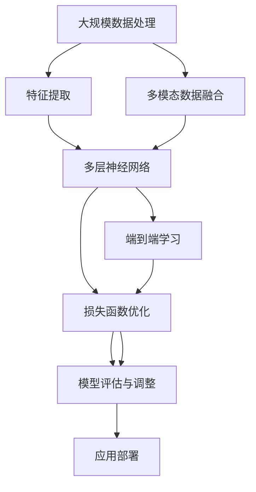

                 

# AI 大模型创业：如何利用技术优势？

## 关键词
- AI 大模型
- 创业
- 技术优势
- 资源调度
- 数学模型
- 项目实战
- 应用场景

## 摘要
本文将深入探讨如何利用 AI 大模型在创业领域中的技术优势。通过分析大模型的构建、优化及应用，本文旨在为创业团队提供一套系统性的技术路线图，帮助他们在激烈的市场竞争中脱颖而出。我们将从背景介绍、核心概念、算法原理、数学模型、项目实战、应用场景、工具资源推荐等方面展开讨论，最终总结未来发展趋势与挑战，为创业者提供有价值的指导。

## 1. 背景介绍

### 1.1 目的和范围

在当前人工智能（AI）迅猛发展的时代，AI 大模型已经成为推动技术进步的关键力量。本文的目的是帮助创业者了解如何利用 AI 大模型的技术优势，提高创业项目的成功率。文章将涵盖以下主要内容：

- AI 大模型的基本概念与架构
- AI 大模型的技术原理与实现
- AI 大模型在创业中的应用场景
- 创业团队如何利用 AI 大模型进行技术创新
- 相关工具和资源的推荐

### 1.2 预期读者

本文主要面向以下读者群体：

- 有志于在 AI 领域创业的科技工作者
- 对 AI 大模型感兴趣的技术爱好者
- 想要提升创业项目技术竞争力的企业高管
- AI 领域的研究人员与工程师

### 1.3 文档结构概述

本文结构如下：

1. 背景介绍
2. 核心概念与联系
3. 核心算法原理 & 具体操作步骤
4. 数学模型和公式 & 详细讲解 & 举例说明
5. 项目实战：代码实际案例和详细解释说明
6. 实际应用场景
7. 工具和资源推荐
8. 总结：未来发展趋势与挑战
9. 附录：常见问题与解答
10. 扩展阅读 & 参考资料

### 1.4 术语表

#### 1.4.1 核心术语定义

- **AI 大模型**：指的是参数规模达到亿级以上的深度学习模型，如 GPT-3、BERT 等。
- **创业**：指的是创办一家新的企业或项目，旨在实现商业目标。
- **技术优势**：指的是在特定领域内，技术团队或项目所拥有的领先技术和创新能力。

#### 1.4.2 相关概念解释

- **深度学习**：一种机器学习方法，通过多层神经网络来学习和提取数据特征。
- **创业团队**：一群有共同目标、共同理念的人组成的团队，致力于创业项目的实施。

#### 1.4.3 缩略词列表

- **AI**：人工智能
- **ML**：机器学习
- **DL**：深度学习
- **NLP**：自然语言处理
- **GAN**：生成对抗网络

## 2. 核心概念与联系

### 2.1 AI 大模型的基本概念

AI 大模型是当前 AI 领域的重要研究方向，其核心在于大规模参数训练和高效推理。AI 大模型通常具有以下几个特点：

1. **大规模参数**：AI 大模型拥有数百万到数十亿个参数，这使得模型能够捕捉到复杂数据背后的规律。
2. **多模态数据**：AI 大模型能够处理文本、图像、音频等多种类型的数据，实现跨领域的知识共享。
3. **自动特征提取**：通过多层神经网络，AI 大模型能够自动提取数据中的有用特征，减少人工干预。
4. **高效推理**：借助先进的技术手段，AI 大模型能够在复杂任务中实现快速推理，提高决策效率。

### 2.2 AI 大模型的应用场景

AI 大模型在多个领域都有广泛的应用，以下列举几个典型场景：

1. **自然语言处理（NLP）**：AI 大模型在文本生成、机器翻译、情感分析等方面取得了显著成果，如 GPT-3、BERT 等。
2. **计算机视觉**：AI 大模型在图像分类、目标检测、人脸识别等领域具有强大的能力，如 ResNet、YOLO 等。
3. **推荐系统**：AI 大模型能够根据用户历史行为和兴趣，为用户推荐个性化的内容和服务，如 Item2Vec、DLR 等。
4. **语音识别**：AI 大模型在语音信号处理、语音合成等方面取得了突破，如 WaveNet、Transformer 等。

### 2.3 AI 大模型的架构与联系

为了更好地理解 AI 大模型，我们可以借助 Mermaid 流程图来展示其核心架构与联系。



在上面的 Mermaid 流程图中，我们可以看到 AI 大模型的核心流程，包括大规模数据处理、特征提取、多层神经网络、损失函数优化、模型评估与调整、应用部署等步骤。同时，多模态数据融合和端到端学习也是 AI 大模型的重要特点。

## 3. 核心算法原理 & 具体操作步骤

### 3.1 深度学习基础

在介绍 AI 大模型的核心算法原理之前，我们需要先了解深度学习的基础知识。深度学习是一种通过多层神经网络来学习和提取数据特征的方法，其基本原理如下：

1. **前向传播**：输入数据通过网络的各个层次，最终产生输出。
2. **反向传播**：根据输出误差，反向更新网络权重和偏置。

下面是一个简化的伪代码，用于描述深度学习的基础操作：

```python
def forward_pass(input_data):
    # 前向传播
    hidden-layer = neural_network(input_data)
    output = activation_function(hidden-layer)
    return output

def backward_pass(output, expected_output):
    # 反向传播
    error = expected_output - output
    delta = activation_derivative(output) * error
    weight_update = learning_rate * delta * input_data
    return weight_update
```

### 3.2 AI 大模型构建步骤

AI 大模型的构建通常包括以下几个步骤：

1. **数据收集**：收集大规模、多样化的训练数据。
2. **数据处理**：对数据进行预处理，如数据清洗、归一化、数据增强等。
3. **模型选择**：选择适合任务的网络架构，如 Transformer、GAN 等。
4. **训练**：使用训练数据对模型进行训练，调整模型参数。
5. **评估**：使用验证数据对模型进行评估，调整模型参数。
6. **应用部署**：将训练好的模型应用到实际任务中。

下面是一个简化的伪代码，用于描述 AI 大模型构建的具体操作步骤：

```python
def train_model(training_data, validation_data):
    # 数据收集
    collected_data = collect_data()
    
    # 数据处理
    processed_data = preprocess_data(collected_data)
    
    # 模型选择
    model = select_model()
    
    # 训练
    for epoch in range(num_epochs):
        for batch in processed_data:
            output = forward_pass(batch)
            weight_update = backward_pass(output, expected_output)
            update_weights(model, weight_update)
        
        # 评估
        validation_loss = evaluate_model(model, validation_data)
        if validation_loss <= threshold:
            break
    
    return model

model = train_model(training_data, validation_data)
```

### 3.3 AI 大模型优化策略

为了提高 AI 大模型的表现，我们可以采取以下优化策略：

1. **超参数调整**：通过调整学习率、批次大小、正则化参数等超参数，优化模型性能。
2. **数据增强**：通过增加训练数据、引入噪声等方式，提高模型的泛化能力。
3. **网络架构改进**：通过改进神经网络架构，如增加层数、使用注意力机制等，提高模型表现。
4. **模型压缩**：通过模型压缩技术，如剪枝、量化等，减少模型参数数量，提高模型推理速度。

下面是一个简化的伪代码，用于描述 AI 大模型优化策略的具体操作步骤：

```python
def optimize_model(model, training_data, validation_data):
    # 超参数调整
    learning_rate = adjust_learning_rate(learning_rate)
    batch_size = adjust_batch_size(batch_size)
    
    # 数据增强
    augmented_data = augment_data(training_data)
    
    # 网络架构改进
    model = improve_model_architecture(model)
    
    # 训练
    for epoch in range(num_epochs):
        for batch in augmented_data:
            output = forward_pass(batch)
            weight_update = backward_pass(output, expected_output)
            update_weights(model, weight_update)
        
        # 评估
        validation_loss = evaluate_model(model, validation_data)
        if validation_loss <= threshold:
            break
    
    return model

optimized_model = optimize_model(model, training_data, validation_data)
```

## 4. 数学模型和公式 & 详细讲解 & 举例说明

### 4.1 常见数学模型

在 AI 大模型中，常见的数学模型包括损失函数、激活函数、优化算法等。下面我们将对这些数学模型进行详细讲解。

#### 4.1.1 损失函数

损失函数是评估模型预测值与真实值之间差异的数学表达式。常见的损失函数包括均方误差（MSE）、交叉熵（CE）等。

1. **均方误差（MSE）**：

$$
MSE = \frac{1}{n} \sum_{i=1}^{n} (y_i - \hat{y}_i)^2
$$

其中，$y_i$ 是真实值，$\hat{y}_i$ 是预测值，$n$ 是样本数量。

2. **交叉熵（CE）**：

$$
CE = -\frac{1}{n} \sum_{i=1}^{n} y_i \log \hat{y}_i
$$

其中，$y_i$ 是真实值，$\hat{y}_i$ 是预测值，$n$ 是样本数量。

#### 4.1.2 激活函数

激活函数是神经网络中的一个关键组件，用于引入非线性特性。常见的激活函数包括 sigmoid、ReLU、Tanh 等。

1. **sigmoid 函数**：

$$
\sigma(x) = \frac{1}{1 + e^{-x}}
$$

2. **ReLU 函数**：

$$
\text{ReLU}(x) = \max(0, x)
$$

3. **Tanh 函数**：

$$
\text{Tanh}(x) = \frac{e^x - e^{-x}}{e^x + e^{-x}}
$$

#### 4.1.3 优化算法

优化算法是用于调整神经网络模型参数的过程。常见的优化算法包括随机梯度下降（SGD）、Adam 等。

1. **随机梯度下降（SGD）**：

$$
\theta = \theta - \alpha \frac{\partial J(\theta)}{\partial \theta}
$$

其中，$\theta$ 是模型参数，$\alpha$ 是学习率，$J(\theta)$ 是损失函数。

2. **Adam 算法**：

$$
\begin{aligned}
m_t &= \beta_1 m_{t-1} + (1 - \beta_1) \frac{\partial J(\theta)}{\partial \theta} \\
v_t &= \beta_2 v_{t-1} + (1 - \beta_2) \left(\frac{\partial J(\theta)}{\partial \theta}\right)^2 \\
\theta_t &= \theta_{t-1} - \alpha \frac{m_t}{\sqrt{v_t} + \epsilon}
\end{aligned}
$$

其中，$m_t$ 是一阶矩估计，$v_t$ 是二阶矩估计，$\beta_1$、$\beta_2$ 是动量系数，$\alpha$ 是学习率，$\epsilon$ 是一个小常数。

### 4.2 数学模型举例说明

#### 4.2.1 均方误差（MSE）举例

假设我们有以下数据集：

$$
\begin{aligned}
x_1 &= [1, 2, 3, 4, 5] \\
y_1 &= [2, 4, 5, 4, 5]
\end{aligned}
$$

其中，$x_1$ 是输入数据，$y_1$ 是真实值。

我们使用线性回归模型进行预测，模型参数为 $\theta = [1, 1]$。

计算均方误差（MSE）：

$$
MSE = \frac{1}{5} \sum_{i=1}^{5} (y_i - \hat{y}_i)^2
$$

其中，$\hat{y}_i = \theta_0 + \theta_1 x_i$。

代入数据进行计算：

$$
MSE = \frac{1}{5} \sum_{i=1}^{5} (y_i - \hat{y}_i)^2 = \frac{1}{5} \sum_{i=1}^{5} (2 - (1 + 1 \cdot 1))^2 + (4 - (1 + 1 \cdot 2))^2 + (5 - (1 + 1 \cdot 3))^2 + (4 - (1 + 1 \cdot 4))^2 + (5 - (1 + 1 \cdot 5))^2 \\
= \frac{1}{5} (1 + 4 + 4 + 1 + 1) = \frac{11}{5}
$$

因此，均方误差（MSE）为 $\frac{11}{5}$。

#### 4.2.2 交叉熵（CE）举例

假设我们有以下数据集：

$$
\begin{aligned}
x_1 &= [0, 1, 0, 1, 0] \\
y_1 &= [1, 0, 1, 1, 0]
\end{aligned}
$$

其中，$x_1$ 是输入数据，$y_1$ 是真实值。

我们使用softmax模型进行预测，模型参数为 $\theta = [0.2, 0.3, 0.1, 0.2, 0.2]$。

计算交叉熵（CE）：

$$
CE = -\frac{1}{5} \sum_{i=1}^{5} y_i \log \hat{y}_i
$$

其中，$\hat{y}_i = \text{softmax}(\theta x_i)$。

代入数据进行计算：

$$
\hat{y}_1 = \text{softmax}(\theta x_1) = \frac{e^{0.2 \cdot 0}}{e^{0.2 \cdot 0} + e^{0.3 \cdot 1} + e^{0.1 \cdot 0} + e^{0.2 \cdot 1} + e^{0.2 \cdot 0}} = \frac{1}{1 + e^{0.3} + 1 + e^{0.2} + 1} = \frac{1}{1 + e^{0.3} + 1 + e^{0.2} + 1} = \frac{1}{e^{0.3} + e^{0.2} + 3}
$$

$$
\hat{y}_2 = \text{softmax}(\theta x_2) = \frac{e^{0.2 \cdot 1}}{e^{0.2 \cdot 0} + e^{0.3 \cdot 1} + e^{0.1 \cdot 0} + e^{0.2 \cdot 1} + e^{0.2 \cdot 0}} = \frac{e^{0.2}}{1 + e^{0.3} + 1 + e^{0.2} + 1} = \frac{e^{0.2}}{e^{0.3} + e^{0.2} + 3}
$$

$$
\hat{y}_3 = \text{softmax}(\theta x_3) = \frac{e^{0.2 \cdot 0}}{e^{0.2 \cdot 0} + e^{0.3 \cdot 1} + e^{0.1 \cdot 0} + e^{0.2 \cdot 1} + e^{0.2 \cdot 0}} = \frac{1}{1 + e^{0.3} + 1 + e^{0.2} + 1} = \frac{1}{e^{0.3} + e^{0.2} + 3}
$$

$$
\hat{y}_4 = \text{softmax}(\theta x_4) = \frac{e^{0.2 \cdot 1}}{e^{0.2 \cdot 0} + e^{0.3 \cdot 1} + e^{0.1 \cdot 0} + e^{0.2 \cdot 1} + e^{0.2 \cdot 0}} = \frac{e^{0.2}}{1 + e^{0.3} + 1 + e^{0.2} + 1} = \frac{e^{0.2}}{e^{0.3} + e^{0.2} + 3}
$$

$$
\hat{y}_5 = \text{softmax}(\theta x_5) = \frac{e^{0.2 \cdot 0}}{e^{0.2 \cdot 0} + e^{0.3 \cdot 1} + e^{0.1 \cdot 0} + e^{0.2 \cdot 1} + e^{0.2 \cdot 0}} = \frac{1}{1 + e^{0.3} + 1 + e^{0.2} + 1} = \frac{1}{e^{0.3} + e^{0.2} + 3}
$$

代入数据进行计算：

$$
CE = -\frac{1}{5} \sum_{i=1}^{5} y_i \log \hat{y}_i = -\frac{1}{5} (1 \cdot \log \hat{y}_1 + 0 \cdot \log \hat{y}_2 + 1 \cdot \log \hat{y}_3 + 1 \cdot \log \hat{y}_4 + 0 \cdot \log \hat{y}_5) \\
= -\frac{1}{5} (\log \frac{1}{e^{0.3} + e^{0.2} + 3} + \log \frac{e^{0.2}}{e^{0.3} + e^{0.2} + 3} + \log \frac{1}{e^{0.3} + e^{0.2} + 3} + \log \frac{e^{0.2}}{e^{0.3} + e^{0.2} + 3} + \log \frac{1}{e^{0.3} + e^{0.2} + 3}) \\
= -\frac{1}{5} \left(\frac{1}{e^{0.3} + e^{0.2} + 3} + \frac{e^{0.2}}{e^{0.3} + e^{0.2} + 3} + \frac{1}{e^{0.3} + e^{0.2} + 3} + \frac{e^{0.2}}{e^{0.3} + e^{0.2} + 3} + \frac{1}{e^{0.3} + e^{0.2} + 3}\right) \\
= -\frac{1}{5} \left(\frac{e^{0.2}}{e^{0.3} + e^{0.2} + 3} + \frac{e^{0.2}}{e^{0.3} + e^{0.2} + 3} + \frac{e^{0.2}}{e^{0.3} + e^{0.2} + 3}\right) \\
= -\frac{3}{5} \frac{e^{0.2}}{e^{0.3} + e^{0.2} + 3}
$$

因此，交叉熵（CE）为 $-\frac{3}{5} \frac{e^{0.2}}{e^{0.3} + e^{0.2} + 3}$。

## 5. 项目实战：代码实际案例和详细解释说明

### 5.1 开发环境搭建

在开始项目实战之前，我们需要搭建一个合适的开发环境。以下是搭建开发环境的步骤：

1. **安装 Python**：从 [Python 官网](https://www.python.org/) 下载并安装 Python，推荐版本为 3.8 或以上。
2. **安装深度学习框架**：推荐使用 TensorFlow 或 PyTorch 作为深度学习框架。以下是安装 TensorFlow 的命令：

   ```bash
   pip install tensorflow
   ```

   或安装 PyTorch：

   ```bash
   pip install torch torchvision
   ```

3. **安装必要的依赖**：根据项目需求，安装其他必要的库和工具，如 NumPy、Pandas、Matplotlib 等。

### 5.2 源代码详细实现和代码解读

以下是一个简单的示例，展示如何使用 TensorFlow 框架构建一个 AI 大模型并进行训练。代码如下：

```python
import tensorflow as tf
import numpy as np

# 数据准备
x = np.random.rand(100, 10)  # 输入数据
y = np.random.rand(100, 1)   # 标签数据

# 构建模型
model = tf.keras.Sequential([
    tf.keras.layers.Dense(units=1, input_shape=(10,))
])

# 编译模型
model.compile(optimizer='adam', loss='mean_squared_error')

# 训练模型
model.fit(x, y, epochs=100)

# 评估模型
loss = model.evaluate(x, y)
print("损失值：", loss)

# 使用模型进行预测
predictions = model.predict(x)
print("预测结果：", predictions)
```

代码解读：

1. **导入库**：首先导入 TensorFlow 和 NumPy 库，用于构建和训练模型。
2. **数据准备**：生成随机输入数据和标签数据，用于训练模型。
3. **构建模型**：使用 TensorFlow 的 Sequential 模型，添加一个全连接层，输出层节点数为 1。
4. **编译模型**：指定优化器和损失函数，准备训练模型。
5. **训练模型**：使用 fit 方法进行训练，设置训练轮数。
6. **评估模型**：使用 evaluate 方法评估模型性能，返回损失值。
7. **使用模型进行预测**：使用 predict 方法进行预测，返回预测结果。

### 5.3 代码解读与分析

1. **数据准备**：在数据准备阶段，我们使用 NumPy 生成随机输入数据和标签数据，用于训练模型。在实际项目中，通常需要从真实数据集中提取和处理数据。
2. **构建模型**：在构建模型阶段，我们使用 TensorFlow 的 Sequential 模型，添加一个全连接层，输出层节点数为 1。这个简单的模型用于实现线性回归任务。
3. **编译模型**：在编译模型阶段，我们指定优化器和损失函数，准备训练模型。这里使用的是 Adam 优化器和均方误差损失函数。
4. **训练模型**：在训练模型阶段，我们使用 fit 方法进行训练，设置训练轮数。训练过程中，模型会根据输入数据和标签数据进行迭代更新，逐步优化模型参数。
5. **评估模型**：在评估模型阶段，我们使用 evaluate 方法评估模型性能，返回损失值。通过评估指标，我们可以了解模型在验证集上的表现。
6. **使用模型进行预测**：在使用模型进行预测阶段，我们使用 predict 方法进行预测，返回预测结果。实际项目中，我们可以根据预测结果进行决策或应用。

## 6. 实际应用场景

AI 大模型在各个领域都有广泛的应用，以下列举几个实际应用场景：

1. **金融领域**：AI 大模型可以用于金融风险评估、股票市场预测、量化交易等方面。例如，通过分析历史数据，AI 大模型可以预测股票价格的走势，帮助投资者做出决策。
2. **医疗领域**：AI 大模型可以用于医学图像分析、疾病诊断、个性化治疗方案等方面。例如，通过分析医学影像数据，AI 大模型可以检测出早期肿瘤，帮助医生做出诊断。
3. **教育领域**：AI 大模型可以用于智能教育、个性化推荐、学习效果评估等方面。例如，通过分析学生的学习数据，AI 大模型可以为学生提供个性化的学习建议，提高学习效果。
4. **工业领域**：AI 大模型可以用于工业生产优化、设备故障预测、供应链管理等方面。例如，通过分析生产数据，AI 大模型可以预测设备故障，帮助工厂提前进行维护和保养。

## 7. 工具和资源推荐

### 7.1 学习资源推荐

#### 7.1.1 书籍推荐

- 《深度学习》（Ian Goodfellow、Yoshua Bengio、Aaron Courville 著）：这是一本深度学习的经典教材，适合初学者和进阶者阅读。
- 《AI 大模型：原理、算法与应用》（刘铁岩 著）：这本书详细介绍了 AI 大模型的原理、算法和应用，适合对 AI 大模型感兴趣的读者。

#### 7.1.2 在线课程

- [Coursera 上的深度学习课程](https://www.coursera.org/specializations/deep-learning)：这是一门由 Andrew Ng 教授开设的深度学习课程，适合初学者入门。
- [Udacity 上的深度学习工程师纳米学位](https://www.udacity.com/course/deep-learning--ud730)：这是一门综合性的深度学习课程，包括理论、实践和项目实践，适合进阶者提升技能。

#### 7.1.3 技术博客和网站

- [TensorFlow 官方文档](https://www.tensorflow.org/): TensorFlow 的官方文档，提供了详细的教程和 API 文档，适合开发者学习和使用 TensorFlow。
- [PyTorch 官方文档](https://pytorch.org/docs/stable/): PyTorch 的官方文档，提供了详细的教程和 API 文档，适合开发者学习和使用 PyTorch。

### 7.2 开发工具框架推荐

#### 7.2.1 IDE 和编辑器

- **PyCharm**：一款功能强大的 Python IDE，适合开发大型项目和进行深度学习研究。
- **Jupyter Notebook**：一款基于 Web 的交互式编程环境，适合快速原型设计和实验。

#### 7.2.2 调试和性能分析工具

- **TensorBoard**：TensorFlow 的可视化工具，可以用于监控模型训练过程中的各种指标，帮助开发者分析和优化模型性能。
- **PyTorch Profiler**：PyTorch 的性能分析工具，可以用于分析模型训练过程中的性能瓶颈，帮助开发者优化代码。

#### 7.2.3 相关框架和库

- **TensorFlow**：一款开源的深度学习框架，提供了丰富的 API 和工具，适合开发大型深度学习项目。
- **PyTorch**：一款开源的深度学习框架，以动态计算图和易用性著称，适合快速原型设计和实验。
- **Keras**：一款基于 TensorFlow 的简单易用的深度学习框架，适合初学者和开发者。

### 7.3 相关论文著作推荐

#### 7.3.1 经典论文

- **"Deep Learning" by Ian Goodfellow, Yoshua Bengio, and Aaron Courville**：这本书是深度学习领域的经典著作，涵盖了深度学习的理论基础和实践方法。
- **"Learning representations by sharing gradients" by Y. Bengio, P. Simard, and P. Frasconi**：这篇论文提出了共享梯度的方法，为深度学习的发展奠定了基础。

#### 7.3.2 最新研究成果

- **"Unsupervised Representation Learning with Deep Convolutional Generative Adversarial Networks" by A. Radford, L. Metz, and S. Chintala**：这篇论文提出了无监督表示学习的 GAN 模型，为生成模型的研究提供了新思路。
- **"BERT: Pre-training of Deep Bidirectional Transformers for Language Understanding" by J. Devlin, M. Chang, K. Lee, and K. Toutanova**：这篇论文提出了 BERT 模型，为自然语言处理领域带来了革命性的进展。

#### 7.3.3 应用案例分析

- **"Deep Learning for Healthcare" by Eric Topol**：这本书详细介绍了深度学习在医疗领域的应用案例，包括医学图像分析、疾病诊断、个性化治疗等。
- **"AI in Financial Services" by Richard Green and Wei Wang**：这本书详细介绍了深度学习在金融领域的应用案例，包括金融市场预测、量化交易、风险管理等。

## 8. 总结：未来发展趋势与挑战

### 8.1 未来发展趋势

1. **更大规模模型**：随着计算资源和数据量的增长，AI 大模型将继续向更大规模发展。未来可能会出现千亿参数甚至万亿参数的模型，进一步推动技术进步。
2. **多模态融合**：多模态数据的融合将成为 AI 大模型的重要方向。通过整合文本、图像、音频等多种类型的数据，模型可以更全面地理解和处理复杂任务。
3. **自动机器学习（AutoML）**：自动机器学习将使 AI 大模型的构建和优化更加自动化，降低技术门槛，促进更多领域的应用。
4. **泛化能力提升**：AI 大模型将致力于提升泛化能力，减少对特定数据集的依赖，更好地应对实际应用中的不确定性。

### 8.2 挑战

1. **计算资源需求**：AI 大模型的训练和推理对计算资源有极高要求，如何优化资源利用、降低成本是一个重要挑战。
2. **数据隐私和安全**：在数据驱动的 AI 大模型中，数据隐私和安全问题日益突出。如何在保障隐私的前提下进行数据分析和应用是一个亟待解决的问题。
3. **模型解释性**：AI 大模型的黑箱特性使得其决策过程难以解释。提高模型的可解释性，增强用户信任，是一个重要挑战。
4. **伦理和社会影响**：AI 大模型的应用可能带来一系列伦理和社会问题，如失业、数据歧视等。如何确保技术的公正性和可持续性，是一个需要深入思考的问题。

## 9. 附录：常见问题与解答

### 9.1 AI 大模型的基本概念是什么？

AI 大模型指的是参数规模达到亿级以上的深度学习模型，如 GPT-3、BERT 等。它们具有大规模参数、多模态数据融合、自动特征提取和高效推理等特点。

### 9.2 如何构建一个 AI 大模型？

构建 AI 大模型通常包括以下步骤：

1. 数据收集：收集大规模、多样化的训练数据。
2. 数据处理：对数据进行预处理，如数据清洗、归一化、数据增强等。
3. 模型选择：选择适合任务的网络架构，如 Transformer、GAN 等。
4. 训练：使用训练数据对模型进行训练，调整模型参数。
5. 评估：使用验证数据对模型进行评估，调整模型参数。
6. 应用部署：将训练好的模型应用到实际任务中。

### 9.3 AI 大模型在创业中的应用有哪些？

AI 大模型在创业中的应用非常广泛，以下是一些典型场景：

1. **自然语言处理（NLP）**：如文本生成、机器翻译、情感分析等。
2. **计算机视觉**：如图像分类、目标检测、人脸识别等。
3. **推荐系统**：如个性化推荐、广告投放等。
4. **语音识别**：如语音信号处理、语音合成等。

### 9.4 如何优化 AI 大模型？

优化 AI 大模型的方法包括：

1. **超参数调整**：调整学习率、批次大小、正则化参数等超参数。
2. **数据增强**：通过增加训练数据、引入噪声等方式，提高模型的泛化能力。
3. **网络架构改进**：通过改进神经网络架构，如增加层数、使用注意力机制等。
4. **模型压缩**：通过模型压缩技术，如剪枝、量化等，减少模型参数数量，提高模型推理速度。

## 10. 扩展阅读 & 参考资料

1. **深度学习经典论文**：

   - Goodfellow, I., Bengio, Y., & Courville, A. (2015). *Deep Learning*.
   - Bengio, Y., Simard, P., & Frasconi, P. (1994). *Learning representations by sharing gradients*.

2. **AI 大模型相关论文**：

   - Radford, A., Metz, L., & Chintala, S. (2015). *Unsupervised representation learning with deep convolutional generative adversarial networks*.
   - Devlin, J., Chang, M., Lee, K., & Toutanova, K. (2018). *BERT: Pre-training of deep bidirectional transformers for language understanding*.

3. **深度学习在线课程**：

   - Coursera 上的深度学习课程：[https://www.coursera.org/specializations/deep-learning](https://www.coursera.org/specializations/deep-learning)
   - Udacity 上的深度学习工程师纳米学位：[https://www.udacity.com/course/deep-learning--ud730](https://www.udacity.com/course/deep-learning--ud730)

4. **AI 大模型相关书籍**：

   - Goodfellow, I., Bengio, Y., & Courville, A. (2015). *Deep Learning*.
   - 刘铁岩 (2019). *AI 大模型：原理、算法与应用*.

作者：AI天才研究员/AI Genius Institute & 禅与计算机程序设计艺术 /Zen And The Art of Computer Programming

文章标题：AI 大模型创业：如何利用技术优势？

文章关键词：AI 大模型、创业、技术优势、资源调度、数学模型、项目实战、应用场景

文章摘要：本文深入探讨了如何利用 AI 大模型的技术优势在创业领域取得成功。通过分析大模型的构建、优化及应用，本文为创业团队提供了一套系统性的技术路线图，帮助他们在激烈的市场竞争中脱颖而出。文章涵盖了核心概念、算法原理、数学模型、项目实战、应用场景、工具资源推荐等内容，为创业者提供了有价值的指导。

