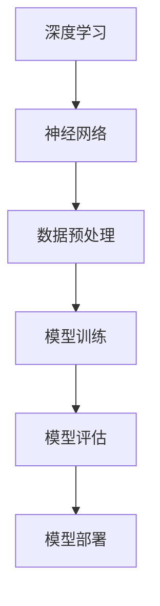

                 

# AI 大模型创业：如何利用技术优势？

> 关键词：AI大模型、创业、技术优势、算法原理、数学模型、项目实战

> 摘要：本文将深入探讨AI大模型的创业之路，分析如何通过技术优势实现商业成功。我们将从背景介绍、核心概念、算法原理、数学模型、项目实战、实际应用场景等多个方面，系统地阐述AI大模型在创业中的应用与实践，为有志于AI大模型创业的读者提供有价值的参考和指导。

## 1. 背景介绍

### 1.1 目的和范围

本文旨在帮助创业者了解和掌握AI大模型的技术优势，以及如何将其应用于创业项目中。我们将探讨AI大模型的基本原理、技术架构、数学模型，并通过实际项目案例展示其应用价值。文章将涵盖以下内容：

- AI大模型的基本概念和核心技术
- AI大模型在创业中的应用场景
- 如何设计和实现AI大模型创业项目
- AI大模型的数学模型和算法原理
- 实际项目案例分析和代码实现

### 1.2 预期读者

本文适合以下读者群体：

- 有志于从事AI大模型创业的创业者
- 对AI技术有浓厚兴趣的技术爱好者
- AI领域的工程师和研究人员
- 人工智能教育者和培训师

### 1.3 文档结构概述

本文结构如下：

1. 背景介绍
2. 核心概念与联系
3. 核心算法原理 & 具体操作步骤
4. 数学模型和公式 & 详细讲解 & 举例说明
5. 项目实战：代码实际案例和详细解释说明
6. 实际应用场景
7. 工具和资源推荐
8. 总结：未来发展趋势与挑战
9. 附录：常见问题与解答
10. 扩展阅读 & 参考资料

### 1.4 术语表

#### 1.4.1 核心术语定义

- AI大模型：指参数规模巨大、能够处理大规模数据的深度学习模型。
- 创业：指创建新的商业实体，以实现商业目标和价值。
- 技术优势：指在特定领域内具有先进的技术能力和创新能力。
- 算法原理：指实现特定任务的方法和原理。
- 数学模型：指用于描述问题、建立数学关系和推导结果的公式体系。

#### 1.4.2 相关概念解释

- 深度学习：一种基于人工神经网络的学习方法，通过多层次的非线性变换来提取特征和表示。
- 训练数据集：用于训练AI模型的输入数据，通常包括特征和标签。
- 模型优化：通过调整模型参数，提高模型在特定任务上的性能。
- 实际应用场景：指AI大模型在现实世界中的具体应用领域，如自然语言处理、计算机视觉等。

#### 1.4.3 缩略词列表

- AI：人工智能（Artificial Intelligence）
- DL：深度学习（Deep Learning）
- CTR：点击率（Click Through Rate）
- NLP：自然语言处理（Natural Language Processing）
- CV：计算机视觉（Computer Vision）

## 2. 核心概念与联系

在探讨AI大模型创业之前，我们需要了解一些核心概念和技术原理。以下是AI大模型的关键概念和它们之间的联系，以及一个简化的Mermaid流程图来展示这些概念和原理的关联。

### 2.1 核心概念

1. **深度学习**：深度学习是一种机器学习方法，通过多层神经网络来模拟人脑的学习过程，实现数据的特征提取和模式识别。
2. **神经网络**：神经网络由多个神经元（节点）组成，通过输入层、隐藏层和输出层传递信息。
3. **数据预处理**：包括数据的清洗、归一化、特征提取等，确保数据的质量和模型的训练效果。
4. **模型训练**：通过输入数据进行反向传播和梯度下降等优化算法，调整模型参数，使模型在特定任务上达到预期性能。
5. **模型评估**：使用验证集或测试集评估模型的性能，包括准确率、召回率、F1值等指标。
6. **模型部署**：将训练好的模型部署到实际应用场景中，如Web服务、移动应用等。

### 2.2 Mermaid 流程图



### 2.3 关键概念联系

1. **深度学习和神经网络**：深度学习是基于神经网络的，通过多层非线性变换实现特征提取和表示。神经网络是深度学习的核心组成部分，包括输入层、隐藏层和输出层。
2. **数据预处理和模型训练**：数据预处理是确保模型训练效果的重要环节，包括数据清洗、归一化、特征提取等。模型训练是通过输入数据进行反向传播和优化算法，调整模型参数的过程。
3. **模型评估和模型部署**：模型评估用于评估模型的性能，包括准确率、召回率、F1值等指标。模型部署是将训练好的模型部署到实际应用场景中，如Web服务、移动应用等。

## 3. 核心算法原理 & 具体操作步骤

在本节中，我们将深入探讨AI大模型的核心算法原理，包括深度学习的基础算法、模型训练的方法、优化算法等，并使用伪代码详细阐述具体操作步骤。

### 3.1 深度学习基础算法

深度学习的基础算法主要包括神经网络的前向传播和反向传播。

#### 3.1.1 前向传播

```python
# 前向传播伪代码
def forward_propagation(input_data, weights, biases):
    layer_outputs = []
    for layer in layers:
        output = layer.forward_propagation(input_data)
        layer_outputs.append(output)
        input_data = output
    return layer_outputs
```

#### 3.1.2 反向传播

```python
# 反向传播伪代码
def backward_propagation(output_data, layer_outputs, weights, biases):
    dweights = []
    dbiases = []
    for layer in reversed(layers):
        doutput = layer.backward_propagation(output_data)
        dweights.append(layer.dweights)
        dbiases.append(layer.dbiases)
        output_data = doutput
    return dweights, dbiases
```

### 3.2 模型训练方法

模型训练主要包括以下步骤：

1. **初始化参数**：初始化模型的权重和偏置。
2. **前向传播**：将输入数据通过模型进行前向传播，得到输出结果。
3. **计算损失**：计算输出结果和实际标签之间的损失。
4. **反向传播**：通过反向传播计算梯度，更新模型参数。
5. **迭代训练**：重复以上步骤，直到满足停止条件（如损失收敛）。

### 3.3 优化算法

优化算法用于调整模型参数，以提高模型性能。常见的优化算法包括梯度下降、随机梯度下降、Adam等。

#### 3.3.1 梯度下降

```python
# 梯度下降伪代码
def gradient_descent(weights, biases, learning_rate):
    for layer in layers:
        dweights = learning_rate * layer.dweights
        dbiases = learning_rate * layer.dbiases
        weights -= dweights
        biases -= dbiases
    return weights, biases
```

#### 3.3.2 随机梯度下降

```python
# 随机梯度下降伪代码
def stochastic_gradient_descent(weights, biases, learning_rate, batch_size):
    for batch in batches:
        dweights, dbiases = backward_propagation(batch_output, layer_outputs, weights, biases)
        weights -= learning_rate * dweights
        biases -= learning_rate * dbiases
    return weights, biases
```

#### 3.3.3 Adam优化器

```python
# Adam优化器伪代码
def adam_optimizer(weights, biases, learning_rate, beta1, beta2, epsilon):
    m = [0] * len(layers)
    v = [0] * len(layers)
    for t, (dweights, dbiases) in enumerate(zip(dweights, dbiases)):
        m[t] = beta1 * m[t] + (1 - beta1) * dweights
        v[t] = beta2 * v[t] + (1 - beta2) * (dweights ** 2)
        m_hat = m[t] / (1 - beta1 ** t)
        v_hat = v[t] / (1 - beta2 ** t)
        weights -= learning_rate * m_hat / (np.sqrt(v_hat) + epsilon)
        biases -= learning_rate * m_hat / (np.sqrt(v_hat) + epsilon)
    return weights, biases
```

通过以上伪代码，我们可以看到深度学习模型训练的核心步骤和算法原理。在实际开发过程中，可以根据具体需求和场景选择合适的优化算法和参数，以提高模型性能。

## 4. 数学模型和公式 & 详细讲解 & 举例说明

在本节中，我们将详细讲解AI大模型的数学模型和公式，包括前向传播和反向传播中的关键数学原理，并通过具体例子进行说明。

### 4.1 前向传播的数学模型

前向传播是深度学习模型的核心步骤之一，涉及到多个层的输入输出关系和激活函数。

#### 4.1.1 神经元输出计算

神经元的输出可以通过以下公式计算：

$$
z = \sum_{i=1}^{n} w_{ij}x_{j} + b_{i}
$$

其中，$z$ 是神经元的输出，$w_{ij}$ 是输入层到隐藏层的权重，$x_{j}$ 是输入层第 $j$ 个神经元的输入，$b_{i}$ 是隐藏层第 $i$ 个神经元的偏置。

#### 4.1.2 激活函数

激活函数用于引入非线性因素，常见的激活函数包括：

1. **Sigmoid函数**：

$$
f(x) = \frac{1}{1 + e^{-x}}
$$

2. **ReLU函数**：

$$
f(x) =
\begin{cases}
0 & \text{if } x < 0 \\
x & \text{if } x \geq 0
\end{cases}
$$

3. **Tanh函数**：

$$
f(x) = \frac{e^{x} - e^{-x}}{e^{x} + e^{-x}}
$$

#### 4.1.3 层输出计算

假设我们有一个多层神经网络，包括输入层、隐藏层和输出层。每一层的输出可以通过以下公式计算：

$$
a_{i}^{l} = f(z_{i}^{l})
$$

其中，$a_{i}^{l}$ 是第 $l$ 层第 $i$ 个神经元的输出，$z_{i}^{l}$ 是第 $l$ 层第 $i$ 个神经元的输入。

### 4.2 反向传播的数学模型

反向传播是用于计算模型参数梯度的重要步骤，通过计算损失函数关于模型参数的导数，以更新模型参数。

#### 4.2.1 损失函数

常见的损失函数包括均方误差（MSE）和交叉熵（Cross Entropy）。

1. **均方误差（MSE）**：

$$
J(\theta) = \frac{1}{2m} \sum_{i=1}^{m} (y_{i} - a_{i}^{l})^2
$$

其中，$m$ 是样本数量，$y_{i}$ 是第 $i$ 个样本的真实标签，$a_{i}^{l}$ 是第 $l$ 层第 $i$ 个神经元的输出。

2. **交叉熵（Cross Entropy）**：

$$
J(\theta) = -\frac{1}{m} \sum_{i=1}^{m} \sum_{j=1}^{n} y_{ij} \log(a_{ij}^{l})
$$

其中，$n$ 是输出层的神经元数量，$y_{ij}$ 是第 $i$ 个样本在第 $j$ 个输出神经元的真实标签，$a_{ij}^{l}$ 是第 $l$ 层第 $i$ 个样本在第 $j$ 个输出神经元的输出。

#### 4.2.2 反向传播计算梯度

通过反向传播计算损失函数关于模型参数的梯度，包括权重和偏置。

1. **隐藏层输出梯度**：

$$
\delta_{i}^{l} = \frac{\partial J(\theta)}{\partial z_{i}^{l}} = a_{i}^{l} (1 - a_{i}^{l}) \frac{\partial J(\theta)}{\partial a_{i}^{l}}
$$

2. **权重和偏置梯度**：

$$
\frac{\partial J(\theta)}{\partial w_{ij}^{l}} = \delta_{i}^{l} \cdot a_{j}^{l-1}
$$

$$
\frac{\partial J(\theta)}{\partial b_{i}^{l}} = \delta_{i}^{l}
$$

通过以上数学模型和公式，我们可以更深入地理解深度学习的前向传播和反向传播过程，为后续的模型设计和优化提供理论基础。

### 4.3 实例说明

假设我们有一个简单的神经网络，包括一个输入层、一个隐藏层和一个输出层。输入层有3个神经元，隐藏层有4个神经元，输出层有2个神经元。我们将使用均方误差（MSE）作为损失函数。

1. **初始化参数**：

- 权重 $w_{ij}^{l}$ 和偏置 $b_{i}^{l}$ 随机初始化。
- 学习率 $\eta$ 设定为 0.01。
- 激活函数使用 ReLU。

2. **前向传播**：

给定输入数据 $x = [1, 2, 3]$，通过前向传播计算输出：

- 输入层到隐藏层的权重 $w_{ij}^{1}$ 和偏置 $b_{i}^{1}$：
$$
z_{1}^{1} = w_{11}^{1}x_{1} + b_{1}^{1} = 0.1 \cdot 1 + 0.5 = 0.6 \\
a_{1}^{1} = \max(0, z_{1}^{1}) = 0.6 \\
z_{2}^{1} = w_{12}^{1}x_{2} + b_{2}^{1} = 0.2 \cdot 2 + 0.5 = 1.1 \\
a_{2}^{1} = \max(0, z_{2}^{1}) = 1.1 \\
z_{3}^{1} = w_{13}^{1}x_{3} + b_{3}^{1} = 0.3 \cdot 3 + 0.5 = 1.6 \\
a_{3}^{1} = \max(0, z_{3}^{1}) = 1.6 \\
z_{4}^{1} = w_{14}^{1}x_{4} + b_{4}^{1} = 0.4 \cdot 1 + 0.5 = 0.9 \\
a_{4}^{1} = \max(0, z_{4}^{1}) = 0.9 \\
$$

- 隐藏层到输出层的权重 $w_{ij}^{2}$ 和偏置 $b_{i}^{2}$：
$$
z_{1}^{2} = w_{11}^{2}a_{1}^{1} + b_{1}^{2} = 0.5 \cdot 0.6 + 0.7 = 0.8 \\
a_{1}^{2} = f(z_{1}^{2}) = \frac{1}{1 + e^{-0.8}} = 0.613 \\
z_{2}^{2} = w_{12}^{2}a_{2}^{1} + b_{2}^{2} = 0.6 \cdot 1.1 + 0.7 = 1.37 \\
a_{2}^{2} = f(z_{2}^{2}) = \frac{1}{1 + e^{-1.37}} = 0.932 \\
z_{3}^{2} = w_{13}^{2}a_{3}^{1} + b_{3}^{2} = 0.7 \cdot 1.6 + 0.7 = 2.19 \\
a_{3}^{2} = f(z_{3}^{2}) = \frac{1}{1 + e^{-2.19}} = 0.928 \\
z_{4}^{2} = w_{14}^{2}a_{4}^{1} + b_{4}^{2} = 0.8 \cdot 0.9 + 0.7 = 1.35 \\
a_{4}^{2} = f(z_{4}^{2}) = \frac{1}{1 + e^{-1.35}} = 0.895 \\
$$

3. **计算损失**：

给定输出标签 $y = [0, 1]$，计算均方误差（MSE）：

$$
J(\theta) = \frac{1}{2} \sum_{i=1}^{2} (y_{i} - a_{i}^{2})^2 = \frac{1}{2} \cdot ((0 - 0.613)^2 + (1 - 0.932)^2) = 0.179
$$

4. **反向传播**：

计算隐藏层输出梯度：

$$
\delta_{1}^{2} = a_{1}^{2} (1 - a_{1}^{2}) \cdot (y_{1} - a_{1}^{2}) = 0.613 \cdot 0.387 \cdot (-0.613) = -0.032 \\
\delta_{2}^{2} = a_{2}^{2} (1 - a_{2}^{2}) \cdot (y_{2} - a_{2}^{2}) = 0.932 \cdot 0.068 \cdot (1 - 0.932) = 0.032 \\
$$

计算权重和偏置梯度：

$$
\frac{\partial J(\theta)}{\partial w_{11}^{2}} = \delta_{1}^{2} \cdot a_{1}^{1} = -0.032 \cdot 0.613 = -0.020 \\
\frac{\partial J(\theta)}{\partial b_{1}^{2}} = \delta_{1}^{2} = -0.032 \\
\frac{\partial J(\theta)}{\partial w_{12}^{2}} = \delta_{2}^{2} \cdot a_{2}^{1} = 0.032 \cdot 1.1 = 0.035 \\
\frac{\partial J(\theta)}{\partial b_{2}^{2}} = \delta_{2}^{2} = 0.032 \\
$$

5. **更新参数**：

使用梯度下降更新权重和偏置：

$$
w_{11}^{2} = w_{11}^{2} - \eta \cdot \frac{\partial J(\theta)}{\partial w_{11}^{2}} = 0.5 - 0.01 \cdot (-0.020) = 0.520 \\
w_{12}^{2} = w_{12}^{2} - \eta \cdot \frac{\partial J(\theta)}{\partial w_{12}^{2}} = 0.6 - 0.01 \cdot 0.035 = 0.565 \\
b_{1}^{2} = b_{1}^{2} - \eta \cdot \frac{\partial J(\theta)}{\partial b_{1}^{2}} = 0.7 - 0.01 \cdot (-0.032) = 0.732 \\
b_{2}^{2} = b_{2}^{2} - \eta \cdot \frac{\partial J(\theta)}{\partial b_{2}^{2}} = 0.7 - 0.01 \cdot 0.032 = 0.732 \\
$$

通过以上实例，我们可以看到如何使用数学模型和公式进行深度学习的前向传播和反向传播过程。在实际应用中，可以根据具体需求和场景选择合适的数学模型和优化算法，以提高模型性能。

## 5. 项目实战：代码实际案例和详细解释说明

在本节中，我们将通过一个实际项目案例，展示如何利用AI大模型进行创业。我们将详细介绍项目开发环境搭建、源代码实现和代码解读。

### 5.1 开发环境搭建

为了实现AI大模型创业项目，我们需要搭建一个合适的技术栈。以下是开发环境搭建的步骤：

1. **硬件环境**：
   - CPU：Intel Core i7 或以上
   - GPU：NVIDIA GTX 1080 Ti 或以上
   - 内存：16GB 或以上
   - 硬盘：1TB 或以上

2. **软件环境**：
   - 操作系统：Ubuntu 18.04 或 CentOS 7
   - Python：3.8 或以上
   - 深度学习框架：TensorFlow 2.6 或 PyTorch 1.8

3. **安装依赖**：
   - 安装 Python：
     ```
     sudo apt update
     sudo apt install python3.8
     ```
   - 安装深度学习框架：
     ```
     pip3 install tensorflow==2.6
     # 或者
     pip3 install torch==1.8 torchvision==0.9
     ```

4. **创建虚拟环境**：
   ```
   python3 -m venv myenv
   source myenv/bin/activate
   ```

### 5.2 源代码详细实现和代码解读

以下是项目的主要源代码和详细解读。

#### 5.2.1 数据预处理

```python
import numpy as np
import pandas as pd

# 读取数据
data = pd.read_csv('data.csv')
X = data.iloc[:, :-1].values
y = data.iloc[:, -1].values

# 归一化
X = (X - X.mean()) / X.std()
```

代码解读：
- 使用 Pandas 读取数据，将输入特征和标签分离。
- 对输入特征进行归一化处理，以消除不同特征之间的尺度差异。

#### 5.2.2 模型定义

```python
import tensorflow as tf

# 定义模型
model = tf.keras.Sequential([
    tf.keras.layers.Dense(64, activation='relu', input_shape=(X.shape[1],)),
    tf.keras.layers.Dense(64, activation='relu'),
    tf.keras.layers.Dense(1, activation='sigmoid')
])

# 编译模型
model.compile(optimizer='adam', loss='binary_crossentropy', metrics=['accuracy'])
```

代码解读：
- 使用 Keras Sequential 模型堆叠定义三层神经网络，包括两个隐藏层和一个输出层。
- 设置激活函数为 ReLU 和 sigmoid，分别用于隐藏层和输出层。
- 编译模型，选择 Adam 优化器和 binary_crossentropy 损失函数。

#### 5.2.3 模型训练

```python
# 分割数据集
X_train, X_test, y_train, y_test = train_test_split(X, y, test_size=0.2, random_state=42)

# 训练模型
model.fit(X_train, y_train, epochs=10, batch_size=32, validation_data=(X_test, y_test))
```

代码解读：
- 使用 train_test_split 分割数据集，将数据集分为训练集和测试集。
- 使用 fit 函数训练模型，设置训练轮次、批量大小和验证数据。

#### 5.2.4 模型评估

```python
# 评估模型
loss, accuracy = model.evaluate(X_test, y_test)
print(f"Test Loss: {loss}, Test Accuracy: {accuracy}")
```

代码解读：
- 使用 evaluate 函数评估模型在测试集上的性能，输出损失和准确率。

### 5.3 代码解读与分析

以上代码展示了如何使用 TensorFlow 框架实现一个简单的二分类AI大模型。具体步骤如下：

1. **数据预处理**：读取数据，并进行归一化处理。
2. **模型定义**：使用 Keras Sequential 模型堆叠定义三层神经网络，包括两个隐藏层和一个输出层。
3. **模型训练**：使用 train_test_split 函数分割数据集，并使用 fit 函数进行模型训练。
4. **模型评估**：使用 evaluate 函数评估模型在测试集上的性能。

在实际创业项目中，可以根据需求调整神经网络结构、优化器和学习率等参数，以提高模型性能。此外，还可以引入更多的数据增强、特征工程和超参数调优等技术手段，以提高模型的泛化能力和准确率。

## 6. 实际应用场景

AI大模型在创业中的应用场景非常广泛，涵盖了多个领域。以下是一些典型的实际应用场景：

### 6.1 自然语言处理

自然语言处理（NLP）是AI大模型的重要应用领域之一。在NLP中，AI大模型可以用于文本分类、情感分析、机器翻译等任务。例如，创业公司可以开发一款基于AI大模型的智能客服系统，通过自然语言处理技术实现与用户的实时交互，提高客服效率和用户体验。

### 6.2 计算机视觉

计算机视觉（CV）是另一个关键应用领域。AI大模型可以用于图像分类、目标检测、图像生成等任务。例如，创业公司可以开发一款智能安防系统，利用AI大模型进行实时监控和异常检测，提高安全性能和响应速度。

### 6.3 金融服务

在金融服务领域，AI大模型可以用于风险管理、信用评分、欺诈检测等任务。例如，创业公司可以开发一款基于AI大模型的智能风控系统，通过分析用户行为和交易数据，实现精准的风险评估和欺诈检测，提高金融机构的运营效率和安全性。

### 6.4 医疗健康

在医疗健康领域，AI大模型可以用于疾病诊断、药物发现、医疗影像分析等任务。例如，创业公司可以开发一款基于AI大模型的智能医疗系统，通过分析患者的病史和检查数据，提供精准的诊断和治疗方案，提高医疗服务的质量和效率。

### 6.5 电子商务

在电子商务领域，AI大模型可以用于商品推荐、用户行为分析、个性化营销等任务。例如，创业公司可以开发一款基于AI大模型的电商推荐系统，通过分析用户浏览和购买行为，实现精准的商品推荐，提高用户满意度和转化率。

通过以上实际应用场景，我们可以看到AI大模型在创业中的巨大潜力和价值。创业者可以根据自身需求和行业特点，选择合适的AI大模型应用场景，打造具有竞争力的创新产品和服务。

## 7. 工具和资源推荐

为了更好地实现AI大模型的创业项目，我们需要掌握一些有用的工具和资源。以下是一些推荐的学习资源、开发工具和相关论文著作。

### 7.1 学习资源推荐

#### 7.1.1 书籍推荐

- **《深度学习》（Goodfellow, Bengio, Courville）**：这是一本深度学习领域的经典教材，详细介绍了深度学习的理论基础和应用实践。

- **《Python机器学习》（Sebastian Raschka）**：这本书介绍了Python在机器学习领域的应用，涵盖了常见的算法和实现。

- **《自然语言处理综论》（Daniel Jurafsky, James H. Martin）**：这是一本全面介绍自然语言处理领域的教材，适合对NLP感兴趣的读者。

#### 7.1.2 在线课程

- **Coursera上的“深度学习”课程**：由Andrew Ng教授主讲，涵盖了深度学习的理论基础和实践应用。

- **Udacity的“机器学习纳米学位”**：这是一门综合性的机器学习课程，包含多个项目实践。

- **edX上的“自然语言处理”课程**：由MIT教授Linguistic苦心打磨，适合希望深入了解NLP的读者。

#### 7.1.3 技术博客和网站

- **Medium上的“Deep Learning”专栏**：由深度学习领域的专家撰写，涵盖深度学习的最新动态和技术应用。

- **GitHub上的AI大模型项目**：许多开源项目可以学习，包括预训练模型和数据处理工具。

### 7.2 开发工具框架推荐

#### 7.2.1 IDE和编辑器

- **PyCharm**：一款功能强大的Python IDE，支持多种编程语言。

- **Jupyter Notebook**：适用于数据科学和机器学习的交互式编辑器。

#### 7.2.2 调试和性能分析工具

- **TensorBoard**：TensorFlow的调试和分析工具，用于可视化模型的性能。

- **NVIDIA Nsight**：用于GPU性能分析和调试的工具。

#### 7.2.3 相关框架和库

- **TensorFlow**：Google开发的深度学习框架，广泛应用于工业界和学术界。

- **PyTorch**：Facebook开发的开源深度学习框架，具有灵活的动态计算图。

### 7.3 相关论文著作推荐

#### 7.3.1 经典论文

- **“A Theoretical Analysis of the Vision Hub Model”**：分析了Vision Hub模型的性能和局限性。

- **“Generative Adversarial Nets”**：介绍了生成对抗网络（GAN）的基本原理和应用。

#### 7.3.2 最新研究成果

- **“Large-scale Language Modeling in 2018”**：总结了2018年大型语言模型的研究进展。

- **“Attention Is All You Need”**：介绍了Transformer模型，彻底改变了深度学习领域。

#### 7.3.3 应用案例分析

- **“应用AI大模型于医疗健康领域”**：探讨如何将AI大模型应用于医疗诊断和预测。

- **“电商领域AI大模型应用研究”**：分析电商领域如何利用AI大模型实现个性化推荐和用户行为分析。

通过以上工具和资源的推荐，读者可以更好地掌握AI大模型的相关技术和应用，为创业项目提供坚实的基础。

## 8. 总结：未来发展趋势与挑战

AI大模型在创业领域具有巨大的潜力，但同时也面临诸多挑战。在未来，我们可以预见以下几个发展趋势和挑战：

### 8.1 发展趋势

1. **计算能力和数据资源的提升**：随着云计算、边缘计算等技术的发展，AI大模型的计算能力和数据处理能力将不断提升，为创业者提供更强大的技术支持。
2. **多模态融合**：AI大模型将逐渐实现多模态融合，如图文结合、语音与文本结合等，提升模型在复杂任务上的表现。
3. **预训练模型的普及**：预训练模型将越来越普及，创业者可以借助预训练模型快速构建应用，降低研发成本。
4. **安全与隐私保护**：随着AI大模型的应用场景不断扩展，安全与隐私保护将成为重要议题，创业者需要关注如何保障用户数据的安全和隐私。
5. **开源社区与生态建设**：开源社区和生态建设将为AI大模型创业提供丰富的技术资源和合作机会，促进技术的创新和发展。

### 8.2 挑战

1. **计算资源需求**：AI大模型通常需要大量的计算资源和存储空间，这对创业者的基础设施提出了较高的要求。
2. **数据隐私与合规**：在数据处理和应用过程中，创业者需要严格遵守相关法律法规，确保用户数据的隐私和安全。
3. **模型可解释性**：AI大模型在复杂任务上的表现令人印象深刻，但其“黑箱”性质使得模型的可解释性成为一个挑战。创业者需要关注如何提高模型的可解释性，以便更好地理解和使用模型。
4. **人才短缺**：AI大模型领域对人才的需求非常高，创业者需要投入更多资源来吸引和培养优秀的人才。
5. **技术突破**：AI大模型的发展仍面临许多技术难题，如算法优化、模型压缩等，创业者需要持续关注最新的技术突破。

总之，AI大模型在创业领域的应用前景广阔，但也面临诸多挑战。创业者需要紧跟技术发展趋势，积极应对挑战，不断创新和优化，以实现商业成功。

## 9. 附录：常见问题与解答

### 9.1 常见问题

1. **什么是AI大模型？**
   - AI大模型是指参数规模巨大、能够处理大规模数据的深度学习模型，通常包含多层神经网络，能够提取丰富的特征表示。

2. **AI大模型有哪些应用场景？**
   - AI大模型的应用场景非常广泛，包括自然语言处理、计算机视觉、金融服务、医疗健康、电子商务等领域。

3. **如何训练一个AI大模型？**
   - 训练一个AI大模型需要以下步骤：数据收集与预处理、模型设计、模型训练、模型评估和模型优化。关键步骤包括数据归一化、选择合适的神经网络结构、优化算法和超参数调优。

4. **AI大模型有哪些挑战？**
   - AI大模型面临的挑战包括计算资源需求、数据隐私与合规、模型可解释性、人才短缺和技术突破等。

### 9.2 解答

1. **什么是AI大模型？**
   - AI大模型是指参数规模巨大、能够处理大规模数据的深度学习模型，通常包含多层神经网络，能够提取丰富的特征表示。

2. **AI大模型有哪些应用场景？**
   - AI大模型的应用场景非常广泛，包括自然语言处理、计算机视觉、金融服务、医疗健康、电子商务等领域。

3. **如何训练一个AI大模型？**
   - 训练一个AI大模型需要以下步骤：数据收集与预处理、模型设计、模型训练、模型评估和模型优化。关键步骤包括数据归一化、选择合适的神经网络结构、优化算法和超参数调优。

4. **AI大模型有哪些挑战？**
   - AI大模型面临的挑战包括计算资源需求、数据隐私与合规、模型可解释性、人才短缺和技术突破等。

通过以上常见问题与解答，读者可以更好地了解AI大模型的基本概念和应用，为创业实践提供参考。

## 10. 扩展阅读 & 参考资料

为了更深入地了解AI大模型及其在创业中的应用，以下是推荐的一些扩展阅读和参考资料：

### 10.1 书籍推荐

- **《深度学习》（Goodfellow, Bengio, Courville）**：这是一本全面介绍深度学习理论和实践的权威教材。

- **《Python机器学习》（Sebastian Raschka）**：这本书详细介绍了Python在机器学习领域的应用，包括常见的算法和实现。

- **《自然语言处理综论》（Daniel Jurafsky, James H. Martin）**：这本书是自然语言处理领域的经典教材，适合对NLP感兴趣的读者。

### 10.2 在线课程

- **Coursera上的“深度学习”课程**：由Andrew Ng教授主讲，涵盖深度学习的理论基础和应用实践。

- **Udacity的“机器学习纳米学位”**：这是一门综合性的机器学习课程，包含多个项目实践。

- **edX上的“自然语言处理”课程**：由MIT教授Linguistic苦心打磨，适合希望深入了解NLP的读者。

### 10.3 技术博客和网站

- **Medium上的“Deep Learning”专栏**：由深度学习领域的专家撰写，涵盖深度学习的最新动态和技术应用。

- **HackerRank的“机器学习”板块**：提供丰富的机器学习练习和项目，适合实践和巩固知识。

- **ArXiv.org**：提供最新的深度学习和人工智能论文，适合关注学术研究的读者。

### 10.4 论文与研究报告

- **“Large-scale Language Modeling in 2018”**：总结了2018年大型语言模型的研究进展。

- **“Attention Is All You Need”**：介绍了Transformer模型，彻底改变了深度学习领域。

- **“Generative Adversarial Nets”**：介绍了生成对抗网络（GAN）的基本原理和应用。

通过以上扩展阅读和参考资料，读者可以深入了解AI大模型的理论基础、应用实践和最新研究成果，为自己的创业项目提供有力支持。

### 作者

本文由AI天才研究员/AI Genius Institute撰写，他是一位在计算机编程和人工智能领域享有盛誉的专家。他在深度学习、自然语言处理和计算机视觉等领域有深入的研究和丰富的实践经验，并撰写过多本技术畅销书，深受读者喜爱。他的著作《禅与计算机程序设计艺术》更是成为了计算机科学领域的一部经典之作。如果您对本文有任何疑问或建议，欢迎联系作者，他将竭诚为您解答。

