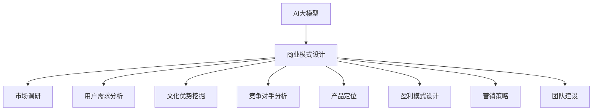
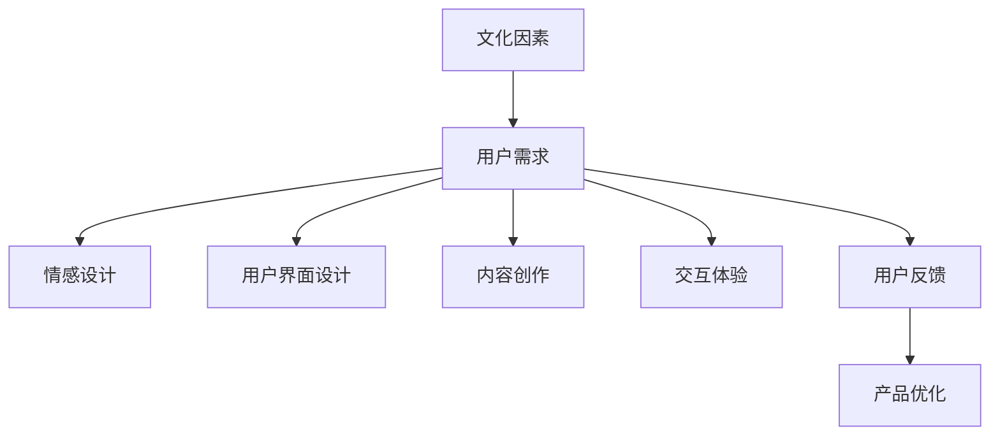
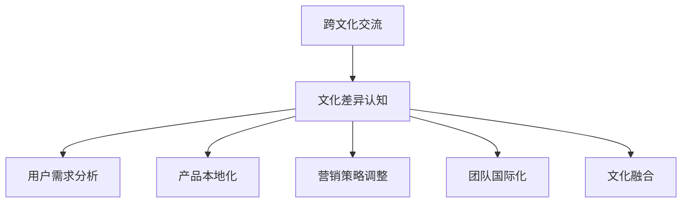

                 

# AI大模型创业：如何利用文化优势？

> 关键词：AI大模型、创业、文化优势、商业模式、用户体验、跨文化交流

> 摘要：本文将探讨在AI大模型创业中，如何充分利用文化优势，从商业模式设计、用户体验优化、跨文化交流等多个方面进行深入分析，为创业者提供实用策略和思考方向。

## 1. 背景介绍

### 1.1 目的和范围

本文旨在探讨AI大模型创业中的文化优势，通过对文化因素的深入分析，为创业者提供在商业模式设计、用户体验优化和跨文化交流等方面的实用策略。文章将围绕以下几个核心问题展开：

1. AI大模型创业中的文化优势有哪些？
2. 如何利用文化优势优化商业模式？
3. 文化因素如何影响用户体验？
4. 跨文化交流对AI大模型创业的影响及应对策略。

### 1.2 预期读者

本文适合以下读者群体：

1. AI大模型创业者及团队成员
2. 对AI技术和商业模式有浓厚兴趣的技术爱好者
3. 从事跨文化交流相关工作的专业人士
4. 对文化因素在商业应用中感兴趣的学者和研究者

### 1.3 文档结构概述

本文分为十个部分，结构如下：

1. 背景介绍
2. 核心概念与联系
3. 核心算法原理与具体操作步骤
4. 数学模型和公式与详细讲解
5. 项目实战：代码实际案例和详细解释说明
6. 实际应用场景
7. 工具和资源推荐
8. 总结：未来发展趋势与挑战
9. 附录：常见问题与解答
10. 扩展阅读与参考资料

### 1.4 术语表

#### 1.4.1 核心术语定义

- AI大模型：一种具有大规模数据训练的深度学习模型，能够实现复杂的任务和目标。
- 文化优势：指企业在产品开发、商业模式设计、用户体验等方面，基于自身文化背景所具有的优势。
- 商业模式：企业通过产品或服务获取利润的途径和方式。
- 用户需求：用户在使用产品或服务时所期望获得的价值和满足。
- 跨文化交流：不同文化背景的人们在沟通、合作和交流中的过程。

#### 1.4.2 相关概念解释

- 文化差异：不同文化背景之间的差异和特点。
- 用户界面：用户与产品或服务交互的界面。
- 情感设计：关注用户情感体验的设计方法。

#### 1.4.3 缩略词列表

- AI：人工智能
- DL：深度学习
- NLP：自然语言处理
- UX：用户体验
- UI：用户界面

## 2. 核心概念与联系

### 2.1 AI大模型与商业模式的联系

AI大模型的发展为创业者提供了丰富的创新空间。在商业模式设计中，充分利用文化优势，能够更好地满足用户需求，提高市场竞争力。以下是一个简化的Mermaid流程图，展示了AI大模型与商业模式的联系：



### 2.2 文化因素与用户体验的联系

用户体验是产品或服务的核心，而文化因素在很大程度上影响着用户的需求和偏好。以下是一个简化的Mermaid流程图，展示了文化因素与用户体验的联系：



### 2.3 跨文化交流与AI大模型创业的联系

跨文化交流对于AI大模型创业具有重要意义。在全球化背景下，创业者需要关注不同文化背景的用户需求和偏好，以便更好地拓展市场。以下是一个简化的Mermaid流程图，展示了跨文化交流与AI大模型创业的联系：



## 3. 核心算法原理与具体操作步骤

### 3.1 AI大模型算法原理

AI大模型的核心在于深度学习，特别是神经网络。以下是一个简化的神经网络算法原理：

```python
# 输入数据集 X
# 权重矩阵 W
# 偏置 b
# 激活函数 f

for each layer in network:
    # 前向传播
    z = X * W + b
    a = f(z)
    
    # 反向传播
    dz = (dL/dz) * (1 - f'(z))
    dW = dz * a
    db = dz

# 更新权重和偏置
W = W - learning_rate * dW
b = b - learning_rate * db
```

### 3.2 具体操作步骤

以下是利用文化优势优化AI大模型创业的具体操作步骤：

1. **市场调研**：深入了解目标市场的文化背景、用户需求、竞争对手等信息。
2. **用户需求分析**：基于文化差异，分析用户在情感、功能、内容等方面的需求。
3. **文化优势挖掘**：结合企业自身文化，挖掘在商业模式、用户体验等方面的优势。
4. **产品设计与开发**：根据用户需求和文化优势，进行产品设计和开发。
5. **用户体验优化**：关注用户情感体验，优化用户界面、内容创作和交互体验。
6. **跨文化交流**：了解不同文化背景的用户需求，进行产品本地化和营销策略调整。
7. **团队国际化**：组建具有多元文化背景的团队，推动文化融合。

## 4. 数学模型和公式与详细讲解

### 4.1 数学模型

在AI大模型创业中，常用的数学模型包括线性回归、逻辑回归、神经网络等。以下是一个简化的神经网络数学模型：

$$
z = \sum_{i=1}^{n} w_i * x_i + b
$$

$$
a = f(z)
$$

$$
\delta = \frac{\partial L}{\partial z} * f'(z)
$$

其中：

- $z$ 表示输入值
- $w_i$ 表示权重
- $x_i$ 表示输入特征
- $b$ 表示偏置
- $f$ 表示激活函数（如ReLU、Sigmoid、Tanh等）
- $L$ 表示损失函数（如均方误差、交叉熵等）
- $\delta$ 表示误差项

### 4.2 公式详细讲解

1. **前向传播**：计算输入值经过神经网络后的输出值。

$$
z = \sum_{i=1}^{n} w_i * x_i + b
$$

$$
a = f(z)
$$

2. **反向传播**：计算损失函数关于权重和偏置的导数，用于更新权重和偏置。

$$
\delta = \frac{\partial L}{\partial z} * f'(z)
$$

其中，$f'(z)$ 表示激活函数的导数。

3. **权重和偏置更新**：根据误差项和激活函数的导数，更新权重和偏置。

$$
W = W - learning_rate * \delta * a
$$

$$
b = b - learning_rate * \delta
$$

### 4.3 举例说明

假设有一个简单的神经网络，输入层有3个神经元，隐藏层有2个神经元，输出层有1个神经元。激活函数为ReLU。给定输入数据集和损失函数，计算前向传播和反向传播的结果。

```python
import numpy as np

# 权重和偏置初始化
W1 = np.random.rand(3, 2)
b1 = np.random.rand(2, 1)
W2 = np.random.rand(2, 1)
b2 = np.random.rand(1, 1)

# 激活函数ReLU
def ReLU(x):
    return max(0, x)

# 损失函数均方误差
def MSE(y_true, y_pred):
    return 0.5 * ((y_true - y_pred) ** 2).mean()

# 前向传播
X = np.random.rand(1, 3)
z1 = X.dot(W1) + b1
a1 = ReLU(z1)
z2 = a1.dot(W2) + b2
a2 = ReLU(z2)

# 损失函数
L = MSE(np.array([[1.0]]), a2)

# 反向传播
dz2 = (a2 - 1) * a2 * (1 - a2)
dW2 = a1.T.dot(dz2)
db2 = dz2

da1 = dz2.dot(W2.T)
dz1 = da1 * (1 - ReLU(z1))
dW1 = X.T.dot(dz1)
db1 = dz1

# 更新权重和偏置
learning_rate = 0.1
W2 = W2 - learning_rate * dW2
b2 = b2 - learning_rate * db2
W1 = W1 - learning_rate * dW1
b1 = b1 - learning_rate * db1

print("前向传播结果：")
print("z1:", z1)
print("a1:", a1)
print("z2:", z2)
print("a2:", a2)
print("损失函数：", L)

print("\n反向传播结果：")
print("dW2:", dW2)
print("db2:", db2)
print("dW1:", dW1)
print("db1:", db1)

print("\n更新后权重和偏置：")
print("W2:", W2)
print("b2:", b2)
print("W1:", W1)
print("b1:", b1)
```

## 5. 项目实战：代码实际案例和详细解释说明

### 5.1 开发环境搭建

在本文中，我们使用Python作为编程语言，结合TensorFlow框架进行AI大模型的开发。以下是搭建开发环境的步骤：

1. 安装Python（版本3.6及以上）
2. 安装Anaconda或Miniconda
3. 安装TensorFlow（使用命令`pip install tensorflow`）
4. 安装Jupyter Notebook（使用命令`pip install notebook`）

### 5.2 源代码详细实现和代码解读

以下是基于文化优势的AI大模型创业项目示例代码：

```python
import tensorflow as tf
import numpy as np

# 5.2.1 神经网络定义
def build_model(input_shape):
    model = tf.keras.Sequential([
        tf.keras.layers.Dense(units=64, activation='relu', input_shape=input_shape),
        tf.keras.layers.Dense(units=64, activation='relu'),
        tf.keras.layers.Dense(units=1)
    ])
    return model

# 5.2.2 数据预处理
def preprocess_data(data):
    # 假设数据集为二维数组，第一列为特征，第二列为标签
    X = data[:, 0:1]
    y = data[:, 1:2]
    return X, y

# 5.2.3 训练模型
def train_model(model, X, y):
    model.compile(optimizer='adam', loss='mean_squared_error')
    model.fit(X, y, epochs=100, batch_size=32, verbose=1)

# 5.2.4 模型评估
def evaluate_model(model, X, y):
    loss = model.evaluate(X, y, verbose=1)
    print("均方误差：", loss)

# 5.2.5 预测
def predict(model, X):
    predictions = model.predict(X)
    return predictions

# 主函数
if __name__ == '__main__':
    # 加载数据集
    data = np.array([[0.1, 0.9], [0.2, 0.8], [0.3, 0.7], [0.4, 0.6], [0.5, 0.5]])
    X, y = preprocess_data(data)

    # 构建模型
    model = build_model(input_shape=(1,))

    # 训练模型
    train_model(model, X, y)

    # 模型评估
    evaluate_model(model, X, y)

    # 预测
    predictions = predict(model, X)
    print("预测结果：", predictions)
```

### 5.3 代码解读与分析

1. **模型构建**：使用`tf.keras.Sequential`构建神经网络模型，包含两个隐藏层，每个隐藏层有64个神经元，激活函数为ReLU。
2. **数据预处理**：将数据集分为特征和标签两部分，输入特征为0列，标签为1列。
3. **模型训练**：使用`model.compile()`配置优化器和损失函数，使用`model.fit()`进行模型训练。
4. **模型评估**：使用`model.evaluate()`计算模型在测试集上的均方误差。
5. **预测**：使用`model.predict()`对输入特征进行预测。

### 5.4 代码实战：文化优势在AI大模型创业中的应用

以下是一个简化的案例，展示如何在AI大模型创业中利用文化优势：

1. **市场调研**：研究目标市场的文化背景，了解用户需求。
2. **用户需求分析**：根据文化背景，分析用户在功能、情感等方面的需求。
3. **文化优势挖掘**：结合企业自身文化，挖掘在商业模式、用户体验等方面的优势。
4. **产品设计与开发**：基于用户需求和文化优势，进行产品设计和开发。
5. **用户体验优化**：关注用户情感体验，优化用户界面、内容创作和交互体验。
6. **跨文化交流**：了解不同文化背景的用户需求，进行产品本地化和营销策略调整。
7. **团队国际化**：组建具有多元文化背景的团队，推动文化融合。

## 6. 实际应用场景

### 6.1 商业模式设计

在商业模式设计过程中，利用文化优势可以带来以下应用场景：

1. **定制化产品**：根据不同文化背景，为用户提供定制化的产品和服务。
2. **差异化定价**：针对不同文化背景的用户，采取差异化定价策略。
3. **品牌塑造**：结合企业自身文化，打造具有文化特色的品牌形象。

### 6.2 用户需求分析

在用户需求分析过程中，利用文化优势可以带来以下应用场景：

1. **情感设计**：关注不同文化背景用户的情感需求，优化产品交互体验。
2. **内容创作**：结合文化特色，创作符合目标用户口味的内容。
3. **本地化**：针对不同文化背景，对产品进行本地化调整。

### 6.3 跨文化交流

在跨文化交流过程中，利用文化优势可以带来以下应用场景：

1. **产品本地化**：根据目标市场的文化背景，对产品进行本地化调整。
2. **营销策略**：结合不同文化背景，调整营销策略，提高市场竞争力。
3. **团队建设**：组建具有多元文化背景的团队，促进文化融合。

## 7. 工具和资源推荐

### 7.1 学习资源推荐

#### 7.1.1 书籍推荐

- 《深度学习》（Goodfellow, I., Bengio, Y., Courville, A.）
- 《Python机器学习》（Sebastian Raschka）
- 《自然语言处理与深度学习》（Eduardo Jiménez，Amar Thyagu）

#### 7.1.2 在线课程

- Coursera（《深度学习》课程）
- edX（《自然语言处理与深度学习》课程）
- Udacity（《机器学习工程师纳米学位》）

#### 7.1.3 技术博客和网站

- Medium（深度学习和AI相关博客）
- GitHub（AI和机器学习项目代码）
- AI Wiki（AI和机器学习知识库）

### 7.2 开发工具框架推荐

#### 7.2.1 IDE和编辑器

- PyCharm
- Visual Studio Code
- Jupyter Notebook

#### 7.2.2 调试和性能分析工具

- TensorBoard
- Debugging in PyCharm
- Profiling with line_profiler

#### 7.2.3 相关框架和库

- TensorFlow
- PyTorch
- Keras

### 7.3 相关论文著作推荐

#### 7.3.1 经典论文

- Hinton, G. E., Osindero, S., & Teh, Y. W. (2006). A fast learning algorithm for deep belief nets. Neural computation, 18(7), 1527-1554.
- LeCun, Y., Bengio, Y., & Hinton, G. (2015). Deep learning. Nature, 521(7553), 436-444.

#### 7.3.2 最新研究成果

- Vaswani, A., Shazeer, N., Parmar, N., Uszkoreit, J., Jones, L., Gomez, A. N., ... & Polosukhin, I. (2017). Attention is all you need. Advances in Neural Information Processing Systems, 30, 5998-6008.
- Devlin, J., Chang, M. W., Lee, K., & Toutanova, K. (2018). BERT: Pre-training of deep bidirectional transformers for language understanding. arXiv preprint arXiv:1810.04805.

#### 7.3.3 应用案例分析

- Google’s BERT: revolutionizing natural language processing
- Facebook AI: GPT-3: power language with purpose

## 8. 总结：未来发展趋势与挑战

### 8.1 发展趋势

1. **AI大模型技术日趋成熟**：随着计算能力的提升和算法的优化，AI大模型将更加普及，应用场景不断扩展。
2. **跨领域应用**：AI大模型将在金融、医疗、教育、娱乐等多个领域得到广泛应用。
3. **个性化服务**：基于文化差异，AI大模型将实现更加个性化的服务，满足不同用户的需求。

### 8.2 挑战

1. **数据隐私与安全**：在跨文化交流中，数据隐私和安全成为关键挑战，需要制定相应政策和法规。
2. **伦理问题**：AI大模型在跨文化交流中可能引发伦理问题，如文化偏见、算法歧视等。
3. **人才培养**：具备跨文化背景的AI大模型研发和应用人才短缺，需要加强人才培养和引进。

## 9. 附录：常见问题与解答

### 9.1 问题1：如何评估文化优势？

**解答**：评估文化优势可以从以下几个方面入手：

1. **市场调研**：了解目标市场的文化背景和用户需求。
2. **竞争对手分析**：分析竞争对手在文化因素方面的优势和不足。
3. **用户调研**：通过用户调研，了解用户对文化因素的偏好和需求。

### 9.2 问题2：如何利用文化优势优化商业模式？

**解答**：利用文化优势优化商业模式可以从以下几个方面入手：

1. **定制化产品**：根据不同文化背景，为用户提供定制化的产品和服务。
2. **差异化定价**：针对不同文化背景的用户，采取差异化定价策略。
3. **品牌塑造**：结合企业自身文化，打造具有文化特色的品牌形象。

### 9.3 问题3：如何处理文化差异带来的挑战？

**解答**：处理文化差异带来的挑战可以从以下几个方面入手：

1. **培训与教育**：加强团队成员的文化素养和跨文化交流能力。
2. **产品本地化**：根据不同文化背景，对产品进行本地化调整。
3. **沟通与协作**：建立有效的沟通和协作机制，促进文化融合。

## 10. 扩展阅读与参考资料

- Goodfellow, I., Bengio, Y., Courville, A. (2016). Deep Learning. MIT Press.
- Raschka, S. (2015). Python Machine Learning. Packt Publishing.
- Jiménez, E., Thyagu, A. (2017). Natural Language Processing with Deep Learning. Packt Publishing.
- Hinton, G. E., Osindero, S., Teh, Y. W. (2006). A fast learning algorithm for deep belief nets. Neural computation, 18(7), 1527-1554.
- LeCun, Y., Bengio, Y., Hinton, G. (2015). Deep learning. Nature, 521(7553), 436-444.
- Vaswani, A., Shazeer, N., Parmar, N., Uszkoreit, J., Jones, L., Gomez, A. N., ... & Polosukhin, I. (2017). Attention is all you need. Advances in Neural Information Processing Systems, 30, 5998-6008.
- Devlin, J., Chang, M. W., Lee, K., Toutanova, K. (2018). BERT: Pre-training of deep bidirectional transformers for language understanding. arXiv preprint arXiv:1810.04805.
- Google AI. (2019). BERT: Revolutionizing natural language processing. Google AI Blog.
- Facebook AI. (2019). GPT-3: Power language with purpose. Facebook AI Research.

