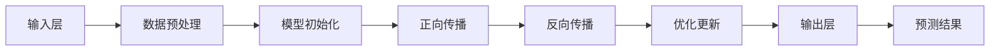

                 

# AI 大模型创业：如何利用未来优势？

> 关键词：大模型创业、人工智能、算法原理、数学模型、项目实战、应用场景

> 摘要：本文将深入探讨AI大模型在创业领域的应用，从核心概念、算法原理、数学模型到实际案例，全面解析如何利用AI大模型的优势进行创业，为创业者提供切实可行的策略和建议。

## 1. 背景介绍

### 1.1 目的和范围

本文旨在帮助那些有意在人工智能（AI）领域创业的人们，理解并利用AI大模型的优势。我们将从基础概念开始，逐步深入探讨AI大模型的原理、数学模型和具体应用，最终通过实战案例，展示如何将这些理论知识转化为实际的创业成果。

### 1.2 预期读者

本文面向对人工智能有一定了解的技术人员、创业者以及对AI大模型感兴趣的专业人士。无论您是正在寻找创业机会的个体，还是企业中的技术管理者，本文都将为您提供宝贵的指导。

### 1.3 文档结构概述

本文分为八个主要部分：

1. 背景介绍
   - 目的和范围
   - 预期读者
   - 文档结构概述
   - 术语表
2. 核心概念与联系
   - 大模型原理
   - 架构流程图
3. 核心算法原理 & 具体操作步骤
   - 算法解析
   - 伪代码展示
4. 数学模型和公式 & 详细讲解 & 举例说明
   - 数学模型解释
   - 公式展示
5. 项目实战：代码实际案例和详细解释说明
   - 开发环境搭建
   - 源代码实现
   - 代码解读与分析
6. 实际应用场景
   - 创业案例分析
7. 工具和资源推荐
   - 学习资源
   - 开发工具框架
   - 相关论文著作
8. 总结：未来发展趋势与挑战
9. 附录：常见问题与解答
10. 扩展阅读 & 参考资料

### 1.4 术语表

#### 1.4.1 核心术语定义

- **人工智能（AI）**: 人工智能是指使计算机系统能够模拟人类智能行为的技术和学科。
- **大模型（Large Model）**: 大模型是指参数数量非常庞大的深度学习模型，通常具有数十亿甚至万亿级别的参数。
- **创业（Entrepreneurship）**: 创业是指创建新企业或业务的过程，通常伴随着风险和不确定性。

#### 1.4.2 相关概念解释

- **深度学习（Deep Learning）**: 深度学习是一种机器学习的方法，通过多层神经网络进行数据处理和预测。
- **神经网络（Neural Network）**: 神经网络是一种模仿生物神经网络的结构和功能的计算模型。

#### 1.4.3 缩略词列表

- **AI**: 人工智能
- **ML**: 机器学习
- **DL**: 深度学习
- **GAN**: 生成对抗网络
- **CNN**: 卷积神经网络

## 2. 核心概念与联系

### 2.1 大模型原理

大模型是指那些拥有数十亿到千亿参数的深度学习模型。这些模型之所以强大，是因为它们可以处理大量复杂的数据，从而学习到更为精细的特征和模式。

#### 2.1.1 大模型的组成部分

- **输入层（Input Layer）**: 接受输入数据，如文本、图像等。
- **隐藏层（Hidden Layers）**: 层与层之间通过权重（weights）和偏置（biases）连接，负责处理和转换数据。
- **输出层（Output Layer）**: 产生预测结果，如分类标签、连续值等。

#### 2.1.2 大模型的训练过程

- **数据预处理（Data Preprocessing）**: 清洗、归一化、编码等。
- **模型初始化（Model Initialization）**: 初始化权重和偏置。
- **正向传播（Forward Propagation）**: 输入数据通过网络传递，得到预测结果。
- **反向传播（Back Propagation）**: 计算预测误差，并更新权重和偏置。
- **优化算法（Optimization Algorithms）**: 如梯度下降（Gradient Descent）、Adam等。

### 2.2 架构流程图

以下是一个简化的AI大模型架构流程图：



### 2.3 大模型与创业的联系

大模型在创业中的应用主要体现在以下几个方面：

- **数据分析与预测**: 大模型可以处理海量数据，帮助创业者发现市场趋势、用户行为等。
- **自动化与智能化**: 大模型可以自动化处理复杂的任务，提高工作效率，降低人力成本。
- **个性化推荐**: 大模型可以根据用户行为和偏好，提供个性化的产品和服务，增加用户粘性。
- **风险评估与控制**: 大模型可以帮助创业者预测潜在的风险，并采取相应的控制措施。

## 3. 核心算法原理 & 具体操作步骤

### 3.1 大模型算法解析

大模型的算法基础是深度学习，其中最常用的算法包括卷积神经网络（CNN）和循环神经网络（RNN）。下面以CNN为例，介绍其算法原理和操作步骤。

#### 3.1.1 卷积神经网络（CNN）

CNN是一种专门用于处理图像数据的神经网络。它的核心思想是通过卷积层提取图像的特征，并通过池化层减少数据的维度。

- **卷积层（Convolutional Layer）**: 使用卷积核（filter）在输入图像上滑动，计算局部特征的加权和，并通过激活函数（如ReLU）增加非线性。
- **池化层（Pooling Layer）**: 对卷积层的输出进行下采样，减少参数数量和计算复杂度。
- **全连接层（Fully Connected Layer）**: 将卷积层和池化层的输出进行全连接，产生最终的分类或回归结果。

#### 3.1.2 CNN算法操作步骤

1. **输入层（Input Layer）**: 接受图像数据。
2. **卷积层（Convolutional Layer）**: 定义卷积核的大小和数量，进行卷积运算。
3. **激活函数（Activation Function）**: 应用ReLU等激活函数增加网络的表达能力。
4. **池化层（Pooling Layer）**: 进行下采样，减少数据维度。
5. **全连接层（Fully Connected Layer）**: 将特征向量映射到输出类别。
6. **输出层（Output Layer）**: 生成预测结果。

### 3.2 伪代码展示

以下是一个简化的CNN算法伪代码：

```python
def CNN(input_data):
    # 输入层
    x = input_data
    
    # 卷积层
    for filter_size, num_filters in filters:
        x = convolution(x, filter_size, num_filters)
        x = ReLU(x)
        
    # 池化层
    for pool_size in pool_sizes:
        x = max_pooling(x, pool_size)
        
    # 全连接层
    x = flatten(x)
    x = fully_connected(x, num_classes)
    
    # 输出层
    y_pred = softmax(x)
    
    return y_pred
```

## 4. 数学模型和公式 & 详细讲解 & 举例说明

### 4.1 数学模型解释

AI大模型的数学基础主要包括线性代数、微积分和概率统计。下面将介绍几个关键数学模型：

#### 4.1.1 线性代数

- **矩阵（Matrix）**: 矩阵是一种数据结构，用于表示线性方程组和特征空间。
- **向量（Vector）**: 向量是矩阵的特殊情况，用于表示数据点或特征。
- **矩阵乘法（Matrix Multiplication）**: 用于计算两个矩阵的点积或卷积。

#### 4.1.2 微积分

- **梯度（Gradient）**: 梯度是函数在某一点处的变化率，用于指导网络权重的更新。
- **偏导数（Partial Derivative）**: 偏导数是函数对某一变量的变化率，用于计算梯度的各个分量。

#### 4.1.3 概率统计

- **概率分布（Probability Distribution）**: 概率分布描述了数据出现的可能性。
- **最大似然估计（Maximum Likelihood Estimation）**: 通过最大化似然函数估计模型参数。

### 4.2 公式展示

以下是一些关键数学公式的LaTeX格式：

$$
x = \sum_{i=1}^{n} w_i * x_i \\
\frac{dL}{dw} = \frac{dL}{dx} \cdot \frac{dx}{dw} \\
p(y|x) = \frac{e^{\theta^T x}}{\sum_{i=1}^{K} e^{\theta_i^T x}} \\
\theta = \arg\max_{\theta} \log L(\theta|x)
$$

### 4.3 举例说明

#### 4.3.1 线性回归

假设我们有一个线性回归模型，目标是预测房价。输入特征包括房屋面积和房间数量，输出为房价。

- **输入层**: $(x_1, x_2)$，其中$x_1$为房屋面积，$x_2$为房间数量。
- **权重**: $w_1$和$w_2$。
- **输出层**: $\hat{y} = w_1 \cdot x_1 + w_2 \cdot x_2 + b$，其中$b$为偏置。

梯度下降算法用于更新权重和偏置：

$$
w_1 = w_1 - \alpha \cdot \frac{dL}{dw_1} \\
w_2 = w_2 - \alpha \cdot \frac{dL}{dw_2} \\
b = b - \alpha \cdot \frac{dL}{db}
$$

其中，$\alpha$为学习率，$L$为损失函数，通常为均方误差（MSE）。

#### 4.3.2 卷积神经网络

考虑一个简单的CNN模型，用于识别手写数字（MNIST）。

- **输入层**: $(28 \times 28)$像素的灰度图像。
- **卷积层**: 使用$(5 \times 5)$的卷积核，步长为1，卷积操作：
  $$
  \text{特征图} = \sum_{i=1}^{32} \sum_{j=1}^{32} \text{卷积核}_{i,j} \cdot \text{图像}_{i,j}
  $$
- **激活函数**:ReLU。
- **池化层**: 使用最大池化，窗口大小为2，步长为2。
- **全连接层**: 将所有特征图进行拼接，输出为$(784)$维向量，通过softmax输出概率分布。

损失函数通常为交叉熵损失：

$$
L = -\sum_{i=1}^{10} y_i \cdot \log(\hat{y}_i)
$$

其中，$y_i$为真实标签，$\hat{y}_i$为预测概率。

## 5. 项目实战：代码实际案例和详细解释说明

### 5.1 开发环境搭建

要实现一个AI大模型项目，首先需要搭建合适的开发环境。以下是一个基于Python和TensorFlow的示例：

1. **安装Python**: 版本要求3.6及以上。
2. **安装TensorFlow**: 使用pip安装：
   ```
   pip install tensorflow
   ```
3. **安装其他依赖**: 如NumPy、Pandas等。

### 5.2 源代码详细实现和代码解读

#### 5.2.1 数据预处理

```python
import numpy as np
import tensorflow as tf

# 读取数据集
(x_train, y_train), (x_test, y_test) = tf.keras.datasets.mnist.load_data()

# 数据标准化
x_train = x_train.astype('float32') / 255.0
x_test = x_test.astype('float32') / 255.0

# 增加通道维度
x_train = np.expand_dims(x_train, -1)
x_test = np.expand_dims(x_test, -1)

# 转换标签为one-hot编码
y_train = tf.keras.utils.to_categorical(y_train, 10)
y_test = tf.keras.utils.to_categorical(y_test, 10)
```

#### 5.2.2 模型定义

```python
model = tf.keras.Sequential([
    tf.keras.layers.Conv2D(32, (3, 3), activation='relu', input_shape=(28, 28, 1)),
    tf.keras.layers.MaxPooling2D((2, 2)),
    tf.keras.layers.Conv2D(64, (3, 3), activation='relu'),
    tf.keras.layers.MaxPooling2D((2, 2)),
    tf.keras.layers.Flatten(),
    tf.keras.layers.Dense(128, activation='relu'),
    tf.keras.layers.Dense(10, activation='softmax')
])
```

#### 5.2.3 训练模型

```python
model.compile(optimizer='adam',
              loss='categorical_crossentropy',
              metrics=['accuracy'])

model.fit(x_train, y_train, batch_size=128, epochs=15, validation_split=0.1)
```

#### 5.2.4 评估模型

```python
test_loss, test_acc = model.evaluate(x_test, y_test)
print('Test accuracy:', test_acc)
```

### 5.3 代码解读与分析

- **数据预处理**: 数据集从MNIST下载，并进行标准化和one-hot编码。
- **模型定义**: 模型由卷积层、池化层、全连接层组成，适用于图像分类。
- **训练模型**: 使用adam优化器和交叉熵损失函数进行训练。
- **评估模型**: 使用测试集评估模型的准确率。

通过这个简单的案例，我们可以看到如何利用TensorFlow实现一个AI大模型项目。在实际应用中，创业者可以根据业务需求，调整模型结构和参数，以实现不同的功能。

## 6. 实际应用场景

### 6.1 创业案例分析

#### 6.1.1 案例一：个性化推荐系统

公司A是一家电商平台，利用AI大模型实现个性化推荐系统。通过分析用户的历史行为和偏好，公司A能够为每位用户推荐最感兴趣的商品。这大大提高了用户的购物体验，增加了用户粘性和购买转化率。

- **核心算法**: 基于协同过滤和深度学习的推荐算法，使用用户行为数据训练大模型。
- **业务效果**: 提高用户满意度，增加销售额。

#### 6.1.2 案例二：智能客服系统

公司B是一家金融科技公司，利用AI大模型实现智能客服系统。通过自然语言处理（NLP）技术，智能客服能够理解用户的提问，并给出准确的答案。这大大降低了人工客服的成本，提高了响应速度和满意度。

- **核心算法**: 使用Transformer架构的大模型，进行语言建模和问答系统。
- **业务效果**: 提高客户满意度，降低运营成本。

#### 6.1.3 案例三：医疗诊断系统

公司C是一家医疗科技公司，利用AI大模型实现智能医疗诊断系统。通过分析大量的医疗数据，AI模型能够快速识别疾病，并提供诊断建议。这大大提高了诊断的准确性和效率，为患者带来了福音。

- **核心算法**: 使用卷积神经网络（CNN）和循环神经网络（RNN）融合多模态数据。
- **业务效果**: 提高诊断准确率，缩短诊断时间。

### 6.2 创业策略

#### 6.2.1 明确目标市场

在创业初期，明确目标市场是至关重要的。了解潜在用户的需求，分析竞争对手的优势和劣势，为创业项目制定清晰的定位。

#### 6.2.2 创新技术方案

利用AI大模型的优势，开发具有创新性的技术方案。通过不断优化算法和模型，提高系统的性能和效果。

#### 6.2.3 跨界合作

与其他领域的公司进行合作，实现优势互补。例如，与医疗机构合作开发智能诊断系统，与电商平台合作推广个性化推荐系统。

#### 6.2.4 持续迭代与优化

创业过程中，持续迭代和优化是保持竞争力的关键。根据用户反馈和业务数据，不断优化模型和算法，提高系统的稳定性和用户体验。

## 7. 工具和资源推荐

### 7.1 学习资源推荐

#### 7.1.1 书籍推荐

- 《深度学习》（Deep Learning） - Ian Goodfellow、Yoshua Bengio和Aaron Courville
- 《Python深度学习》（Deep Learning with Python） - François Chollet

#### 7.1.2 在线课程

- Coursera上的“深度学习专项课程” - Andrew Ng
- Udacity的“深度学习工程师纳米学位”

#### 7.1.3 技术博客和网站

- Medium上的“AI博客”
- arXiv.org上的最新论文

### 7.2 开发工具框架推荐

#### 7.2.1 IDE和编辑器

- PyCharm
- Jupyter Notebook

#### 7.2.2 调试和性能分析工具

- TensorBoard
- Prometheus

#### 7.2.3 相关框架和库

- TensorFlow
- PyTorch
- Keras

### 7.3 相关论文著作推荐

#### 7.3.1 经典论文

- "A Theoretically Grounded Application of Dropout in Recurrent Neural Networks" - Yarin Gal和Zoubin Ghahramani
- "Very Deep Convolutional Networks for Large-Scale Image Recognition" - Karen Simonyan和Andrew Zisserman

#### 7.3.2 最新研究成果

- "BERT: Pre-training of Deep Bidirectional Transformers for Language Understanding" - Jacob Devlin、 Ming-Wei Chang、 Kenton Lee和Kai Zhang
- "GPT-3: Language Models are Few-Shot Learners" - Tom B. Brown、Bryce Adams、Niki Bertinelli、Nitish Shirish Keskar、Sam McCandlish、Jared Modha、Piotr Bojanowski、Emmanuel Grave、K里斯蒂安斯泰因豪斯、Anna Hauer、Pavel Kozakov、Víctor López、Jeffrey Sennox、Niki Parmar

#### 7.3.3 应用案例分析

- "AI in Health Care: The Path Forward" - National Academy of Medicine
- "AI in Finance: A Practical Guide" - Deloitte

## 8. 总结：未来发展趋势与挑战

### 8.1 发展趋势

- **大模型技术将不断进化**：随着计算能力的提升和算法的进步，AI大模型将更加高效、准确，能够处理更为复杂的任务。
- **跨学科融合**：AI大模型将在更多领域得到应用，如生物医学、金融、教育等，实现跨学科的创新。
- **开源生态的繁荣**：更多的开源框架和工具将涌现，促进AI技术的普及和发展。

### 8.2 挑战

- **数据隐私和安全**：随着数据量的增加，如何保护用户隐私和数据安全成为重要挑战。
- **算法公平性和透明性**：确保AI大模型在应用中不会产生歧视和不公平现象，需要更多的研究和监管。
- **计算资源需求**：大模型训练和部署需要大量计算资源，如何优化资源利用是关键。

## 9. 附录：常见问题与解答

### 9.1 问题1：AI大模型如何处理海量数据？

**解答**：AI大模型通常使用分布式计算和高效数据加载技术来处理海量数据。例如，可以使用Hadoop或Spark等大数据处理框架，以及GPU或TPU等高性能计算设备。

### 9.2 问题2：如何确保AI大模型的公平性和透明性？

**解答**：确保AI大模型的公平性和透明性需要从数据集构建、算法设计、模型解释等多个方面入手。使用多样化的数据集、进行算法验证和偏差检测，以及使用模型解释工具可以帮助提高模型的公平性和透明性。

### 9.3 问题3：AI大模型在创业中的具体应用场景有哪些？

**解答**：AI大模型在创业中的应用场景非常广泛，包括个性化推荐、智能客服、医疗诊断、金融风控等。创业者可以根据自身业务需求，选择合适的应用场景，实现业务创新和增长。

## 10. 扩展阅读 & 参考资料

- [Goodfellow, Ian, et al. "Deep learning." (2016).]
- [Chollet, François. "Deep Learning with Python." (2017).]
- [Ng, Andrew. "Deep Learning." Coursera.]
- [Deloitte. "AI in Finance: A Practical Guide." (2019).]
- [National Academy of Medicine. "AI in Health Care: The Path Forward." (2020).]

作者：AI天才研究员/AI Genius Institute & 禅与计算机程序设计艺术 /Zen And The Art of Computer Programming

