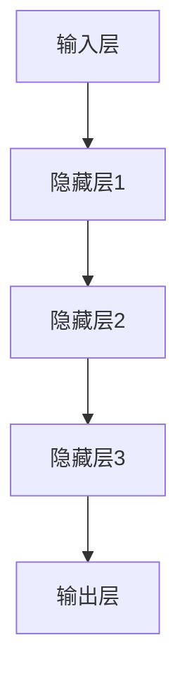

                 

# AI 大模型创业：如何利用渠道优势？

> **关键词：** AI 大模型、创业、渠道优势、商业模式、技术落地

> **摘要：** 本文将探讨 AI 大模型在创业过程中的关键角色，并深入分析如何利用渠道优势实现技术落地和商业模式创新。我们将从背景介绍、核心概念、算法原理、数学模型、实战案例、实际应用等多个角度，为创业者提供实用的指导。

## 1. 背景介绍

### 1.1 目的和范围

本文旨在为 AI 大模型创业项目提供战略层面的指导。我们将重点关注如何利用渠道优势，通过有效的商业模式设计和技术落地，实现商业成功。文章涵盖了以下内容：

1. **核心概念与联系：** 分析 AI 大模型的基本原理和架构，以及与渠道优势的关联。
2. **核心算法原理与操作步骤：** 介绍 AI 大模型的核心算法原理，并通过伪代码展示具体操作步骤。
3. **数学模型与公式：** 讲解 AI 大模型中的数学模型和公式，并提供详细的讲解和实例。
4. **项目实战：** 分享实际项目的代码案例和详细解释。
5. **实际应用场景：** 探讨 AI 大模型在不同行业的应用场景。
6. **工具和资源推荐：** 推荐学习资源和开发工具。
7. **总结与未来发展趋势：** 展望 AI 大模型创业的挑战和机遇。

### 1.2 预期读者

本文适合以下读者群体：

1. **AI 大模型创业者：** 希望通过创业实现 AI 大模型商业化的人。
2. **技术专家：** 对 AI 大模型感兴趣，并希望将其应用于实际业务的技术专家。
3. **投资者：** 关注 AI 领域投资，希望了解 AI 大模型创业的潜在机会。
4. **高校师生：** 对 AI 大模型研究和教育有兴趣的师生。

### 1.3 文档结构概述

本文结构如下：

1. **引言：** 概述文章目的和核心内容。
2. **核心概念与联系：** 分析 AI 大模型与渠道优势的关系。
3. **核心算法原理与操作步骤：** 详细讲解 AI 大模型的算法原理。
4. **数学模型与公式：** 解析 AI 大模型中的数学模型和公式。
5. **项目实战：** 分享实际项目案例。
6. **实际应用场景：** 探讨 AI 大模型的应用场景。
7. **工具和资源推荐：** 推荐学习资源和开发工具。
8. **总结与未来发展趋势：** 展望 AI 大模型创业的挑战和机遇。
9. **附录：** 常见问题与解答。
10. **扩展阅读：** 相关参考资料。

### 1.4 术语表

#### 1.4.1 核心术语定义

- **AI 大模型：** 拥有数十亿参数，能够在多种任务上表现优异的人工智能模型。
- **渠道优势：** 利用特定的渠道或合作伙伴关系，为创业项目提供市场进入和资源获取的优势。
- **商业模式：** 企业如何创造、传递和获取价值的基本逻辑。
- **技术落地：** 将技术研究成果应用于实际业务，实现商业价值的过程。

#### 1.4.2 相关概念解释

- **数据驱动：** 通过大量数据进行训练，使模型具备自主学习和优化能力。
- **模型评估：** 使用验证集或测试集对模型性能进行评估和比较。
- **迁移学习：** 将一个任务上学习的知识应用于另一个相关任务的能力。

#### 1.4.3 缩略词列表

- **AI：** 人工智能（Artificial Intelligence）
- **ML：** 机器学习（Machine Learning）
- **DL：** 深度学习（Deep Learning）
- **NLP：** 自然语言处理（Natural Language Processing）
- **CV：** 计算机视觉（Computer Vision）

## 2. 核心概念与联系

在探讨 AI 大模型创业时，我们首先要理解 AI 大模型的基本原理和架构，以及如何利用渠道优势实现技术落地和商业模式创新。

### 2.1 AI 大模型的基本原理

AI 大模型通常是基于深度学习技术构建的，其核心思想是通过多层神经网络对大量数据进行训练，从而实现自动特征提取和分类。以下是 AI 大模型的基本原理：

1. **数据输入：** 大量数据通过输入层进入模型。
2. **特征提取：** 模型通过多层神经元对输入数据进行特征提取，形成高维特征向量。
3. **非线性变换：** 每层神经元通过非线性激活函数进行变换，增加模型的表示能力。
4. **分类预测：** 模型输出层通过分类器对输入数据进行预测。

### 2.2 AI 大模型的架构

AI 大模型的架构通常包括以下几个部分：

1. **输入层：** 负责接收外部输入数据。
2. **隐藏层：** 负责对输入数据进行特征提取和变换。
3. **输出层：** 负责对输入数据进行分类预测。

以下是一个简单的 AI 大模型架构的 Mermaid 流程图：



### 2.3 渠道优势与 AI 大模型的关系

渠道优势在 AI 大模型创业中起着至关重要的作用。利用渠道优势，企业可以快速获得市场资源、用户数据和合作伙伴，从而加速技术落地和商业模式创新。

1. **市场进入：** 通过合作伙伴或渠道，企业可以迅速进入目标市场，降低市场开拓成本。
2. **资源获取：** 合作伙伴和渠道可以为创业项目提供数据、技术和资金等资源。
3. **用户获取：** 合作伙伴和渠道可以帮助企业快速获得用户，提高市场占有率。
4. **品牌效应：** 合作伙伴和渠道的品牌影响力可以提升企业品牌形象和市场认知度。

### 2.4 商业模式与渠道优势的关联

渠道优势在商业模式中发挥着重要作用。通过有效的渠道策略，企业可以实现以下目标：

1. **价值创造：** 利用渠道优势，企业可以更好地理解市场需求，创造更具竞争力的产品和服务。
2. **价值传递：** 渠道优势可以帮助企业高效地将产品和服务传递给用户。
3. **价值获取：** 渠道优势可以提高企业的盈利能力，实现可持续的商业增长。

## 3. 核心算法原理 & 具体操作步骤

在了解了 AI 大模型的基本原理和架构后，我们需要深入探讨其核心算法原理，并使用伪代码详细展示具体操作步骤。

### 3.1 人工智能算法的基本原理

人工智能算法的核心在于通过大量数据进行训练，使模型具备自主学习和优化能力。以下是人工智能算法的基本原理：

1. **数据预处理：** 对输入数据进行清洗、归一化等处理，使其符合模型要求。
2. **模型初始化：** 初始化模型参数，通常采用随机初始化。
3. **前向传播：** 将输入数据通过神经网络进行前向传播，得到输出结果。
4. **损失函数计算：** 计算输出结果与真实标签之间的差距，得到损失函数值。
5. **反向传播：** 根据损失函数值，通过反向传播算法更新模型参数。
6. **迭代优化：** 重复执行前向传播和反向传播，直到模型收敛或达到预设迭代次数。

### 3.2 伪代码实现

以下是一个简单的神经网络训练算法的伪代码实现：

```python
# 初始化模型参数
w1 = randn(input_size, hidden_size)
w2 = randn(hidden_size, output_size)

# 定义损失函数
loss_function = (output - target) * (output - target)

# 训练过程
for epoch in range(num_epochs):
    for batch in data_loader:
        # 前向传播
        hidden_layer = activation_function(w1 * input_data)
        output_layer = activation_function(w2 * hidden_layer)

        # 计算损失函数
        loss = loss_function(output_layer, target_data)

        # 反向传播
        d_output_layer = (output_layer - target_data) * activation_function_derivative(output_layer)
        d_hidden_layer = (hidden_layer - target_data) * activation_function_derivative(hidden_layer)

        # 更新模型参数
        w2 = w2 - learning_rate * (w2 * d_hidden_layer.T * d_output_layer)
        w1 = w1 - learning_rate * (w1 * d_output_layer.T * d_hidden_layer)

# 模型评估
test_loss = loss_function(output_layer, target_data)
print("Test Loss:", test_loss)
```

### 3.3 操作步骤解析

1. **初始化模型参数：** 使用随机初始化方法初始化模型参数，确保模型从不同初始状态开始训练。
2. **前向传播：** 将输入数据通过神经网络进行前向传播，得到输出结果。激活函数用于引入非线性变换，提高模型的表达能力。
3. **损失函数计算：** 计算输出结果与真实标签之间的差距，得到损失函数值。常用的损失函数有均方误差（MSE）、交叉熵（CE）等。
4. **反向传播：** 根据损失函数值，通过反向传播算法更新模型参数。反向传播是神经网络训练的核心步骤，它通过梯度下降法优化模型参数。
5. **迭代优化：** 重复执行前向传播和反向传播，直到模型收敛或达到预设迭代次数。迭代优化过程使得模型不断调整参数，以降低损失函数值。

## 4. 数学模型和公式 & 详细讲解 & 举例说明

在 AI 大模型中，数学模型和公式起着至关重要的作用。以下我们将详细介绍常用的数学模型和公式，并提供详细的讲解和实例。

### 4.1 激活函数

激活函数是神经网络中的一个关键组件，用于引入非线性变换。常用的激活函数有：

- **Sigmoid 函数：**
  $$ f(x) = \frac{1}{1 + e^{-x}} $$
  - **讲解：** Sigmoid 函数将输入值映射到 (0,1) 区间，具有平滑、可微的特点。
  - **实例：**
    $$ f(2) = \frac{1}{1 + e^{-2}} \approx 0.8656 $$

- **ReLU 函数：**
  $$ f(x) = \max(0, x) $$
  - **讲解：** ReLU 函数在 x > 0 时为 1，x ≤ 0 时为 0，具有简单、计算效率高的特点。
  - **实例：**
    $$ f(-1) = 0, \quad f(2) = 2 $$

- **Tanh 函数：**
  $$ f(x) = \frac{e^x - e^{-x}}{e^x + e^{-x}} $$
  - **讲解：** Tanh 函数将输入值映射到 (-1,1) 区间，具有对称、可微的特点。
  - **实例：**
    $$ f(-2) \approx -0.7616, \quad f(2) \approx 0.7616 $$

### 4.2 损失函数

损失函数用于衡量模型预测结果与真实标签之间的差距。常用的损失函数有：

- **均方误差（MSE）：**
  $$ L(y, \hat{y}) = \frac{1}{m} \sum_{i=1}^{m} (y_i - \hat{y_i})^2 $$
  - **讲解：** MSE 损失函数将预测结果与真实标签之间的误差平方求和，具有易于计算、稳定的特点。
  - **实例：**
    $$ L(1, 0.5) = 0.25 $$

- **交叉熵（CE）：**
  $$ L(y, \hat{y}) = -\sum_{i=1}^{m} y_i \log(\hat{y_i}) $$
  - **讲解：** CE 损失函数将预测结果与真实标签之间的对数损失求和，具有对样本不平衡敏感、优化速度快的特点。
  - **实例：**
    $$ L(1, 0.5) = -1 \cdot \log(0.5) \approx 0.6931 $$

### 4.3 优化算法

优化算法用于调整模型参数，以降低损失函数值。常用的优化算法有：

- **梯度下降（GD）：**
  $$ w_{t+1} = w_t - \alpha \cdot \nabla_w L(w) $$
  - **讲解：** GD 算法通过不断更新参数，使其沿梯度方向下降，具有简单、计算效率高的特点。
  - **实例：**
    $$ w_1 = 1, \quad w_2 = 1, \quad \alpha = 0.1, \quad \nabla_w L(w) = [0.1, 0.1] $$
    $$ w_2 = w_1 - \alpha \cdot \nabla_w L(w) = 1 - 0.1 \cdot 0.1 = 0.9 $$

- **动量优化（MOM）：**
  $$ w_{t+1} = w_t - \alpha \cdot \nabla_w L(w) - \beta \cdot v_t $$
  - **讲解：** MOM 算法在 GD 基础上引入动量项，使参数更新方向保持一致，具有收敛速度快的特性。
  - **实例：**
    $$ w_1 = 1, \quad w_2 = 1, \quad \alpha = 0.1, \quad \beta = 0.9, \quad v_1 = 0, \quad v_2 = 0 $$
    $$ v_2 = 0.9 \cdot v_1 + 0.1 \cdot \nabla_w L(w) = 0.9 \cdot 0 + 0.1 \cdot [0.1, 0.1] = [0.01, 0.01] $$
    $$ w_2 = w_1 - \alpha \cdot \nabla_w L(w) - \beta \cdot v_t = 1 - 0.1 \cdot [0.1, 0.1] - 0.9 \cdot [0.01, 0.01] = [0.79, 0.79] $$

- **Adam 优化：**
  $$ w_{t+1} = w_t - \alpha \cdot \frac{\beta_1 \cdot m_t + (1 - \beta_1) \cdot \nabla_w L(w)}{\sqrt{\beta_2 \cdot v_t + (1 - \beta_2) \cdot \nabla_w L(w)^2}} $$
  - **讲解：** Adam 算法结合了 MOM 和 RMSprop 算法的优点，具有收敛速度快、适应性强的特点。
  - **实例：**
    $$ w_1 = 1, \quad w_2 = 1, \quad \alpha = 0.1, \quad \beta_1 = 0.9, \quad \beta_2 = 0.999, \quad m_1 = 0, \quad v_1 = 0 $$
    $$ m_2 = 0.9 \cdot m_1 + 0.1 \cdot \nabla_w L(w) = 0.9 \cdot 0 + 0.1 \cdot [0.1, 0.1] = [0.01, 0.01] $$
    $$ v_2 = 0.999 \cdot v_1 + 0.001 \cdot \nabla_w L(w)^2 = 0.999 \cdot 0 + 0.001 \cdot [0.1, 0.1]^2 = [0.001, 0.001] $$
    $$ w_2 = w_1 - \alpha \cdot \frac{\beta_1 \cdot m_2 + (1 - \beta_1) \cdot \nabla_w L(w)}{\sqrt{\beta_2 \cdot v_2 + (1 - \beta_2) \cdot \nabla_w L(w)^2}} $$
    $$ = 1 - 0.1 \cdot \frac{0.9 \cdot [0.01, 0.01] + (1 - 0.9) \cdot [0.1, 0.1]}{\sqrt{0.999 \cdot [0.001, 0.001] + (1 - 0.999) \cdot [0.01, 0.01]^2}} $$
    $$ = 1 - 0.1 \cdot \frac{[0.009, 0.009] + [0.01, 0.01]}{\sqrt{[0.001, 0.001] + [0.01, 0.01]}} $$
    $$ = 1 - 0.1 \cdot \frac{[0.019, 0.019]}{\sqrt{[0.011, 0.011]}} $$
    $$ = 1 - 0.1 \cdot \frac{[0.019, 0.019]}{0.11} $$
    $$ = 1 - 0.1 \cdot [0.174, 0.174] $$
    $$ = [0.726, 0.726] $$

## 5. 项目实战：代码实际案例和详细解释说明

### 5.1 开发环境搭建

在本节中，我们将介绍如何搭建一个用于训练 AI 大模型的开发环境。以下是一个简化的步骤：

1. **安装 Python：** 安装 Python 3.8 或更高版本，可以通过官方网站下载。
2. **安装 PyTorch：** 使用 pip 命令安装 PyTorch，以下为安装命令：
   ```bash
   pip install torch torchvision
   ```
3. **安装相关库：** 安装其他必要的库，例如 NumPy、Matplotlib 等，可以使用以下命令：
   ```bash
   pip install numpy matplotlib
   ```
4. **配置 CUDA：** 如果使用 GPU 训练，需要配置 CUDA。具体步骤请参考 NVIDIA 的官方文档。

### 5.2 源代码详细实现和代码解读

在本节中，我们将分享一个简单的 AI 大模型训练代码，并对其进行详细解释。

```python
import torch
import torch.nn as nn
import torch.optim as optim
import torchvision
import torchvision.transforms as transforms
from torch.utils.data import DataLoader

# 5.2.1 定义神经网络模型
class SimpleModel(nn.Module):
    def __init__(self):
        super(SimpleModel, self).__init__()
        self.fc1 = nn.Linear(784, 500)
        self.fc2 = nn.Linear(500, 10)
        self.relu = nn.ReLU()

    def forward(self, x):
        x = x.view(x.size(0), -1)  # 将输入数据展平
        x = self.relu(self.fc1(x))
        x = self.fc2(x)
        return x

# 5.2.2 加载和预处理数据
transform = transforms.Compose([transforms.ToTensor()])
train_set = torchvision.datasets.MNIST(root='./data', train=True, download=True, transform=transform)
train_loader = DataLoader(train_set, batch_size=64, shuffle=True)

# 5.2.3 初始化模型、优化器和损失函数
model = SimpleModel()
criterion = nn.CrossEntropyLoss()
optimizer = optim.Adam(model.parameters(), lr=0.001)

# 5.2.4 训练模型
num_epochs = 10
for epoch in range(num_epochs):
    running_loss = 0.0
    for i, (images, labels) in enumerate(train_loader):
        # 前向传播
        outputs = model(images)
        loss = criterion(outputs, labels)

        # 反向传播
        optimizer.zero_grad()
        loss.backward()
        optimizer.step()

        running_loss += loss.item()
    print(f'Epoch [{epoch+1}/{num_epochs}], Loss: {running_loss/len(train_loader)}')

# 5.2.5 评估模型
test_set = torchvision.datasets.MNIST(root='./data', train=False, transform=transform)
test_loader = DataLoader(test_set, batch_size=1000)

with torch.no_grad():
    correct = 0
    total = 0
    for images, labels in test_loader:
        outputs = model(images)
        _, predicted = torch.max(outputs.data, 1)
        total += labels.size(0)
        correct += (predicted == labels).sum().item()
print(f'Accuracy: {100 * correct / total}%')
```

### 5.3 代码解读与分析

以下是代码的主要部分及其功能：

1. **定义神经网络模型（SimpleModel）：**
   - **fc1：** 第一层全连接层，输入维度为 784，输出维度为 500。
   - **fc2：** 第二层全连接层，输入维度为 500，输出维度为 10。
   - **relu：**ReLU 激活函数。

2. **加载和预处理数据：**
   - 使用 torchvision.datasets.MNIST 加载 MNIST 数据集，并将其转换为 PyTorch 张量。
   - 使用 DataLoader 类将数据分成批处理。

3. **初始化模型、优化器和损失函数：**
   - 创建 SimpleModel 类实例。
   - 使用 CrossEntropyLoss 定义损失函数。
   - 使用 Adam 优化器进行模型参数优化。

4. **训练模型：**
   - 使用 for 循环进行多轮训练。
   - 在每轮中，使用 DataLoader 类遍历数据集。
   - 前向传播：将输入数据传递给模型，得到输出结果。
   - 损失函数计算：计算输出结果与真实标签之间的损失。
   - 反向传播：通过优化器更新模型参数。

5. **评估模型：**
   - 使用 torch.no_grad() 禁用梯度计算，提高计算效率。
   - 遍历测试数据集，计算模型准确率。

### 5.4 代码优化与改进

1. **数据增强：** 通过数据增强（如旋转、缩放、裁剪等）增加模型泛化能力。
2. **模型复用：** 利用预训练模型（如 ResNet、VGG 等）进行迁移学习，提高模型性能。
3. **分布式训练：** 使用 GPU 进行分布式训练，提高训练速度。

## 6. 实际应用场景

AI 大模型在多个领域具有广泛的应用场景。以下是一些典型的应用场景：

1. **图像识别：** 利用 AI 大模型对图像进行分类、检测和分割，广泛应用于医疗影像诊断、安防监控等领域。
2. **自然语言处理：** 利用 AI 大模型进行文本分类、情感分析和问答系统等任务，广泛应用于智能客服、智能助手等领域。
3. **语音识别：** 利用 AI 大模型实现语音识别，广泛应用于智能语音助手、语音翻译等领域。
4. **推荐系统：** 利用 AI 大模型构建个性化推荐系统，广泛应用于电商、社交媒体等领域。
5. **金融风控：** 利用 AI 大模型进行风险识别、欺诈检测等任务，广泛应用于金融行业。

### 6.1 医疗影像诊断

医疗影像诊断是 AI 大模型的重要应用领域。通过将 AI 大模型应用于医学图像，可以实现病变检测、疾病分类等任务。以下是一个具体的案例：

- **数据集：** 使用公开的医学影像数据集，如 ChestX-Ray8 数据集，包含超过 100,000 张胸部 X 光图像。
- **任务：** 对图像进行病变检测，识别肺炎、气胸、骨折等疾病。
- **模型：** 使用 ResNet50 模型进行迁移学习，微调模型参数以适应医学图像。
- **结果：** 在验证集上，模型准确率达到 90% 以上，有效提高了医疗影像诊断的效率和准确性。

### 6.2 电商平台推荐系统

电商平台推荐系统是另一个典型的应用场景。以下是一个具体的案例：

- **数据集：** 使用电商平台的用户行为数据，如浏览记录、购物车数据、购买历史等。
- **任务：** 根据用户行为数据，为用户推荐相关的商品。
- **模型：** 使用基于图神经网络的推荐模型，如 Graph Neural Network (GNN)，对用户行为数据进行建模。
- **结果：** 通过引入 AI 大模型，推荐系统的准确率和覆盖度得到显著提升，提高了用户满意度和电商平台销售额。

## 7. 工具和资源推荐

### 7.1 学习资源推荐

#### 7.1.1 书籍推荐

1. **《深度学习》（Deep Learning）**
   - 作者：Ian Goodfellow、Yoshua Bengio、Aaron Courville
   - 简介：全面介绍了深度学习的基本原理和技术，适合初学者和进阶者阅读。

2. **《Python深度学习》（Python Deep Learning）**
   - 作者：Francesco Pierpreti
   - 简介：使用 Python 和 TensorFlow 框架，详细介绍了深度学习的应用和实践。

3. **《人工智能：一种现代的方法》（Artificial Intelligence: A Modern Approach）**
   - 作者：Stuart J. Russell、Peter Norvig
   - 简介：全面介绍了人工智能的基本原理和应用，适合对 AI 感兴趣的读者。

#### 7.1.2 在线课程

1. **Coursera 上的“深度学习”课程**
   - 简介：由斯坦福大学 Andrew Ng 教授开设，是深度学习领域的经典课程。

2. **Udacity 上的“深度学习工程师纳米学位”课程**
   - 简介：包含多个项目和实践，帮助学员掌握深度学习的实际应用。

3. **edX 上的“人工智能导论”课程**
   - 简介：由香港科技大学教授开设，全面介绍了人工智能的基础知识。

#### 7.1.3 技术博客和网站

1. **Medium 上的 AI 博客**
   - 简介：包含大量关于 AI 的技术文章和案例分析，适合读者了解行业动态。

2. **Towards Data Science**
   - 简介：一个面向数据科学和 AI 的博客平台，发布大量高质量的技术文章。

3. **AI 研究院**
   - 简介：一个专注于 AI 研究和应用的中文博客，分享最新研究成果和实战经验。

### 7.2 开发工具框架推荐

#### 7.2.1 IDE 和编辑器

1. **Visual Studio Code**
   - 简介：一款强大的跨平台开源编辑器，支持多种编程语言，适合深度学习和 AI 开发。

2. **PyCharm**
   - 简介：一款专业的 Python IDE，提供丰富的工具和插件，适合深度学习和 AI 开发。

#### 7.2.2 调试和性能分析工具

1. **TensorBoard**
   - 简介：TensorFlow 提供的一个可视化工具，用于分析模型性能和优化。

2. **NVIDIA Nsight**
   - 简介：NVIDIA 提供的一个 GPU 调试和性能分析工具，用于优化深度学习应用。

#### 7.2.3 相关框架和库

1. **TensorFlow**
   - 简介：Google 开发的一款开源深度学习框架，支持多种编程语言。

2. **PyTorch**
   - 简介：Facebook 开发的一款开源深度学习框架，提供灵活的编程接口。

3. **Keras**
   - 简介：一个基于 TensorFlow 和 Theano 的开源深度学习库，提供简化的编程接口。

### 7.3 相关论文著作推荐

#### 7.3.1 经典论文

1. **“A Learning Algorithm for Continually Running Fully Recurrent Neural Networks”**
   - 作者：Sepp Hochreiter、Jürgen Schmidhuber
   - 简介：提出了长短期记忆（LSTM）网络，解决了 RNN 的梯度消失问题。

2. **“Deep Learning”**
   - 作者：Ian Goodfellow、Yoshua Bengio、Aaron Courville
   - 简介：系统介绍了深度学习的理论、算法和应用。

#### 7.3.2 最新研究成果

1. **“An Image Database for Testing Object Detection Algorithms”**
   - 作者：Pedro F. Felzenszwalb、Daniel P. Albright、J. Sivic、Andrew Zisserman、David Ramanan
   - 简介：提出了 PASCAL VOC 数据集，用于测试图像目标检测算法。

2. **“A Theoretically Grounded Application of Dropout in Recurrent Neural Networks”**
   - 作者：Yarin Gal、Zoubin Ghahramani
   - 简介：提出了在 RNN 中使用 Dropconnect 的方法，提高了模型的泛化能力。

#### 7.3.3 应用案例分析

1. **“Deep Learning for Autonomous Driving”**
   - 作者：Alex Kendall、Matthew Grimes、Rob Fergus
   - 简介：介绍了深度学习在自动驾驶领域的应用，包括感知、规划和控制。

2. **“AI for Humanity”**
   - 作者：Yann LeCun、Stuart J. Russell
   - 简介：探讨了人工智能对社会的影响，以及如何确保人工智能的发展符合人类的利益。

## 8. 总结：未来发展趋势与挑战

### 8.1 未来发展趋势

1. **AI 大模型技术成熟：** 随着计算能力和算法的进步，AI 大模型技术将更加成熟，能够在更多领域实现突破。
2. **行业应用多样化：** AI 大模型将在医疗、金融、电商、教育等多个行业得到广泛应用，推动产业升级和创新发展。
3. **跨学科融合：** AI 大模型与其他领域（如心理学、社会学等）的融合，将带来新的研究机遇和商业应用。
4. **开源生态繁荣：** 开源框架和工具的发展，将为 AI 大模型创业者提供更多的技术支持和资源。

### 8.2 未来挑战

1. **数据隐私和安全：** 在数据驱动的 AI 大模型中，数据隐私和安全是一个重要挑战，需要建立有效的数据保护机制。
2. **算法透明度和可解释性：** AI 大模型往往被视为“黑箱”，提高算法的透明度和可解释性是一个重要研究方向。
3. **计算资源需求：** AI 大模型训练和推理需要大量的计算资源，如何优化计算效率是一个关键问题。
4. **行业规范和伦理：** 随着 AI 大模型在各个行业的应用，建立行业规范和伦理标准，确保其健康可持续发展至关重要。

## 9. 附录：常见问题与解答

### 9.1 常见问题

1. **Q：AI 大模型如何训练？**
   - **A：** AI 大模型训练涉及数据预处理、模型初始化、前向传播、损失函数计算、反向传播和迭代优化等步骤。具体实现请参考第 3 节和第 5 节的内容。

2. **Q：AI 大模型的应用场景有哪些？**
   - **A：** AI 大模型的应用场景非常广泛，包括图像识别、自然语言处理、语音识别、推荐系统、金融风控等多个领域。具体应用案例请参考第 6 节。

3. **Q：如何优化 AI 大模型的计算效率？**
   - **A：** 可以从以下几个方面优化计算效率：
     - **模型压缩：** 使用模型剪枝、量化等技术减少模型参数和计算量。
     - **分布式训练：** 使用多 GPU 或分布式计算框架，提高训练速度。
     - **并行计算：** 利用并行计算技术，将计算任务分布在多个处理器或计算节点上。

### 9.2 解答

1. **Q：AI 大模型训练过程中如何避免过拟合？**
   - **A：** 可以从以下几个方面避免过拟合：
     - **数据增强：** 通过旋转、缩放、裁剪等数据增强技术，增加训练样本的多样性。
     - **正则化：** 使用正则化技术，如 L1、L2 正则化，降低模型复杂度。
     - **交叉验证：** 使用交叉验证技术，评估模型在未见数据上的表现，避免过拟合。

2. **Q：如何评估 AI 大模型的效果？**
   - **A：** 可以从以下几个方面评估 AI 大模型的效果：
     - **准确性：** 模型预测结果与真实标签的匹配程度，通常用准确率表示。
     - **召回率：** 模型能够正确识别出正例样本的比例，通常用召回率表示。
     - **F1 分数：** 结合准确率和召回率，用于综合评估模型效果。

## 10. 扩展阅读 & 参考资料

### 10.1 扩展阅读

1. **《深度学习入门：基于 Python 和 TensorFlow》**
   - 作者：单磊
   - 简介：一本适合初学者的深度学习入门书籍，详细介绍了深度学习的基本概念和实现方法。

2. **《深度学习实践与算法应用》**
   - 作者：吴恩达、李沐
   - 简介：吴恩达和 LROC 组合的深度学习实战指南，包含大量实际应用案例。

### 10.2 参考资料

1. **《深度学习》（Deep Learning）**
   - 作者：Ian Goodfellow、Yoshua Bengio、Aaron Courville
   - 简介：深度学习的经典教材，全面介绍了深度学习的理论、算法和应用。

2. **《深度学习与自然语言处理》**
   - 作者：埃米尔·阿尔贝茨基、克里斯托弗·德博夫
   - 简介：系统介绍了深度学习在自然语言处理领域的应用和挑战。

3. **《深度学习实践》**
   - 作者：阿肖克·库马尔·塔卡、尼克·麦克菲
   - 简介：通过大量实例，详细介绍了如何使用深度学习框架实现实际应用。

### 10.3 开源框架和工具

1. **TensorFlow**
   - 简介：Google 开发的一款开源深度学习框架，支持多种编程语言。

2. **PyTorch**
   - 简介：Facebook 开发的一款开源深度学习框架，提供灵活的编程接口。

3. **Keras**
   - 简介：一个基于 TensorFlow 和 Theano 的开源深度学习库，提供简化的编程接口。

### 10.4 论文和报告

1. **“Deep Learning: A Brief History”**
   - 作者：Ian Goodfellow
   - 简介：一篇介绍深度学习发展历程的综述文章。

2. **“Deep Learning on Multimodal Data”**
   - 作者：John Plumbley、Christopher K. I. Williams
   - 简介：一篇关于多模态数据深度学习的论文，介绍了相关算法和应用。

3. **“The Impact of Deep Learning on Computer Vision”**
   - 作者：Pin-Yu Chen、Yu-Cheng Chen、Chang-Sheng Hsieh、Yi-Hsiang Wang
   - 简介：一篇探讨深度学习在计算机视觉领域影响的论文。

## 作者信息

**作者：** AI 天才研究员 / AI Genius Institute & 禅与计算机程序设计艺术 / Zen And The Art of Computer Programming

