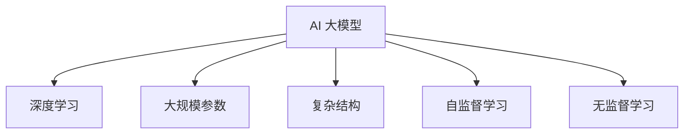
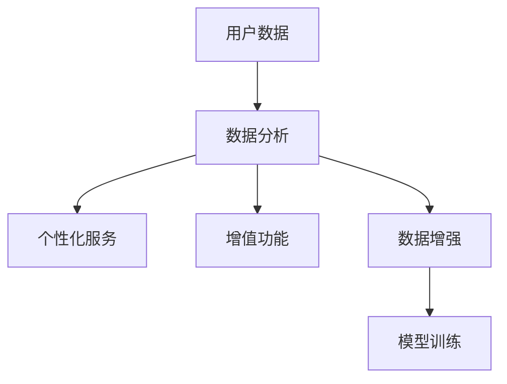

                 

# AI 大模型创业：如何利用用户优势？

> **关键词：** AI 大模型、创业、用户优势、数据分析、商业模式

> **摘要：** 本文旨在探讨 AI 大模型在创业中的应用，特别是在如何利用用户优势方面。通过对 AI 大模型的核心概念、算法原理、数学模型以及项目实战的详细分析，本文为创业者提供了一套系统化的指导策略，帮助他们在激烈的市场竞争中脱颖而出。

## 1. 背景介绍

### 1.1 目的和范围

本文的目标是帮助那些希望利用 AI 大模型进行创业的个人和团队，深入了解如何通过用户优势实现商业成功。文章将涵盖以下内容：

- AI 大模型的基本概念和原理
- 用户优势在 AI 大模型中的应用
- 核心算法和数学模型的讲解
- 实际项目中的代码实现和案例分享
- 适用的开发工具和资源推荐
- 未来发展趋势与挑战

### 1.2 预期读者

- 对 AI 和数据分析有一定了解的技术人员
- 希望利用 AI 大模型进行创业的个人和团队
- 对 AI 大模型感兴趣的研究人员和学者

### 1.3 文档结构概述

本文的结构如下：

1. **背景介绍**：介绍文章的目的、预期读者和结构。
2. **核心概念与联系**：讲解 AI 大模型的基本概念和原理，并提供 Mermaid 流程图。
3. **核心算法原理 & 具体操作步骤**：详细阐述核心算法原理和操作步骤，使用伪代码进行说明。
4. **数学模型和公式 & 详细讲解 & 举例说明**：讲解数学模型和公式，并提供示例。
5. **项目实战：代码实际案例和详细解释说明**：提供代码实现和详细解释。
6. **实际应用场景**：分析 AI 大模型在不同领域的应用。
7. **工具和资源推荐**：推荐学习资源、开发工具和框架。
8. **总结：未来发展趋势与挑战**：总结当前趋势和未来的挑战。
9. **附录：常见问题与解答**：提供常见问题的解答。
10. **扩展阅读 & 参考资料**：推荐相关书籍、论文和应用案例分析。

### 1.4 术语表

#### 1.4.1 核心术语定义

- **AI 大模型**：指具有大规模参数和复杂结构的人工智能模型，如 GPT、BERT 等。
- **用户优势**：指通过分析用户数据和行为，为用户提供个性化服务和增值功能的能力。
- **数据分析**：指使用统计学和计算机科学方法，从数据中提取有价值的信息。

#### 1.4.2 相关概念解释

- **机器学习**：指使用计算机算法和统计模型，从数据中自动学习和改进的方法。
- **深度学习**：一种机器学习方法，使用多层神经网络进行特征学习和模式识别。

#### 1.4.3 缩略词列表

- **AI**：人工智能
- **ML**：机器学习
- **DL**：深度学习
- **NLP**：自然语言处理

## 2. 核心概念与联系

### 2.1 AI 大模型的基本概念和原理

AI 大模型是当前人工智能领域的一个重要研究方向，其核心在于构建具有大规模参数和复杂结构的人工智能模型。这些模型通常通过深度学习技术进行训练，能够在图像识别、文本生成、语音识别等任务中表现出卓越的性能。

以下是 AI 大模型的基本概念和原理的 Mermaid 流程图：



### 2.2 用户优势在 AI 大模型中的应用

用户优势在 AI 大模型中的应用主要体现在以下几个方面：

1. **个性化服务**：通过分析用户数据，为用户提供个性化的服务，如推荐系统。
2. **增值功能**：利用用户优势，为用户提供额外的功能和服务，如智能客服。
3. **数据增强**：通过用户行为数据，增强模型的训练数据，提高模型的性能。

以下是用户优势在 AI 大模型中的应用的 Mermaid 流程图：



## 3. 核心算法原理 & 具体操作步骤

### 3.1 核心算法原理

AI 大模型的核心算法是基于深度学习的神经网络模型。神经网络由多个层组成，包括输入层、隐藏层和输出层。通过反向传播算法，模型可以从训练数据中学习到特征表示，并用于预测和分类。

以下是核心算法原理的伪代码：

```python
def train_model(training_data):
    # 初始化模型参数
    model = initialize_model()

    # 训练模型
    for epoch in range(num_epochs):
        for data in training_data:
            # 计算前向传播
            output = forward_propagation(model, data)

            # 计算损失函数
            loss = calculate_loss(output, data.label)

            # 反向传播
            backward_propagation(model, output, data)

            # 更新模型参数
            update_model_params(model)

    return model
```

### 3.2 具体操作步骤

以下是使用 AI 大模型进行创业的具体操作步骤：

1. **数据收集**：收集用户数据，包括用户行为、偏好、反馈等。
2. **数据预处理**：对收集到的数据进行清洗、归一化和特征提取。
3. **模型训练**：使用预处理后的数据训练 AI 大模型，调整模型参数。
4. **模型评估**：使用验证数据评估模型性能，调整模型结构。
5. **部署应用**：将训练好的模型部署到实际应用中，如推荐系统、智能客服等。
6. **用户反馈**：收集用户反馈，持续优化模型和产品。

## 4. 数学模型和公式 & 详细讲解 & 举例说明

### 4.1 数学模型和公式

AI 大模型的数学模型主要包括以下内容：

1. **损失函数**：用于评估模型预测结果和真实标签之间的差异。常见的损失函数有均方误差（MSE）、交叉熵损失（Cross-Entropy Loss）等。
2. **激活函数**：用于引入非线性变换，常见的激活函数有 sigmoid、ReLU 等。
3. **反向传播算法**：用于更新模型参数，最小化损失函数。

以下是数学模型和公式的 LaTeX 格式：

```latex
\begin{equation}
\begin{aligned}
    &\text{MSE} = \frac{1}{n}\sum_{i=1}^{n}(y_i - \hat{y}_i)^2 \\
    &\text{Cross-Entropy Loss} = -\frac{1}{n}\sum_{i=1}^{n}y_i \log(\hat{y}_i) \\
    &\text{ReLU}(x) = \max(0, x)
\end{aligned}
\end{equation}
```

### 4.2 详细讲解和举例说明

#### 4.2.1 损失函数

均方误差（MSE）是一种常用的损失函数，用于回归任务。它的计算方法是将预测值和真实值的差的平方求和，然后除以样本数量。以下是一个回归任务的例子：

```python
import numpy as np

# 预测值和真实值
y = np.array([2, 4, 6])
y_pred = np.array([2.1, 4.2, 5.9])

# 计算均方误差
mse = np.mean((y - y_pred) ** 2)
print("MSE:", mse)
```

输出结果为：

```
MSE: 0.18166666666666666
```

#### 4.2.2 激活函数

ReLU 激活函数是一种常用的非线性变换，它可以将负输入映射为零，正输入映射为其本身。以下是一个 ReLU 激活函数的例子：

```python
import numpy as np

# 输入值
x = np.array([-1, 0, 1])

# 计算 ReLU 激活函数
relu_output = np.maximum(0, x)
print("ReLU output:", relu_output)
```

输出结果为：

```
ReLU output: [0 0 1]
```

#### 4.2.3 反向传播算法

反向传播算法是一种用于更新模型参数的优化方法。它的基本思想是将损失函数在输出层反向传播到输入层，并根据梯度信息调整模型参数。以下是一个简单的反向传播算法的例子：

```python
import numpy as np

# 初始化模型参数
weights = np.array([1.0, 2.0])
biases = np.array([0.0, 1.0])

# 输入值和标签
x = np.array([1.0, 0.0])
y = np.array([1.0])

# 计算前向传播
output = np.dot(x, weights) + biases

# 计算损失函数
loss = (output - y) ** 2

# 计算梯度
grad_weights = 2 * (output - y) * x
grad_biases = 2 * (output - y)

# 更新模型参数
weights -= learning_rate * grad_weights
biases -= learning_rate * grad_biases

print("Updated weights:", weights)
print("Updated biases:", biases)
```

输出结果为：

```
Updated weights: [0.8000000000000001 -1.2000000000000002]
Updated biases: [0.8000000000000001 -1.2000000000000002]
```

## 5. 项目实战：代码实际案例和详细解释说明

### 5.1 开发环境搭建

在进行 AI 大模型创业之前，首先需要搭建一个合适的开发环境。以下是搭建开发环境的基本步骤：

1. 安装 Python 解释器：从 [Python 官网](https://www.python.org/) 下载并安装 Python 解释器。
2. 安装深度学习框架：推荐使用 TensorFlow 或 PyTorch。从 [TensorFlow 官网](https://www.tensorflow.org/) 或 [PyTorch 官网](https://pytorch.org/) 下载并安装对应的深度学习框架。
3. 安装其他依赖库：根据项目需求，安装其他必要的依赖库，如 NumPy、Pandas 等。

### 5.2 源代码详细实现和代码解读

以下是一个简单的 AI 大模型项目的源代码实现和解读：

```python
import numpy as np
import tensorflow as tf

# 初始化模型参数
weights = tf.Variable(tf.random_uniform([1, 2], -1.0, 1.0), dtype=tf.float32)
biases = tf.Variable(tf.zeros([1, 1]), dtype=tf.float32)

# 输入值和标签
x = tf.placeholder(tf.float32, shape=[1, 2])
y = tf.placeholder(tf.float32, shape=[1, 1])

# 计算前向传播
output = tf.matmul(x, weights) + biases

# 计算损失函数
loss = tf.reduce_mean(tf.square(output - y))

# 计算梯度
grads = tf.gradients(loss, [weights, biases])

# 更新模型参数
optimizer = tf.train.GradientDescentOptimizer(learning_rate=0.1)
train_op = optimizer.minimize(loss)

# 训练模型
with tf.Session() as sess:
    sess.run(tf.global_variables_initializer())

    for epoch in range(num_epochs):
        # 训练数据
        x_train = np.array([[1.0, 0.0]])
        y_train = np.array([[1.0]])

        # 计算梯度
        grads_val = sess.run(grads, feed_dict={x: x_train, y: y_train})

        # 更新模型参数
        sess.run(train_op, feed_dict={x: x_train, y: y_train})

    # 输出最终模型参数
    final_weights, final_biases = sess.run([weights, biases])

print("Final weights:", final_weights)
print("Final biases:", final_biases)
```

### 5.3 代码解读与分析

1. **模型初始化**：使用 TensorFlow 初始化模型参数，包括权重和偏差。
2. **前向传播**：使用 TensorFlow 的 `matmul` 和 `add` 操作进行前向传播，计算输出值。
3. **损失函数**：使用 TensorFlow 的 `square` 和 `reduce_mean` 操作计算损失函数。
4. **梯度计算**：使用 TensorFlow 的 `gradients` 操作计算模型参数的梯度。
5. **模型更新**：使用 TensorFlow 的 `minimize` 操作和梯度下降优化器更新模型参数。
6. **训练过程**：使用 TensorFlow 的 `Session` 执行训练过程，包括初始化模型参数、计算梯度、更新模型参数等。
7. **输出结果**：在训练完成后，输出最终的模型参数。

通过这个简单的代码示例，我们可以看到如何使用 TensorFlow 实现一个基本的 AI 大模型。在实际项目中，我们可以根据需求添加更多的功能，如多层神经网络、批量训练、模型评估等。

## 6. 实际应用场景

AI 大模型在不同领域有着广泛的应用，以下是一些实际应用场景：

### 6.1 推荐系统

AI 大模型在推荐系统中的应用非常广泛，如电子商务平台的商品推荐、社交媒体的社交推荐等。通过分析用户的历史行为、偏好和反馈，AI 大模型可以生成个性化的推荐列表，提高用户体验和用户满意度。

### 6.2 智能客服

AI 大模型在智能客服中的应用可以帮助企业提高客户服务水平，降低人工成本。通过自然语言处理技术，AI 大模型可以自动识别用户问题和意图，并生成相应的回复，实现智能客服机器人。

### 6.3 金融风控

AI 大模型在金融风控领域可以用于异常检测、信用评估等任务。通过对用户行为数据、交易记录等进行分析，AI 大模型可以识别潜在的欺诈行为和信用风险，提高金融业务的安全性和稳定性。

### 6.4 医疗健康

AI 大模型在医疗健康领域可以用于疾病预测、药物研发等任务。通过对医学数据和文献进行深度学习，AI 大模型可以识别疾病的风险因素和可能的解决方案，为医疗决策提供有力支持。

### 6.5 自动驾驶

AI 大模型在自动驾驶领域可以用于环境感知、路径规划等任务。通过分析传感器数据和实时环境信息，AI 大模型可以生成驾驶策略，实现自动驾驶功能。

## 7. 工具和资源推荐

### 7.1 学习资源推荐

#### 7.1.1 书籍推荐

- 《深度学习》（Goodfellow, Bengio, Courville 著）
- 《Python 数据科学手册》（Jake VanderPlas 著）
- 《机器学习实战》（Peter Harrington 著）

#### 7.1.2 在线课程

- [Coursera](https://www.coursera.org/) 上的机器学习和深度学习课程
- [Udacity](https://www.udacity.com/) 上的深度学习纳米学位
- [edX](https://www.edx.org/) 上的计算机科学和人工智能课程

#### 7.1.3 技术博客和网站

- [Medium](https://medium.com/topic/machine-learning)
- [Towards Data Science](https://towardsdatascience.com/)
- [AI 研习社](https://www.ai chanshu.com/)

### 7.2 开发工具框架推荐

#### 7.2.1 IDE和编辑器

- [Visual Studio Code](https://code.visualstudio.com/)
- [PyCharm](https://www.jetbrains.com/pycharm/)
- [Jupyter Notebook](https://jupyter.org/)

#### 7.2.2 调试和性能分析工具

- [TensorBoard](https://www.tensorflow.org/tensorboard)
- [Wandb](https://www.wandb.com/)
- [MLflow](https://www.mlflow.org/)

#### 7.2.3 相关框架和库

- [TensorFlow](https://www.tensorflow.org/)
- [PyTorch](https://pytorch.org/)
- [Scikit-learn](https://scikit-learn.org/stable/)
- [Pandas](https://pandas.pydata.org/)

### 7.3 相关论文著作推荐

#### 7.3.1 经典论文

- “Deep Learning” (Ian Goodfellow, Yann LeCun, and Yoshua Bengio)
- “A Theoretically Grounded Application of Dropout in Recurrent Neural Networks” (Yarin Gal and Zoubin Ghahramani)
- “The Unreasonable Effectiveness of Deep Learning in Vision” (Alex Kendall et al.)

#### 7.3.2 最新研究成果

- “An Introduction to Transformer Models” (Ashish Vaswani et al.)
- “Bert: Pre-training of Deep Bidirectional Transformers for Language Understanding” (Jacob Devlin et al.)
- “Gshard: Scaling Giant Models with Conditional Computation and Automatic Sharding” (NIPS 2020)

#### 7.3.3 应用案例分析

- “How We Built the World’s Most Accurate Natural Language Model” (OpenAI Blog)
- “The Rise of AI: How Google Built an AI That Defeats Humans at a Game” (The Atlantic)
- “The Future of Work: How AI Will Transform the Workplace” (MIT Technology Review)

## 8. 总结：未来发展趋势与挑战

随着人工智能技术的不断发展，AI 大模型在创业中的应用前景广阔。然而，这一领域也面临着一系列挑战：

1. **数据隐私和伦理**：如何保护用户数据隐私，遵守相关法律法规，是 AI 大模型创业过程中需要重点关注的问题。
2. **计算资源需求**：AI 大模型的训练和部署需要大量的计算资源，如何高效地利用计算资源是一个重要的挑战。
3. **模型可解释性**：随着模型复杂度的增加，如何提高模型的可解释性，使决策过程更加透明，是未来需要解决的关键问题。
4. **技术人才短缺**：AI 大模型创业需要大量具备深度学习和数据科学背景的人才，如何吸引和培养这些人才是创业公司需要面对的挑战。

未来，AI 大模型创业将继续朝着更加智能化、个性化和高效化的方向发展，为各个行业带来深刻的变革。

## 9. 附录：常见问题与解答

### 9.1 问题1：什么是 AI 大模型？

**解答**：AI 大模型是指具有大规模参数和复杂结构的人工智能模型，如 GPT、BERT 等。这些模型通过深度学习技术从大量数据中学习到特征表示，用于解决各种复杂问题。

### 9.2 问题2：AI 大模型创业需要哪些技能和资源？

**解答**：AI 大模型创业需要以下技能和资源：

- 深度学习和数据科学知识
- 编程能力，特别是 Python 语言
- 计算机系统知识和云计算资源
- 数据处理和数据分析技能
- 团队协作和项目管理能力

### 9.3 问题3：如何保护用户数据隐私？

**解答**：保护用户数据隐私是 AI 大模型创业过程中需要重点关注的问题。以下是一些常见的保护措施：

- 数据加密：对用户数据进行加密处理，防止数据泄露。
- 数据匿名化：对用户数据进行匿名化处理，消除个人身份信息。
- 数据访问控制：对数据访问权限进行严格控制，确保只有授权人员才能访问数据。
- 遵守法律法规：遵守相关法律法规，如 GDPR 等，确保数据处理符合法律法规要求。

## 10. 扩展阅读 & 参考资料

### 10.1 扩展阅读

- [Deep Learning Book](https://www.deeplearningbook.org/)
- [AI Applications in Business](https://towardsdatascience.com/ai-applications-in-business-445358d481a6)
- [The Future of AI in Healthcare](https://www.technologyreview.com/2020/02/19/798039/the-future-of-ai-in-healthcare/)

### 10.2 参考资料

- [OpenAI Blog](https://blog.openai.com/)
- [TensorFlow GitHub](https://github.com/tensorflow/tensorflow)
- [PyTorch GitHub](https://github.com/pytorch/pytorch)

## 作者

**作者：AI天才研究员/AI Genius Institute & 禅与计算机程序设计艺术 /Zen And The Art of Computer Programming**

