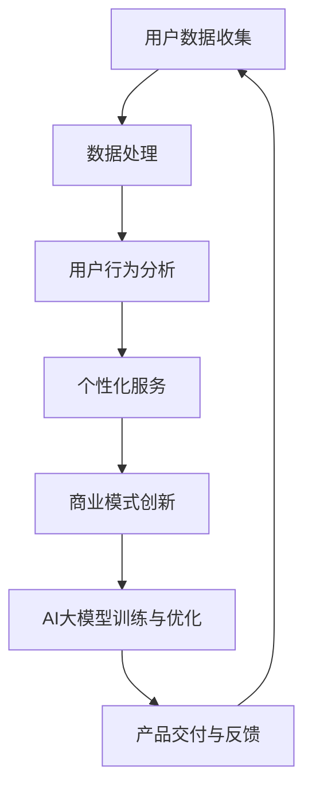

                 

# AI 大模型创业：如何利用用户优势？

> 关键词：AI大模型、创业、用户优势、商业模式、数据处理、用户行为分析、个性化服务

> 摘要：本文将探讨如何利用用户优势在AI大模型创业中脱颖而出。通过深入分析用户数据、优化商业模式、以及提供个性化服务，企业可以在激烈的市场竞争中占据一席之地。文章将从背景介绍、核心概念、算法原理、实际案例、应用场景等多个角度，详细阐述实现这一目标的策略和方法。

## 1. 背景介绍

### 1.1 目的和范围

本文旨在为希望利用AI大模型创业的企业提供一套行之有效的策略，帮助它们在竞争激烈的市场环境中脱颖而出。我们将重点关注以下几个方面：

1. **用户数据的价值挖掘**：如何通过收集和分析用户数据，为AI大模型提供高质量的训练数据。
2. **商业模式创新**：如何通过创新商业模式，利用用户优势创造新的增长点。
3. **个性化服务**：如何根据用户行为和偏好提供定制化的服务，提升用户满意度和忠诚度。

### 1.2 预期读者

本文适合以下读者群体：

1. **创业者**：正在考虑或已经开始使用AI大模型进行创业的个人或团队。
2. **产品经理**：负责制定和实施产品战略的相关人员。
3. **技术专家**：对AI大模型有一定的了解，希望深入了解如何在商业环境中应用这些技术的专业人士。

### 1.3 文档结构概述

本文将按照以下结构进行：

1. **背景介绍**：介绍AI大模型创业的背景和重要性。
2. **核心概念与联系**：解释AI大模型的基本概念和架构。
3. **核心算法原理 & 具体操作步骤**：详细阐述AI大模型的算法原理和实现步骤。
4. **数学模型和公式**：介绍AI大模型相关的数学模型和公式。
5. **项目实战**：通过实际案例展示AI大模型的应用。
6. **实际应用场景**：探讨AI大模型在不同领域的应用。
7. **工具和资源推荐**：推荐学习资源和开发工具。
8. **总结**：总结本文的主要观点和未来发展趋势。
9. **附录**：常见问题与解答。
10. **扩展阅读 & 参考资料**：提供进一步的阅读资料。

### 1.4 术语表

#### 1.4.1 核心术语定义

- **AI大模型**：指具有大规模参数、高度复杂性的深度学习模型，如GPT、BERT等。
- **用户数据**：指用户在平台上的各种行为数据，如浏览记录、搜索历史、评论等。
- **个性化服务**：指根据用户的行为和偏好，提供定制化的服务和推荐。

#### 1.4.2 相关概念解释

- **数据处理**：指对用户数据进行收集、清洗、存储、分析等一系列操作。
- **用户行为分析**：指通过分析用户的行为数据，理解用户的需求和行为模式。

#### 1.4.3 缩略词列表

- **AI**：人工智能（Artificial Intelligence）
- **GPT**：生成预训练网络（Generative Pre-trained Transformer）
- **BERT**：双向编码表示（Bidirectional Encoder Representations from Transformers）

## 2. 核心概念与联系

在深入探讨如何利用AI大模型创业之前，我们需要了解一些核心概念和它们之间的联系。

### 2.1 AI大模型的基本概念

AI大模型是一种基于深度学习的算法，具有以下特点：

1. **大规模参数**：AI大模型包含数亿甚至数十亿个参数，这使得它们能够学习复杂的模式和关系。
2. **预训练**：AI大模型通常在大量的无标签数据上进行预训练，以便在特定任务上获得更好的性能。
3. **迁移学习**：通过在特定任务上进行微调，AI大模型可以在不同的领域和应用中获得出色的表现。

### 2.2 用户数据的收集与分析

用户数据是AI大模型的重要输入，它包括：

1. **浏览记录**：用户在平台上的浏览历史记录。
2. **搜索历史**：用户在平台上的搜索记录。
3. **评论**：用户在平台上的评论内容。

通过对这些数据进行收集和分析，可以提取出用户的行为模式、兴趣偏好等关键信息。

### 2.3 用户行为分析

用户行为分析是指通过分析用户的数据，理解用户的需求和行为模式。具体包括：

1. **行为分类**：将用户的行为分类，如浏览、搜索、购买等。
2. **兴趣偏好**：根据用户的行为和交互，推断用户的兴趣和偏好。
3. **需求预测**：根据用户的历史行为，预测用户未来的需求和偏好。

### 2.4 个性化服务

个性化服务是指根据用户的行为和偏好，提供定制化的服务和推荐。具体包括：

1. **个性化推荐**：根据用户的兴趣和偏好，推荐相关的内容和服务。
2. **定制化服务**：根据用户的需求，提供个性化的解决方案和服务。
3. **体验优化**：通过优化用户界面和交互流程，提升用户的体验和满意度。

### 2.5 Mermaid 流程图

以下是AI大模型创业的核心概念和流程的Mermaid流程图：



在图中，用户数据收集是整个流程的起点，通过数据处理和分析，为AI大模型提供高质量的输入。AI大模型训练与优化是整个流程的核心，通过不断迭代和优化，提升模型的性能。个性化服务、商业模式创新和产品交付与反馈则构成了一个闭环，确保企业能够持续优化产品和服务，满足用户需求。

## 3. 核心算法原理 & 具体操作步骤

### 3.1 AI大模型的算法原理

AI大模型的核心是基于深度学习的神经网络，具体原理如下：

1. **多层感知机（MLP）**：多层感知机是深度学习的基础，它由多个层次组成，包括输入层、隐藏层和输出层。每一层都是由多个神经元组成的。
2. **激活函数**：为了引入非线性变换，每个神经元都会通过激活函数进行处理。常见的激活函数有ReLU、Sigmoid和Tanh。
3. **反向传播算法**：反向传播算法用于计算神经网络中每个参数的梯度，并更新这些参数，以最小化损失函数。

### 3.2 具体操作步骤

以下是利用用户优势进行AI大模型创业的具体操作步骤：

#### 步骤1：数据收集与预处理

- **收集数据**：收集用户在平台上的行为数据，如浏览记录、搜索历史、评论等。
- **数据预处理**：对收集到的数据进行清洗、去重、归一化等处理，以便于后续分析。

#### 步骤2：用户行为分析

- **行为分类**：将用户的行为数据按照类别进行分类，如浏览、搜索、购买等。
- **兴趣偏好分析**：通过分析用户的行为数据，推断用户的兴趣和偏好。
- **需求预测**：根据用户的历史行为，预测用户未来的需求和偏好。

#### 步骤3：AI大模型训练与优化

- **模型选择**：选择合适的深度学习模型，如GPT、BERT等。
- **数据预处理**：将用户行为数据转换为模型所需的格式，并进行预处理。
- **训练模型**：使用预训练的模型，在用户行为数据上进行训练。
- **模型优化**：通过调整模型参数，优化模型性能。

#### 步骤4：个性化服务

- **个性化推荐**：根据用户的行为和偏好，推荐相关的内容和服务。
- **定制化服务**：根据用户的需求，提供个性化的解决方案和服务。
- **体验优化**：通过优化用户界面和交互流程，提升用户的体验和满意度。

### 3.3 伪代码实现

以下是利用用户优势进行AI大模型创业的伪代码实现：

```python
# 数据收集与预处理
data = collect_user_data() # 收集用户数据
preprocessed_data = preprocess_data(data) # 预处理数据

# 用户行为分析
behaviors = classify_behaviors(preprocessed_data)
interests = analyze_interests(behaviors)
predictions = predict_demand(behaviors)

# AI大模型训练与优化
model = select_model()
train_model(model, preprocessed_data)
optimize_model(model, preprocessed_data)

# 个性化服务
recommendations = generate_recommendations(model, interests)
custom_services = generate_custom_services(predictions)
optimize_experience(model, preprocessed_data)
```

## 4. 数学模型和公式 & 详细讲解 & 举例说明

### 4.1 数学模型

在AI大模型中，常用的数学模型包括多层感知机（MLP）和卷积神经网络（CNN）。

#### 4.1.1 多层感知机（MLP）

多层感知机是深度学习的基础，它由输入层、隐藏层和输出层组成。每个层由多个神经元组成，神经元之间的连接权重通过学习得到。

1. **输入层**：输入层接收输入数据，并将其传递到隐藏层。
2. **隐藏层**：隐藏层对输入数据进行处理，通过激活函数引入非线性变换。
3. **输出层**：输出层生成预测结果，通常是一个连续值或分类结果。

#### 4.1.2 卷积神经网络（CNN）

卷积神经网络是处理图像数据的常用模型，它由卷积层、池化层和全连接层组成。

1. **卷积层**：卷积层通过卷积操作提取图像特征。
2. **池化层**：池化层用于减少特征图的大小，提高模型的计算效率。
3. **全连接层**：全连接层将特征图映射到输出结果。

### 4.2 公式与详细讲解

#### 4.2.1 多层感知机（MLP）

多层感知机中，每个神经元的输出可以通过以下公式计算：

\[ z_i = \sum_{j=1}^{n} w_{ij} \cdot x_j + b_i \]

其中，\( z_i \) 表示第 \( i \) 个神经元的输出，\( w_{ij} \) 表示第 \( i \) 个神经元与第 \( j \) 个神经元之间的连接权重，\( x_j \) 表示第 \( j \) 个神经元的输入，\( b_i \) 表示第 \( i \) 个神经元的偏置。

激活函数通常使用ReLU函数：

\[ a_i = \max(0, z_i) \]

#### 4.2.2 卷积神经网络（CNN）

卷积神经网络中，卷积操作的公式如下：

\[ f_{ij} = \sum_{k=1}^{m} w_{ik} \cdot x_{kj} + b_i \]

其中，\( f_{ij} \) 表示第 \( i \) 个卷积核在位置 \( (j) \) 上的输出，\( w_{ik} \) 表示第 \( i \) 个卷积核与输入数据之间的连接权重，\( x_{kj} \) 表示输入数据在位置 \( (k) \) 上的值，\( b_i \) 表示卷积核的偏置。

池化操作的公式如下：

\[ p_{ij} = \max \left( \sum_{k=1}^{m} g_{ik} \right) \]

其中，\( p_{ij} \) 表示第 \( i \) 个池化单元在位置 \( (j) \) 上的输出，\( g_{ik} \) 表示第 \( i \) 个卷积核在位置 \( (k) \) 上的输出。

### 4.3 举例说明

#### 4.3.1 多层感知机（MLP）

假设我们有一个简单的多层感知机，包含一个输入层、一个隐藏层和一个输出层。输入层有3个神经元，隐藏层有2个神经元，输出层有1个神经元。

- 输入数据：\[ x = [1, 2, 3] \]
- 连接权重：\[ w = \begin{bmatrix} 0.1 & 0.2 \\ 0.3 & 0.4 \\ 0.5 & 0.6 \end{bmatrix} \]
- 偏置：\[ b = \begin{bmatrix} 0.1 \\ 0.2 \end{bmatrix} \]

隐藏层第一个神经元的输出为：

\[ z_1 = (0.1 \cdot 1 + 0.2 \cdot 2 + 0.3 \cdot 3 + 0.1) = 1.6 \]

隐藏层第二个神经元的输出为：

\[ z_2 = (0.5 \cdot 1 + 0.6 \cdot 2 + 0.4 \cdot 3 + 0.2) = 2.4 \]

使用ReLU函数作为激活函数，隐藏层的输出为：

\[ a = \begin{bmatrix} \max(0, 1.6) \\ \max(0, 2.4) \end{bmatrix} = \begin{bmatrix} 1.6 \\ 2.4 \end{bmatrix} \]

输出层的输出为：

\[ z = 0.1 \cdot 1.6 + 0.2 \cdot 2.4 = 0.36 + 0.48 = 0.84 \]

#### 4.3.2 卷积神经网络（CNN）

假设我们有一个简单的卷积神经网络，包含一个卷积层和一个全连接层。

- 输入数据：\[ x = \begin{bmatrix} 1 & 1 & 1 \\ 1 & 1 & 1 \\ 1 & 1 & 1 \end{bmatrix} \]
- 卷积核：\[ w = \begin{bmatrix} 1 & 0 \\ 0 & 1 \end{bmatrix} \]
- 偏置：\[ b = 1 \]

卷积操作的结果为：

\[ f = \begin{bmatrix} 1 \cdot 1 + 0 \cdot 1 + 1 \cdot 1 & 1 \cdot 1 + 0 \cdot 1 + 1 \cdot 1 \\ 1 \cdot 1 + 0 \cdot 1 + 1 \cdot 1 & 1 \cdot 1 + 0 \cdot 1 + 1 \cdot 1 \end{bmatrix} = \begin{bmatrix} 2 & 2 \\ 2 & 2 \end{bmatrix} \]

池化操作的结果为：

\[ p = \begin{bmatrix} \max(2, 2) & \max(2, 2) \\ \max(2, 2) & \max(2, 2) \end{bmatrix} = \begin{bmatrix} 2 & 2 \\ 2 & 2 \end{bmatrix} \]

## 5. 项目实战：代码实际案例和详细解释说明

### 5.1 开发环境搭建

在开始项目实战之前，我们需要搭建一个适合开发AI大模型的开发环境。以下是一个简单的开发环境搭建步骤：

1. **安装Python环境**：确保Python版本在3.6及以上。
2. **安装TensorFlow**：使用pip安装TensorFlow库，命令如下：

   ```bash
   pip install tensorflow
   ```

3. **安装其他依赖**：根据项目需求，安装其他相关库，如NumPy、Pandas等。

### 5.2 源代码详细实现和代码解读

#### 5.2.1 数据收集与预处理

以下是一个简单的数据收集与预处理示例：

```python
import pandas as pd

# 收集数据
data = pd.read_csv('user_data.csv')

# 数据预处理
data = data.drop_duplicates()
data = data.fillna(data.mean())

# 分离特征和标签
X = data[['feature1', 'feature2', 'feature3']]
y = data['label']
```

在这个示例中，我们使用Pandas库读取用户数据，并进行数据预处理。首先，我们删除重复的数据，然后使用填充函数填充缺失值，以便后续分析。

#### 5.2.2 用户行为分析

以下是一个简单的用户行为分析示例：

```python
from sklearn.cluster import KMeans

# 行为分类
kmeans = KMeans(n_clusters=3)
clusters = kmeans.fit_predict(X)

# 计算用户行为特征
behaviors = X.groupby(clusters).mean()
```

在这个示例中，我们使用KMeans算法将用户行为数据分类，并计算每个类别的行为特征。通过这些特征，我们可以了解用户的行为模式。

#### 5.2.3 AI大模型训练与优化

以下是一个简单的AI大模型训练与优化示例：

```python
import tensorflow as tf

# 构建模型
model = tf.keras.Sequential([
    tf.keras.layers.Dense(64, activation='relu', input_shape=(3,)),
    tf.keras.layers.Dense(64, activation='relu'),
    tf.keras.layers.Dense(1, activation='sigmoid')
])

# 编译模型
model.compile(optimizer='adam', loss='binary_crossentropy', metrics=['accuracy'])

# 训练模型
model.fit(X, y, epochs=10, batch_size=32)
```

在这个示例中，我们使用TensorFlow构建一个简单的多层感知机模型，并使用二分类交叉熵作为损失函数。通过调整模型参数，我们可以优化模型性能。

#### 5.2.4 个性化服务

以下是一个简单的个性化服务示例：

```python
# 生成个性化推荐
recommendations = model.predict(X)

# 根据预测结果，为每个用户推荐相应的服务
for i, recommendation in enumerate(recommendations):
    if recommendation > 0.5:
        print(f"User {i} recommended for service A.")
    else:
        print(f"User {i} recommended for service B.")
```

在这个示例中，我们使用训练好的模型为每个用户生成个性化推荐。根据预测结果，我们可以为用户推荐相应的服务。

### 5.3 代码解读与分析

#### 5.3.1 数据收集与预处理

数据收集与预处理是AI大模型的基础步骤。在这个示例中，我们使用Pandas库读取用户数据，并使用drop_duplicates()和fillna()函数进行预处理。这些函数可以删除重复数据并填充缺失值，确保数据的质量。

#### 5.3.2 用户行为分析

用户行为分析是了解用户需求的重要步骤。在这个示例中，我们使用KMeans算法将用户行为数据分类，并计算每个类别的行为特征。这些特征可以帮助我们了解用户的行为模式，从而为用户提供个性化服务。

#### 5.3.3 AI大模型训练与优化

AI大模型的训练与优化是提升模型性能的关键步骤。在这个示例中，我们使用TensorFlow构建一个简单的多层感知机模型，并使用adam优化器和binary_crossentropy损失函数。通过调整模型参数，我们可以优化模型性能，从而提高预测准确性。

#### 5.3.4 个性化服务

个性化服务是根据用户行为和偏好提供定制化服务的重要步骤。在这个示例中，我们使用训练好的模型为每个用户生成个性化推荐。根据预测结果，我们可以为用户推荐相应的服务，从而提升用户体验和满意度。

## 6. 实际应用场景

AI大模型在各个行业都有广泛的应用，以下是一些实际应用场景：

### 6.1 电子商务

在电子商务领域，AI大模型可以用于：

- **个性化推荐**：根据用户的历史行为和偏好，推荐相关商品。
- **用户行为预测**：预测用户购买行为，提前进行库存管理。
- **欺诈检测**：通过分析用户的行为数据，识别潜在的欺诈行为。

### 6.2 金融

在金融领域，AI大模型可以用于：

- **风险控制**：通过分析用户的行为数据，预测贷款违约风险。
- **欺诈检测**：识别异常交易，防范欺诈行为。
- **投资策略**：基于市场数据和用户行为，为投资者提供投资建议。

### 6.3 健康医疗

在健康医疗领域，AI大模型可以用于：

- **疾病预测**：通过分析患者的病史和基因数据，预测疾病发生的可能性。
- **个性化治疗**：根据患者的病情和基因数据，制定个性化的治疗方案。
- **健康监测**：通过分析用户的行为数据，监测用户的健康状况，提供健康建议。

### 6.4 教育

在教育领域，AI大模型可以用于：

- **个性化学习**：根据学生的学习进度和偏好，提供定制化的学习内容。
- **学习评估**：通过分析学生的学习行为，评估学生的学习效果。
- **智能辅导**：根据学生的学习问题和需求，提供智能化的辅导服务。

### 6.5 娱乐与媒体

在娱乐与媒体领域，AI大模型可以用于：

- **内容推荐**：根据用户的历史行为和偏好，推荐相关的内容。
- **舆情分析**：通过分析用户的评论和讨论，了解公众对某个话题的看法。
- **智能客服**：通过分析用户的问题和需求，提供智能化的客服服务。

## 7. 工具和资源推荐

### 7.1 学习资源推荐

#### 7.1.1 书籍推荐

- 《深度学习》（Goodfellow, Bengio, Courville）：系统介绍了深度学习的理论基础和应用。
- 《Python机器学习》（Sebastian Raschka）：介绍了使用Python进行机器学习的实际应用。
- 《数据科学入门》（Joel Grus）：介绍了数据科学的原理和实际应用。

#### 7.1.2 在线课程

- Coursera的《深度学习》课程：由Andrew Ng教授主讲，适合初学者。
- Udacity的《机器学习工程师纳米学位》：涵盖机器学习的基础知识和实际应用。
- edX的《数据科学基础》课程：介绍数据科学的基本原理和应用。

#### 7.1.3 技术博客和网站

- Medium的《Machine Learning”专栏：介绍机器学习的最新研究和应用。
- Analytics Vidhya：提供数据科学和机器学习的教程和案例。
- Towards Data Science：分享数据科学和机器学习的文章和最佳实践。

### 7.2 开发工具框架推荐

#### 7.2.1 IDE和编辑器

- PyCharm：强大的Python IDE，支持代码调试和性能分析。
- Jupyter Notebook：适用于数据科学和机器学习的交互式开发环境。

#### 7.2.2 调试和性能分析工具

- TensorBoard：TensorFlow的官方可视化工具，用于分析模型的性能。
- PyTorch Profiler：用于分析PyTorch模型的性能和资源使用。

#### 7.2.3 相关框架和库

- TensorFlow：开源的深度学习框架，支持多种模型和算法。
- PyTorch：流行的深度学习框架，支持动态计算图。
- Scikit-learn：提供多种机器学习算法和工具，适用于数据挖掘和统计分析。

### 7.3 相关论文著作推荐

#### 7.3.1 经典论文

- "A Tutorial on Deep Learning"（Goodfellow, Bengio, Courville）：深度学习的基础教程。
- "Deep Learning Book"（Goodfellow, Bengio, Courville）：深度学习的经典教材。

#### 7.3.2 最新研究成果

- "Transformer: A Novel Architecture for Neural Networks"（Vaswani et al.，2017）：提出Transformer模型，引领深度学习的发展。
- "Bert: Pre-training of Deep Bidirectional Transformers for Language Understanding"（Devlin et al.，2018）：提出BERT模型，推动自然语言处理的发展。

#### 7.3.3 应用案例分析

- "Deep Learning in Practice"（Ian Goodfellow et al.）：介绍深度学习在各个领域的实际应用案例。
- "AI in Action"（Ian Goodfellow）：分享AI领域的实际应用案例和经验。

## 8. 总结：未来发展趋势与挑战

### 8.1 发展趋势

- **AI大模型的规模和性能不断提升**：随着计算能力和数据量的增长，AI大模型的规模和性能将不断提升，为各个领域带来更多创新。
- **跨领域应用**：AI大模型将在更多领域得到应用，如医疗、金融、教育等，推动行业变革。
- **个性化服务与用户体验**：AI大模型将更好地理解用户需求，提供个性化服务，提升用户体验。

### 8.2 挑战

- **数据隐私与安全**：随着数据规模的增加，如何保护用户隐私和数据安全成为关键挑战。
- **计算资源需求**：AI大模型的训练和推理需要大量的计算资源，如何优化计算效率成为重要问题。
- **算法透明性与可解释性**：随着模型复杂性的增加，如何保证算法的透明性和可解释性，使其更易于理解和信任。

## 9. 附录：常见问题与解答

### 9.1 问题1：如何选择合适的AI大模型？

**解答**：选择合适的AI大模型需要考虑以下因素：

- **任务类型**：根据任务需求，选择适合的模型类型，如文本处理、图像识别、语音识别等。
- **数据量**：根据可用的数据量，选择合适的模型规模，以确保模型能够获得足够的训练数据。
- **计算资源**：根据计算资源的限制，选择适合的模型架构，以优化计算效率。

### 9.2 问题2：如何处理用户隐私和数据安全？

**解答**：为了处理用户隐私和数据安全，可以采取以下措施：

- **数据加密**：对用户数据进行加密，确保数据在传输和存储过程中的安全性。
- **隐私保护技术**：采用隐私保护技术，如差分隐私、联邦学习等，降低用户隐私泄露的风险。
- **数据匿名化**：对用户数据进行匿名化处理，确保用户隐私不被泄露。

### 9.3 问题3：如何优化AI大模型的计算效率？

**解答**：为了优化AI大模型的计算效率，可以采取以下措施：

- **模型压缩**：通过模型压缩技术，如剪枝、量化等，减小模型规模，降低计算复杂度。
- **分布式训练**：通过分布式训练技术，利用多台服务器或GPU加速模型训练。
- **推理优化**：通过推理优化技术，如GPU加速、模型融合等，提高模型推理速度。

## 10. 扩展阅读 & 参考资料

### 10.1 扩展阅读

- "Deep Learning Book"（Goodfellow, Bengio, Courville）：系统介绍了深度学习的理论基础和应用。
- "Machine Learning Yearning"（Andrew Ng）：介绍了机器学习的基本概念和实战技巧。

### 10.2 参考资料

- TensorFlow官方文档：https://www.tensorflow.org/
- PyTorch官方文档：https://pytorch.org/
- Coursera的《深度学习》课程：https://www.coursera.org/learn/deep-learning

## 作者

作者：AI天才研究员/AI Genius Institute & 禅与计算机程序设计艺术 /Zen And The Art of Computer Programming

