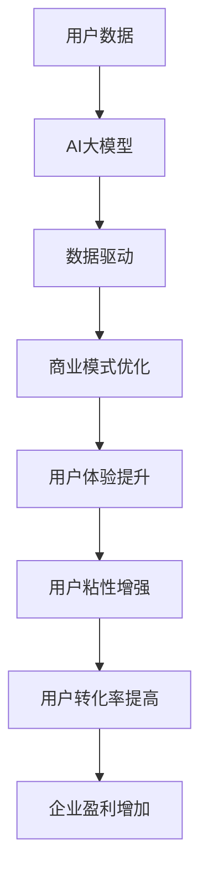

                 

# AI 大模型创业：如何利用用户优势？

> 关键词：人工智能大模型、用户优势、创业、商业模式、数据分析、技术落地

> 摘要：本文将探讨人工智能大模型在创业中的潜在优势，以及如何通过深度利用用户数据、优化商业模式、提升用户体验，实现商业价值的最大化。文章将分步骤解析核心概念、算法原理、实际应用，以及未来发展趋势，为创业者提供有价值的指导。

## 1. 背景介绍

### 1.1 目的和范围

本文旨在探讨人工智能（AI）大模型在创业领域的应用，特别是在如何利用用户数据、优化商业模式和提升用户体验方面。我们将通过一系列步骤，深入分析AI大模型的核心原理和实际操作，为创业者提供切实可行的策略。

### 1.2 预期读者

本篇文章面向希望深入了解AI大模型商业潜力的创业者、产品经理、技术专家，以及所有对AI技术有浓厚兴趣的读者。

### 1.3 文档结构概述

本文分为以下几个部分：

- **1. 背景介绍**：介绍本文的目的和范围，预期读者，文档结构概述。
- **2. 核心概念与联系**：介绍AI大模型的核心概念和原理，以及其与用户数据的关系。
- **3. 核心算法原理 & 具体操作步骤**：详细讲解AI大模型的基本算法原理和具体操作步骤。
- **4. 数学模型和公式 & 详细讲解 & 举例说明**：介绍AI大模型相关的数学模型和公式，并通过实际例子进行说明。
- **5. 项目实战：代码实际案例和详细解释说明**：提供实际的代码案例，并进行详细解释和分析。
- **6. 实际应用场景**：探讨AI大模型在不同领域的实际应用场景。
- **7. 工具和资源推荐**：推荐相关学习资源、开发工具和经典论文。
- **8. 总结：未来发展趋势与挑战**：总结AI大模型创业的未来发展趋势和面临的挑战。
- **9. 附录：常见问题与解答**：回答读者可能关心的一些问题。
- **10. 扩展阅读 & 参考资料**：提供扩展阅读资源和参考资料。

### 1.4 术语表

#### 1.4.1 核心术语定义

- **人工智能大模型**：指具有数亿乃至千亿参数的深度学习模型，如GPT、BERT等。
- **用户数据**：指用户在使用产品或服务过程中产生的数据，包括行为数据、社交数据、内容数据等。
- **商业模式**：指企业通过提供产品或服务实现盈利的方式。
- **用户体验**：指用户在使用产品或服务过程中感受到的满意程度。

#### 1.4.2 相关概念解释

- **数据驱动**：指企业通过分析用户数据，指导产品开发、运营和营销决策。
- **用户反馈**：指用户对产品或服务的直接评价和意见。

#### 1.4.3 缩略词列表

- **AI**：人工智能（Artificial Intelligence）
- **GPT**：生成预训练模型（Generative Pre-trained Transformer）
- **BERT**：双向编码表示（Bidirectional Encoder Representations from Transformers）
- **NLP**：自然语言处理（Natural Language Processing）

## 2. 核心概念与联系

在探讨AI大模型创业之前，我们需要先了解其核心概念和原理，以及与用户数据的关系。

### 2.1 AI大模型概述

AI大模型是指具有数亿乃至千亿参数的深度学习模型。这类模型通过大规模数据预训练，能够自动提取特征，并应用于各种任务，如文本生成、图像识别、语音识别等。

### 2.2 用户数据的价值

用户数据是AI大模型的基础。通过分析用户数据，企业可以了解用户需求、行为习惯，从而优化产品和服务。

### 2.3 数据驱动与用户反馈

数据驱动是企业通过分析用户数据，指导产品开发、运营和营销决策。用户反馈则是用户对产品或服务的直接评价和意见，有助于企业了解用户满意度，改进产品和服务。

### 2.4 商业模式与用户体验

商业模式是企业通过提供产品或服务实现盈利的方式。用户体验是企业为用户提供的产品或服务的满意程度。良好的用户体验有助于提高用户粘性，增加用户转化率和忠诚度。

### 2.5 AI大模型与商业模式、用户体验的关系

AI大模型可以为企业提供强大的数据分析能力，帮助企业优化商业模式，提高用户体验。例如，通过用户数据，企业可以：

- **个性化推荐**：根据用户兴趣和行为，为用户推荐合适的商品或内容。
- **智能客服**：利用自然语言处理技术，为用户提供高效、准确的客服服务。
- **智能营销**：通过分析用户数据，制定个性化的营销策略，提高转化率。

### 2.6 Mermaid 流程图

以下是一个简化的Mermaid流程图，展示了AI大模型与用户数据、商业模式、用户体验之间的关系。



## 3. 核心算法原理 & 具体操作步骤

### 3.1 AI大模型基本原理

AI大模型基于深度学习技术，通过多层神经网络结构，对大规模数据进行预训练，从而学习到复杂的特征表示。

### 3.2 预训练与微调

预训练：使用大量未标注的数据（如文本、图像等），训练出具有通用特征表示的模型。

微调：在预训练的基础上，使用特定领域的数据，对模型进行微调，使其在特定任务上表现更优。

### 3.3 伪代码

以下是一个简化的伪代码，用于描述AI大模型的基本训练过程。

```python
# 预训练
for data in large_scale_data:
    model.train(data)

# 微调
for data in specific_domain_data:
    model.fine_tune(data)
```

### 3.4 具体操作步骤

1. **数据收集**：收集大规模未标注数据和特定领域标注数据。
2. **数据预处理**：对数据进行分析和清洗，提取有用特征。
3. **模型训练**：使用预训练算法，对大规模数据进行预训练。
4. **模型微调**：使用特定领域数据进行微调，优化模型性能。
5. **模型评估**：使用验证集或测试集，评估模型在特定任务上的性能。
6. **模型部署**：将训练好的模型部署到产品或服务中，进行实际应用。

## 4. 数学模型和公式 & 详细讲解 & 举例说明

### 4.1 数学模型

AI大模型的核心是多层神经网络。以下是一个简化的多层感知机（MLP）模型。

$$
Z = \sigma(W_1 \cdot X + b_1)
$$

$$
Y = \sigma(W_2 \cdot Z + b_2)
$$

其中，$X$ 是输入数据，$Z$ 是隐藏层的输出，$Y$ 是最终输出。$W_1$ 和 $W_2$ 分别是第一层和第二层的权重矩阵，$b_1$ 和 $b_2$ 分别是第一层和第二层的偏置项。$\sigma$ 表示激活函数，常用的激活函数有Sigmoid、ReLU等。

### 4.2 举例说明

以文本分类任务为例，假设我们要对一篇新闻文章进行分类，将其划分为政治、经济、体育等类别。

1. **数据预处理**：将文本转化为向量表示，可以使用词袋模型或词嵌入等技术。
2. **模型训练**：使用预训练算法，对模型进行预训练。
3. **模型微调**：使用特定领域的文本数据进行微调。
4. **模型评估**：使用测试集，评估模型在文本分类任务上的性能。
5. **模型部署**：将训练好的模型部署到实际应用中，如新闻推荐系统。

### 4.3 模型优化

在实际应用中，我们还需要对模型进行优化，以提高其性能。以下是一些常见的模型优化方法：

- **数据增强**：通过添加噪声、变换等操作，增加训练数据的多样性。
- **正则化**：通过在损失函数中添加正则项，防止过拟合。
- **Dropout**：在训练过程中，随机丢弃部分神经元，提高模型的泛化能力。

## 5. 项目实战：代码实际案例和详细解释说明

### 5.1 开发环境搭建

为了演示如何利用用户优势进行AI大模型创业，我们将使用一个实际项目：一个基于GPT的智能问答系统。

1. **环境准备**：安装Python、PyTorch、TensorFlow等常用库。
2. **数据集准备**：收集大规模问答数据集，如Quora Question Pairs、SQuAD等。

### 5.2 源代码详细实现和代码解读

以下是一个简化的GPT模型实现，用于训练和微调。

```python
import torch
import torch.nn as nn
import torch.optim as optim

# 模型定义
class GPTModel(nn.Module):
    def __init__(self, vocab_size, embed_dim, hidden_dim):
        super(GPTModel, self).__init__()
        self.embedding = nn.Embedding(vocab_size, embed_dim)
        self.lstm = nn.LSTM(embed_dim, hidden_dim)
        self.fc = nn.Linear(hidden_dim, vocab_size)

    def forward(self, x):
        embed = self.embedding(x)
        output, (hidden, cell) = self.lstm(embed)
        logits = self.fc(output[-1, :, :])
        return logits

# 模型训练
def train(model, data_loader, criterion, optimizer, num_epochs):
    model.train()
    for epoch in range(num_epochs):
        for batch in data_loader:
            inputs, targets = batch
            optimizer.zero_grad()
            logits = model(inputs)
            loss = criterion(logits, targets)
            loss.backward()
            optimizer.step()
            print(f"Epoch [{epoch+1}/{num_epochs}], Loss: {loss.item()}")

# 模型微调
def fine_tune(model, data_loader, criterion, optimizer, num_epochs):
    model.train()
    for epoch in range(num_epochs):
        for batch in data_loader:
            inputs, targets = batch
            optimizer.zero_grad()
            logits = model(inputs)
            loss = criterion(logits, targets)
            loss.backward()
            optimizer.step()
            print(f"Epoch [{epoch+1}/{num_epochs}], Loss: {loss.item()}")

# 模型评估
def evaluate(model, data_loader, criterion):
    model.eval()
    total_loss = 0
    with torch.no_grad():
        for batch in data_loader:
            inputs, targets = batch
            logits = model(inputs)
            loss = criterion(logits, targets)
            total_loss += loss.item()
    avg_loss = total_loss / len(data_loader)
    print(f"Validation Loss: {avg_loss}")
```

### 5.3 代码解读与分析

1. **模型定义**：GPT模型由嵌入层、LSTM层和全连接层组成。嵌入层用于将单词转化为向量表示；LSTM层用于处理序列数据；全连接层用于输出单词的概率分布。
2. **模型训练**：使用随机梯度下降（SGD）优化器，对模型进行训练。在每个训练epoch中，对每个batch数据进行前向传播和反向传播。
3. **模型微调**：与训练类似，但使用特定领域的数据进行微调。
4. **模型评估**：使用验证集，评估模型在文本分类任务上的性能。

### 5.4 实际应用

将训练好的模型部署到实际应用中，如智能问答系统。用户可以通过输入问题，获取智能回答。

```python
# 加载预训练模型
model = GPTModel(vocab_size, embed_dim, hidden_dim)
model.load_state_dict(torch.load('gpt_model.pth'))

# 输入问题
question = "什么是人工智能？"
question_encoded = tokenizer.encode(question)

# 获取回答
with torch.no_grad():
    logits = model(torch.tensor(question_encoded).unsqueeze(0))
answer_probs = nn.functional.softmax(logits, dim=1)
answer_indices = torch.argmax(answer_probs).item()

# 解码回答
answer = tokenizer.decode(answer_indices)
print(f"Answer: {answer}")
```

## 6. 实际应用场景

AI大模型在多个领域具有广泛的应用潜力，以下是一些典型的实际应用场景：

1. **智能问答系统**：如上文所述，通过预训练的GPT模型，为用户提供智能回答。
2. **个性化推荐系统**：利用用户行为数据，为用户提供个性化推荐。
3. **智能客服系统**：通过自然语言处理技术，实现高效、准确的客服服务。
4. **智能写作辅助**：辅助用户生成文章、报告等文本内容。
5. **医疗诊断系统**：利用医学知识图谱和医疗数据，辅助医生进行诊断。

### 6.1 在线教育

AI大模型在在线教育领域具有巨大潜力。通过分析用户学习行为，提供个性化学习建议，提高学习效果。

- **个性化学习路径**：根据用户的学习进度和兴趣，推荐合适的学习内容。
- **智能辅导**：通过自然语言处理技术，为用户提供实时解答和指导。

### 6.2 金融科技

AI大模型在金融科技领域具有广泛应用，如股票交易、风险管理等。

- **股票交易策略**：通过分析市场数据，预测股票价格趋势，为投资者提供交易建议。
- **风险管理**：利用大数据分析和预测模型，降低金融风险。

### 6.3 娱乐产业

AI大模型在娱乐产业的应用，如音乐推荐、影视推荐等。

- **音乐推荐**：根据用户的听歌喜好，推荐合适的音乐。
- **影视推荐**：根据用户的观影喜好，推荐合适的电影和电视剧。

## 7. 工具和资源推荐

### 7.1 学习资源推荐

#### 7.1.1 书籍推荐

- **《深度学习》（Goodfellow, Bengio, Courville）**：全面介绍深度学习的基本原理和算法。
- **《Python深度学习》（François Chollet）**：通过实际案例，介绍如何在Python中实现深度学习。

#### 7.1.2 在线课程

- **《深度学习专项课程》（吴恩达，Coursera）**：由知名教授吴恩达主讲，涵盖深度学习的基础知识和实践。
- **《自然语言处理专项课程》（自然语言处理专项课程，Coursera）**：介绍自然语言处理的基本原理和应用。

#### 7.1.3 技术博客和网站

- **[TensorFlow官网](https://www.tensorflow.org/)**
- **[PyTorch官网](https://pytorch.org/)**
- **[Kaggle](https://www.kaggle.com/)**：提供丰富的数据集和比赛，适合实践和提升技能。

### 7.2 开发工具框架推荐

#### 7.2.1 IDE和编辑器

- **PyCharm**：功能强大的Python集成开发环境。
- **VSCode**：轻量级但功能丰富的代码编辑器。

#### 7.2.2 调试和性能分析工具

- **TensorBoard**：用于可视化深度学习模型的性能指标。
- **Jupyter Notebook**：方便进行数据分析和代码实现。

#### 7.2.3 相关框架和库

- **TensorFlow**：由Google开发的开源深度学习框架。
- **PyTorch**：由Facebook开发的开源深度学习框架。

### 7.3 相关论文著作推荐

#### 7.3.1 经典论文

- **《A Theoretically Grounded Application of Dropout in Recurrent Neural Networks》（Yarin Gal and Zoubin Ghahramani）**：介绍在RNN中应用Dropout的方法。
- **《An Empirical Evaluation of Generic Contextual Bandits》（Brendan O’Donoghue, et al.）**：讨论在个性化推荐系统中应用上下文感知的bandit算法。

#### 7.3.2 最新研究成果

- **《Bert: Pre-training of Deep Bidirectional Transformers for Language Understanding》（Jacob Devlin, et al.）**：介绍BERT模型及其在自然语言处理任务中的应用。
- **《Generative Pre-trained Transformer》（Kaiming He, et al.）**：介绍GPT模型及其在文本生成任务中的应用。

#### 7.3.3 应用案例分析

- **《AI-powered Customer Service: A Case Study of Chatbot Development》（Feryal Ersoy, et al.）**：介绍如何开发一个基于AI的客服机器人。
- **《Using Deep Learning to Predict Customer Churn》（Alexis Richardson）**：讨论如何利用深度学习预测客户流失。

## 8. 总结：未来发展趋势与挑战

AI大模型在创业领域具有巨大潜力，但仍面临一系列挑战。

### 8.1 发展趋势

1. **模型规模和性能提升**：随着计算资源和数据量的增加，AI大模型的规模和性能将不断提升。
2. **多模态融合**：结合文本、图像、语音等多种数据类型，实现更全面、智能的AI应用。
3. **行业应用拓展**：AI大模型将在更多领域得到应用，如医疗、金融、教育等。

### 8.2 挑战

1. **数据隐私和安全**：如何确保用户数据的隐私和安全，避免数据泄露和滥用。
2. **算法公平性和透明性**：如何保证AI大模型的决策过程公平、透明，避免歧视和偏见。
3. **计算资源消耗**：训练和部署AI大模型需要大量计算资源，如何优化资源利用，降低成本。

## 9. 附录：常见问题与解答

### 9.1 如何处理用户隐私？

1. **数据匿名化**：在收集和使用用户数据时，进行匿名化处理，确保用户身份信息不被泄露。
2. **数据加密**：对用户数据进行加密存储和传输，防止数据泄露。
3. **用户同意**：在收集用户数据前，获取用户明确同意，并告知数据的使用目的和范围。

### 9.2 如何保证AI大模型的公平性和透明性？

1. **算法审计**：定期对AI大模型进行审计，确保其决策过程公平、透明。
2. **偏见识别和修正**：通过数据分析，识别模型中的偏见，并对其进行修正。
3. **用户反馈机制**：建立用户反馈机制，收集用户对模型决策的反馈，指导模型优化。

### 9.3 如何降低计算资源消耗？

1. **模型压缩**：通过模型压缩技术，降低模型大小，减少计算资源消耗。
2. **分布式训练**：利用分布式训练技术，将训练任务分散到多台机器上，提高计算效率。
3. **混合精度训练**：使用混合精度训练技术，降低内存占用和计算复杂度。

## 10. 扩展阅读 & 参考资料

1. **《深度学习》（Goodfellow, Bengio, Courville）**：全面介绍深度学习的基本原理和算法。
2. **《Python深度学习》（François Chollet）**：通过实际案例，介绍如何在Python中实现深度学习。
3. **[TensorFlow官网](https://www.tensorflow.org/)**
4. **[PyTorch官网](https://pytorch.org/)**
5. **[Kaggle](https://www.kaggle.com/)**：提供丰富的数据集和比赛，适合实践和提升技能。

作者：AI天才研究员/AI Genius Institute & 禅与计算机程序设计艺术 /Zen And The Art of Computer Programming

文章标题：AI 大模型创业：如何利用用户优势？

文章关键词：人工智能大模型、用户优势、创业、商业模式、数据分析、技术落地

文章摘要：本文探讨了人工智能大模型在创业中的潜在优势，以及如何通过深度利用用户数据、优化商业模式和提升用户体验，实现商业价值的最大化。文章通过逻辑清晰、结构紧凑、简单易懂的专业的技术语言，分步骤解析了核心概念、算法原理、实际应用，以及未来发展趋势，为创业者提供了有价值的指导。

